Nach dem Ausflug ins Landesinnere geht die Fahrt zurück an die Küste in die größte Stadt Marokkos.

<!--more-->

🗓️ 1. März: Wir werden von einem Klopfen an unseren Bulli geweckt. Jemand möchte uns Brot verkaufen, wir lehnen aber dankend ab. Die erste Runde des Tages mit Henry führt uns wie gestern den Weg hoch, um die Aussicht zu genießen. Heute wollen wir aber ganz bis oben auf den Gipfel. Nach einem kurzen, aber steilen Anstieg sind wir oben angekommen, können wieder bis zur ehemaligen Königsstadt Meknès gucken und haben unser morgendliches Sportprogramm erledigt. Der Abstieg durch ein Olivenfeld ist etwas abenteuerlich, aber machbar. Zurück am Campingplatz werden nicht nur Brote gedealt. Nachdem auch die erste Pistole den Besitzer gewechselt hat, verlassen wir den Campingplatz. Unser erster Stopp führt uns nach Meknès, um dort in einem großen Supermarkt einzukaufen. In Marokko bekommt man in den kleinen Ständen am Straßenrand, auf dem Markt oder in den kleinen inhabergeführten Supermärkten vor allem lokale Produkte zu unschlagbaren Preisen. Sonstige Produkte und vor allem ausländische Dinge (meistens französische) findet man in den zwei, drei großen Supermarktketten, die es in den großen Städten gibt. Hier ist selten viel los, weil die Dinge fast so teuer wie in Europa sind. Dafür gibt es Parkplätze, Toiletten und Sicherheitsdienst. Zu unserer Schande müssen wir gestehen, dass wir auch häufig hier einkaufen. In Meknès füllen wir unseren Wassertank sowie unsere Essensvorräte wieder auf und kaufen für das Mittagessen ein. Danach machen wir uns auf den Weg nach Casablanca. Für die knapp 200 km benötigen wir 3,5 Stunden. Wenn die Fahrt über die Mautautobahnen führt, ist es echt entspannt zu fahren, weil die Autobahn kaum genutzt werden. Die sonstigen Straßen sind nicht immer in gutem Zustand. Alles in allem geht der Verkehr aber halbwegs gesittet zu. Wer in Albanien oder Mazedonien schon Auto gefahren ist, kommt auch in Marokko gut zurecht. Unser Stellplatz für die Nacht liegt etwas südlich von Casablanca direkt am Meer. Richtige Campingplätze gibt es um Casablanca keine. Wir stehen bei jemandem auf dem Hof umgeben von vielen Häusern und merken, dass wir hier nur die eine Nacht bleiben wollen. Wir erkunden mit Henry etwas die Umgebung und gehen zum Strand. Die streunenden Hunde sind hier zwar aufdringlich und bellen, aber mehr kommt nicht. Deshalb kann man gut mit Henry an der Promenade spazieren gehen. Direkt an unserem Stellplatz gucken wir noch einen paar Kindern beim Fußballspielen zu und planen die weiteren Tage in Casablanca. Danach schwingen wir am Bulli den Kochlöffel, da wir ja durchs Einkaufen gut ausgestattet sind. 

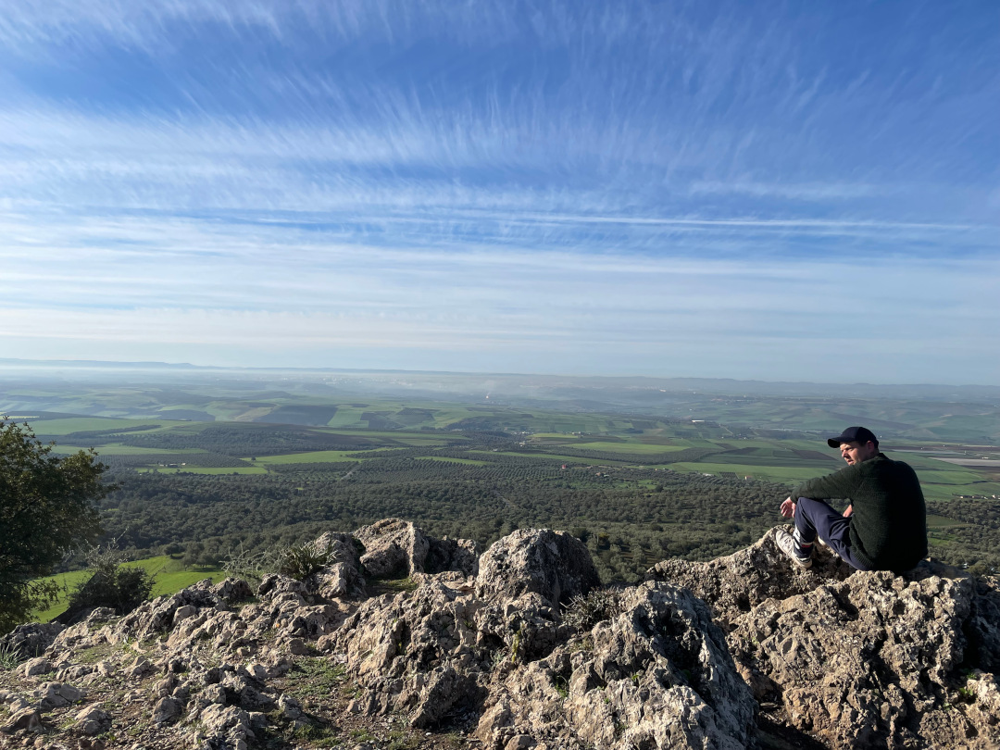

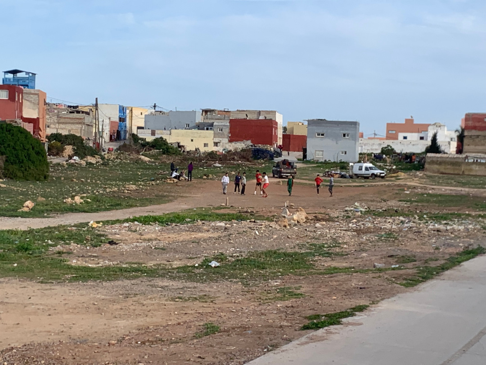

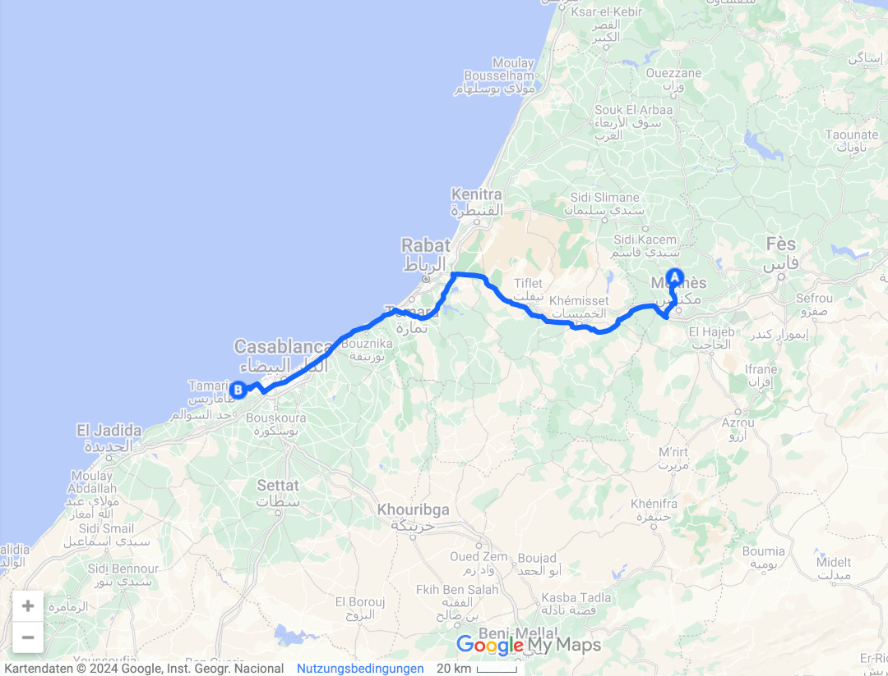

🗓️ 2. März: Aufgrund der sehr städtischen Lage und dank des Muezzins sind wir relativ früh wach. Unsere Planung gestern Abend hat ergeben, dass wir heute den Bulli in der Morocco Mall parken, dann Casablanca erkunden und bei Berrechid (ca. 20 km vor Casablanca) in einem traditionellen Riad zwei Nächte schlafen. Deshalb machen wir uns auf den Weg zur Morocco Mall. Hier können wir den Bulli in einer Tiefgarage sicher und kühl abstellen, so dass Henry sich den Trubel in Casablanca nicht antun muss. Passend dazu haben wir damit schon eine Sehenswürdigkeit von Casablanca abgehakt. Die Morocco Mall wurde 2011 eröffnet und ist das größte Einkaufscentrum in Afrika. Hier gibt es wirklich jeden Scheiß. Sogar ein Aquarium über die drei Etagen mit Haien. Für 25 MAD (2,50 €) kann man sich mit dem Aufzug in die Mitte fahren lassen. Das Publikum hier ist wie bei den Supermärkten auch eher das der Besserverdienern, so dass wir hier nur einen kurzen Abstecher machen. Von der Mall geht es mit dem Taxi zur Hassan II. Moschee. Mittlerweile klappt unser Verhandeln echt gut, so dass wir diesen Tag sehr gut und günstig Taxi fahren können. Stilecht erreichen wir mit Celine Dion aus dem Radio die Moschee. Die Hassan II. Moschee liegt direkt am Atlantik und ist das Wahrzeichen von Casablanca. Die Moschee wurde 1993 eröffnet (vorher hatte Casablanca also kein Wahrzeichen) und besitzt das zweitgrößte Minarett der Welt. Im Übrigen ist es die einzige Moschee in Marokko die fotografiert werden darf. Da der Eintritt relativ teuer ist, verzichten wir auf einen Besuch von innen. Stattdessen laufen wir in die Medina, die Altstadt von Casablanca. Da heute Samstag ist, ist hier wirklich viel los und die Medina ist wirklich noch ursprünglich geprägt. Wir sind die einzigen Touristen, was nach den Besuchen in den Altstädten von Tanger und Chefchaouen sehr ungewohnt ist. Niemand spricht dich an, niemand möchte dich auf Englisch in seinen Laden lotsen und niemand möchte dir etwas schenken bzw. verkaufen. Stattdessen wird alles verkauft, was es gibt. Tote Fische liegen neben ausarrangierten Mikrowellen aus Europa und Hühner, die in Käfigen auf Ihren Tod warten, stehen neben den gefälschten Kevin Klain Unterhosen. Dazu überall die Graffitis des Fußballvereins Wydad Casablanca und die streunenden Katzen und Hunde. Ein deutlicher Unterschied zu den Touristenorten. Wir fallen natürlich auf und werden von den Kindern gegrüßt, aber alles bleibt entspannt. Nach diesem Trubel und den Gerüchen der Fische und Hühner ist uns schon etwas übel, so dass wir uns auf den Weg in den neueren Teil der Stadt machen. Wir laufen über den Platz der vereinten Nation und durch den Park der arabischen Liga. Hier ist alles sauber, grün und das Wasser spritzt aus den Fontänen vor den großen Palmen. So erkennt man das große soziale Gefälle dieser Stadt. Mittlerweile hat sich unser Gemüt wieder etwas erholt und wir suchen uns ein Restaurant zum Mittagessen/Nachmittagessen. Die Restaurants sind top und günstig. Gut gestärkt wollen wir zum Raja Shop aufbrechen. Raja Casablanca ist der zweite Verein der Stadt. Wir wollen uns Tickets für das morgige Spiel besorgen. Weil das Stadion in Casablanca renoviert wird, findet das Spiel morgen in Berrechid statt. Zum Glück haben wir zufällig unser Riad in dieser Stadt ausgewählt. Wir halten ein Taxi an, in dem aber schon eine junge Marokkanerin sitzt. Generell halten alle Taxis in Marokko an und nehmen dich mit, wenn im Taxi noch Platz ist. Egal ob man davor noch andere Leute woanders hinbringen muss. In diesem Fall ist das unser Glück. Die Marokkanerin arbeitet in der belgischen Bootschaft und spricht perfekt Englisch und kann so übersetzen. Denn unser Taxifahrer kann nicht glauben, dass wir aus dem Wydad Bezirk zum Raja Shop fahren wollen. Das machen nicht viele. Die Marokkanerin ruft parallel ihren Freund an, der Raja Fan ist, ob man noch Tickets kaufen kann. Er meint am Telefon, dass das Spiel wegen der letzten Ausschreitungen ohne Fans stattfindet. Dennoch sollten wir es versuchen, ggfs. bekommen wir VIP-Tickets. Der Taxifahrer bringt die Frau nach Hause und bringt uns mehr oder weniger sicher zum Shop. Leider bekommen wir weder im Shop noch am Trainingsplatz Tickets. Wir sprechen sogar mit dem Vereinsfotografen, alle sagen nur „sans spectateurs“. So müssen wir ohne Tickets das nächste Taxi zurück zur Morocco Mall nehmen. Dort kommen wir auch sicher an, nachdem wir alle anderen Mitfahrer dort rauslassen, wo sie hinwollen. Der Länderpunkt Marokko wird also doch schwieriger als erwartet. Doch darüber wollen wir uns morgen Gedanken machen. Jetzt fahren wir erstmal zum Riad in Berrechid. Hier erwartet uns ein traditionelles Landhaus mit vielen Tieren. Wirklich ein traumhaftes Haus mit einem sehr coolen Empfangsbereich. Die Schwierigkeiten mit dem schlechten WLAN können wir beheben, das fehlende warme Wasser in der Dusche leider nicht. Wir gehen noch eine Runde mit Henry die Umgebung erkunden. Als letzte Tat des aufregenden Tages essen wir noch etwas und gehen dann erschöpft ins Bett.

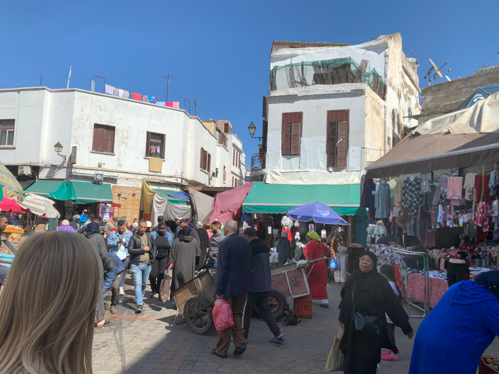

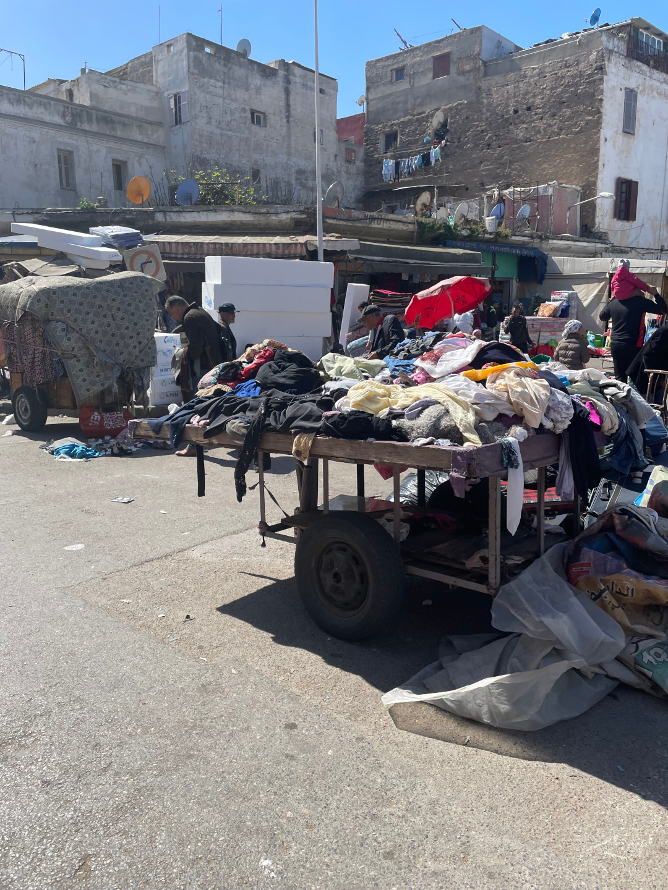

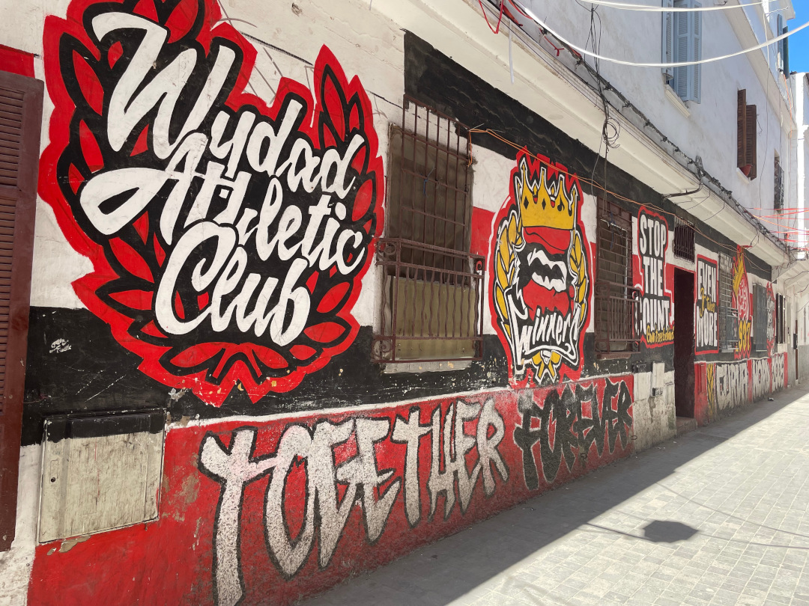

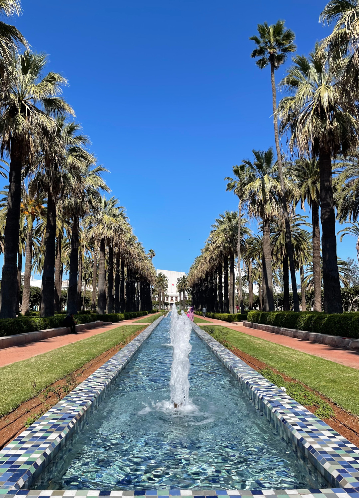

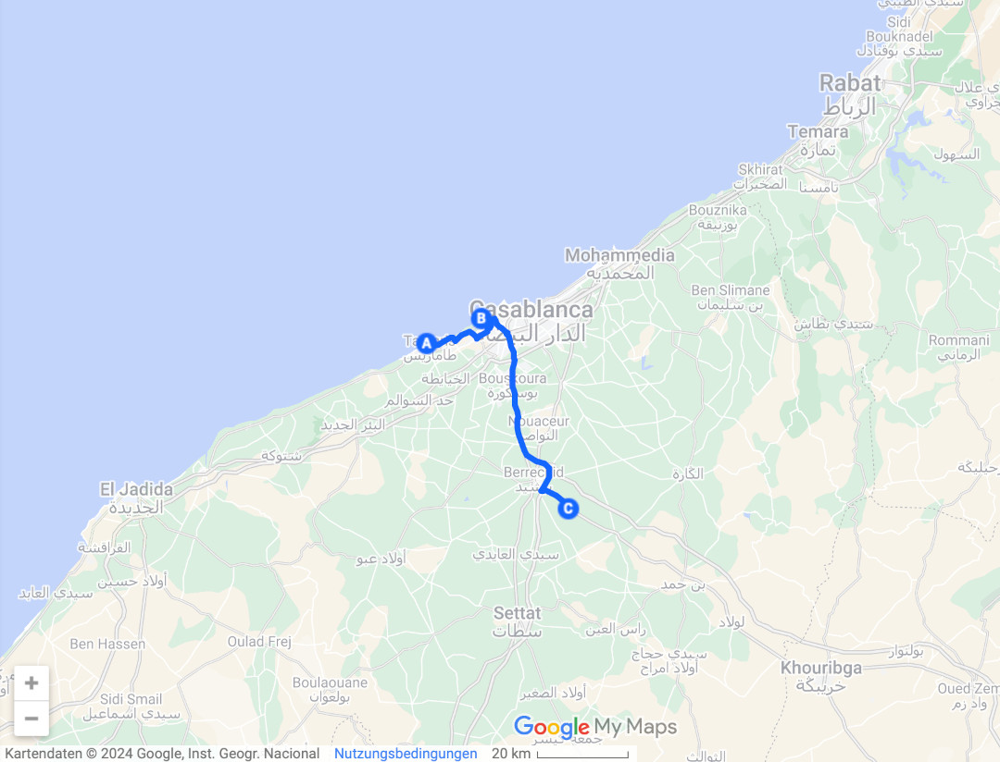

🗓️ 3. März: Die Nacht ist sehr entspannt und tut gut. Nach der kalten Dusche und einer Henry-Runde geht es zum Frühstück, was wir glücklicherweise mitgebucht haben. Es gibt Tee, Fladenbrot, Oliven, Öl, Spiegelei, Honig und Marmelade. Eine gute Basis, um den Tag zu planen. Wir entscheiden uns ein Fußballspiel in Mohammedia zu schauen, weil ein Geisterspiel (selbst wenn wir noch ins Stadion kämen) nicht das Gelbe vom Ei ist. Dazu wollen wir mit dem Taxi nach Berrechid zum Bahnhof und dann mit dem Zug nach Mohammedia fahren. Hier spielt heute Sportive Soualem gegen Maghreb Tetouan. Sportive Soualem trägt seine Heimspiele eigentlich in Berrechid aus, was aber ja heute durch das Geisterspiel von Raja nicht möglich ist. Daher weicht Sportive nach Mohammedia aus. Man merkt, dass die Spieltagsplanung in Marokko gut durchdacht ist. Unser Zug kommt um 14 Uhr, also besprechen wir mit der Rezeption, dass unser Taxi um 13:20 Uhr abfahren sollte. Obwohl es keine Zeitverschiebung gibt, ist 13:20 nicht gleich 13:20 Uhr. Dennoch erreichen wir pünktlich den Bahnhof. Müssen jedoch feststellen, dass die Fahrkartenautomaten nicht funktionieren. Alle müssen sich in der Schlange vor dem Ticketschalter anstellen. Schlangen gibt es in Marokko aber höchstens im Atlasgebirge. Trotzdem können wir nach etwas kämpfen pünktlich zum Gleis gehen. Weil der Zug ausgebucht ist, hat uns der Schaffner den nächsten für 15 Uhr verkauft. Das hätte aber nicht mit dem Anpfiff in Mohammedia gepasst. Daher versuchen wir dennoch zum Zug zu kommen. Mit unseren Tickets dürfen wir aber nicht aufs Gleis, weil die Tickets vorher kontrolliert werden. Nach einer kleinen Diskussion bringt uns der Kontrolleur eilig persönlich zum Gleis und fragt den Schaffner, ob wir noch mitfahren dürfen. Als letzte dürfen wir den Zug besteigen. Man merkt sofort, dass der Zug ausgebucht ist, was aber nicht nur an zwei Personen mehr liegt. In Mohammedia angekommen besorgen wir uns direkt am Schalter zwei Rückfahrtickets, um den Zeitstress später zu umgehen. Danach laufen wir zum Stadion. Es kommen uns schon sehr viele Gästefans entgegen. So sind wir uns zumindest sicher, dass es mit Zuschauern ausgetragen wird. Und tatsächlich gibt es ein Kassenhäuschen, das noch Tickets verkauft. Für ca. 3,80€ ergattern wir Tickets auf der Haupttribüne. Es ist auch lediglich diese Tribüne und der Gästeblock gefüllt. Im Stadion sind ca. 2000 Zuschauer, davon 1.500 Gäste aus Tetouan. Die Fans legen auch richtig gut los und singen die typischen südländischen Dauergesänge mit den professionellen Trommlern. Schlachtrufe gibt es sehr wenig, ebenso wie Zaunfahnen, Trikots oder Schals. Nur zur zweiten Halbzeit gibt es ein kleines Intro bzw. Choreo, aus kleinen rot-weißen Fahnen und zwei weiteren Zaunfahnen. Die kleinen Fahnen werden aber vom Mob nach 5 Minuten wieder eingesammelt. Das Spiel ist in der ersten Halbzeit grausam. Die zweite Halbzeit ist dagegen sehr gut. Tetouan gewinnt schlussendlich 2:1, was die Stimmung natürlich aufheizt. Hanna sammelt übrigens auch schon Ihren 10. Länderpunkt. Nachdem Spiel bleibt uns sogar noch etwas Zeit für ein Abendessen bei Marius Mohammedia und um 19:12 Uhr geht es pünktlich mit der Bahn zurück nach Berrechid. Natürlich ist auch dieser Zug viel zu voll, aber die Fahrt verläuft reibungslos. Die Taxifahrt zurück zum Riad verläuft dagegen weniger reibungslos. Wir müssen sogar das Taxi wechseln und in einem anderen weiterfahren. Nichtsdestotrotz kommen wir heile an.

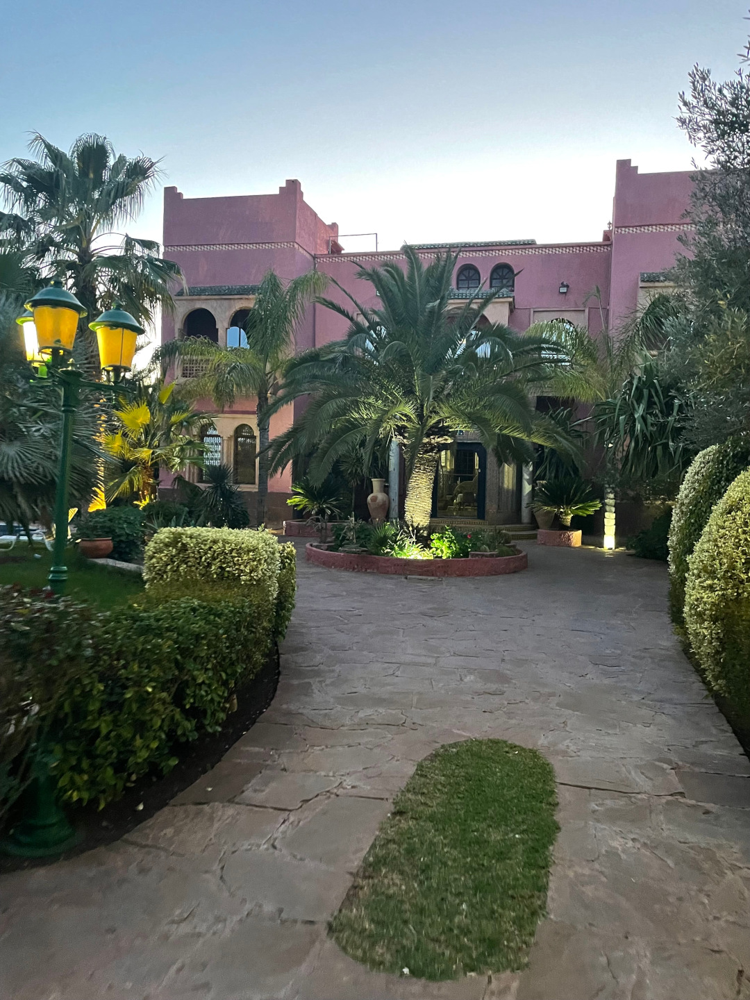

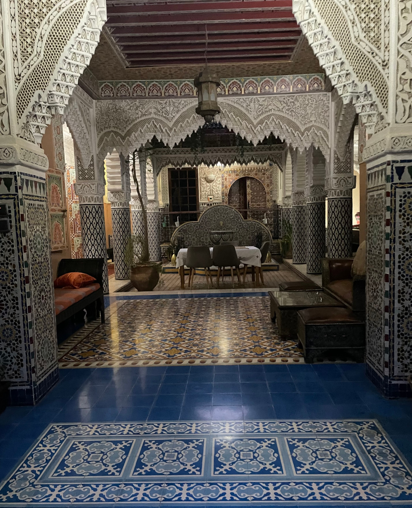

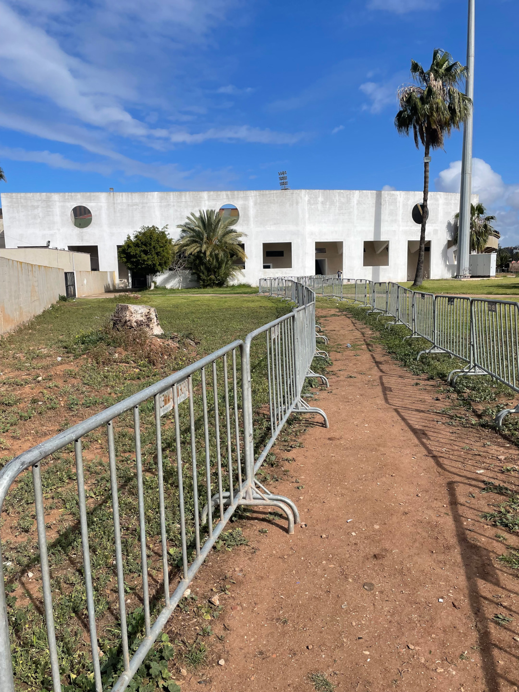

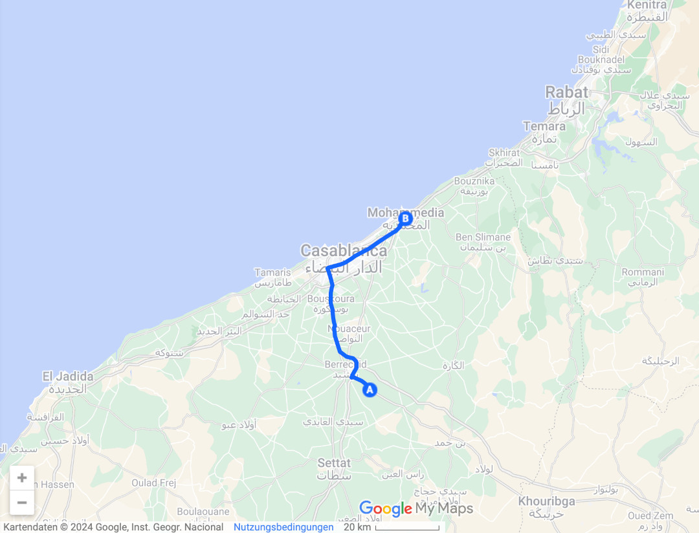