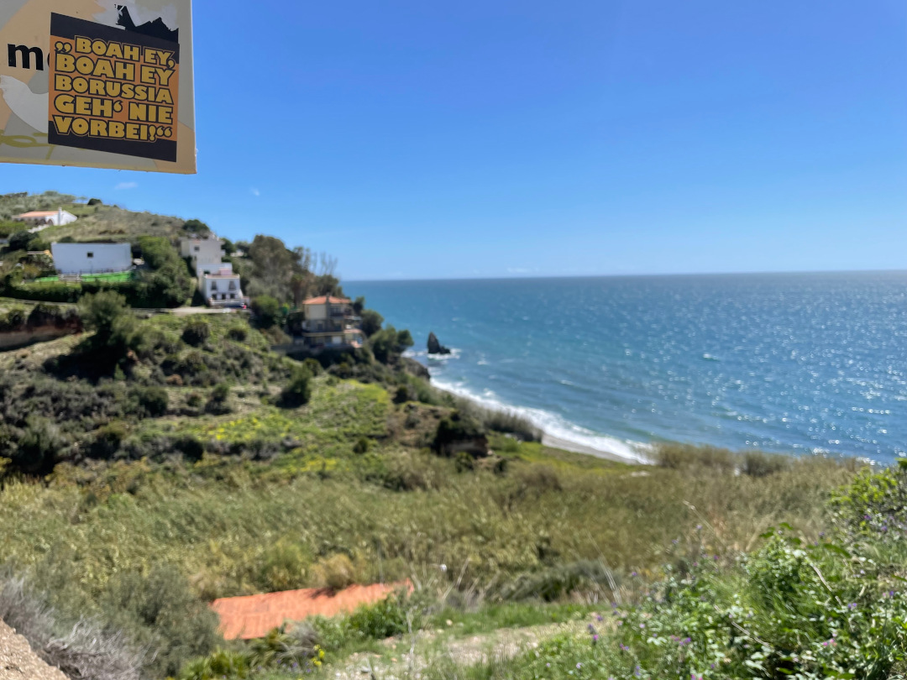
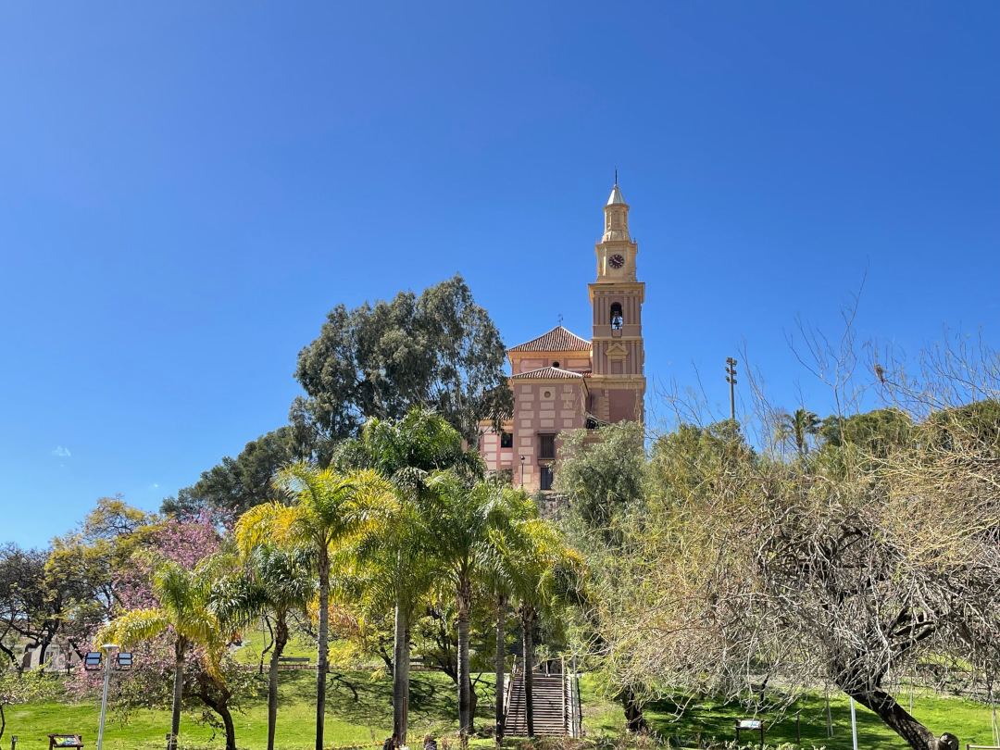
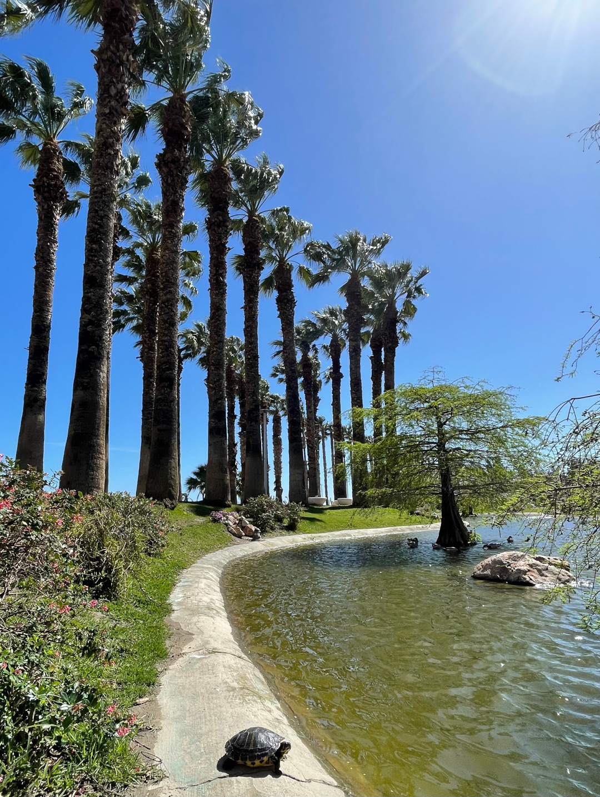
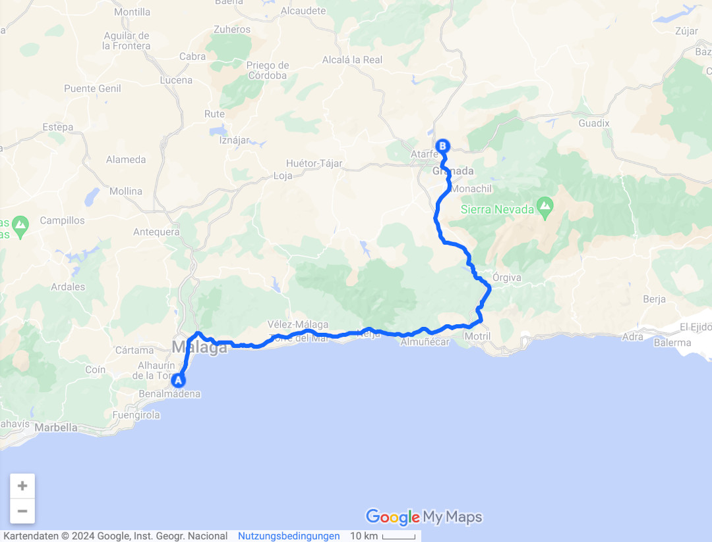
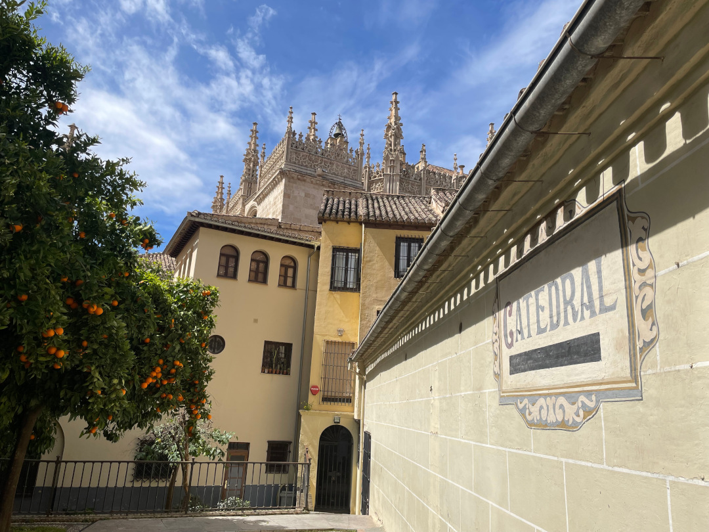
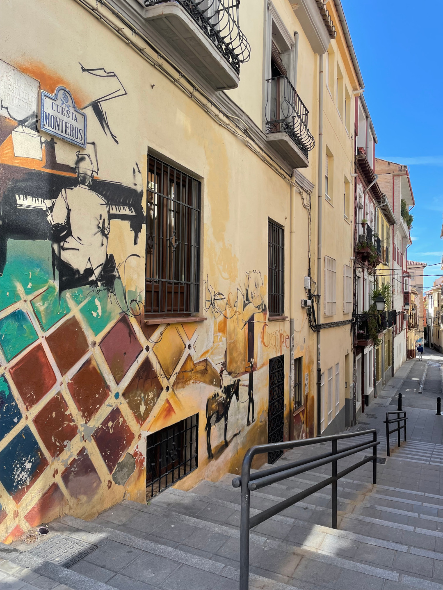
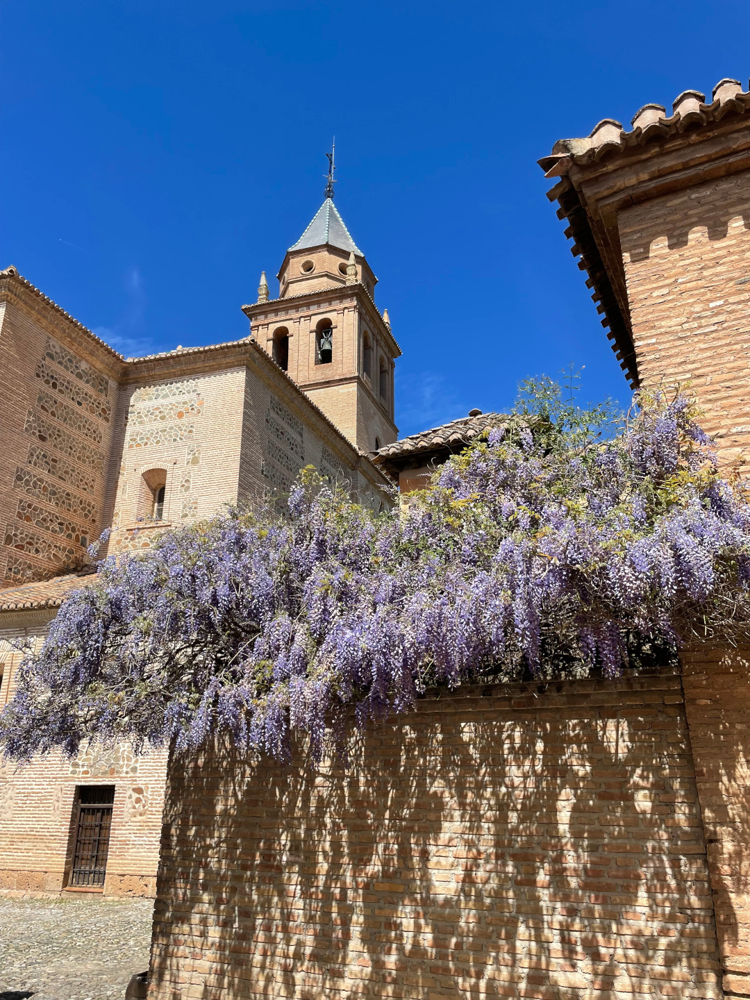
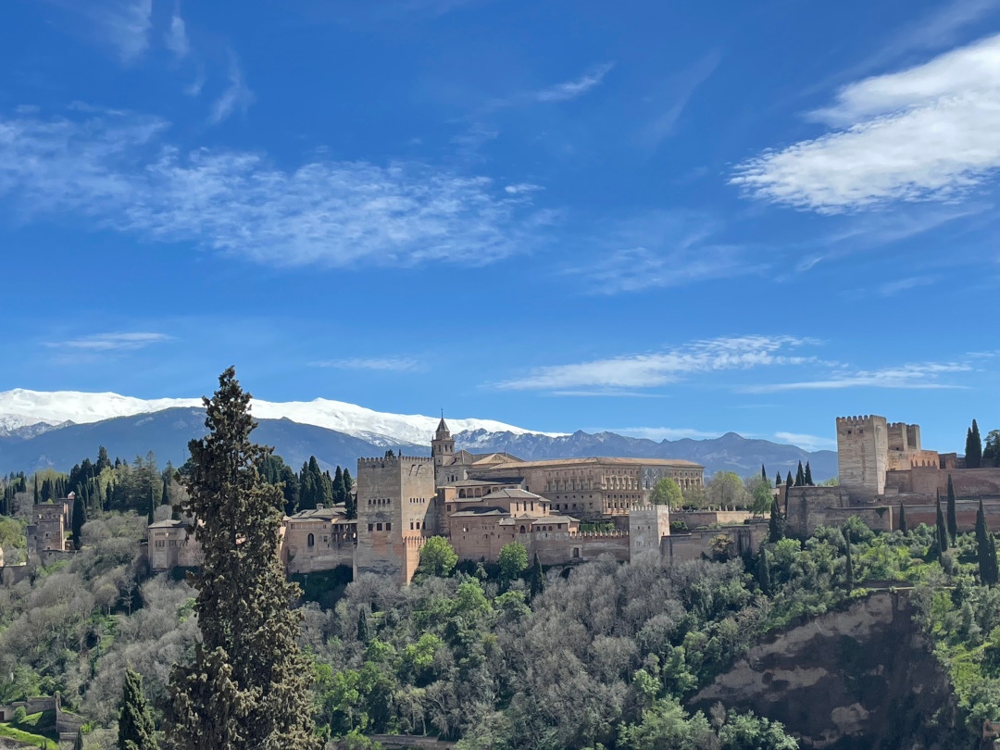
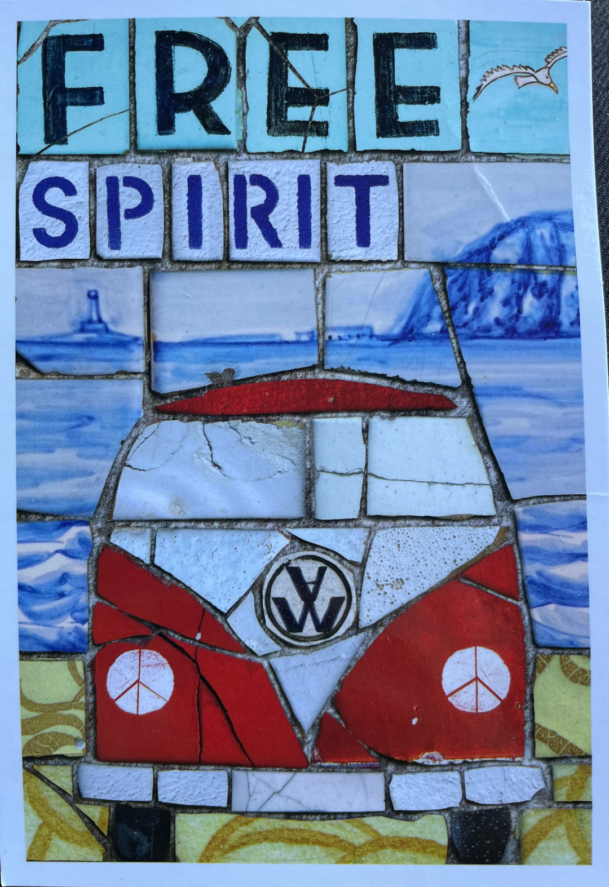

Endlich ist der Regen wieder vorbei! Wir machen uns langsam auf den Weg in die Berge und lassen das Mittelmeer hinter uns.

<!--more-->

🗓️ 1. April: Auch unsere dritte freistehende Nacht in Spanien ist sehr entspannt und so wachen wir direkt am Meer auf. Am glücklichsten macht uns nach drei Regentagen dabei die strahlende Sonne und der blaue Himmel. Das macht unser Campingleben auf jeden Fall einfacher. Ein Strandspaziergang am Morgen darf da natürlich nicht fehlen. Danach machen wir uns auf den Weg ins das naheliegende Outlet bei Málaga. Wer so viel läuft, braucht definitiv mal neue Schuhe. Es ist zum Glück überhaupt nicht voll und so können wir uns alles ganz in Ruhe angucken. Hinter dem Outlet steckt aber derselbe Betreiber wie in Roermond und Neumünster, so dass alles genauso aussieht, wie wir es von dort kennen. Das hätten wir also auch mit deutlich kürzerer Anreise haben können. Bis auf unser Highlight, das es nur hier gibt: das Haribo-Outlet mit coolen Sorten. Den Supermarkt nehmen wir auch noch mit und dann fahren wir weiter die Küste entlang Richtung Osten. Unterwegs suchen wir uns nochmal einen schönen Platz am Meer und legen eine ausgiebige Pause ein, bevor wir weiter nach Motril fahren. Die Stadt ist vor allem für ihren schönen Park bekannt und so schlendern wir mit einem Eis bewaffnet hindurch. Kleine Schildkröten baden im Teich und es gibt noch eine Sammlung von Kakteen. Anschließend düsen wir weiter Richtung Granada. Die Stadt liegt etwas im Landesinneren und liegt auf unserem Weg in den Nationalpark Sierra Nevada. Heute fahren wir aber erstmal etwas an der Stadt vorbei zu einem Campingplatz, von dem aus man einen guten Blick über die Stadt und vor allem auf die schneebedeckten Gipfel in der Ferne hat. Der Platz ist sehr nach unserem Geschmack, schön grün und nicht überfüllt und so entscheiden wir direkt, dass wir hier zwei Nächte bleiben. So können wir morgen auch mit dem Bus nach Granada fahren und der Stadtausflug wird für uns noch entspannter.

🗓️ 2. April: Wir schlafen ganz schön lang. Wahrscheinlich haben wir unsere zweite Uhrumstellung noch nicht ganz verinnerlicht und so machen wir uns erst gegen Mittag auf den Weg zur Bushaltestelle, um in die Stadt zu fahren. Die Fahrt ist viel kürzer als angegeben, weil der Bus einfach durchbrettert, statt auf die Fahrzeiten zu achten. Wir landen eigentlich direkt in der Altstadt und unser erster Weg führt uns zur Kathedrale von Granada. Dann nehmen wir noch verschiedene Plätze und Gassen mit, bevor wir uns an den Aufstieg zur berühmten Alhambra machen, die als eine der meistbesuchten Touristenattraktionen Europas gilt. Schon der Weg dorthin führt schön durchs Grüne und die Burganlage selbst kann sich auch sehen lassen. Die quadratischen Türme erkennen wir vom Gesellschaftsspiel auf jeden Fall wieder und die Länge der Mauer könnte auch gewinnen. Oben angekommen kaufen wir auch noch eine Postkarte, aber dieses Mal für uns statt zum Verschicken. Nachdem es wieder runter in die Altstadt geht, geht es auf der anderen Seite der Stadt direkt wieder all die Meter hoch zum besten Aussichtspunkt der Stadt, denn am beeindruckendsten ist die Alhambra doch aus der Ferne. Vor allem zu dieser Jahreszeit mit den schneebedeckten Gipfeln im Hintergrund. Die Schneedecke sieht auch richtig dick aus. Wahrscheinlich kam alles, das in letzter Zeit auf uns runtergeregnet kam, da oben als Schnee runter. Die Aussicht ist auf jeden Fall top. Anschließend setzen wir uns noch in ein Restaurant, aber dann wird uns klar, dass wir lieber im Ort bei unserem Campingplatz Tapas essen würden. Deshalb nehmen wir schnell wieder Reißaus und wollen zum Bus. Die Abfahrt ist aber noch etwas hin, so dass wir noch fix in den Supermarkt gehen. In Peligros angekommen merken wir dann, dass wir (mal wieder) die Siesta nicht auf dem Schirm hatten. Die Küche öffnet erst um 20 Uhr. Es ist 17:30 Uhr und wir haben heute noch nicht besonders viel gegessen. So müssen wir mit unserem Fundus im Bulli vorliebnehmen. Vielleicht hätten wir doch lieber nicht Reißaus nehmen sollen.

