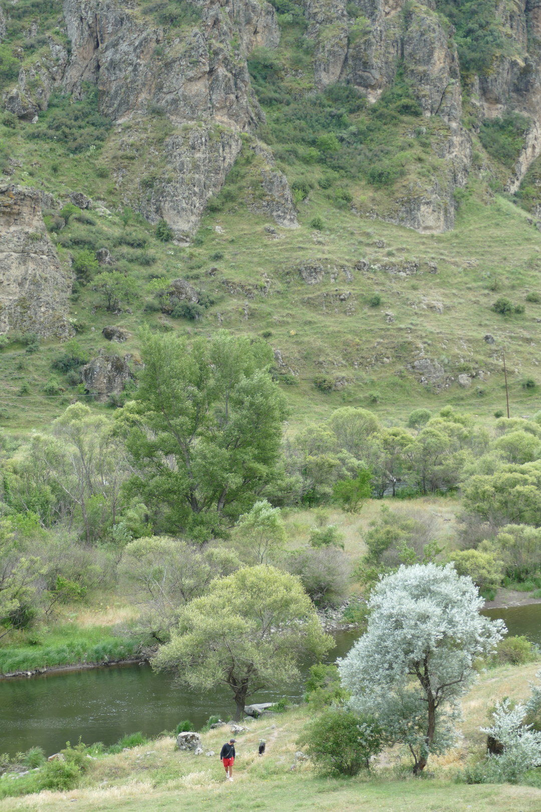
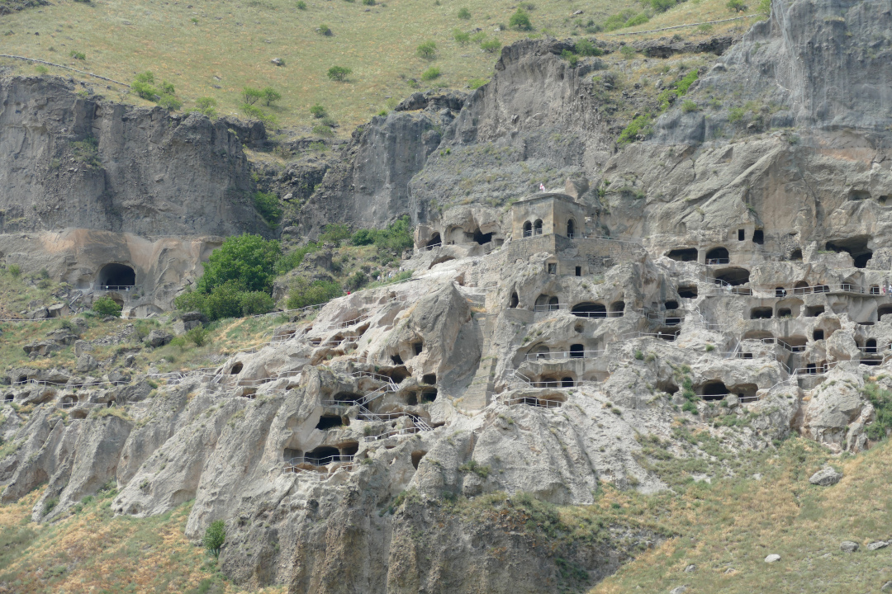
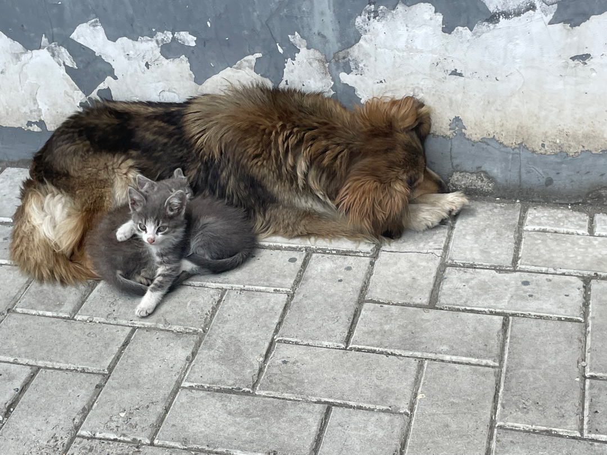
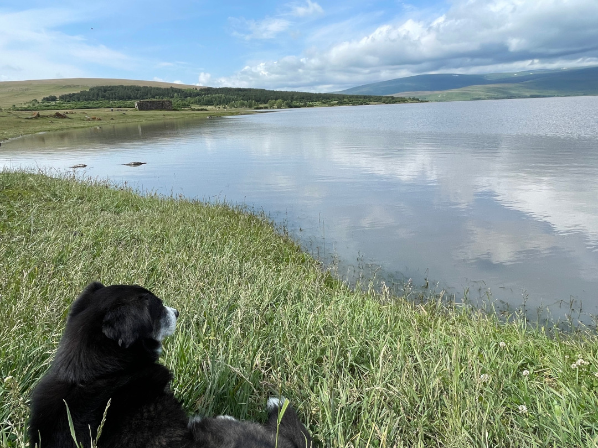
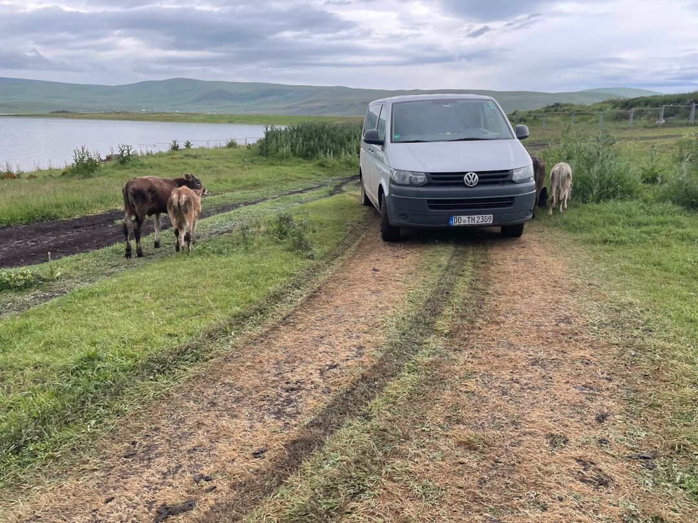
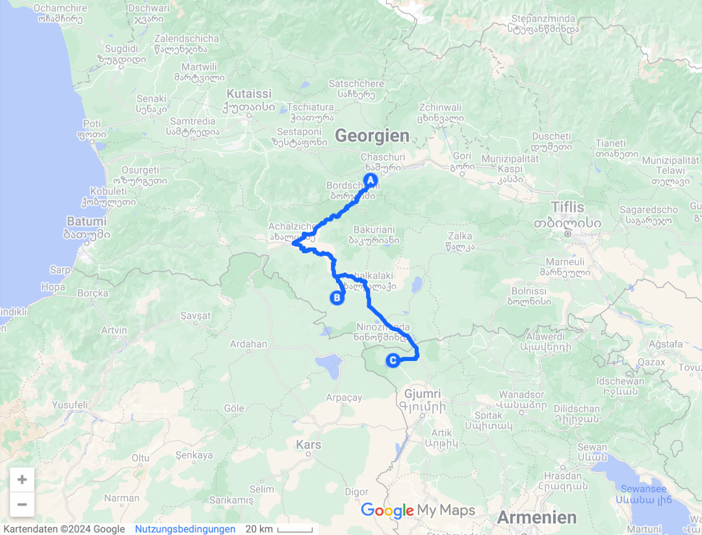
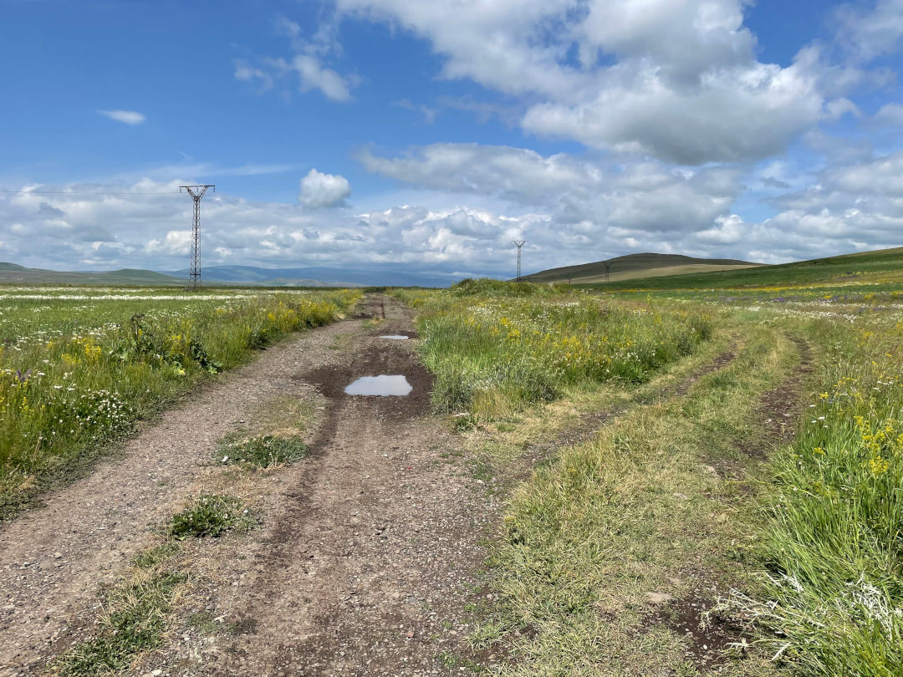
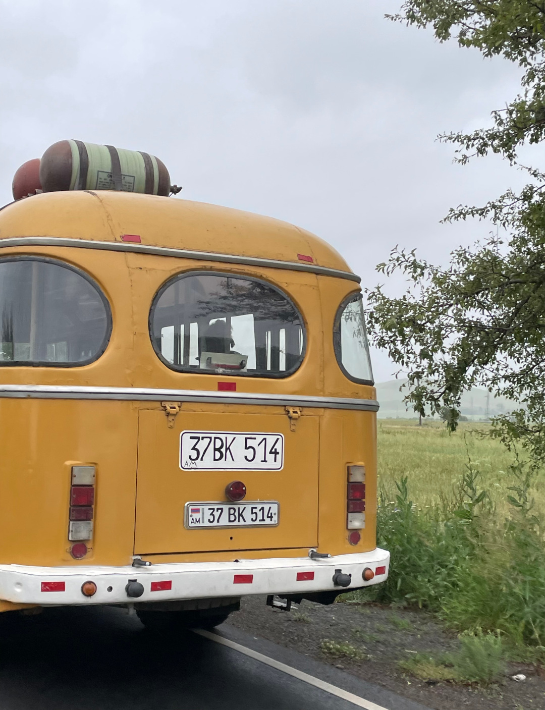
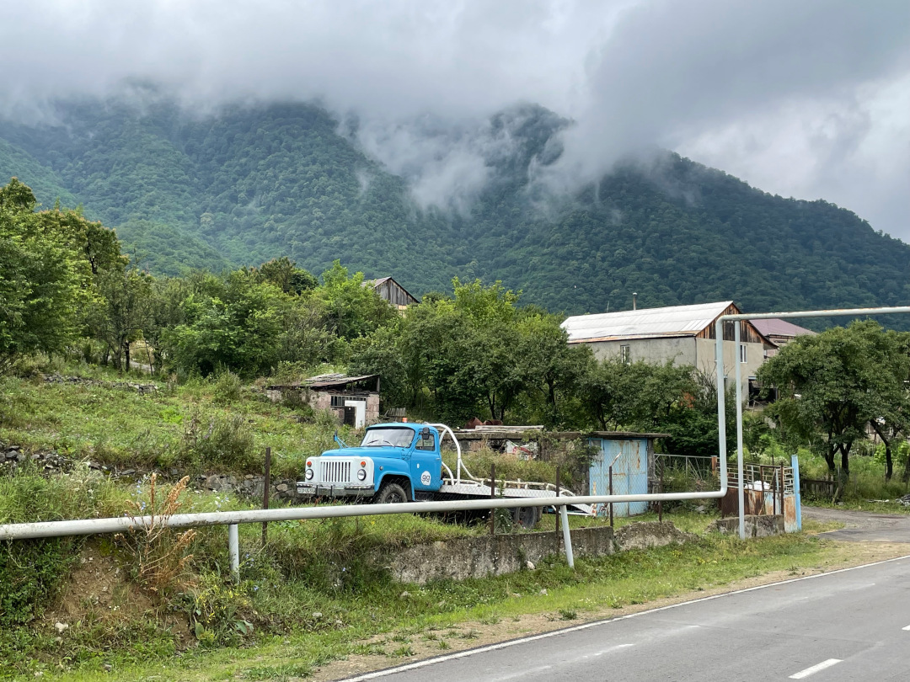
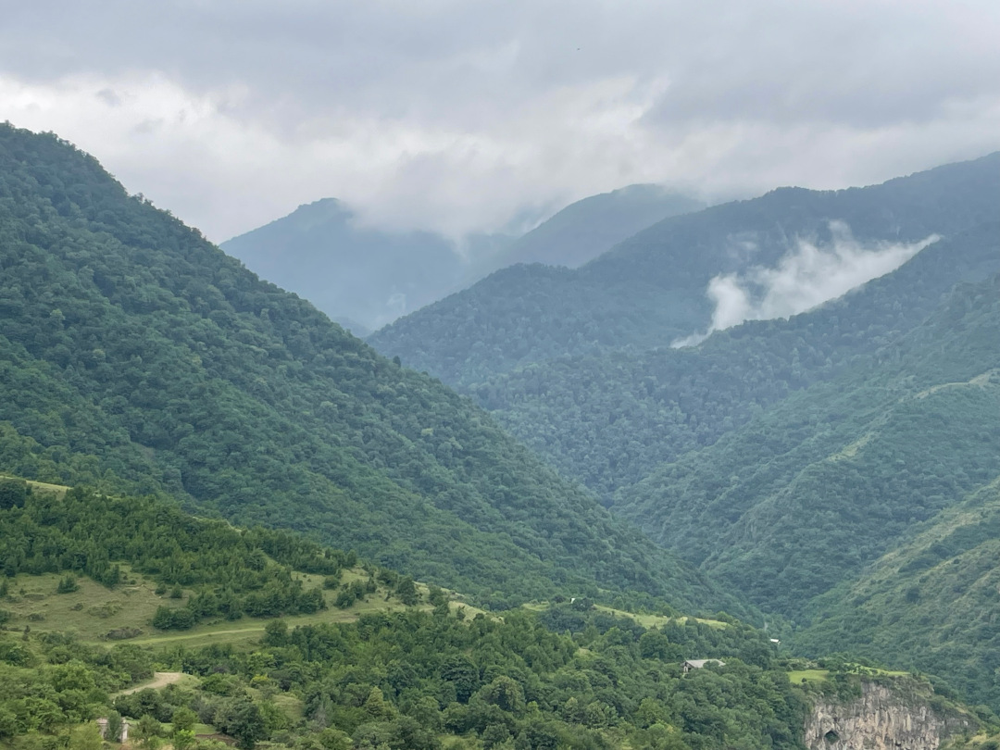

Mit drei Tagen „Verspätung“ erreichen wir nun auch endlich Armenien.

<!--more-->

🗓️ 01. Juli: Wir wachen auf und werden quasi als erstes wieder auf einen Tee eingeladen. Wir und der Bulli müssen uns aber erst abfahrbereit machen, weil wir heute aber nun wirklich nach Armenien fahren möchten. Wir trinken noch einen Tee zusammen und verabschieden uns dann endgültig von dem netten georgischen Paar. Mit vielen Geschenken und Essen an Board fahren wir in Richtung der armenischen Grenze. Auf dem Weg halten wir noch kurz am Höhlenkloster Wardsia an, einer der Top Sehenswürdigkeiten in Georgien. Es wurde als Höhlenstadt im 12. Jahrhundert geplant und später aber nur als Kloster genutzt. Um eine ausgiebige Erkundungstour im Inneren zu machen, fehlt uns etwas die Zeit. Daher wandern wir etwas von außen unten an dem Felsen entlang. Von hier aus ist die Aussicht sowieso besser. Danach geht es weiter nach Armenien. Wir tanken ein letztes Mal den unglaublich günstigen georgischen Diesel und werden von einem schlafenden Hund und zwei Katzen am Straßenrand aus Georgien verabschiedet. Wir steuern einen relativ kleinen Grenzübergang an. Hanna muss wieder zu Fuß über die Grenze. Wir dachten ja die Grenze Türkei-Georgien wäre schon umfangreich, aber heute ist es das noch mehr. Die erste Kontrolle findet also von einem Polizisten im Auto statt, der Hanna zur Fußkontrolle schickt, den Bulli kontrolliert und mich weiter zum georgischen Beamten schickt. Die Kontrolle klappt relativ problemlos und die Ausreise ist erfolgt. Auf armenischer Seite empfängt mich wieder ein Polizist im Auto, der ebenfalls den Bulli kontrolliert und mich zu einem freien Schalter schickt. Am Schalter das übliche Spiel mit Reisepass und Autodokumenten. Die Frau ist auch relativ freundlich und wünscht mir viel Spaß in Armenien. Dann folgt der Zollbeamte, der ebenfalls in den Bulli guckt. Er beschließt, dass eine gründlichere Untersuchung notwendig ist und er schickt den Bulli zunächst auf die Waage. Da ist ein anderer Beamter zuständig. Ich gebe ihm alle Dokumente und warte ewig darauf, wie es weitergeht. Irgendwann fragt er mich, ob der Bulli ein Car-Home ist. Ich sage einfach ja und bekomme alle Dokumente und einen Zettel wieder. Jetzt muss der Bulli zum Röntgen, wo es zum Glück nicht so voll ist. Wieder gebe ich alle Dokumente ab und warte. Ich bekomme grünes Licht und alle Dokumente wieder. Es geht zurück zum Zoll. Hanna und ich sind jetzt auch endlich wieder zu zweit und gehen zum Bankschalter, um die Einreise- und Umweltgebühr zu entrichten. Danach geht es zum richtigen Zoll, der uns bestätigt, dass das Auto einreisen darf. Das dauert wieder eine Ewigkeit. Zum Glück ist neben uns noch ein deutscher Motoradfahrer und wir können die Zeit mit Smalltalk überbrücken. Endlich bekommen wir alle wichtigen Zettel für die Einreise. Danach geht es erneut zur Bank, um Bargeld für die Versicherung abzuholen, weil man noch verpflichtend eine KFZ-Versicherung abschließen muss. Das geht dann aber relativ fix und ist auch nicht ganz so teuer. Endlich können wir nach Armenien einreisen und fahren vom Grenzgelände runter. Natürlich folgt noch eine Abschlusskontrolle, wo alle Dokumente und Zettel ein letztes Mal kontrolliert werden und dann ist es geschafft: Wir sind nach zwei Stunden Grenzkontrollen in Armenien. Bei solchen Grenzen lobt man sich doch die EU. Mittlerweile hat es allerdings heftig angefangen zu regnen und die Temperatur fällt auf 9 Grad. Kurzzeitig überlegen wir die erste Nacht in Armenien im Hotel zu schlafen, haben dann aber keine Lust aufs Hotel und fahren noch ca. 20 Kilometer zum Lake Arpi Nationalpark. Hier kann man auch übernachten. Wir bekommen schon einen Vorgeschmack auf die armenischen Straßen und merken, dass 20 km sehr lang sein können. Am Nationalpark angekommen melden wir uns bei dem Ranger an. Er legt zwar sein Handy nur ungern zur Seite, aber ruft dann seinen Kollegen an, der uns erklärt, dass wir für 5000 armenische DRAM (13€) im Nationalpark schlafen können. Das ist zwar relativ teuer, aber was soll man machen. Dafür steht man relativ sicher. Wir fahren auch nur fast 500 Meter in den Park und bleiben nach einer echten Rutschpartie im Matsch notgedrungen stehen. Durch den heftigen Regen haben wir keine andere Wahl. Wir stehen direkt am Ufer des Arpi Sees umgeben von Schafen und Kühen und weitem Blick auf die Hügellandschaft. Die Strapazen haben sich gelohnt. Armenien begrüßt uns zwar mit Regen und schlechten Straßen, aber dafür landschaftlich super schön. Es ist schon spät und es regnet durchgehend. Daher gibt es unsere letzten beiden deutschen Dosenravioli (gekauft in Rumänien) - kalt natürlich.

🗓️ 02. Juli: Während der Nacht hat es zum Glück aufgehört zu regnen. Um unseren Bulli herrscht reges Treiben. Ein paar Angler und vor allem wieder Kühe und Schafe laufen drumherum, aber es macht den Anschein, als wären es alle gewohnt. Wir drehen noch eine Runde mit Henry am See und machen uns abfahrbereit. Die Fahrt klappt besser als gestern, weil es nicht mehr so nass ist. Gerade als wir den Nationalpark verlassen wollen, drängt uns ein georgischer Jeep zum Anhalten. Der Beifahrer steigt aus und spricht uns im besten Englisch an. Es ist der Kollege vom Ranger, mit dem wir gestern telefoniert haben. Er sagt, dass ihm aus Versehen die falsche Zahl herausgerutscht ist und wir nur 3000 DRAM (7,50€) zahlen hätten sollen. Er gibt uns 2000 DRAM wieder und ist schnell wieder weg. Wir gucken uns verdutzt an und denken dann, dass der Fahrer wohl sein Chef war und der herausgefunden hat, dass die beiden (Ranger und Kollege) den ausländischen Touristen zu viel Geld abkassieren. Das schon andere 5000 DRAM zahlen mussten, steht nämlich bei Park4Night. Also wird das nicht das erste Mal gewesen sein. Naja, uns soll es ja recht sein. Wir machen uns auf zu unserem heutigen Ziel Haghpat. Für die ungefähr 120 km benötigen wir um die vier Stunden. Für einen Abschnitt von 40 km brauchen wir knapp zwei Stunden. Mehr geben die Straßen einfach nicht her. Auf dem Land sind nur wenige Straßen asphaltiert und wenn dann ebenfalls mit vielen Schlaglöchern versehen. Selbst wichtige Fernstraßen sind nicht immer durchgehend asphaltiert. Das liegt aber auch daran, dass hier im Norden Armeniens im Mai heftige Regenfälle und Erdrutsche waren und die sowieso schon schlechten Straßen/Pisten nicht besser wurden. Das kann auf Dauer ganz schön anstrengend sein, wenn man neben dem Auto herlaufen könnte. Immerhin bleibt uns so mehr Zeit die schöne Landschaft anzugucken. Überall ist es so weitläufig und man sieht Autos und Busse, die niemals in Deutschland fahren würden. Aber sie sehen sehr cool aus. Wir halten in einem größeren Ort an, um einzukaufen. Es gibt sogar einen Bäcker mit belegten Brötchen, Pizza und Burger. Die Lebensmittelpreise sind aber schon sehr hoch und fast so teuer wie in Deutschland. Dafür bekommt man aber auch gute Sachen, auch wenn wir dafür in zwei Supermärkten und bei einem Bäcker waren. Wir holen noch Bargeld ab und fahren weiter. Am Nachmittag erreichen wir Haghpat und finden einen Stellplatz bei Martin im Garten. Einer von drei bis vier offiziellen „Campingplätzen“ in Armenien. Wir sind die einzigen, aber es gibt alles, was man braucht. Von dem Stellplatz laufen wir noch als Tagesabschluss zum Kloster Haghpat. Das im 10. Jahrhundert gegründete Kloster befindet sich noch fast im Originalzustand und wurde im Jahr 2000 in die Liste des UNESCO Weltkulturerbe aufgenommen. In Armenien kann man sich übrigens sehr viele Klöster angucken, aber heute kann man sagen, dass es sich lohnt. Zurück am Bulli kochen wir noch und können dank gutem WLAN mal wieder etwas recherchieren. Als die Sonne untergeht, hören wir das erste Mal Schakale unten im Canyon heulen. Sowas haben wir beide noch nie gehört und es klingt irgendwie verrückt.

