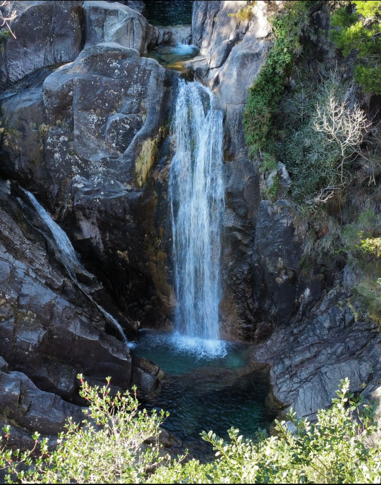
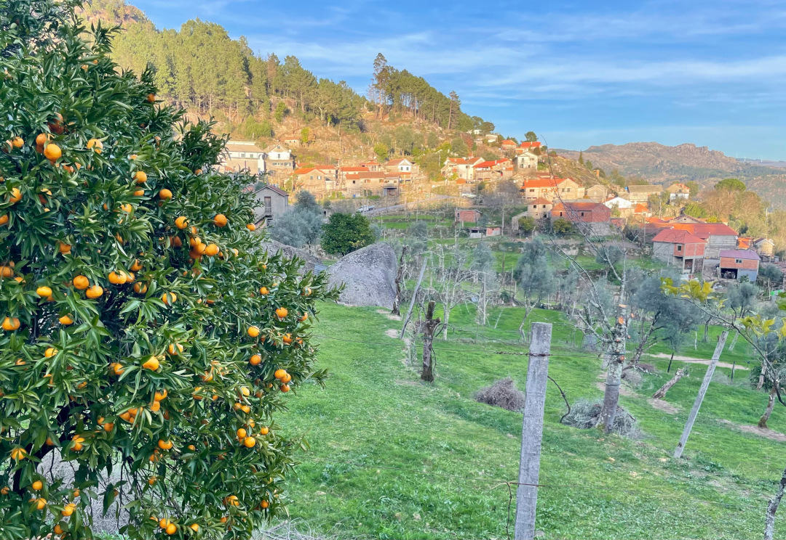
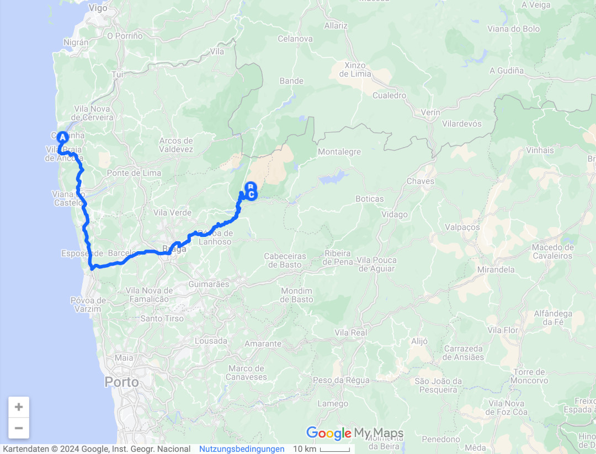
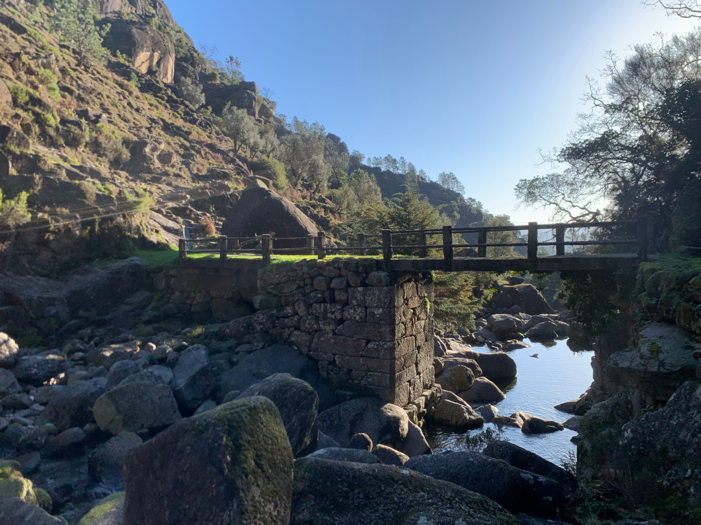
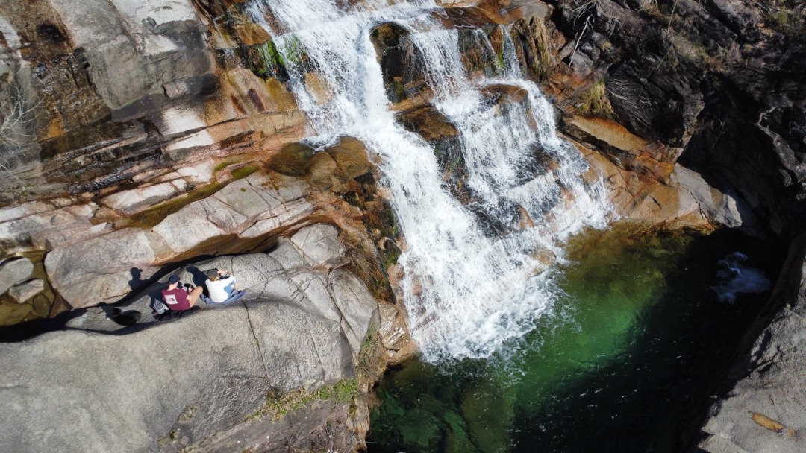
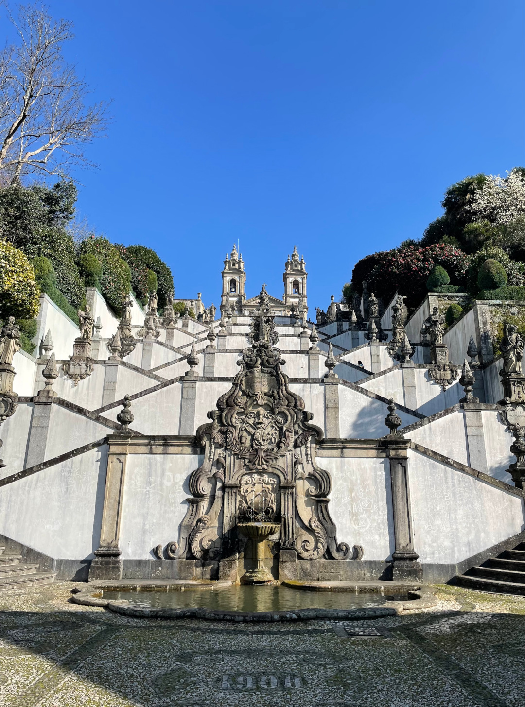
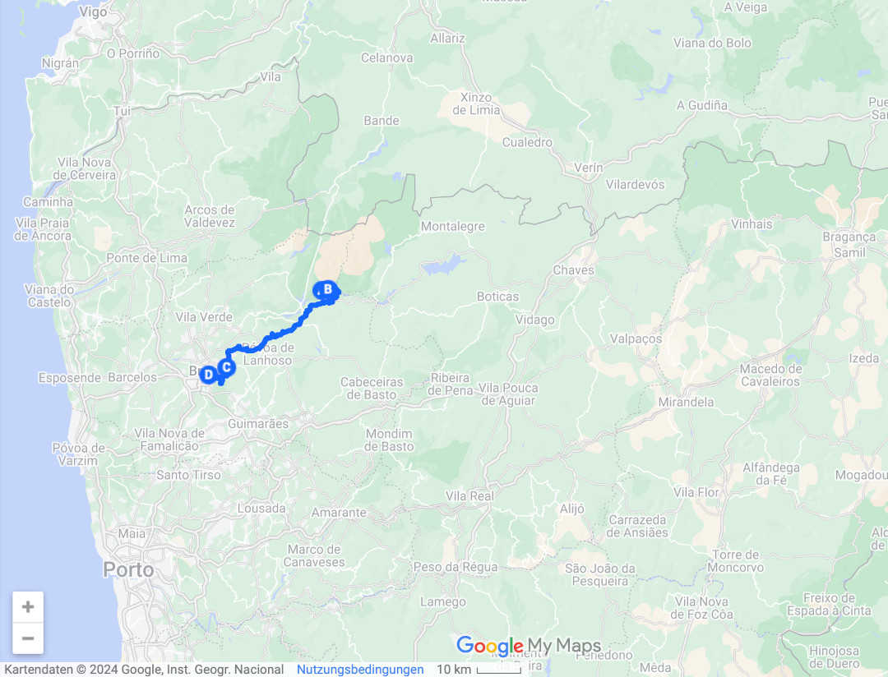
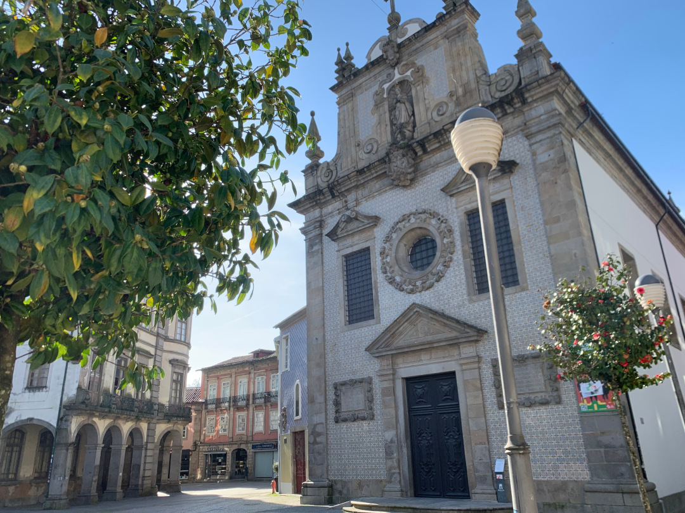
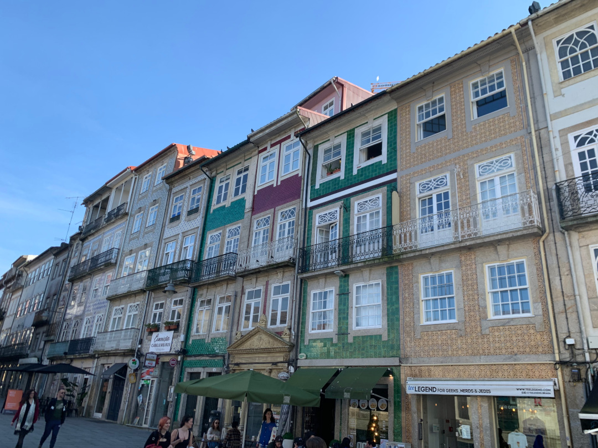
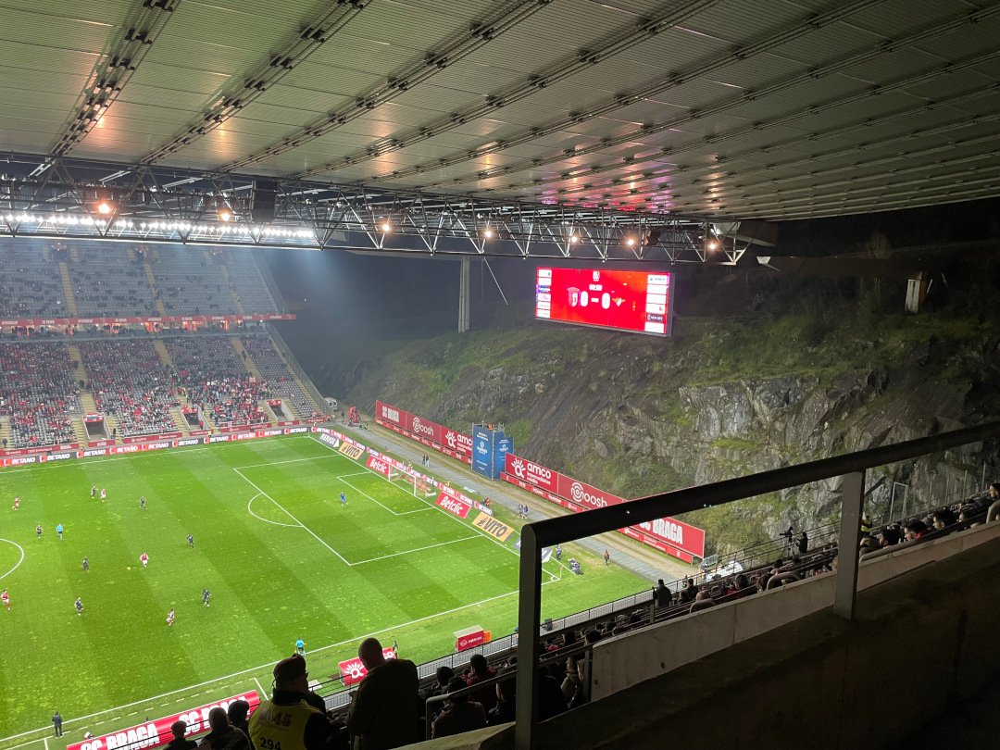

Von der Küste geht es für uns ins Landesinnere, wo uns schöne Aussichten und beeindruckende Wasserfälle erwarten. Mit Braga besuchen wir außerdem die größte Stadt im Norden Portugals. 

<!--more-->

🗓️ 2. Februar: Morgens drehen wir noch eine Runde im Pinienwald, bevor wir Caminha verlassen und ins Landesinnere fahren. Unser Ziel ist der einzige Nationalpark des Landes, der Parque Nacional da Peneda-Gerês. Als erstes landen wir beim Cascata do Aroda - einem mehrstufigen Wasserfall, in dem selbst jetzt im Februar ein paar einheimische Jugendliche baden. Wir kneifen aber noch nachdem wir die Wassertemperatur erfühlt haben. Anschließend wandern wir zum Miradouro das Rocas. Von dem Aussichtspunkt auf einem großen Felsklotz haben wir perfekte Sicht über den Nationalpark. Für die nächste Übernachtung steuern wir dann einen Campingplatz im kleinen Bergdorf Ermida an. Der Platz macht zwar nicht allzu viel her, aber die freundlichen Besitzer machen ihn dennoch lohnenswert. Wir schlendern am frühen Abend noch durch das Dorf mit seinen Orangen- und Zitronenbäumen, sehen wie Rinder und Ziegen von den umliegenden Weiden zurück ins Dorf getrieben werden und jede halbe Stunde klingt das Glockenspiel der kleinen Kapelle durch die schmalen Straßen. Zurück am Bulli gucken wir natürlich BVB-FCH und als wir nachts nochmal schnell raus müssen, haben wir noch perfekte Sicht auf den klaren Sternenhimmel.

🗓️ 3. Februar: Wir sind für unsere Verhältnisse schon früh unterwegs, bevor samstags sicher  auch viele Portugiesen die Natur und die Sonne hier genießen. Noch vom Campingplatz aus geht es zum Miradouro das Silhas, dem kleineren Aussichtspunkt Miradouro da Vela und dem Cascata da Rajada. Dieser Wasserfall ist mit seiner kleinen Brücke sogar noch schöner als gestern und zu dieser Zeit noch verlassen. Als wir zurück sind, machen wir uns bereit zur Abfahrt in Richtung Braga. Auf dem Weg (wie könnte es anders sein) liegt ein weiterer Wasserfall, der Cascata de Fecha de Barjas, an dem wir eine Kleinigkeit frühstücken. In einem kleinen und von außen sehr unscheinbaren, aber doch gut besuchten, Café in Salamonde besorgen wir uns dann Snacks für mittags und fahren weiter. Im Nordosten Bragas machen wir noch einen Stopp am Fuße des Bom Jesus do Monte. Die Zickzack-Treppe mit fast 600 Stufen ist genauso beeindruckend wie die Aussicht über die Stadt, die sich oben bietet nachdem der Aufstieg geschafft ist. Der Weg runter ist dagegen schnell gemacht und wir fahren weiter zum Stadtcampingplatz von Braga. Tobi dreht sogar noch eine erste Runde durch die Stadt, aber meine Beine müssen sich nach diesem Tag erstmal ausruhen. Abends gehen wir noch in einem netten Laden Burger essen, aber beim Wortgitter-Rätsel, das man unter der Rekordzeit von 1er Minute und 50 Sekunden lösen müsste, um den Burger gratis zu bekommen, versagen wir mit ungefähr 6 Minuten. Angeblich haben manche auch schon 15 Minuten gebraucht, aber ich glaube das ist eine Notlüge der Bedienung zum Trost. So oder so, bezahlen müssen wir jedenfalls. 

🗓️ 4. Februar: Wir haben gestern Glück gehabt und einen Stellplatz weit unten auf dem Platz (und deshalb weit weg von der Straße) ergattert. Deshalb schlafen wir mitten in der Stadt trotzdem sehr gut und nutzen morgens erstmal aus, dass die Supermärkte hier auch sonntags geöffnet haben. Dann gucken wir uns Braga in Ruhe an. An vielen Stellen, wie im Jardim de Santa Bárbara, blühen hier schon die Blumen und die Portugiesen scheinen ihren Sonntag auch am liebsten entspannt und in Gesellschaft zu verbringen. Die Stadt ist gut besucht, obwohl viele Geschäfte geschlossen haben, und an verschiedenen Orten wie der Rua do Castelo und dem Chafariz da Praça da República wird Musik gemacht und vor allem in ganzen Gruppen fröhlich getanzt. Nur da zu sitzen und zuzuschauen macht schon gute Laune. Für uns gibt es noch ein sehr gutes Eis und zurück auf dem Campingplatz das erste Tischtennis-Match dieser Reise. Leider enden die drei Runden 2:1 für Tobi, aber es wird bestimmt noch genügend Möglichkeiten geben, die Niederlage nicht auf mir sitzen zu lassen. Abends lassen wir uns wegen wegen müder Beine von Bolt auf die andere Seite der Stadt zu einer Pizzeria fahren und gehen von dort aus dann zum Stadion. Das Estádio Municipal de Braga hat nur zwei Tribünen, weil es direkt in eine Felswand gebaut ist. Entsprechend hoch und beeindruckend ist es gebaut, was es auf jeden Fall zu einer Sehenswürdigkeit der Stadt macht. Und meinen 9. Fußball-Länderpunkt sammle ich so auch nebenbei. 

