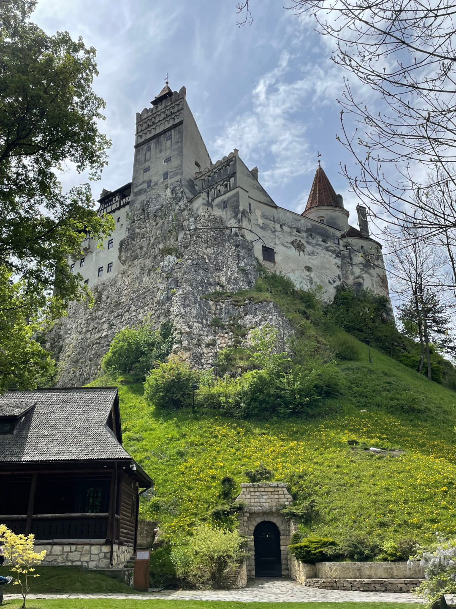
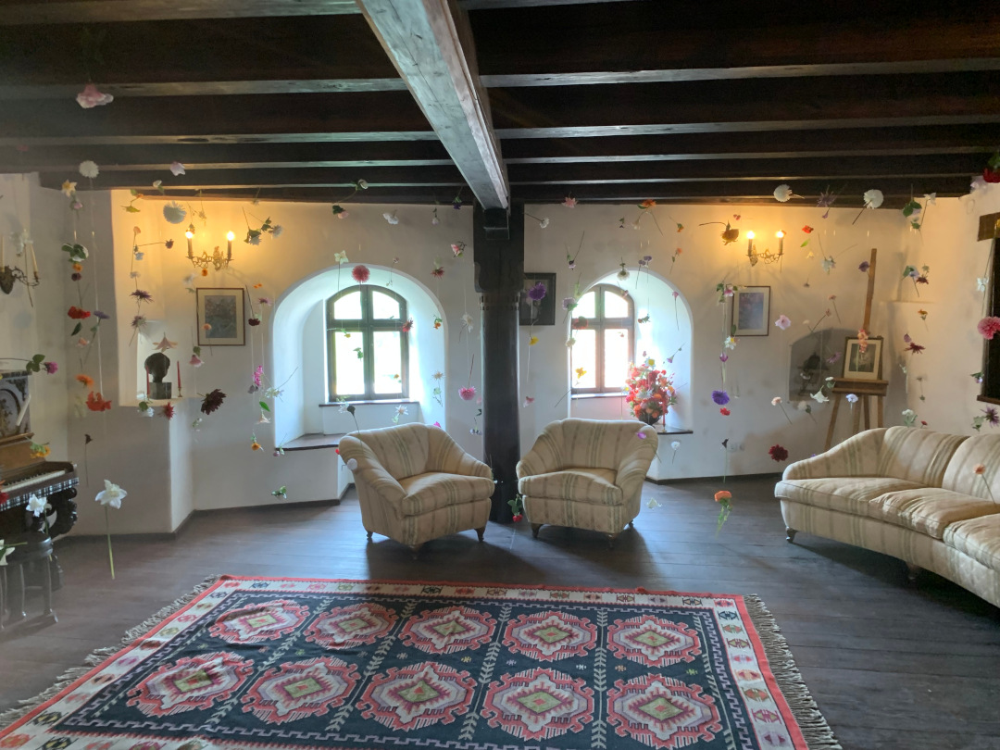
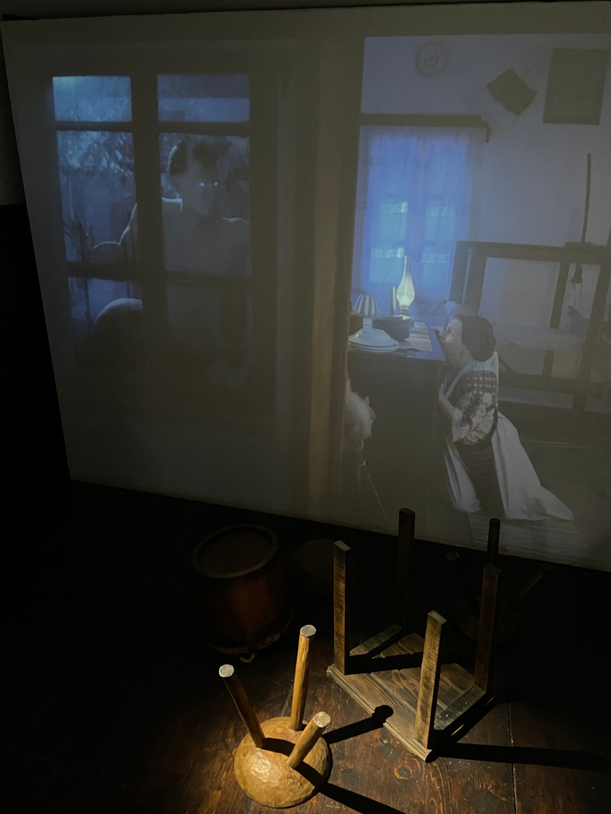
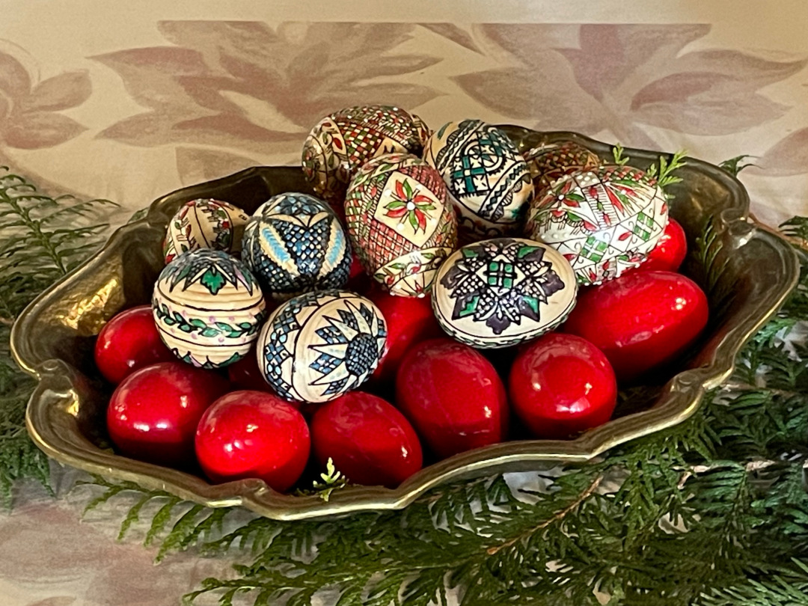
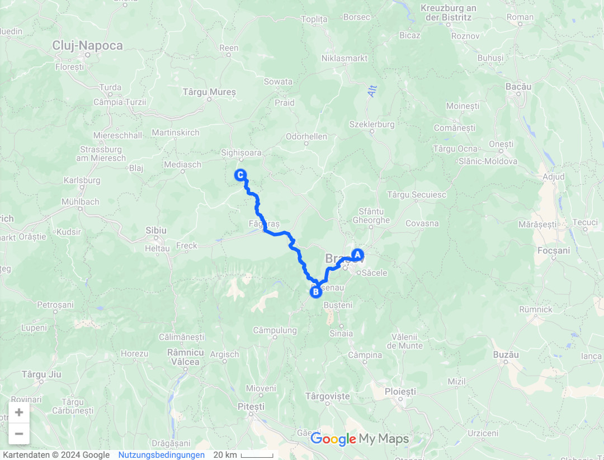
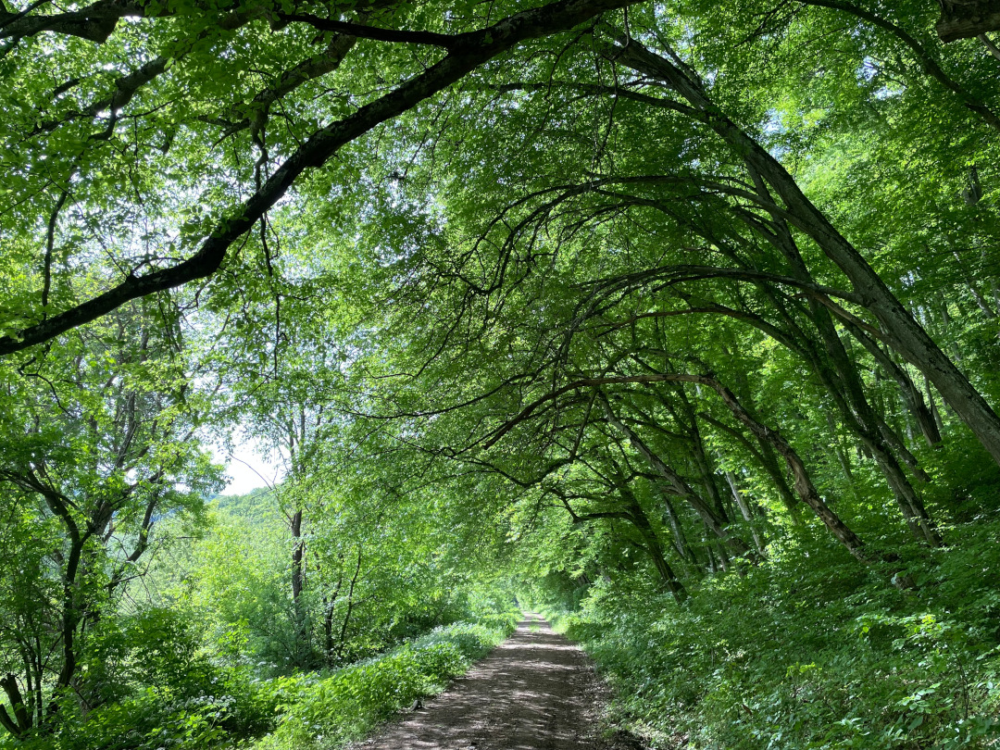
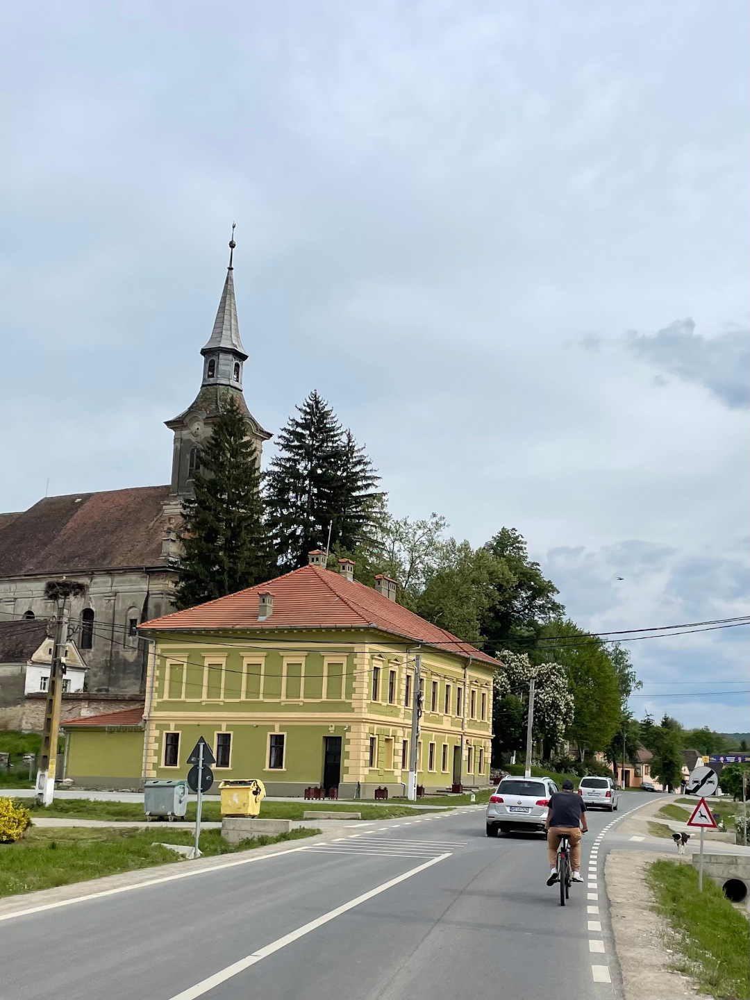
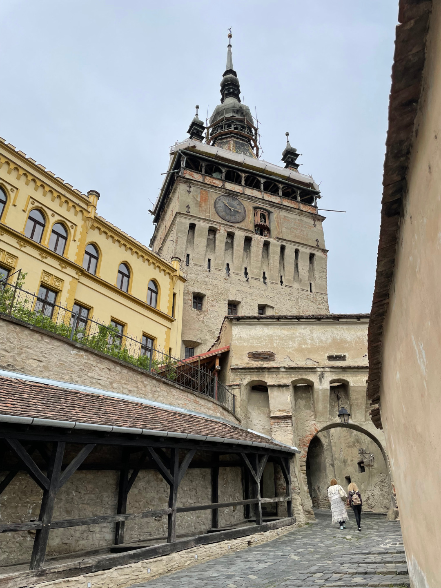
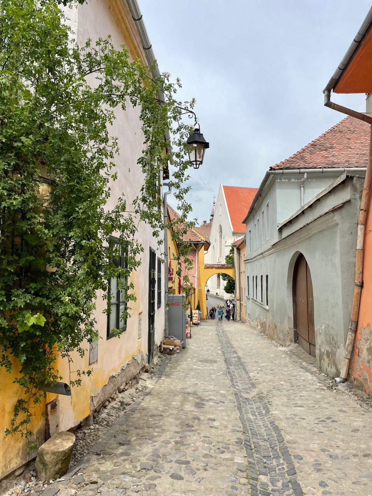
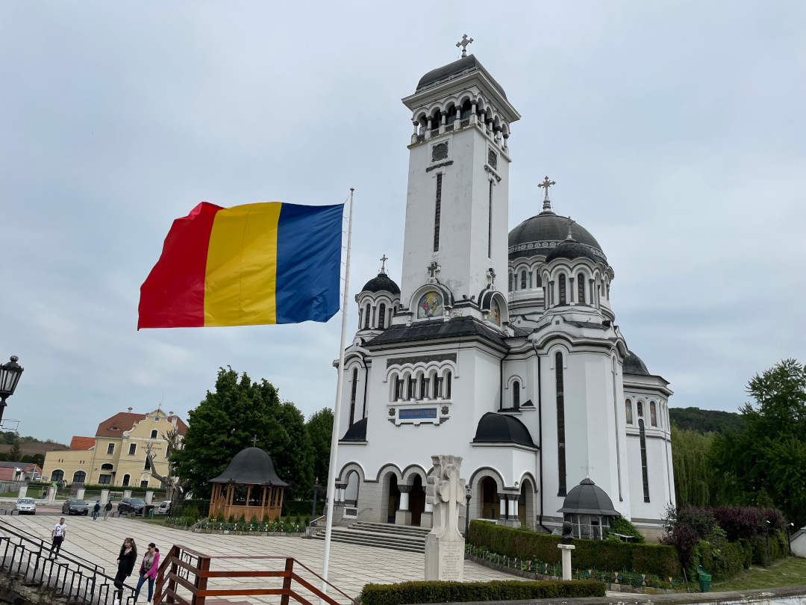

Unser Weg führt uns weiter nach Norden zum berühmten „Dracula Schloss“ und in eine mittelalterliche Stadt.

<!--more-->

🗓️ 2. Mai: Obwohl der Campingplatz-Betreiber keine guten Worte für Schloss Bran übrighat (und es für genauso überschätzt hält wie Schloss Neuschwanstein), machen wir uns heute genau dorthin auf den Weg. Das berühmte „Dracula Schloss“ können wir uns nicht entgehen lassen, wenn wir schon in Rumänien sind. Auch wenn es eigentlich gar keinen direkten Bezug zwischen dem Schloss und dem Roman von Bram Stoker gibt, wird es mit Dracula vermarktet und häufig so genannt. Wir nehmen uns trotzdem vor, Dracula mal zu lesen, denn wir beide kennen die Geschichte des meistverfilmten Vampirromans gar nicht. Als wir nach einer knappen halben Stunde dort ankommen, müssen wir ein paar Minuten anstehen und auch drinnen ist es schon jetzt sehr voll. Das Schloss an sich ist aber schon beeindruckend und drinnen gibt es auf jeden Fall ein paar schöne (und auch gruselige) Sachen zu sehen. Die Osterdeko mit den traditionell-rumänischen handbemalten Ostereiern ist auch schon aufgebaut, weil morgen ja Karfreitag ist. Als wir gegen 12 Uhr wieder aus dem Schloss rauskommen, ist die Schlange dann riesig lang. Wir hatten also Glück, dass wir zufällig so früh dran waren. Im Park vor dem Schloss gibt es noch viele Verkaufs- und Essensstände. Wir treffen noch Deutsche, die mit uns auf dem Campingplatz in Honigberg übernachtet hatten und sich jetzt gerade in die Schlange stellen, und holen uns ein Stück weiter die Straße runter Langos mit Käse. Dann machen wir uns wieder auf den Weg. Wir fahren etwas quer durchs Land zu unserem nächsten Campingplatz, der sehr ländlich liegt. Deshalb gibt es auch wieder Abschnitte, auf denen die Straße nicht geteert und manchmal so holprig ist, dass es nicht schnell vorangeht. Auf genau so einem Abschnitt treffen wir auf ein Tier. Aus der Ferne denken wir noch, dass es einfach einer der Straßenhunde ist, aber als wir mit dem Bulli näherkommen, merken wir, dass es ein kleiner Fuchs ist. Weil wir so lange gebraucht haben, um es zu verstehen, ist er dann natürlich auch schon schnell wieder weg, aber wir freuen uns trotzdem über ihn. Wir machen noch einen Stopp, um mit Henry spazieren zu gehen und etwas im Grünen rumzusitzen. Am Camping angekommen ist das Tor zwar zu und als wir drüber luken ist alles leer, aber telefonisch erreichen wir schnell jemanden und der kann aus der Ferne das elektrische Tor für uns öffnen. Wir dürfen uns ein Plätzchen aussuchen und alle Infos, die wir brauchen, sind vor Ort gut beschrieben. Es ist richtig idyllisch hier und Henry kann auf dem großen Gelände überall freilaufen. Später guckt dann noch ein französischer Kopf über das Tor, dem wir natürlich noch öffnen. Wir kochen nur noch und sind mal wieder platt vom Tag.

🗓️ 3. Mai: Mit Henry geht es morgens richtig entspannt über Feldwege und durch den Wald, ganz ohne Hunde. Nur ein paar junge Kühe, die Lust haben zu spielen aber gut eingezäunt sind, rennen ein Stück mit uns. Anschließend lernen wir den super hilfsbereiten Gastgeber auch persönlich kennen. Er gibt uns noch gute Tipps für unsere Weiterreise und mehrere Broschüren zu den Nationalparks und Naturreservaten in Rumänien. Für heute können wir uns bei ihm außerdem zwei Mountainbikes ausleihen. Wir sind ewig nicht mehr Fahrrad gefahren und freuen uns los düsen zu können. Unser Ziel ist das nur 12 Kilometer entfernte Sighișoara. Die kleine Stadt gehört zu den wenigen noch vollständig erhaltenen mittelalterlichen Städten weltweit und ihr Zentrum wurde schon vor über 20 Jahren zum UNESCO Weltkulturerbe erklärt. Wir schlendern also mal wieder durch die Gassen. Es ist nicht überfüllt, aber vor allem im historischen Zentrum wegen des Feiertags gut besucht. Über die Schülertreppe, die extra gebaut wurde, um Schülern den Aufstieg zur Schule leichter zu machen, gelangt man dorthin und auch zur evangelischen Kirche und dem deutschen Friedhof. Unten am Rande des Zentrums steht aber auch eine imposante orthodoxe Kirche. Wir gehen noch für heute Abend einkaufen und schwingen uns wieder auf die Räder. Der Rückweg geht mehr bergauf und ist mit Gegenwind auf jeden Fall anstrengender als der Hinweg. Umso entspannter ist es dann, als wir wieder auf dem Platz ankommen. Gegen halb 9, als wir gerade fertig sind mit Kochen, Essen und Spülen, ändert sich das dann etwas. Auf einmal kommt eine Kolonne polnischer Geländewagen auf den Platz gerollt und endet gar nicht mehr. Das ist nicht unbedingt das Schönste auf einem Campingplatz mit nur 3 Toiletten. Mindestens 10 Autos verteilen sich kreuz und quer auf dem Gelände und kesseln uns regelrecht ein, so dass wir am Ende sogar in die letzte Ecke des Campingplatzes fliehen und umparken. Das lohnt sich aber, denn hier ist es sehr viel ruhiger, wir stehen direkt am plätschernden Bach und kommen noch mit unserer neuen deutschen Nachbarin ins Gespräch, die übrigens auch vor der Kolonne geflüchtet ist und sich nochmal umgestellt hat. Vielleicht ist es also auch einfach unsere deutsche Privatsphäre-Mentalität, die uns vertrieben hat.

