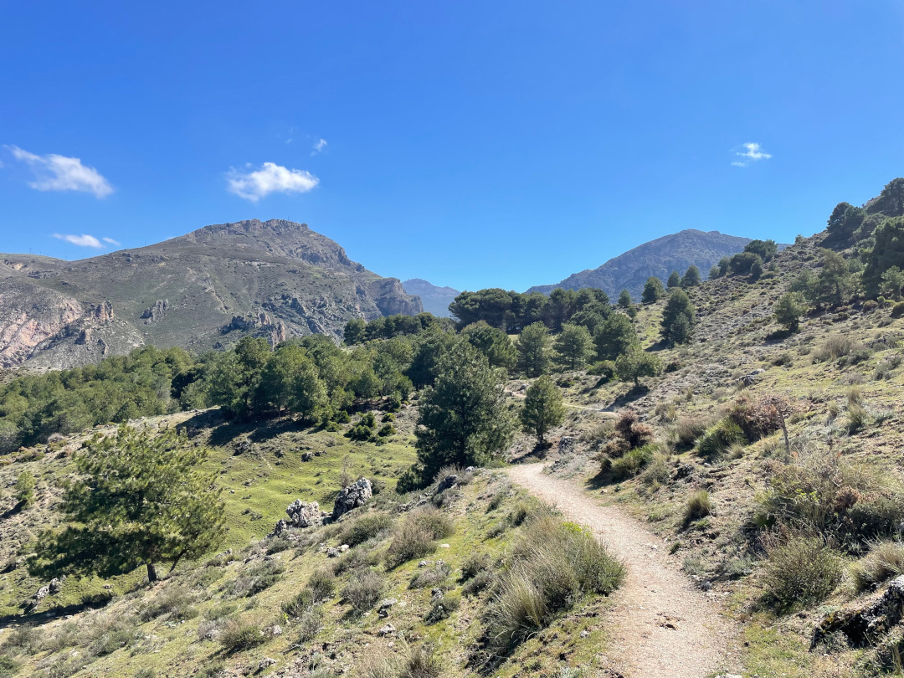
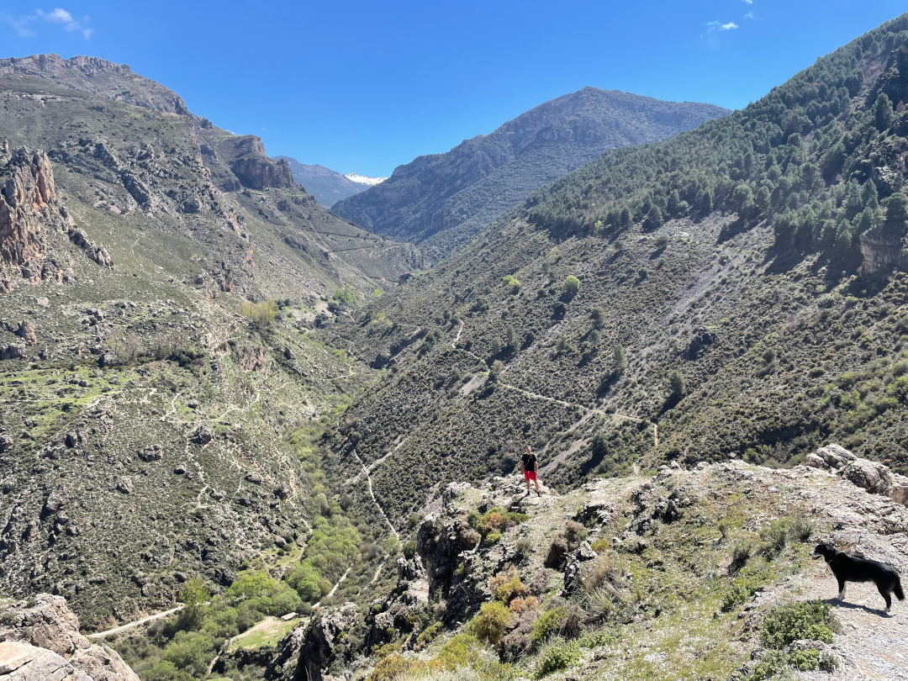
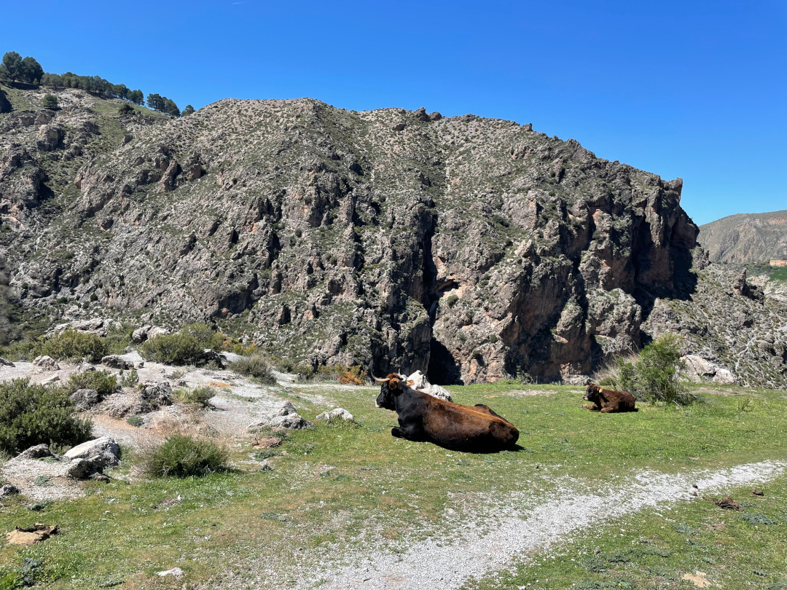
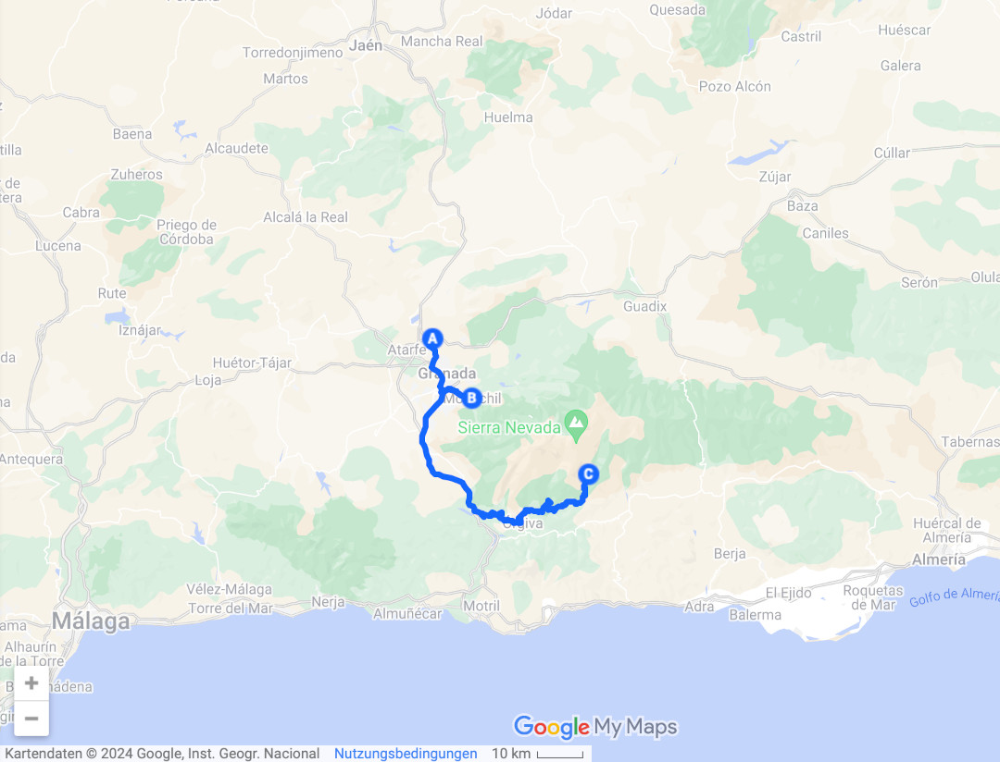
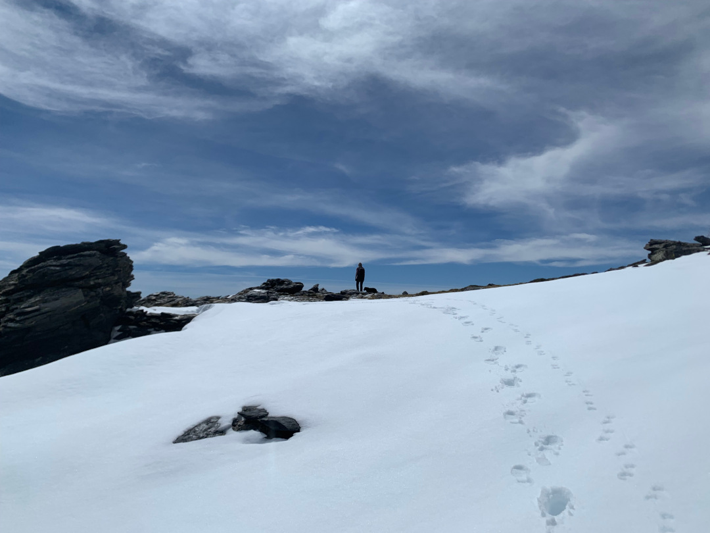
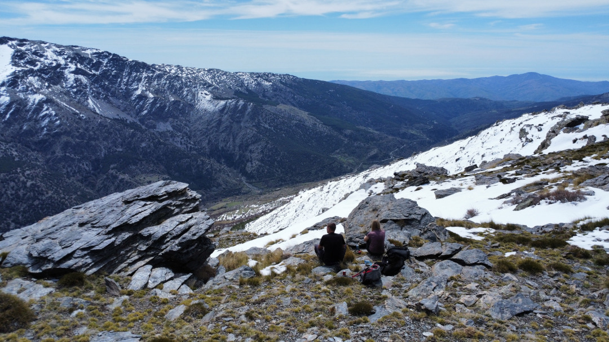
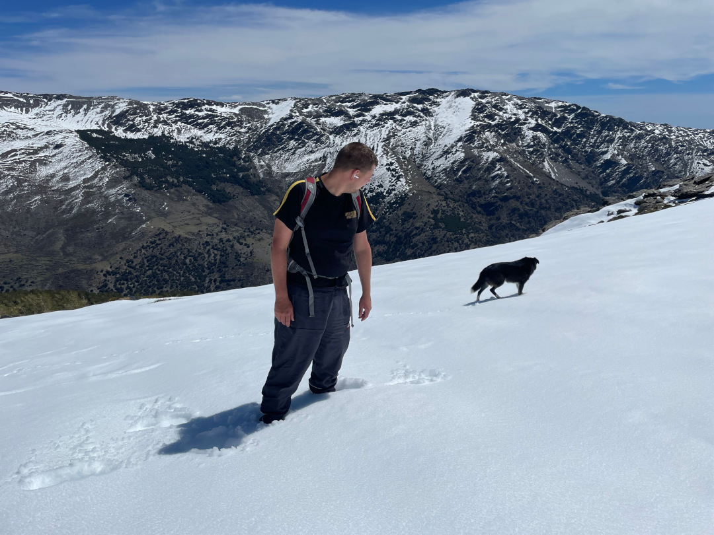
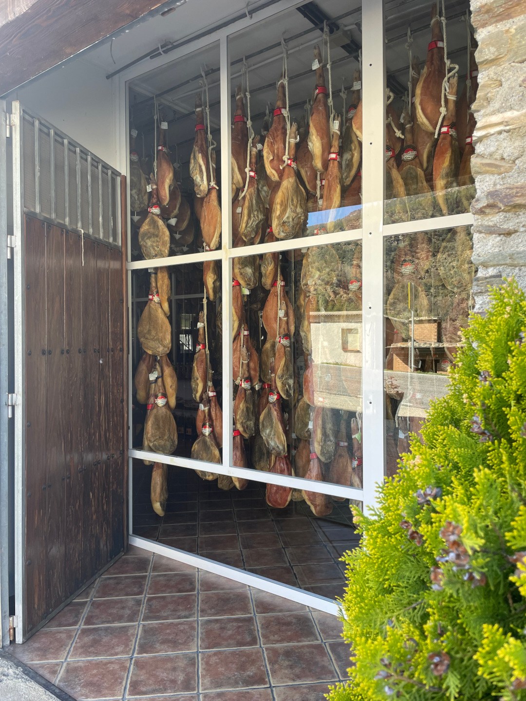

Von Granada ist es nur ein Katzensprung in die Sierra Nevada, wo wir zwei Wanderungen geplant haben.

<!--more-->

🗓️ 3. April: Wie so oft ist es auch hier auf dem Stellplatz in der zweiten Nacht voller geworden. So tut der Abschied auch nicht so weh. Wir gehen eine kleine Runde mit Henry und nutzen noch kurz das WLAN aus, bevor wir uns auf den Weg zum Carrefour in Granada machen. Wir kaufen Frühstück und Wasser für die geplante Wanderung. Dazu fahren wir nach Monachil, ca. 20 km südöstlich von Granada. Hier startet unser Wanderweg Cahorros del Monachil, der durch die Schlucht des Flusses Monachil führt. Wir parken auf dem Wanderparkplatz mitten im Ort. Zuerst müssen wir ca. 400 Höhenmeter überwinden, leider hauptsächlich über Straßen. Erst zum Ende werden es kleine Wanderwege. Menschen trifft man kaum, die einzigen Begegnungen sind mit Hütehunden und Kühen. Der Ausblick von oben auf die Schlucht entschädigt den kleinen steilen Aufstieg. Man kann weit und tief gucken. Der Fluss führt sehr viel Wasser, so dass wir ihn auch oben hören. Unten sind mehr Menschen unterwegs. Es gibt wohl noch einen kurzen Wanderweg direkt in die Schlucht. Die 400 Höhenmeter gehen wir nun wieder runter direkt zum Fluss. Unterwegs gibts viele kleinere Wasserfälle, die wir kreativ überwinden müssen. Die Schneeschmelze und der viele Regen der letzten Tage sind wohl die Ursache. Für Henry ist es ideal, er findet genug Trinkwasser. Unten am Fluss machen wir eine kurze Pause, bevor es dann nochmal 300 Meter bergauf geht, die es dann direkt wieder runter geht. Gegen Nachmittag sind wir wieder am Parkplatz. Die Runde war knapp 12 km lang und 700 Höhenmeter. Das kann man gut in drei Stunden schaffen. Als Belohnung geht es zu unserem neuen Fast Food Laden Nummer 1: Taco Bell. Danach fahren wir noch knapp 2 Stunden nach Trevélez. Die Runde heute war nur das Warm-Up für morgen. Wir wollen weiter in die Sierra Nevada hinein. Dazu suchen wir uns den höchsten Campingplatz Spaniens auf 1560 Metern aus. Die Fahrt verläuft sehr kurvig. Wir schlängeln uns die Serpentinen nach oben.  Den Schneebergen kommen wir immer näher, teilweise liegt noch Schnee am Straßenrand. Vor zwei Tagen waren hier auch tagsüber noch Minusgrade, heute aber knapp 15 Grad. Gegen Abend kommen wir in Trevélez an. Weiter weg von der spanischen Küste haben die Campingplätze fast schon wieder ein Marokko-Preisniveau. Wir gehen früh ins Bett, um morgen schon früh die Wanderung starten zu können.

🗓️ 4. April: Dass wir so weit oben sind, merken wir in der Nacht, die mit fünf Grad sehr kalt ist. Wir stehen noch im Dunkeln auf und machen uns bereit für unsere Wandertour. Heute sind 23,2 km und 1600 Höhenmeter geplant. Wir wollen quasi mit Sonnenaufgang los, um genug Puffer zu haben. Zuerst geht es vom Campingplatz in den Ort Trevélez. Hier besorgen wir Frühstück und Kuchen. Ab dann geht es permanent bergauf. Ziel sollen die Siete Lagunas sein, ein Bergplateau mit kleinen Lagunen auf etwas über 3.000 m Höhe. Vor ein paar Jahren sind wir schon mal in den spanischen Pyrenäen ähnlich gewandert. Der Ausblick war ein Traum. So geht es jetzt erstmal durchgehend 1.600 m hoch. Mit der gestrigen Wanderung in den Knochen merkt man die Meter schon, obwohl es anfangs echt gut voran geht. Nach einigen Kilometern erreichen wir die Schneegrenze. Wir machen eine kurze Pause und wandern weiter. Auf ca. 2.700 m ist der Schnee dann aber fast einen halben Meter hoch. Bei jedem Schritt versinkt man bis zum Knie im Schnee. Zu den Höhenmetern muss man jetzt noch bei jedem Schritt den Fuß aus einem halben Meter Schnee ziehen. Das ist wohl auch der Grund, wieso uns kaum Leute entgegenkommen. Wir entscheiden bis zu einem guten Aussichtspunkt zu laufen und bei ca. 2.750 m Höhe nach fünf Stunden Aufstieg das Ganze zu beenden. Wir machen eine ausgiebige Pause. Auf einmal kommen zwei andere Wanderer an uns vorbei, die noch weiterlaufen. Später sehen wir aber, dass auch die beiden nicht mehr viel weiter hochgelaufen sind, nur bis zur nächsten Hütte. Nach der Pause gehen wir den Abstieg an. Wofür wir fünf Stunden bergauf benötigt haben, benötigen wir keine zwei Stunden bergab. Trotz der großen Schneemengen. Oftmals fällt man aber auch mehr nach unten, als das man geht. Henry macht das alles nichts aus, der ist so leicht, der sinkt nicht ein und genießt das Buddeln im Schnee. Gegen frühen Abend sind wir zurück im Dorf. Wir finden das einzige Restaurant ohne Siesta. Trevélez ist bekannt für den iberischen Schinken und generell für Fleisch vom iberischen Schwein. Der Schinken kommt aus der ganzen Region nach Trevélez zum Lufttrocknen. Überall hängen die Schweineschenkel, teilweise noch mit Hufen. Wir probieren es dennoch und sind positiv überrascht. Ein Straßenhund versucht die ganze Zeit mit Henry zu spielen, hat aber keine Chance. Zum Glück hört seine Belagerung nach kurzer Zeit auf. Danach folgen die letzten zwei Kilometer für heute. Mit letzter Kraft geht es zurück zum Bulli, wo es mit Magnesium und Calcium als Muskelkatervorbeugung ins Bett geht.

