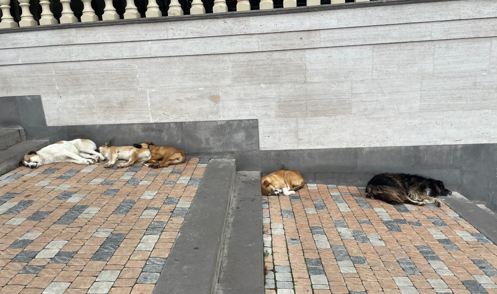
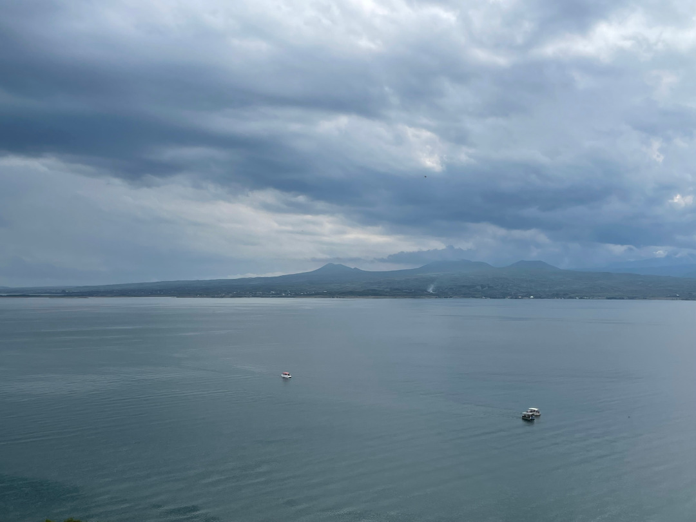
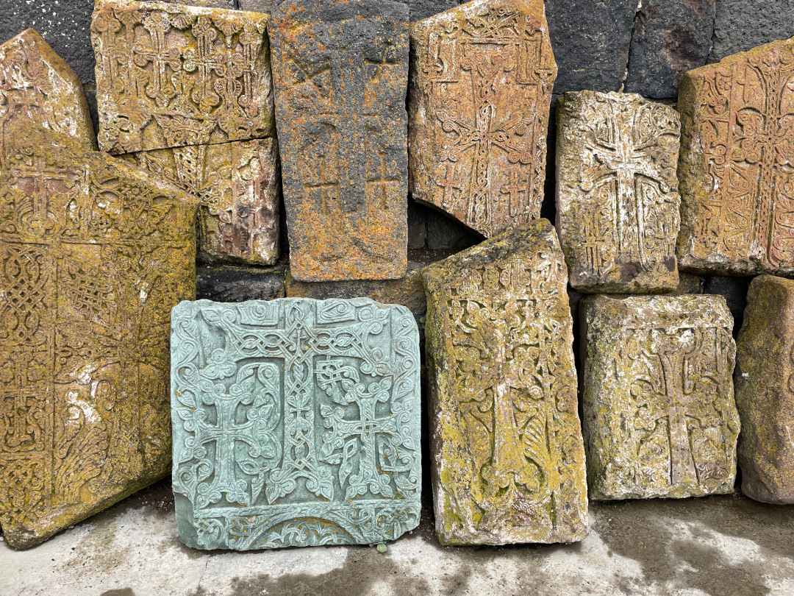
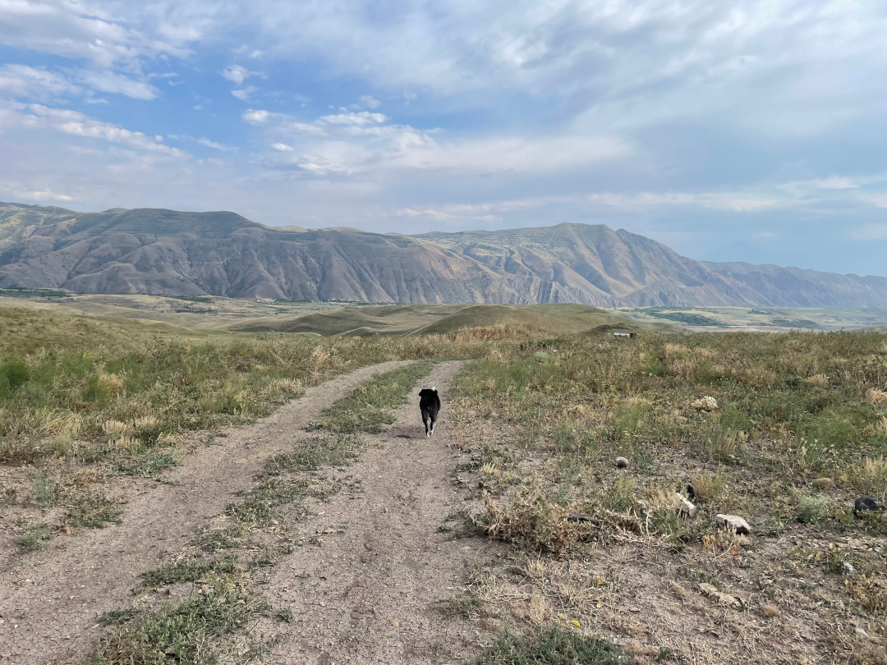
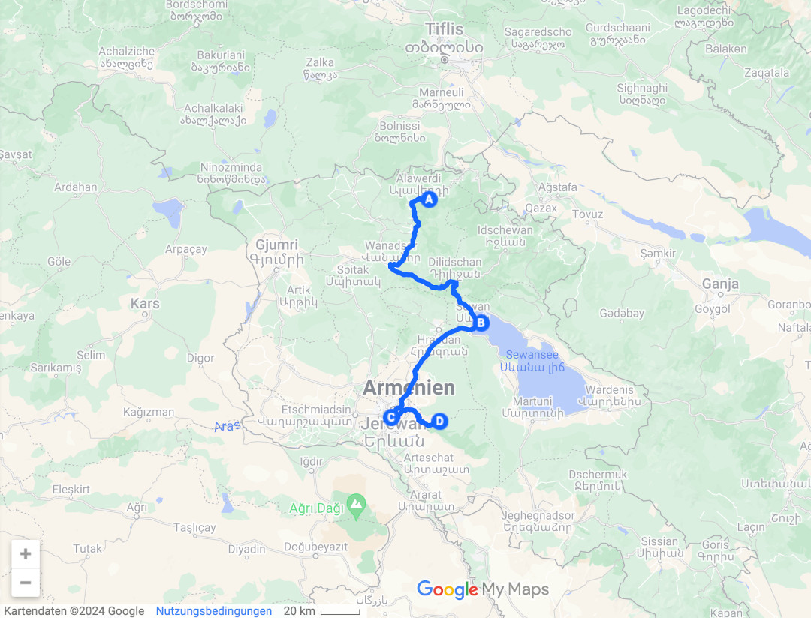
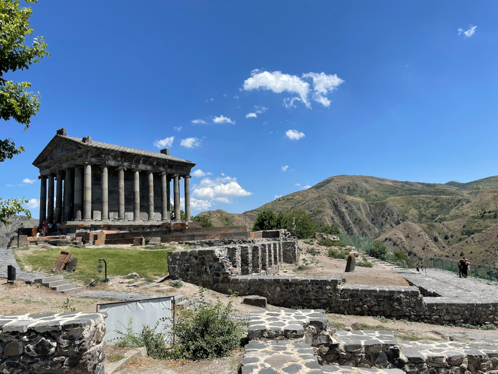
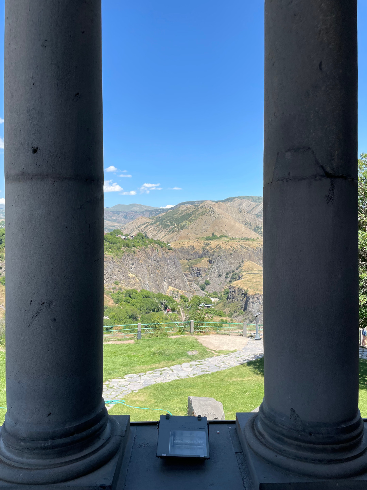
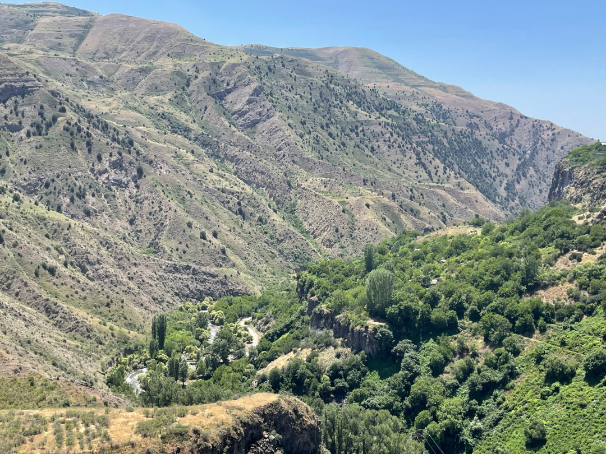

Wir fahren weiter in den Süden Armeniens und fahren direkt zum nächsten Kloster.

<!--more-->

🗓️ 3. Juli: Weil wir alleine auf dem Campingplatz sind, haben wir relativ viel Platz und Henry kann sich alles angucken. Wir gehen mit ihm eine Runde durch den Ort und treffen zum Glück keine Straßenhunde. Danach verabschieden wir uns von Martin und seiner Mutter, die sich schon fast in Henry verliebt hat. Für uns geht es weiter nach Süden über die M6. Die M-Straßen (Motorway) sind die besten Straßen in Armenien und eigentlich durchgehend asphaltiert. Die M6 im Nordosten des Landes wurde allerdings durch Regen und Erdrutsche im Mai teilweise zerstört. Also ist auch diese Fahrt sehr anstrengend und wir schlängeln uns so bis zum Sewansee. Hier steht das Kloster Sewanawank direkt über dem Sewansee. Leider muss Henry im Auto bleiben, denn auch hier gibt es viele Straßenhunde. Von Menschen lassen sie sich natürlich nicht beeindrucken und schlafen entspannt. Wenn aber ein anderer Hund dabei ist, fühlt sich das Rudel oft angegriffen und verteidigt das Revier. Henry geht dann meist als Verlierer vom Platz. Das wollen wir ihm ersparen. Zum Kloster geht es dann noch ein paar Treppen hoch und man kann über den gesamten See gucken. Die Aussicht ist echt gut und man kann hier am See schon etwas Tourismus in Armenien ausmachen. Es gibt Hotels und Ferienwohnungen entlang des Sees, hauptsächlich aber für Einheimische oder Russen. Wir fahren weiter in Richtung Süden und die Straßen bessern sich erheblich. Ungefähr 50 km nördlich von Jerewan wird die Straße auf einmal asphaltiert und sogar vierspurig. Wir können unser Glück gar nicht fassen, merken aber dann schnell, dass der Verkehr um Jerewan aber nicht mehr so entspannt ist, denn natürlich ist hier viel los. Um weiter in Richtung Süden zu fahren, müssen wir zwangsläufig einmal durch die Hauptstadt, die wir uns erst in ein paar Tagen angucken wollen. Auf dem Weg halten wir noch an der Jerewan Mall und kaufen im riesigen Carrefour alles für die nächsten Tage ein. Es gibt sogar eine Tiefgarage und einen Pizzamann. Außerhalb von Jerewan ist das alles in Armenien leider nicht vorhanden. Anschließend geht es für uns noch circa eine Stunde zum größten und bekanntesten Campingplatz Armeniens: Camping 3Gs. Die Besitzerin Sandra kommt ursprünglich aus Holland und lebt jetzt in Armenien. Als sich das Tor öffnet, sind wir überrascht. Hinter dem Eingangstor verbringt sich viel Platz, eine tolle Aussicht auf die Berge, ein Pool und mehrere perfekt ausgestattete Küchen. Am meisten freuen wir uns aber über den Backofen. Wir haben seit Januar keinen Backofen mehr genutzt. Wir können sofort verstehen, wieso der Platz so beliebt ist. Hier kann man gut entspannen, daher sind wir seit längerer Zeit mal auch nicht alleine. Hier treffen sich fast alle Armenien-Reisenden. Die meisten fahren weiter durch den Iran oder nach Russland. Wir finden aber noch ein anderes Paar, für das auch in Armenien und Georgien Schluss ist mit der Fahrt nach Osten. Wir sind von allen hier sogar noch die, die am kürzesten unterwegs sind. Einige sind seit 5 Jahren unterwegs. Nach den Gesprächen mit allen gibt es noch unsere Pizza und danach geht’s in den Bulli.

🗓️ 4. Juli: Wir schlafen gut und nutzen die Küche für gutes Frühstück mit Eiern. Wir sitzen auf einer der schattigen Terrassen mit Blick auf die Berge. Ab heute wird es auch wieder wärmer und sonniger. Mehr als 30 Grad werden es aber zum Glück nicht. Es ist sehr entspannt nicht weiter fahren zu „müssen“ und wir trinken viel Tee. Seit Marokko sind wir unter die Teetrinker gegangen. Danach wollen wir nach Garni, ehemals Sommerresidenz der armenischen Könige und knapp sechs Kilometer vom Campingplatz entfernt. Wir wollen dort hinlaufen, verzichten aber leider wieder auf Henry. Was auch auf jeden Fall besser ist. Direkt vor dem Tor des Platzes werden wir von zwei großen Hunden begrüßt, die auch weniger Scheu haben direkt auf Menschen zuzugehen als in Bulgarien oder Rumänien. Wenn man einkauft, schnüffeln die Hunde auch an den Tüten, ob es sich lohnt reinzubeißen und springen einen auch schon mal an. Ohne eigenen Hund ist das aber alles wirklich machbar. Die restlichen sechs Kilometer laufen wir immer an der großen Straße entlang, was auch nichts für Henry gewesen wäre. Infrastruktur in Armenien (außerhalb von Jerewan) beschränkt sich wirklich nur auf Straßen für Autos. Keine Gehwege für Fußgänger, erst recht keine Radwege, keine Zug- oder Eisbahnstrecken und natürlich auch keine Straßenbahn. Die Alternative zum Auto ist der Bus, der aber natürlich auch auf den Straßen fährt. Man wird oft angehupt, weil sonst keiner zu Fuß unterwegs ist. Das ist hier aber auch einfach eine Standard-Begrüßung. Aber es wird schon aufgepasst, dass man nicht überfahren wird. In Garni angekommen ist es schon touristisch, weil es von Jerewan gut zu erreichen ist. Für etwas weniger als zwei Euro kann man in die alte Stadt. Vor allem der Tempel der Stadt ist noch gut erhalten und das Wahrzeichen Garnis. Von hier aus kann man auch gut ins Tal und auf die Landschaft gucken. Auf dem Rückweg gehen wir noch in einen kleinen Supermarkt/Kiosk und kaufen noch ein paar Dinge, um von unseren Nudeln auf einen Nudelauflauf zu wechseln, wenn wir schon mal die Chance haben einen Backofen zu benutzen. Zurück am Platz geht es kurz in den Pool. Den Nudelauflauf gibt es dann wieder auf der Terrasse mit bester Aussicht.

