Wir fahren weiter in den Süden von Griechenland zu einem der beliebtesten Touristenziele: Auf die Halbinsel Peleponnes.

<!--more-->

🗓️ 3. August: Die schweren Beine von gestern sind weg und die erste Runde mit Henry führt uns wieder durch den kleinen Ort. An jeder Mülltonne sieht man riesige Schafskäsekanister. Das sieht immer sehr lustig aus, wie sie all die Kanister sorgfältig daneben stellen aber nicht wegschmeißen. Nach einem Sprung in den Pool machen wir uns abfahrbereit. Der Campingplatz kostet mit Karte 28 € und Bar 25 €. Wieso das Land 2011 fast pleite war, wissen wir also jetzt. Danach machen wir uns auf den Weg zur Halbinsel Peleponnes. Nach den Tagen mitten in Griechenland wird es wieder Zeit für das Meer. Der Weg dauert knapp 5 Stunden und geht größtenteils über die Autobahn. Unterwegs finden wir noch eine halbwegs günstige Tankstelle (1,55) und tanken voll. Wir fahren bei Patras über die Brücke auf die Halbinsel. Von Weitem sieht die Brücke noch spektakulär aus, von Nahem ärgert man sich dann eher über die hohe Maut. Auf Peleponnes fahren wir dann noch ungefähr eine Stunde zu unserem Campingplatz in Paralia. Wir haben uns einen Platz direkt am Meer rausgesucht. Vor Ort sind wir dann etwas überrascht, wie groß der Platz tatsächlich ist und dass nahezu jeder deutsch spricht. Sowas sind wir nicht mehr gewöhnt, aber eigentlich hätte es uns in Griechenland klar sein müssen. Dennoch wollen wir für drei Nächte hierbleiben. Die Temperaturen sind aktuell so hoch, dass man sowieso kaum andere Dinge machen kann, als im Meer zu schwimmen. Ganz am Rand finden wir noch einen ruhigen Stellplatz für uns, auch wenn wir dafür weite Wege überallhin haben. Der Strand direkt am Campingplatz ist etwas felsig, aber ansonsten sehr gut. Das erste Mal holen wir unsere Luftmatratze raus, die übrigens schnell kaputt geht, als sie mit den Felsen in Berührung kommt. In Schweden erging uns das 2015 auch schon so. Später machen wir uns noch etwas zu essen und gehen wie immer mit offenen Türen ins Bett.

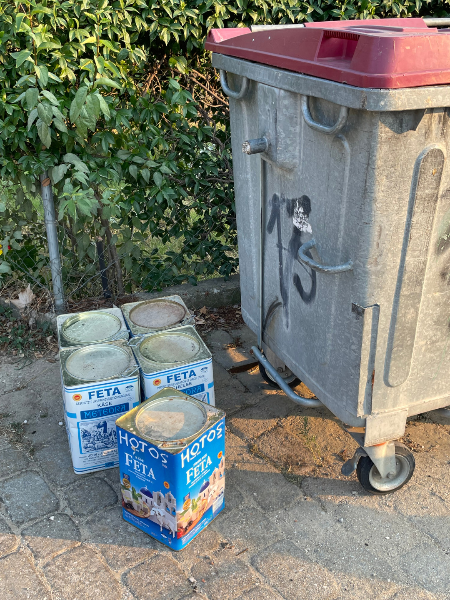

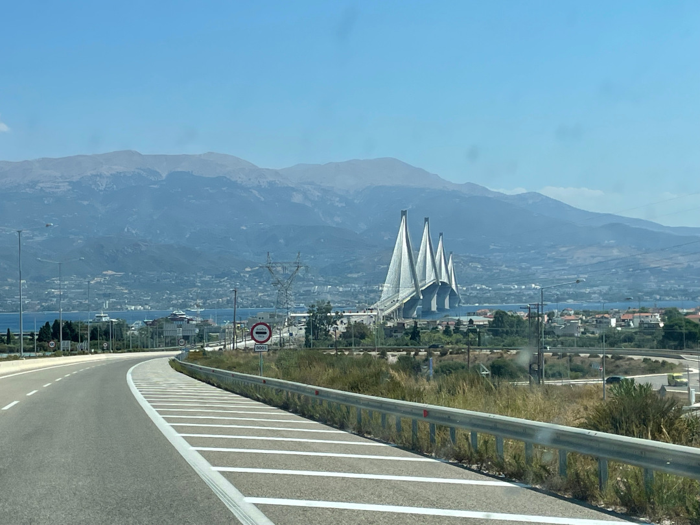

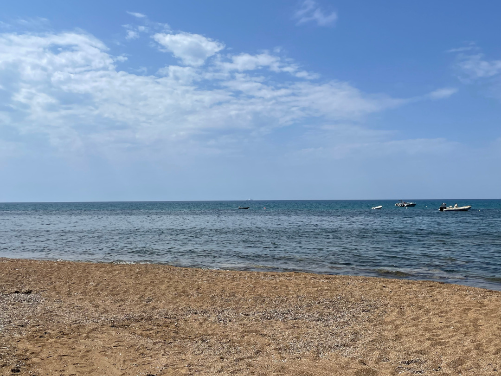

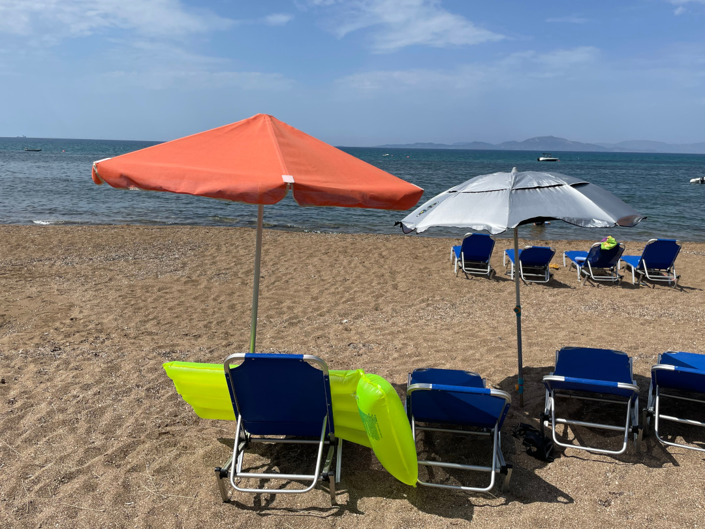

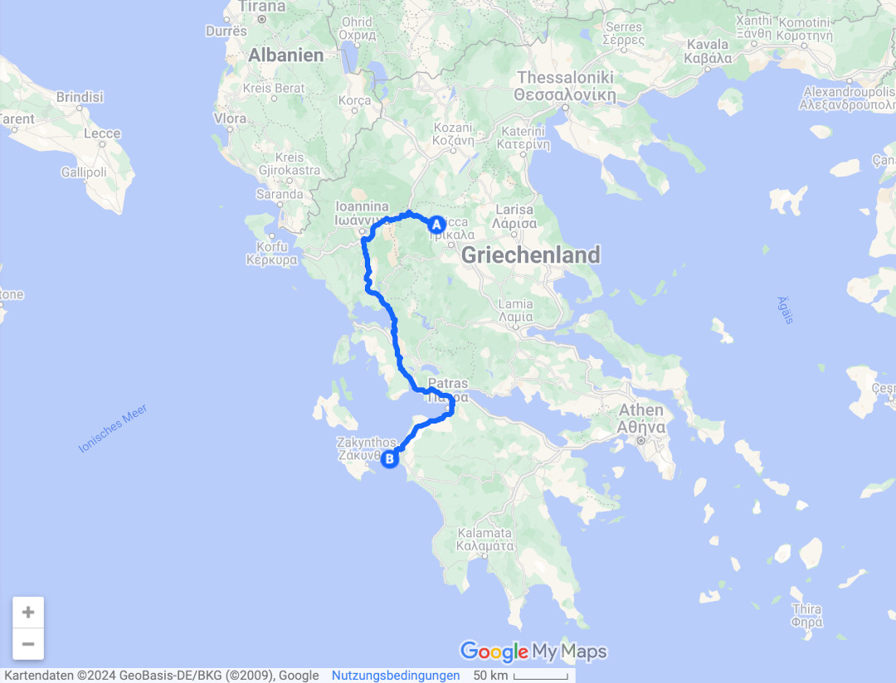

🗓️ 4. August: Wir schlafen, soweit es die Hitze zu lässt, aus und genießen, dass wir ein paar Tage an einem Ort verbringen. Wir gehen eine Runde mit Henry so lange wie wir drei es aushalten. Danach geht es direkt ins Meer, das tatsächlich immer noch erfrischend ist. Für das Frühstück besorgen wir in einem Mini-Markt ein paar Sachen, unter anderem auch Toastbrot. Das Toastbrot bräunen wir in der Pfanne auf unserem Gasherd. Nach kurzer Zeit geht aber leider unser Gas leer, das wir noch in Rumänien (zwei Tage vor dem Champions League Finale) gekauft haben. Es hat also lange durchgehalten. Ersatz haben wir in der Türkei besorgt. Leider passen die Gaskartuschen nicht auf unser Gewinde, obwohl sie dieselbe ISO-Zertifizierung haben. Wenn wir ehrlich sind, hat uns die Verkäuferin in der Türkei auch darauf hingewiesen, aber wir dachten wir wissen es besser. Wir haben also kein Gas mehr. Der Plan das Toastbrot auf dem Kontaktgrill zu toasten fällt dann schließlich auch aus. Als wir den Grill anschließen, funktioniert der plötzlich auch nicht. Ob es am Grill oder an zu wenig Strom liegt, wissen wir nicht. Wir könnten noch ein offenes Feuer auf dem Grill machen, was uns aber für ein Frühstück zu viel Aufwand ist. Es gibt also ungetoastetes Toastbrot und Müsli. Nach dem anstrengenden Frühstück geht es erneut zur Abkühlung ins Meer. Ansonsten halten wir es an diesem Tag wie Henry, der fast alles verschläft. Nur dass wir dafür kein Loch in den Sand buddeln, sondern die neue Hängematte aus Georgien nutzen. Das deutsche Publikum hier sorgt zum Glück dafür, dass wir deutsche Zeitung lesen können. Abends geht es nochmal ins Meer, bevor wir uns in einer Taverne Abendessen besorgen lassen. Weil wir kein Gas mehr haben, fällt ja auch das selber Kochen aus. Es gibt Pastizio und Bifteki. Gerade das Bifteki ist bei solchen Temperaturen keine gute Wahl. Aber hinterher ist man immer schlauer. Zum Sonnenuntergang drehen wir noch eine größere Runde am Strand und erleben einen echt guten Sonnenuntergang. Die Farben sind sehr intensiv. Zu dieser Uhrzeit kann man sich auch endlich mal etwas länger am Stück bewegen ohne auszulaufen. Zurück am Bulli geht es auch fix ins Bett.

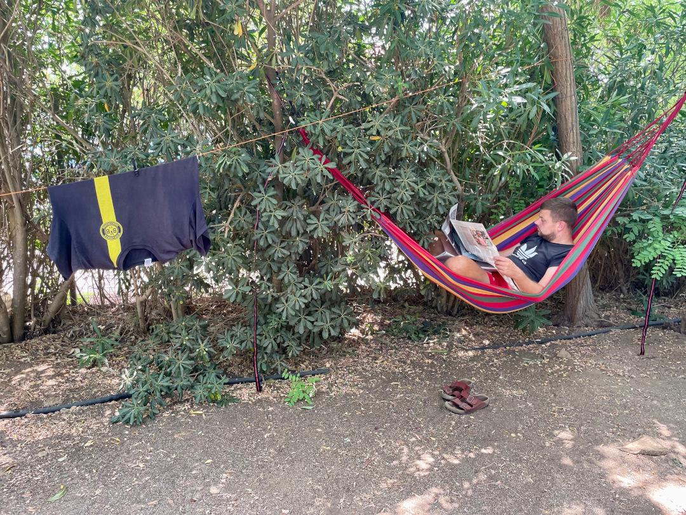

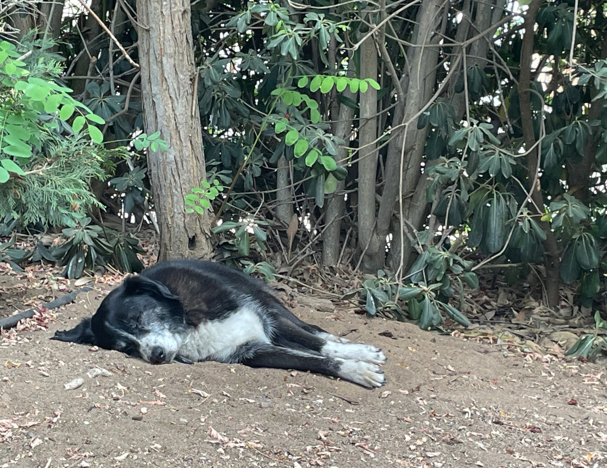

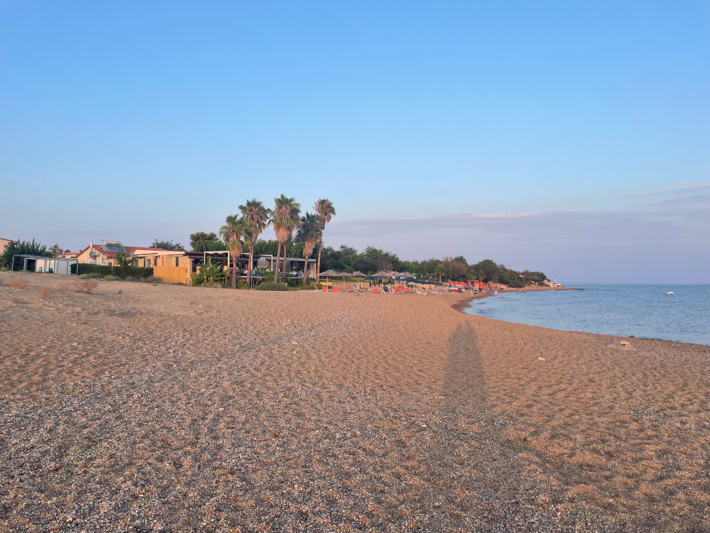

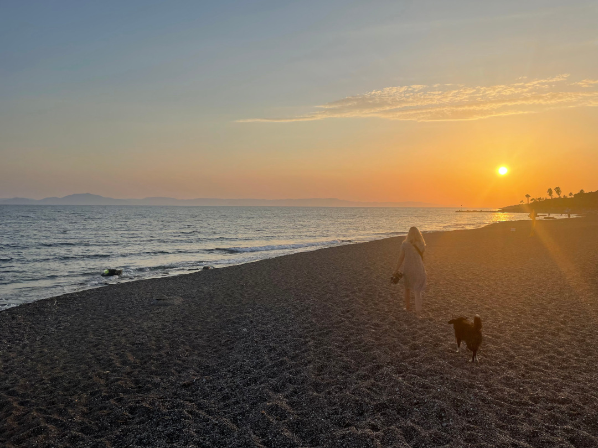

🗓️ 5. August: Der Tag beginnt wie der letzte aufgehört hat: mit viel Sonne und Wärme. Wir starten wie gestern in den Tag, also Henryrunde und ab ins Meer. Danach besorgen wir uns Brötchen, um unabhängig vom Toastbrot zu sein. Der Tag verläuft dann in etwa so wie gestern. Wir können viel Zeitung lesen, Henry schläft und wir gehen alle 2 Stunden ins Meer, um uns abzukühlen. Abends haben wir dann keine Lust auf die Taverne vor Ort, sondern suchen Gyros Pita im Nachbarort, leider sind die 6 km hin und zurück bei dem Wetter zu viel. Daher nehmen wir wohl oder übel das Auto. Gyros Pita ist das Preis-Leistungswunder in Griechenland. Für drei Euro wird man schon satt. Bei großem Hunger ist man für sechs Euro mehr als satt. Auch heute Abend gehen wir noch eine lange Strandrunde mit Henry. Der Sonnenuntergang ist wieder traumhaft. Nach der letzten Dusche des Tages geht es wieder mit komplett offenem Bulli ins Bett.

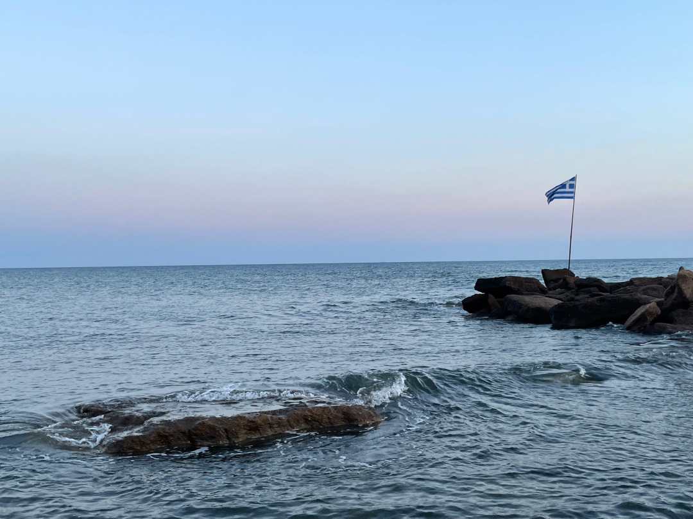

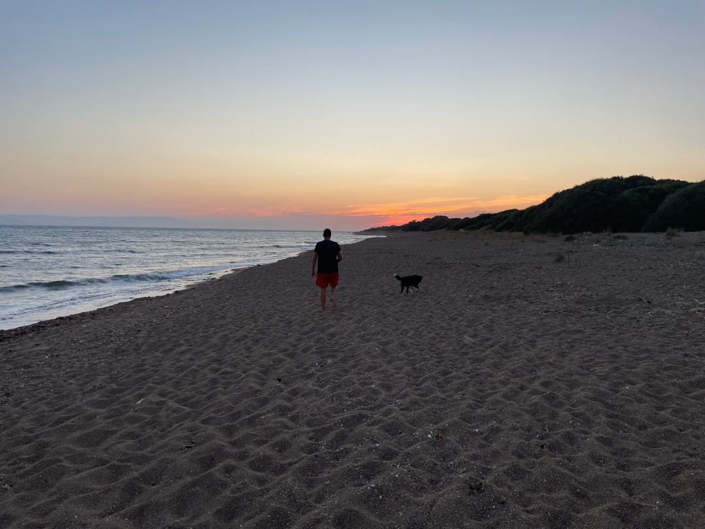

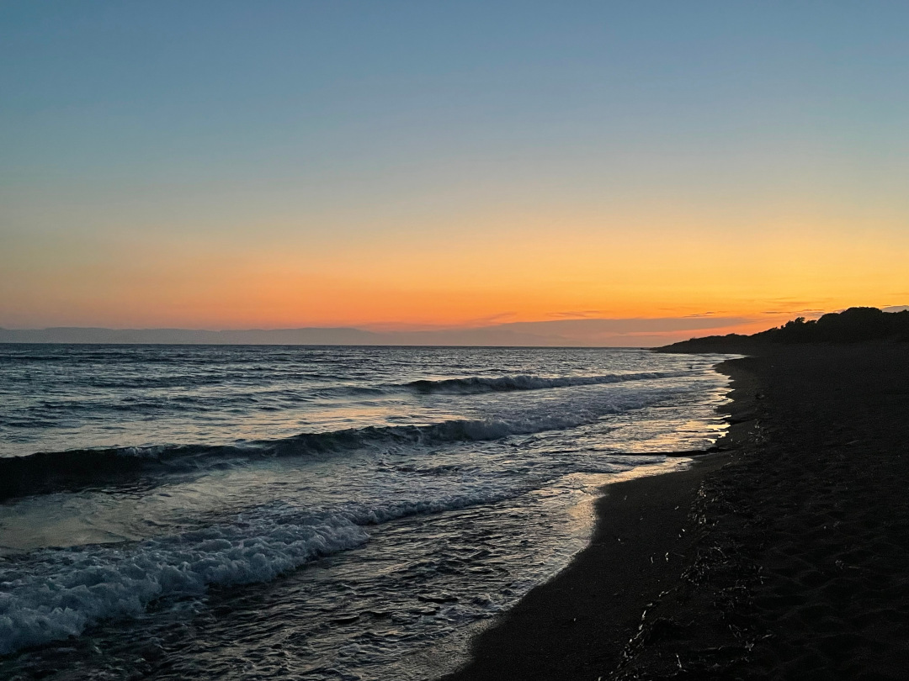