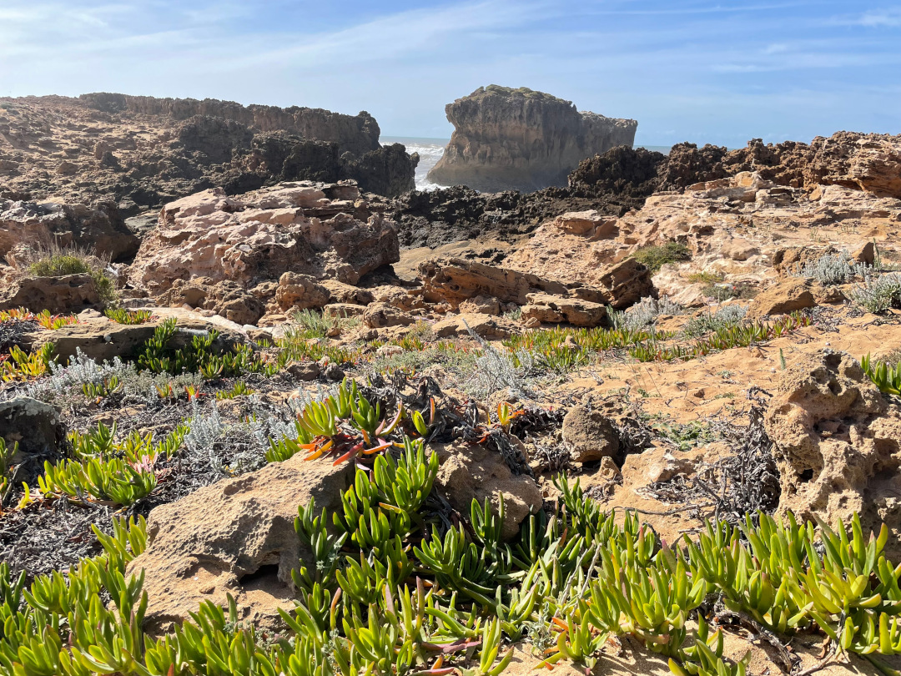
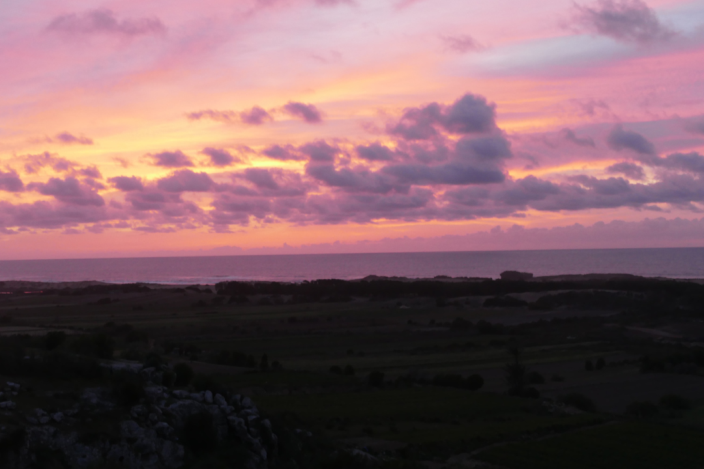
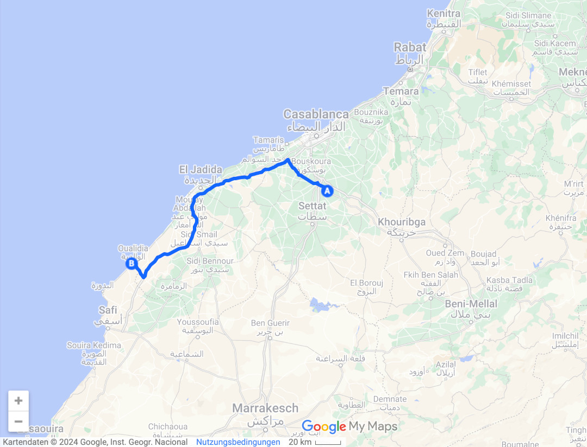
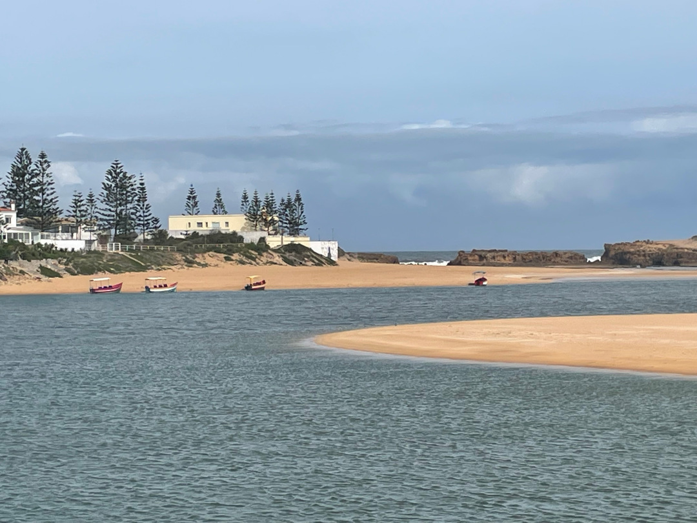
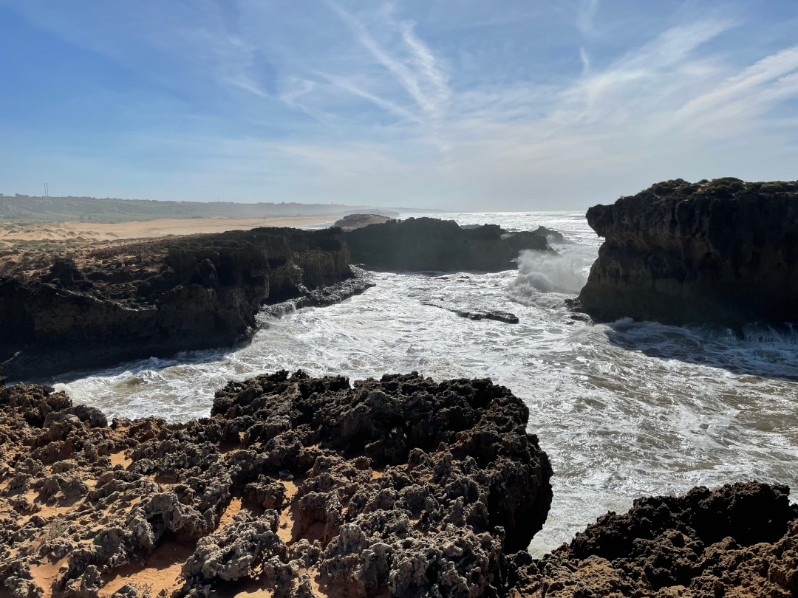

Wir lassen die Großstadt und den Trubel hinter uns und ruhen uns zwei Tage am Strand aus.

<!--more-->

🗓️ 4. März: In und um Casablanca haben wir erstmal genug erlebt. Also verabschieden wir uns im Riad, bedanken uns mit deutschen Süßigkeiten und machen uns auf den Weg weiter die Küste entlang Richtung Süden. Wir besorgen uns noch leckeren Kuchen und Kekse, denn das Angebot an süßen Teilchen kann sich in Marokko wirklich sehen lassen. Dann geht es für uns wieder auf die Autobahn, also zweieinhalb Stunden mit sehr wenig Konzentration ziemlich geradeaus. An einem der wenigen Rastplätze wollen wir der Müdigkeit einen kleinen Spaziergang entgegensetzen, werden aber leider sobald wir geparkt haben ziemlich belagert von bettelnden Frauen. Als wir in die Tankstelle gehen, entfernen sie sich, aber sobald sie sehen, dass wir rauskommen, geht alles von vorne los. So bleibt uns nicht wirklich eine andere Wahl als schnell im Bulli zu verschwinden und weiterzufahren. Am nächsten Rasthof sieht es zum Glück aber schon wieder ganz anders aus und wir können entspannt eine Pause machen. In Oualidia kommen wir nach längerer Zeit auf Höfen und im Riad mal wieder auf einem richtigen Campingplatz an. Wir stehen das erste Mal in Marokko auf einer Wiese und haben Blick auf das Meer. Das ist genau was wir brauchten nach den Tagen in der Metropolregion. Durch ein kleines Tor können wir auch wieder über Trampelpfade durch kleine Felder, die noch per Hand bestellt werden, runter bis zur felsigen Küste und auch zum Strand laufen. Der viele Sand und die Dünen bieten schon mal einen kleinen Vorgeschmack auf die Wüste, die uns noch bevorsteht. Nachdem Tobi in den Pool gesprungen ist, zeigt sich der Himmel zum Abschluss dieses Tages noch in richtig schönem Rot.

🗓️ 5. März: Wir starten mit einer Strandrunde in den Tag und lassen es dann eher langsam angehen. Hier steht uns das erste Mal in Marokko auch eine Waschmaschine zur Verfügung und das nutzen wir aus. Einen Trockner gibt es zwar nicht, aber schnell merken wir, dass Wind und Sonne das hier eh ruckzuck regeln. Die einzige Herausforderung ist es, eine Leine mit genügend Platz zu spannen. Als das geschafft ist, laufen wir nochmal ein Stückchen näher am Ort an den Strand, denn da gibt es kleine vorgelagerte Sandbänke, die wir uns angucken wollen. Einige Kitesurfer nutzen die guten Bedingungen hier aus und wir steigen noch in den Ort hinauf, um einen kleinen Einkaufsbummel zu machen. Unter anderem kaufen wir an einem Stand ganze drei Brote für umgerechnet 28 Cent. Die Lebenshaltungskosten halten sich für uns gerade also sehr in Grenzen. Zurück am Platz lassen wir noch etwas die Seele baumeln, gehen nochmal mit Henry an den Strand und abends noch in ein Restaurant um die Ecke. Auf dem Rückweg begleitet uns wieder die Aussicht auf einen schönen Sonnenuntergang und das Meer. Weil wir hier gutes WLAN haben, gucken wir noch den letzten Tatort und schon ist wieder ein Tag vorbei.

