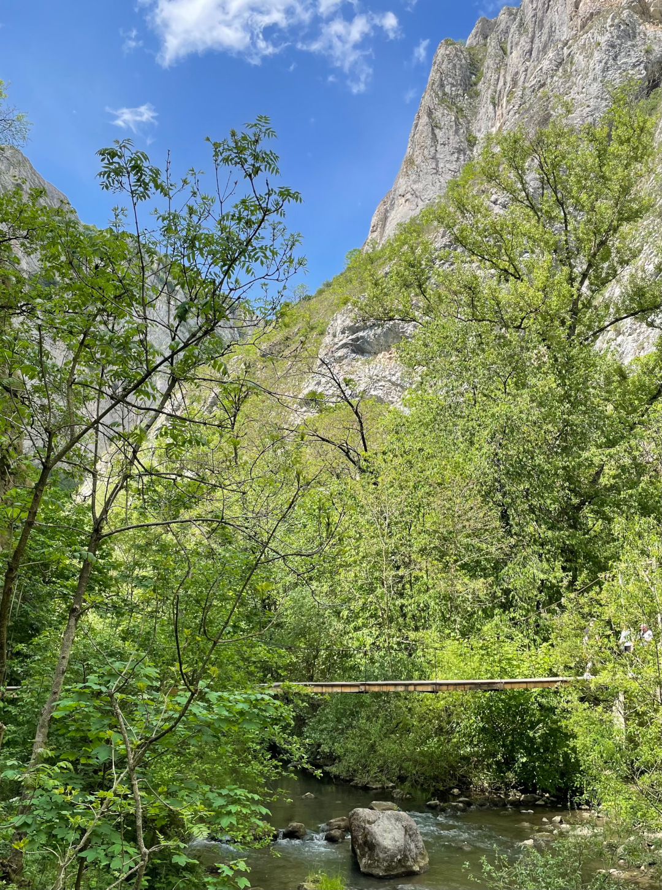
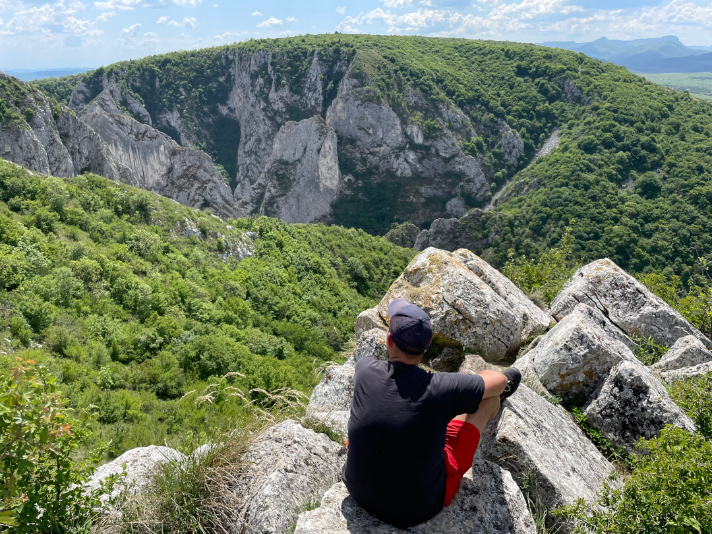
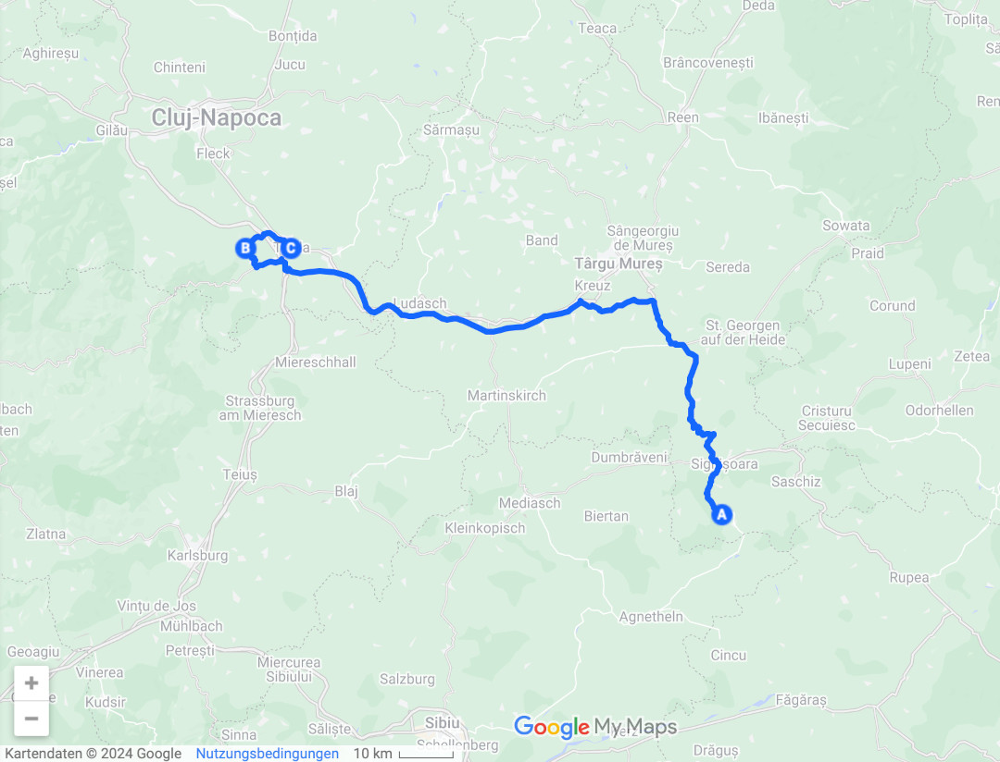
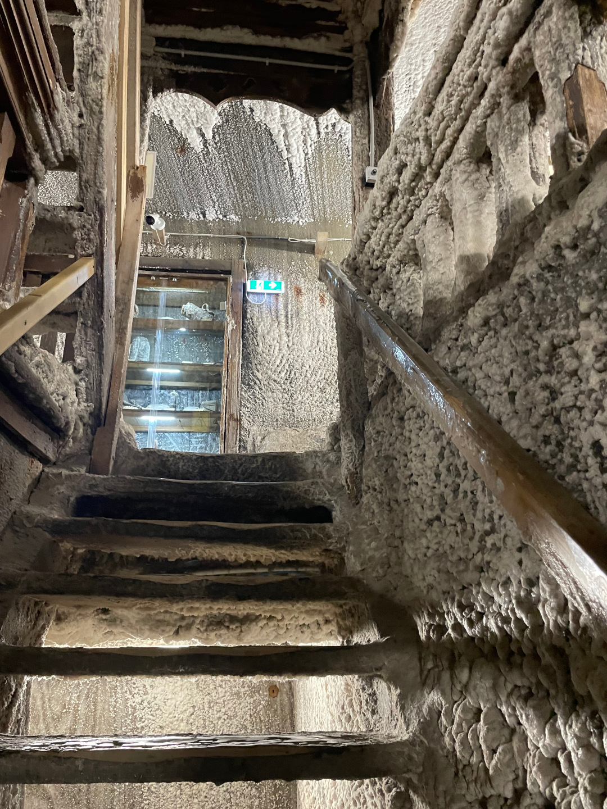
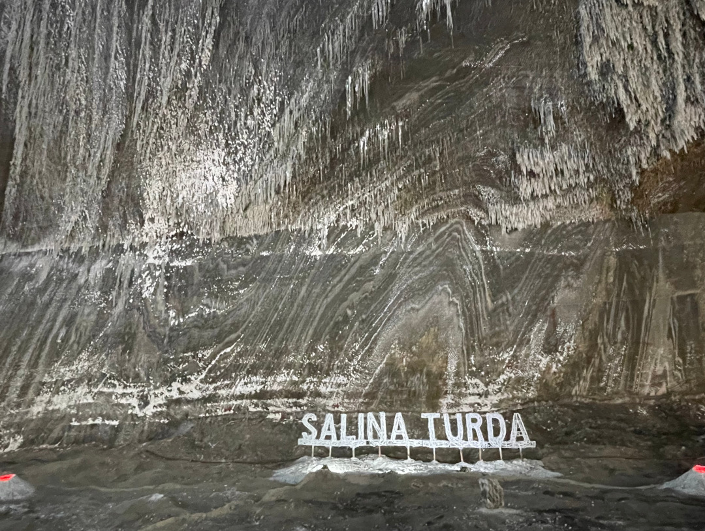
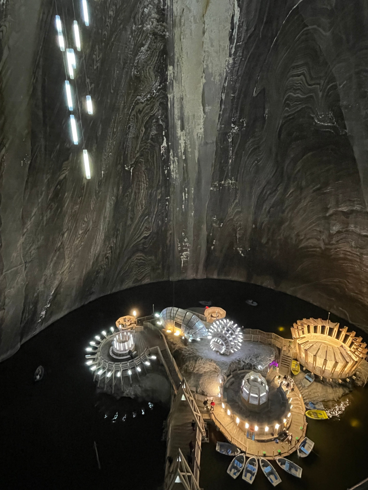
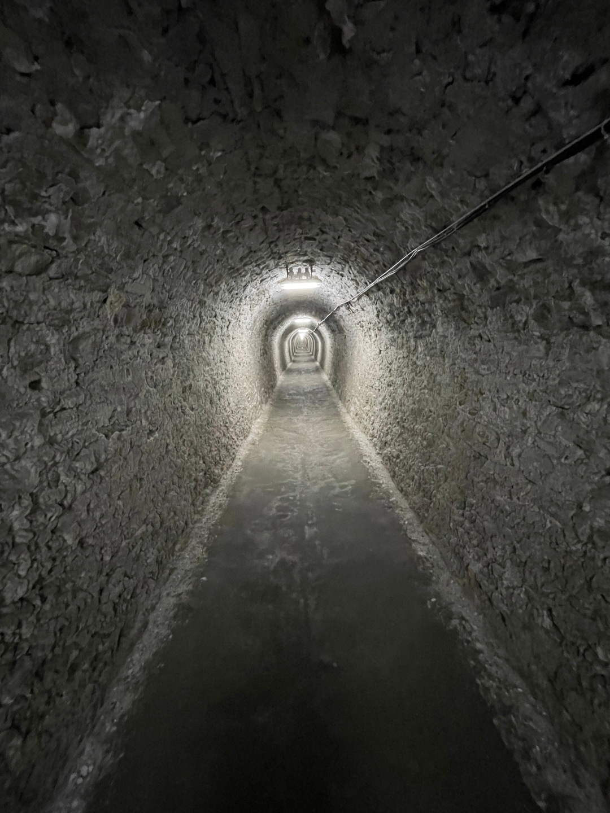
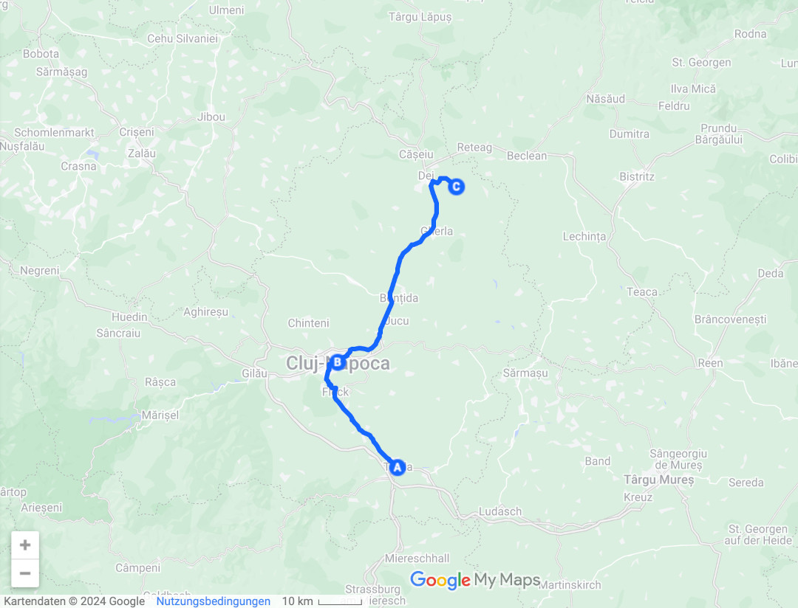

Es geht immer weiter in Rumäniens Norden rund um die zweitgrößte Stadt des Landes: Cluj.

<!--more-->

🗓️ 4. Mai: Trotz des kleinen Überfalls gestern Abend verläuft die Nacht relativ ruhig. Am Morgen ist dann natürlich viel los, aber alle sind früh dran und weit vor uns schon weitergezogen. Wir haben ja auch Zeit genug und starten mit derselben Henry-Runde wie gestern Abend in den Tag.  Wir packen alles zusammen und bezahlen. Weil uns der Hofbesitzer noch so viele Tipps rund um Cluj gegeben hat, ändern wir etwas unsere Planungen und verzichten auf einen richtigen Stopp in der Stadt und gucken uns eher das Umland an. Wir fahren in das Naturschutzgebiet Cheile Turzii und wollen durch die gleichnamige Schlucht wandern. Am Ostersamstag haben sehr viele die Idee. Die Wanderung durch die Schlucht sind 2 km in die eine Richtung und 2 km zurück. Oder man wählt die Alternative und wandert durch die Berge zurück und kann von oben noch auf die Schlucht gucken und hat in Summe dann ca. 7-8 km. Die meisten wandern nur durch die Schlucht und deshalb staut sich hier alles. Wir wandern daher durch die Berge zurück und müssen zunächst 350 Höhenmeter bergauf. Die laufen wir aber nicht wie üblich durch Serpentinen langsam hoch, sondern direkt geradeaus bergauf. Teilweise ist es schon sehr steil, aber machbar. Oben angekommen haben wir einen guten Blick auf die Schlucht. Hier ist es auch nicht mehr so voll wie unten. Der Abstieg geht genauso steil und man muss quasi immer von Baum zu Baum bergab rennen, sonst rutscht man aus, aber auch das ist insgesamt machbar. Unten am Parkplatz machen wir noch ein kleines Picknick und fahren dann zum Stellplatz für heute Nacht in Turda. Wie so oft ist dort niemand, nur eine Telefonnummer. Wir rufen den Sheriff an und er meint, wir können uns hinstellen, wo wir wollen, er kommt in 30 Minuten. Wir bereiten den Bulli für die Nacht vor und als der Besitzer dann kommt, ruft er nur: Come here with your wife. Kein netter Ton, aber als wir bei ihm sind, gibts als Entschädigung Wodka. Frauen trinken natürlich nicht den Männer-Wodka, sondern für die gibt es extra einen Kirschwodka. Wir lernen auch noch Stefan aus Bielefeld kennen, der mit dem Motorrad hier ist. Der Besitzer gibt einige Runden Wodka und wir gucken noch das BVB-Spiel gegen Augsburg. Nach etlichen Runden Wodka und ein paar Snacks meint der Besitzer dann er muss jetzt in die Kirche, heute ist ja Osternacht. Er fragt, ob wir mitkommen wollen, aber keiner hat so wirklich Lust. Wir besorgen uns noch etwas zu essen und beenden den Tag. Kurz bevor wir ins Bett gehen wollen, trauen wir unseren Augen nicht, als erst ein polnischer Geländewagen und dann die ganze Kolonne von gestern wieder angerollt kommt. Wir hatten schon schönere Überraschungen, aber heute stehen wir ganz woanders und sie stören deshalb nicht so sehr wie gestern.

🗓️ 5. Mai: Als wir aufwachen, sind die Kolonne und auch Stefan schon weg. So können wir jedenfalls entspannt in den Tag starten. Wir machen uns ebenfalls startklar und fahren in eine ehemalige Salzmine auch hier in Turda. Vorher wollen wir aber noch etwas Frühstück besorgen und das gesammelte Pfand wegbringen. Seit dem Aufbruch in Deutschland ist Rumänien das erste Land, das ebenfalls ein Pfandsystem hat. Ohne war es deutlich einfacher. Heute ist Ostersonntag, weil aber sonst an allen anderen Feiertagen (1. Mai, Karfreitag) auch die Supermärkte geöffnet hatten, gehen wir davon aus, dass es auch an Ostersonntag so ist. Leider werden wir vor dem Kaufland enttäuscht. Ostersonntag ist einer der wenigen Tage, an denen fast alles geschlossen hat, auch der Großteil der Restaurants. Keine guten Voraussetzungen für heute. So geht es erstmal ohne Frühstück zur Salzmine, weil in Turda wirklich alles geschlossen hat, das potentiell Essen verkaufen könnte. Die Salina Turda diente bis 1932 als Salzmine, bis 1992 als Käselager und jetzt als Touristenziel. Man kann die Mine an sich anschauen, aber es gibt auch Minigolf, Tischtennisplatten und sogar Ruderboote unten in der Mine. Es ist aber mit 10-12 Grad immer relativ kalt. Das Salzvorkommen sieht man überall an den Wänden. Es könnt den Salzbedarf der Erde für 60 Jahre decken. Nach dem Ausflug in die Salzmine und oben wieder im Warmen angekommen steht mal wieder Wäsche waschen auf dem Programm. Wir fahren nach Cluj und suchen uns einen Waschsalon, der auch glücklicherweise geöffnet hat. Während der Wäsche können wir bei dem Mc Donalds nebenan noch Essen ergattern. Eins der wenigen Restaurants, auf die immer Verlass ist. Auch während Ramadan in Marokko war das schon öfter unsere Rettung. Gut gestärkt und mit frischer Wäsche geht es nach Dej. Hier wollen wir heute Nacht schlafen. Der Campingplatz entpuppt sich als Garten von zwei älteren Holländern. Wir sind die einzigen Camper. Nur ein junges schweizer Paar schläft noch irgendwo mit im Haus. Wir unterhalten uns noch etwas mit den beiden und sie erklären uns alles. Sie kommen schon seit zwanzig Jahren hier hin. Jeden Tag lernt man neue nette Leute kennen. Wir gehen noch eine Runde mit Henry die Umgebung und müssen eine improvisierte Brücke über einen Fluss überwinden, aber finden schlussendlich auch wieder heile zurück in den Garten. Weil wir nicht einkaufen konnten und Mc Donalds nicht zweimal am Tag herhalten soll, gibt es etwas aus unserem Nudelvorrat, bevor es uns in den Bulli zieht.

