Nach dem Besuch in Braga geht es über Porto zurück an die Küste in Richtung Süden bis zum Surferhotspot Nazaré.

<!--more-->

🗓️ 5. Februar: Wir verlassen Braga mit einer letzten Henry-Morgenrunde. Wir besorgen uns Frühstück und entscheiden Porto mit dem Zug anzusteuern, so dass wir keinen Parkplatz für den Bulli in der Stadt suchen müssen. Wir wollen in Leandro ca. 10 km nördlich von Porto den Bulli stehen lassen und dann den Zug nehmen. Hunde dürfen sogar kostenlos mitfahren. Leider kommen wir genau in dem Moment an dem Bahnhof an, als unser Zug wegfährt. Der nächste Zug kommt erst in 1 Stunde und so lange wollen wir nicht warten. Deshalb entscheiden wir uns für eine andere Bahnlinie südlich von Porto, da hier auch unser Stellplatz für die Nacht liegen soll. Dort angekommen passt alles und wir sind innerhalb von 5 Minuten in Porto. Ob wir am Automaten auf portugiesisch die richtigen Tickets gekauft haben, weiß aber niemand. Kontrolliert werden wir jedenfalls nicht. Wir erreichen Porto südlich des Flusses Douro und überqueren die Ponte Luis I. So hoch kam mir die Brücke bei meinem letzten Besuch in Porto nicht vor. Im Nachhinein habe ich gemerkt, dass man auch eine Etage tiefer langlaufen kann und wir damals wohl immer diesen Übergang genutzt haben. Hanna und Henry genießen die Aussicht von der Brücke und ich bin einfach nur froh drüben zu sein. Erst recht, wenn neben dir noch die Straßenbahn entlangfährt und die Brücke extrem rappelt. Wir begucken uns die Kathedralen der Stadt, die Altstadt, die typischen Straßenbahnen und die bunten Häuserviertel unten am Fluss. Danach geht es mit dem Zug zurück zu unserem Bahnhof. Wir kaufen noch etwas ein und fahren zum Campingplatz, der bisher der vollste der Reise ist. Immerhin sind wir direkt am Strand, so dass unsere letzte Runde mit Henry am Strand entlangführt. Wir essen noch etwas und dann geht es ab in den Bulli. Die Baustelle neben uns hat leider noch nicht Feierabend.

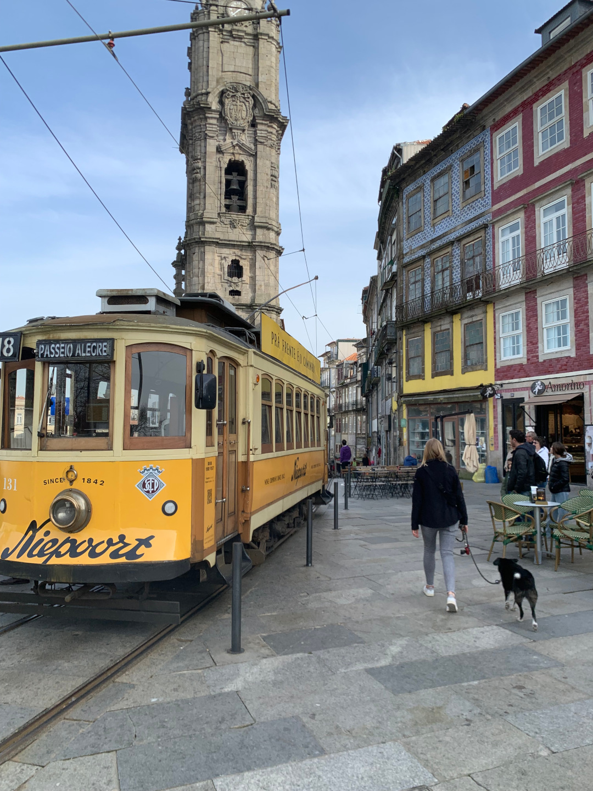

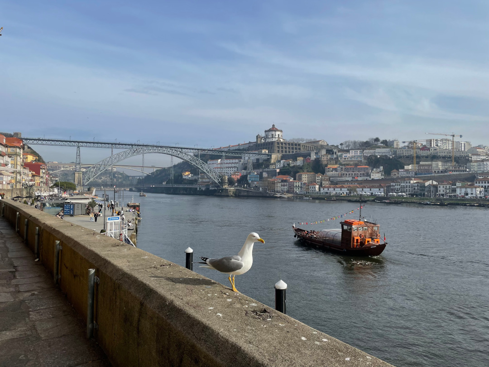

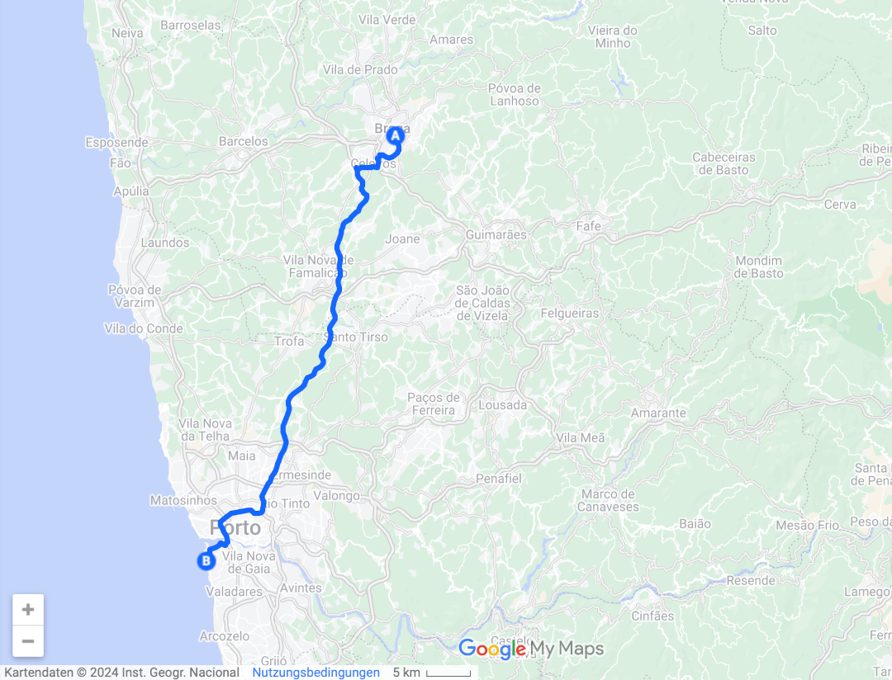

🗓️ 6. Februar: Die Nähe zum Meer nutzen wir auch an diesem Morgen und laufen mit Henry den Strand runter. Danach sind wir auch wieder froh den Campingplatz zu verlassen. Eigentlich hatten wir jetzt noch zwei Tage im Serra da Estrela Nature Park geplant, doch irgendwie haben wir gestern irgendwo gelesen, dass es die höchsten Wellen der Welt in Nazaré an der Küste Portugals geben soll. Zum Glück sind wir so frei die Ziele neu zu wählen. So machen wir uns auf den Weg von Porto in Richtung Nazaré. Leider liegen die beiden Campingplätze in Nazaré etwas weiter außerhalb der Stadt, so dass man noch ungefähr eine Stunde zu den besagten Stränden laufen muss. Von den beiden Plätzen hat im Februar sowieso nur einer geöffnet, so dass uns die Auswahl leicht gemacht wurde. Wir kommen gegen Mittag an und machen uns direkt auf den Weg zur Farol de Nazaré und zur Praia do Norte, wo auch die Big Wave Challenge stattfindet. Die Big Wave Challenge ist quasi die Vierschanzentournee der Surfer und Nazaré ist ein Austragungsort. Leider war der Wettkampf schon am 22./23. Januar. Nachdem wir unzählige Höhenmeter bewältigt haben, können wir den Blick vom Farol de Nazaré auf die Klippen und die Wellen genießen. Der Abstieg über die Klippen zum Nordstrand lohnt sich ebenfalls. Selbst an diesem windstillen und sonnigen Tag sind die Wellen schon deutlich höher als an anderen Stränden. Wir bleiben bis zum Sonnenuntergang und vergessen fast, dass wir noch eine Stunde zurücklaufen müssen. Auf dem Rückweg gehen wir noch kurz einkaufen. Wie immer lassen wir Henry draußen auf uns warten. Jedes Mal aber sitzt nachher ein älterer Opa bei Henry und wartet mit ihm darauf, dass wir aus dem Laden kommen. Danach bekommen wir ganz viele Dinge auf portugiesisch erzählt. Generell kommen sehr viele Leute (oft ältere Männer) auf uns zu und wollen Henry streicheln. Wir entscheiden Henry zukünftig nicht mehr allein vor Supermärkten warten zu lassen. Auch wenn wohl nie was Ernstes passieren würde. Zurück am Campingplatz kochen wir noch schnell und legen dann endlich die Füße hoch.

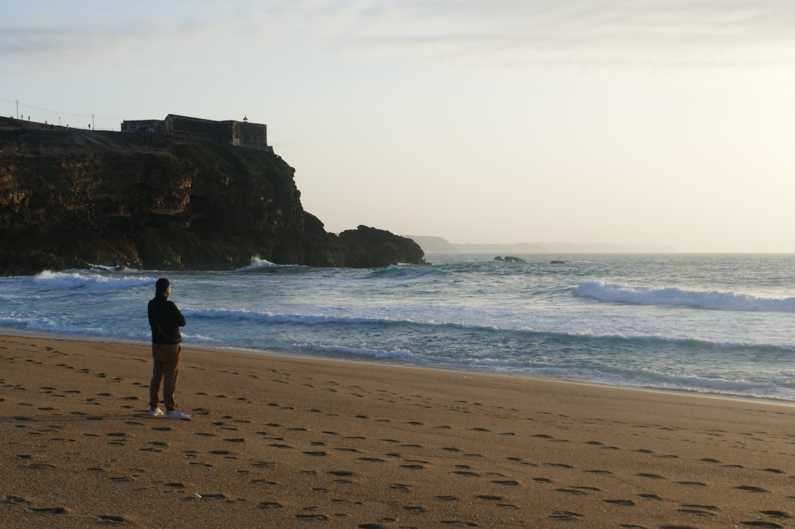

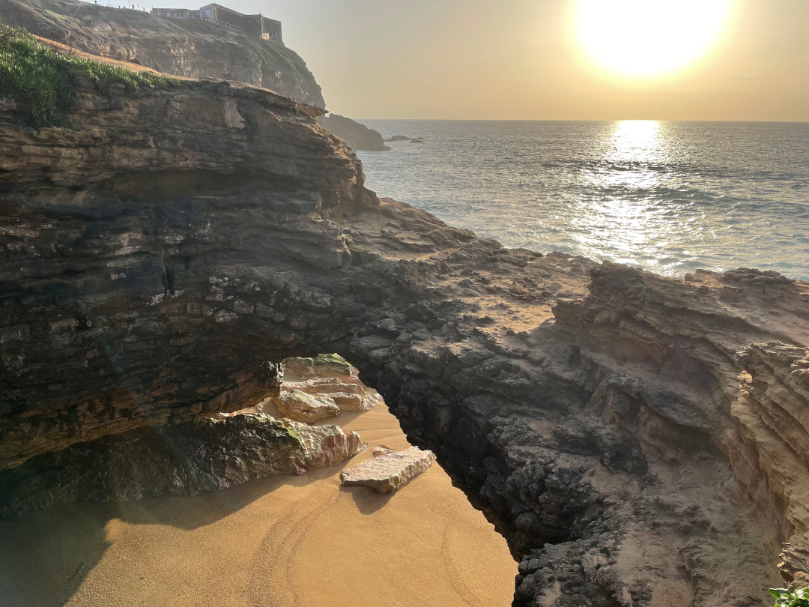

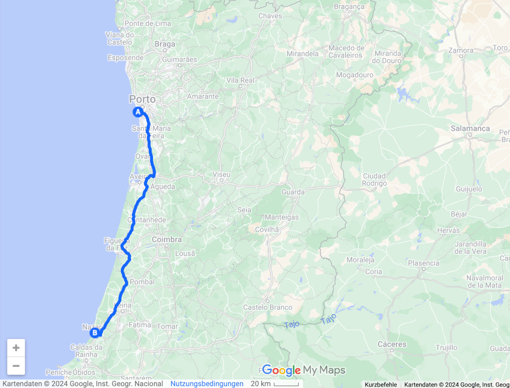

🗓️ 7. Februar: Der Tag startet wie immer aktiv. Wir besteigen mit Henry den Monte de Sao Bartolomeu. Einen Berg in den Pinienwäldern vor Nazaré. Oben angekommen könnte man noch eine Aussichtsplattform besteigen, die aber leider nur für die Feuerwehr vorgesehen ist, um Waldbrände rechtzeitig zu erkennen. Dennoch können wir auch ohne Plattform bis zum Atlantik gucken. Einen Waldbrand erkennen wir aber nicht. Zurück am Bulli nutzen wir den Tag, um etwas aufzuräumen und Wäsche zu waschen. Nachdem Frühstück geht es erneut nach Nazaré. Erneut müssen viele Höhenmeter bewältigt werden, sogar so viele, dass wir auf der Rua do Horizonte entlanglaufen. Die Straße macht ihrem Namen alle Ehre und ist die Verbindungsstraße zwischen Hauptstrand und Nordstrand. Am Ende der Straße erkennt man wirklich nur den Horizont. Ansonsten laufen wir noch etwas durch den Ort und die kleinen Gassen. Der Ort ist sehr international und im Sommer bestimmt sehr überfüllt, aber jetzt im Februar sehr entspannt. Wir suchen uns ein Plätzchen am Strand und machen einfach nichts. Wir entspannen, lesen und hören Hörbücher. Hanna entscheidet sich spontan dazu ihren ersten Surfkurs zu besuchen. Wenn nicht in Nazaré, wo sonst? Das Surfen klappt ganz gut und nach den ersten Stürzen können die meisten kleinen Wellen gemeistert werden. Vielleicht wird das Surfen ja noch an anderen Ort verfeinert. Henry und ich gucken aus sicherer Entfernung am Strand zu. Da es auch jetzt schon wieder relativ spät ist und es aufgrund der Stunde Zeitverschiebung schon immer vor 18 Uhr dunkel wird, verzichten wir aufs Einkaufen und plündern unseren Dosenvorrat, den wir aus Deutschland mitgebracht haben.

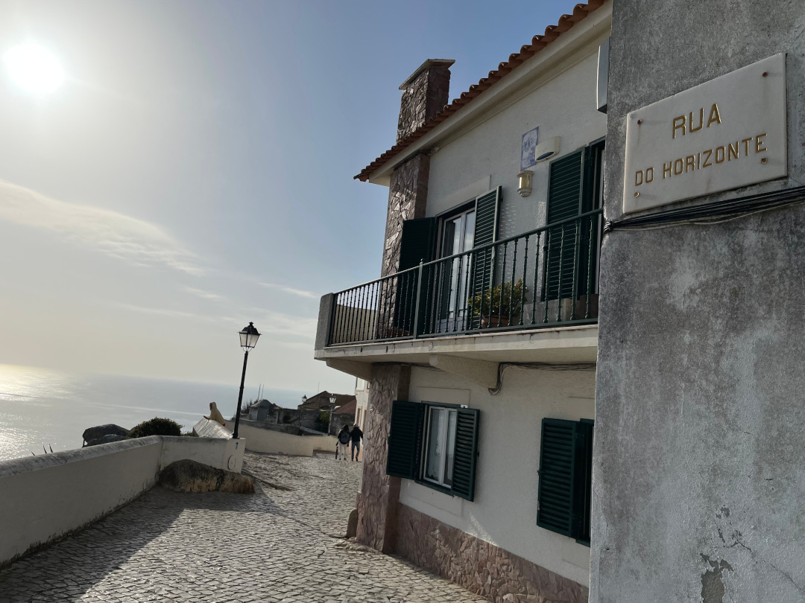

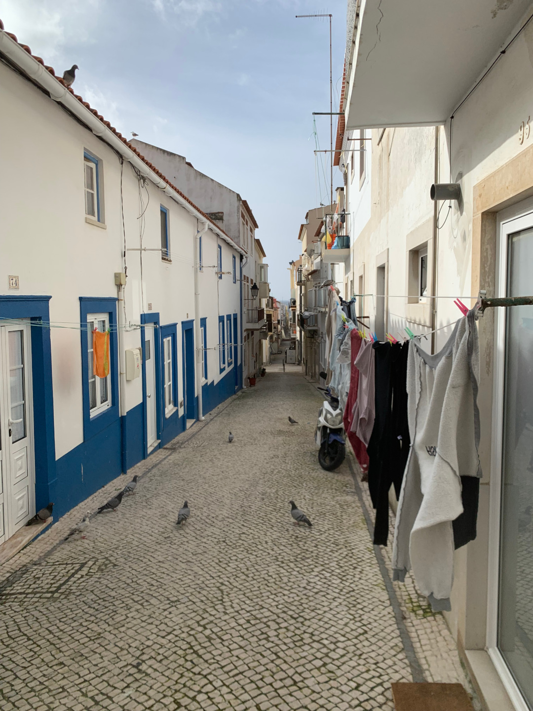

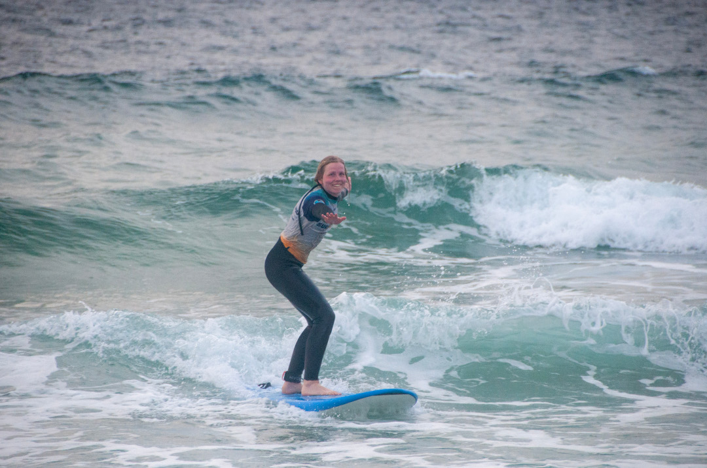

🗓️ 8. Februar: Mit dem heutigen Tag sind wir 15 Tage unterwegs und es regnet das erste Mal. Dazu ist es noch sehr windig. Die Routinen im Bulli für Regenwetter müssen noch eingespielt werden, aber sind nach kurzer Zeit angepasst. Wir nutzen das windige Wetter und wollen ein letztes Mal zum Nordstrand, um die hoffentlich hohen Wellen zu sehen. Wir besorgen uns Frühstück und hätten gerne direkt am Strand gefrühstückt, müssen es aber leider in den Bulli verlegen, weil es so stark regnet. Wir können aber glücklicherweise so parken, dass wir auch aus dem Bulli das Meer sehen können. Nach kurzer Zeit ergibt sich eine kurze Regenpause, die wir natürlich ausnutzen wollen. Unten am Strand angekommen werden wir nicht enttäuscht. Die Wellen sind wirklich unfassbar hoch. Dank des Wetters ist man auch quasi allein am Strand. Die Wellen brechen direkt vor den Klippen und das Wasser spritzt meterweit. Surfer sieht man aber keine. Bei dem Wetter ist das wohl auch besser so. Zurück im Bulli entscheiden wir uns dazu noch nach Fátima zu fahren. Wir wollen uns das Heiligtum von Fatima ansehen. Die Kirche (Basilica da Santissima Trindade) in Fátima ist die viertgrößte der Welt und besitzt den größten Kirchenvorplatz der Welt. Das macht das Wetter leider auch nicht besser, so sind wir aber wenigstens auch hier dank des Wetters fast die einzigen Besucher. Man kann aber erahnen, dass noch ein paar mehr Menschen auf diesen Kirchenvorplatz passen. Wir verzichten auf den Kirchenbesuch zu jeder vollen Stunde und fahren weiter in Richtung Rio Maior. Das Wetter lässt heute kein Outdoor-Kochen zu, so dass wir auf das Restaurant zur goldenen Möwe zurückgreifen müssen. Mit Proviant im Gepäck fahren wir nach Póvoa do Manique. Hier schlafen wir die Nacht auf einem Bauernhof. Wir sind die einzigen Gäste und es regnet die ganze Zeit weiterhin. Wir verbringen den Abend im trockenen Bulli u.a. mit dem Schreiben von diesen Texten.

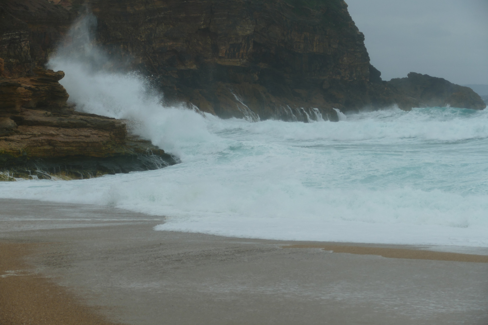

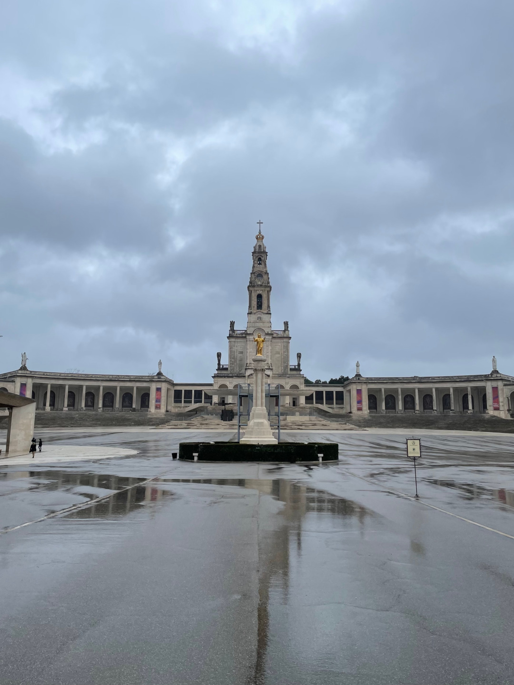

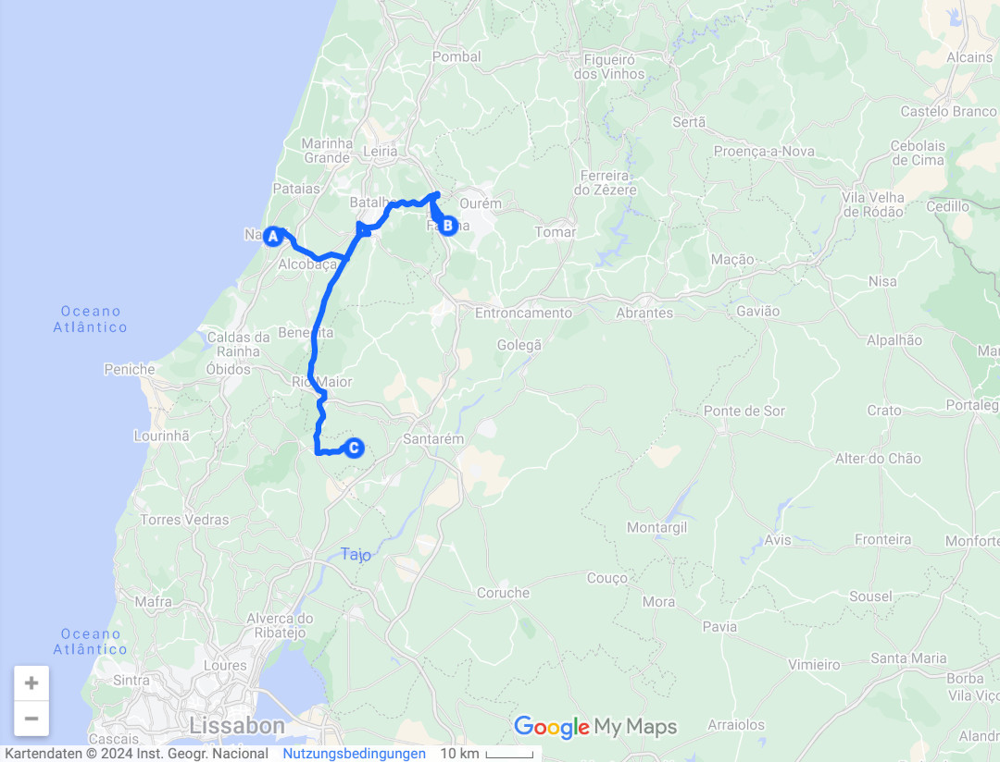