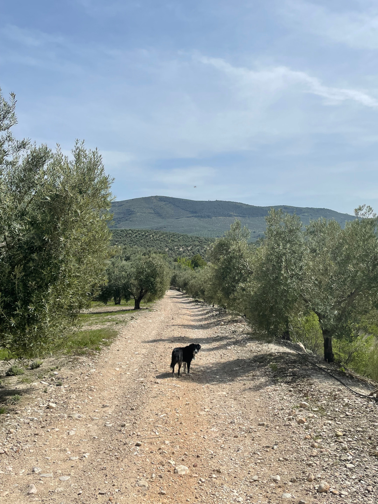
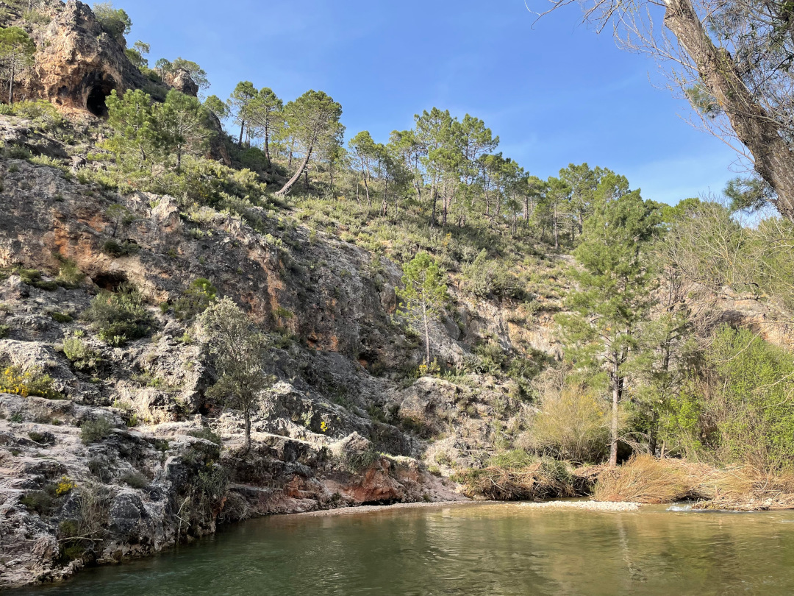
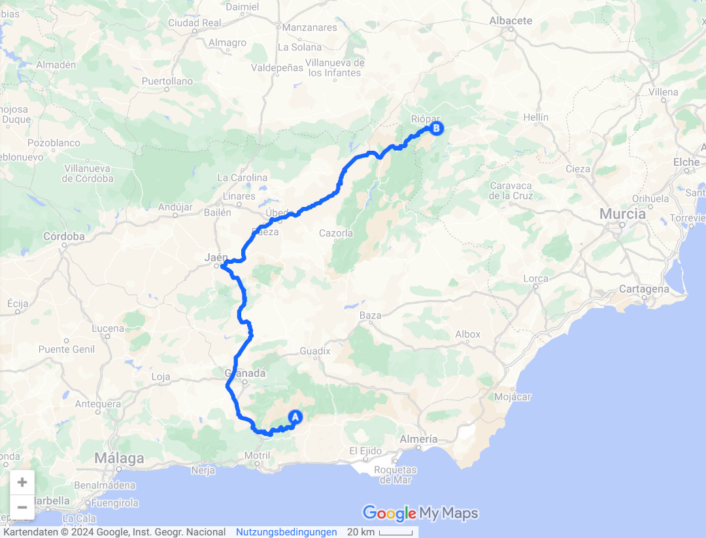
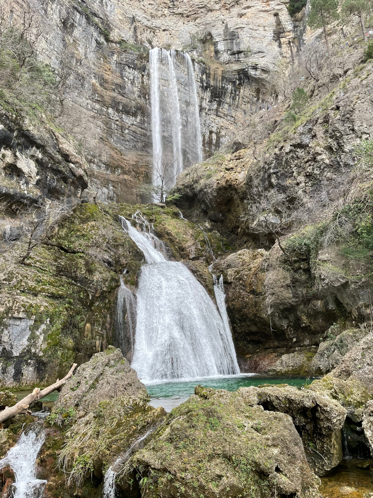
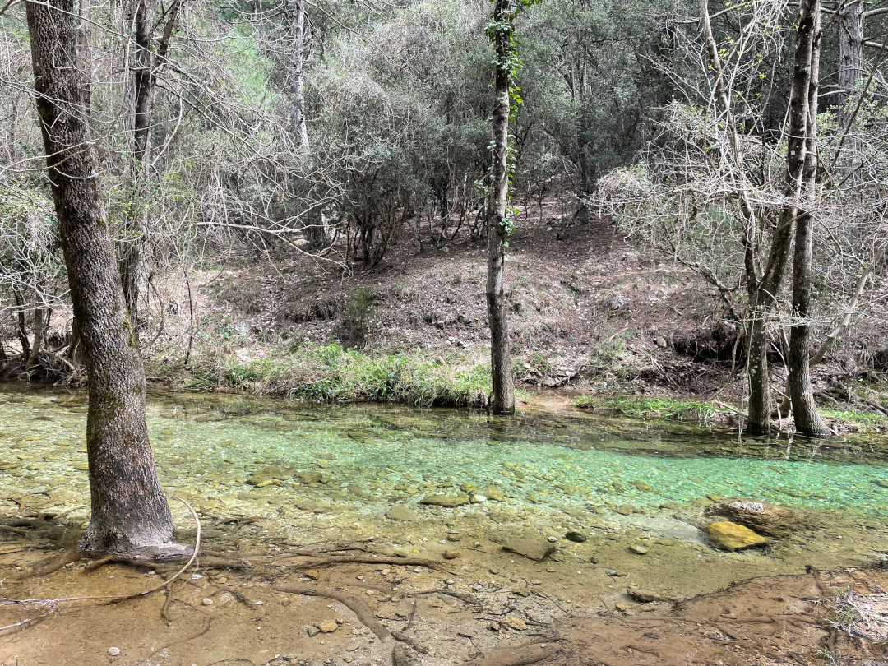
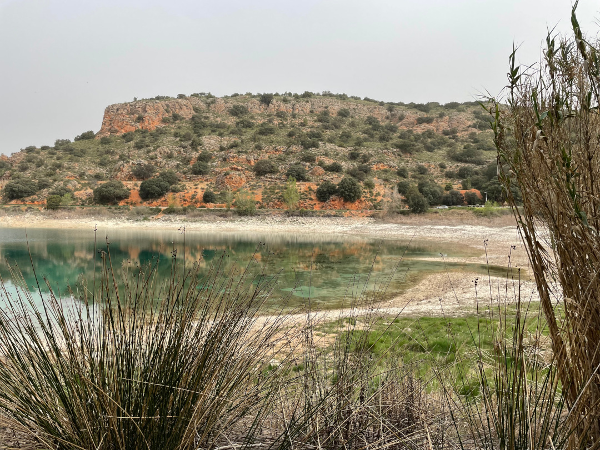
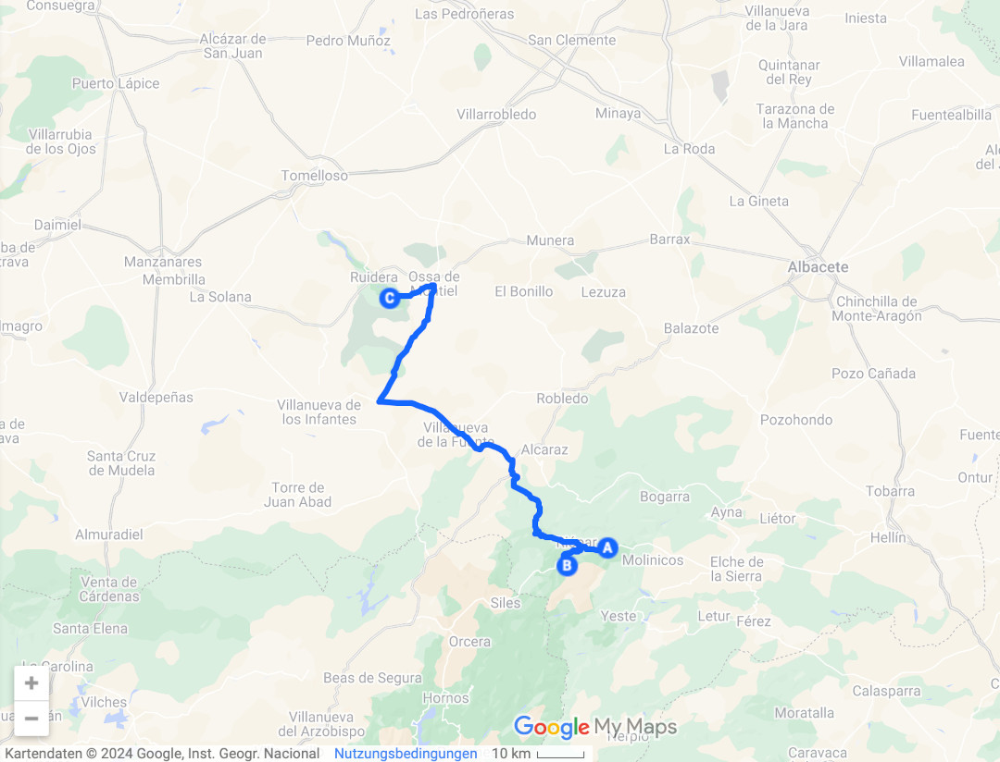

Ab jetzt geht es für uns in Richtung Madrid, aber unterwegs nehmen wir noch ein paar Naturschutzgebiete mit.

<!--more-->

🗓️ 5. April: Die zweite Nacht in den Bergen ist zum Glück nicht ganz so kalt wie die erste. Die Beine sind noch etwas schwer von gestern, aber uns bleibt nichts anderes übrig, als auf der ersten Henry-Runde direkt wieder ein paar Höhenmeter zu überwinden, weil der Platz in den Hang gebaut ist. Danach machen wir den Bulli wieder fit, füllen unser Wasser auf und fahren los. Unseren ersten Stopp machen wir aber nur etwa 20 Kilometer weiter in dem kleinen Ort Pampaneira. Er liegt direkt an den Serpentinen und hat schöne Gassen und eine kleine Bäckerei zu bieten. Dieses Mal gibt es ein sehr leckeres krapfenartiges und zitroniges Gebäck für uns. Dann wollen wir schon mal ein paar Kilometer in Richtung Madrid zurücklegen. Auf dem Weg gibt es zwischenzeitlich so weit das Auge reicht nur Olivenplantagen. Wir halten noch für einen Einkaufsstopp in Úbeda und kommen dann in das nächste Naturschutzgebiet, den Parque Natural de Los Calares del Mundo y de la Sima. Dementsprechend grün ist es und der Duft von Nadelbäumen hängt in der Luft, auch mal wieder schön. Unser Campingplatz ist direkt am Fluss, dem Rio Mundo, gelegen und Tobi lässt es sich nicht nehmen zur Erfrischung reinzuhüpfen. Dann packen wir nach längerer Zeit mal wieder unseren Kocher aus, holen Eis zum Nachtisch und waschen noch schnell Wäsche. Weil es tagsüber heute sehr warm war, ist der Abend auch vergleichsweise mild und so können wir lange draußen sitzen mit Flussrauschen und klarem Sternenhimmel.

🗓️ 6. April: Bis auf die Rufe der Zwergohreule, die uns jetzt schon seit einigen Nächten begleiten, ist die Nacht hier sehr ruhig. Die Eule legt immer nach Sonnenuntergang los und klingt ein bisschen wie eine Alarmanlage. Auf ihren Namen kamen wir auch nur durch die professionelle Google Recherche  „Vogel Spanien Alarmanlage“ und eine Stimmprobe bei Wikipedia. Nervig ist sie aber trotzdem nicht, eher beruhigend. Der erste Spaziergang führt uns heute am Fluss durch den Wald. Dann fahren wir zu einem Wanderparkplatz etwa eine halbe Stunde entfernt. Von hier aus wollen wir zum Rio Mundo Wasserfall laufen. Wie so oft am Wochenende ist schon an den Parkplätzen sehr viel los. Die Spanier wandern wohl gerne mit der ganzen Familie und picknicken vor allem gerne. Auf den 4 Kilometern zum Wasserfall verteilt es sich nach anfänglichem Stau dann aber eigentlich ganz gut. Es geht meist über geteerte Wege, auf denen aber keine Autos fahren, und ist bis auf ein paar matschige Stellen also easy. Am Wasserfall angekommen muss man sich durch die selfiesmachenden Menschen erstmal einen Weg bahnen, um freie Sicht zu haben. Er fängt schon sehr hoch an und fällt dann in mehreren Stufen, ist also auf jeden Fall sehenswert. Wir wandern noch am Wasserfall und weiter am Fluss hinunter und machen uns dann wieder auf den Rückweg. Auch am Parkplatz finden jetzt überall Picknicke statt. Wir haben aber gut gefrühstückt und reihen uns deshalb nicht ein. Stattdessen düsen wir weiter. Bei den Lagunas de Ruidera finden wir den einzigen Campingplatz auf dem Weg nach Madrid. Der ist zwischen vielen Seen aber auch ganz schön gelegen. Wir sind schon gegen 17 Uhr da und dann ist Entspannung angesagt.

