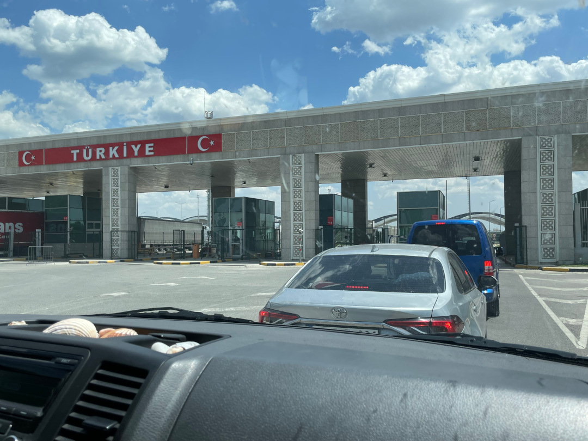
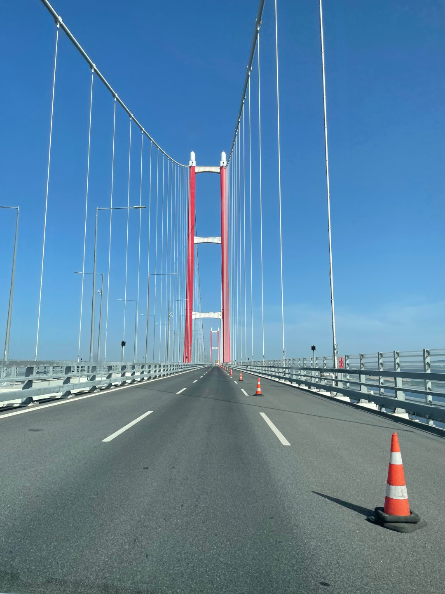
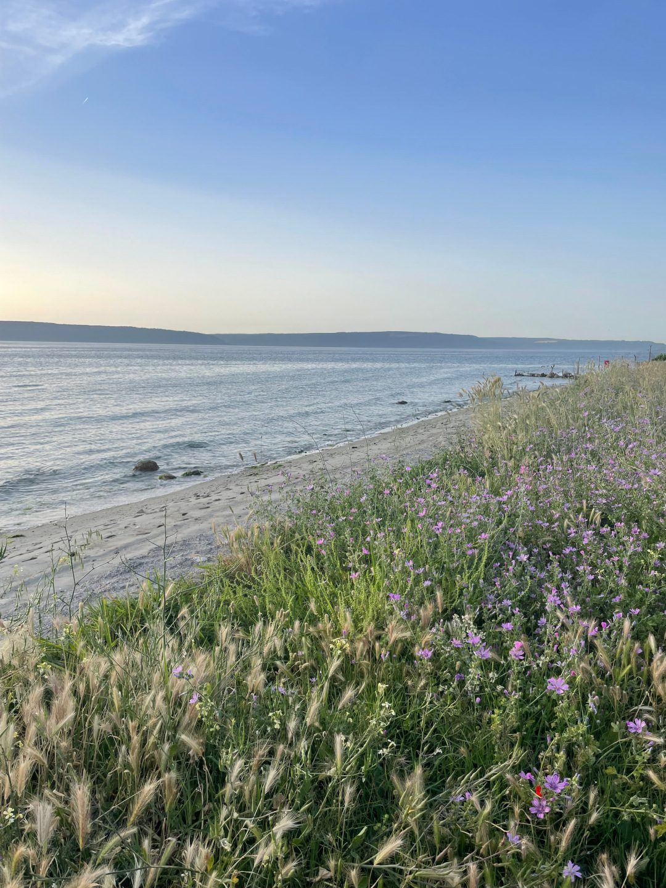
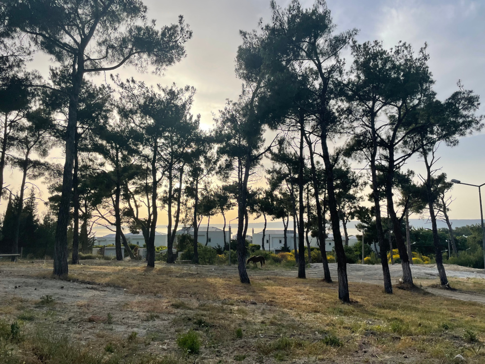
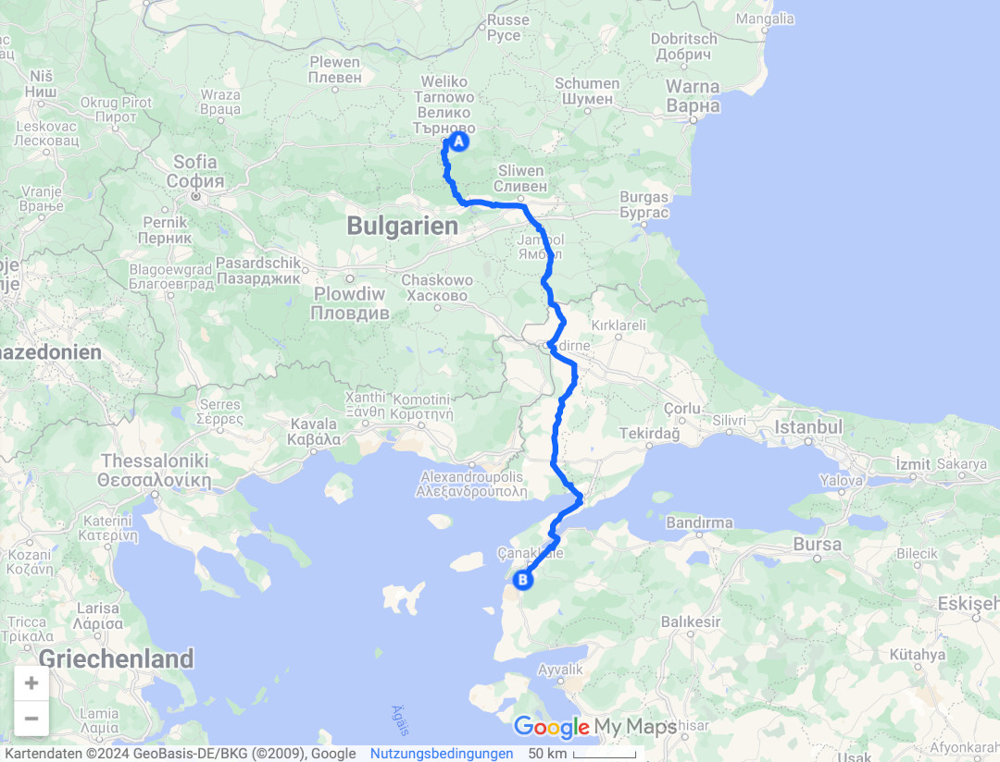
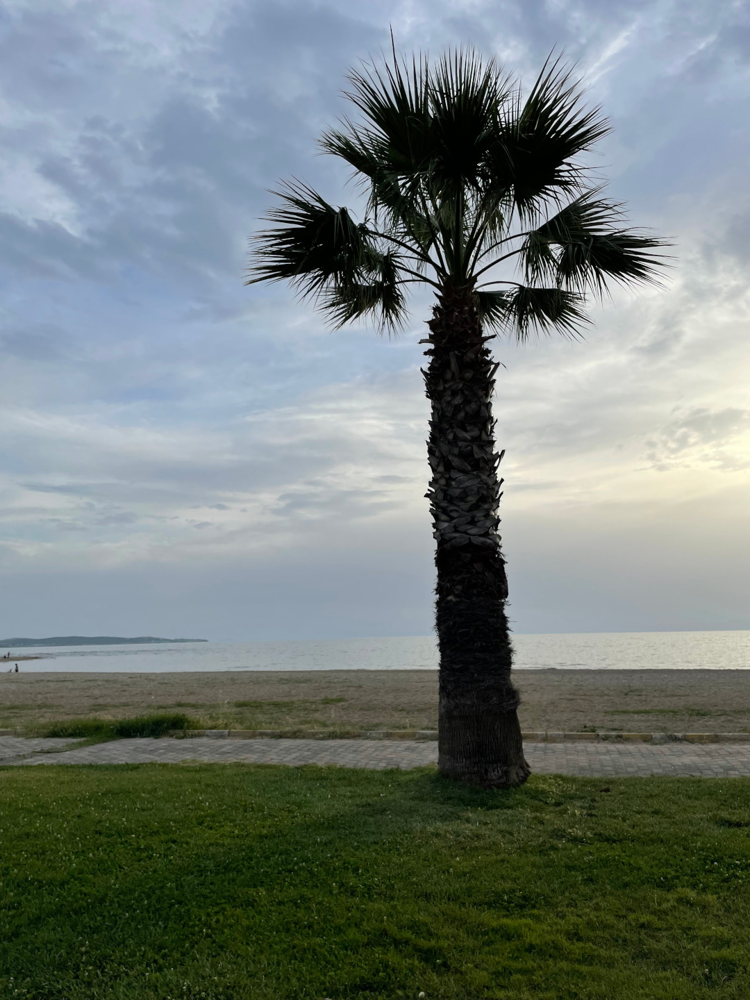
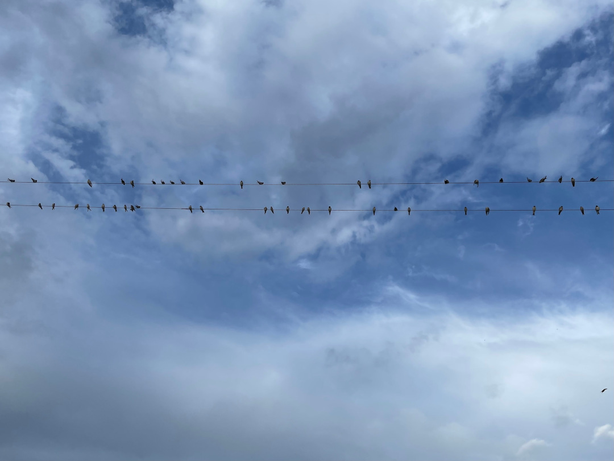
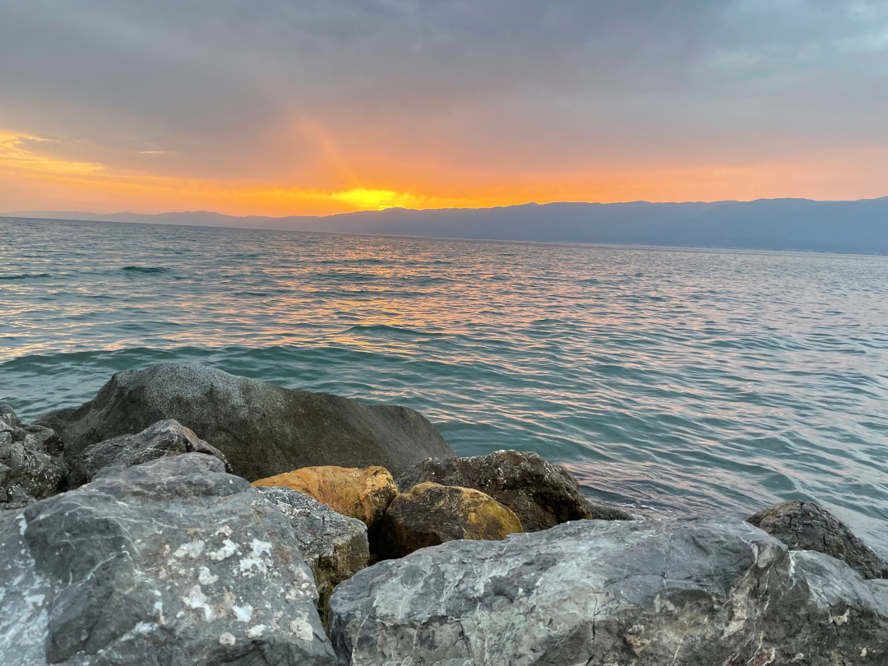
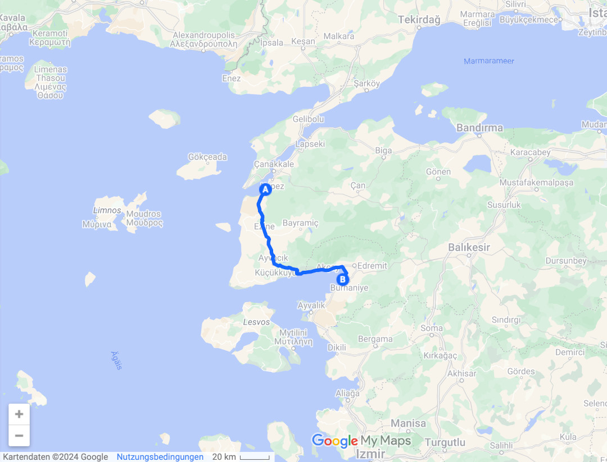

Nach vielen Wochen in Rumänien und Bulgarien geht unsere Reise jetzt weiter nach Osten.

<!--more-->

🗓️ 5. Juni: Dank des Weckers sind wir heute früh auf den Beinen. Wir wollen nämlich viele Kilometer und eine Landesgrenze hinter uns lassen. Wir drehen eine letzte Runde im Pool und verabschieden uns von Nicki, der englischen Campingplatzbesitzerin. Wir nutzen die Chance und machen im Lidl einen letzten „deutschen“ Einkauf. Dabei fällt uns auf, dass wir bei Nicki unser Essen im Kühlschrank vergessen haben. Also noch einmal kurz zurück und dann kann die Fahrt endlich losgehen. Wir fahren noch fast drei Stunden durch Bulgarien, bis etwas überraschend die türkische Grenze ausgeschildert ist. Vor jeder Grenze räumen wir immer etwas den Bulli auf, in der Hoffnung, dass die Kontrolle nicht so intensiv wird. Die bulgarischen Grenzbeamten interessieren sich nicht wirklich für uns, was auf der türkischen Seite schon anders ist. Wir beide müssen aussteigen und es wird noch ein Foto/Filmaufnahme gemacht. Das geht aber auch relativ fix. Der Zoll guckt kurz ins Auto, interessiert sich dann aber doch mehr für Henry als für den restlichen Inhalt. Alles wie immer also. So schnell wie die Grenze vor uns war, ist sie dann auch vorbei. Wir werden mit feinsten türkischen Straßen begrüßt. Nach den unendlichen Fahrten auf Holperpisten in Osteuropa ist das jetzt wirklich sehr unerwartet. Es gibt vernünftige Autobahnen und vierspurige Schnellstraßen. So kann man als Beifahrer nun auch wieder mal etwas schlafen, was in Moldau, Rumänien und Bulgarien überhaupt nicht möglich war. Wir nehmen die erste Abfahrt zur Tankstelle, um eine Maut-Vignette zu kaufen. Die Frau an der Tankstelle kann uns nicht helfen, sie möchte nur gerne 4€ in Lira gewechselt haben. Weil wir noch kein Bargeld haben, können wir leider nicht helfen. Wir finden einen Handyshop, wo es angeblich die Vignette gibt. Der Besitzer des Handyshops ist auch zeitgleich der Postbeamte des Post Offices nebenan. Da verkauft er auch die Vignetten. Die Vignetten lädt man mit einem Betrag auf, der dann pro gefahrene Strecke abgebucht wird. Also quasi ein Mix aus Italien und Österreich. So vergehen die restlichen dreieinhalb Stunden Fahrt sehr schnell. Das letzte Highlight der Fahrt ist die 1915 Canakkale Brücke. Eröffnet wurde sie 2022, benannt aber nach einer Schlacht von 1915. Gemessen an der Spannweite ist diese Brücke die längste Hängebrücke der Welt. Die Brücke verbindet den europäischen und den asiatischen Teil der Türkei und damit erreichen wir den dritten Kontinent auf unserer Reise. Danach erreich wir relativ schnell Güzelyali, wo wir unsere erste Nacht in der Türkei verbringen. Am Campingplatz selber sind neben uns noch zwei Engländer. Nachdem wir mit Henry für eine kleine Runde runter ans Meer gegangen sind, bietet die Besitzerin  noch an für uns zu kochen, was wir gerne annehmen. Ihre kleine Tochter übersetzt für sie ins Englische. Es gibt Köfte, Kartoffeln, Salat, Brot und Manti (türkische Tortellini) mit Knoblauchsoße. Als wir gerade fertig sind, werden noch gefüllte Weinblätter, Pflaumensaft und Tee gebracht. Das bestätigt unsere Vorfreude auf das türkische Essen. So geht es satt zurück zum Bulli, wo uns eine warme Nacht bevorsteht.

🗓️ 6. Juni: An die warmen Nächte müssen wir uns noch gewöhnen, aber wenn man auf Campingplätzen steht, kann man wenigstens nochmal Türen oder Fenster offenlassen. Dafür werden wir aber mit Meerblick direkt vom Bett aus belohnt. Wir lassen es entspannt angehen. Was anderes geht bei den Temperaturen auch nicht. Die üblichen Henryrunden werden hier leider schwieriger, nicht nur wegen der Temperaturen. Es gibt nochmal deutlich mehr Straßenhunde als in Bulgarien oder Rumänien. Mit einigen Tricks kann man sie aber ganz gut fernhalten. Unser Ziel für heute ist Burhaniye. Hier haben wir uns einen Stellplatz direkt am Meer rausgesucht. Auf dem Weg testen wir uns durch die türkischen Supermärkte bzw. eher Carrefours und Migros. Leider sind es meistens kleinere Märkte und nicht so große Kaufhäuser. Alles in allem bekommt man aber trotzdem alles, was man braucht. Bisher ist unser Plan sowieso noch nicht großartig zu kochen. Dafür schmeckt es hier überall zu gut. Am Platz angekommen geht es direkt ins Mittelmeer. Es sind mehr Wellen als gedacht, dafür ist es aber nicht so kalt und sehr klar. Wir laufen noch etwas durch den Ort und finden gute Pide und Kebap zu sehr fairen Preisen. Wir entspannen noch etwas am Meer inklusive Sonnenuntergang und bereiten uns schon auf die nächste warme Nacht vor. Immerhin geht etwas Wind durch den Bulli. Unser neu gekaufter kleiner Ventilator kann auch noch etwas Abkühlung bringen.

