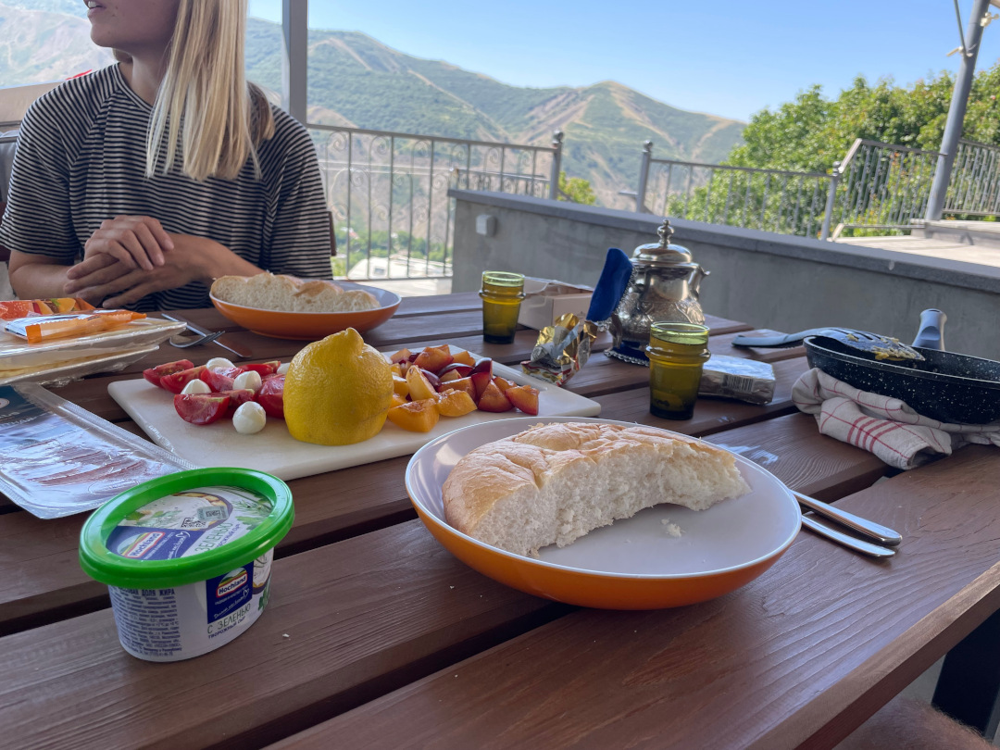
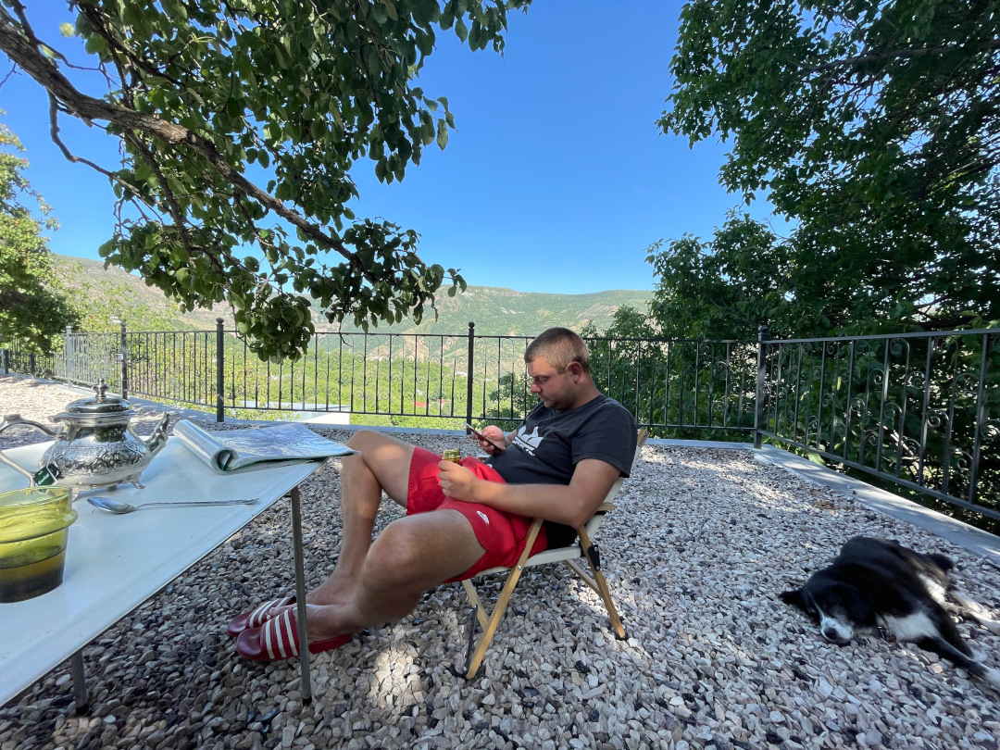
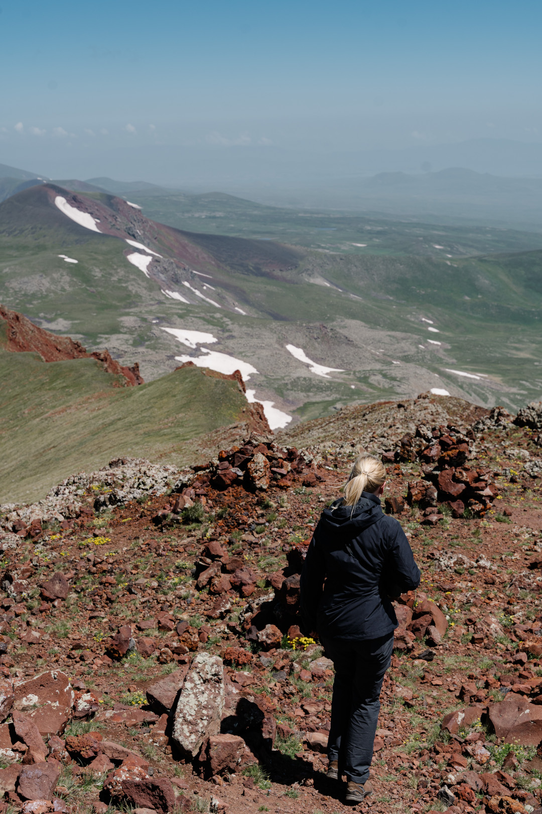
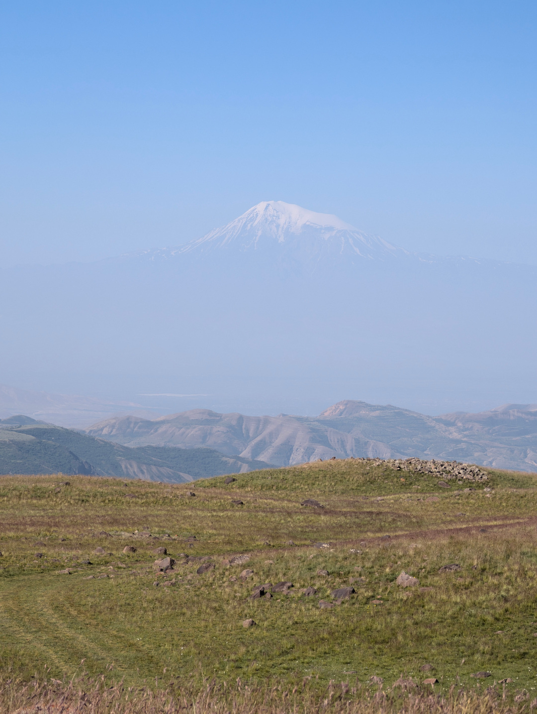
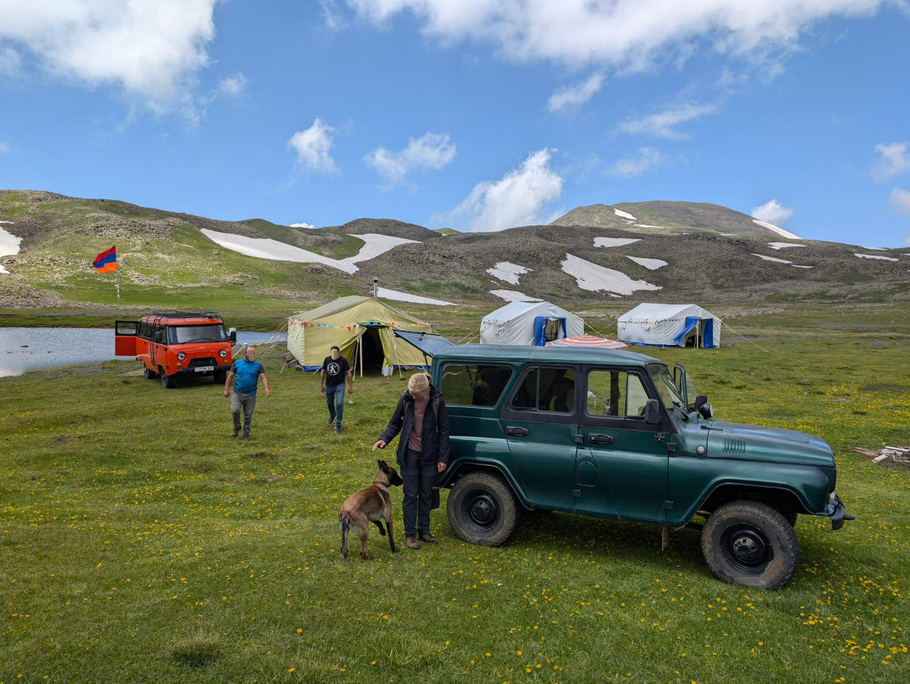
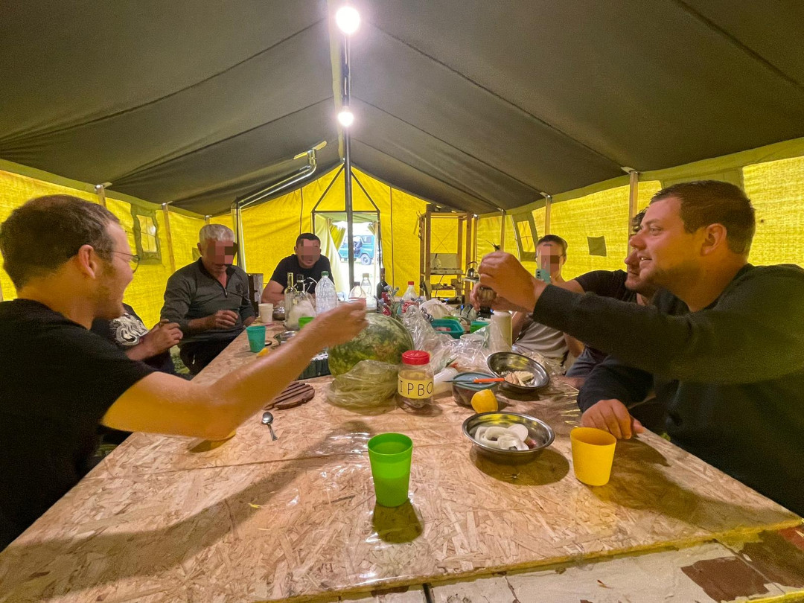
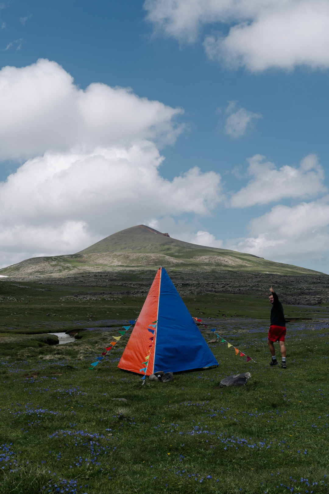
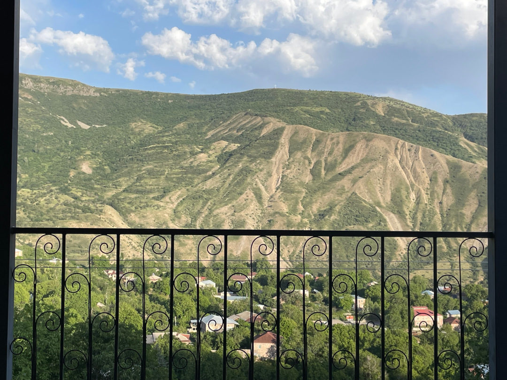

Wir bewegen uns ein paar Tage nicht weiter, weil wir auf einem guten Platz mit netten Menschen gelandet sind.

<!--more-->

🗓️ 5. Juli: Wir bleiben mal wieder länger als geplant, denn der Platz ist wirklich perfekt, um ein paar Dinge zu erledigen und auch ein bisschen Pause zu machen. Henry kann viel freilaufen, begleitet uns also überall hin und freundet sich mit der kleinen Momo an. Morgens gehen wir trotzdem auch für eine Runde mit ihm vom Platz runter und durch den Ort. Wir treffen zum Glück nur einen Straßenhund und der lässt uns weitestgehend in Ruhe. Mit ihrer Schönheit besticht die Runde zwar nicht ganz, weil wir immer an der Straße entlang müssen, aber die Bewegung tut trotzdem gut. In einem kleinen Shop kaufen wir noch ein und mittlerweile kennt uns die ältere Frau schon und freut sich, dass wir wiederkommen. Wir bereiten uns wieder ein gutes Frühstück vor. Ansonsten sitzen wir heute viel auf der Terrasse und genießen die Aussicht auf den Ort und die Berge oder sind am Pool. Später kommen noch zwei Schweizer in unserem Alter an und nach einer Weile fragen sie uns, ob wir eigentlich schon auf dem alten Vulkankrater waren. Wir wissen von nichts und sie erzählen uns von dem möglichen Ausflug mit Wanderung. Tatsächlich wussten wir nichts von der Existenz des Vulkankraters, obwohl er sogar der dritthöchste Berg in Armenien ist und nicht allzu weit von uns entfernt liegt. Wir verabreden, dass wir drüber nachdenken den Ausflug zusammen zu machen. Der Weg ist mit unseren Wagen nämlich nur mit sehr großer Risikobereitschaft zu fahren. Es werden Fahrten mit dem Jeep angeboten bis zum Mountain Camp und die Fahrt ist natürlich erschwinglicher, wenn mehr als zwei Leute mitfahren. Wir kochen aber erstmal und freuen uns wieder über die perfekt ausgestattete Küche. Dann verbringen wir den Abend mit dem deutschen Paar von gestern und dem Schweizer Paar mit Bier am Pool. Es ist wirklich immer wieder interessant die Geschichten von anderen Reisenden zu hören. Am Ende des Abends wird schließlich der Nachbar mit dem Jeep angerufen und der Ausflug für morgen vereinbart. Erst wollten wir erst Sonntag los, also übermorgen, aber das Wetter soll morgen besser sein und wir sollen früh los, damit es noch nicht so windig und die Sicht möglichst klar ist.

🗓️ 6. Juli: Der Wecker klingelt früh, denn später am Tag sollen ja Wind und Wolken aufziehen. Um 8 Uhr werden wir am Tor von dem kleinen Jeep abgeholt. Wir sind eigentlich eine Person zu viel, aber hier ist das kein Problem. So sitzen wir zu viert hinten auf der Rückbank, einer noch vorne und holpern bald die Pisten entlang. Die Fahrt dauert ungefähr zwei Stunden und wir kommen immer wieder an Zelten, Schafsherden und großen Hirtenhunden vorbei. Selbst im Auto gehen uns einige an und so sind wir froh, dass wir ihnen nicht zu Fuß begegnen und erst recht, dass andere Gäste in der Zwischenzeit am Campingplatz auf Henry aufpassen. Je höher wir kommen, desto mehr Schneefelder liegen am Wegesrand. Dann werden wir unterhalb des Kraters rausgelassen, allerdings nicht direkt, um los zu wandern. Stattdessen baut unser Fahrer überraschenderweise erstmal ein Picknick für uns in seinem Kofferraum auf. Es sind noch ungefähr 600 Höhenmeter, die wir zu Fuß überwinden. Am Anfang ist nicht direkt ein Weg zu erkennen, aber nach einigen Metern über Geröll, landen wir auf dem richtigen Weg. Der Aufstieg ist schon anstrengend, aber gut machbar und die Aussicht oben ist toll. Es ist perfekte Sicht und so blicken wir nicht nur auf die direkte Umgebung, sondern sehen in der Ferne auch wieder den Ararat, nur dieses Mal von der anderen Seite und fast ohne Wolken. Und auch der Kratersee ist schön anzusehen. Hier oben auf knapp 3.100 Metern Höhe ist es sehr windig, aber aus Steinen sind Mauern aufgeschichtet, so dass wir eine schöne Mittagspause im Windschatten machen können. Es war sogar wahrscheinlich unsere höchste Wanderung, die wir je gemacht haben. Für den Rückweg teilen wir uns auf. Drei gehen denselben Weg wieder runter, den wir gekommen sind, und zwei gehen, oder eher rutschen, ein Schneefeld auf der gegenüberliegenden Seite herunter. Wiedertreffen tun wir uns in einem kleinen Zeltlager. Ein paar Männer bieten uns dort direkt selbstgemachten Wodka, Tee, Snacks und Bratkartoffeln an. Wir sitzen eine Weile mit ihnen im Zelt und lachen trotz Sprachbarriere viel zusammen. Einer der Männer erklärt uns noch den richtigen Umgang mit den Hirtenhunden, wenn man ihnen zu Fuß und nicht im Auto begegnet. Wenn es nach ihm geht, ist es wie bei Menschen. Sind sie freundlich zu dir, sei auch freundlich. Sind sie aggressiv wie die Herdenschutzhunde, sei mindestens genauso aggressiv ihnen gegenüber. Und wenn man zu zweit unterwegs ist und eingekreist wird, soll man sich am besten Rücken an Rücken stellen, viel Lärm machen und mit den Armen drohen („you must survive until the shepherd comes“). Der ruft dann hoffentlich die Hunde wieder zurück. Irgendwann will unser Fahrer mit dem Jeep wieder los. Er hat die anstrengende Rückfahrt ja noch vor sich und hat zum Glück als einziger auf den Wodka verzichtet. Wir quetschen uns wieder ins Auto und holpern zwei Stunden wieder zurück zum Campingplatz. Wir stellen fest, dass es sogar angenehmer ist hinten eingequetscht zu sitzen als vorne zu sitzen, weil man mit mehr Bewegungsfreiheit natürlich auch mehr durch die Gegend fliegt. Als wir fast da sind, wird unser Fahrer schon überall am Straßenrand gegrüßt wie ein verlorener Sohn und wir dann auch von der Betreiberin des Campingplatzes. Wir saßen wohl etwas zu lange im Zelt ohne Empfang. Die Tour hat sich echt gelohnt, aber anschließend sind wir auch ziemlich platt. Wir springen deshalb nur schnell in den Pool, machen uns fertig und holen noch etwas zu essen bei einem Restaurant um die Ecke. Es gibt Lavash mit Fleisch und es ist in Ordnung, aber ehrlich gesagt auch kein Brüller.

🗓️ 7. Juli: So lange wie auf diesem Platz waren wir auf unserer Reise glaube ich noch nirgendwo, denn schon jetzt ist uns klar, dass wir sogar noch eine Nacht bleiben. Heute Abend sind nämlich alle Gäste vom Camping und vom B&B zu einem gemeinsamen BBQ eingeladen. Bis dahin nutzen wir einfach nochmal aus, dass man alles hat, was man braucht und man sich so gut entspannen kann. Heute sind wir dann auch nur auf unseren schon ausgetretenen Pfaden in der Umgebung unterwegs. Was dabei aber anders ist als sonst: Heute ist Wardawar, so etwas wie ein Wasserfest. Es kann einem deshalb überall passieren mit Wasser nass gespritzt zu werden und entsprechend viel ist auch am Pool los. So ganz verstehen wir den Brauch nicht, aber es hat irgendwas mit Liebe, Schönheit und Fruchtbarkeit zu tun. Wir bleiben verschont, aber unsere Nachbarn hat’s zum Beispiel beim Einkaufen erwischt. Am frühen Abend wird dann eine lange Tafel gedeckt und am Ende sind wir bestimmt 30 Leute, die daran sitzen. Es gibt Lavash und Gegrilltes. Sogar ein paar gute Würstchen sind dabei und wir haben den Verdacht, dass die niederländischen Freunde der Besitzerin sie mitgebracht haben könnten. Wir haben sie hier so jedenfalls nie gesehen. Ansonsten stehen noch Käse, Gemüse und viel Melone auf dem Tisch. Wieder gibt es viele interessante Geschichten zu hören, mal auf Englisch, mal auf Deutsch. Das einzige Problem ist der armenische Wodka, den übrigens wie immer irgendein Freund selbstgemacht hat. Entsprechend knallt der auch und die armenischen Gäste und Mitarbeiter legen ein ziemliches Tempo vor. Deshalb gibt es auch kaum Fotos heute. Wir machen auch noch den Anfängerfehler das Ganze mit Bier zu kombinieren. Das Einzige, was hilft ist sein Glas nicht auszutrinken, sondern nur schlückchenweise vorzugehen. Sagen wir mal ich habe das mehr perfektioniert als Tobi. So geht’s für den einen früher, für die andere später ins Bett.

