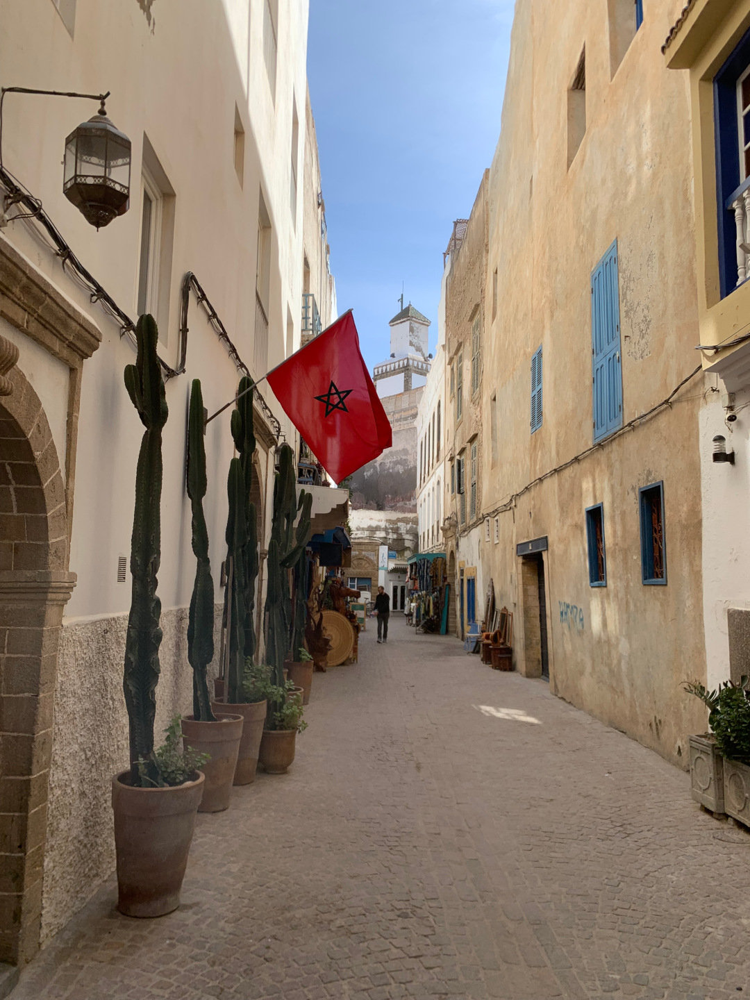
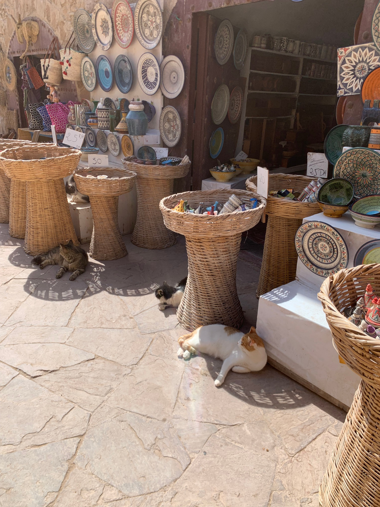
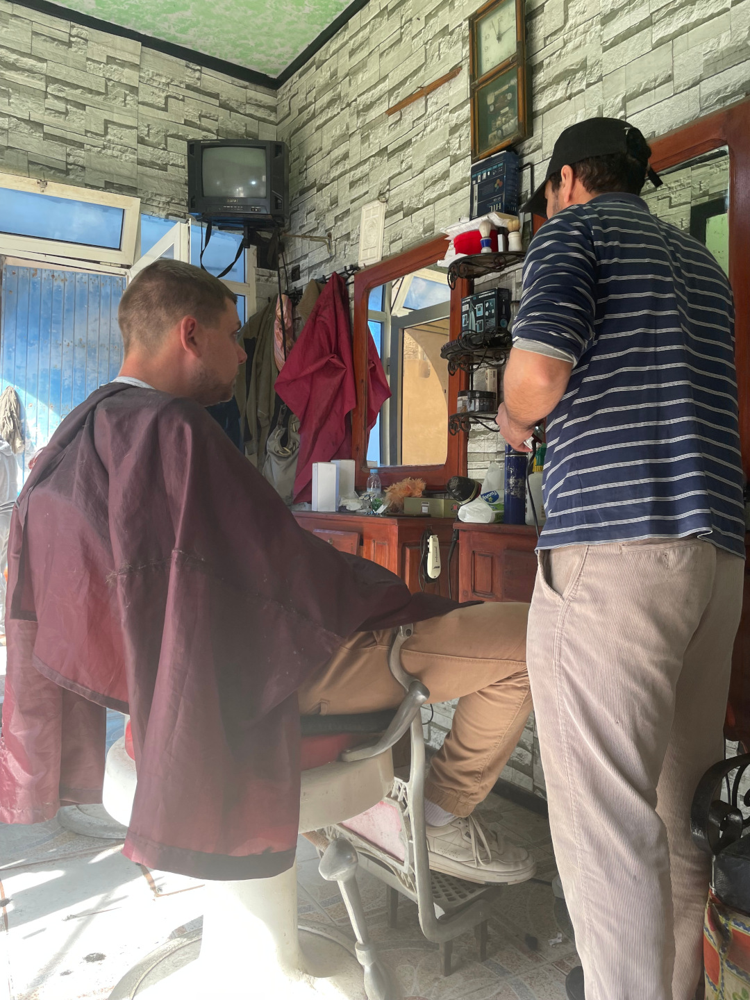
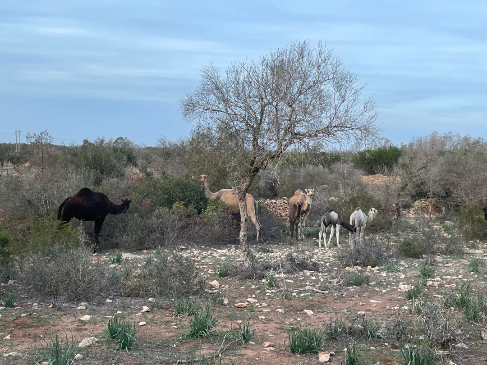
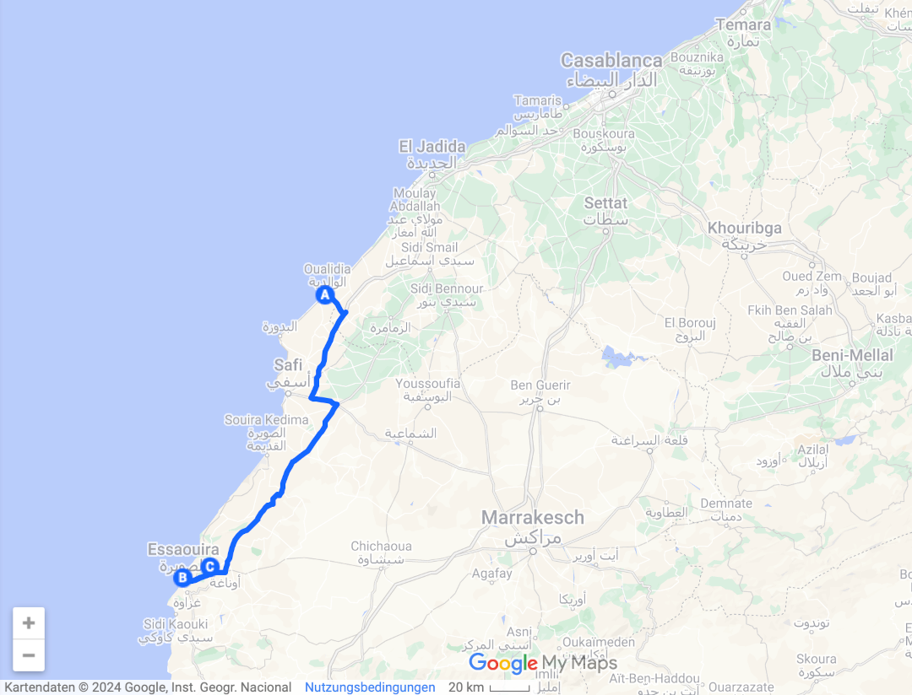
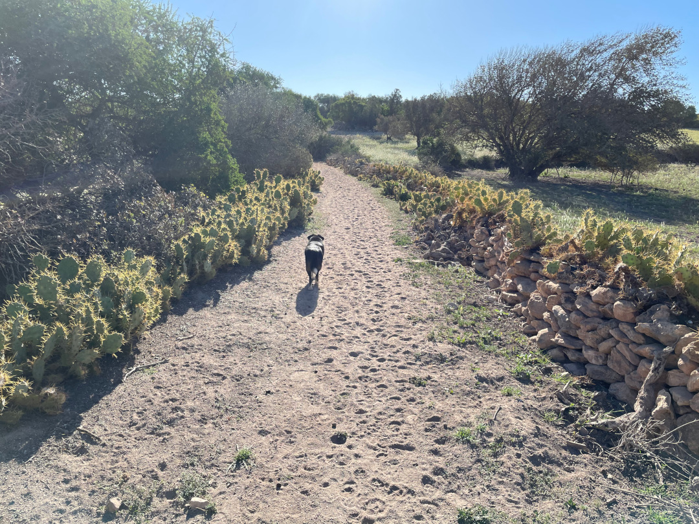
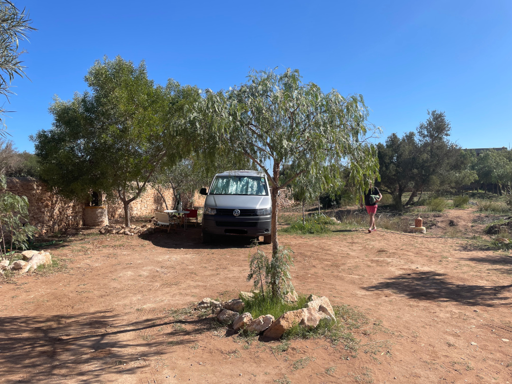

Für uns geht es in die bekannte Hafenstadt im Südwesten des Landes.

<!--more-->

🗓️ 6. März: Wir machen uns heute schon früh auf den Weg, weil wir die Stadt Essaouira angucken wollen, die noch ungefähr drei Stunden von uns entfernt ist. Wir fahren also bis ans Ende der A1 und für uns bedeutet das für die nächste Zeit auch erstmal die letzte Autobahnfahrt. Gestern Abend haben wir uns schon einen überdachten Parkplatz in Essaouira rausgesucht, den wir ansteuern und direkt finden. Vorher hatten wir gelesen, wie nett der Betreiber sein soll, und auch das bestätigt sich. Er fragt uns zu unserer Überraschung, ob wir für eine Nacht bleiben wollen. Das können wir uns auf dem kleinen überdachten Grundstück dann doch wieder nicht vorstellen, aber für zwei Stündchen Stadtbummel ist es perfekt. Durch die alten Stadtmauern geht es dann für uns in die Hafenstadt. So viele Europäer haben wir lange nicht auf einem Fleck gesehen und auch lange nicht so viele freizügig gekleidete Menschen. Es ist viel touristischer als wir gewöhnt sind und auf der „Hauptstraße“ für Fußgänger ist entsprechend viel los, aber links und rechts davon gibt es auch schöne ruhigere Ecken. Durch die Hafenlage wird viel Fisch angeboten und auch Austern, aber wir entscheiden uns lieber für einen anderen Mittagssnack. Auf dem Rückweg zum Auto gibt es für Tobi noch einen professionellen Haarschnitt. Die Rundumbehandlung dauert länger als gedacht, aber ist gelungen. Anschließend machen wir uns auf den Weg zu einem Campingplatz, der etwas auf dem Land liegt. Die letzten drei Kilometer geht es über eine eher holprige Piste, aber es lohnt sich. Als wir angekommen sind, merken wir nur leider, dass einer unserer Reifen wenig Luft zu haben scheint. Weil die Erinnerung an die morgendliche Überraschung in Sevilla noch präsent ist, entscheiden wir uns lieber noch die nächste Tankstelle anzusteuern, auch wenn niemand mehr so richtig Lust hat. So nehmen wir die holprige Piste heute gleich drei Mal mit, aber am Ende haben wir ein besseres Gefühl. Es gibt am Platz auch einen guten Wanderweg, auf dem wir die letzte Henry-Runde drehen. Als wir schon fast wieder zurück sind, sehen wir erst fremde Köttel und dann eine ganze Dromedar-Familie. Was für ein schöner Zufall und Abschluss des Tages!

🗓️ 7. März: Der Campingplatz ist schön gestaltet und weil die erste warme Dusche nach vier Tagen kalter Dusche so ein Fest ist, entscheiden wir uns dafür noch eine zweite Nacht zu bleiben und nochmal eine Pause einzulegen. Wir machen erstmal eine etwas größere Wanderung. Über meist sandige und steinige Wege zwischen Kakteen und Sträuchern geht es bis ins nächste kleine Dorf. Bis auf einen Mann, der auf seinem Esel vor seiner Schafherde entlang reitet und ein paar Bewohnern des Dorfes treffen wir niemanden. Als wir wieder zurück sind, verbringen wir den restlichen Tag am Pool oder am Bulli und gegen Abend fängt es dann noch leicht an zu regnen. Das haben wir schon länger nicht erlebt und müssen uns erst an den nassen Sand gewöhnen.

