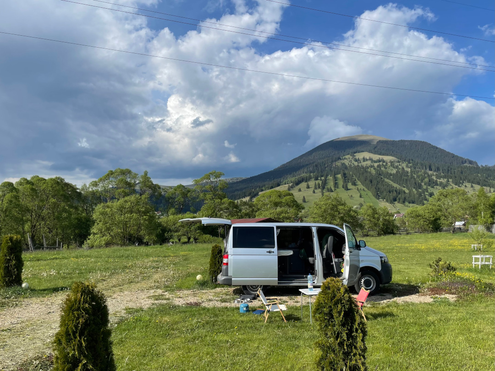
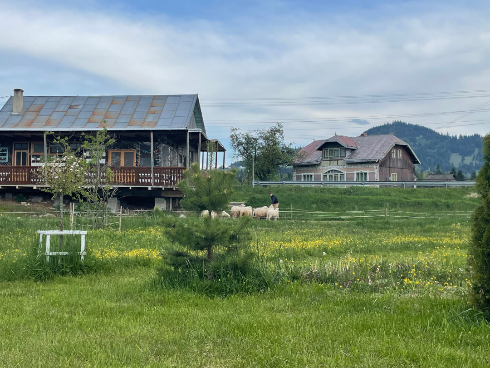
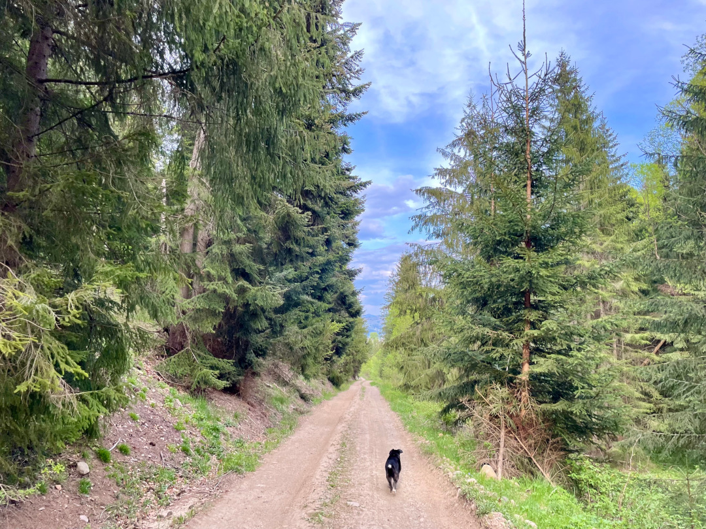
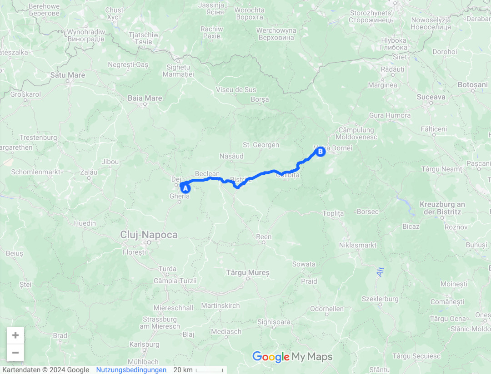
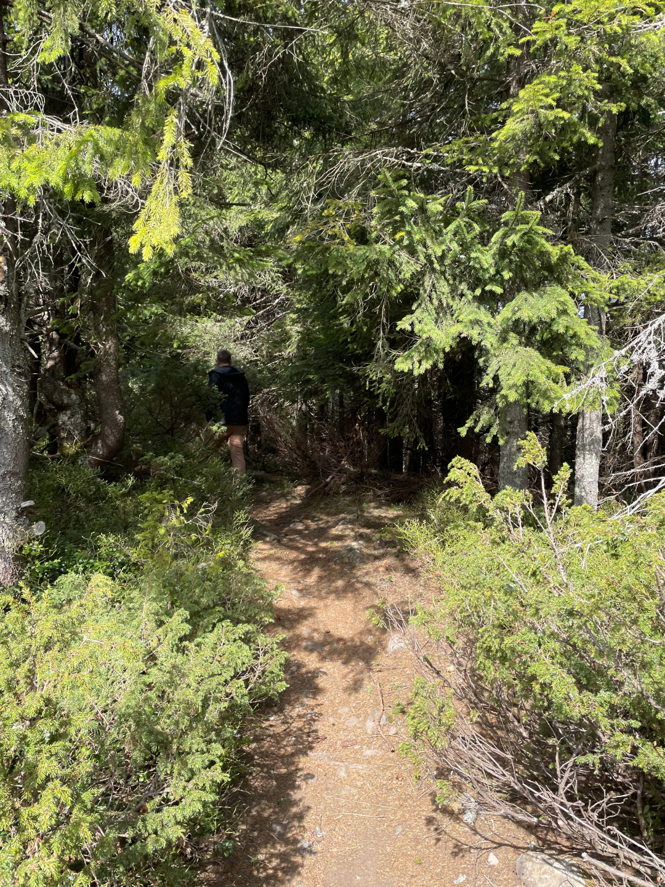
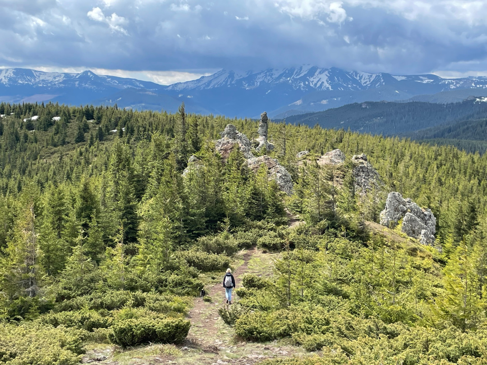
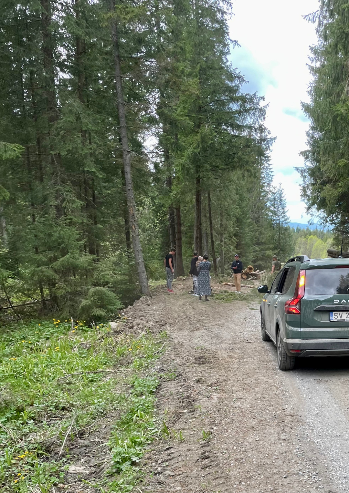
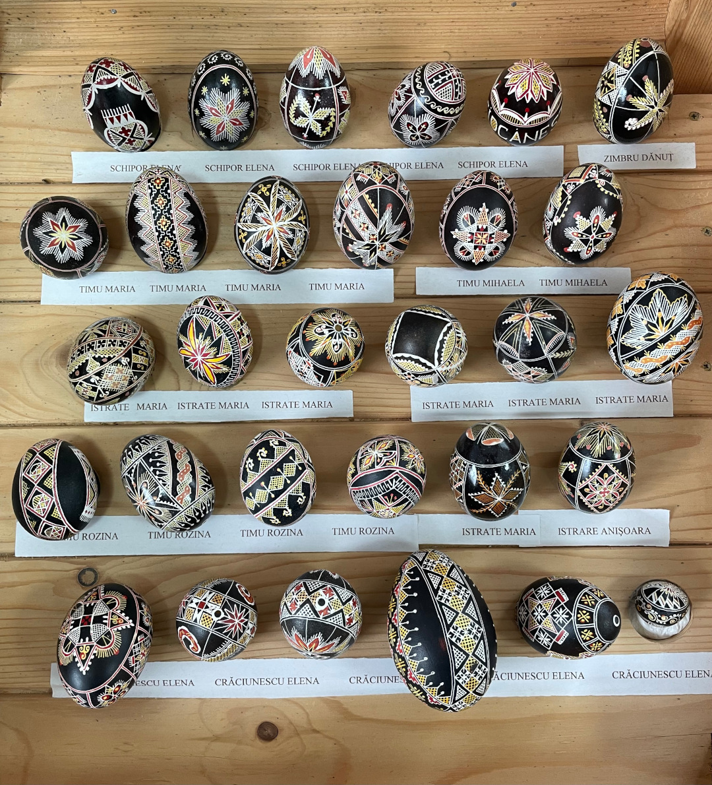
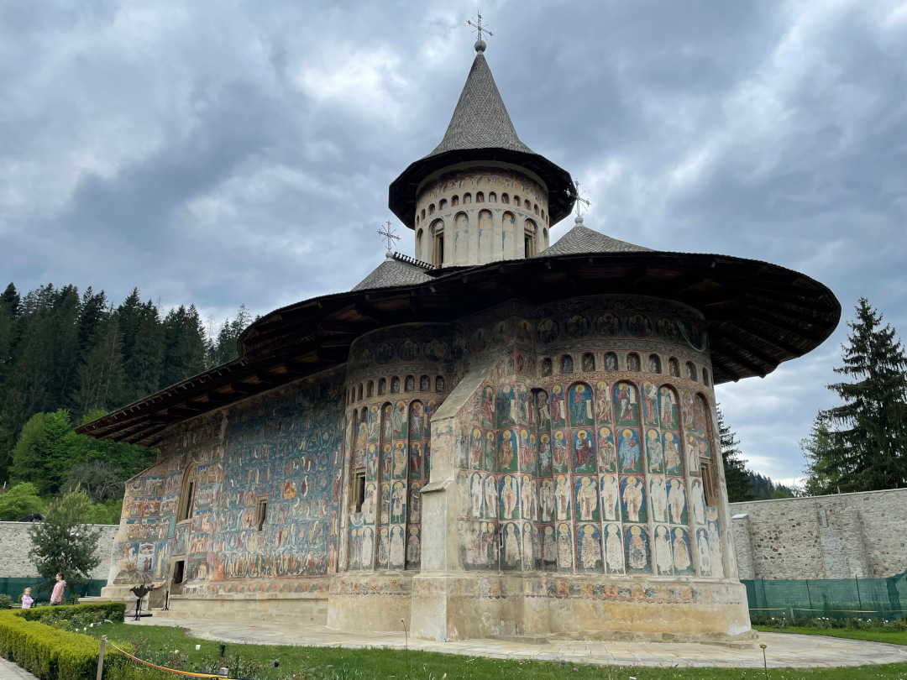
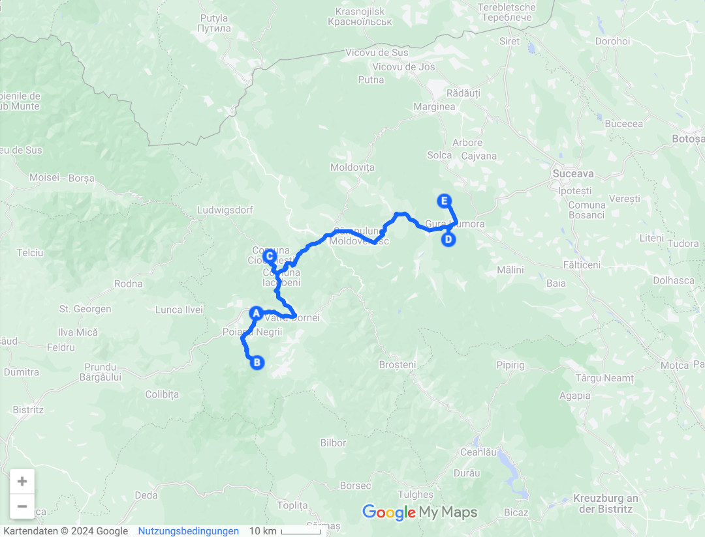

Als Nächstes erkunden wir den Nordosten des Landes und fahren in eine historische Region, die zur Hälfte in der Ukraine und zur Hälfte in Rumänien liegt.

<!--more-->

🗓️ 6. Mai: Nachdem wir noch eine letzte Runde durch die Felder gedreht haben, verabschieden wir uns von den Schweizern und der Familie. Als sie hören, dass wir noch keine Pufuleti probiert haben, laufen sie schnell los und geben uns welche. Wir sind zugegebenermaßen aber weniger begeistert von den rumänischen Maisflips als sie. Nach unserer Abfahrt ist der erste Halt natürlich ein Supermarkt, nachdem gestern alles zu hatte. Wir füllen alle Vorräte wieder auf, vor allem Wasser, und fahren dann weiter Richtung Nordosten in die historische Region Bukowina, deren nördlicher Teil in der Ukraine und südlicher Teil in Rumänien liegt. Die Region ist vor allem bekannt für ihre spätmittelalterlichen und kunstvoll bemalten Moldauklöster, aber auch für ihre waldreichen Berglandschaften. Als wir auf dem Campingplatz ankommen, sind wir ganz allein. Als wir anrufen, dürfen wir uns einen Platz aussuchen und sollen uns einfach wie zuhause fühlen. Gesagt, getan, denn es gibt hier eine gut ausgestattete Küche, die wir zur Abwechslung sehr gerne mal nutzen. Ansonsten sind nur die Schafe des kleinen Hofes und die bellenden Hunde da. Wir drehen direkt noch eine Runde mit Henry durch den Wald. Als die Besitzer abends zurückkommen, gibt zunächst er uns noch gute Tipps für die Region. Unter anderem erklärt er uns, wie wir zur Wanderung zu den 12 Aposteln kommen. Weil die Straße nicht geteert ist und sehr enge Serpentinen hat, ist Allrad hilfreich, aber laut ihm schaffen wir es mit unserem Allrad-Bulli dann auch. Für uns ist es außerdem sehr hilfreich, dass er erklärt, dass sie in dieser Region keine Probleme mit den Bären haben, wie teilweise in anderen Teilen des Landes. Hier sind sie auf ökologischen Tourismus aus und leben einfach friedlich neben und mit den Bären. Das heißt vor allem, dass die Bären hier sehr natürlich leben und sich eben nicht den Städten oder Menschen nähern, wie zum Beispiel an der Transfagarasan Hochstraße, wo sie inzwischen an der Straße auf Futter warten. So können wir uns bei unserer Wanderung sicherer fühlen, auch mit Henry, und sollen uns einfach laut unterhalten, damit die Bären Zeit haben sich aus dem Staub zu machen. Später als wir unser Geschirr abspülen, kommt dann auch noch seine Frau zu uns und bringt uns Reste des österlichen Kuchenbuffets als Nachtisch. Es sind sehr leckere Teile dabei und auch sie gibt uns noch weitere Tipps für die Region. So sind wir perfekt auf morgen vorbereitet und können schlafen gehen.

🗓️ 7. Mai: Wir haben uns extra einen Wecker gestellt, damit wir den guten Tipps auch gerecht werden können und sind dementsprechend schon früh auf den Beinen. Unser Weg führt uns zuerst in den Nationalpark Calimani, in dem wir die Wanderung zu den 12 Aposteln machen wollen. An sich ist der Weg dorthin besser als gedacht, auch wenn wir uns vorstellen können, was unser Gastgeber meinte, denn zu tief darf das Auto nicht liegen. Wir sind einfach langsam unterwegs und so klappt es super und wir kommen immer tiefer in den Wald und hoch auf 1600 Meter. Den Startpunkt der Wanderung bildet das Kloster der 12 Apostel. Die Szenerie wirkt etwas surreal, als wir dort ankommen, weil gerade über Lautsprecher die Gebete über die Berge schallen, aber man auch das Räuspern und Umblättern der Mönche hört. Vom Kloster aus sind es zu Fuß dann nur noch ungefähr 200 Höhenmeter und es gibt einen richtig schönen Wanderweg über den Waldboden. Zwei Stunden am Stück laut reden ist allerdings nicht so ganz unser Ding. Deshalb sind wir öfter mal mit Musik unterwegs, damit die Bären uns trotzdem kommen hören können. So kriegen wir auch keinen von ihnen zu Gesicht. Bei den Felsen angekommen ist man auf einer Art Plateau und hat eine schöne Rundum-Aussicht über die Wälder und Berge. Nach einer kurzen Pause machen wir uns auf den Rückweg. Wieder am Kloster angekommen sehen wir noch zwei andere Autos und die Insassen sind noch im Gespräch mit den Mönchen. Wir ziehen uns nur schnell um und düsen los. Runter sind wir flotter unterwegs, haben die Serpentinen längst hinter uns gelassen und sind mit unserem Kopf schon im nächsten Supermarkt, als auf einmal drei Bäume auf dem Weg liegen und uns die Weiterfahrt unmöglich machen. Wir sind erstmal total verwirrt und denken wir wären irgendwie falsch gefahren (obwohl es eigentlich gar keine echten Abzweigungen gegeben hätte). Beim besten Willen können wir uns aber nicht vorstellen, dass hier unten gleich drei Bäume umgekippt sind, während wir oben gewandert sind, und dann auch noch direkt auf unseren Weg gefallen sind. Nachdem wir kurz versucht haben, einen der Bäume zu zweit hochzuheben und voll gescheitert sind, wenden wir also und versuchen nachzuvollziehen, ob wir diesen Weg auch wirklich hochgefahren sind, aber ja, wir erinnern uns an diverse Stellen. Dann kommen uns die beiden anderen Autos entgegen und nachdem wir uns mit ihnen geeinigt und uns aneinander vorbei gequetscht haben, wittern wir unsere Chance. Schnell drehen wir bei nächster Gelegenheit wieder und fahren den anderen hinterher. Tatsächlich landen wir alle drei nach ein paar Minuten wieder vor den umgekippten Bäumen. Die anderen benehmen sich, als wäre das Standard und als hätten sie nie etwas anderes gemacht als Baumstämme von der Straße räumen. Sofort fangen alle an, an den Stämmen herumzuzerren und Steine zur Hilfe zu holen. Jetzt haben wir aber immerhin mehr Muskelkraft und so biegen und brechen wir alle zusammen mal eben drei Baumstämme. So schaffen wir eine Lücke am Rand, durch die unsere Autos so gerade eben an den Stämmen vorbeikönnen. Es ist auf jeden Fall amüsant, wie alles ohne großes Reden ging und einfach alle kooperiert haben. Im Bach waschen sich alle den Harz und einzelne kleine Blutstropfen von den Händen. Dann gibt’s noch einen Daumen hoch an alle und jeder setzt seine Fahrt fort. Was für ein Glück wir doch hatten, dass die anderen ungefähr zur selben Zeit wie wir wieder runter wollten und auch dass die Bäume umgekippt sind als alle oben und nicht auf dem Weg waren. Alleine hätten wir es jedenfalls nicht geschafft. Wir sind auch beruhigt, dass unsere Orientierung doch nicht so schlecht ist. Erleichtert fahren auch wir weiter. Auf unserem Weg liegt heute auch noch das Osterei-Museum, denn auch für die Kunst der bemalten Eier ist die Bukowina bekannt. So sauber und filigran bemalt ist es wirklich eine Handwerkskunst und von Hühner- über Gänse- und Straußeneier bis zu Holzeiern ist alles dabei. Nach weiteren eineinhalb Stunden Fahrt liegt dann schon das nächste Highlight auf dem Weg, nämlich das Moldaukloster in Voronet. Leider stecken wir vorher mal wieder etwas im Stau. So oft wie in Rumänien ist uns das auf unserer Reise noch nicht passiert, aber das Kloster ist das Warten wert. Es ist auch sehr kunstvoll bemalt. Von innen ist es noch viel beeindruckender als von außen, aber dort ist das Fotografieren leider verboten. Dann holen wir uns unterwegs eine Pizza und fahren zu einem Campingplatz. Dort kommen wir gleichzeitig mit einem französischen Wohnmobil an. Nach ein paar Minuten kommt dieses Mal jemand und die Frau spricht sogar sowohl Französisch als auch Englisch. Enttäuscht ist sie nur, als sie merkt, dass wir keine Kinder dabeihaben, sondern nur einen Hund. Dafür müssen wir für den Hund nicht bezahlen. Wir drehen noch eine Runde durch das kleine Dorf und gucken dann mal wieder BVB. So endet der Tag mit einem glücklichen Ausgang für Tobi und seinen Planungen für einen Abstecher nach Wembley.

