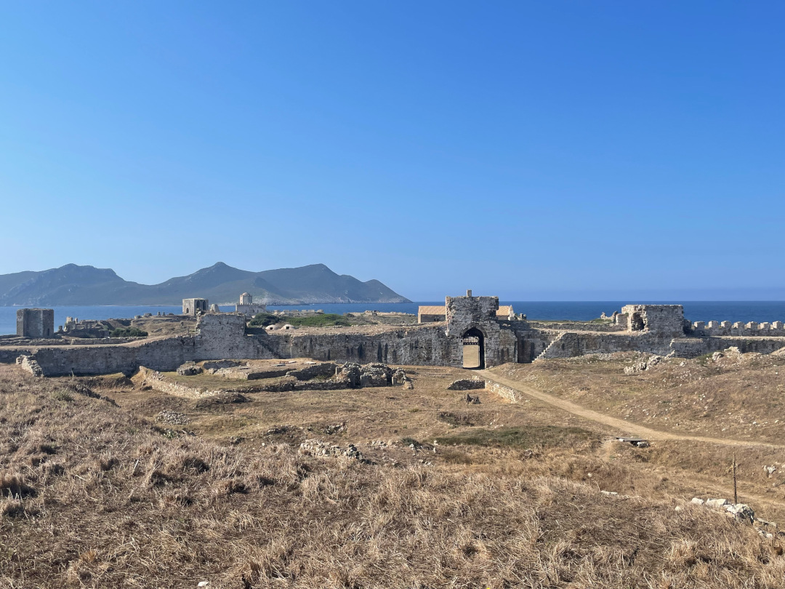

Es geht weiter bis in den Süden von Peleponnes und langsam fühlt es sich mehr nach Urlaub als nach Reise an.

<!--more-->

🗓️ 6. August: Als wir aufwachen, gehen wir eine Runde mit Henry, machen den Bulli startklar und sehen vor allem zu, dass wir schnellstmöglich wieder ins Meer kommen. Weil nachts die Temperatur draußen nicht mehr unter 25 Grad fällt, können wir die Abkühlung gut gebrauchen. Aber dank der warmen Temperaturen weiß man das Meer auch viel mehr zu schätzen. Nach dem Schwimmen machen wir uns dann relativ schnell auf den Weg, denn heute geht’s nach drei Nächten hier mal wieder weiter. Wir wollen in den Süden von Peleponnes fahren. Als Erstes geht es wie (fast) immer kurz einkaufen und dann geht es viel am Meer entlang. Unseren ersten Stopp machen wir beim Voidokilia Strand. Die Bucht hat die Form des griechischen Buchstaben Omega und wird auch Ochsenbauchbucht genannt. Ihre ganze Schönheit sieht man deshalb am besten von oben. Was für ein Glück, dass neben dem Strand eine alte Festungsruine liegt (Palaiókastro). Der Weg von Süden aus zur Ruine ist etwas länger, aber dafür auch weniger steil. Weil mittlerweile schon wieder 35 Grad sind, klingt weniger steil für uns perfekt. Deshalb parken wir auf der südlichen Seite und laufen los. Es kostet uns alle drei einige Schweißperlen, aber bietet tolle und einzigartige Aussichten. Obwohl an den Stränden Betrieb herrscht, treffen wir auf dem ganzen Weg niemanden und haben die Aussicht für uns allein. Ganz oben angekommen, macht die Bucht ihrem Namen dann alle Ehre. Sie ist so symmetrisch geformt, dass man meinen könnte sie wäre extra angelegt worden. Mich erinnert der Anblick aber mehr an eine Qualle als an einen Ochsenbauch. Das Wasser ist glasklar und der Sand super fein. Wir genießen die Aussicht noch etwas und machen uns dann auf den Rückweg. Das Beste ist, dass auf der Seite, auf der wir geparkt haben, ebenfalls ein super langer, feiner Sandstrand auf uns wartet. Wir finden eine gute leere Stelle mit etwas Schatten und springen direkt rein. Naja, springen ist vielleicht etwas übertrieben, weil es so sanft reingeht, dass wir noch etwas laufen müssen vor dem Sprung. Das Wasser ist auch hier kristallklar und schön kühl. Der Boden ist super angenehm und Fische sind erstmal nicht in Sicht, nur ein paar Segelboote, die in der Bucht vor Anker liegen. So ist alle Anstrengung schnell wieder vergessen und wir machen uns mit neuer Kraft wieder auf den Weg. Unser Ziel für heute ist Methoni, eine kleine Hafenstadt im Südwesten von Peleponnes, die auch noch eine schöne alte Festungsanlage hat, die ins Meer ragt. Der Campingplatz ist einfacher als der letzte, aber auch groß und hat eine schöne Lage. Als Erstes geht es für uns deshalb auch nochmal ins Meer. Weil es hier außerdem (spartanische) Kochmöglichkeiten gibt, schaffen wir es noch aus unseren Resten etwas Leckeres zu kochen. Am Abend laufen wir dann mit Henry die Promenade entlang. Der Himmel hat wieder so tolle Farben wie in Griechenland bisher immer. Irgendwie ist das Leuchten hier anders. Und heute bildet der Mond die perfekte Sichel. Als es dunkel wird, wird auch die Festung beleuchtet und so hat man nicht nur Meeresrauschen, sondern auch echt einen schönen Blick.

🗓️ 7. August: Wir gehen mit Henry am Strand bzw. an der kleinen Promenade entlang. Danach geht’s für uns in die Festungsanlage, die nur ungefähr einen Kilometer vom Campingplatz entfernt liegt. Das Gelände ist relativ weitläufig und die Festung stammt schon aus dem 15. Jahrhundert. Weil sie ins Meer hineinragt, haben wir auch hier schöne Aussichten. Selbst morgens um 10 Uhr schwitzen wir aber schon gut beim Laufen über das Gelände und zurück zum Campingplatz. Deshalb sind wir auch froh, als wir dann kalt geduscht und mit Klimaanlage im Auto sitzen und weiter düsen. Heute wechseln wir quasi den Finger von Peleponnes und fahren vom ganz linken einen weiter. Unsere Route führt dabei durch die Berge der Halbinsel und an der Küste entlang, so dass wir unterwegs von oben immer wieder auf das Meer gucken. Außerdem kommen wir heute durch zwei kleine Orte, die als Postkartenmotiv quasi stellvertretend für ganz Peleponnes stehen. Sie zeichnen sich vor allem durch ihre steinernen Häuser aus. Limani liegt direkt in einer kleinen Bucht am Wasser. Hier fahren wir aber nur durch. Halten tun wir erst in Areopoli. Der kleine Ort liegt ein paar Minuten weiter im Landesinneren. Groß ist es hier wirklich nicht, aber jede Ecke sieht schön und gemütlich aus. Mit Henry schlendern wir durch die Gassen und nutzen jeden Schatten aus, den wir sehen. Wir sind nachmittags hier angekommen, also mitten in der griechischen Siesta, und so sind viele Läden gerade geschlossen, aber so ist es auch nicht so voll. Anschließend geht es für uns noch ungefähr eine halbe Stunde weiter bis in die Bucht von Gythio. Auf dem ersten Campingplatz drehen wir allerdings noch auf der Einfahrt wieder um. Irgendwie ist hier alles einfach nur voll und eng und unter die Olivenbäume passen nicht mal wir mit unserem kleinen Bulli so wirklich. Einen Platz weiter ist es zwar auch voll, aber wir finden einen Stellplatz, der zwar immer noch eng an den Nachbarn, aber wenigstens nicht ganz so schmal ist und entscheiden uns für eine Nacht zu bleiben. Eigentlich wollten wir zwei Nächte in der Bucht verbringen, aber das hier passt doch nicht ganz so gut zu uns. Trotzdem gibt es hier direkt einen schönen Strand und in den Wellen holen wir uns unsere Abkühlung. Was dem Aufenthalt hier aber noch ein echtes Upgrade gibt, ist auf jeden Fall die Taverne, die ein paar hundert Meter weiter den Strand runter liegt. Es gab viele Empfehlungen dafür und als wir ankommen, merken wir wieso. Alle sind total freundlich und eine Speisekarte gibt es nur für die Vorspeisen. Die Hauptgerichte wechseln nämlich jeden Tag. Lustigerweise hat Taki, der Besitzer, heute Geburtstag. In der Türkei waren wir ja schon mal aus Versehen auf dem Geburtstag eines Campingplatzbetreibers. Nachdem wir unseren Salat und die Portion Tzatziki gegessen haben, dürfen wir direkt in die Küche gehen. Die Köchin öffnet für uns einen Backofen. Auf jeder der 5 Schienen wartet ein anderes traditionell griechisches Gericht. Auf dem Herd daneben geht es in vier großen Töpfen noch weiter. Geduldig erklärt sie uns jedes Gericht und wir dürfen auswählen. Ein paar Minuten später kommt das Essen dann schön angerichtet zum Tisch: Für mich gibt es Youvarlakia und für Tobi einen selbstgebackenen Teig gefüllt mit Schafskäse, Fleisch, Tomaten und selbstgemachter Mayonnaise. Alles also schön deftig, aber auch super lecker. Als wir fertig sind, kommt ganz selbstverständlich nicht nur der Ouzou, sondern auch ein Obstteller mit Zimt, Honig und süßen Teilchen, die uns an die rumänischen Papanasi erinnern. Über den Strand rollen wir also später zurück zum Bulli. Der Einzige, der sich noch schnell bewegen kann, ist Henry.

