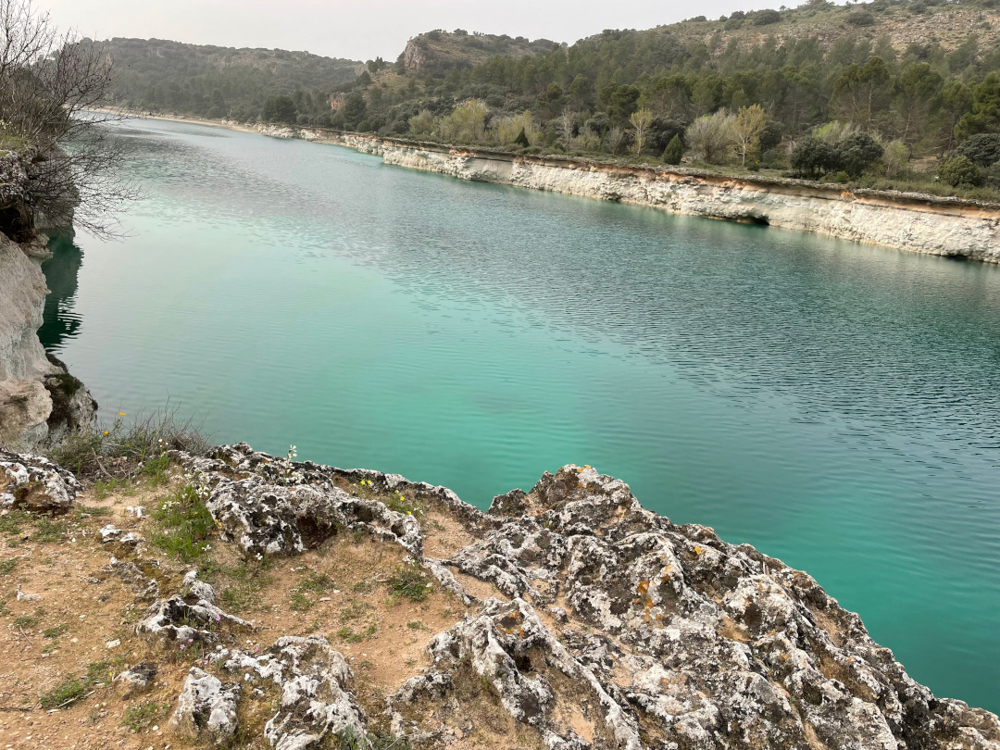
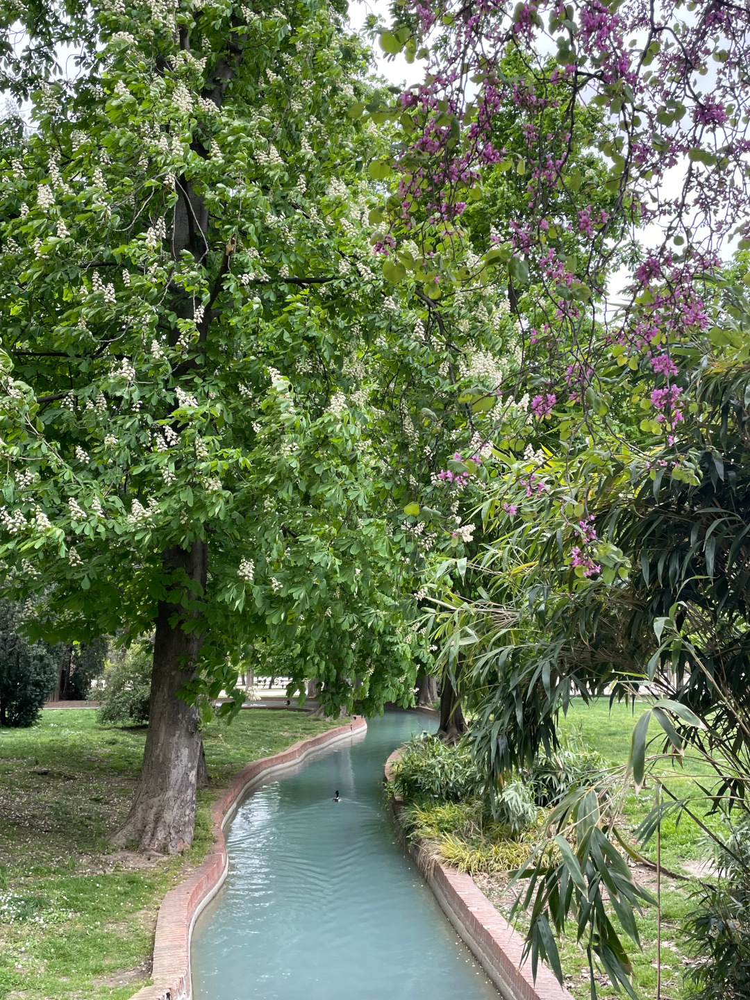
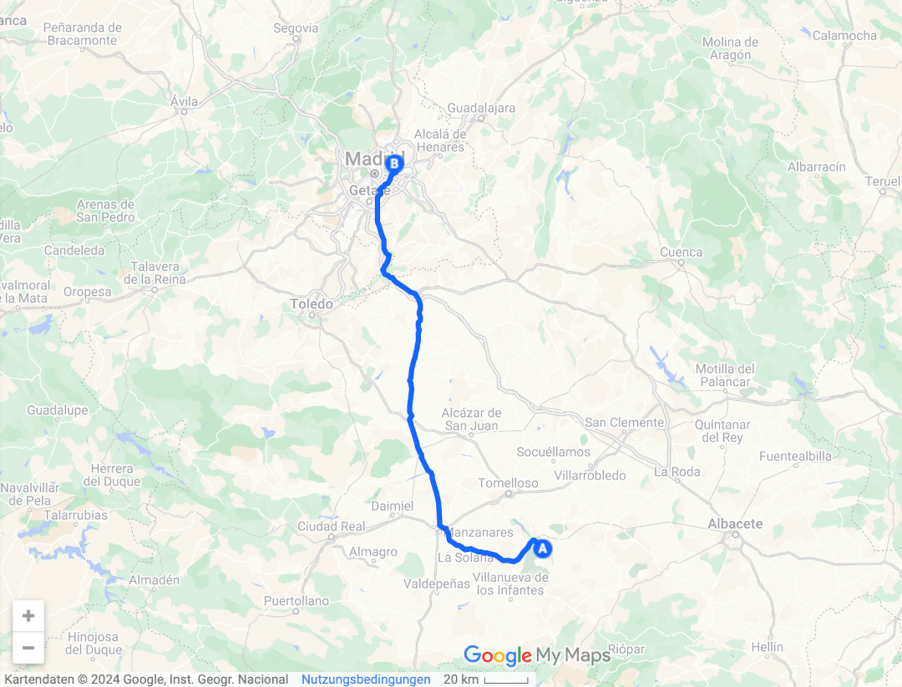
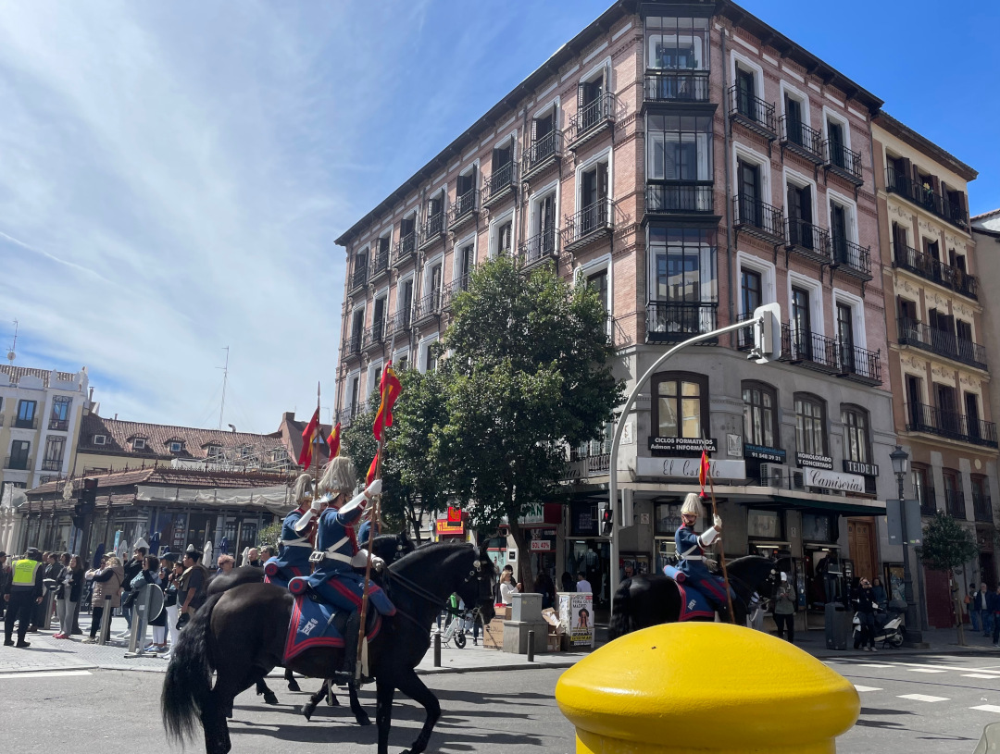
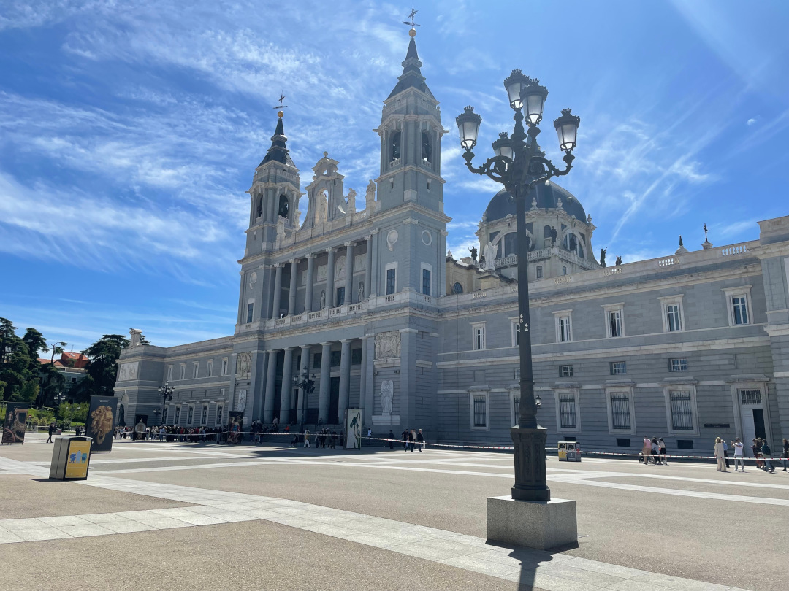
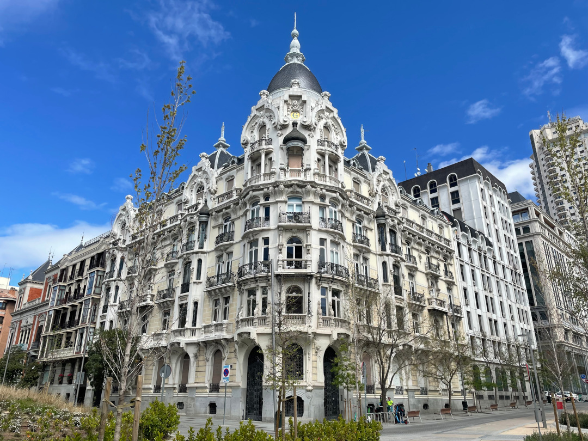
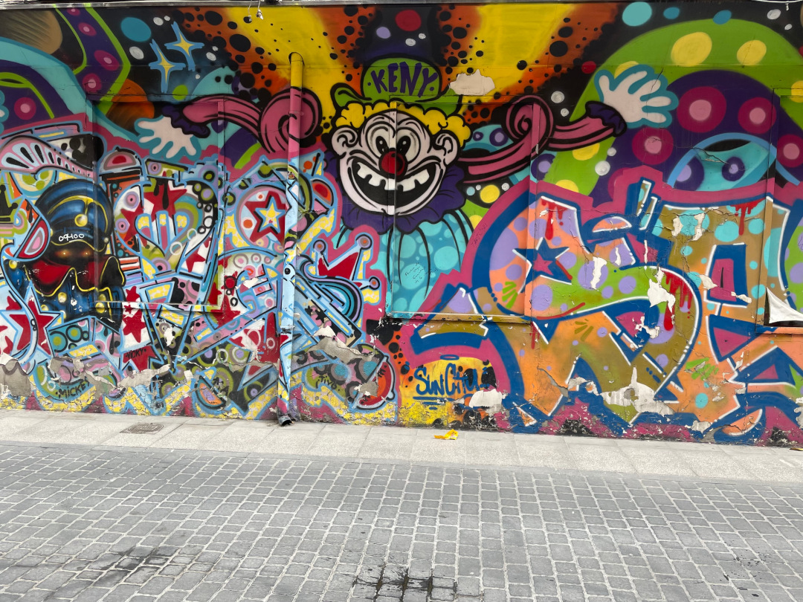

Unsere letzte wirkliche Station in Spanien ist die Hauptstadt.

<!--more-->

🗓️ 7. April: Der Tag startet mit einer Henry-Runde direkt an den Lagunen. Obwohl es hier in letzter Zeit viel geregnet hat, merkt man, dass die Lagunen deutlich weniger Wasser führen als zu Hochzeiten. Im Sommer ist hier wohl auch noch mehr Tourismus, zumindest deutet alles darauf hin. Heute und gestern war es aber relativ ruhig. Wir machen uns auf den Weg nach Madrid. Zum Glück ist die Zeit der Maut-Autobahn erstmal wieder vorbei und so kommen wir schnell und günstig in die Hauptstadt. Auf dem Weg besorgen wir uns noch etwas Mittagessen und tanken. Die Preisspanne der Tankstellen in Spanien ist riesig. Zwischen 1,70€/l und 1,39 ist alles dabei. Wir hatten lange überlegt, ob wir in Madrid auf einem Campingplatz schlafen oder eine andere Unterkunft suchen, haben uns dann aber für den Campingplatz entschieden, obwohl so große Stadt-Stellplätze oft nicht so wirklich entspannt sind. In Madrid geht es aber gut und wir buchen direkt von Sonntag bis Donnerstag. Der Platz liegt zwar wie so oft direkt an der Autobahn und in Flughafennähe, dafür ist es aber drumherum und generell auf dem Platz sehr grün. Hanna erkundet mit Henry die Umgebung und die Parks, während ich mich mit dem Bus zum Spiel Real Madrid 2 gegen Córdoba CF aufmache. Gespielt wird im Amateurstadion Alfredo di Stefano direkt neben dem Trainingsgelände von Real Madrid. Hier warten auch schon genug Fans auf die Spieler, die wohl gleich Training haben. Wenigstens sehe ich einige Fans mit Jude Bellingham Dortmund Trikot, denen es aber eher um den Spieler als um den Verein geht. Am Stadion selbst ist auch relativ viel los: Viele Familien und Kinder, denen die Karten bei den Profis von Real Madrid entweder zu teuer sind oder sie keine Chance haben, welche zu bekommen. Meine Hoffnungen liegen sowieso eher beim Gegner. Córdoba hatte lange zweite und sogar teilweise erste Liga gespielt. Am Ticketschalter wird mir dann leider gesagt, dass nur Mitglieder von Real Madrid Karten kaufen können. Mein Versuch als Córdoba Fan durchzugehen, klappt leider auch nicht. Fast wäre dann das heutige Spiel für mich ins Wasser gefallen, wäre da nicht der Schwarzmarkt. Ich finde bzw. findet mich ein junges Mädchen mit ihrer Mutter, die mir noch ein Ticket verkaufen können. Leider habe ich nur noch 9,50€ Bargeld im Portemonnaie, das Ticket kostet aber im Original 20€. Ich erkläre beiden, dass ich ja für beide mit der Kreditkarte noch eine Cola holen könnte. Dann fragt mich das Mädchen nach meiner Handynummer und schickt mir das Ticket einfach per WhatsApp. Damit ist die Diskussion für mich beendet. Ich merke nachher, dass die beiden sowieso nicht ins Stadion gegangen sind und das Ticket ein Freiticket war. Ich tippe auf knapp 2.500 Zuschauer, davon ca. 500 aus Córdoba. Córdoba gewinnt 2:0 und könnte mit Málaga noch um den Aufstieg spielen. Nach dem Spiel verzichte ich auf den Bus und laufe. Anstatt der 1,5 h Stunden, die Google vorschlägt, laufe ich nur 45 Minuten. Die Parks rund um das Stadion und den Campingplatz sind riesig. An diesem Sonntag ist auch überall sehr viel los. Zurück am Bulli wollen wir noch etwas essen. Das Land Spanien an sich ist top und vielseitig. Wir hatten Strandtage und einen halben Meter Schnee innerhalb von wenigen Tagen, aber das Essen hier ist nicht so unsers. Erstens haben die Läden immer Siesta und zweitens gibt es nur Fisch und Tapas. Wir ziehen daher lieber den Dönermann vor. Das ist im Gegensatz zu Tapas noch bezahlbar (3,90€ Dönermenü). So endet der erste Tag in Madrid auch wenigstens satt.

🗓️ 8. April: Die erste Nacht in Madrid war gut und nicht so laut wie befürchtet. Henry kennt sich schon gut aus in den Parks und genießt seine Runden. Danach wollen wir uns Madrid angucken und fahren mit der Metro ins Zentrum. Wir fahren bis zur Oper und von dort aus gehen wir zum Plaza Mayor. Als wir kurz davor sind, kommt uns eine Pferdeparade mit schwarzen Limousinen entgegen. Die Straße wird kurzfristig abgesperrt. Hätten wir Erfahrung mit der spanischen Königsfamilie, hätten wir eventuell jemanden erkennen können. Wir erinnern uns sofort an Stockholm, wo wir damals fast dieselbe Parade gesehen haben. Wir laufen weiter zum Mercado San Miguel, einer großen Markthalle. Überall werden Tapas angeboten, die wir aber aus den bekannten Gründen von gestern boykottieren. In Lissabon haben wir die Erfahrung gemacht, dass rundum die großen Markthallen viel bessere und vor allem günstigere Essensmöglichkeiten sind. So finden wir auch noch unser Frühstück. Danach geht es zur Kathedrale und zum Königspalast. Auch hier ist noch viel abgesperrt, wohl wegen der Parade, die wir vorhin gesehen haben. Beide Gebäude sind direkt gegenüber voneinander, entsprechend ist hier viel los. Wir laufen etwas raus aus dem Trubel zum Templo de Debod. Von da geht es über den Plaza de España auf die Gran Via, die große Einkaufsstraße. Das obligatorische Schinkenmuseum bleibt für morgen vorbehalten. Der letzte Stopp ist deshalb der Retiro Park. Hier essen wir noch ein Eis im Biergarten, kaufen etwas ein und nehmen die Bahn zurück zum Bulli. Weil der Döner von gestern noch etwas schief im Magen liegt, verzichten wir heute Abend auf diesen Gourmettempel.

🗓️ 9.-10. April: Auch die zweite Nacht verläuft sehr entspannt. Henry kennt sich schon gut aus und freut sich auf seine Runden im Park. Gegen Dienstagmittag erreichen uns die ersten schwarzgelben Freunde und endlich kann das Schinkenmuseum in Angriff genommen werden. Ab dann: unterwegs in Sachen Fußball!