Es wird nach den ersten Tagen am Wasser jetzt Zeit für ein bisschen Kultur.

<!--more-->

🗓️ 7. Juni: Die Wärme verlangsamt einen wirklich gut und wir müssen unsere Abläufe am Morgen etwas umstrukturieren. Am besten erst den Bulli startklar machen, dann Henry-Runde, dann Schwimmen und dann Dusche. So rum ist die Erfrischung nicht gleich wieder futsch noch bevor wir wieder losfahren. Heute geht es für uns weiter die Agäisküste entlang nach Süden und wir freuen uns immer noch über die super ausgebauten Schnellstraßen in der Türkei. Ab und zu kommen wir an Polizeikontrollen vorbei, aber angehalten werden wir nie. Viel öfter sind es sowieso nur Polizeiattrappen, die mit Blaulicht aus der Ferne aber täuschend echt aussehen. Migros entwickelt sich zu unserem neuen Stammsupermarkt. Je mehr Ms davor, desto größer. Bisher landen wir meist im MM Migros. Nach einem kurzen Einlauf düsen wir weiter an Izmir vorbei, der drittgrößten Stadt der Türkei. Einen Stopp in der Stadt machen wir aber nicht. Zu warm und zu viele Menschen. Stattdessen geht es weiter in die antike Stadt Ephesos bei Selçuk. Früher beherbergte die Stadt mit dem Tempel der Artemis eines der antiken sieben Weltwunder. Vom Tempel selbst ist heute allerdings nur noch eine Säule übrig, die vor allem für ein Vogelnest dient, und alles wirkt etwas verwahrlost. Ganz im Gegensatz zu den Ruinen der Stadt. Die sind ein paar Minuten entfernt und noch viel besser in Schuss. Wir sind erstaunt, wie weitläufig das Gelände der Ruinen ist. Im Gegensatz zu Osteuropa ernten wir hier nur ungläubige Blicke, wenn wir fragen, ob Henry mit reindarf. Das ist doch keine Frage. Na klar, wir sollen nur etwas mit den freilebenden Hunden aufpassen, kriegen dabei aber auch noch tatkräftige Unterstützung der Einheimischen. Nur der Eintritt ist mit umgerechnet 40€ pro Nase aus unserer Sicht etwas übertrieben. Als wir fertig sind, geht es noch ein kleines Stück weiter nach Süden zu einem Campingplatz. Wichtigstes Kriterium gerade: Pool zum Abkühlen und bei der Platzwahl der Schatten von zwei großen Olivenbäumen. Wir springen als erstes ins Wasser. Dann können wir an einer großen Tafel mit der Familie, Stammgästen und anderen Campern zu Abend essen. Am Ende ist die Truppe bunt gemischt aus Türken, Franzosen, Ukrainern, Amerikanern und Deutschen. Die Verständigung ist eine Mischung aus Türkisch, Englisch, Französisch und viel Händen und Füßen. Der Tisch ist gut gedeckt mit allerlei leckerem Selbstgemachtem. Abends gibt es dann Livemusik vom Betreiber und seinem Freund und es herrscht beste Stimmung. Dann kommt raus, dass der Besitzer des Platzes heute sogar Geburtstag hat. Alle singen für ihn und es gibt noch einen bombastischen Schokokuchen, der einfach unter allen aufgeteilt wird. Alle gehen sehr herzlich miteinander um und es herrscht eine richtig schöne und fröhliche Atmosphäre. Als wir ins Bett fallen, hat es sich auch schon ganz gut abgekühlt.

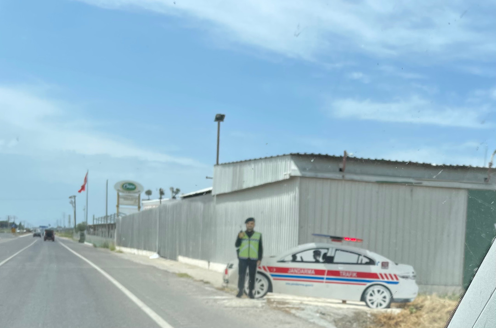

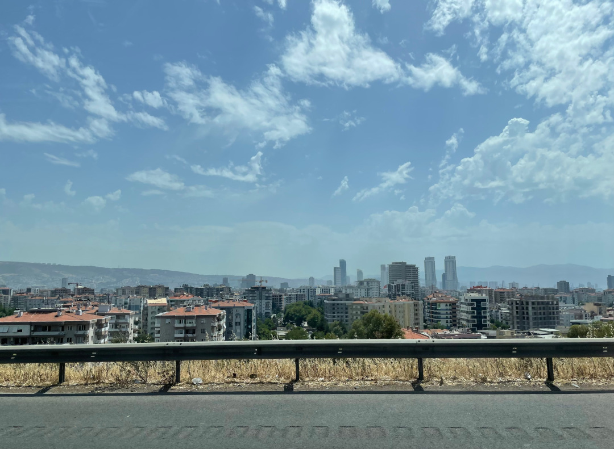

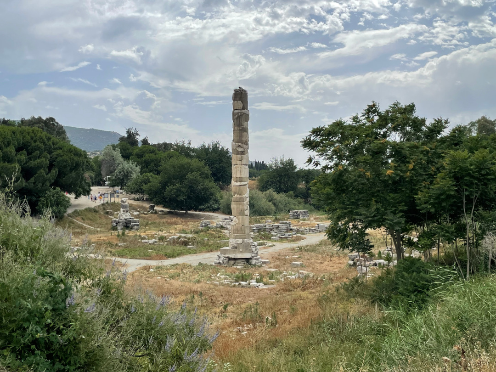

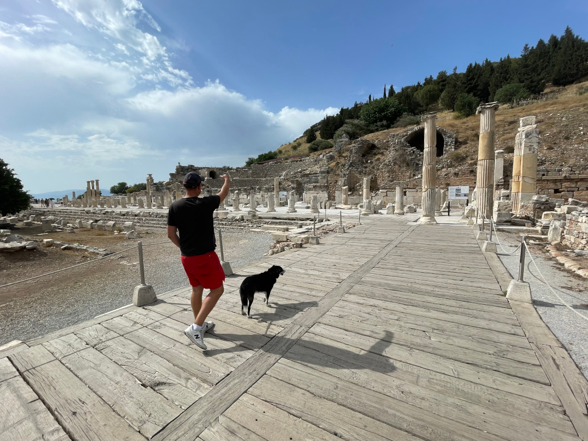

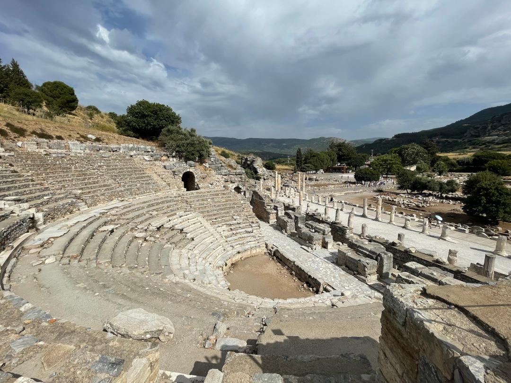

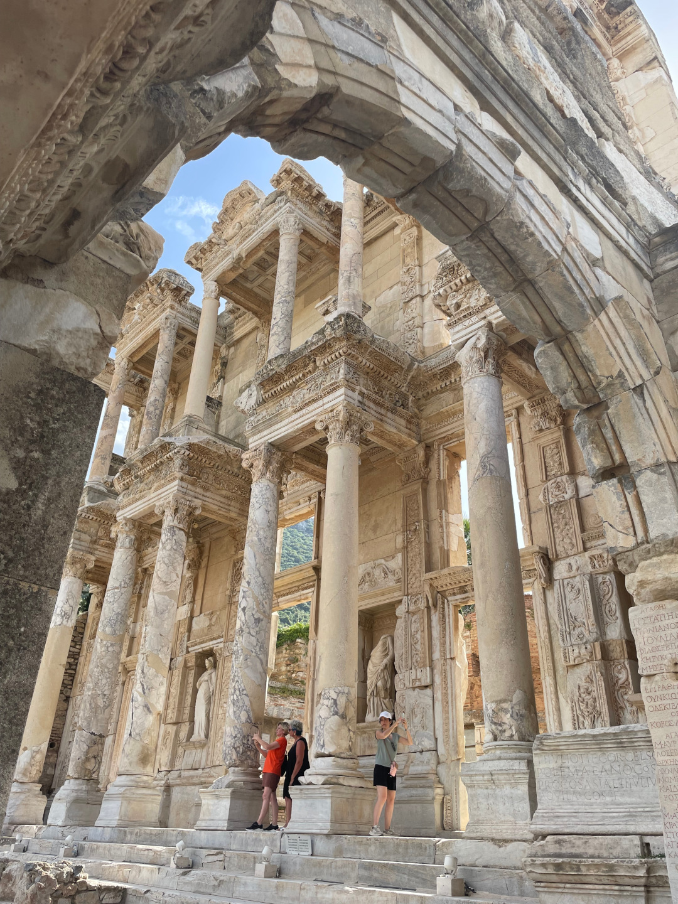

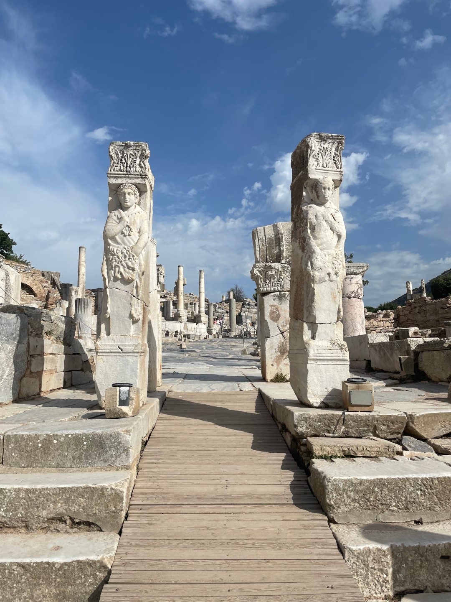

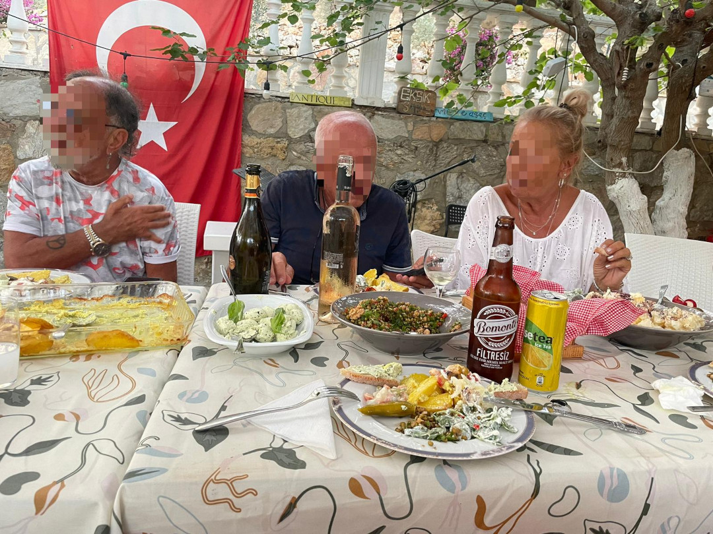

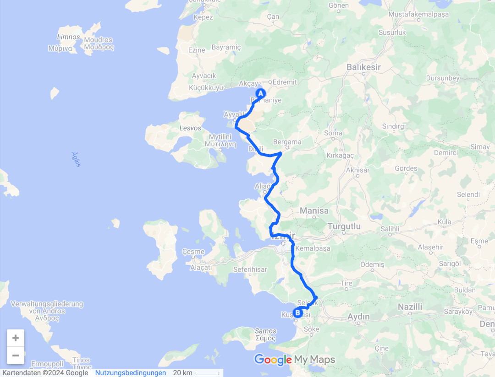

🗓️ 8. Juni: Wir schlafen wieder bestens mit offener Kofferraumklappe, bis es morgens zu warm wird, weil die Sonne auf den Bulli scheint. Wir entscheiden uns noch eine zweite Nacht hier zu bleiben. Deshalb lassen wir es morgens langsam angehen und nutzen die Zeit, um Wäsche zu waschen. Beim Tee kochen geht unsere Gasflasche dann leer. Zum Glück hatten wir es bei Bukarest noch geschafft für Ersatz zu sorgen. Die passende Flasche gab es dort zwar nicht, aber seitdem haben wir eine zusätzliche Konstruktion, bei der zwei Gaskartuschen genutzt werden können. Die Inbetriebnahme klappt einwandfrei, aber an den neuen Anblick müssen wir uns noch etwas gewöhnen. Und uns vor allem von der verbeulten marokkanischen Gasflasche verabschieden. Der Verkäufer bei Bukarest meinte zu ihr nur: that’s not a bottle, that’s a bomb. Aber wir hatten sie über die Zeit schon etwas liebgewonnen. Ansonsten pendeln wir heute entspannt zwischen unserem großen Olivenbaum und dem Pool hin und her und kümmern uns etwas um die weitere Reiseplanung. Wir essen wieder im Restaurant, aber diesmal ganz normal von der Karte und heute ist es auch viel ruhiger hier. Gestern hatten wir also Glück dabei zu sein. Als es gegen Abend etwas kühler wird, machen wir noch einen Spaziergang zum Meer und sind pünktlich zum Sonnenuntergang da. Wieder zurück sind wir aber schon wieder so aufgewärmt, dass wir mit der Mondsichel und Fledermäusen über uns noch ein letztes Mal in den Pool springen. So sind wir gut erfrischt für die Nacht. Als wir den Abend noch vor dem Bulli genießen, kommen plötzlich die beiden Wachhunde des Platzes angepest. Wir brauchen eine Weile, bis wir die drei Wildschweine sehen, wegen denen sie angerückt sind. Die Wildschweine sind aber nicht wahnsinnig beeindruckt und schlendern trotzdem noch etwas über den dunklen Platz. Für uns interessieren sie sich aber kein bisschen.

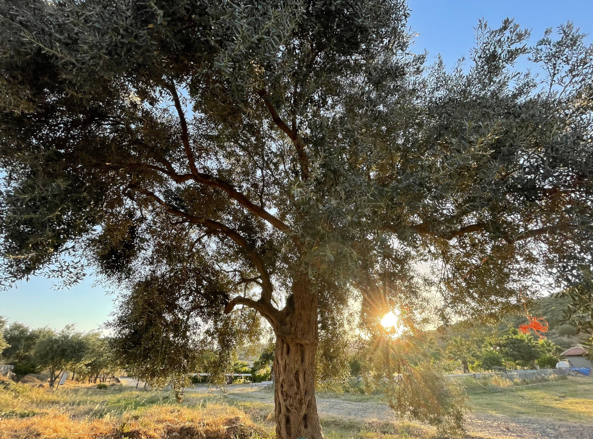

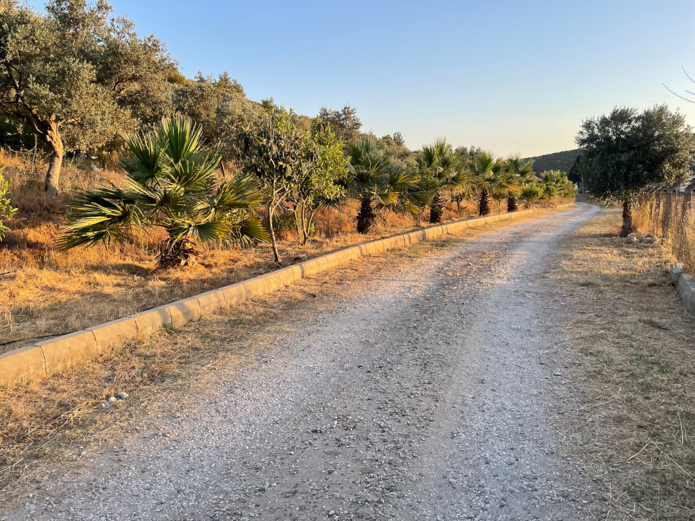

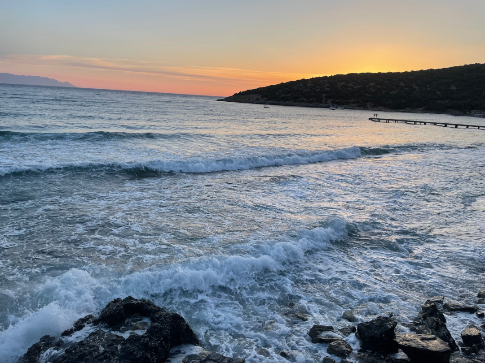

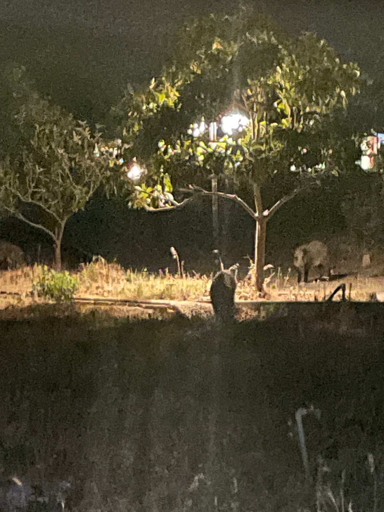