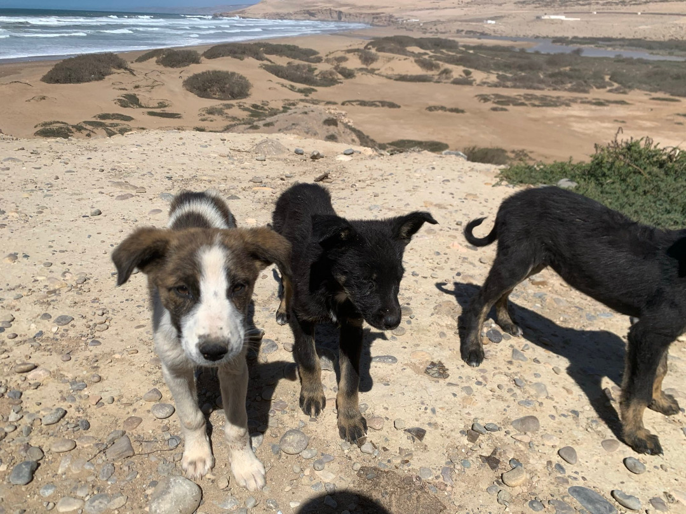
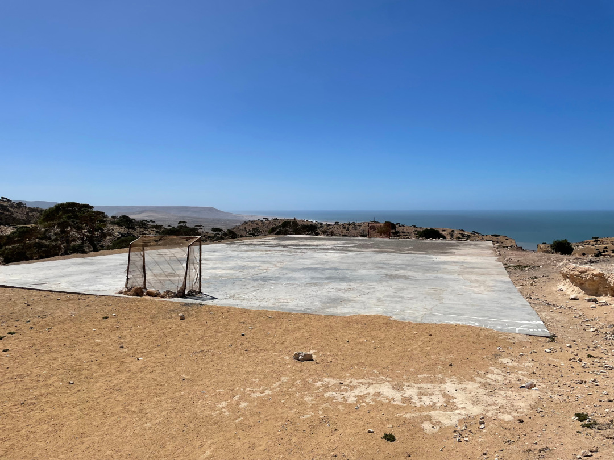
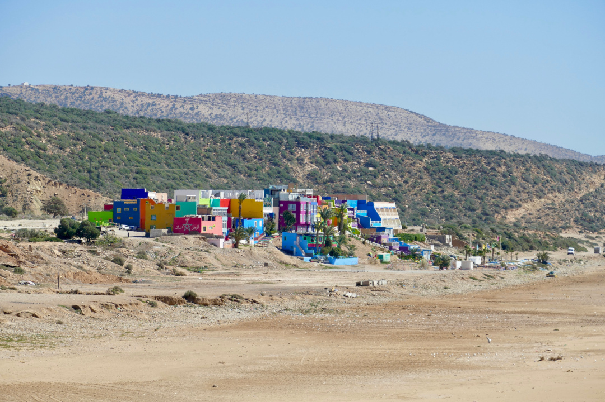
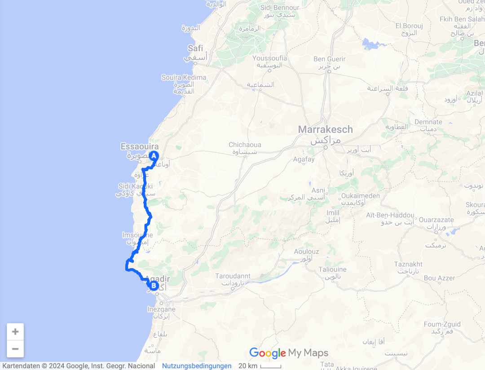
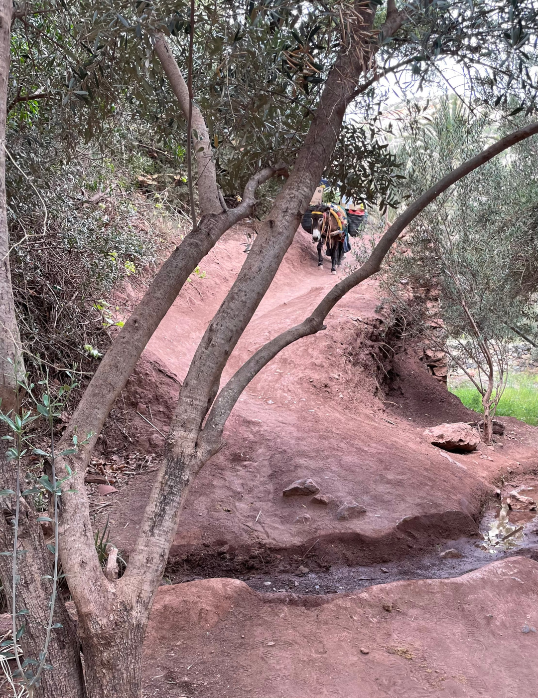
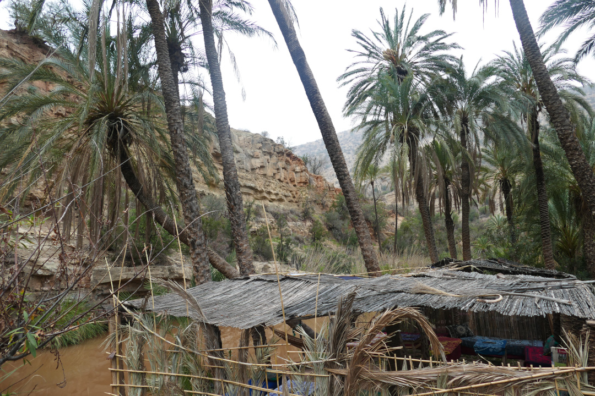
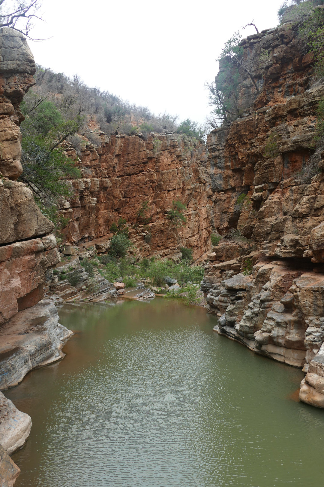
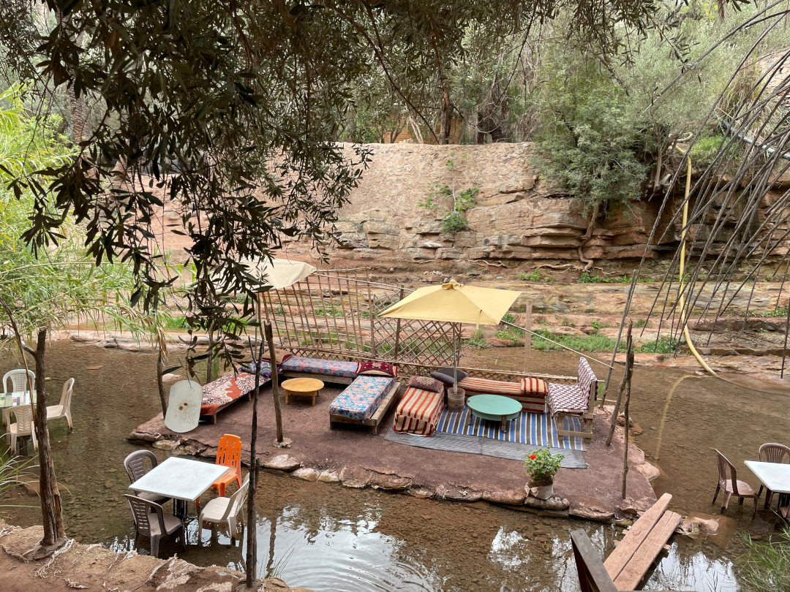

Nach den beiden entspannten Tagen in Essaouira fahren wir ins Paradise Valley nördlich von Agadir.

<!--more-->

🗓️ 8. März: Der Regen von gestern ist über die Nacht komplett weggezogen und wir können unsere Sachen in der Sonne trocknen. Weil wir heute den Campingplatz verlassen wollen, starten wir die letzte Runde mit Henry. Die Dromedare lassen sich aber nicht mehr blicken. Der erste Weg für heute führt uns zurück rein nach Essaouira, um im großen Carrefour alles Notwendige für die nächsten Tage einzukaufen. Wie so häufig werden auch in Essaouira alle Zufahrtsstraßen in die Stadt durch Polizeikontrollen bewacht. Selten wird dabei auch geblitzt. Bisher wurden wir immer weiter gewunken, heute leider das erste Mal nicht. Angeblich sind wir 89 km/h in der 80iger Zone gefahren, genau 2 km/h über der Toleranzschwelle. So willkürlich wie wir rausgezogen wurden, ist auch der Preis. Als der Sheriff merkt, dass wir aus Dortmund kommen und wir uns über das neue BVB-Büro in New York und Marco Reus unterhalten haben, fragt er, ob wir das erste Mal in Marokko sind. Natürlich darf man dabei nie die Wahrheit sagen, also sagen wir, dass wir schon öfter hier waren. So werden aus 150 MAD, dann nur noch 100 (9,80€), aber wahrscheinlich trotzdem noch zu viel. Danach setzen wir unsere Fahrt fort und kaufen wie geplant ein und fahren im Anschluss immer entlang der Küste. Dabei machen wir einige Stopps an coolen Aussichtspunkten und Stränden. Ein Fußballplatz direkt am Wasser wird heute leider nicht bespielt. Als wir mit Henry am Strand entlang spazieren, werden wir schon von einem Hunderudel lautstark erwartet. Erst wollen wir aus Sicherheitsgründen wieder umdrehen, als wir dann aber näher kommen, merken wir, dass es fast nur kleine Welpen sind. Mutter und Vater sind auch nicht weit entfernt. Insbesondere mit der Mutter versteht sich Henry hervorragend. Von einer Aussichtsdüne weiter die Küste entlang können wir auf das bunte Dorf Aghroude schauen, kurz vor dem Surferort Taghazout. Hier wird es auch wieder etwas touristischer. Wir fahren noch etwas weiter ins Dorf Aourir, wo unser Campingplatz für heute liegt. Wir haben sehr viel Platz und neben uns sind nur noch ein paar Franzosen und ein Bus aus Leipzig vor Ort. Der Bus sieht ganz cool aus und wurde selbst umgebaut. Ich gehe hin und spreche mit dem Besitzer bzw. Vater des Trupps, der aussieht wie Samy Deluxe. In dem Bus schlafen 11 Personen, die Eltern und ihre neun Kinder. Ein Kind wurde vor kurzem in Marokko geboren. Nachdem Pläuschchen kochen wir noch fix und beenden den Tag.

🗓️ 9. März: Wieder regnet es etwas, aber nur phasenweise und meistens Nieselregen. Viel Wasser kommt für die Natur nicht zusammen. Wir sind schon in einer sehr trockenen Region in Marokko angekommen. Heute wollen wir aber ins Paradise Valley fahren, das so etwas wie eine Oase in der eher staubigen Region ist. Das Paradise Valley ist eine Schlucht mit einem Fluss, der mal mehr und mal weniger Wasser mit sich führt. Wir wandern runter zur Schlucht und nachher wieder hoch bis zum Ende des Flusses. Einen Schwimmer können wir trotz Regen auch im Fluss ausmachen. Überall auf dem Wanderweg wird viel angeboten und man kann sogar im Fluss essen. Weil es nach dort unten keine Straßen gibt, werden die Restaurants und Shops per Esel beliefert. An diesen Punkten ist es relativ voll, auch weil viele Tagesgäste aus Agadir vorbeikommen. Läuft man aber nachher die Schlucht wieder hoch bis zum Ende wird es deutlich leerer. Weil die Wanderung nur gut zwei Stunden dauert, entscheiden wir uns die Straße weiter hoch in die Berge zu fahren. Spätestens hier sind wir dann komplett alleine. Wir meisten den Trollstigen Marokkos und fahren einige abenteuerliche Straßen bergauf. An einigen Stellen darf kein Gegenverkehr kommen. Die Aussicht oben lohnt sich aber. Man kann über die Schluchten und Berge gucken. Diesen Moment halten wir natürlich fest. Danach fahren wir auf eigene Faust durchs Gebirge, vorbei an einigen Bergdörfern und einsamer Wildnis. Danach geht es zurück nach Aourir, wo wir direkt am Meer noch etwas essen. Dank WLAN am Campingplatz können wir den Tag mit dem BVB in Bremen ausklingen lassen.

