Wir verlassen Rumänien und die EU kurzzeitig und fahren in das laut Statistik unbeliebteste Reiseland Europas: Moldau.

<!--more-->

🗓️ 8. Mai: Es regnet schon die komplette Nacht über und auch der Morgen beginnt mit Regen. Die Henry-Runde fällt deshalb etwas kleiner aus. Wir machen das Beste aus dem Regentag und fahren viele Kilometer. Wir wollen heute nach Moldau einreisen. Zuerst führt uns unser Weg aber zum Lidl, um Frühstück und ein paar Vorräte für Moldau einzukaufen. Am Lidl Parkplatz treffen wir auf einem Fahrrad einen älteren Herrn, der mit seiner BVB-Regenjacke von 1997 schon neongelb leuchtet. Er hat bestimmt auch gestern das Halbfinale geguckt. In Iasi, der letzten Großstadt in Rumänien vor der Grenze, besorgen wir uns noch Mittagessen und fahren weiter nach Sculeni, der Grenzstadt, die halb in Rumänien und halb in Moldau liegt. Die einzige große Straße durch den Ort muss aber wohl immer verstopft sein, weil sich der Verkehr von der Grenze zurückstaut. Bis wir zum Checkpoint vorfahren dürfen, dauert es ungefähr anderthalb Stunden. Die Ausreise aus Rumänien klappt einfach und der Grenzbeamte ist sehr nett. Er wundert sich nur, wieso wir in Moldau campen wollen, findet es aber sehr gut. Die Einreise nach Moldau ist etwas gefühlskälter. Der Bulli wird insgesamt von drei Grenzbeamtinnen durchsucht. Sobald sie Henry sehen, hören Sie aber auf und fragen nur noch, wie er heißt und ob er beißt. Als dann alle Dokumente gecheckt worden sind, folgt der Zoll. Wir sagen, dass wir nichts Verbotenes oder zu Verzollendes dabeihaben und damit gibt er sich zufrieden. Er notiert nur handschriftlich auf einem Collegeblock noch unser Kennzeichen. Mit Grenzübertritt lernen wir die moldawischen Straßen kennen. Durchgehend asphaltierte Straßen gibt es eigentlich nicht und die, die asphaltiert sind, sind nicht unbedingt besser als die Schotterpisten. Oft wird auch noch an den Straßen gebaut. Dann ist es sehr unübersichtlich. Wenn die Baustellenfahrzeuge den Weg mal freigeben, quetschen sich Autos, Transporter, Busse, Pferde-Kutschen und Fahrräder auf einem Schotterstreifen vorbei. Eilig haben darf man es hier besser nicht. Unser Campingplatz für heute liegt ca. 50 km östlich der Grenze. Bei der Aufregung um die Straßen haben wir vergessen moldawisches Bargeld abzuheben, aber wir können glücklicherweise mit Euro bezahlen. Die Preise für die Campingplätze sind sowieso eher im Eurobereich, also westeuropäisch. Das liegt daran, dass es in ganz Moldau nur zwei Campingplätze gibt, die quasi nur von Westeuropäern besucht werden. Wir werden von einem jungen Typen begrüßt, also mehr oder weniger. Er spricht nicht mit uns. Er ruft seine Chefin an, die Englisch spricht und für ihn am Telefon übersetzt. Er zeigt uns fast wortlos, wo wir stehen können und wo die Duschen sind. Wir sind die einzigen Gäste. Das kennen wir aber schon aus Ungarn und Rumänien. Dennoch sind der Ort und die Landschaft super. Man kann gut entspannen und ist mitten in der Natur im Grünen. Zu unserer Freude sehen wir noch die drei Hundewelpen des Platzes. Besser hätte das Ankommen in Moldau nicht sein können. Wir gehen noch eine Runde mit Henry, um die Umgebung kennenzulernen. Danach gibt es wie so oft Wraps.

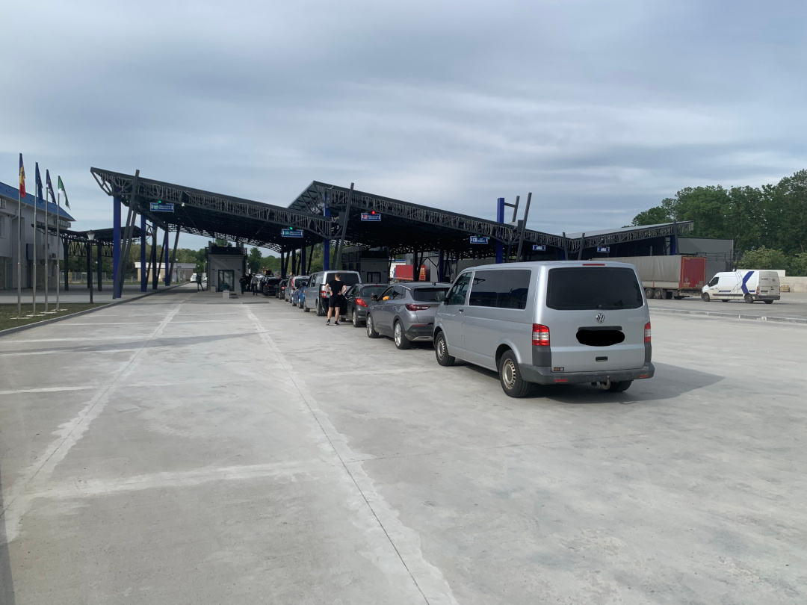

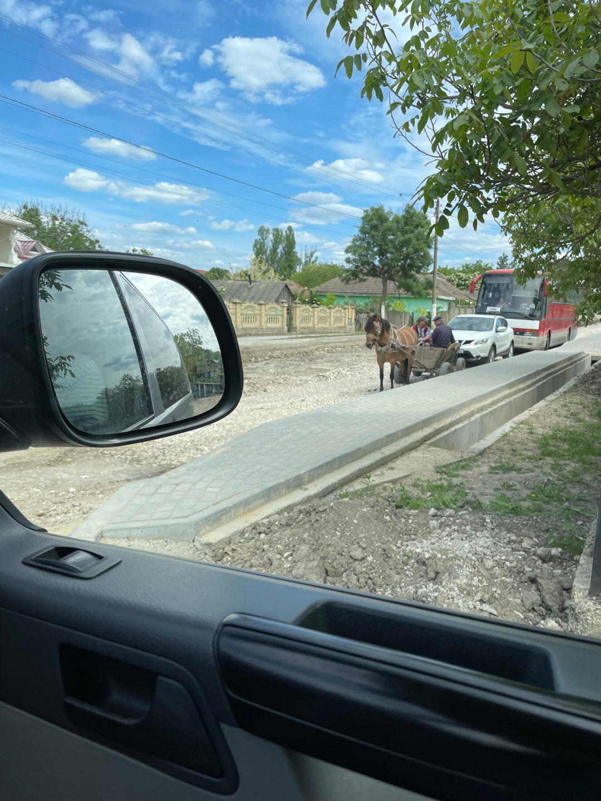

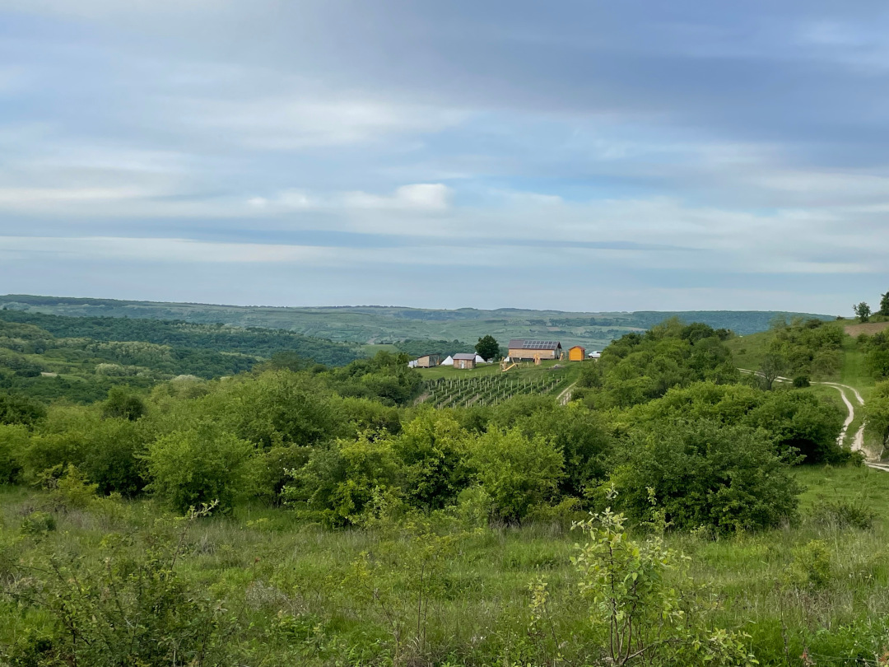

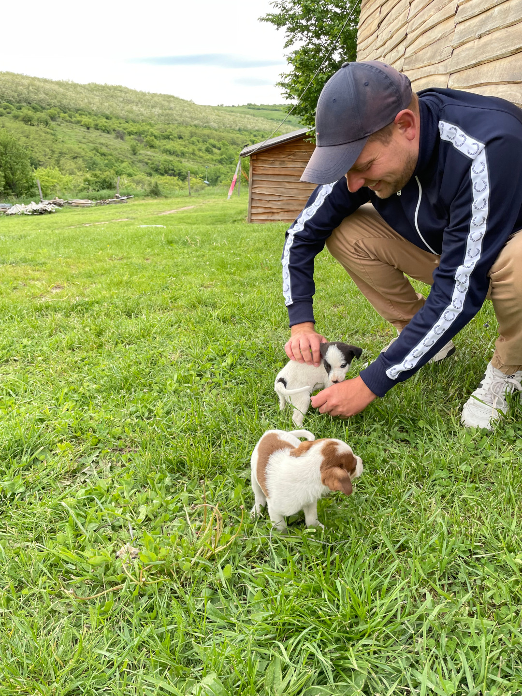

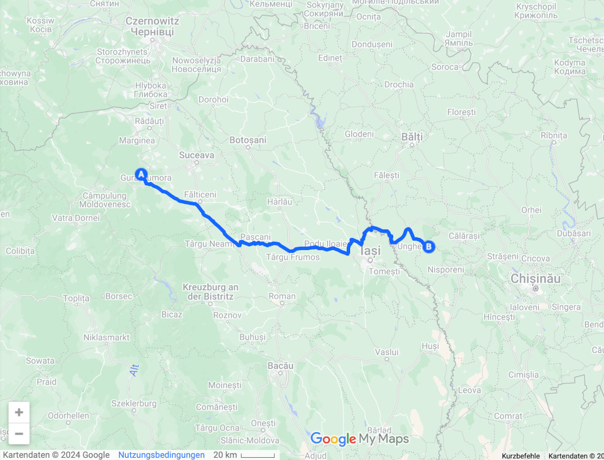

🗓️ 9. Mai: Die Nacht verläuft sehr ruhig. Der Junge schläft übrigens auch hier auf dem Platz, in einem kleinen Container. Das ist uns auch ganz recht, sonst ständen wir die erste Nacht in Moldau quasi frei. Die Welpen erwarten uns morgens schon vor unserem Bulli. Wir kümmern uns aber erst um unseren eigenen Hund, bevor wir uns wieder den Welpen widmen. Die Mutter und der Vater werden getrennt voneinander an der Kette gehalten. Weil die Mutter sehr abgemagert aussieht und die Kleinen noch bei ihr trinken, füttern wir sie noch etwas. Danach machen wir uns auf den Weg zum Kloster Churchi. Unterwegs halten wir noch an einer kleinen Tankstelle (wir sind extra mit leerem Tank eingereist, damit wir ihn uns hier für gute 1,11€ pro Liter vollmachen können) und in einem Linella Supermarkt. Hier sind die Preise dann auch nicht mehr westeuropäisch, sondern wirklich erschwinglich. Wir hatten im Vorfeld gelesen, dass in Moldau öfter ausländische Nummernschilder geklaut werden, um nachher „Lösegeld“ zu erpressen. Ohne Nummernschild kann man nicht mehr weiterfahren und darf auch nicht das Land verlassen. Jedes Fahrzeug muss wieder ausgeführt werden. Daher waren wir während des Einkaufens erstmal vorsichtig. Für unser Auto hat sich aber niemand interessiert. Wir nutzen die Chance und holen noch Bargeld. Ein paar holprige Straßen später erreichen wir dann das Kloster Churchi. Hier merkt man dann auch, dass man an einer Sehenswürdigkeit des Landes angekommen ist. Hier ist für moldawische Verhältnisse viel los. Das orthodoxe Kloster wurde 1773 erreichtet und ist wohl das zweit bekannteste Kloster in Moldau (Nummer eins wartet morgen). Zurück am Auto sind auch noch beide Nummernschilder da, so dass wir uns auf den Weg zu unserem Campingplatz machen. Dieser liegt im Orhei Nationalpark direkt auf einem Hügel mit Blick auf das Höhlenkloster von Butuceni. Wir hatten dem Besitzer schon im Vorfeld eine Nachricht geschrieben, dass wir kommen, deshalb kann er uns auch gut zuordnen. Auch hier sind wir die einzigen Gäste und haben jetzt jeden Campingplatz in Moldau gesehen. Der ältere Besitzer kann leider ebenfalls nicht direkt mit uns sprechen. Er spricht nur sehr wenig Englisch, aber zum Glück beherrscht er den Google Übersetzer. Er gibt uns eine Führung über seinen Hof und zeigt uns alles. Hier ist es noch schöner als gestern. Die Lage ist traumhaft, einer der schönsten Stellplätze der bisherigen Reise. Den Rest des Tages entspannen wir auf dem riesigen Hof bei Sonne und toller Aussicht.

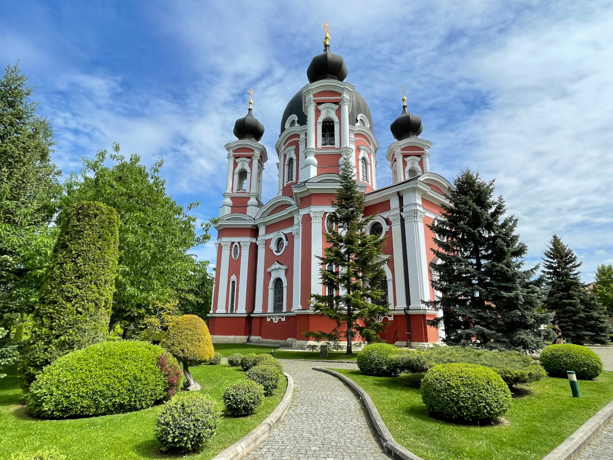

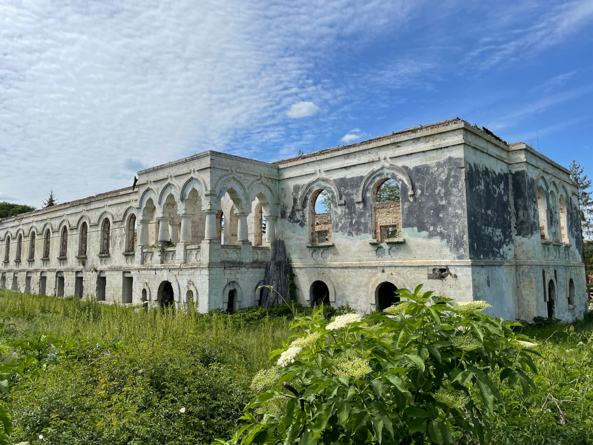

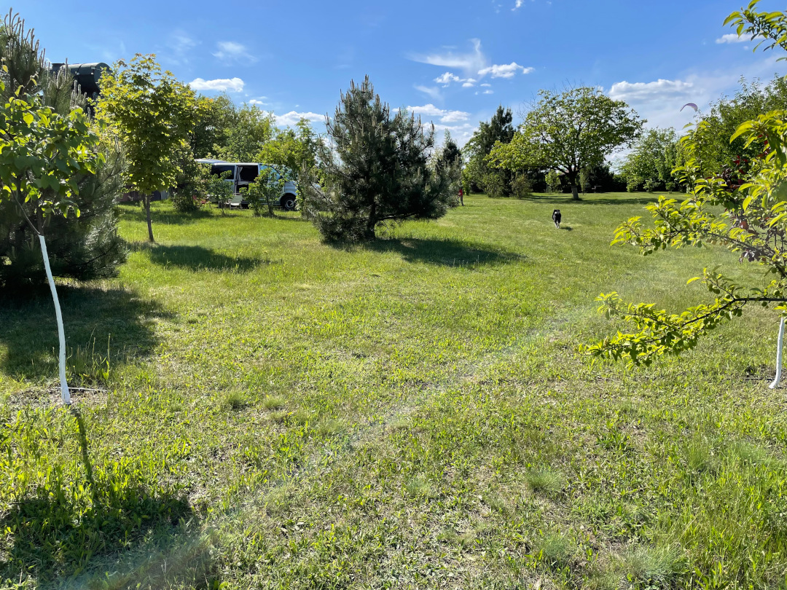

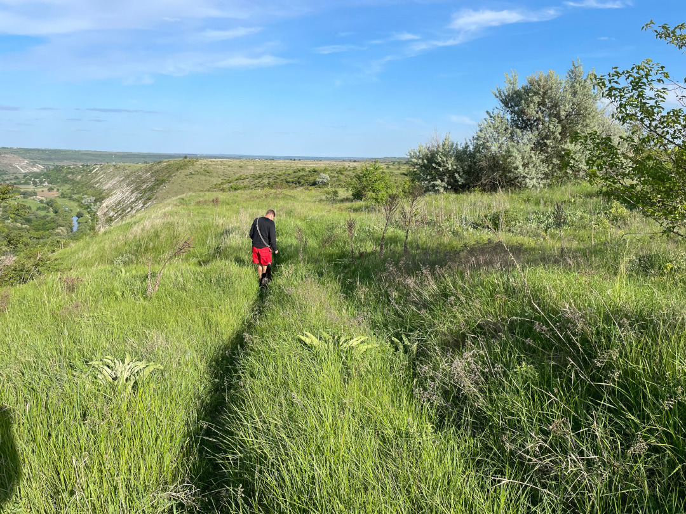

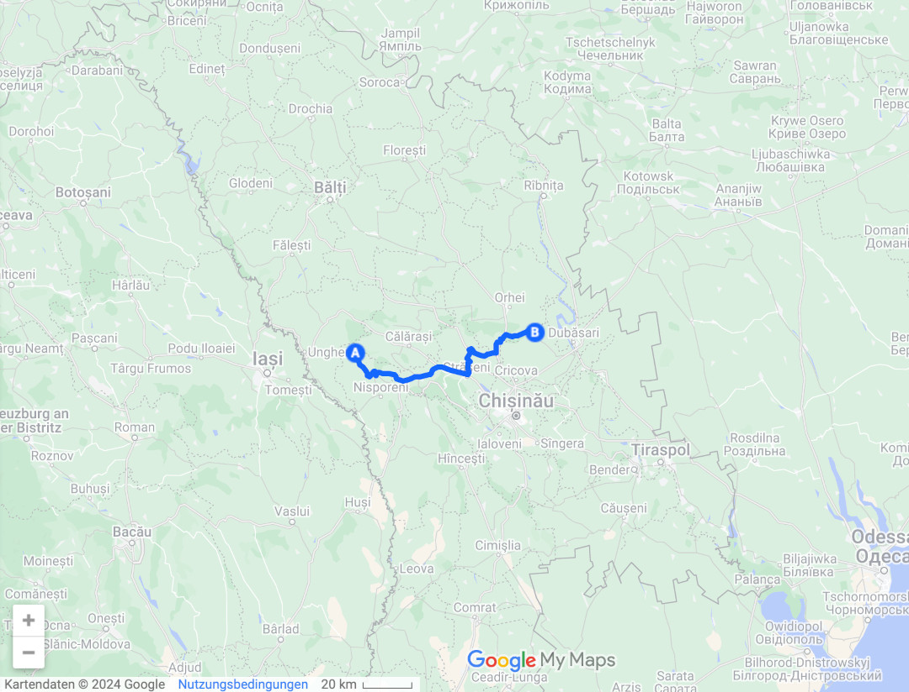

🗓️ 10. Mai: Auch die zweite Nacht in Moldau verlief ruhig. Wir entscheiden noch eine Nacht hier auf dem Campingplatz zu bleiben. Bei perfektem Wetter lassen wir den Tag entspannt starten. Nachdem wir unsere Wäsche gewaschen haben, wollen wir zum Höhlenkloster und etwas im Nationalpark wandern. Das Höhlenkloster und die alte Stadt Orhei sind die einzige UNESCO Welterbestätte Moldaus und nach der Haupstadt Chisinau wohl die Sehenswürdigkeit Nummer eins. Wie das Kloster, das wir gestern besucht hatten, wurde auch dieses im 17. Jahrhundert errichtet. Der Weg dahin ist sehr anspruchsvoll. Weil der Campingplatz oberhalb des Klosters liegt, müssen wir erstmal bergab klettern. Angeblich soll es ein kleiner Wanderpfad sein, aber ohne Klettern kommt man weder runter noch hoch. Wie bei der Wanderung in Rumänien werden auch hier die Höhenmeter direkt überwunden. Serpentinen würden das Wandern anscheinend nur unnötig verlängern. Trotzdem kommen wir heile unten an. Nachdem wir den Fluss überquert haben, geht der Weg dann aber sehr entspannt zum Kloster. Im Endeffekt sieht das Kloster an sich weniger spektakulär aus als gestern, aber die Umgebung macht es dann doch zum beliebten Fotomotiv. Auch an einem Freitagmittag sind für die Verhältnisse hier viele Besucher vor Ort. Wir wandern noch etwas weiter und machen mit Blick auf das Tal eine Pause, bevor es wieder zurück geht. Die Klettereinheit bergauf können wir auch gut meistern. Henry kommt aber auf seine alten Tage teilweise schon an seine Grenzen. Es kratzt wohl etwas an seinem Ego, wenn wir ihn manchmal tragen. Das macht es nicht unbedingt leichter. Wieder oben am Bulli angekommen lassen wir den Tag weiterhin so entspannt wie vor der Wanderung weiterlaufen. Wir schwingen den Kochlöffel und genießen den Sonnenuntergang.

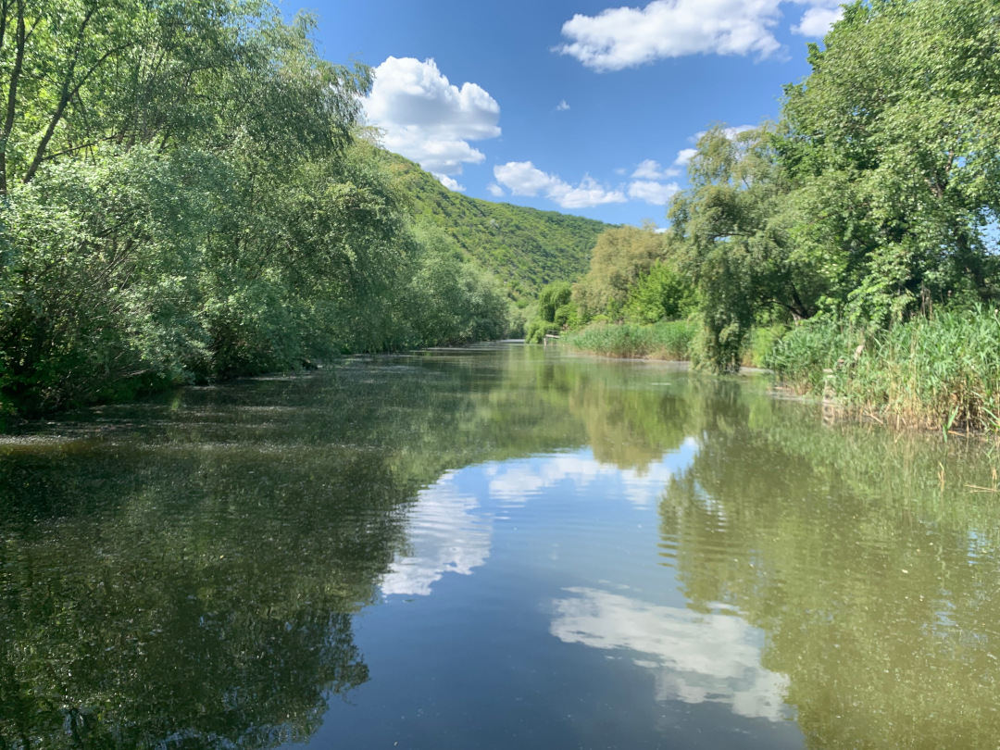

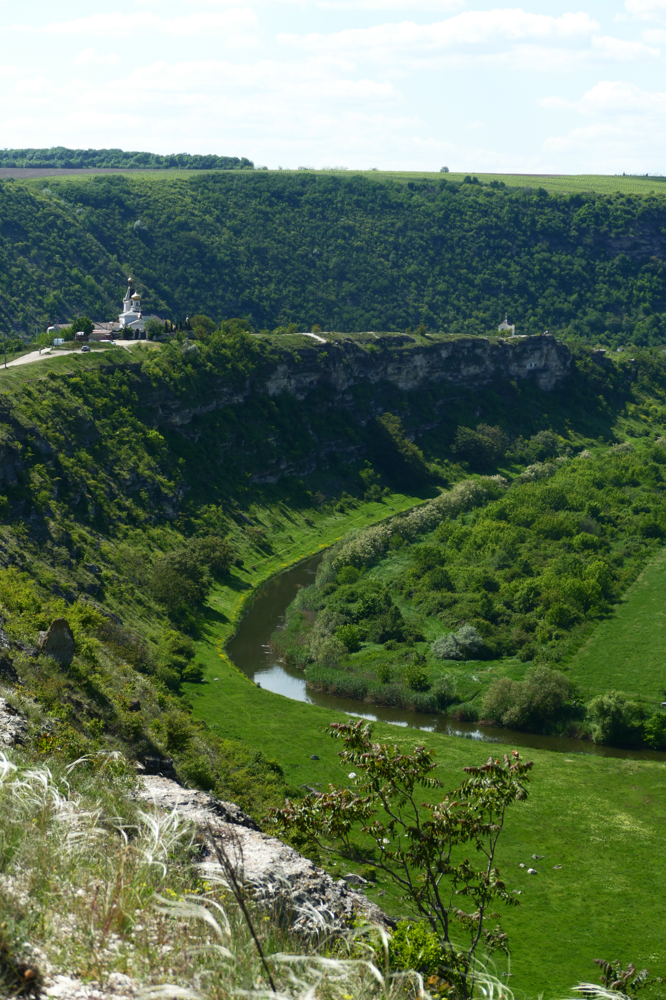

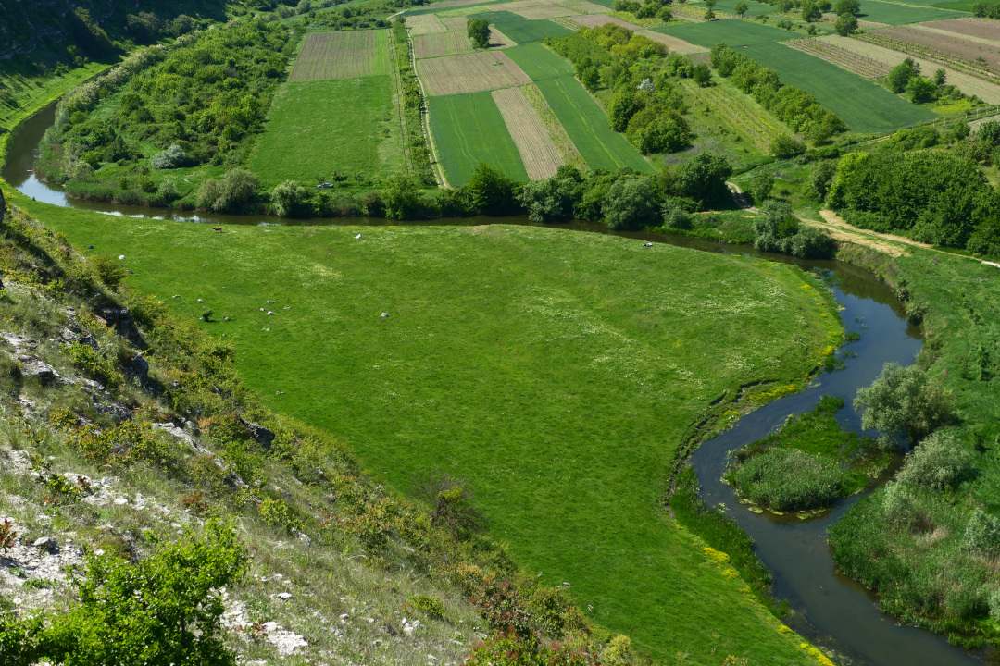

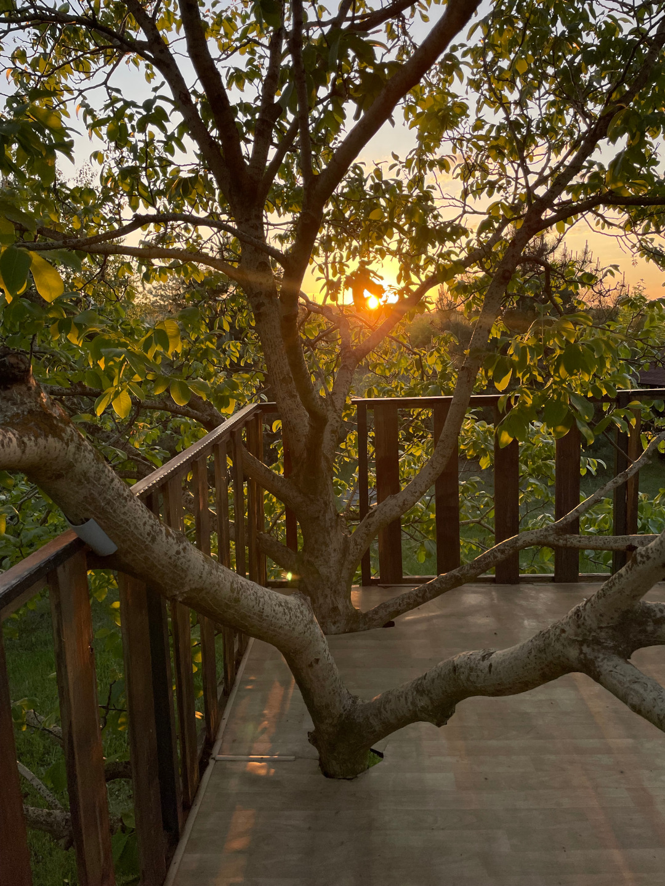