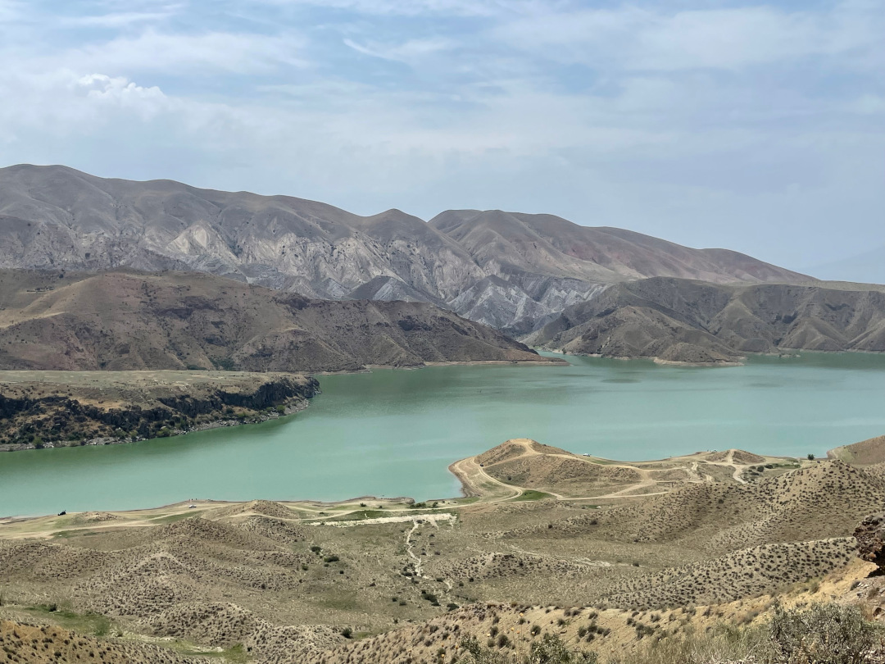
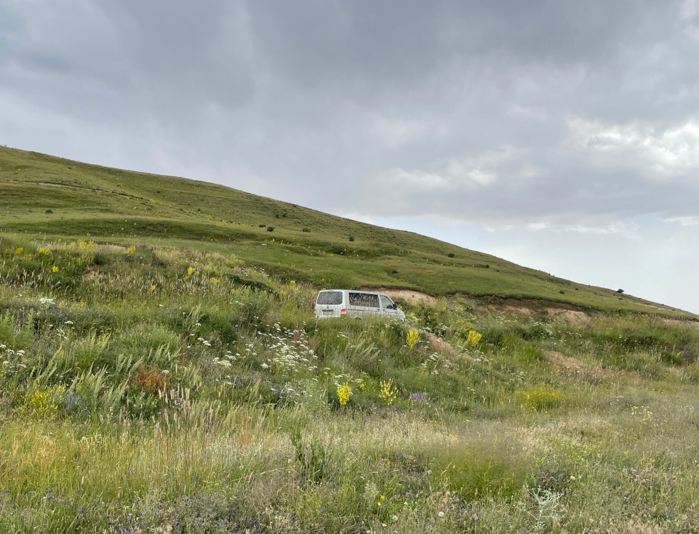
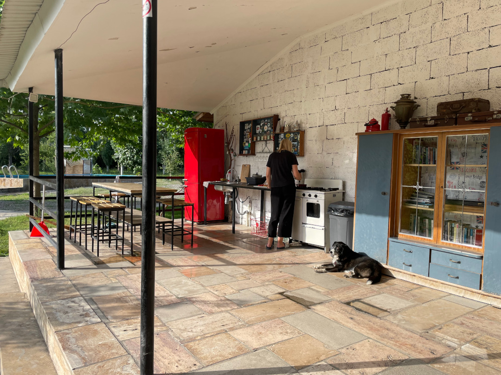
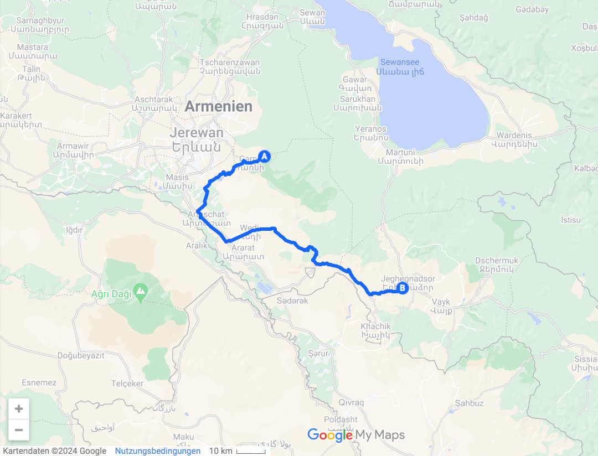
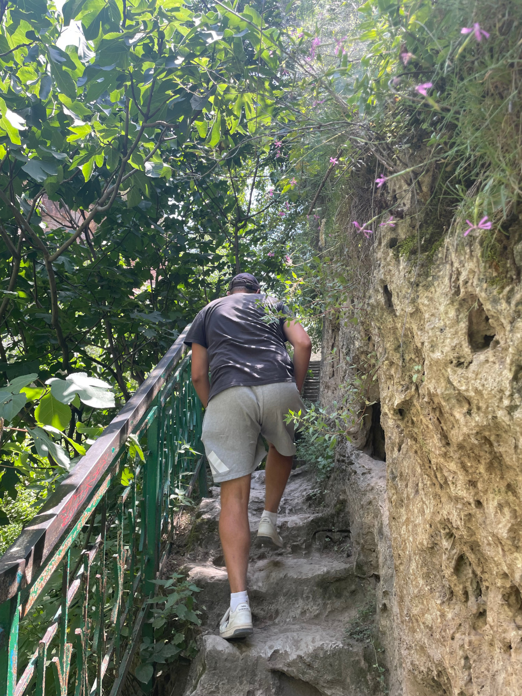
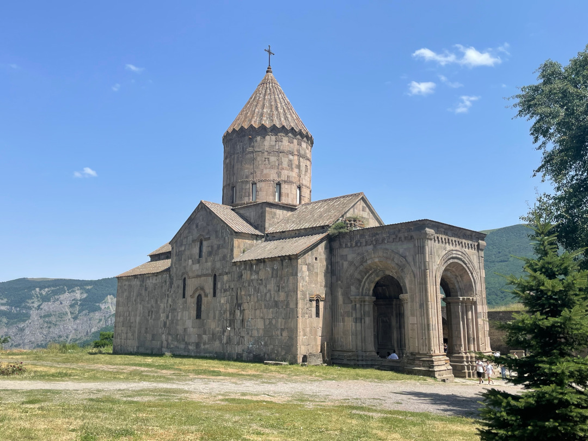
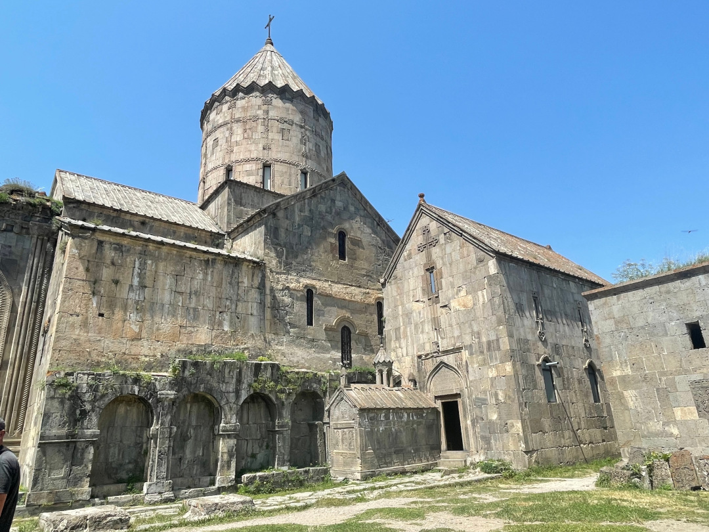
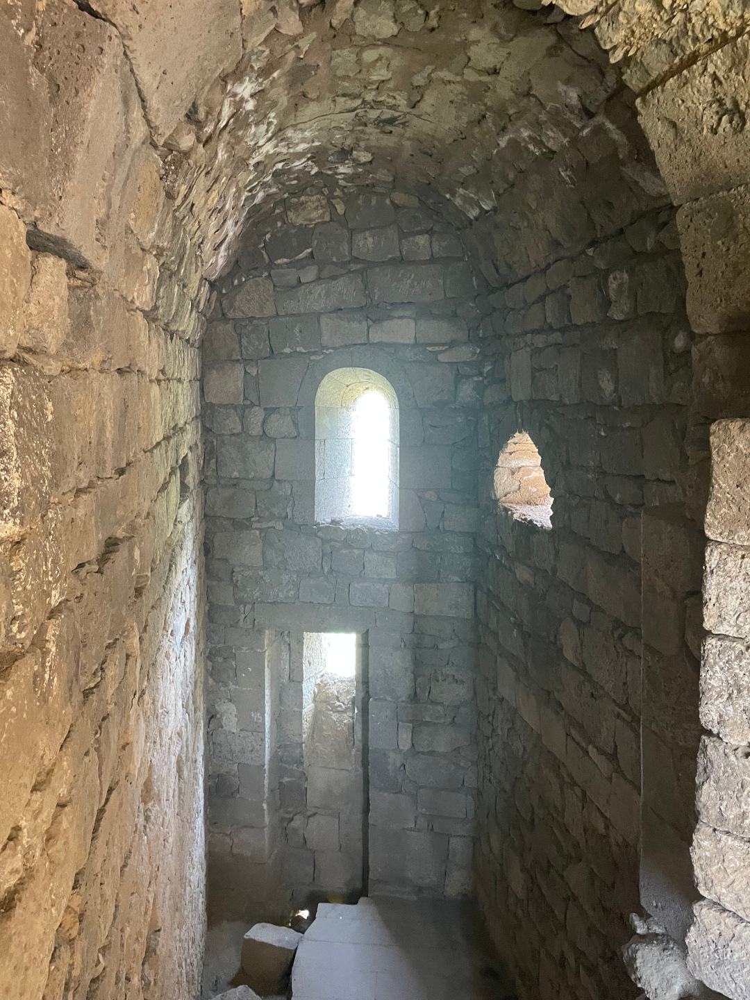
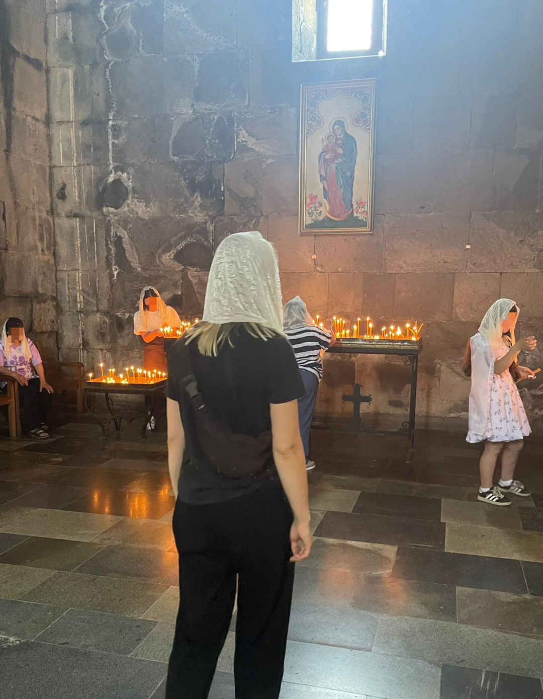
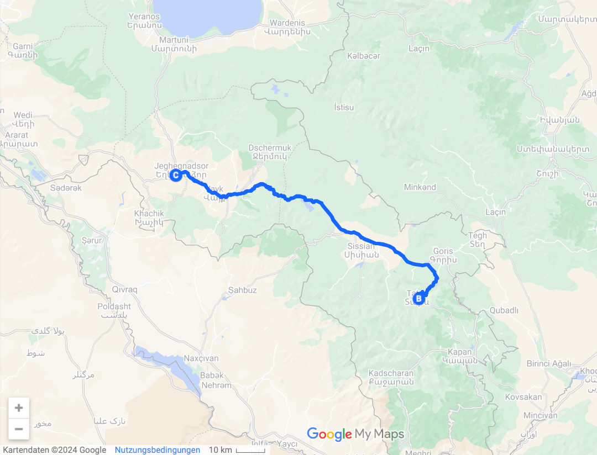

Den Campingplatz 3Gs lassen wir hinter uns und fahren weiter in den Süden nach Tatev, kurz vor die armenisch-aserbaidschanische Grenze.

<!--more-->

🗓️ 8. Juli: Auch wenn das Barbecue gestern länger dauerte als gedacht, machen wir uns abfahrbereit. Wir verabschieden uns von allen anderen, die wir kennengelernt haben. Einer meint noch, dass er uns mit armenischem Wodka in Dortmund besuchen kommt. Wir hoffen, dass er es schnell vergisst. Die meisten sind sowieso erstaunt, dass wir schon so fit sind, um fahren zu können, aber nach fünf Tagen an einem Ort haben wir wieder etwas Bewegungsdrang. Selbst der älteren Besitzerin des Kiosks nebenan winken wir noch beim Wegfahren. Sie hat uns auf jeden Fall erkannt. Um nach der kurzen Nacht nichts zu überstürzen, fahren wir nur knapp 200 km südlich auf den nächsten Campingplatz. Unser Weg führt uns auf armenischer Seite am Ararat vorbei. Den kennen wir ja schon von der anderen türkischen Seite, aber auch hier sieht er immer noch cool aus. Wir fahren auch sehr nah an der autonomen Republik Naxcivan vorbei, einer Exklave Aserbaidschans. Dementsprechend sieht man hier auch viel armenisches Militär und Polizei, was im Norden eigentlich gar nicht der Fall war. Für uns interessiert sich aber niemand und wir werden nicht kontrolliert. Die Landschaft, durch die wir fahren ist sehr gebirgig und sieht überall spektakulär aus. Die mittlere Höhe von Armenien ist 1.800 m hoch und 90 % des Landes befinden sich über 1.000 m hoch. An einer Schlucht nutzen wir aus, dass wir keine Straßen- und Hirtenhunde sehen und laufen eine Runde mit Henry am Rand der Schlucht entlang. Kurz vor dem Campingplatz finden wir dann sogar noch einen guten Supermarkt. Wir können unsere Vorräte wieder auffüllen und fürs Abendessen einkaufen. Im armenischen Supermarkt wird quasi alles für einen gemacht. Vom Gemüse wiegen bis zum Einkaufstasche packen kümmern sich die Mitarbeiterinnen um alles. Am Campingplatz angekommen sind wir die einzigen Gäste. Nach dem großen Essen gestern ist das etwas ungewohnt. Einer der zwei Campingplatzhunde mag uns wohl sehr und ist die ganze Zeit bei uns. Henry und er werden zwar keine besten Freunde, aber immerhin lassen sie sich in Ruhe. Der Hund geht sogar noch mit uns spazieren und freut sich so viel Aufmerksamkeit zu bekommen. Unser Abendessen können wir in der coolen Outdoorküche kochen, mit fast demselben Kühlschrank wie in Dortmund. Danach geht es aber fix ins Bett, um den Schlaf nachzuholen.

🗓️ 9. Juli: Heute soll es zum südöstlichsten Punkt unserer gesamten Reise gehen. Im wahrsten Sinne des Wortes also ein Wendepunkt. Wir fahren nach Tatev, um uns das Kloster dort anzugucken. Das Kloster in Tatev ist das Postkartenmotiv Nummer eins in Armenien. Weil wir aber bei 3Gs ein paar Tage zu viel ungeplant verbracht haben, wollen wir auch direkt wieder zurück zum Campingplatz fahren. Also zweieinhalb Stunden hin und danach wieder zurück. Wir bezahlen für die erste Nacht und sagen aber, dass wir wiederkommen und machen uns auf den Weg. Auf dem Weg tanken wir das erste Mal in Armenien und zahlen sogar weniger als wir dachten. Auch wenn es mit 1,24€ pro Liter noch deutlich teurer ist als in Georgien. Anfangs sind die Straßen noch echt gut ausgebaut und asphaltiert, das ändert sich auf den letzten 30 Kilometern, für die wir dann auch noch eine Stunde benötigen. Auch heute ist viel Militär unterwegs. Dieses Mal aber nicht wegen der Nähe zu Aserbaidschan, sondern wegen der Nähe zum Iran. Aber auch heute werden wir nicht raus gewunken. Am Kloster angekommen fahren wir die Serpentinen noch etwas höher und vorbei am Kloster. Von oben hat man nämlich die beste Sicht. Das Kloster wurde im Jahr 895 gegründet. Es lohnt sich nicht nur von außen, sondern auch von innen. Im Gegensatz zur Türkei ist in Armenien nämlich fast alles und erst recht die Klöster ohne Eintritt. Wir laufen einmal über das Klostergelände und dann auch in die Kirche. Hanna muss ein Kopftuch tragen, aber es gibt zum Glück welche direkt am Eingang. Mittlerweile sind wir ja echte Klosterexperten und können schon sagen, dass das hier eines der schönsten und am besten erhaltenen in Armenien ist. Der Besuch und die teilweise schlechte Straße hat sich gelohnt. Auf dem Rückweg halten wir in einem kleinen Dorf noch bei etwas, das für uns wie eine Post aussieht. An der Wand hängt auch ein Kasten, aber als wir Postkarten einwerfen wollen, kommt ein Mann von der anderen Straßenseite und versucht uns zu erklären, dass es lange dauert, wenn wir sie reinwerfen. Wenn er sie nimmt, soll es viel schneller gehen. Er wirkt vertrauenswürdig und so drücken wir sie ihm in die Hand und bedanken uns bei ihm. Ein paar Kilometer weiter signalisiert uns dann leider ein Bauarbeiter, dass die schlechte Straße jetzt nun ganz gesperrt ist. Wir müssen sofort abbiegen und einen Umweg über Feldwege nehmen. Wir reihen uns in die Kolonne ein. Autos, Busse und LKW fahren jetzt über den Feldweg. Niemand meckert, alle machen es einfach. Nach zwanzig Minuten sehr holprigem Umweg sind wir zum Glück von dem schlechten Feldweg wieder auf der schlechten Straße. Danach geht es aber relativ fix zurück zum Campingplatz. Heute Nacht ist noch ein Paar aus Holland da und heute sind sogar beide Campingplatzhunde unsere Freunde. So gehen wir mit dem großen Rudel spazieren. Henry versteht sich zwar immer noch nicht einwandfrei mit ihnen, aber irgendwie wollen sie doch immer bei uns sein und freuen sich über die Spazierrunden mit uns. Wir essen noch etwas und sitzen entspannt am Bulli.

