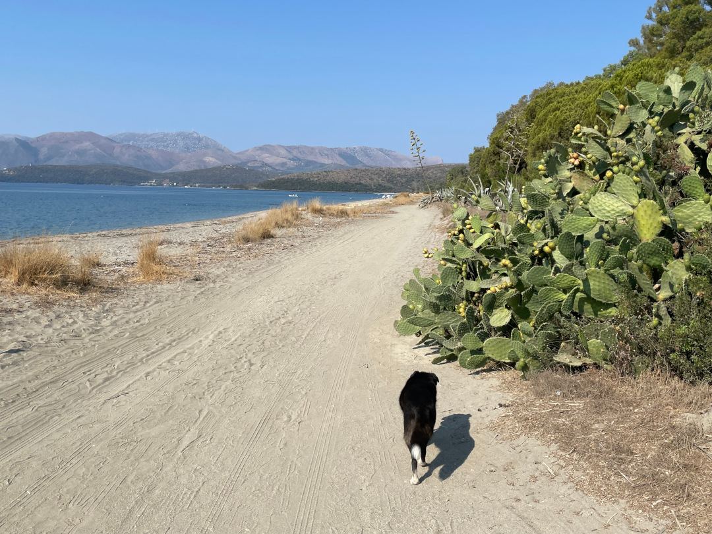
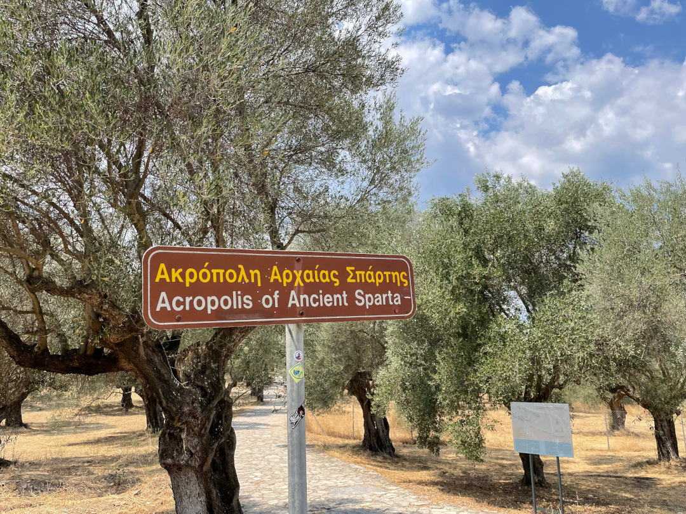
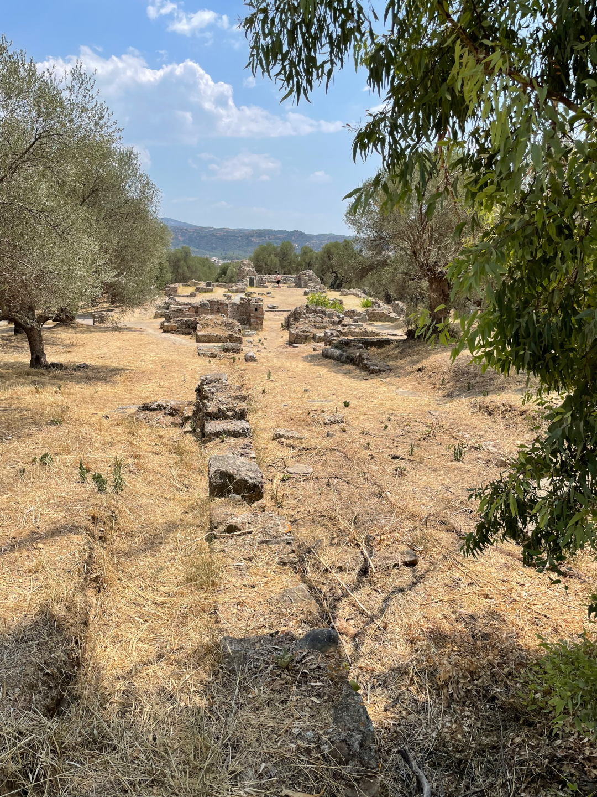
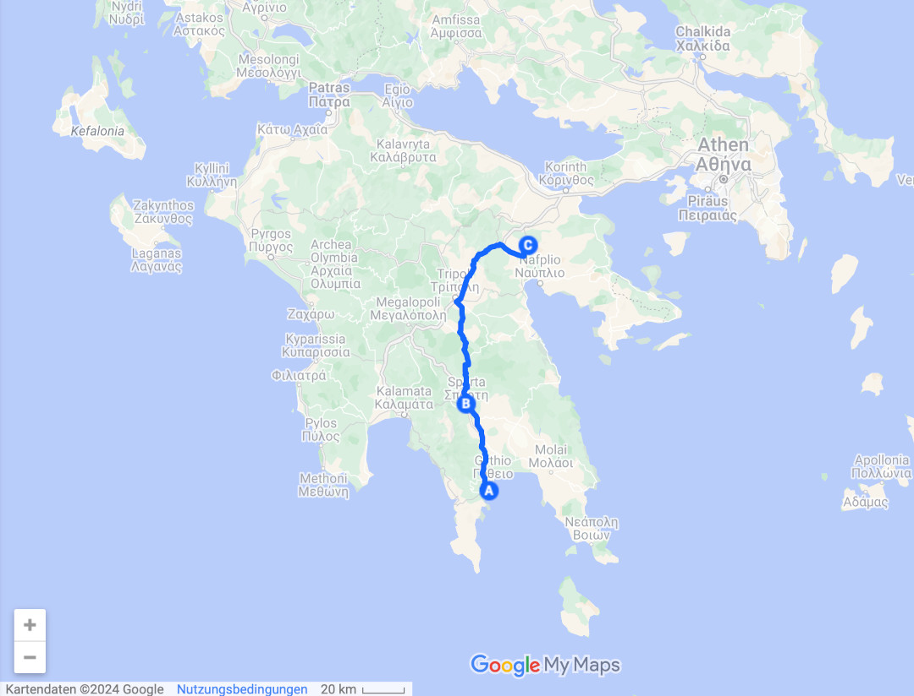
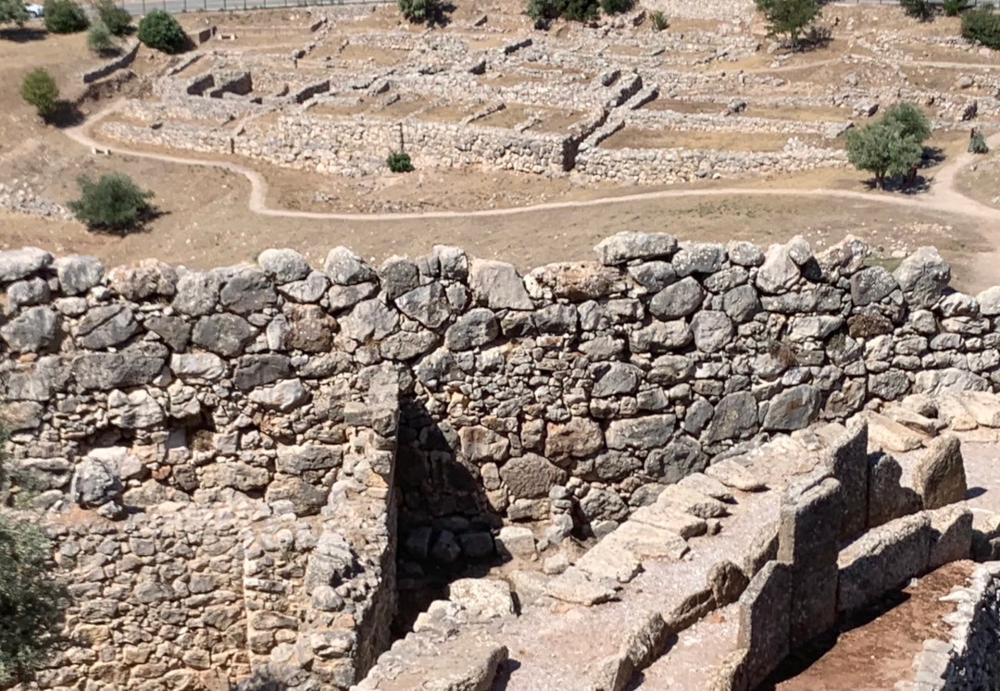
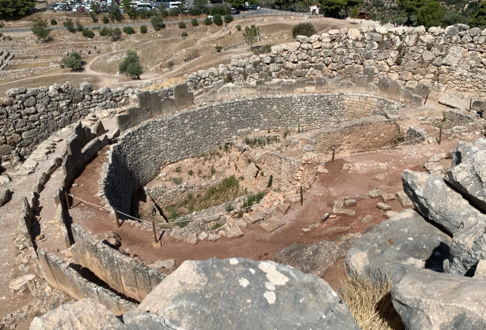
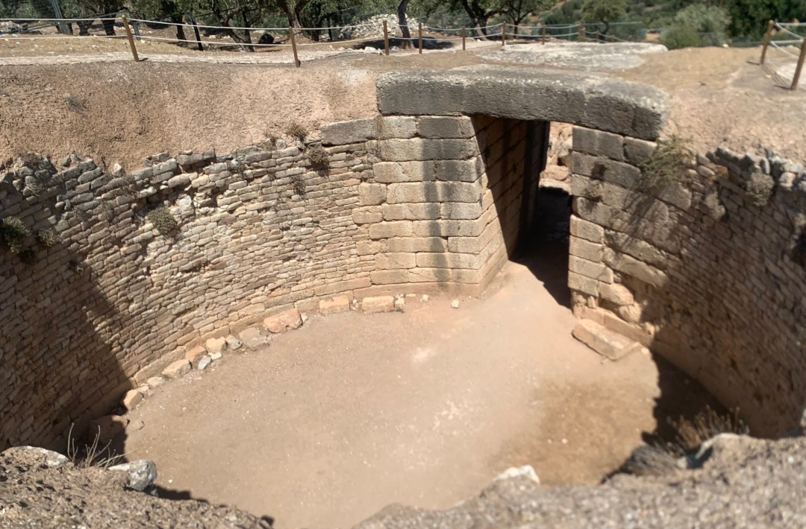

Nach den Tagen am Meer gibt es nun etwas Kultur und wir fahren zu zwei antiken Stätten auf Peleponnes.

<!--more-->

🗓️ 8. August: Weil wir uns gestern schon schnell entschieden haben keine zweite Nacht hier zu bleiben, machen wir uns nach einer Henryrunde am Strand und einer Schwimmpause abfahrbereit. Nur Takis Taverne wäre ein Grund gewesen noch zu bleiben. Ansonsten ist es hier zu voll und zu laut. Wir suchen uns für die nächsten beiden Nächte einen ruhigeren kleinen Campingplatz aus, der nicht am Meer sondern im Landesinneren im Dorf Mykene liegt. Wir fahren wieder ohne Maut durch viele kleine griechische Dörfer. Wir können es uns ja gut erlauben, weil wir Zeit haben. Unsere erste Station ist die Stadt Sparta. Sparta ist wohl eine der berühmtesten antiken Stätten in Griechenland. Sparta war die Hauptstadt des Staates Lakonien und berühmt für das spartanische Heer. Die Jungen wurden vom siebten bis zum dreißigsten Lebensjahr militärisch ausgebildet und waren daher den meisten Gegnern überlegen. Es gibt ja genug Kinofilme darüber. Das Ganze hielt ungefähr 300 Jahre, bis Sparta vom römischen Reich eingenommen wurde. Heute ist vom antiken Sparta nicht mehr viel erhalten. Es gibt noch Reste vom alten Theater und der Akropolis, was man aber nicht erkennen kann. Vor dem Fußballstadion steht die Statue vom König Leonidas I. Viel mehr hätten wir uns bei den Temperaturen sowieso nicht angucken können. Dennoch ist es immer super spannend an den Orten und auf den Wegen lang zu laufen, wo sich schon vor fast 3.000 Jahren damals eine der größten Städte befand. Sparta hatte damals zu Hochzeiten über 50.000 Einwohner. Heute leben hier noch 35.000 Menschen. Die moderne Stadt wurde erst 1836 wieder gegründet und geplant, um die Stadt wieder aufleben zu lassen. Im modernen Sparta besorgen wir uns Frühstück und einen neuen Ventilator. Unser Batterie-Ventilator ist wegen Überlastung kaputt gegangen. Wir sind auf einen Strom Ventilator umgestiegen, der auch deutlich mehr Power hat. Von Sparta fahren wir danach noch fast zwei Stunden bis Mykene. Als wir beim Campingplatz ankommen, merken wir schon, dass wir alles richtig gemacht haben. Es ist sehr wenig los, trotzdem ist er riesig und hat sogar einen Pool. Erst dann bemerken wir, dass wir in Mykene direkt neben der nächsten wichtigen antiken Stätte sind. Doch das muss bis morgen warten. Wir waschen noch unsere Wäsche und springen dann in den Pool. Zum Abendessen suchen wir uns wieder eine gute kleine Taverne und bekommen wie immer perfektes Essen. Ruhig, dunkel und entspannt geht es dann ins Bett.

🗓️ 9. August: Es war seit langem mal wieder eine ruhige und vergleichsweise kühle Nacht. Der neue Ventilator hilft dabei natürlich auch. Wir bleiben erstmal etwas liegen und planen die restlichen offenen Tage in Griechenland. Danach gehen wir mit Henry durch die Oliven- und Zitronenplantagen eine große Runde spazieren. Es gibt im Dorf zwar ein paar Straßenhunde, aber vor denen ist nichts zu befürchten. Für die Abkühlung sorgt im Anschluss der Pool. Danach geht es schnell zu der antiken Stätte Mykene. Von der wir zwar nur vier Kilometer entfernt sind, aber aufgrund der Temperatur das Auto nehmen müssen. Wenigstens sind wir früh dran und es ist vor Ort noch ertragbar. Mykene war (noch vor Sparta) eine der bedeutendsten Städte in Griechenland, die schon 3.500 vor Chr. besiedelt war. Die Mykener waren die erste Hochkultur auf dem europäischen Festland. Hier ist noch etwas mehr erhalten als von Sparta. Die alte Festung steht oben auf einem Berg oberhalb des jetzigen Dorfs Mykene. Im Museum sind noch einige Dinge aus der Zeit aufbewahrt. Auch hier ist es wieder komisch, dort herumzulaufen, wo vor 5.000 Jahren schon Menschen wohnten. Der Eintritt lohnt sich schon, auch wenn man die Gebäude nur noch erahnen kann. Nach so vielen Exkursen in die antike griechische Kultur wird es Zeit zum jetzigen Griechenland zurückzukommen. Weil wir sowieso mit dem Auto unterwegs sind, können wir einen Abstecher in den nächsten größeren Ort machen und Gyros Pita als Frühstück/Mittag besorgen. Wir nutzen auch die Chance für ein paar Einkäufe bei Lidl. Zurück am Campingplatz essen wir die Gyros Pita und entspannen. Wir gehen in den Pool und können etwas Olympia gucken.  Am ersten Abend der Reise haben wir an einem Rasthof bei Paris noch die Handball WM geguckt. Jetzt kurz vor Ende der Reise gucken wir wieder Handball. Diesmal aber Olympia aus Paris und mit freudigem Ergebnis. Abends gehen wir noch eine Runde vorbei an den Oliven und Zitronen mit Henry und versuchen etwas zu kochen. Es gibt einen Gaskocher in der kleinen Küche des Campingplatzes, allerdings nur mit einer Platte. Deshalb gibt’s nur Grillkäse aus der Pfanne. Die ersten beiden klappen gut, danach ist auch hier das Gas leer. Es ist als wären wir verflucht. Naja. Danach gehen wir früh ins Bett, weil wir morgen mal wieder mit Wecker aufstehen müssen.

