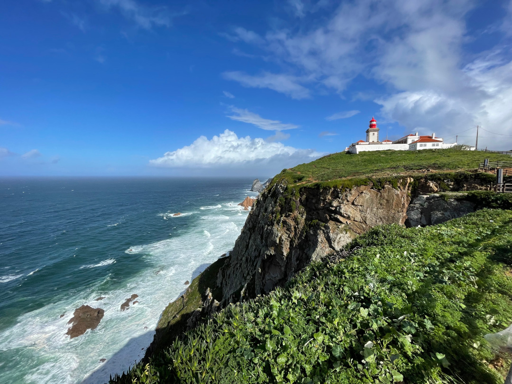
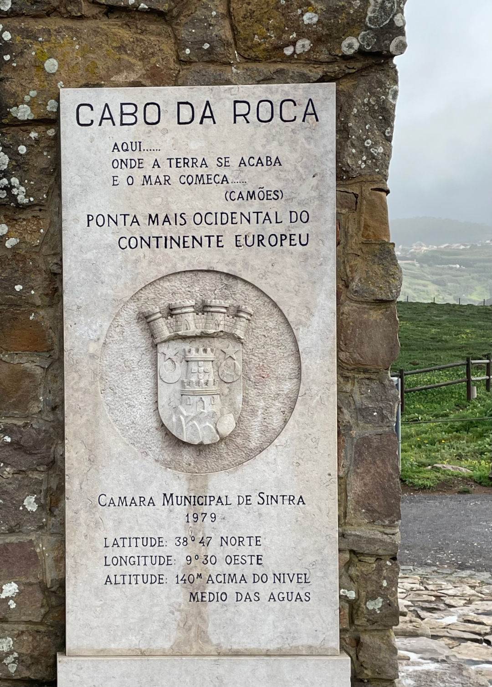
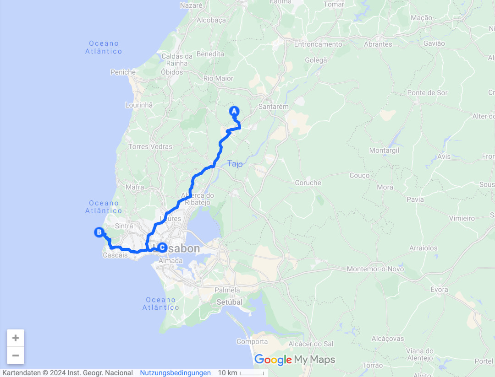
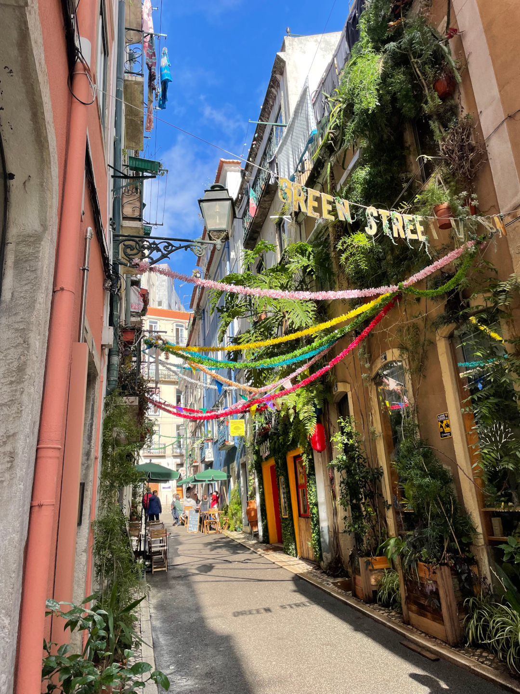
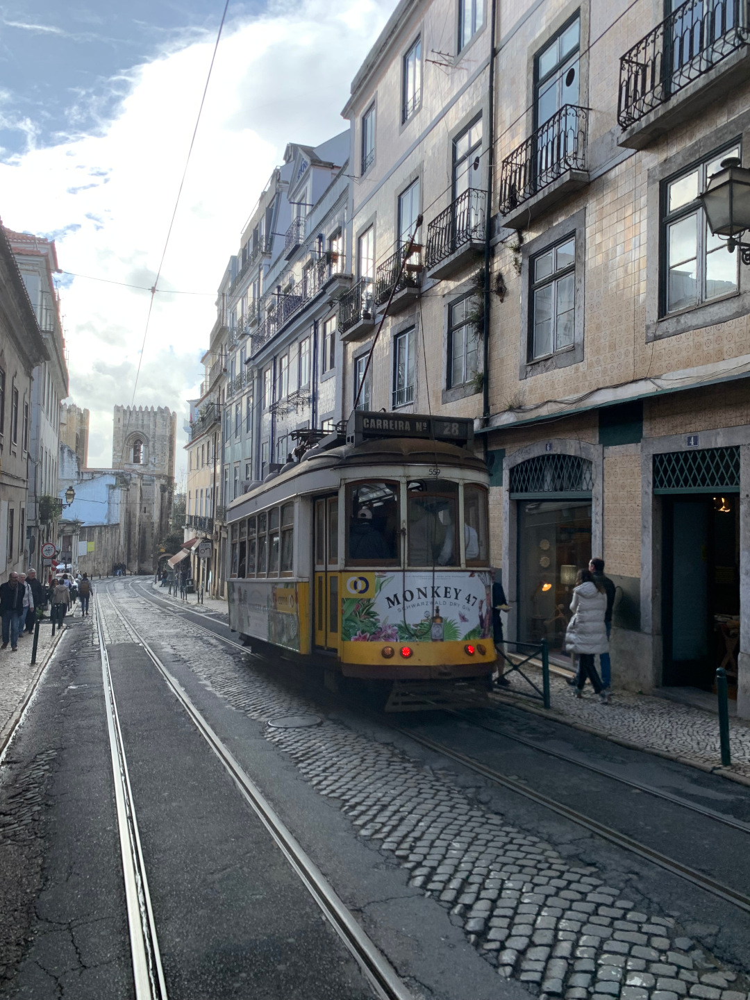
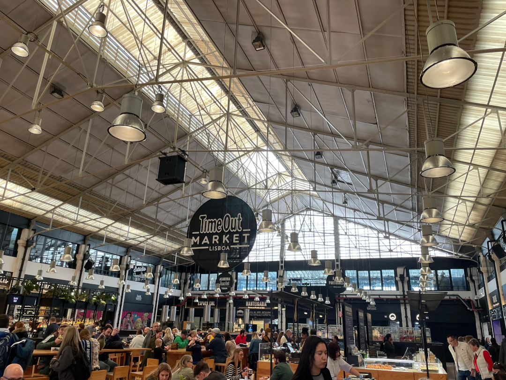
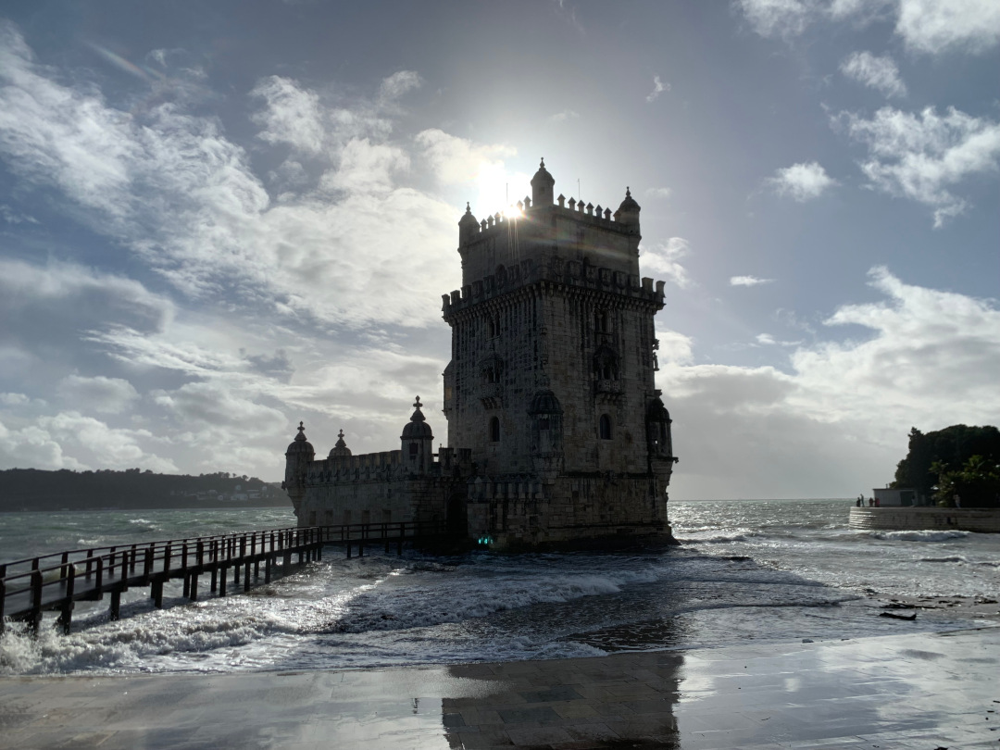
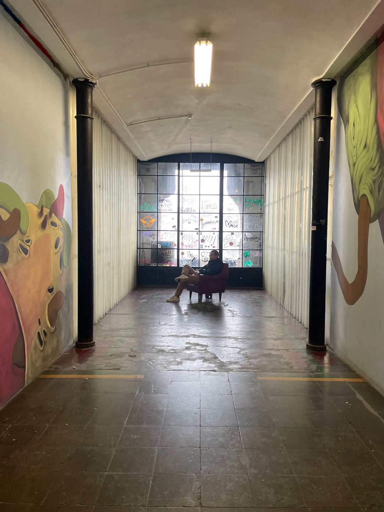

Auf in die Hauptstadt! Auf dem Weg machen wir noch Halt am westlichsten Punkt Kontinentaleuropas, bevor wir pünktlich zum Wochenende in die größte Stadt Portugals fahren.

<!--more-->

🗓️ 9. Februar: Auch als wir an diesem Morgen auf dem kleinen Bauernhof aufwachen, hält der Regen an. Als erstes lernen wir direkt vor dem Bulli die zwei großen Schäferhund-Mischlinge kennen, die aber zum Glück nur ein paar Streicheleinheiten abstauben wollen. Nach einer kleinen Runde mit allen Hunden vorbei an den Hühnern, Gänsen und Ponys machen wir uns wegen des Wetters schnell bereit zur Abfahrt. Unser erstes Ziel für heute ist Cabo da Roca, denn auf dem Kap, nicht weit von der Hauptstadt, befindet sich der westlichste Punkt Kontinentaleuropas. Während wir vor einigen Jahren am nördlichsten Punkt nur Nebel sahen, haben wir heute relativ gute Sicht auf das scheinbar endlose Meer und den kleinen Leuchtturm. Durch die Nähe zu und Busverbindungen von Lissabon, ist selbst in der Nebensaison einiges los. Nach einem kleinen Spaziergang an der Küste entlang machen wir uns dann auch auf den Weg in die Stadt. Der Stadtcampingplatz ist riesig und vergleichsweise grün, aber auch umzingelt von Autobahnen. Trotzdem ist er für uns die beste Möglichkeit, um sicher zu stehen und schnell in die Stadt zu kommen. Weil Strom hier sowieso inklusive ist, heißt es für uns das erste Mal auf dieser Reise ran an die Dose und alles an Bord aufladen, inklusive unserer großen Power Station. Tobi erkämpft sich durch die großen Straßen am frühen Abend doch noch irgendwie zu Fuß einen Weg vom Campingplatz und erkundet etwas die Gegend rund um Belém. 

🗓️ 10. Februar: Heute mischt sich in die Regenschauer endlich wieder etwas Sonne und nach einer großen Henry-Runde durch den nächsten Park fahren wir mit Bolt nach Santos. Von dort laufen wir zur Green Street, Pink Street und dem Timeout-Market, der seinem Namen mit vielen Bars, Restaurants und Sitzmöglichkeiten alle Ehre macht und zum Verweilen einlädt. Neben der hippen Markthalle gibt es aber auch die ganz traditionelle, die über einen kleinen Durchgang zu erreichen ist. Von dort schlendern wir dann durch die Gassen der Altstadt. Als wir erstmal genug vom Laufen haben und auf die Straßenbahn warten, erklärt ein Niederländer uns, dass es Tickets nur an den Metro-Stationen gibt. Also gehen wir noch zur Station Baixa-Chiado und besorgen uns die aufladbaren Tagestickets. Mit einer der traditionellen Straßenbahnen geht es auf der Linie 24 dann weiter durch die teils steilen Gassen Lissabons. Ein kleiner Abstecher führt uns auch mal wieder zum Stadion, dieses Mal von Sporting Lissabon, aber die günstigsten Tickets für das nächste Spiel sind mit knapp 80€ nichts für uns. Deshalb geht es weiter zur Kathedrale und der berühmten Straßenbahnlinie 28, aber leider sagt uns die Polizei, dass keine Bahn mehr kommen wird. In einem angrenzenden Stadtteil findet heute eine Free-Palestine-Demonstration statt und schon während wir zur Kathedrale gelaufen sind, haben wir die verstopften Straßen wahrgenommen. Stattdessen laufen wir dann runter und am Wasser entlang bis zur nächsten Metro-Station. Von da aus fahren wir auf der blauen Linie noch zum Einkaufszentrum Colombo, etwas außerhalb der Stadt, bevor es mit Bolt zurück auf den Campingplatz geht.

🗓️ 11. Februar: Dieser Sonntag ist verregneter als gedacht, vor allem am Vormittag. Den verbringen wir deshalb, so wie die meisten anderen, entspannt im Bulli. Gegen 12 machen wir uns schließlich auf den Weg in Richtung Bushaltestelle, um wieder nach Belém zu fahren. Dort angekommen gucken wir uns angesichts der langen Warteschlangen das Kloster Mosteiro dos Jerónimos und den Torre de Belém von außen an, bevor wir weiter zur LX-Factory fahren. Der alte Industriekomplex direkt am Fuße der berühmten Brücke Ponte 25 de Abril beherbergt heute viele kleine Kunst- und Designläden, einen kleinen Markt, auf dem vor allem Schmuck verkauft wird, und eine Vielzahl von Restaurants. Das Gelände ist sehr verwinkelt und überall gibt es etwas zu entdecken, was es sehr sehenswert macht. Auf unserem Rückweg machen wir noch eine Pause im kleinen Banana Café, das an einer Straßenecke sehr leckere Pastei de Nata (klassische portugiesische Puddingtörtchen aus Blätterteig) und Cookies anbietet. Tobi verbringt den Nachmittag mit zwei Fußballspielen und danach laufen wir zusammen wegen der schlechten Bewertungen des Camping-Restaurants, dem weiten Weg bis zum nächsten Supermarkt und aus Mangel an Alternativen rüber zu Ikea, um dort im Restaurant Köttbullar zu essen – lokal können wir.

