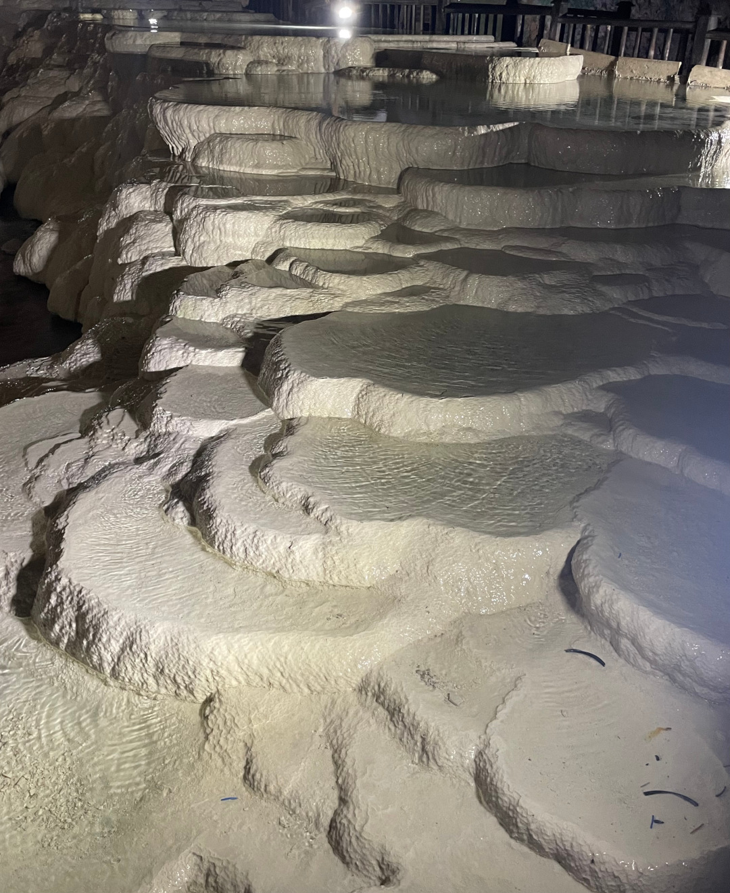
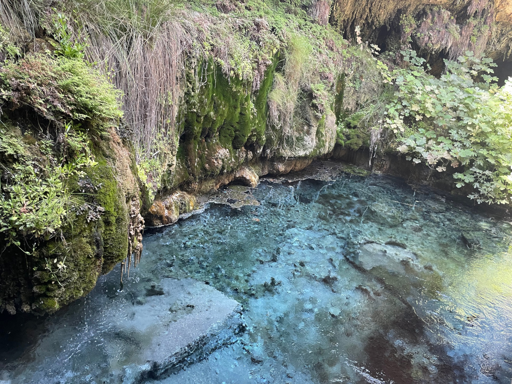
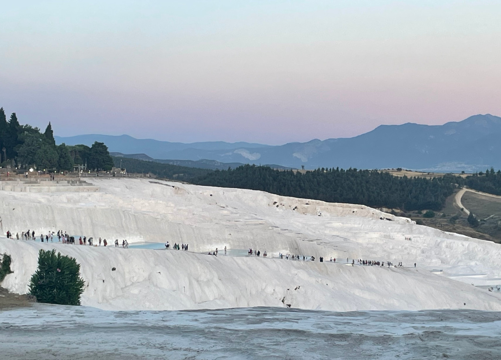
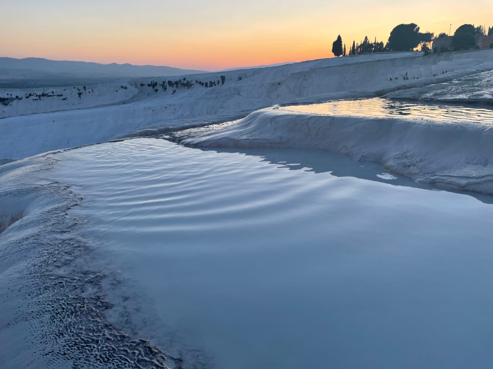
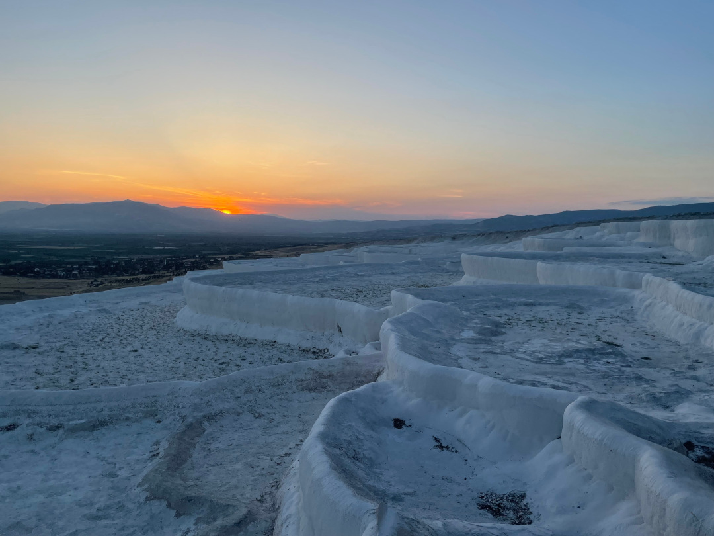
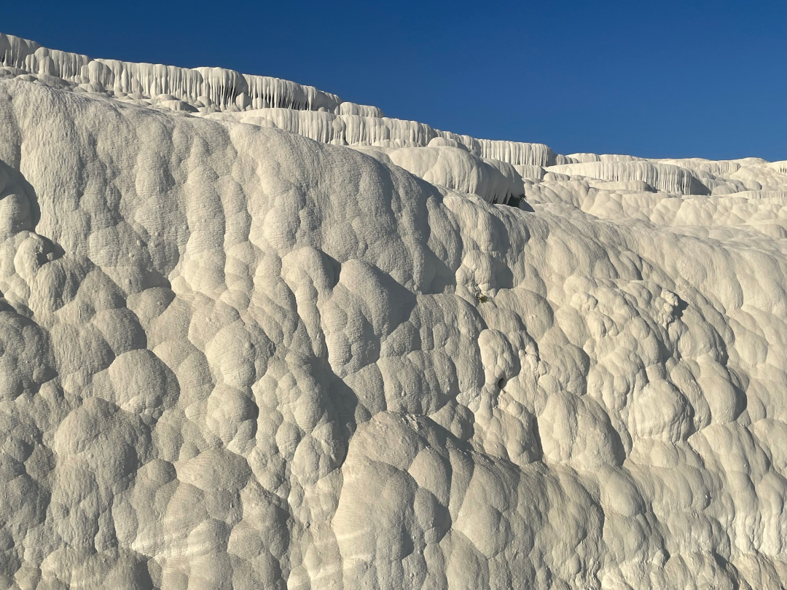
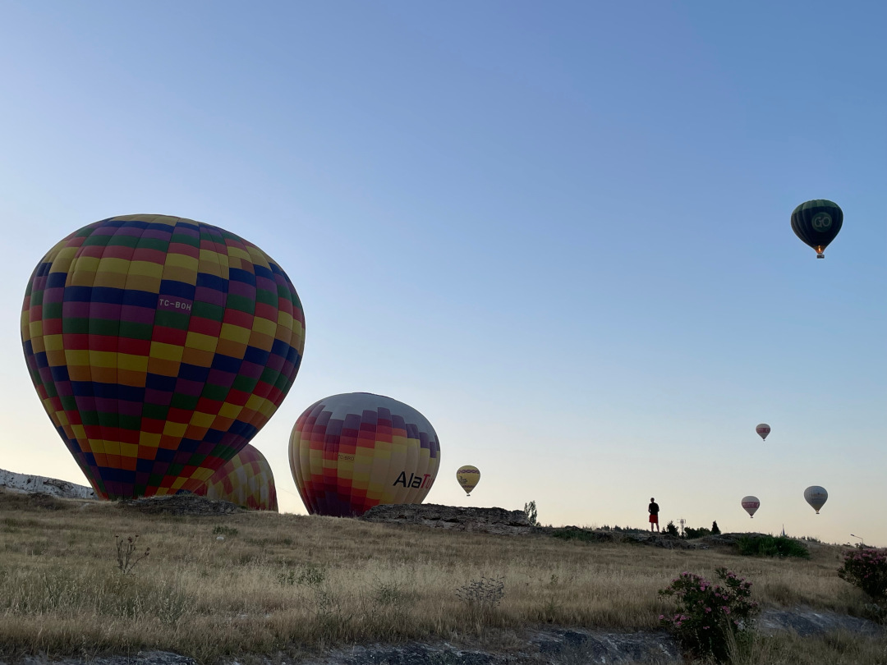
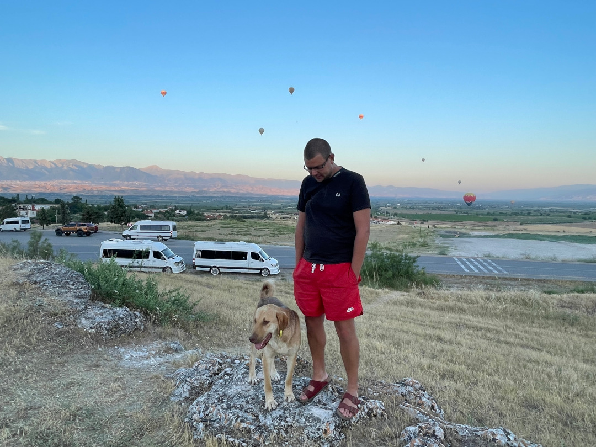
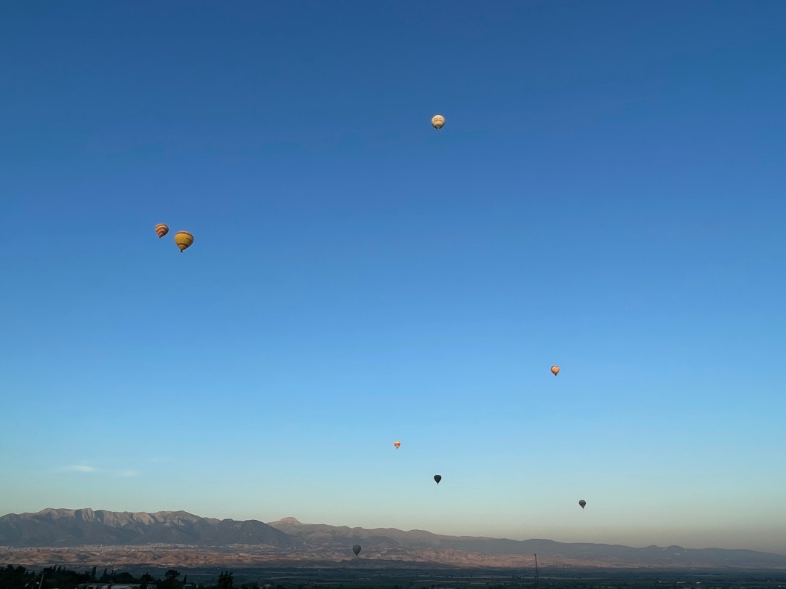
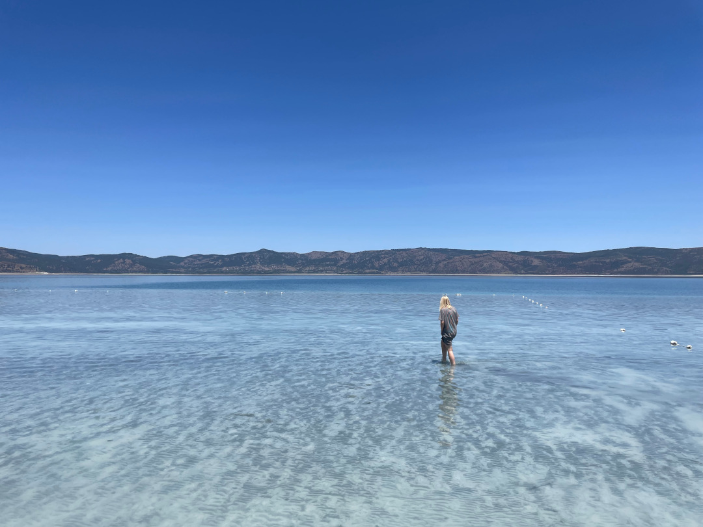

Von der Küste geht es weiter ins Landesinnere zu den weißen Kalksteinterrassen.

<!--more-->

🗓️ 9. Juni: Trotz der Wildschweine rund um den Bulli ist die Nacht ruhig. Wir müssen aber wieder die Kofferraumklappe offenlassen, sonst wird es auch nachts zu warm. Nachdem wir den Bulli startklar gemacht haben, geht’s noch einmal ins Wasser. Danach verabschieden wir uns von den Besitzern und bedanken uns für die tollen Tage. Unser Ziel für heute ist Pamukkale. Hier befinden sich weiße Kalksteinterassen, die wohl eine der berühmtesten Sehenswürdigkeiten in der Türkei sind. Die Fahrt dauert knapp drei Stunden. Auf dem Weg halten wir in der nächsten größeren Stadt Aydin und besorgen Wasser und Frühstück bzw. Mittagessen. Wegen der Temperaturen können wir immer nur das kaufen, was wir auch dann direkt essen. Der Großteil der Lebensmittel wird sonst sehr schnell schlecht. Daher haben wir uns die einfache Devise überlegt, nicht mehr selbst zu kochen. Man bekommt hier ja sowieso an jeder Ecke bestes türkisches Essen. Zum Mittagessen heute gibt es Pide. Unser erster Stopp ist die Kaklik Cave in der Nähe von Pamukkale. In dieser Höhle kann man schon ein paar Kalkterrassen sehen. Ein bisschen wie eine Tropfsteinhöhle nur mit schwefelhaltigem Thermalwasser. So riecht es leider auch überall. Trotzdem ist es einen Besuch wert. Der Eintritt kostet auch nur umgerechnet 1€ pro Person. Es gibt sogar neben der Höhle einen Pool mit Thermalwasser, der war uns aber zu voll. In der Höhle selbst ist nicht viel los. Im Gegensatz zu den Freiluft-Terrassen ist das hier noch ein Geheimtipp. Wir fahren weiter nach Pamukkale (übersetzt Baumwollburg). Hier hat uns der Engländer von unserem ersten Campingplatz in der Türkei den Tipp für eine Übernachtung gegeben. Wir können bei einem Restaurant auf dem Parkplatz übernachten. Natürlich hat auch dieses Restaurant einen riesigen Pool, den wir direkt ausprobieren. Wir stehen direkt gegenüber den weißen Terrassen, die wir uns eigentlich erst morgen angucken wollten. Weil die aber bis 23 Uhr geöffnet haben und mit Sonnenuntergang besonders gut aussehen sollen, ziehen wir es schon auf heute vor. Kurz nach dem Eingang heißt es Schuhe ausziehen, denn ab hier gehts nur barfuß weiter. Der Weg führt berghoch durch den hellen Schlamm und das extra hierher geleitete Wasser. Bis vor zwanzig Jahren lief hier noch das mineralhaltige Thermalwasser den Hügel runter und färbte ihn weiß. 190 v. Chr. bauten die Römer hier die Bäderstadt Hierapolis. Heute kann man sich für viel Geld und mit vielen anderen Menschen die Terrassen angucken, die aber bis auf ein paar künstliche Pools kein Wasser mehr tragen. Wer Pamukkale googelt, sieht übrigens nicht die aktuelle Realität, sondern die von früher. Zu viele Hotels in Pamukkale haben den Grundwasserspiegel sinken lassen, so dass es hier kaum noch Wasser gibt. In den künstlichen Pools darf man sogar schwimmen. Wenn man es durch die im Schweiß der anderen badenden Menschenmassen geschafft hat und man ein paar hundert Meter weiter läuft, wird man aber sehr belohnt. Auf der Rückseite des Hangs eröffnet sich ein super Blick auf weitere Kalksteinterrassen, die untergehende Sonne und die Berge. Bis hierher laufen nur noch sehr wenige Menschen und hier kann man das ursprüngliche weiß der Terrassen auch viel besser erkennen als im inzwischen eher grauen, vielbesuchten Teil. Nachdem die Sonne untergegangen ist, machen wir uns wieder auf den Weg runter. Wir besorgen uns noch Abendessen und können nach Sonnenuntergang den Bulli endlich wieder gut auslüften lassen.

🗓️ 10. Juni: Unser Wecker klingelt schon um 05:15 Uhr, weil hier in dem Ort zum Sonnenaufgang Heißluftballons starten. Den Tipp hatte uns gestern noch der Restaurantbesitzer gegeben. Wir sind zum Glück gerade rechtzeitig wach, bevor der erste Ballon aufsteigt. Unser Platz am Restaurant am Ortsende ist dafür perfekt. Heute starten 24 Ballons direkt neben uns. Mit dem Sonnenaufgang und den Bergen im Hintergrund sieht das sehr cool aus. Es sind aber eher weniger Besucher da, die nur Fotos machen. Die meisten fahren auch wirklich mit den Heißluftballons mit. Darauf haben wir aber wirklich keine Lust. Der Start sieht teilweise echt abenteuerlich aus. Der erste Ballon ist schon wieder gelandet, da ist der letzte noch nicht mal gestartet. Wir gehen zurück zum Bulli und versuchen noch etwas zu schlafen, was aber bei den Temperaturen nach Sonnenaufgang nur schwierig möglich ist. Wir springen nochmal in den riesigen Pool, bevor wir uns bereit machen zur Weiterfahrt. Die erste Fahrt führt uns zum nächsten Migros, wo wir unsere Wasservorräte auffüllen. In den meisten Migros kann man seine Tiefkühlpizza, die man vor Ort kauft auch direkt aufbacken lassen und dann im Karton mitnehmen. Das nutzen wir natürlich aus und kommen so auch bei 40 Grad ohne Kühlschrank an ein gutes Frühstück oder eher Mittagessen. Danach fahren wir weiter zum Salda Gölü, einem türkisblauen See mit sehr hohem Magnesiumgehalt. Deshalb ist der „Strand“ drumherum auch sehr weiß. Es wird mit den Malediven der Türkei geworben. Schwimmen ist offiziell verboten, aber man kann bis zu den Knien bis zu einer Absperrung reingehen. Trotzdem sieht man einige auch schwimmen. Wir machen hier eine Mittagspause und genießen die Ruhe. Normalerweise ist es hier sehr voll, aber auf einem Montagmittag geht es heute ganz gut. Der letzte Stopp für heute ist der Saklikent Kanyon Gorge, durch den wir morgen früh laufen möchten. Tagsüber und abends ist es zu voll und zu heiß. Wir haben einen Campingplatz direkt am Canyon gefunden, aber als wir dort ankommen, sieht es sehr verlassen aus. In der Park4night App steht die Handynummer vom Betreiber, der dann meint, alles wäre offen und er kommt sofort. Fünf Minuten später kommt er mit dem Moped und seinem Kumpel, zeigt uns alles und fährt wieder weg. Es gibt vorher aber sogar Eis für uns. Er meint, dass wir auch die Waschmaschine benutzen können. Gesagt getan. Komischerweise geht etwas später der gesamte Strom auf dem Platz nicht mehr. Also rufen wir ihn erneut an. Dieses Mal kommt er mit dem Kumpel und einem Auto angefahren, aber auch er kann nur feststellen, dass der Strom nicht mehr geht. Einige Telefonate von ihm später, meint er, dass wir besser zu einem anderen Campingplatz fahren sollen. Das kann ein paar Tage dauern. Leider liegt noch unsere Wäsche in der Waschmaschine und die lässt sich ohne Strom nicht öffnen. Weil es inzwischen aber schon dunkel ist und wir schlafen wollen, fahren wir weiter. Der andere Campingplatz ist nur fünf Minuten entfernt, auch am Fluss und hat Strom. Der ältere Herr vor Ort zeigt uns alles und wir sind froh gewechselt zu haben. Wir sind hier zwar auch die einzigen Gäste, aber es wirkt belebter und sauberer. Wir können sogar noch in den Pool springen und dann ab ins Bett. Um die Wäsche kümmern wir uns morgen.

