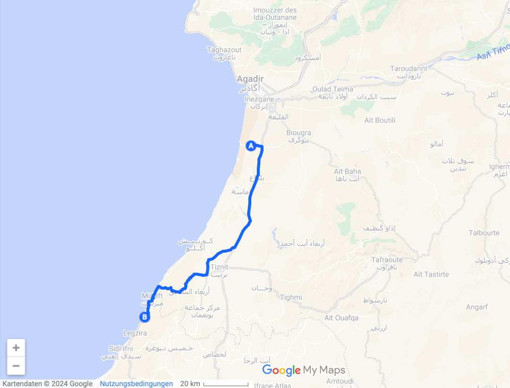

Vom Paradise Valley fahren wir in die letzte wirkliche Großstadt im Süden Marokkos und noch etwas weiter die Küste entlang.

<!--more-->

🗓️ 10. März: Als wir aufwachen, sind wir erstmal sehr irritiert. Unsere Handys zeigen eine Stunde eher an, als wir uns fühlen und die anderen Uhren zeigen. Eigentlich hatte Marokko die Sommer- und Winterzeiten abgeschafft. Nach kurzer Recherche wird klar, dass das mit dem heute bzw. faktisch morgen beginnenden Ramadan zusammenhängt. Für diesen Monat wird die Uhr eine Stunde vorgestellt, um abends eher nach Sonnenuntergang etwas essen zu dürfen. So haben wir heute eine Stunde geschenkt bekommen. Wir machen uns also rechtzeitig auf den Weg nach Agadir. Wieder suchen wir uns ein Parkhaus bzw. Tiefgarage raus, um den Bulli und Henry sicher und kühl abzustellen. Das Parkhaus ist noch nicht ganz fertig und gehört zu einem neu zu errichtenden Sportpark. Wir denken erst, dass das Parkhaus geschlossen ist, überall leuchten rote Kreuze und kein Auto steht hier. Nach etwas suchen finden wir den Parkwächter in seinem Häuschen, der aber sagt, dass alles geöffnet hat und gratis ist. Erst trauen wir dem Braten nicht so ganz, denken aber dass der Bulli hier sicherer steht als woanders. Um es vorwegzunehmen, alles war sicher. Wir waren den ganzen Tag das einzige Auto in einem Parkhaus mit über 600 Parkplätzen. Für die 1:1 Bewachung bekommt der Wärter auch etwas Trinkgeld. Der eigentliche Grund für den Besuch von Agadir war nicht primär die Stadt, sondern ein Fußballspiel. Wegen der geschenkten Stunde sind wir sehr früh in der Stadt und wir nutzen die Zeit, um sie uns anzugucken. Agadir ist wohl die touristischste Stadt in Marokko. Riesige Hotelanlagen und Kreuzfahrttouristen. Die Stadt hat wenig mit Marokko zu tun, zumindest im Zentrum und an der Strandpromenade. Wenn man dann mit dem Taxi zum Stadion etwas rausfährt, sieht es schon anders aus. Heute spielt HUS Agadir gegen RSB Berkane. Auf dem Weg dorthin sehen wir schon viele rot gekleidete Fans. Das nimmt schon mal die Sorge, dass es ohne Zuschauer ausgetragen wird. Gespielt wird im Stade Adrar, dem Stadion der Nationalmannschaft Marokkos. Geplant war das Stadion für eine mögliche WM 2010, dann zog Marokko die Bewerbung aber zurück. Das Stadion liegt etwas außerhalb auf einem Hügel. Unser Taxifahrer bringt uns direkt vor den Eingang, der Ordner bringt uns dann die Tickets noch ans Taxi. Dafür sind die Tickets aber relativ teuer (9,50€). Im Stadion sind ca. 3.000 Leute, was bei einem Fassungsvermögen von ungefähr 50.000 natürlich sehr verloren aussieht. Im Heimblock sind ca. 2.500 Leute und alle in Rot gekleidet. Die Stimmung ist teilweise sehr gut, manchmal aber auch ausbaufähig. Die Stadien in Marokko sind meistens nicht vor der 20. Minute gefüllt. Zu Spielbeginn sind nicht mal 1/3 der Zuschauer da. Das Highlight des Tages ist wohl der Gästeblock. Berkane liegt knapp 1.100 km von Agadir entfernt an der algerischen Grenze, dennoch sind ein paar Auswärtsfans mit an Bord. Sie werden mit einem 2:0 Auswärtssieg belohnt. Nachdem Spiel wollen wir fix wieder ein Taxi besorgen und gehen dazu durch den Park zur Hauptstraße. Hinter uns hören wir jemanden pfeifen und sehen, wie ein Polizist wild winkt. Wir bleiben besser mal stehen und warten auf ihn. Der Polizist meint, es wäre zu gefährlich für uns durch den Park zu laufen, weil dort viele Diebe sind. Der Park bestand aus einem Acker, wo man jedes Ende sehen konnte, auch die Hauptstraße war in Sichtweite. Jeden möglichen Dieb hätten wir zehn Minuten vor der Tat schon längst gesehen. Als der Polizist dann immer wieder betonte er ist von der marokkanischen Polizei und wir können ihm vertrauen, bewirkte das genau das Gegenteil. Wir dankten ihm und sagten, dass wir alleine ein Taxi suchen. Wahrscheinlich wollte er nur die Provision vom Taxifahrer erhalten. Wir finden quasi sofort ein Taxi, das uns nach kurzer Verhandlung günstig zur Parkgarage bringt. Bevor wir Agadir verlassen, wollen wir noch einmal in einem großen Supermarkt einkaufen. Das das an dem Tag vor Ramadan-Beginn keine gute Idee ist, merken wir relativ schnell. Überall ist es übertrieben voll. Jeder will für das Fastenbrechen vorbereitet sein. Wir kämpfen uns durch den Supermarkt und durch das Anstehen an der Kasse und fahren dann erleichtert zum Campingplatz für diese Nacht. Der liegt etwas südlich von Agadir. Durch die Uhrumstellung kommen wir erst im Dunkeln an. Zum Glück konnten wir vor dem Supermarkt noch Pizza besorgen, so dass wir nicht mehr kochen müssen.

🗓️ 11. März: Die Nacht war entspannt und wir gucken uns morgens den Stellplatz und die Umgebung erstmal im Hellen an. Wir besorgen noch etwas Brot, bezahlen und machen uns auf den Weg nach Legzira, etwa 200 km die Küste in Richtung Süden. Die Fahrt ist entspannt, auch wenn wir mittlerweile in der Region angekommen sind, wo es keine Autobahnen mehr gibt. Die Straße führt immer entlang der Küste. Wir erreichen Legzira und steuern direkt einen Parkplatz an. Natürlich kommt direkt wieder jemand in Warnweste und kassiert die Parkgebühr ab. Wir könnten auch über Nacht bleiben, wird uns direkt mitgeteilt, wir wollen aber lieber auf einem richtigen Stellplatz stehen. Zum Strand in Legzira geht es dann bergab, weil das Dorf auf den Klippen am Meer liegt. Hier in Legzira gibt es sehr coole Felsformationen, die wir uns angucken wollen. Zu unserer Freude ist sehr wenig los. Die Ausnahme bilden ein paar Segelflieger. Der Strand ist leider sehr steinig, so dass man nicht richtig schwimmen kann. Für ein paar Fotos wagen wir uns aber doch unter den Felsen. Bei einigen Wellen muss man echt auf die Kamera aufpassen, aber alles geht gut. Henry wird auch das ein oder andere Mal von einer Welle überrascht. So ganz so wasserscheu ist er mittlerweile aber auch nicht mehr. Danach geht es wieder bergauf zum Auto. Auf dem Hinweg haben wir einen guten Stellplatz für die Nacht gesehen. Eigentlich war ein anderer Campingplatz geplant, wir ändern spontan die Pläne und steuern diesen Platz an. Der Betreiber spricht sogar Deutsch und der Platz hat einen direkten Abstieg zum Strand. Die letzte Runde des Tages führt uns also zum Sonnenuntergang unten ans Meer.

