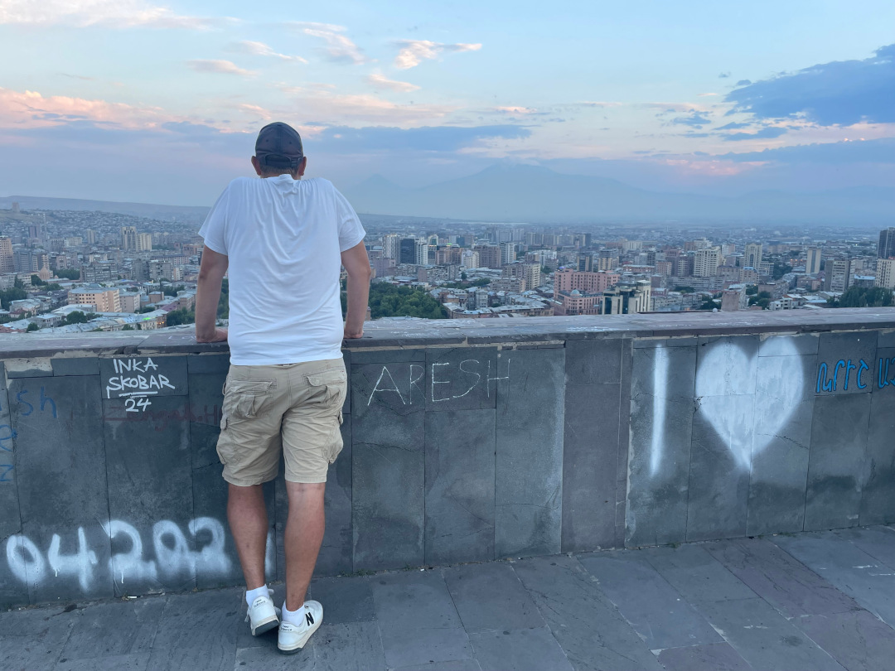

Als letzten Stopp in Armenien fahren wir in die Hauptstadt.

<!--more-->

🗓️ 10. Juli: Wir haben es heute Morgen nicht ganz so eilig und gehen erstmal eine große Runde mit Henry und den beiden Campingplatz-Hunden, die im Zweifel andere Hunde vertreiben könnten. So können wir etwas sorgloser gehen. Danach machen wir uns abfahrbereit und bezahlen. Auf dem Weg nach Jerewan halten wir zum letzten Mal an einem Kloster. Das Kloster Chor Virap steht direkt vor dem Ararat und sieht dadurch sehr spektakulär aus. Wir gehen auch kurz rein und besichtigen das Kloster von innen. Den besten Blick hat man aber aus ein bis zwei Kilometer Entfernung von den Feldern. Dann sieht man das Kloster direkt vor dem Ararat, der ja schon in der Türkei liegt. Dadurch ist dieses Kloster das Nationalsymbol von Armenien und sogar Papst Franziskus war schon mal hier. Das ganze Drumherum ist sehr touristisch, mehr als an den anderen Klöstern, aber das liegt wohl an der Nähe zu Jerewan. Es dauert nicht lange und wir kommen in den Stadtverkehr von Jerewan. Bisher konnte man in Armenien eigentlich halbwegs entspannt Auto fahren, aber in der Hauptstadt ist es echt chaotisch. Spuren gibt es so gut wie keine und jeder möchte der schnellste sein. Dazu ist noch super viel Verkehr. Wie schon mal geschrieben gibt es Infrastruktur quasi nur fürs Auto. Das merken wir auch später als Fußgänger, obwohl es sogar eine Ubahn gibt. Aber nur eine Linie. Wir finden einen Schotter-Parkplatz direkt am Hotel, der offensichtlich kostenlos ist. Natürlich sitzt dort aber jemand und verlangt 2.000 AMD (5€) für zwei Tage parken. Die Kommunikation klappt nur schwierig und wir wollen den Preis nicht bezahlen. Eine Frau, die gerade hier vorbeiläuft kann aber auf Englisch übersetzen. Auf einmal werden aus dem Preis nur noch 1.000 AMD inklusive Autowäsche. Im Endeffekt verkauft er auch nur die Autowäsche und dachte sich er könnte bei uns noch etwas Deutschland-Bonus draufschlagen. Im Hotel erkunden wir erst Pool und Sauna (bei 35 Grad draußen), bevor wir uns Jerewan angucken. Die erste Runde führt uns mit Henry in den nahegelegenen Park. Wir sehen nur wenig Straßenhunde, die auch schon von selber abhauen, wenn wir näherkommen. Im Park gibt es sogar eingezäunte Auslaufflächen für Hunde. Hier ist es deutlich entspannter mit Henry zu gehen als auf dem Land. Trotz der tausenden Autos. Danach geht es ohne Henry weiter. Wir wollen die Ubahn testen und zur Cascade fahren. Als wir endlich den Eingang zur Ubahn gefunden haben (versteckt unter einem Kaufhaus), überraschen uns die Rolltreppe und die Ubahn mit ihrem Tempo. Bei der Rolltreppe muss man echt aufpassen, dass man nicht hinfällt und rechtzeitig den Absprung schafft. Die Ubahn fährt super schnell und holperig. Dafür sind wir aber nach vier Minuten da, wo wir sonst nach 45 Minuten laufen wären. Die Cascade an sich ist ein Treppenkomplex mit 572 Stufen und Aussicht über Jerewan. Erst recht bei Sonnenuntergang ist es hier super schön und man kann über die ganze Stadt gucken. Natürlich laufen wir einmal nach ganz oben. Im Hintergrund sieht man, wie könnte es in Armenien anders sein, den Ararat. Ganz oben sehen wir noch eine Hundemama mit ihren sieben Welpen. Nach dem Sportprogramm schlendern wir noch etwas durch die Stadt und suchen was zu essen. Für einen Mittwochabend um 21 Uhr ist es überall super voll. Auch viele Kinder sind unterwegs. Vor der Nationaloper wird ein improvisierter Autoscooter aufgebaut und die Kinder fahren mit beleuchteten Autos, Krankenwagen, Feuerwehrautos und Baggern vor der Oper entlang, während drinnen gerade ein Stück aufgeführt wird. Verglichen mit einer deutschen Innenstadt abends und unter Woche ist quasi ganz Jerewan auf den Beinen. Kulinarisch können wir endlich mal wieder aus dem vollen Schöpfen und quasi alles essen was wir wollen. Nach dem Abendessen geht’s zurück zum Hotel und nach einer letzten Henryrunde ab ins Bett.

🗓️ 11. Juli: Die Nacht ist dank Klimaanlage erträglich. Im Bulli wäre es wohl wieder sehr warm geworden. Wir gehen dieselbe Runde mit Henry wie gestern und kommen schon mit den ersten Hundebesitzern ins Gespräch. Nach dem Frühstück machen wir uns nochmal auf in die Stadt. Wir gehen zum Vernissage Markt, wo hauptsächlich handwerkliche Dinge angeboten werden. Es ist aber viel zu heiß, um sich ernsthaft interessante Dinge anzugucken. Bei einigen Teppichen kommen wir kurz ins Überlegen, aber schlagen uns die Idee auch wieder aus dem Kopf. Vom Markt aus laufen wir das Stadtzentrum weiter nach Norden nach Kond, der Altstadt bzw. dem ältesten Stadtteil Jerewans. Hier gibt es noch sehr enge Gasse und kleine und alte Häuser, teilweise aber auch schon sehr kaputt. Es passt überhaupt nicht zur restlichen Stadt. Es ist quasi eine eigene Stadt in der Stadt. An anderer Stelle ist Jerewan echt modern. Es gibt die Ubahn, Shopping Malls und neue Straßenunterführungen mit modernen Supermärkten unter der Straße, wo man übrigens auch deutsche Spezi kaufen kann. Teilweise ist es aber auch traditionell armenisch, wie die Markthalle. Hier gibt es bei den Händlern quasi alles zu kaufen. Obst, Gemüse, Gewürze, Fisch, Fleisch, Alkohol, Kleidung, Geschirr und Staubsauger. So riecht es teilweise auch. Im großen Carrefour gegenüber besorgen wir uns Mittagessen und gehen zurück zum Hotel. Heute Abend steht noch Fußball auf der Agenda und vorher müssen wir noch etwas die Füße hochlegen und mit Henry in den Park. Gegen halb sieben fahren wir dann nach Abovyan einer kleinen Stadt vor Jerewan. Hier spielt heute FC Noah Jerewan gegen SK Skendija aus Mazedonien. Wieso die so weit außerhalb der Stadt spielen weiß wohl niemand. Mit dem Taxi brauchen wir 50 Minuten für 18 km, bezahlen aber nur knapp 10 €. Der Eintritt ins Stadion ist heute praktischerweise frei und das bei einem Spiel zur Qualifikation zur Conference League. So geht aber der Plan des Vereins wenigstens auf, das Stadion voll zu machen. Es sind sogar mehr Leute im Stadion drin, als es Sitzplätze gibt. Das fällt den Ordner dann auch bald auf und das Stadion wird von innen einfach abgeschlossen. Der Rest vom Spiel ist eher langweilig. Es sind sehr viele Kinder im Stadion, so dass jeder Angriff an ein Konzert erinnert, so laut wird rumgekreischt. Aus Mazedonien kommen leider keine Gästefans mit. Wenigstens fiel in der 80. Minute das erste Tor. Weil es für Jerewan fällt, hört es sich wieder an wie bei einem Konzert. In der 90. fällt dann das 2:0 und das Spiel ist endlich zu Ende. Mit dem Taxi geht es zurück, diesmal in nur 30 Minuten und für nur knapp 6 €. Alles in allem kein schönes Spiel, aber es wurden die Länderpunkte 32 und 15 gefeiert und das bei freiem Eintritt. Viele wünschen sich eine Saison Conference League mit Borussia Dortmund, um exotische Ziele zu sehen. Aber bitte nicht beim FC Noah Jerewan. Zurück am Hotel geht es nach der Henryrunde auch fix ins Bett.

