Von Peleponnes geht es in die Hauptstadt Griechenlands.

<!--more-->

🗓️ 10. August: Der Wecker klingelt um halb acht und wir drehen mit Henry eine letzte Runde durch die Oliven- und Zitronenfelder. Weil seine nächsten Runden dann durch die Großstadt führen, gehen wir etwas länger mit ihm. Nach der letzten Runde im Pool machen wir uns startklar, um erstmal nach Korinth zu fahren. Korinth liegt direkt an der Landenge zwischen Peleponnes und dem Festland und ist bekannt für seinen Kanal. Die Schiffe können hier dem Umweg um Peleponnes (325 km) entgehen und dadurch Zeit sparen. Der Kanal wurde 1893 eröffnet und 84 Meter tief in die Felsen eingearbeitet. Viel Schifffahrt gibt es hier aber heute kaum noch. Es ist auf jeden Fall ein besonderer Anblick, vor allem, wenn man durch die Felsmauern hindurch auf der anderen Seite das Meer sehen kann. Als wir gerade da sind, sehen wir auch eine Bungee-Jumping Springerin. Hanna guckt noch zu, ich verzichte lieber drauf. Danach machen wir uns auf den Weg zum Flughafen, um Steffen abzuholen, der die Ehre hat unser letzter Besuch auf unserer Reise zu sein. Pünktlich wie immer sammeln wir ihn ein und fahren nach Athen. Hier haben wir für die nächsten zwei Tage eine Unterkunft. Campen in Athen ist etwas schwierig, erst recht zu dritt. Dank Lidl sind wir für die nächsten Tage auch gut ausgestattet. Unsere Wohnung liegt etwas im Süden der Stadt und überhaupt nicht in einem Touristenviertel. Der erste Weg führt uns zu einem griechischen Grill, wo es Essen und Bier gibt. Danach geht es mit der Metro zum Aussichtspunkt auf dem Philipappou Hügel, wo wir passend zum Sonnenuntergang den besten Blick auf die Stadt und die Akropolis haben. Der Aufstieg ist auch abends noch anstrengend, aber es lohnt sich. Oben angekommen sind auch noch einige andere aber einen guten Blick hat man quasi von überall. Auf dem Rückweg laufen wir noch etwas durch Plaka (Altstadt), verlagern dann aber die weitere Aktivität in unser günstigeres Nicht-Touristen-Viertel. Nach einer Partie Schach geht es ab ins Bett.

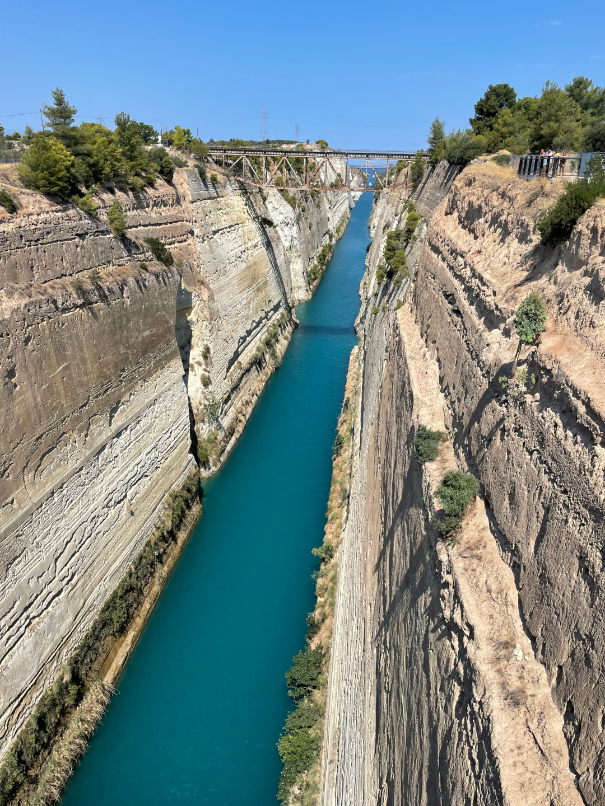

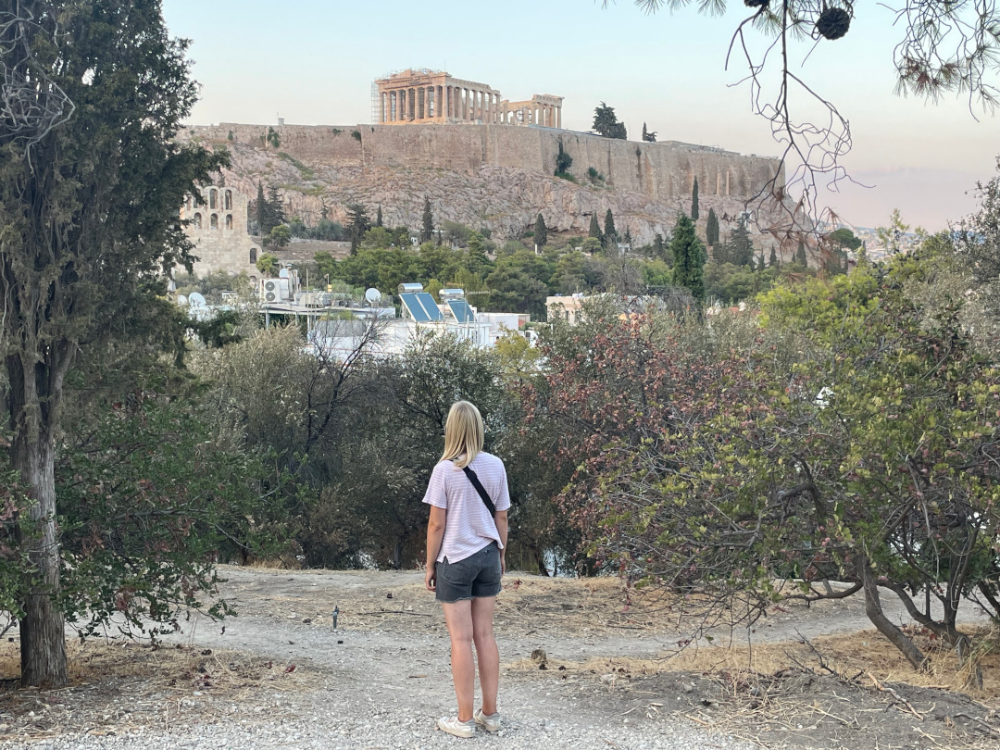

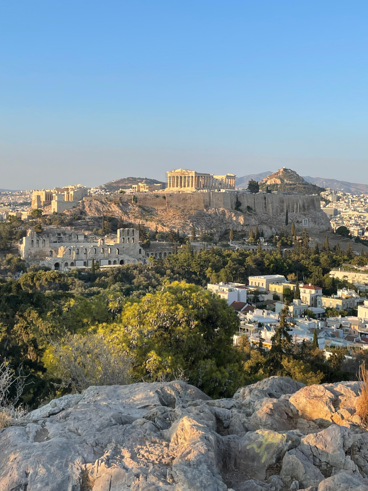

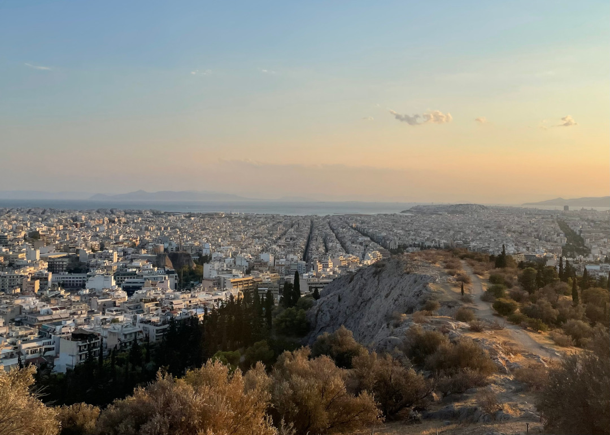

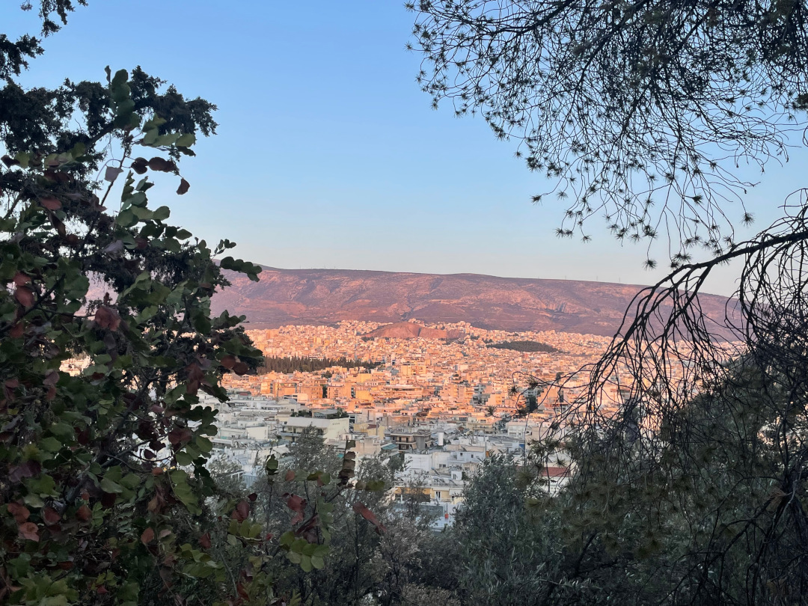

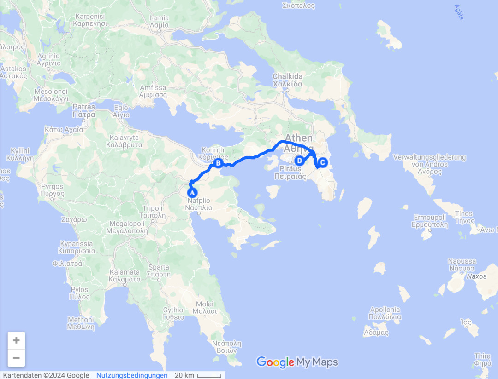

🗓️ 11. August: Eine Nacht mit Klimaanlage ist schon erholsamer als im Bulli. Das nutzen wir gut aus und lassen den Tag entspannt starten. Mit Henry geht es auf einen kleineren Aussichtshügel bei uns in der Nähe, so dass er auch einmal die Akropolis gesehen hat, interessiert ihn aber weniger, weil es so warm ist. Danach gibt’s Frühstück und wir planen den restlichen Tag. Nach dem Frühstück fahren wir zum Monastiraki Flohmarkt und schlendern durch die Gassen. Überall gibt es noch Relikte aus den antiken Zeiten. Mitten dadurch fährt dann die Straßenbahn, ein komisches Bild. Hier ist es jetzt auch viel touristischer. Im Gegensatz zu unserem Viertel schon eine Veränderung. Trotzdem kann man hier einiges sehen und es lohnt sich. Zur Mittagspause geht es zurück zur Wohnung, um das Handball Olympia-Finale zu gucken. Im Endeffekt hätten wir für das Spiel auch nicht die Innenstadt verlassen müssen, weil es nicht gerade spannend ist. Für 18 Uhr haben wir Tickets für den Besuch der Akropolis, übrigens der siebtmeistbesuchten Sehenswürdigkeit der Welt. Seit einiger Zeit dürfen nur noch maximal 20.000 Personen die Akropolis besuchen und man muss sich an seinen Zeitslot halten. Ist zwar etwas umständlich, aber vor Ort dann sehr organisiert und man kommt schnell rein. Schon auf dem Weg zur Akropolis färbt sich der Himmel unnormal grau/orange. Kurz dachten wir, dass es gleich regnet, aber es ist ein Waldbrand nördlich von Athen ausgebrochen ist. Der Himmel ist teilweise echt dunkel, aber das Leben geht hier erstmal ganz normal weiter. Trotz des Personenlimits ist es an der Akropolis dann dennoch sehr voll. Der Aufstieg ist wie gestern auch anstrengend, aber man weiß ja wofür man es macht. Steffen ist deutlich mehr interessiert als wir und kennt sich unerwartet gut aus, also haben wir unseren eigenen Guide dabei. Ich hätte mich auch mit der Aussicht von gestern zufrieden gestellt, aber so war ich wenigstens einmal da. Nach dem ganzen Stress geht es durch das „Weiße-Viertel“, wo alle Häuser weiß gestrichen sind und aussehen wie auf den griechischen Inseln und durch Plaka in eine Taverne auf ein Bier. Mit unserem Nebentisch (Amerikaner, der aber aussieht wie Australier) gibt es noch ein kleines Pläuschchen und die Aufbesserung seiner Deutsch-Kenntnisse. Gegen Mitternacht geht es zurück und nach einer Henryrunde geht es ins Bett unter die heilige Klimaanlage.

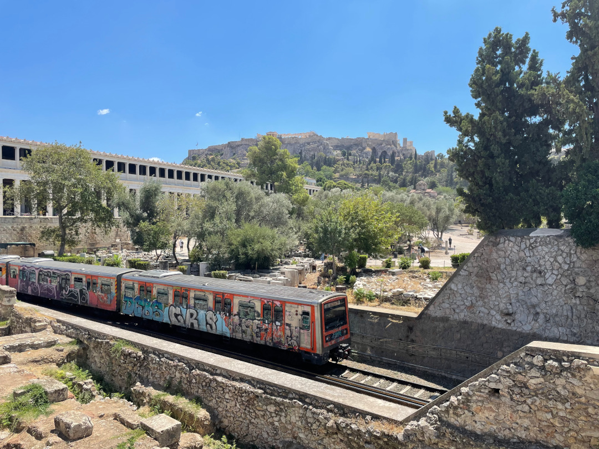

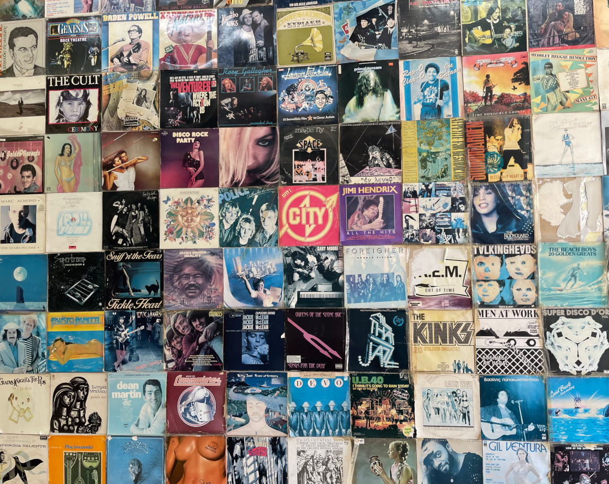

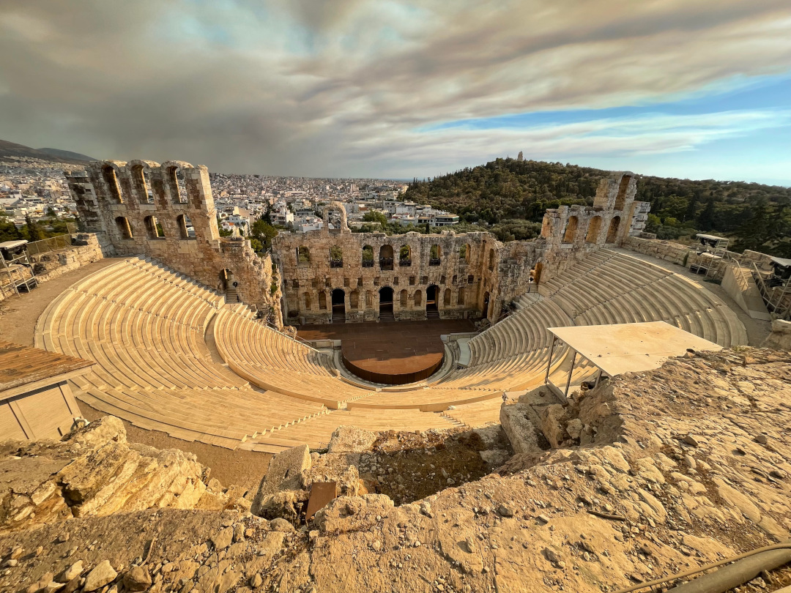

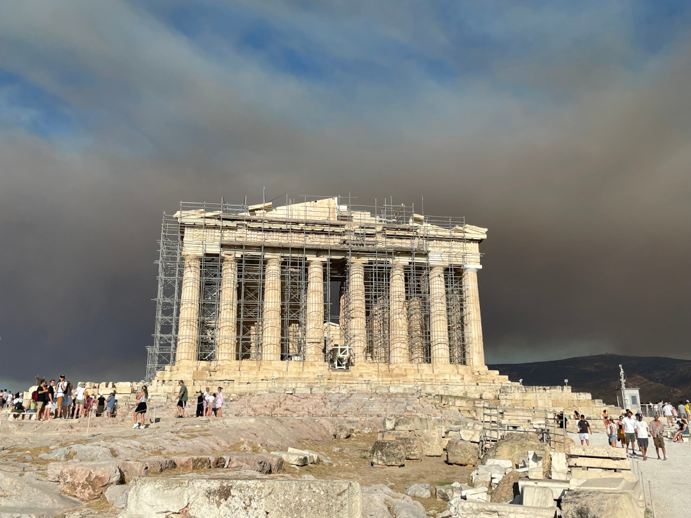

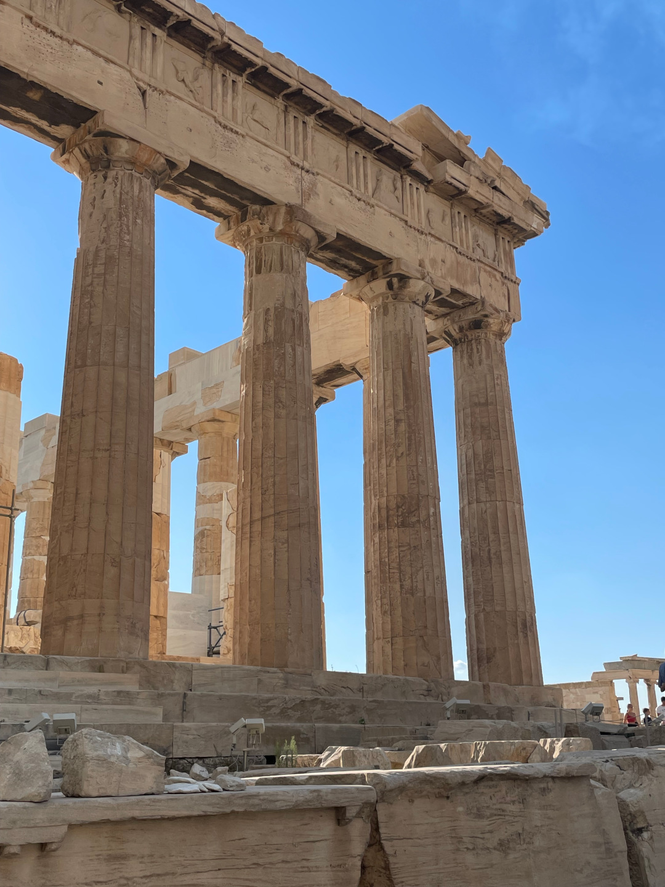

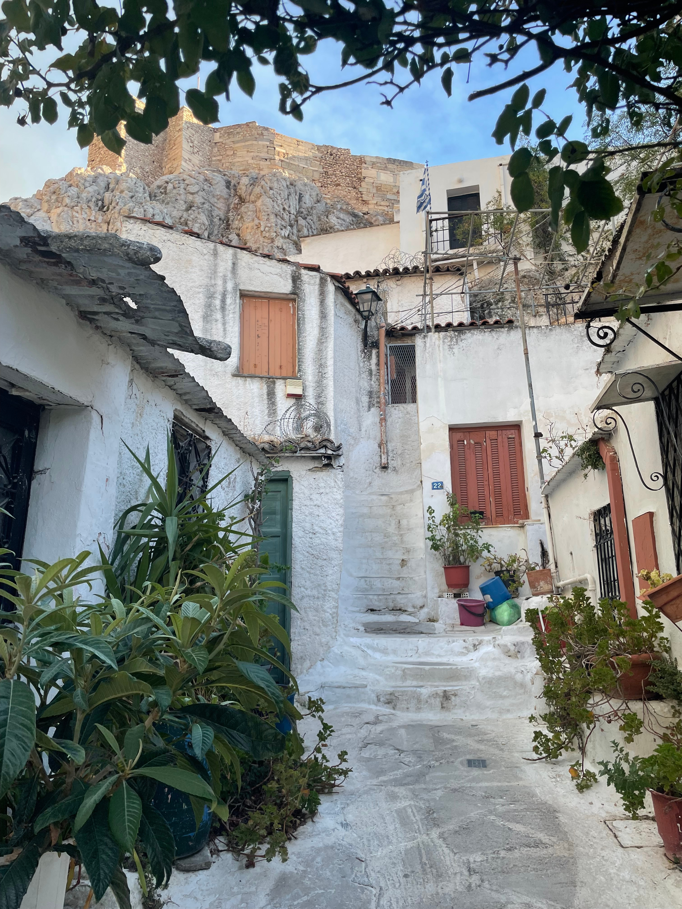

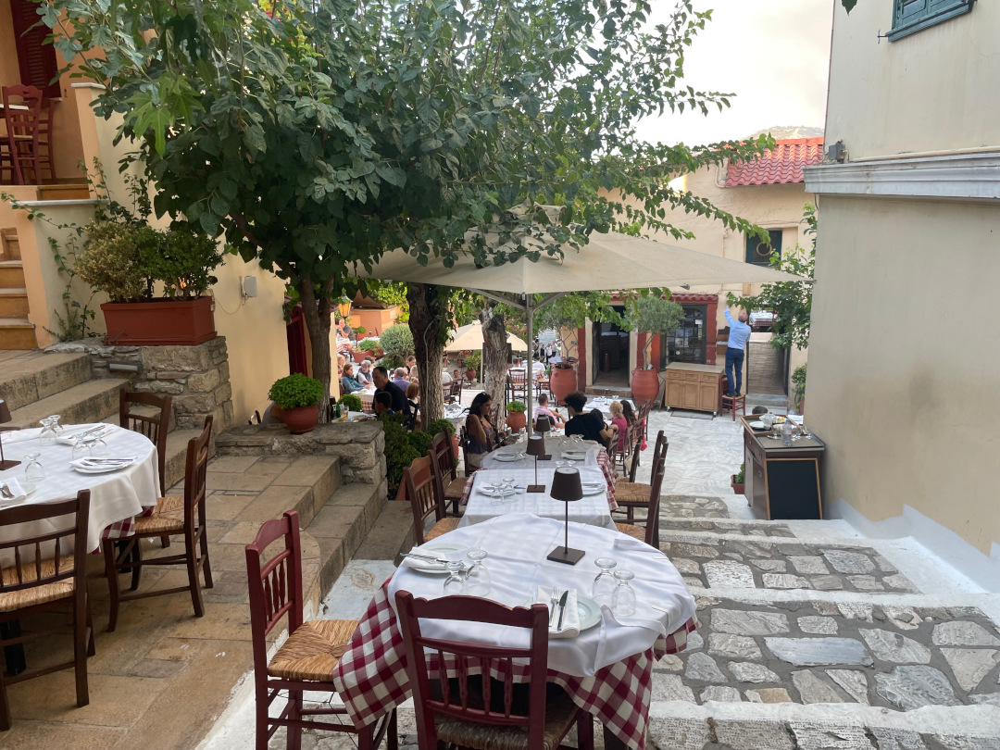