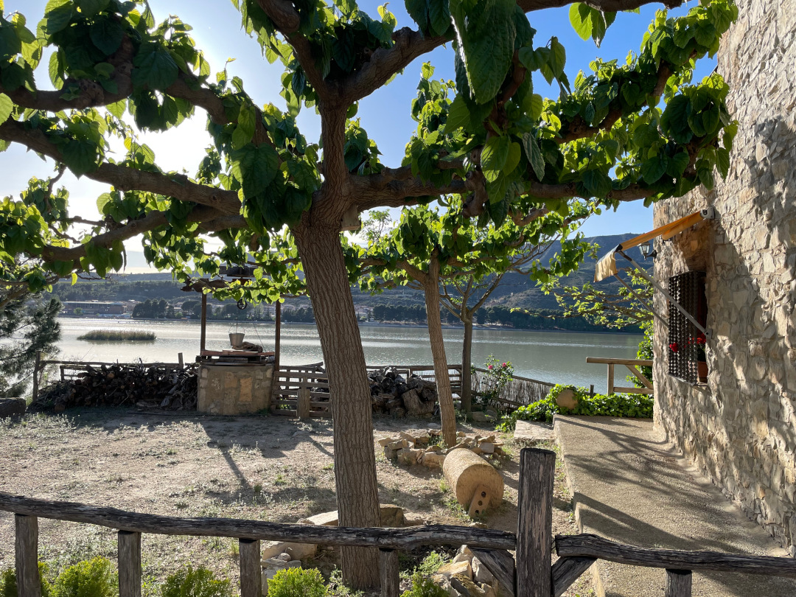
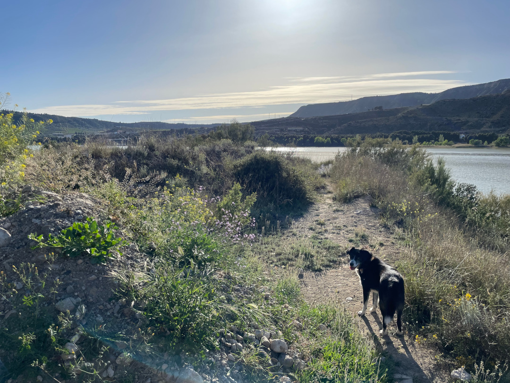
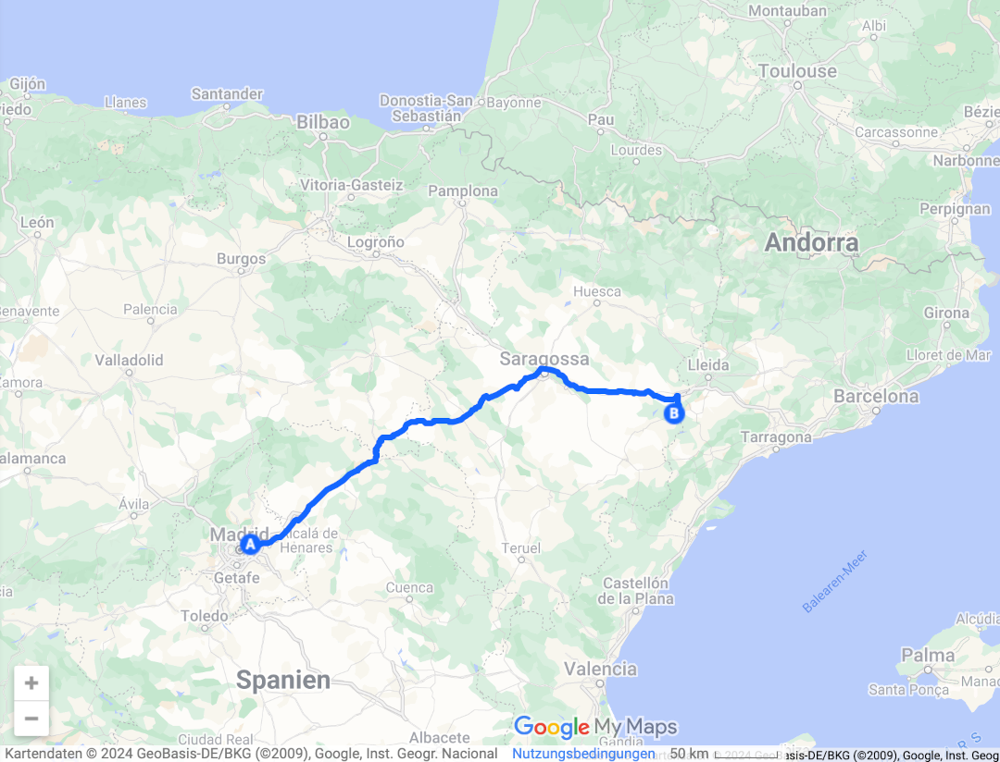
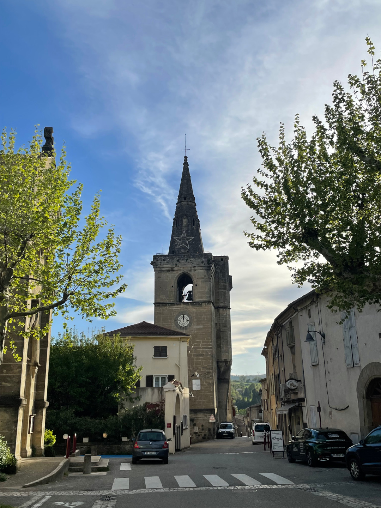
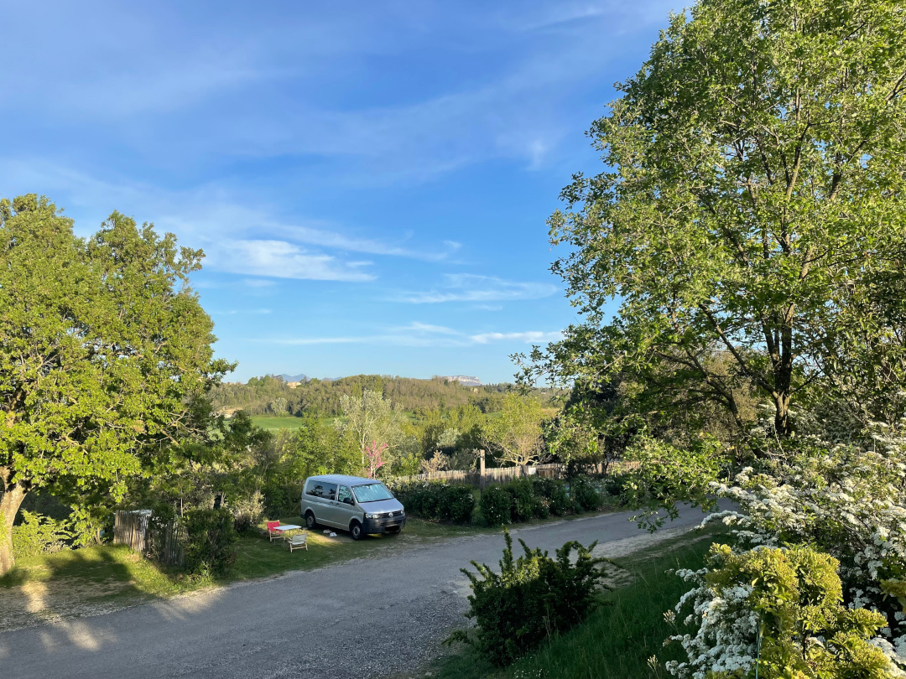
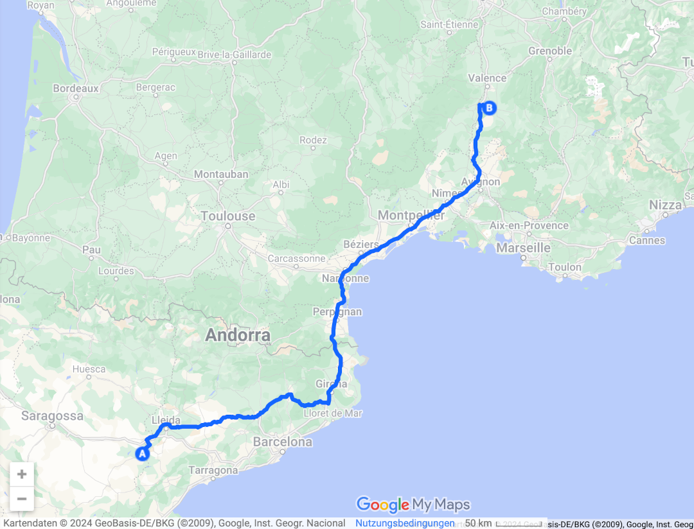

Wir lassen das nächste Land hinter uns und machen einen kurzen Zwischenstopp in Frankreich.

<!--more-->

🗓️ 11. April: Nach so vielen Nächten an einer Stelle und in der großen Stadt tut es jetzt auch gut mal wieder loszufahren. Alle schwarzgelben Freunde haben wir gestern Abend schon verabschiedet und für uns geht es zurück in den Reisemodus. Als erstes steht ein Großeinkauf an und dann geht es ab auf die Autobahn und immer Richtung Nordost. Gegen Mittag brauchen wir nach den anstrengenden Hauptstadttagen allerdings erstmal ein Nickerchen. Praktisch, wenn das Bett immer dabei ist, das wir auf einem Rastplatz mit Schattenplätzen schnell ausklappen. Nach einer Dreiviertelstunde sind wir wieder einsatzfähig, düsen weiter und mit Podcasts geht die Zeit im Auto dann auch schnell rum. Am Campingplatz, den wir eigentlich anvisiert hatten, dann kurz Ernüchterung, denn es ist niemand da und besonders einladend sieht es hier auch nicht aus. Nach einer Runde über den Platz entscheiden wir, dass wir eine Alternative brauchen. Gleich gegenüber auf der anderen Flussseite finden wir ein Angelcamp, das wir ansteuern und das auch noch von Deutschen betrieben wird. Der Besitzer interessiert sich sehr für das BVB-Spiel gestern. Ansonsten ist wenig und los und alles ist sehr unkompliziert. Für die eine Nacht haben wir hier mit super Aussicht also doch noch ein schönes Plätzchen gefunden. Mit Henry geht’s noch den Fluss entlang und dann ist auch schon Feierabend.

🗓️ 12. April: Wir wollen nach Osteuropa und müssen dafür in nächster Zeit noch einiges an Strecke zurücklegen. Heute stehen dann auch so viele Kilometer an, dass wir uns sogar mal einen Wecker gestellt haben. Nachdem wir wieder kurz mit Henry am Fluss waren, düsen wir direkt los. Mittags landen wir in einem kleinen Örtchen für eine Pause und um ein letztes Mal günstig zu tanken. In Frankreich und Italien wird es auf jeden Fall teurer. Abends wollen wir, bevor wir den ausgesuchten Campingplatz ansteuern, noch eine Pizza mitnehmen, damit wir nicht noch kochen müssen. Eine Pizzeria zu finden, die um 17:30 Uhr schon geöffnet ist, ist gar nicht so leicht. Schließlich finden wir eine etwas nördlich gelegene, aber als wir ankommen, sagt man uns, dass die Küche erst in einer Stunde aufmacht. Die angebotenen Getränke schlagen wir aus und wollen schon weiterfahren. Dann sehen wir zufällig Campingschilder und tatsächlich liegt nur ein paar hundert Meter von der Pizzeria entfernt auch noch ein Campingplatz. Den steuern wir stattdessen an, damit wir später dann zu Fuß noch durch das kleine Dorf und zurück zur Pizzeria spazieren können. Und der Zufall hat es gut mit uns gemeint, denn der Platz ist richtig schön im Grünen und sehr ruhig. Aussicht auf die Gipfel der Rhône-Alpes haben wir in der Ferne auch noch. Und als letzte Kunden schaffen wir es sogar noch in den kleinen Supermarkt, bevor er schließt, um für Nachtisch zu sorgen. Das hätte schlechter für uns laufen können!

