Wir fahren weiter in die Hauptstadt Moldaus und werden schon von den Gates of Chişinău City erwartet.

<!--more-->

🗓️ 11. Mai: Der Tag startet wieder sonnig und genauso entspannt wie gestern. Wir gehen noch eine große Runde mit Henry durch die grüne Landschaft, was ihm natürlich gut gefällt. Teilweise brauchen wir mehrere Tage seine Leine nicht mehr. Wir packen alles zusammen und verabschieden uns von dem Besitzer. Bevor es in die Hauptstadt geht, halten wir noch auf dem Weg in Criuleni, um einzukaufen. Unseren Frühstücksstopp machen wir am Grenzfluss zwischen Transnistrien und Moldau. Wir verzichten auf einen Besuch in Transnistrien, auch weil wir so nochmal eine Grenze passieren müssten. Auch hat die moldawische Regierung keinen Einfluss in dieser Region. So nah am Ukraine-Krieg ist es uns dann doch etwas zu heikel. Dennoch sieht man hier in der Region einige transnistrische Nummernschilder. Der Konflikt und Moldau als Land generell erinnern schon etwas an den Kosovo. Da wir ja bereits alle Campingplätze des Landes bereist haben, gibt es folglich in Chişinău für uns keine Möglichkeit mehr nachts ruhig und sicher im Bulli zu schlafen. Freistehen wäre vielleicht möglich, aber aus Liebe zu unseren Nummernschildern haben wir in der Hauptstadt ein Hotel gebucht. Wir erreichen Chişinău schon gegen 13 Uhr, können aber schon kurz aufs Zimmer. Danach machen wir uns relativ schnell mit dem Bus auf den Weg in die Stadt für eine erste Erkundungstour. Bus fahren in Chişinău ist wie in Bukarest eigentlich sehr einfach. Es gibt zwar keine Kreditkartelesegeräte, wo man das Tickets kaufen kann, aber dafür gibt es Ticketverkäufer bzw. meistens eher Ticketverkäuferinnen in jedem Bus. Man steigt ein, setzt sich hin und wartet bis die ältere Dame kommt und das Geld einsammelt. Dann erhält man ein kleines Busticket. Eine Fahrt kostet umgerechnet 30 Cent. Eine Straßenbahn gibt es nicht. Dafür fahren die Trolleybusse (Oberleitungsbusse) aber fast im Fünfminutentakt. Das ist unser Glück, denn der erste Bus fährt erstmal ohne uns, weil wir vorne beim Busfahrer ein Ticket kaufen wollen. Die Tür bleibt geschlossen und innerhalb von Millisekunden, also bevor wir hinten angekommen sind, schließt alles schon wieder. Im zweiten Versuch führt unser erster Weg dann in einen Computerladen, weil Hannas Laptop-Ladekabel kaputt gegangen ist. Glücklicherweise sprechen hier wieder mehr Leute englisch. So klappt auch alles mit der Verständigung. Mit Ladekabel im Gepäck geht es zurück zum Hotel. Wir laufen vorbei an vielen sowjetischen Beton-Blöcken. Teilweise verfallen die mittlerweile echt schon und man wundert sich, dass man die Gebäude noch nutzen kann. Aber es werden noch fast alle Gebäude genutzt. Wir laufen noch über den Markt, der den marokkanischen Märkten in nichts nachsteht. Auch hier ist es sehr wuselig, es gibt von Mikrowellen, toten Fischen und gefälschten Stone Island Pullovern alles zu kaufen. Es laufen nur weniger wilde Tiere über die Märkte. Das war in Marokko etwas anders. Die streunenden Hunde versammeln sich hier sowieso lieber in riesigen Rudeln in den Parks. Nachdem wir noch einmal kurz am Hotel waren, nehmen wir wieder den Bus und fahren zum Zimbru Stadion. Hier spielt heute Zimbru Chişinău gegen Sheriff Tiraspol. Die Hauptstadt Moldaus gegen die Hauptstadt Transnistriens. Trotz der autonomen Region Transnistrien spielen alle Vereine in einer moldawischen Liga. Zimbru gewinnt mit 2:0 gegen den Favoriten aus Transnistrien. Normalerweise sind die Fußballspiele hier in Moldau kostenlos. Bei diesem „Topspiel“ kosten die Tickets dann aber umgerechnet 2,50 €. Die ca. 100 Heimfans in schwarz versammeln sich hinter der Chişinău Fahne und machen teilweise gute Stimmung. Gästefans sind nicht zugelassen. Zwei Personen, die wohl aus Transnistrien kamen, werden schlagkräftig von den Heimfans aus dem Stadion verbannt. Das war auch der fast einzige Aufreger des Spiels. Die Meisterschaft kann das Spiel nämlich nicht mehr entscheiden. Der
moldawische Meister kommt 2024 aus Hincesti, was sehr ungewöhnlich ist. Von 32 Meisterschaften gingen bisher 31 nach Tiraspol oder Chişinău. Nach dem Spiel laufen wir noch zurück zum Hotel, was man auch nach Einbruch der Dunkelheit hier ohne Probleme machen kann.

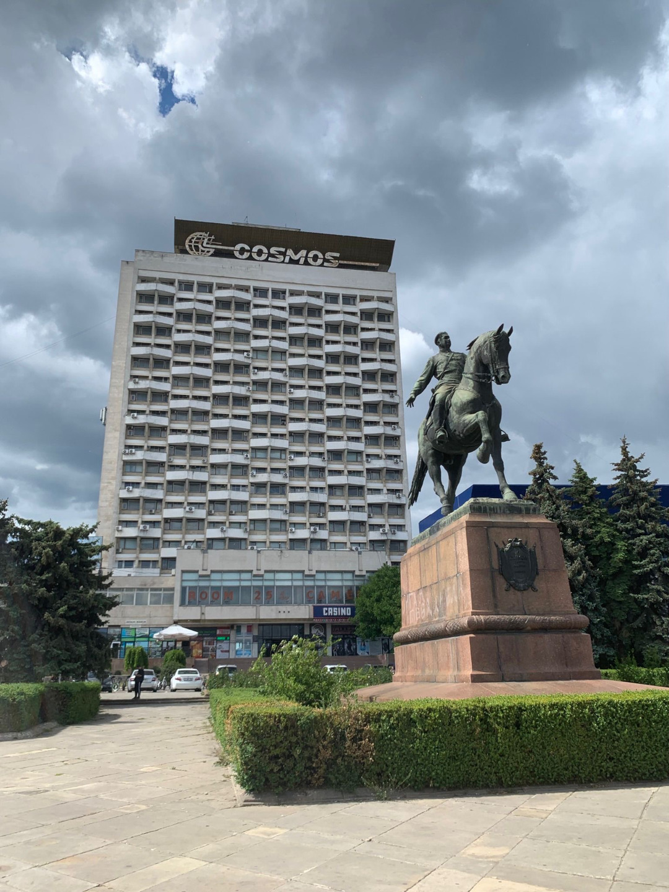

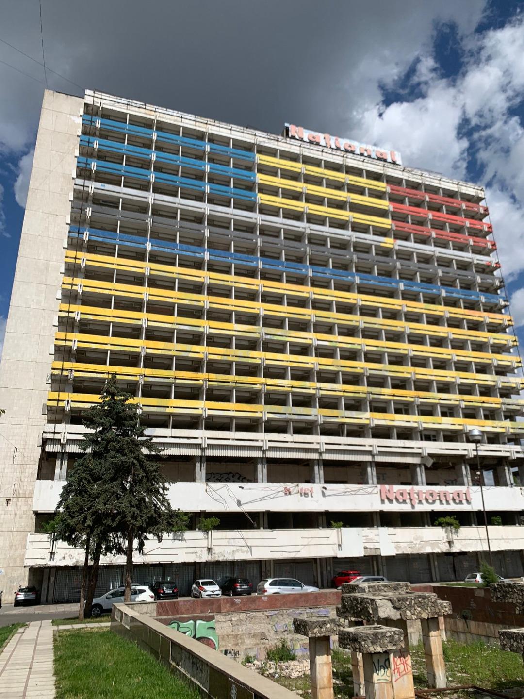

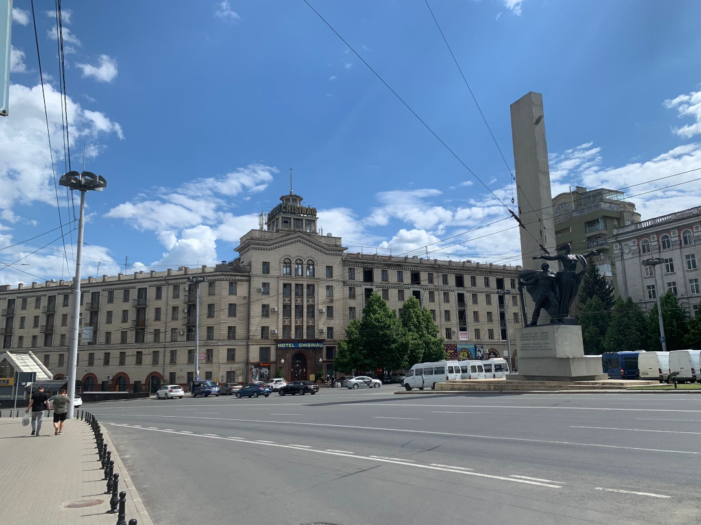

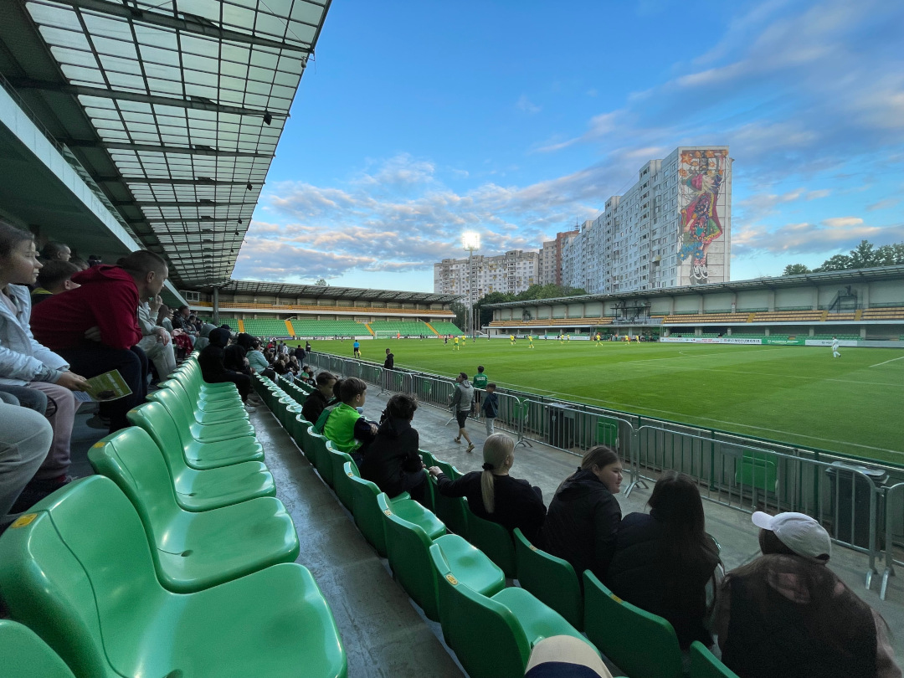

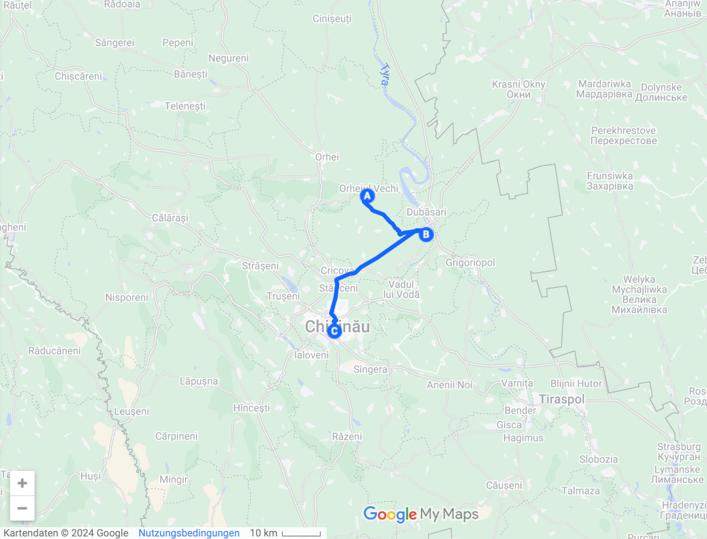

🗓️ 12. Mai: Weil es gestern Abend etwas später wurde, schlafen wir länger und erkunden danach mit Henry den Park, in dem das Hotel liegt. Der Park ist riesig und es gibt drei verschiedene Seen. Weil heute Sonntag ist, ist auch relativ viel los. Die meisten Hunde, die man trifft, sind aber ebenfalls an der Leine. Die Streuner sind eher zurückhaltend. Danach machen wir uns erneut auf den Weg in die Innenstadt, um die Perlen zwischen den Sowjet-Blocks ausfindig zu machen. Die Perlen beschränken sich hauptsächlich auf Parks oder Kathedralen. Eine Altstadt oder sonstige spektakuläre Architektur gibt es hier eher weniger. Wir fahren mit dem Bus zum Dendrariu Park und laufen von dort aus zur Kaskadentreppe. Danach wollen wir eigentlich ins nationale Geschichtsmuseums Moldaus, das aber leider geschlossen ist. Wir waren sogar schon drinnen, bis wir es dann auch gemerkt haben. Wie in fast jeder Hauptstadt gibt es auch hier einen Triumphbogen. Welcher Triumph damit auch immer gefeiert werden soll. Gegenüber befindet sich das Regierungsgebäude, an dem man unschwer erkennen kann, was das Ziel der jetzigen Regierung ist: Bis 2030 der EU beizutreten. Danach gucken wir uns noch zwei Kathedralen an, bevor es uns nochmal auf den Markt verschlägt, wo aber wegen des Sonntags und der späteren Uhrzeit fast nichts mehr los ist. In einem Buchladen ergattern wir noch die wohl einzigen Postkarten Moldaus. Danach fahren wir mit dem Bus bis ans Ende der Stadt kurz vor den Flughafen. Hier werden die einfahrenden Besucher schon von den Gates of Chişinău City begrüßt (Titelbild). Da wir aber gestern von Norden ankamen, sind wir extra für die schicken Wohnblocks in den Süden gefahren, um uns ebenfalls nachträglich davon begrüßen zu lassen. Der letzte Tagespunkt für heute ist das Abendessen. Gestern Abend fanden wir den Besuch im Restaurant schon sehr lustig. Auch heute war es wieder genauso. Der Kellner sagt für alles, das er tut die Minutendauer an, auch wann er wiederkommt. Er begrüßt uns und sagt er kommt in fünf Minuten und nimmt das Essen auf (Also muss man sich in fünf Minuten entschieden haben). Die Getränke kommen in drei Minuten, die Pizza in 10, die Suppe in 15, die Kartoffeln in 25 und der Salat auch. Das Nervige ist, dass tatsächlich alles dann zu der Zeit kommt und man alles nacheinander essen muss. Ich war schon mit der Suppe und der Pizza fertig und Hanna hatte noch nichts gegessen. Das Wichtigste aber ist doch, dass wir am Ende alle satt sind.

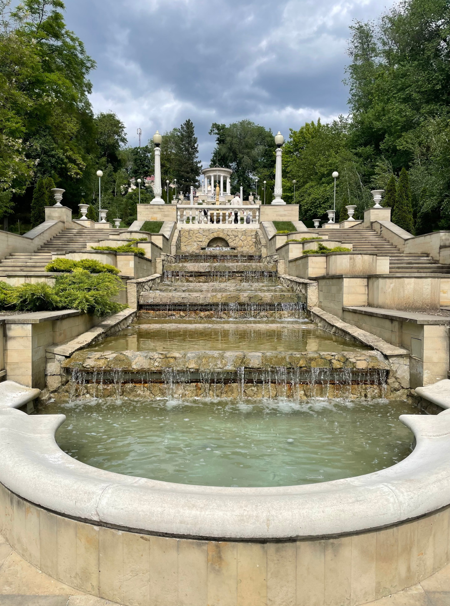

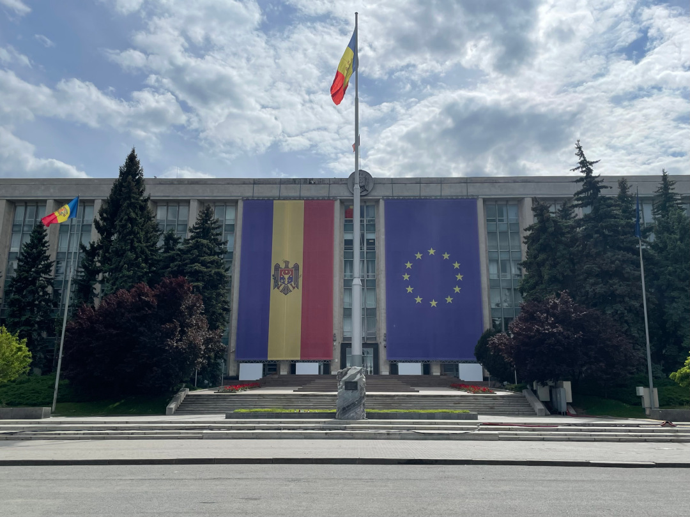

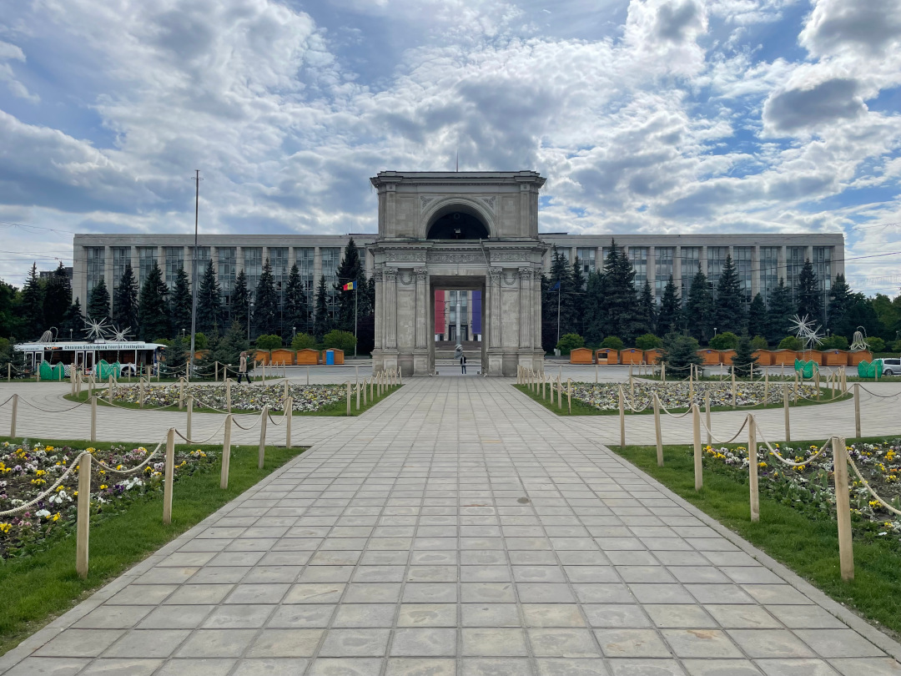

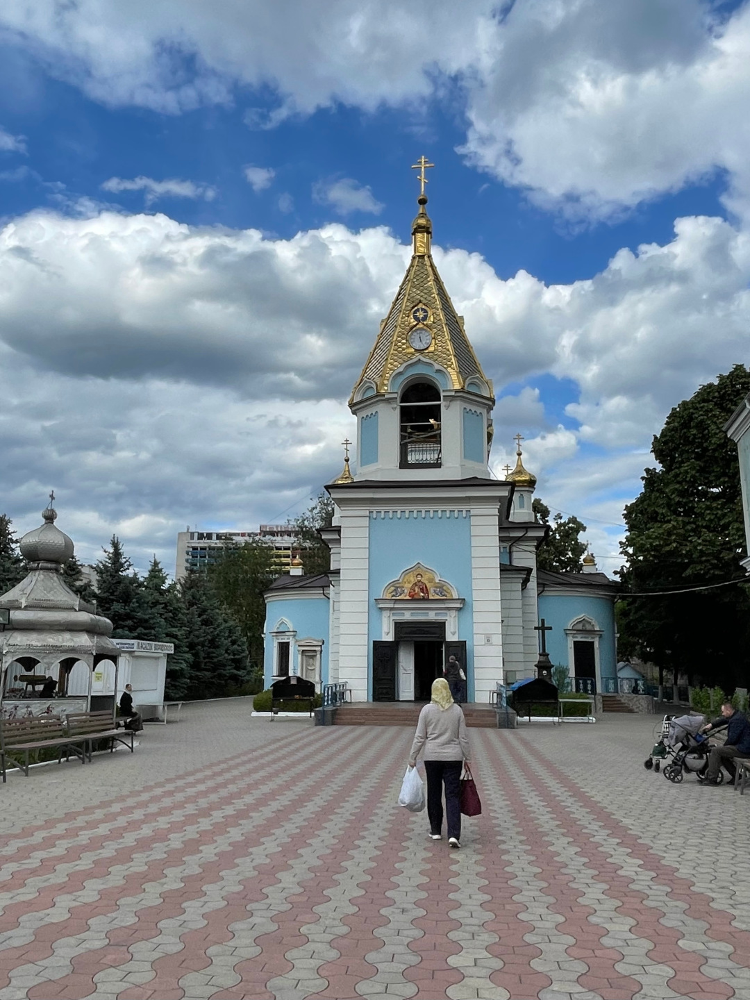

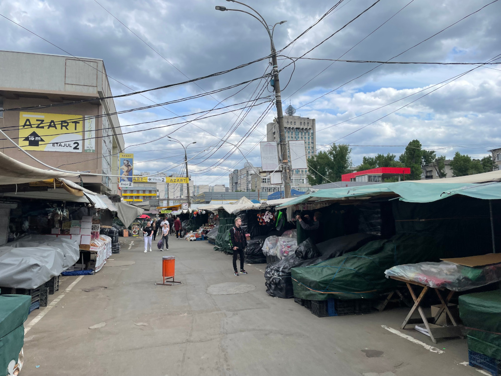

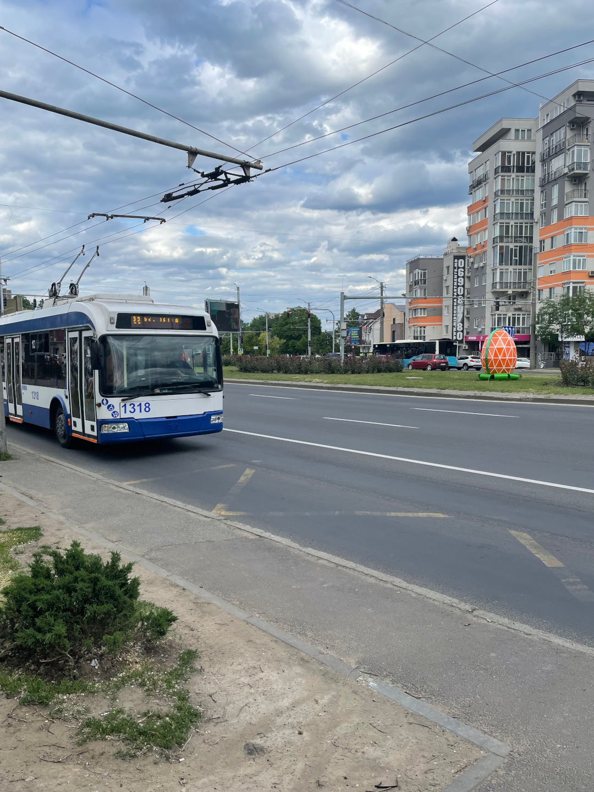