Unser nächstes Ziel ist eine der berühmtesten Schluchten der Türkei für eine kleine Flusswanderung, bevor es wieder an die Mittelmeerküste geht.

<!--more-->

🗓️ 11. Juni: Wir stehen perfekt unter einem Baumhaus im Schatten und können deshalb gut schlafen. Als erstes drehen wir eine Runde mit Henry und springen in den Pool. Dann machen wir uns fertig, kaufen Wasserschuhe und gehen los zur Schlucht. Der Eingang ist nur zwei Minuten vom Campingplatz entfernt und der Eintritt im Vergleich zu manch anderer Sehenswürdigkeit sehr günstig. Wir sind ungefähr um 9 Uhr da und es ist gut früh hier zu sein, weil es noch ziemlich leer ist. Nicht mal die Guides sind in Position gegangen, um auf Touristenfang zu gehen, aber später am Tag kann es hier sehr voll werden. Dann kommen nämlich ganze Busladungen Touristen an. Unser Weg in die Schlucht beginnt als entspannter Spaziergang, erst auf einer Brücke über dem türkisblauen Fluss, dann mit den Füßen durch das kalte Wasser. Je weiter wir in die Schlucht hineinlaufen, desto enger wird sie und desto tiefer (aber zum Glück auch wärmer) wird an manchen Stellen das Wasser, durch das wir durchmüssen. Deshalb kann man auch nur bei guter Wetterprognose rein. Irgendwann steht uns das Wasser schließlich bis zur Hüfte, den Rucksack müssen wir schon auf den Schultern tragen. An einer Stelle kommen wir nur weiter, weil wir uns mit einem britischen Paar gegenseitig helfen den Felsen zu überwinden. Als die Schlucht nach ungefähr einer Stunde dann eher höhlenartig wird, geht es für uns endgültig nicht mehr weiter und wir drehen wieder um. Auf dem Rückweg sitzen genau an der Stelle, an der wir nicht alleine weiterkamen, die Guides und bieten ihre Hilfe an. Als wir die Schlucht wieder verlassen, fängt der Betreiber des Campingplatzes uns mit einer guten Nachricht ab. Der Betreiber des anderen Platzes, wo wir gestern wegen Stromausfall abreisen mussten, hat in der Zwischenzeit nämlich unsere Wäsche mithilfe eines Generators aus seiner Maschine gerettet und an der Rezeption für uns abgegeben. Jetzt haben wir zwar zwei Tüten voll nasser Wäsche, aber immerhin haben wir unsere Klamotten wieder und können weiterfahren. Dafür sorgen, dass die Wäsche wieder frisch wird, können wir genauso gut am nächsten Platz. Wir kühlen uns also nur nochmal im Pool ab und düsen dann los, wieder mehr in Richtung Küste. In der Küstenstadt Fethiye machen wir einen Einkaufsstopp und landen dann in dem kleinen Ort Kayaköy. Als wir sehen, dass der Campingplatz, den wir eigentlich anvisiert hatten, überhaupt keinen Schatten auf dem Gelände hat, drehen wir schnell wieder um und machen uns unbemerkt aus dem Staub. Nur ein paar Straßen weiter werden wir mit einem kleinen Platz mit vielen Bäumen und Pool dann fündig. Den Ort gucken wir uns heute aber nicht mehr an, sondern richten uns auf dem Campingplatz ein und kümmern uns um unsere Wäsche.

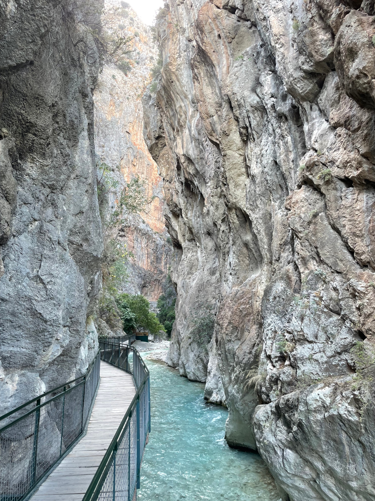

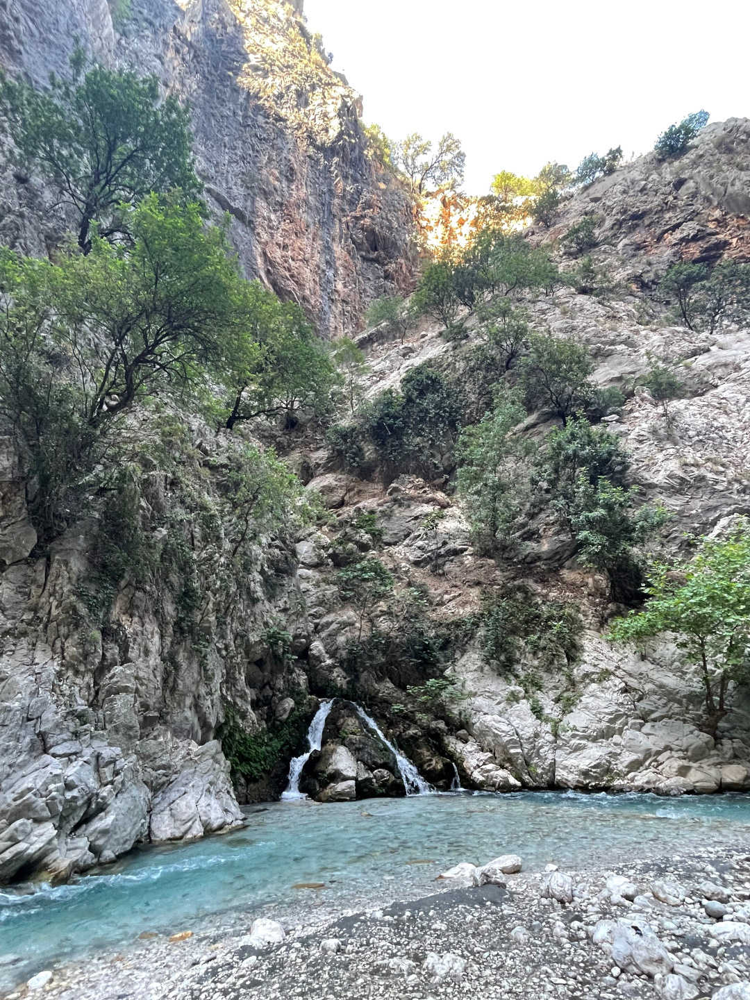

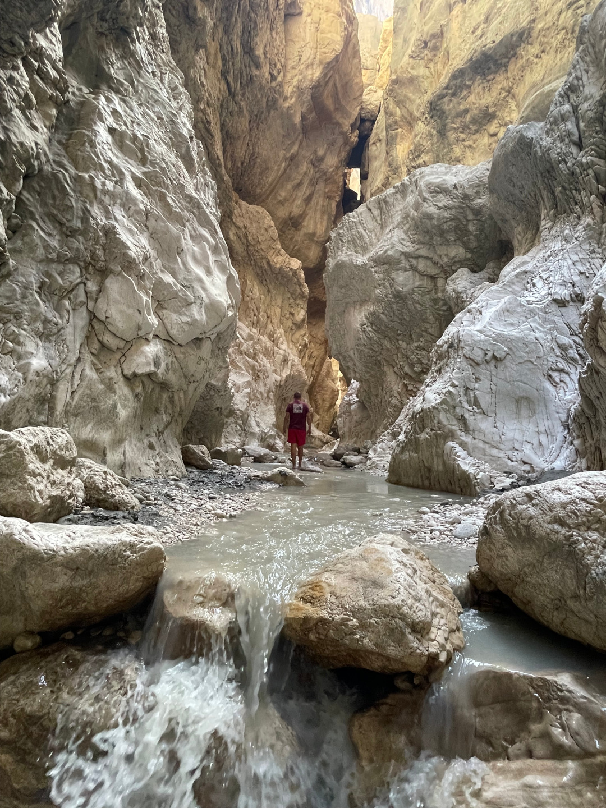

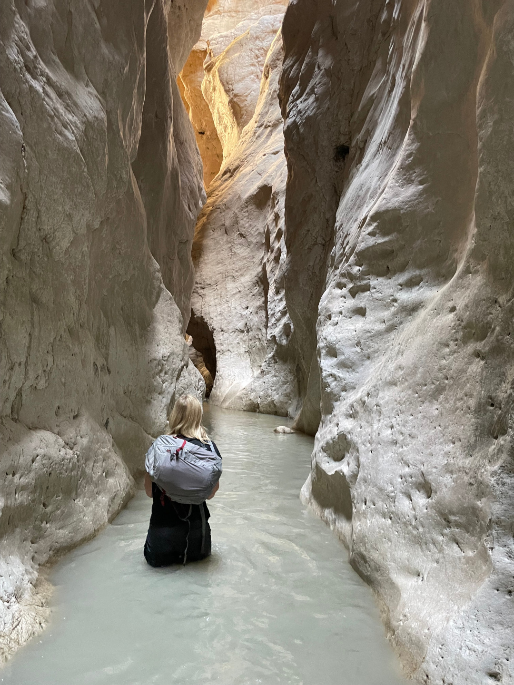

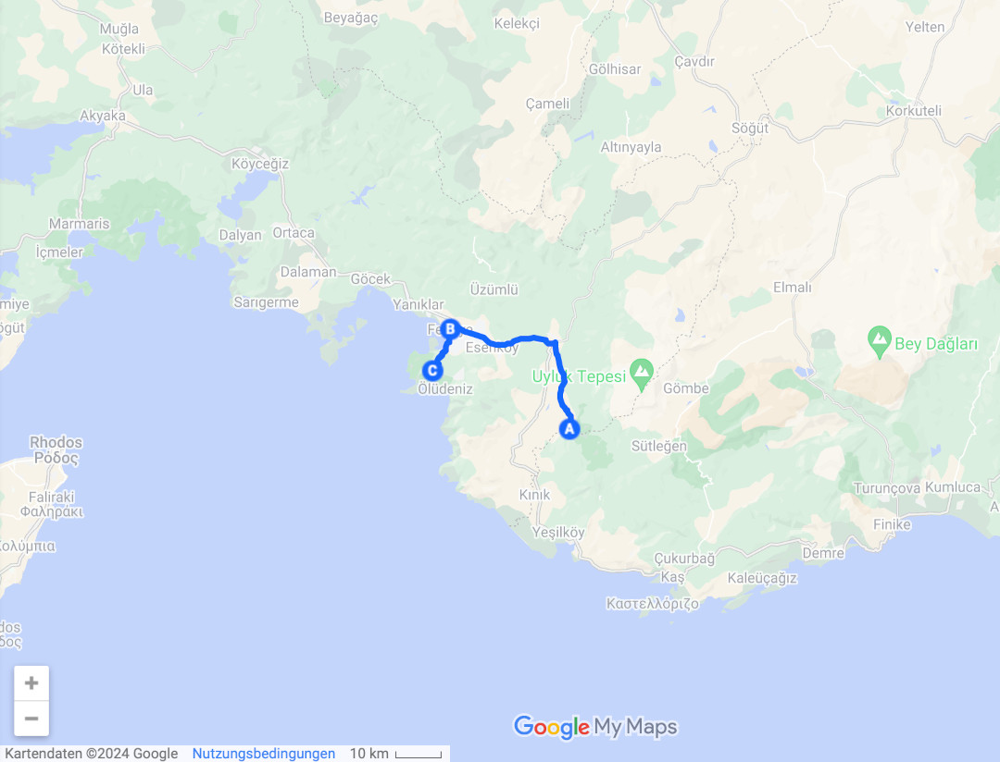

🗓️ 12. Juni: Wir werden wieder von der Sonne geweckt und brauchen nach der Henry-Runde direkt erstmal eine Abkühlung im Pool. Wir entscheiden uns dafür noch eine Nacht hierzubleiben und für die nächste Zeit etwas umzudisponieren. Wir gucken nach einem Plan B, denn es soll die nächsten Tage mit Temperaturen über 40 Grad nochmal heißer werden. Die erste Hitzewelle des Jahres in der Türkei. Teils sind für die Nacht noch 30 Grad angekündigt. Wir versinken heute also etwas in der Recherche und Planung, wie wir die Tage am besten verbringen und überbrücken. Dann gehen wir in den Ort, der in einem felsigen Gebirgstal südlich von Fethiye und direkt neben der Geisterstadt Levissi liegt. Hier lebten ursprünglich Griechen, die dann nach den Bestimmungen des Vertrags von Lausanne aber vertrieben wurden. Heute ist es eher touristisch und hat einen leichten Hippie-Touch. Ansonsten lässt die Wärme einem nicht viel Wahl, außer es ruhig angehen zu lassen und sich immer wieder abzukühlen. Abends geht es nochmal zurück in das kleine Dorf, das durch die Geisterstadt sogar etwas touristisch ist. Hier besorgen wir uns noch Köfte zum Abendessen und spazieren eine kleine Runde durch den Ort. Vielmehr ist bei den Temperaturen auch abends nicht mehr drin.

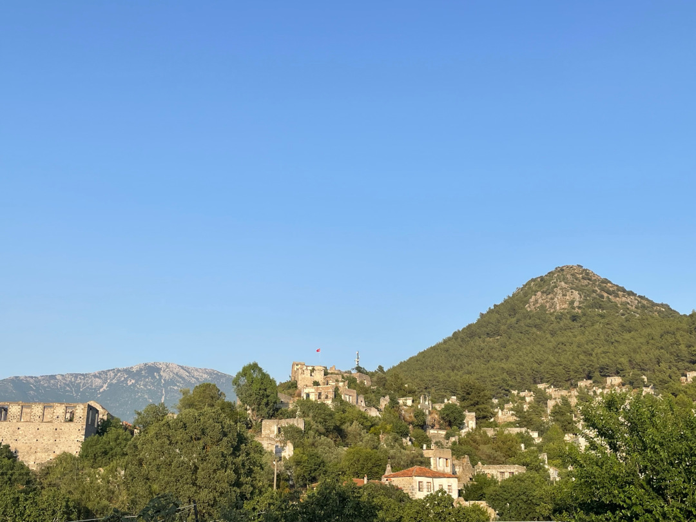

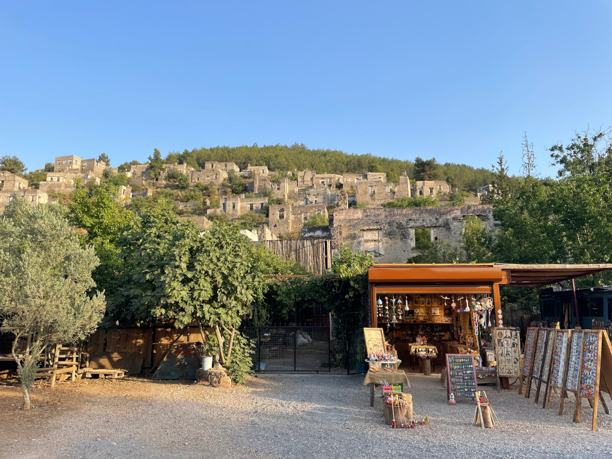

🗓️ 13. Juni: Dieser Morgen ist bisher der heißeste und die Sonne scheint morgens schnell auf den Bulli. Wir erledigen deshalb schnell unsere Verpflichtungen wie Bulli aufräumen und mit Henry gehen, bevor wir wieder in den Pool und duschen müssen. Wir bezahlen und verabschieden uns und fahren weiter. Wir wollen zum Butterfly Valley, also zurück an die Küste, und besorgen auf dem Weg alles für ein kleines Picknick. Unser Weg führt vom Ort Ölüdeniz erstmal steil nach unten bis auf Meeresniveau und dann auf der anderen Seite in Serpentinen die Steilküste wieder hoch, bis wir perfekte Sicht aufs Butterfly Valley haben. Die kleine Bucht ist umrahmt von felsigen Küsten und das türkisblaue Wasser schimmert bei dem Wetter natürlich sehr schön. Die Aussicht ist traumhaft, aber den Strand selbst erreicht man am besten nur mit dem Boot bzw. vom Wasser aus. Allzu lange hier oben bleiben können wir wegen der Hitze nicht, obwohl es nicht mal Mittag ist. Deshalb düsen wir bald wieder runter und halten am Kidrak Strand, der zwischen Ölüdeniz und dem Butterfly Valley gelegen ist. Hier können wir im Schatten unsere Decke ausbreiten und der Strand ist bisher wahrscheinlich der schönste auf unserer Reise. Das Wasser ist wirklich kristallklar und selbst wenn es schon 4-5 Meter tief ist, sieht man immer noch deutlich den Meeresboden. Außerdem wird es schön schnell tief und zumindest als wir dort sind, ist es ziemlich leer, obwohl das Parken gerade mal 3€ kostet. Zum Schwimmen ist es hier perfekt und das Salzwasser können wir uns unter der Dusche auch wieder abwaschen. Anschließend nehmen wir uns hitzefrei und steuern unseren gestern entwickelten Plan B an, nämlich ein Hotel in Liman bei Antalya. Das wichtigste Kriterium für uns war die Klimaanlage und auch auf der Fahrt merken wir, dass das die richtige Entscheidung für die nächsten Tage war. Abends gehen wir mit Henry noch an der Promenade spazieren und in einem Restaurant um die Ecke lecker essen. Am meisten freuen wir uns aber wirklich einfach über die Klimaanlage auf dem Zimmer.

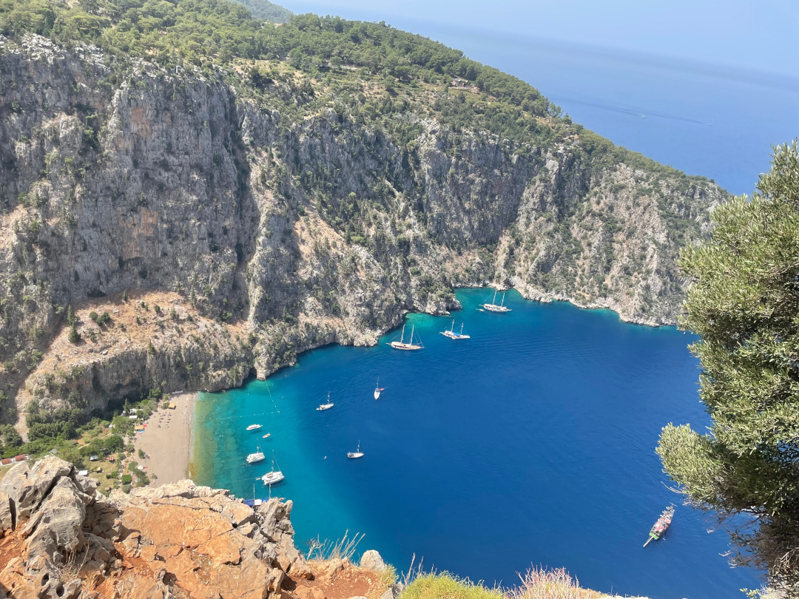

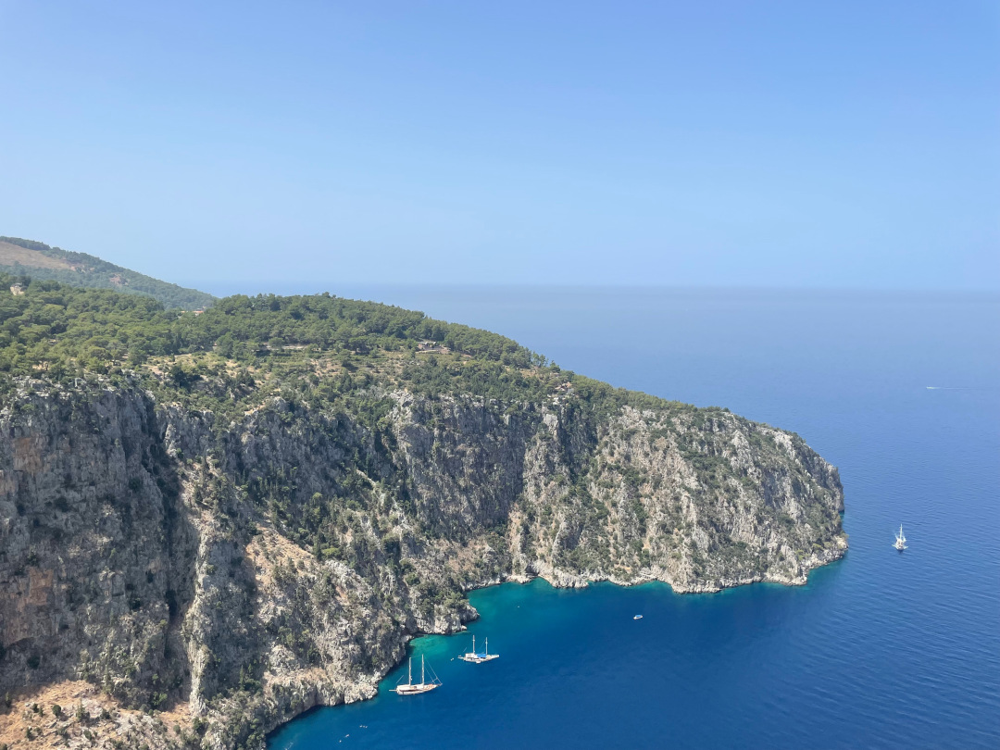

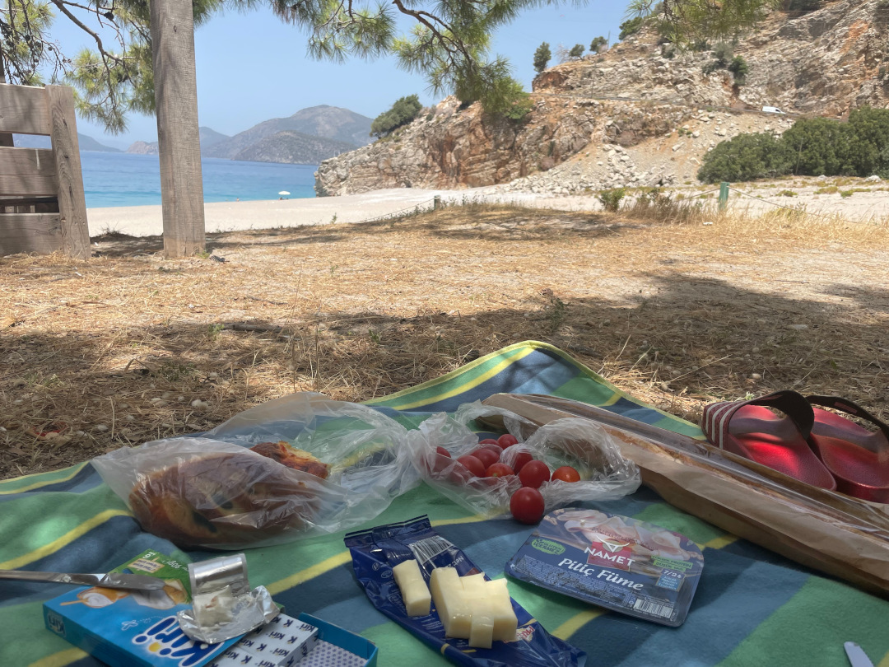

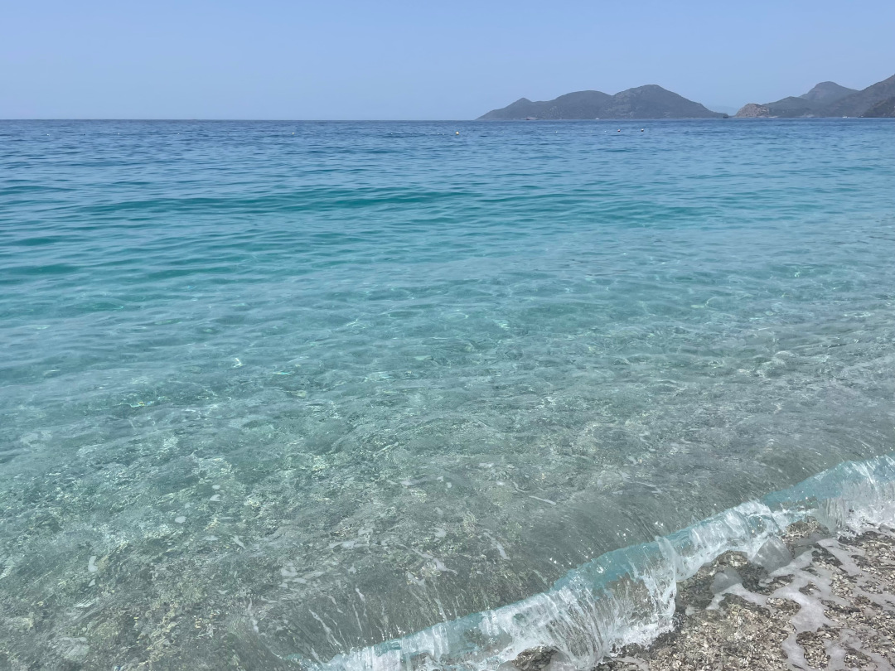

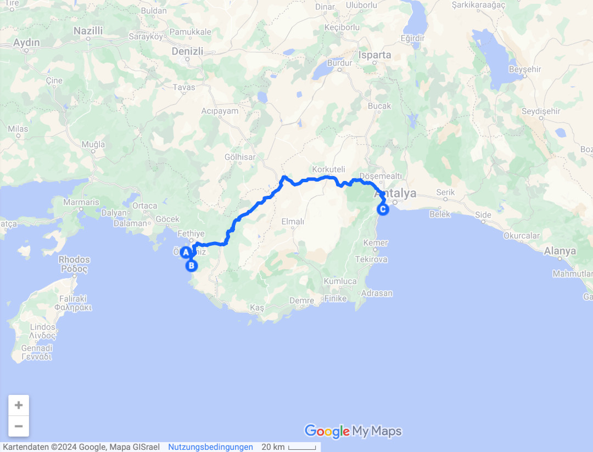

