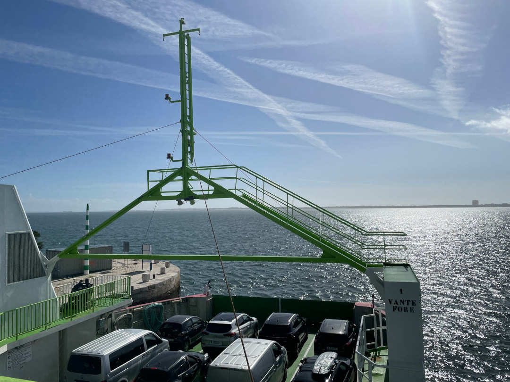
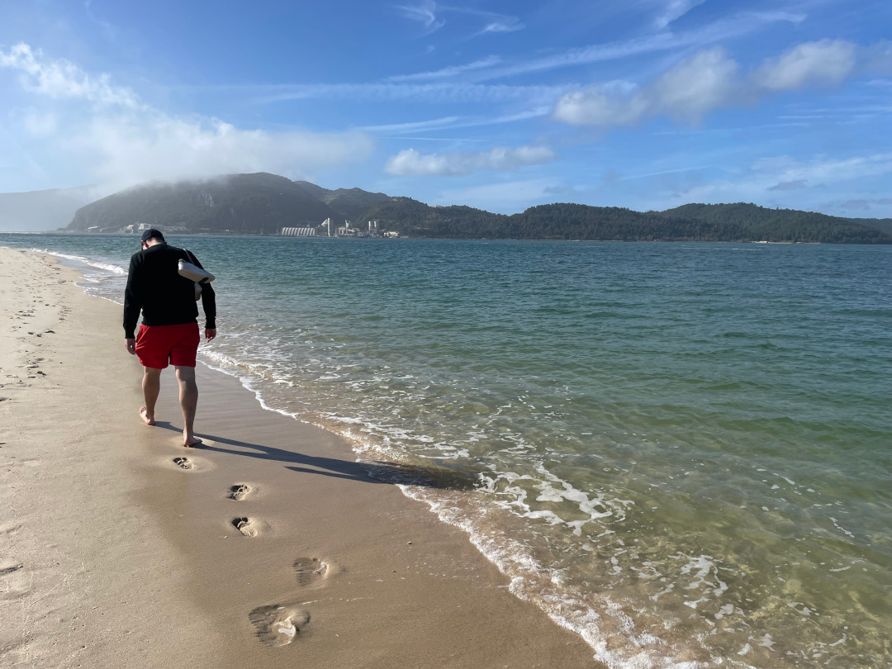
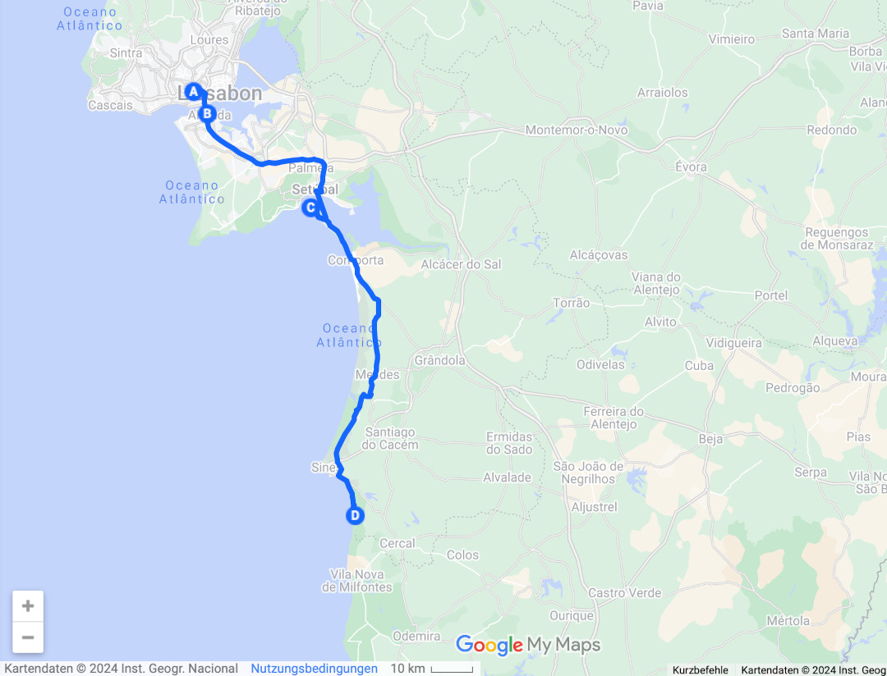
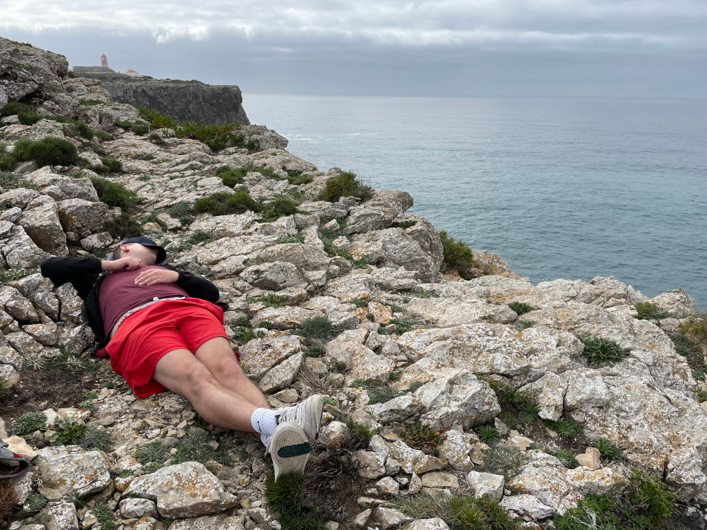
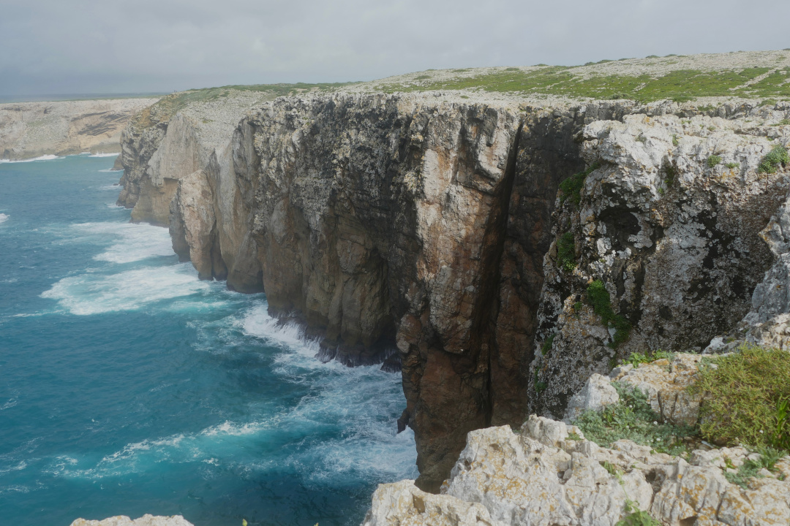
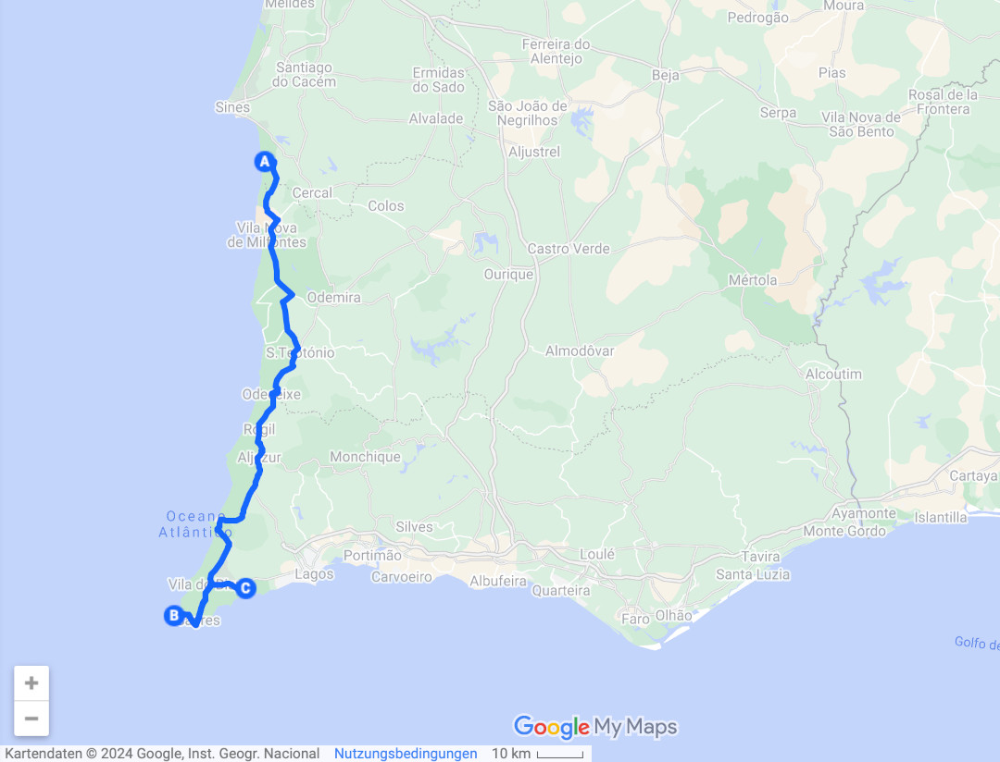

Wir lassen die Hauptstadt hinter uns und fahren die Westküste weiter bis zum äußersten südwestlichen Ende Portugals und Europas: Cabo de Sao Vicente.

<!--more-->

🗓️ 12. Februar: Nach den letzten regnerischen Tagen werden wir nun wieder von der Sonne geweckt. Das macht es auch einfacher die nassen Sachen zu trocknen. Wir wollen nach dem Trubel der Hauptstadt schnell wieder in die Natur. Doch vorher steuern wir noch die Cristo Rei Statue in Almada im Süden Lissabons an. Die Statue ist mit Sockel 103 m hoch und damit die siebtgrößte Christusstatue der Welt. Zunächst werden wir aber abgewiesen, weil Hunde verboten sind, sogar auf dem Vorplatz. Selbst wenn man auf die Statue hochgewollt hätte, wäre die Schlange viel zu lang gewesen, um es tatsächlich zu machen. Wir bringen Henry fix ins Auto und gehen zumindest auf den Vorplatz. Auch hier hat man schon eine sehr gute Sicht auf Lissabon und die Brücke über die Bucht, weil die Statue oberhalb der Stadt liegt. Danach geht es weiter nach Setúbal. Von hier nehmen wir eine Fähre auf die Halbinsel Troia. Hier haben die Römer damals Salz aus dem Atlantik gewonnen. Heute ist die Insel eher für Luxus-Urlaub bekannt. Zum Glück nicht im Februar. Weil dort auch quasi niemand wohnt, sind wir fast alleine und spazieren über die langen Strände. Mit etwas Glück könnte man sogar Delphine sehen. Wir sehen sogar einen: Leider liegt der aber tot am Strand und ist wohl vor kurzem hier gestrandet. Henry ist auf jeden Fall sehr interessiert. Nach der Strandwanderung fahren wir nach Porto Covo, ebenfalls an der Westküste. Hier wollen wir die Nacht verbringen. Wir finden einen guten Campingplatz direkt am Strand bzw. an den Klippen. Auf dem Weg in den Ort finden wir ein Portemonnaie. Wir hätten es erst nicht aufheben wollen, weil es wirklich alt aussah. Als ich dann aber reingesehen habe, waren sehr viel Bargeld, mehrere Kreditkarten, Personalausweis, Führerschein, Parkausweis von André aus Lissabon drin. Zu weit weg von der Südtribüne wollte ich keinen zweiten Aleksander W. riskieren. Als vorbildliche Finder wollten wir daher zur Polizei, die es aber in Porto Covo nicht gibt. Wir hatten die Vermutung, dass es vielleicht ein Campingplatz-Besucher verloren hatte. Daher haben wir es an der Rezeption abgegeben. Ich bin mir nicht sicher, ob das Portemonnaie jemals sicher ankam. Nach dieser Aufregung gehen wir ein zweites Mal in den Ort, um einzukaufen. Danach erleben wir einen spitzen Sonnenuntergang direkt an den Klippen. Wir bleiben noch lange am Meer sitzen, dafür kocht man dann später gerne im Dunkeln.

🗓️ 13. Februar: Entgegen der sonnigen Wettervorhersage werden wir mit etwas Regen geweckt. Der verzieht sich aber schnell, so dass wir die morgendliche Henry-Runde auf den anderen Teil der Klippen legen können, den wir gestern Abend nicht mehr gesehen hatten. Porto Covo ist wohl bisher einer unserer Lieblingsorte in Portugal. Auch diese Wanderung hat sich echt gelohnt. Dennoch verlassen wir dann diesen Ort. Wir wollen heute die Westküste hinter uns lassen. Das geht natürlich am besten mit einem Besuch des Cabo de Sao Vicente, dem südwestlichsten Punkt Europas. Auf dem Weg dahin sehen wir schon viele Wanderer. Einer der bekanntesten Fernwanderwege Portugals endet hier. Der Leuchtturm des südwestlichsten Punkt ähnelt sehr dem am westlichsten Punkt. Die Klippen kommen mir aber deutlich höher vor. Wir wandern etwas entlang der Klippen und machen hier oben unsere Mittagspause inklusive Mittagsschlaf. Die Aussicht dabei ist traumhaft. Ab jetzt sind wir an der Südküste und es geht zurück zum geparkten Bulli und noch ein paar Kilometer nach Salema zu dem rausgesuchten Campingplatz für die Nacht. Hier hören wir das erste Mal, dass der Platz schon ausgebucht ist. Dann muss also ein Plan B her. Wir finden einen anderen Platz, der aber auch schon sehr voll ist. Wir stehen die Nacht vor der offiziellen Schranke des Campingplatzes, weil wir sonst keinen Platz für uns gefunden hätten. Generell ist es hier in der Algarve an der Südküste super voll und das im Februar. Wenn Mallorca das 17. Bundesland ist, dann ist die Algarve das 18. Der Campingplatz für heute ist voll mit deutschen Familien und Aussteigern, die hier vom Co-Working Space Ihre Taler verdienen. Überall wird deutsch gesprochen. Wir gehen noch die zwei Kilometer in den Ort Salema. Da wir Henry dabei haben, finden wir leider kein Restaurant, wo wir sitzen könnten. Wir laufen zurück, lassen Henry im Bulli und laufen erneut zwei Kilometer zu einer Pizzeria. Das ganze Laufen hat sich definitiv gelohnt (wenn auch wie immer portugaltypisch ohne Bürgersteige). Die Pizza war auf jeden Fall eine der besten, die wir bisher gegessen haben. Also hat die Algarve doch noch was Gutes. 

