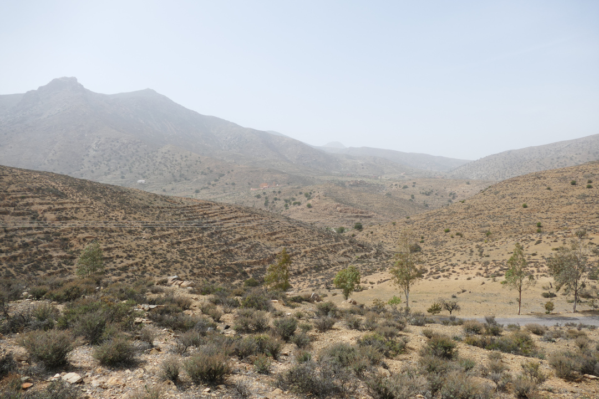
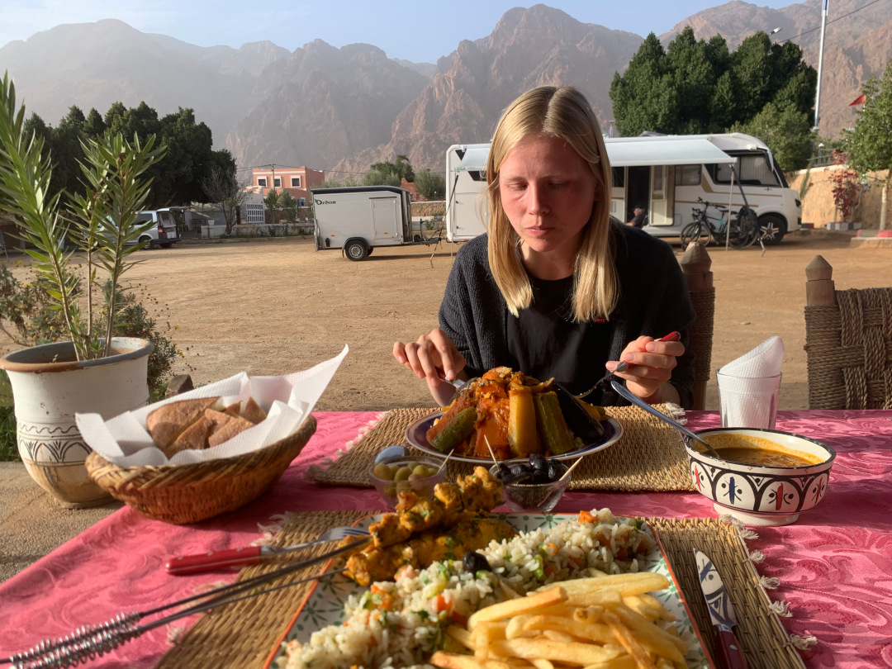
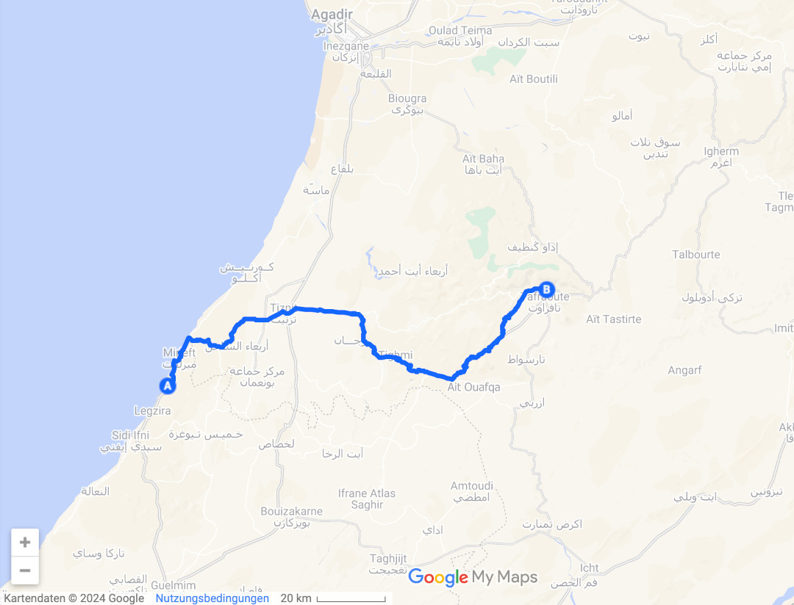
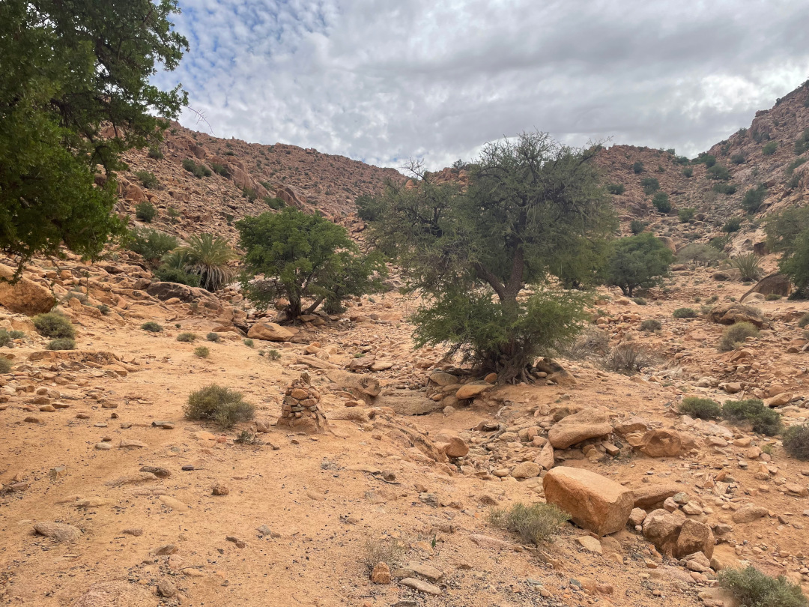
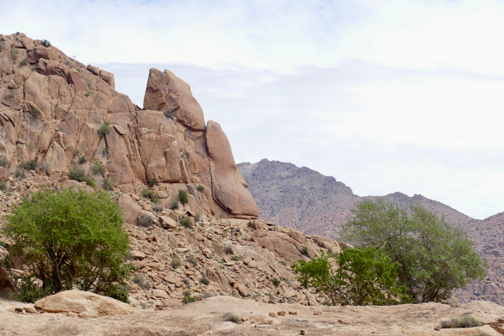
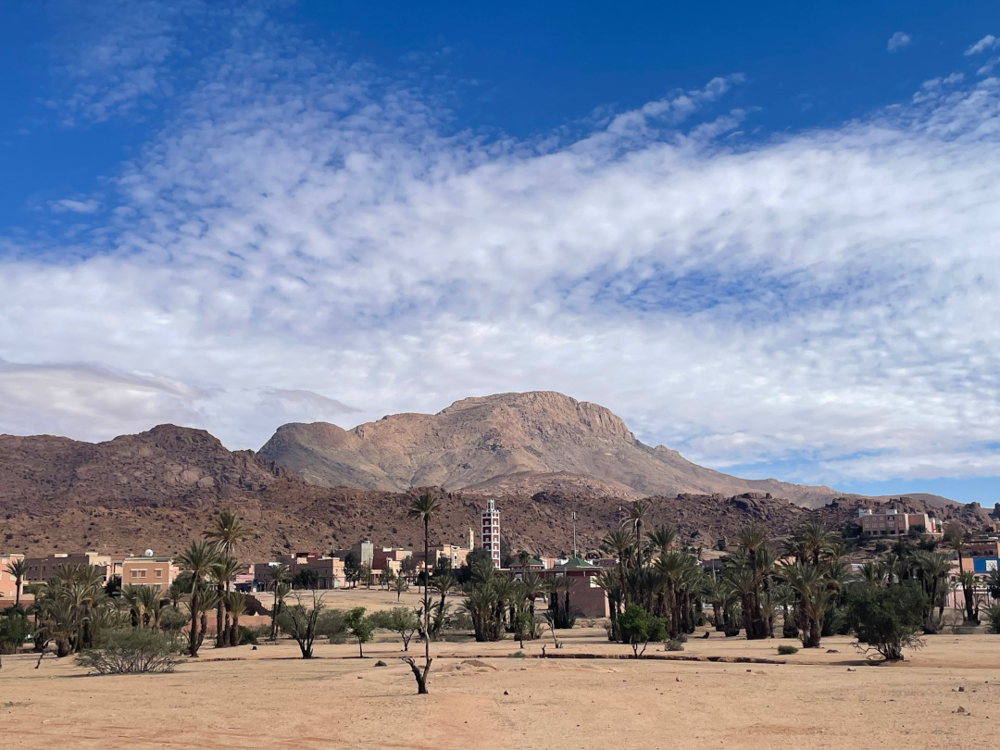

Wir verlassen die Atlantikküste und kommen im westlichen Anti-Atlas und damit in den Bergen an.

<!--more-->

🗓️ 12. März: Der Morgen startet mit frisch auf dem Campingplatz gebackenem Brot und süßen Teilchen und wir verabschieden uns mit einem letzten Spaziergang am Strand fürs Erste von der Atlantikküste. Wir füllen noch unsere Trinkwasserreserven wieder auf und machen uns dann auf den Weg. Das Gute hier unten ist, dass man sich eigentlich kaum verfahren kann, weil man immer der Straße folgt und es nicht besonders viele große Abzweigungen gibt. Unterwegs nutzen wir noch die Chance für eine Autowäsche, denn der Bulli hat es bei dem vielen Staub mittlerweile mehr als nötig. Heute führt unser Weg ins Ammelntal im westlichen Anti-Atlas. Schon unterwegs halten wir an und drehen eine Runde durch die, für uns besondere, hügelige und trockene Landschaft. Heute liegt besonders viel Staub in der Luft und deshalb wirkt alles etwas diesig. Überall im Tal verstreut liegen kleine Dörfer. In einem dieser Dörfer liegt unser Campingplatz für heute, mit Blick auf den Löwenkopf-Felsen. Wir können den einzigen Schattenplatz ergattern, denn Schatten gibt es bei so wenig Bewuchs nur selten. Dann können wir trotz Ramadan im Restaurant essen, nur lieber etwas früher, damit das Fastenbrechen nach Sonnenuntergang in Ruhe begangen werden kann. Gegen die riesigen Portionen kommen wir mal wieder nicht an, geben aber wie immer unser Bestes. Am Abend gehen wir noch eine Runde durch das sehr ruhige Dorf. Wir kriegen eine Karte und Tipps für Ausflüge in der Umgebung. Der Betreiber des Campingplatzes spricht sogar etwas Deutsch, verabschiedet sich allerdings mit einem lockeren „Macht‘s gut, Jungs“ von uns beiden, das ich mal so stehen gelassen habe.

🗓️ 13. März: Wir bleiben noch eine zweite Nacht im Ammelntal, damit wir uns heute in Ruhe Tafraoute angucken können. Als Erstes nehmen wir morgens aber einen der Spazierwege, die uns gestern empfohlen wurden, um sie mit Hund zu gehen. Dann lassen wir es langsam angehen, bis die Sonne so weit gewandert ist, dass unser Bulli wieder im Schatten steht, damit Henry sich den Stress in Tafraoute nicht antun braucht. Heute ist in dem kleinen Ort nämlich Markt und wir wissen, wie es da zugehen kann. Gegen Mittag machen wir uns dann zu Fuß auf den Weg. Gestern wurde uns dazu auch grob die Route beschrieben. Wir sollten eine Piste hinter dem neuen Krankenhaus ansteuern. Nach kurzer Suche finden wir eine Piste, die passen könnte. Als wir an einem alten Flusslauf voller Palmen ankommen, folgen wir diesem jedoch versehentlich. Hinterher stellen wir fest, dass wir ihn nur hätten queren müssen. Den Umweg bereuen wir aber nicht, weil das Tal in dem wir deshalb herumgeklettert sind, sogar noch schöner war als das Paradise Valley. Das Flussbett sorgt für eine grüne Schlucht und sehr viele Palmen. Eine einzigartige Landschaft. Als wir wieder auf dem richtigen Weg angekommen sind, merken wir, dass wir einfach den Steinhaufen folgen müssen. Also laufen wir Steinhaufen suchend mehr oder weniger einfach durch das steinige Gelände und finden so schließlich den Weg nach Tafraoute. Die Wanderung und das Ammelntal sind zumindest bisher unser Highlight in Marokko. Als wir dann über die Hauptstraße von Tafraoute laufen, vorbei an den vielen Lederschlappen, für die der Ort bekannt ist, grüßt Tobi plötzlich jemanden auf der anderen Straßenseite. Ich bin erst verwirrt, aber es ist natürlich die einzige Person, die wir hier kennen, nämlich der Betreiber des Campingplatzes und wie man ihn kennt hat er wieder gute Tipps für uns parat. Wir kaufen noch Obst und Gemüse auf dem Markt, Brot und süße Teilchen in einer Bäckerei und ein paar Dinge in einem kleinen Supermarkt und nehmen dann ein Taxi zurück zum Campingplatz. So müssen wir mit unseren Errungenschaften nicht nochmal die zwei Stunden über den Berg zurück. Dort angekommen springen wir zur Abkühlung in den Pool und machen uns einen entspannten Abend.

