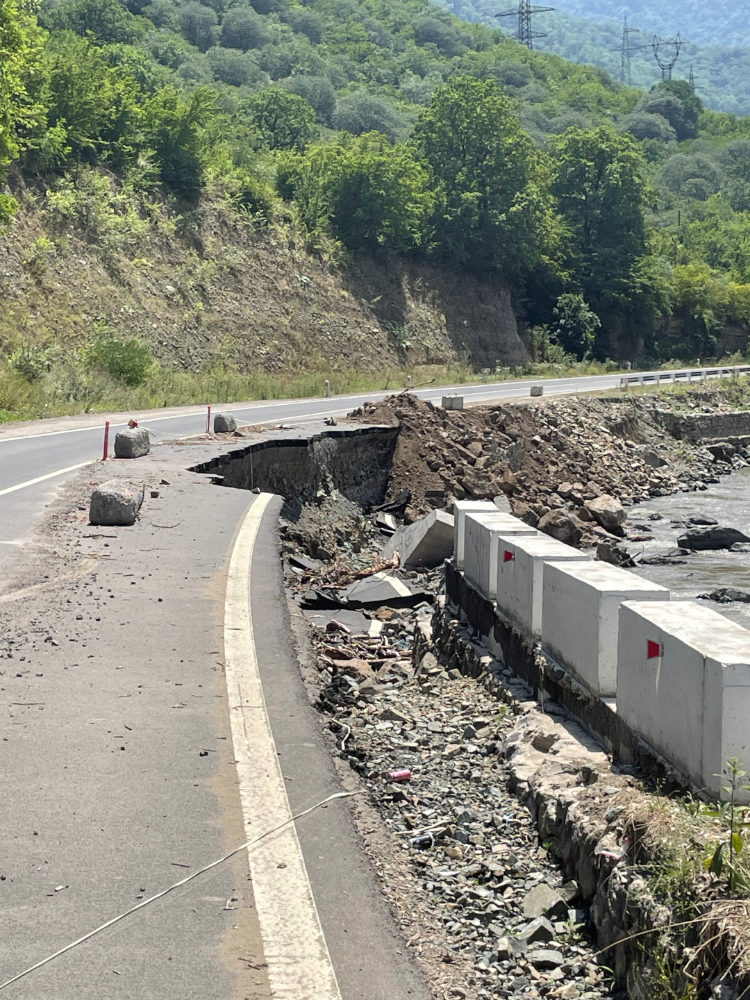
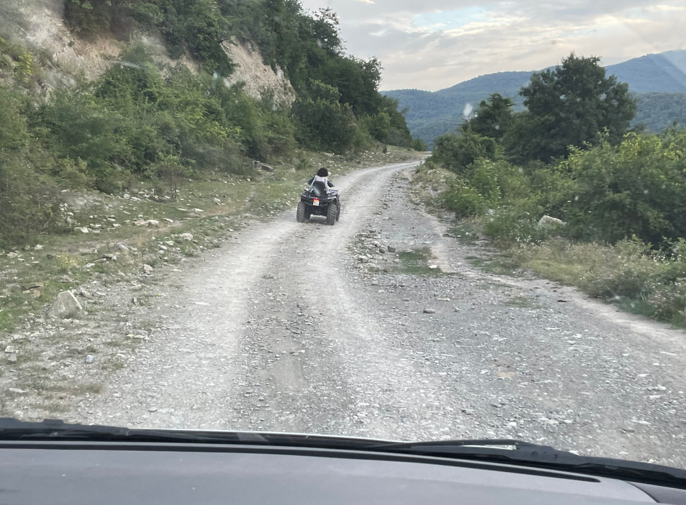
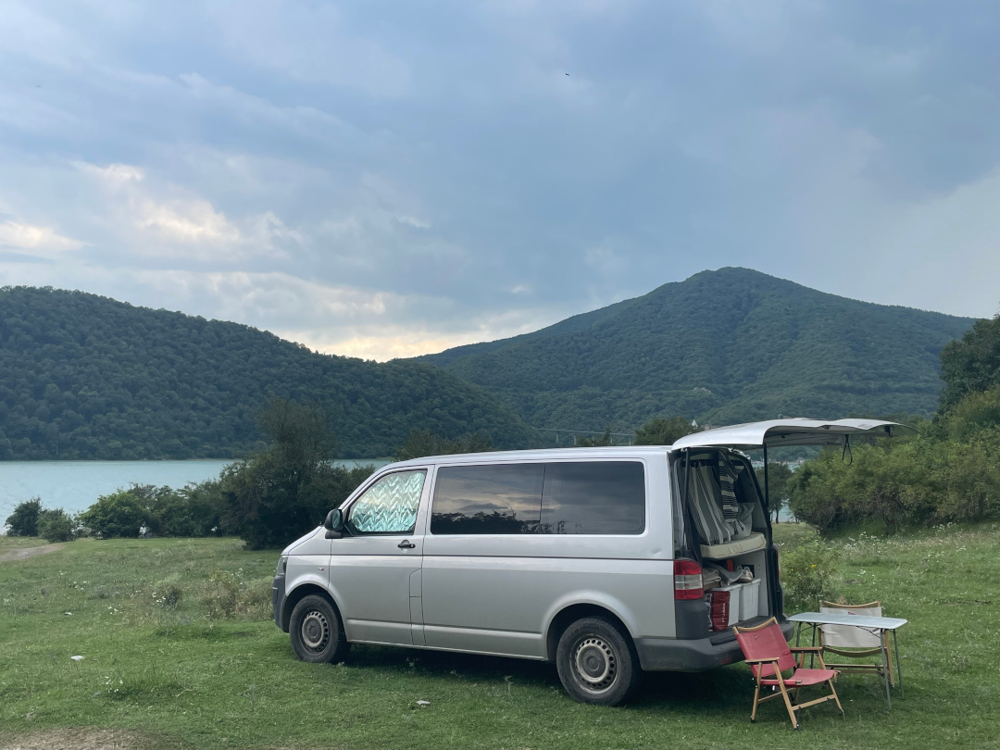
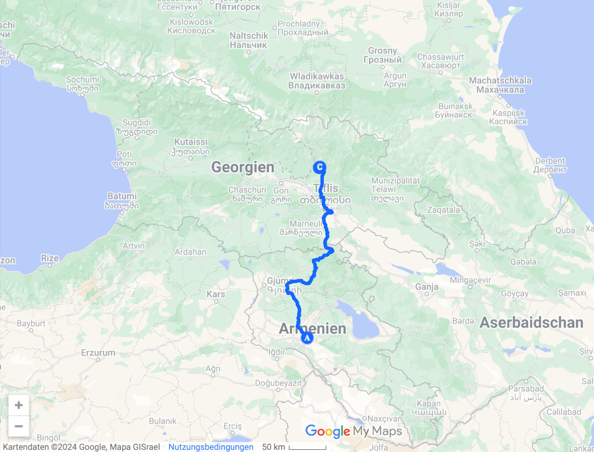
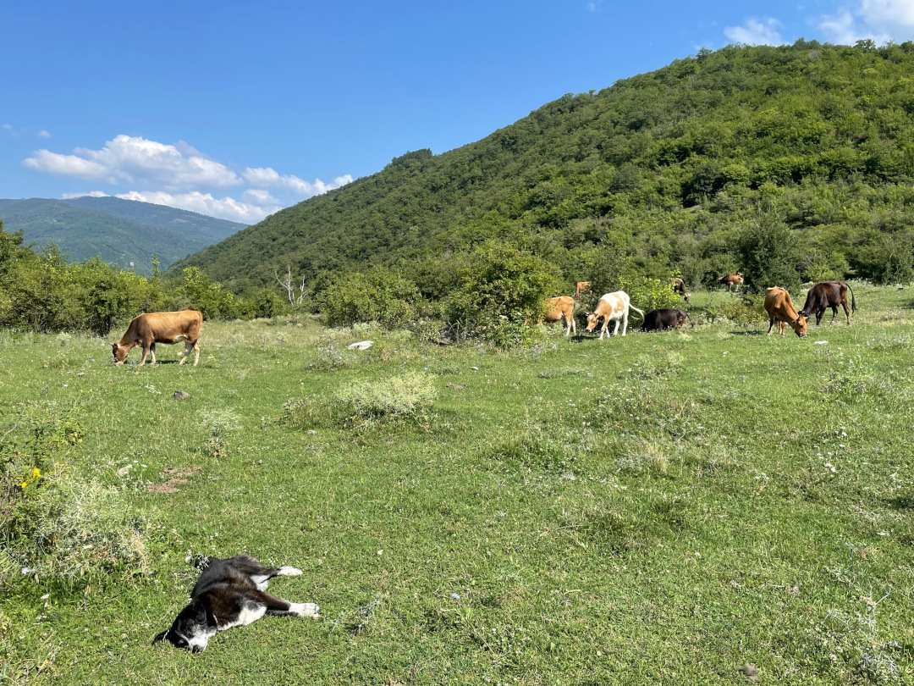
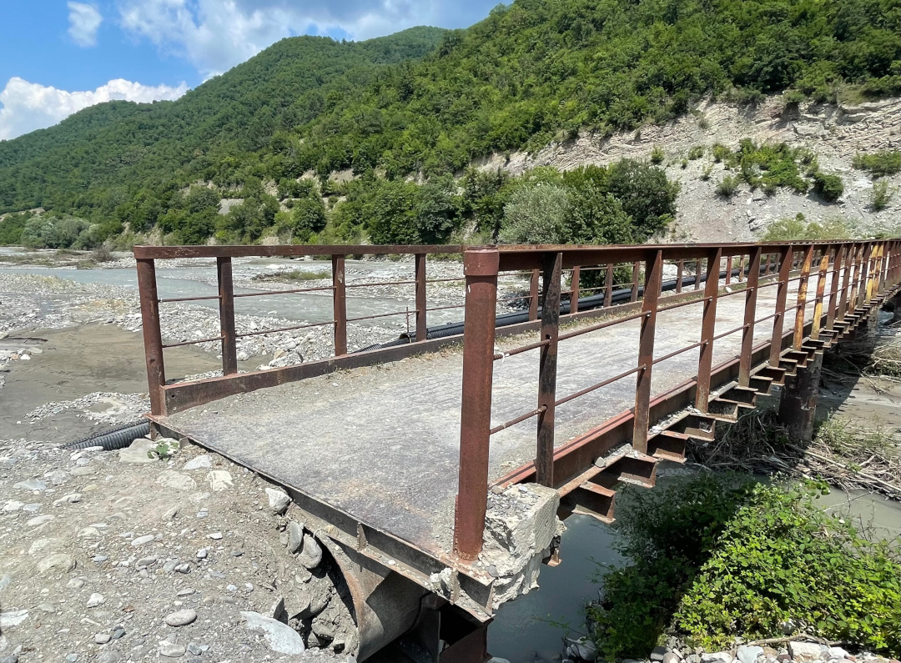
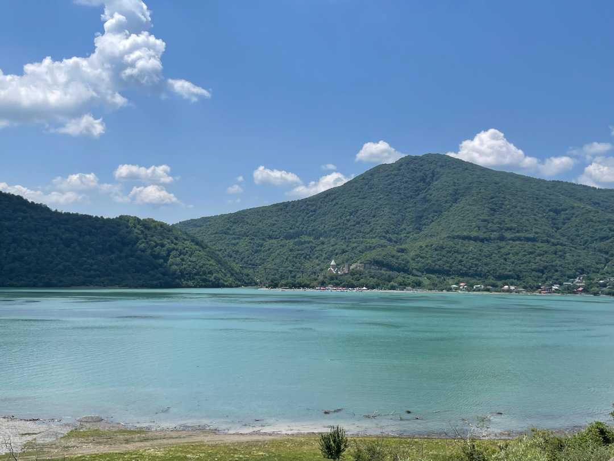

Nach unserer Reise durch Armenien geht es jetzt zurück nach Georgien. Nachdem wir auf dem Hinweg nur schnell durchgefahren sind, wollen wir uns das Land jetzt in Ruhe anschauen.

<!--more-->

🗓️ 12. Juli: Wir gönnen uns ein letztes Frühstück im Hotel in Jerewan. Dann drehen wir mit Henry eine Runde durch den üblichen Circular Park, der sich fast um den ganzen Ring des Stadtkerns zieht. Sowas könnte Dortmund auch ruhig mal anlegen. In Jerewan hatten wir auch echt keine Probleme mit Straßenhunden. Es waren, zumindest um unser Hotel herum und im Park, nur sehr wenige unterwegs und die haben sich nicht groß für Henry interessiert. Als wir zurück sind, checken wir aus. Am Parkplatz haben wir die Gewissheit, dass wir über den Tisch gezogen wurden. Irgendein Otto hatte sich ja an den Eingang des kostenfreien Parkplatzes gesetzt und Geld verlangt. Wir hatten dann mit ihm vereinbart, dass unser Auto zwei Tage stehenbleibt und es für das Geld in der Zeit gewaschen wird. Long story short: Schon von weitem erkennt man unseren Bulli vor allem an seinem Dreck. Zum Glück ging es nur um einen kleinen Betrag und so ärgern wir uns nicht lange, sondern fahren schnell los, denn wir wollen heute zurück nach Georgien und haben deshalb einige Kilometer und die Grenze vor uns. Außerdem führt unser Weg über die M6, die Ende Mai von starken Regenfällen und heftigen Erdrutschen betroffen war. Der Zustand ist deshalb nicht ganz klar, aber wir haben Glück. Wir sehen zwar immer wieder vom Fluss ausgehöhlte Teile und es gibt noch ungeteerte Abschnitte, an denen noch gebaut wird, aber insgesamt ist der Zustand besser als wir gedacht hätten. An der Grenze angekommen, muss ich für die Ausreise aus Armenien erstmal wieder aussteigen. Hier läuft aber alle sehr geordnet und zügig ab. Im Niemandsland steige ich dann nochmal ein und wir fahren zusammen über den Fluss. Dann muss ich wieder raus für die Einreise nach Georgien. Die Grenze ist für uns dieses Mal wirklich easy. Für Tobi und den Bulli gibt es nicht mal eine Zollkontrolle. Sie werden einfach durchgewunken und warten deshalb schon auf der anderen Seite auf mich, als ich das aktive Anstehen wieder überstanden habe. Bisher haben wir auf unserer Reise angesichts der vielen Kilometer noch nicht viele Unfälle gesehen, aber heute gleich drei. Die Überholmanöver in Kurven bleiben halt riskant. Wir fahren einmal quer durch Tiflis und stehen deshalb auch viel im Stau. In einer Mall mit Tiefgarage erledigen wir noch den Einkauf für die nächsten Tage. Bei allem brauchen wir die Hilfe eines freundlichen Mitarbeiters. Erst klemmen die Einkaufswagen zusammen, dann geht der Aufzug nicht und dann fahren wir auch noch falsch rum aus der Garage raus. Er bleibt aber geduldig und begleitet und einfach überall hin. Danach geht es für uns weiter nach Norden bis zur Wehrkirche in Ananouri. Auf der anderen Seeseite soll es ein paar schöne Orte zum Freistehen geben. Über eine echte Holperpiste geht es für uns zu einer Brücke, aber dann plötzlich keine Chance mehr. Wir würden aufsetzen und die Brücke ist auch zu schmal für uns. Deshalb müssen wir noch ein paar Kilometer weiter nördlich eine andere Brücke nehmen und sind langsam schon etwas durch von diesem Tag. Nach fast zehn Stunden im Auto auch wenig verwunderlich. Erst finden wir einfach keinen guten Platz und als wir halten, um uns einen anzugucken, der endlich nicht so schlecht aussieht, kommt gerade ein Quad mit einem Mann und seiner Tochter. Die beiden stellen sich vor, fragen was wir vorhaben, und dann wollen sie uns unbedingt zu einem besseren Platz bringen. Sie fahren vor, wir holpern etwas langsamer hinterher. Wir haben ja immer noch einen alten VW Bulli unterm Hintern und kein Quad. Sie warten aber immer wieder auf uns. Ungefähr eine halbe Stunde später sind wir da und sie haben nicht zu viel versprochen. Zwischendurch fragt man sich ja schon, wem man da gerade folgt. Vor uns liegt jetzt aber ein flaches großes Gelände mit Wiesen. Henry kann also perfekt flitzen und ein paar Zelte sind auch schon hier. Die beiden fragen, ob wir noch etwas brauchen, geben uns sogar noch ihre Telefonnummer, damit wir uns melden, wenn was ist, und dann verabschieden wir uns. So kommen wir um halb 8 endlich an. Wir essen nur noch was und freuen uns aufs Bett, nachdem wir ewig unterwegs waren.

🗓️ 13. Juli: Eigentlich wollten wir heute noch weiter in den Norden zur Dreifaltigkeitskirche Gergetier, aber irgendwie haben wir nach gestern noch keine Lust auf Autofahren. Deshalb bleiben wir einfach, wo wir sind, schlafen aus und lassen es langsam angehen. Wir suchen uns ein schattiges Plätzchen unter den Bäumen und frühstücken in Ruhe. Dann gehen wir eine große Runde mit Henry, zurück bis zu der Brücke über den See, bei der wir gestern abbrechen und umkehren mussten. Und auch heute sehen wir: Gut, dass wir umgedreht sind. Die Brücke ist wirklich viel zu schmal und auf der anderen Seite gibt es gar keinen richtigen Weg, nur einen kleinen Pfad für Fußgänger und Kühe. Wieder zurück am Bulli brauchen wir erstmal ne Pause und erledigen dann ein paar Sachen. Ab morgen haben wir nämlich hohen Besuch und bald fliegt Tobi schon für eine Woche nach Deutschland. Ein paar Sachen gibt es also vorzubereiten. Im Laufe des Tages ziehen Wolken auf. Erst sind wir froh über die Abkühlung, aber später gewittert und regnet es dann sogar noch. Wir verkriechen uns deshalb eine Weile im Bulli. Abends kochen wir dann noch mit Blick auf den See und genießen die Ruhe hier, bevor es morgen wieder in die wuselige Hauptstadt geht.

