Hier überlassen wir das Zepter Steffen, der den wohl besten Bericht der Reise schreibt. Ευχαριστώ Στέφεν Μικρό!

<!--more-->

🗓️ 12. August: Der Tag beginnt unerwartet früh, quasi noch nachts, da Tobi als Einziger von uns dreien die bekanntlich lauten Notfallbenachrichtigungen bezüglich des am Vortag ausgebrochenen Waldbrands erhält, der nun außer Kontrolle geraten und mittlerweile auch in den deutschen Medien sehr präsent ist. Wir sind aber weit genug entfernt und in Sicherheit und können die Augen nochmal für ein paar Stunden schließen. Nach einem käselastigen Frühstück bestehend aus Grillkäse, Käsetoast, Babybel und käsiger Pizza vom Vortag machen wir uns gestärkt auf den Weg in Richtung Euböa. Die Straße dorthin ist zu unserem Glück noch befahrbar, einzelne Brandherde wüten jedoch deutlich sichtbar in unmittelbarer Nähe. Euböa, die zweitgrößte Insel Griechenlands, wurde 2021 Opfer eines verheerenden Waldbrands, der sage und schreibe 50.000 Hektar Pinienwald zerstörte. Das ist natürlich auch 3 Jahre später noch überall sichtbar. Auf unserer Strecke, die uns über Landstraßen durch junge, aufgeforstete Wälder und viel Brachland führt, sehen wir alle paar Kilometer Feuerwehrleute, die die Umgebung beobachten, um Brandherde frühzeitig zu entdecken. Nach staubedingten 3,5 Stunden erreichen wir den Ort Agkali und beziehen unsere direkt am Meer gelegene Unterkunft. Die gute Lage muss natürlich genutzt werden und eine Abkühlung haben wir bei 36°C dringend nötig. So geht es für uns direkt ins Meer, obwohl die Wellen ihr bestes tun Teile der Reisegruppe durch beständiges Umwerfen und Zurückspülen daran zu hindern. Der Abend klingt dann in einer der zahlreichen Tavernen, umgeben von größtenteils einheimischen Touristinnen und Touristen, und später bei selbstgemachtem Bifteki im Garten unserer Bleibe aus.

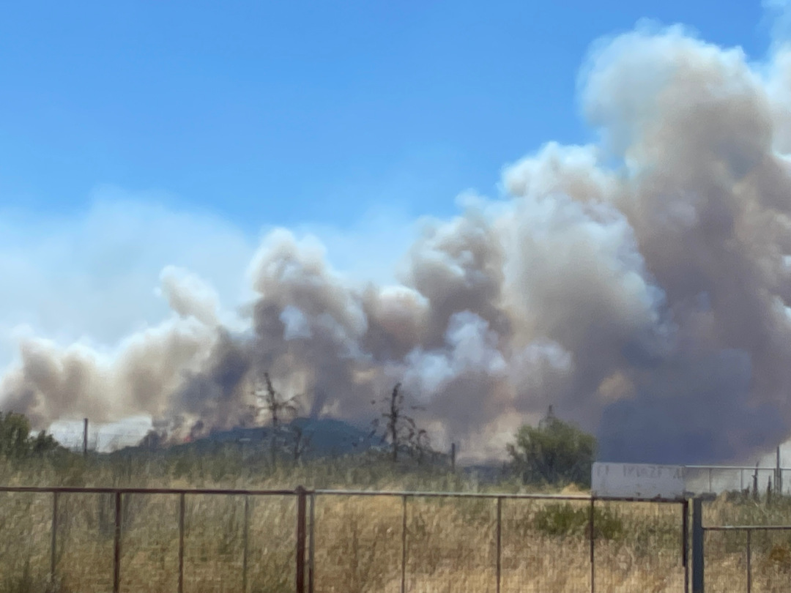

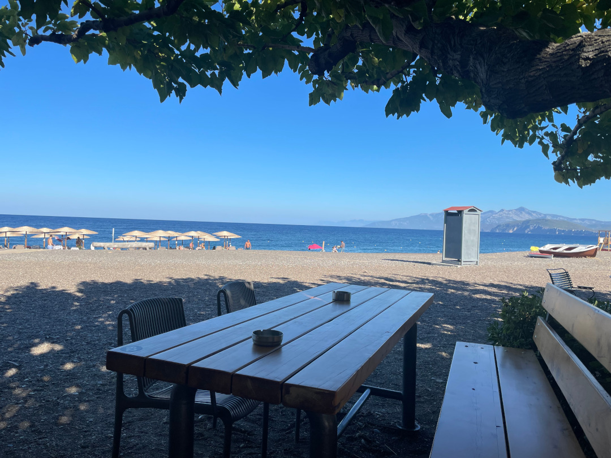

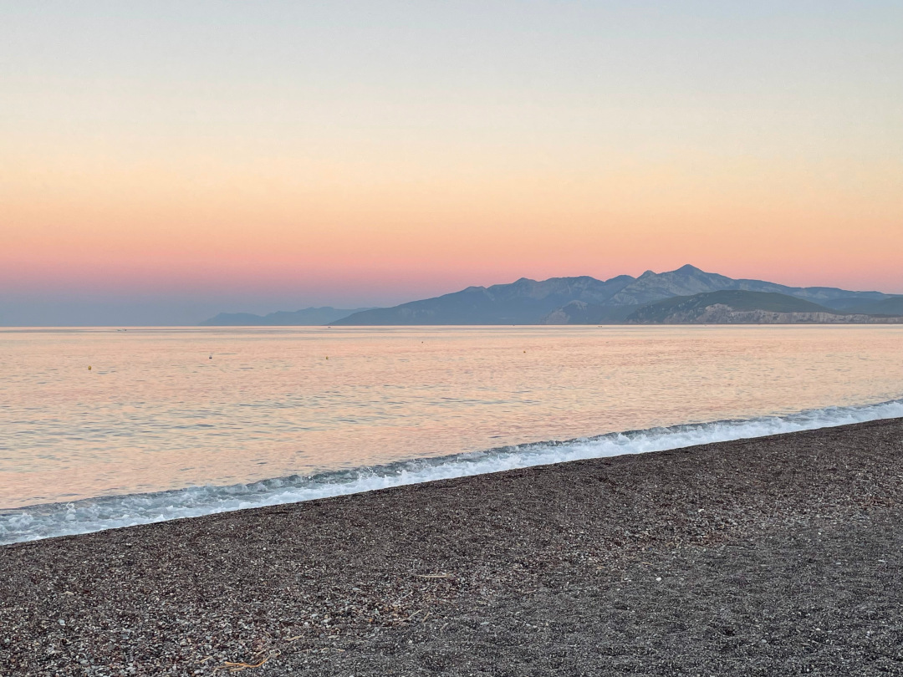

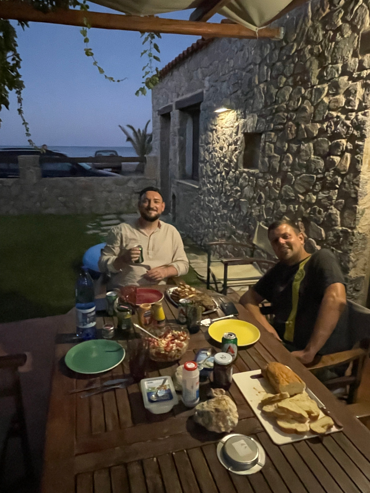

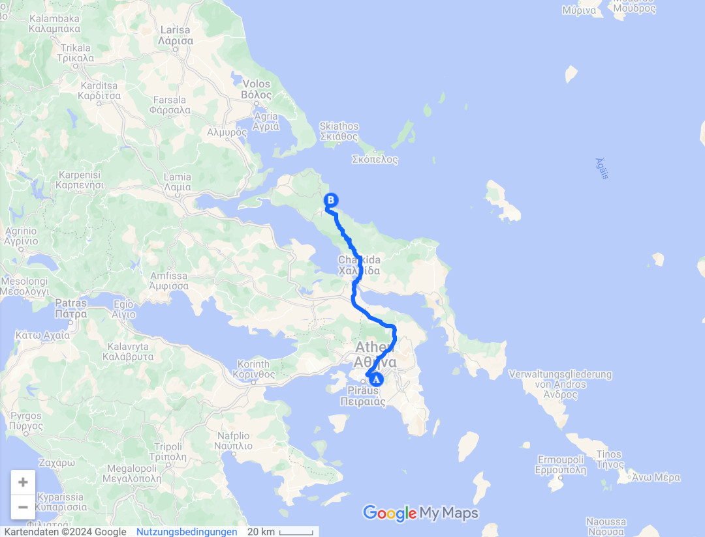

🗓️ 13. August: Der nächste Morgen beginnt für uns, diesmal bei wesentlich ruhigeren Bedingungen, erneut im Meer. Daran könnte ich mich wirklich gewöhnen. morgens als allererstes schwimmen zu gehen und dabei nicht einmal ein Handtuch mitnehmen zu müssen, weil man in unter einer Minute Fußweg wieder zu Hause ist. Nach dem Frühstück laufen wir in brütender Hitze über einen Hügel zu einem entlegenen, schmalen Strand, der an beiden Seiten von Meer umgeben ist. Auch Henry findet ein schattiges Plätzchen und scheint sich sehr wohlzufühlen. Wir genießen unseren einsamen Platz und wollen die Schönheit des Ortes mit der Drohne einfangen. Um Tobis Flugkünste herauszufordern, kommt mir der brillante Einfall, dass er die Drohne durch meine Beine fliegen lassen soll. Hannas Hinweis, dass die Rotoren an der blanken Haut etwas schmerzhaft sein könnten, lächele ich in Gottvertrauen auf Tobis Künste nur so lange weg, bis die Rotoren an meiner blanken Haut etwas schmerzhafte Schnittwunden hinterlassen. Aber sei es drum, so kann ich das salzige Meerwasser auch mit mehreren Sinnen wahrnehmen. Die Flut zwingt uns schließlich unseren schattigen Platz aufzugeben und wir finden Zuflucht vor einer entlegenen Kirche, die von schattenspendenden Bäumen umgeben ist. Nach einer Partie Schach laufen wir zurück in den Ort und beenden den Abend bei einigen Bieren und weiteren Partien in der Taverne unseres Vertrauens.

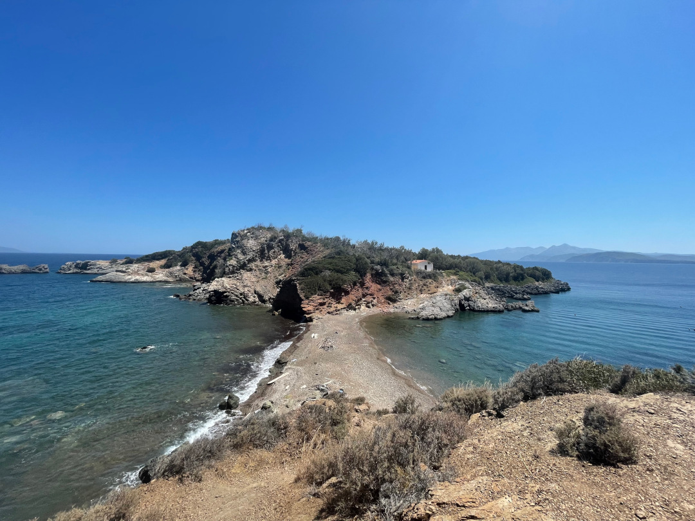

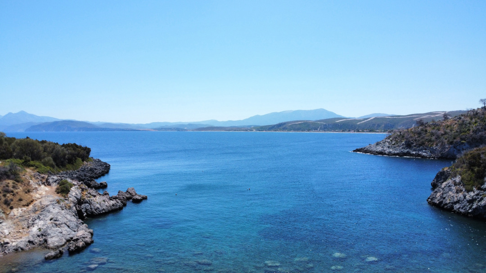

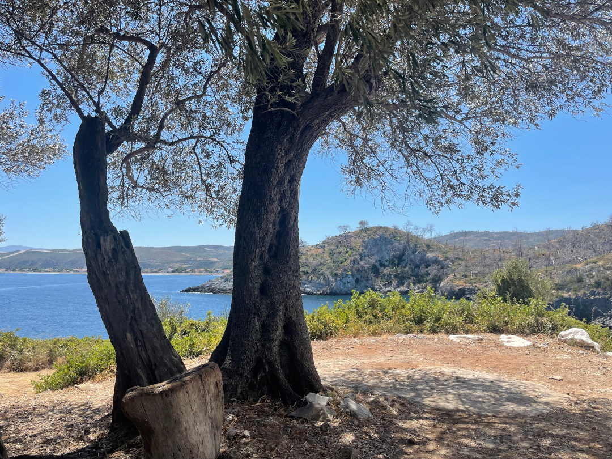

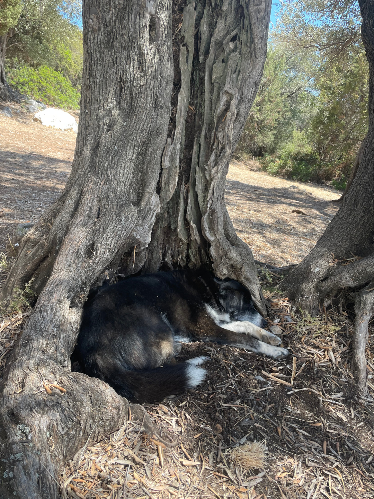

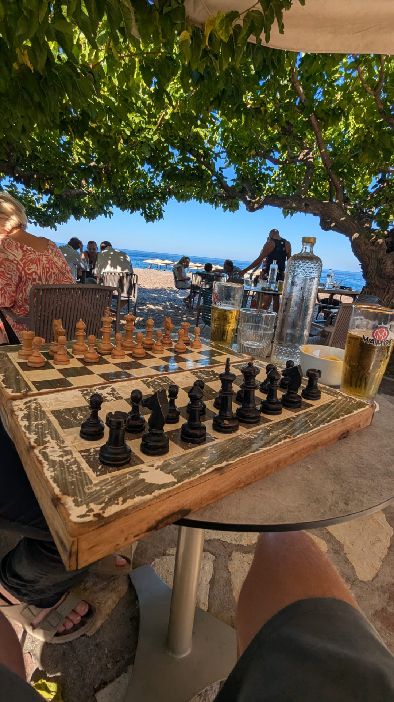

🗓️ 14. August: Wir starten den nächsten Tag erneut im Meer und frühstücken danach ausgiebig, bevor wir zurück nach Athen in die Nähe des Flughafens fahren. Der Großbrand ist mittlerweile gelöscht, sodass die Fahrt problemlos verläuft. Unsere nächste Unterkunft besticht durch eine schöne Terrasse mit Blick auf das Meer. Der Versuch sich Essen telefonisch oder per Chat liefern zu lassen, scheitert kläglich. So müssen wir mit dem Bulli nach Artemida fahren, um Getränke im örtlichen Supermarkt zu kaufen und unser Essen vor Ort zu bestellen. Wir lassen den verbleibenden Tag gemütlich auf der Terrasse mit Gyros, Bier und Spielen verstreichen und gehen früher als an den vorherigen Tagen schlafen, da mein Flug in aller Herrgottsfrühe zurück nach Frankfurt geht.

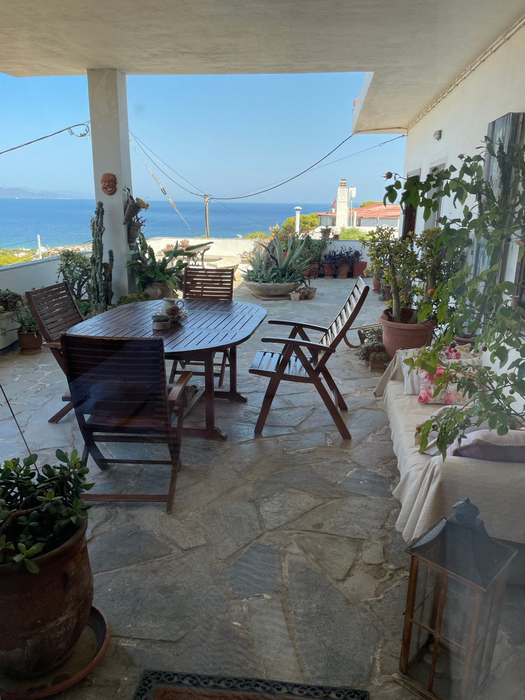

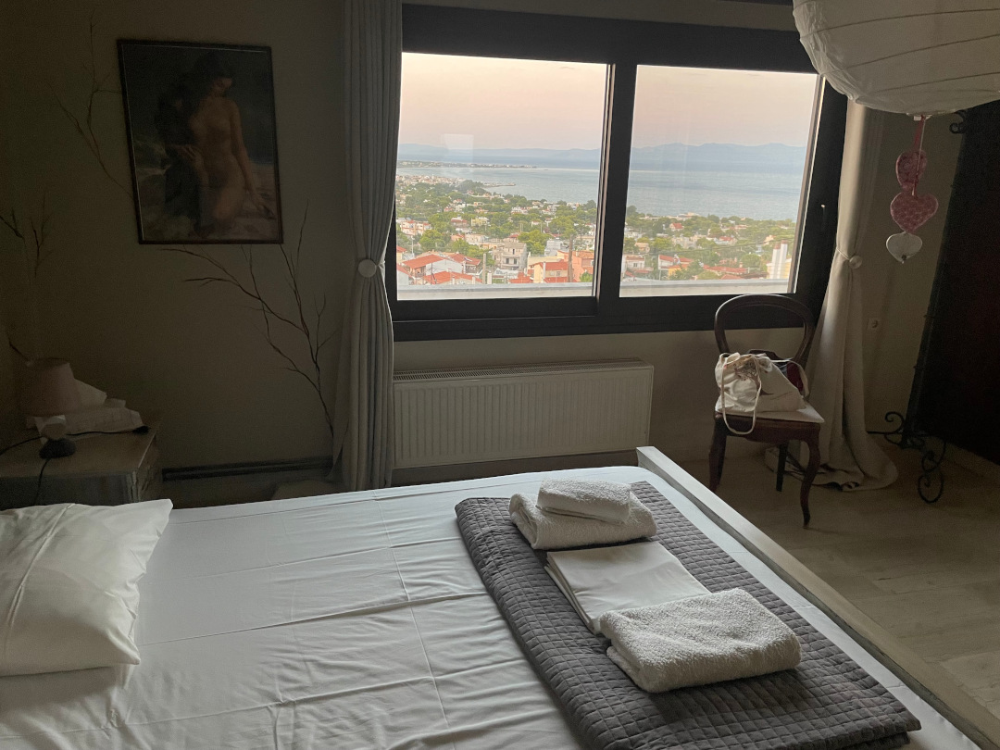

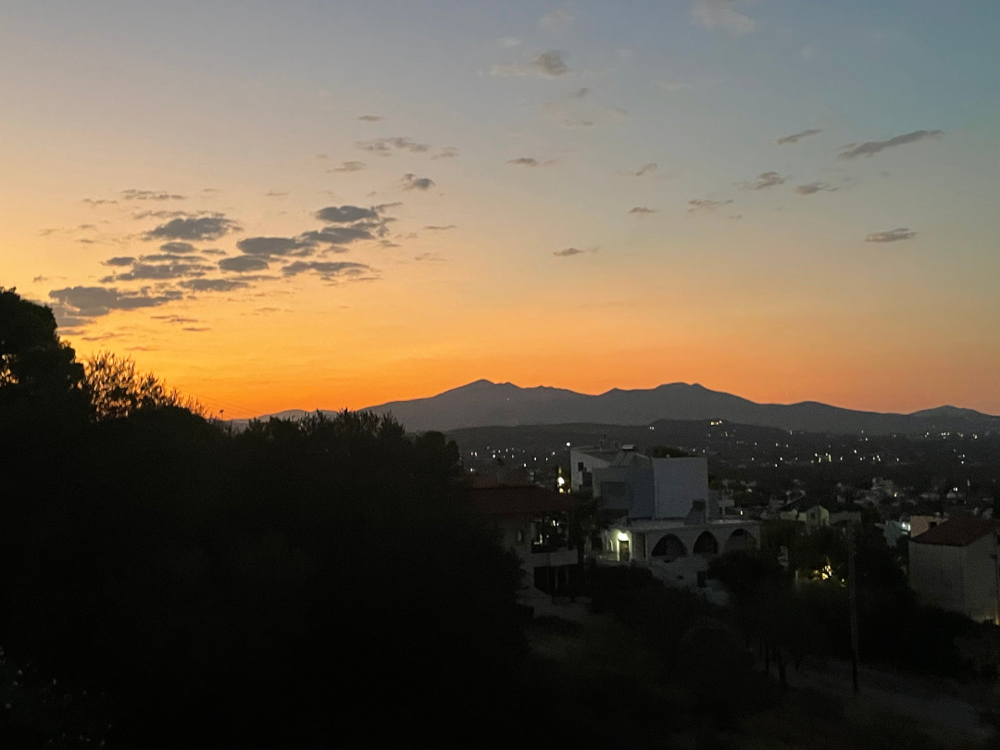

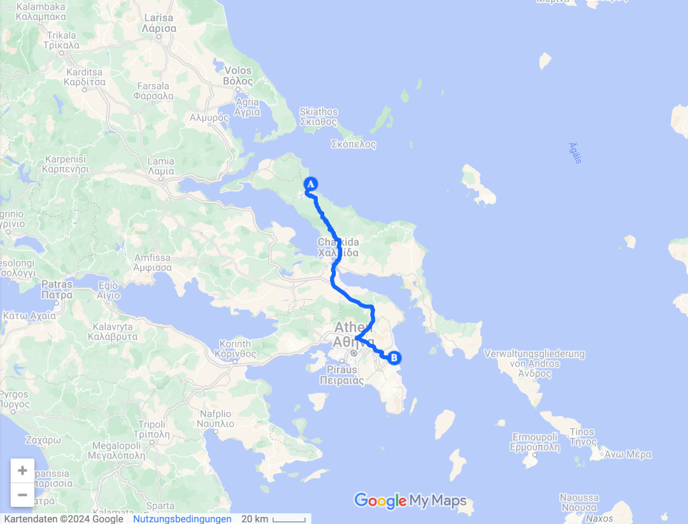