Auf unserem Weg nach Osteuropa geht es für ein paar Tage durch den Norden Italiens.

<!--more-->

🗓️ 13. April: Vom Campingplatz gehen einige gute Wanderwege ab. So können wir noch vor der Weiterfahrt eine kleine Wanderung mit Henry laufen. So schnell wie wir nach Frankreich gekommen sind, so schnell verlassen wir das Land dann auch wieder. Der nächste Stopp lautet Turin. Auf der Fahrt gehen wir ein letztes Mal für ein echtes Baguette in Frankreich einkaufen und gönnen dem Bulli eine Freiluft Autowäsche, die auch dringend nötig ist. Eigentlich sind vier Stunden Fahrt angesetzt, die aber leider durch viel Stau verlängert werden. Unsere Route führt am Mont Blanc vorbei durch den Frejus Tunnel, der Frankreich und Italien auf knapp 3.000 m Höhe verbindet. Vor dem Tunnel und insbesondere vor der Mautstation staut es sich leider etwas. Der Plan war, dass ich um 18 Uhr noch das Turin-Derby sehen kann. Das Ticket habe ich schon vor einigen Tagen im Vorverkauf gekauft, weil es sonst ausverkauft gewesen wäre. Daher ist Ausfallenlassen auch keine Option. Da wir aber erst gegen halb fünf an unserem Campingplatz sein sollen und man von dort noch mindestens 1,5 h bis zum Stadion benötigt, lässt Hanna mich an einer Bahnstation in der Nähe raus. Das Zugticket ist mit 2,40€ super fair, schließlich fahre ich auch ca. 30 km. Hanna fährt weiter zum Campingplatz und ich erreiche gegen 17 Uhr Turin. Ich laufe die 3,5 km zum Stadion, in der Hoffnung etwas von der Derbystimmung mitzuerleben. Stattdessen lande ich auf einem Trödelmarkt, der sich aber auf jeden Fall sehen lassen kann. Erst kurz vor dem Stadion merkt man, dass heute der FC Turin gegen Juventus Turin spielt. Das Olympiastadion ist mit knapp 30.000 Fans ausverkauft. Nach vielen Fußballspielen in Portugal und Spanien tut es gut, wieder in einem Land mit gelebter Fankultur zu sein. Es sind Auswärtsfans dabei, es gibt Fankurven und Bier im Stadion. Das Spiel an sich ist dafür sehr langweilig und endet leider 0:0. Für den FC Turin ist das mit Sicherheit ein Erfolg. Für Juventus wohl eher weniger. Abgesehen vom Spiel hat sich der Ausflug aber auf jeden Fall gelohnt. Mein eigentlicher Platz im Stadion ist schon belegt und ich möchte lieber einem Turiner den Platz lassen. Ich kann improvisieren, denn es ist ja sein Derby. Ich stelle mich auf eine Treppe und warte jede Minute angesprochen zu werden, dass ich Platz machen soll. Aber überall stehen Menschen: auf Treppen, auf Zäunen und auf Betonklötzen. Trotzdem sind alle Sitzplätze belegt. Zum Glück gibt es hier kein Fluchtwegkonzept – dann können auch noch ein paar mehr Zuschauer ins Stadion. Jeder im Stadion (ausgenommen ich) feuert eine der beiden Mannschaften an. Neutrale Zuschauer gibt es quasi nicht und es ist viel Feuer auf den Rängen. Leider gibt es kein Tor. Das hätte noch gefehlt. Nach dem Spiel beeile ich mich, weil ich um 20:45 Uhr den Zug zurück erreichen muss, was auch so weit klappt. Zurück am Provinzbahnhof Alpignano dann leider die Ernüchterung: kein Bus, kein Taxi, kein E-Roller. Aber leider muss ich noch 6 km zum Campingplatz, die ich dann leider zu Fuß antreten muss. Mittlerweile ist es dunkel und mein Akku fast leer, aber ich schaffe es nach circa einer Stunde zum Campingplatz. Dann die nächste Ernüchterung, weil der Platz komplett abgesperrt ist, was auch Hanna daran gehindert hat mich abzuholen. Das Tor will einfach nicht aufgehen. Ich überlege mir schon, wie ich auf den Platz einbrechen kann, dann geht ein Fenster auf und jemand öffnet das Tor, ohne zu wissen, wer ich bin und was ich will. Mir soll es recht sein. Nach einer Dusche wird dann noch etwas entspannt und gegessen.

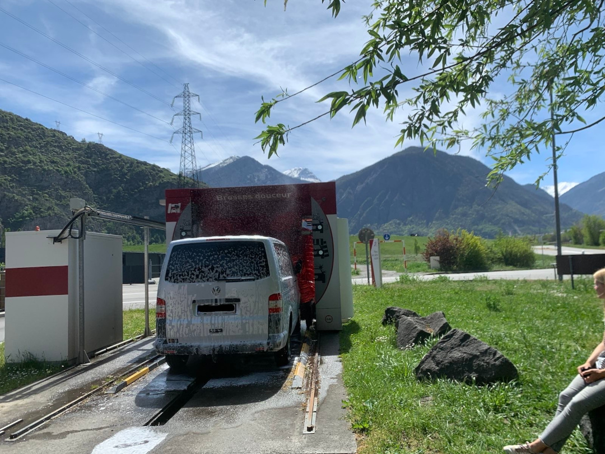

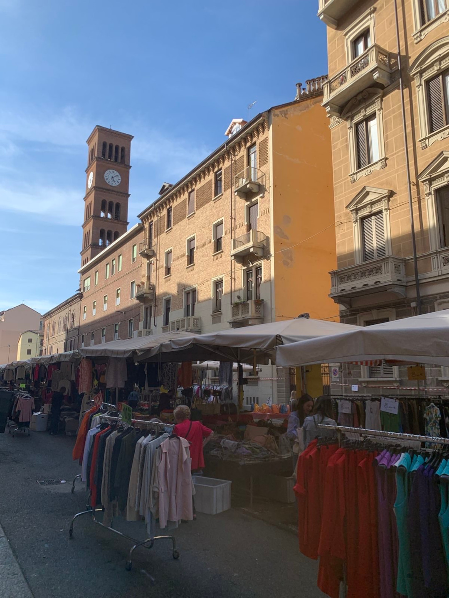

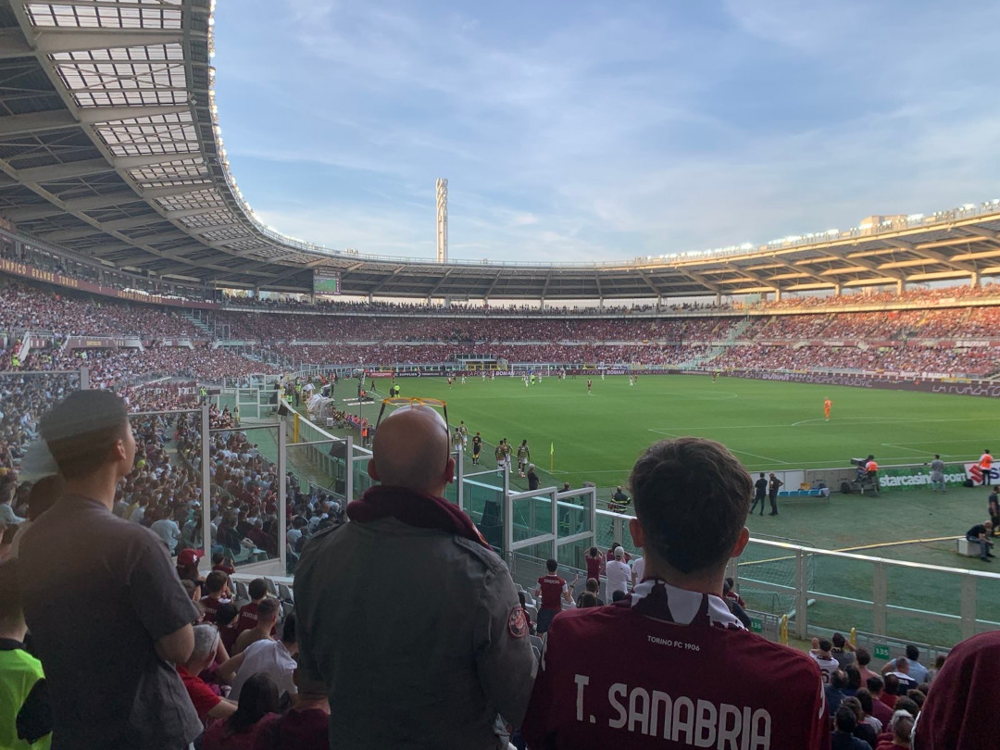

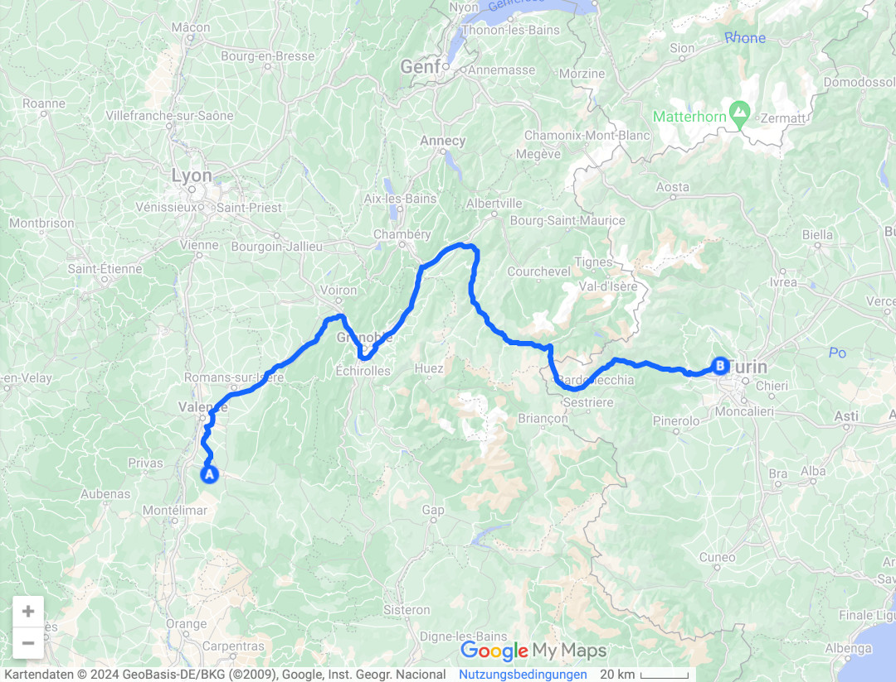

🗓️ 14. April: Dank meiner Wanderung gestern Abend kenne ich nun die besten Henry-Runden in Alpignano. Das nutzen wir heute Morgen direkt aus. Es ist auch mal schön alles im Hellen zu begutachten. Danach geht es weiter in Richtung Osten. Unser Ziel für heute ist der Ledrosee, nordöstlich vom Gardasee. Nachdem wir gestern über 100€ Maut bezahlen mussten, beschließen wir den Rest in Italien über mautfreie Straßen zu fahren und tingeln für die 300 km fast sechs Stunden über italienische Landstraßen. Wir freuen uns, wenn wir bei den großen Städten wie Mailand und Brescia kurz auf die Autobahn fahren können, weil es hier meistens mautfrei ist und mal keine Kreisverkehre im Weg sind. Wir fahren den Gardasee von unten einmal bis nach ganz oben und sind froh nicht hier bleiben zu müssen. Es ist super voll und die Straßen sind verstopft. Uns kommt ein Bus aus Flensburg entgegen, der im Tunnel feststeckt. Mit vereinten Kräften und Rücksichtnahme von allen geht es aber langsam für ihn voran. Viele Kilometer wird er aber nicht geschafft haben. Größtenteils kommen uns aber Italiener entgegen, die wohl das Wochenende oder den Sonntag am Gardasee genutzt haben. Für uns geht es von Riva del Garda noch ein Stück weiter zum Ledrosee. Der ist zwar deutlich kleiner, aber dafür in der Nebensaison kaum touristisch und dennoch schön in den Bergen gelegen. Der Anblick bei Sonnenuntergang entschädigt für die Strapazen der Anreise. Wir packen Henry und die Badehose und gehen noch einmal am See entlang. Wir sind mutig genug reinzuspringen, was wirklich super kalt ist. Bisher das kälteste Gewässer der Reise, aber es tut gut und kühlt von innen. Weil es gestern zeitlich nicht für eine italienische Pizza gereicht hat, wollen wir es heute nachholen. Wir finden ein Restaurant, in dem es leckere, große und günstige Pizza gibt. Selbst Henry bekommt nicht nur Wasser, sondern auch Hundekuchen. Nach einem letzten Spaziergang am See beenden wir den Tag.

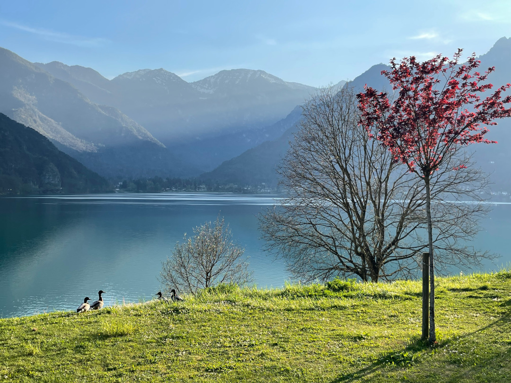

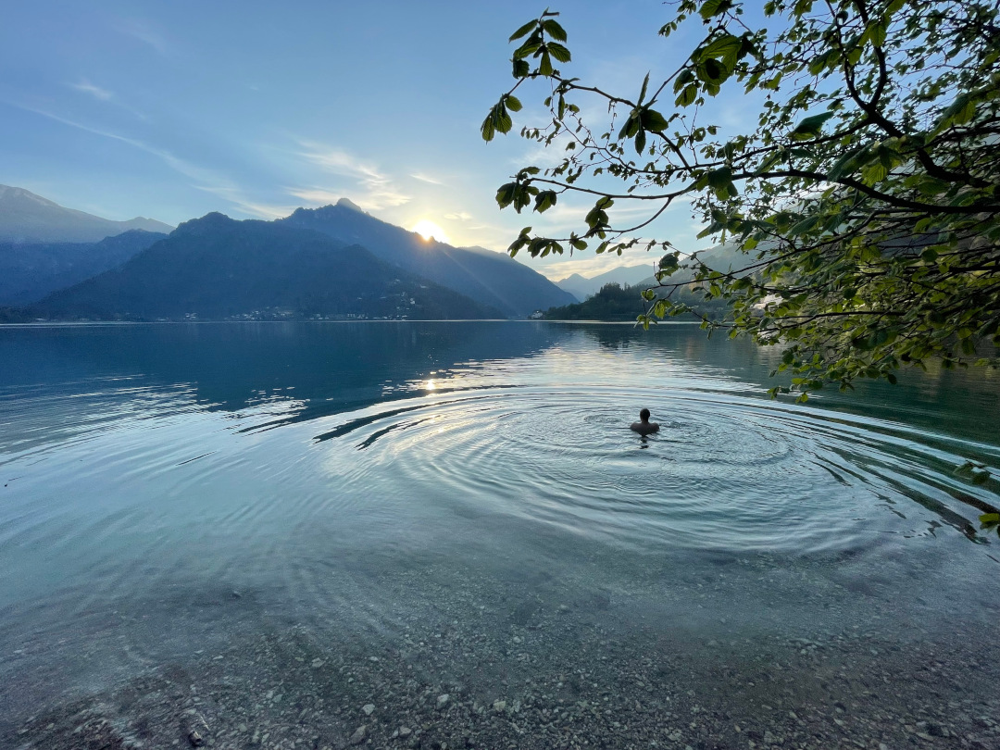

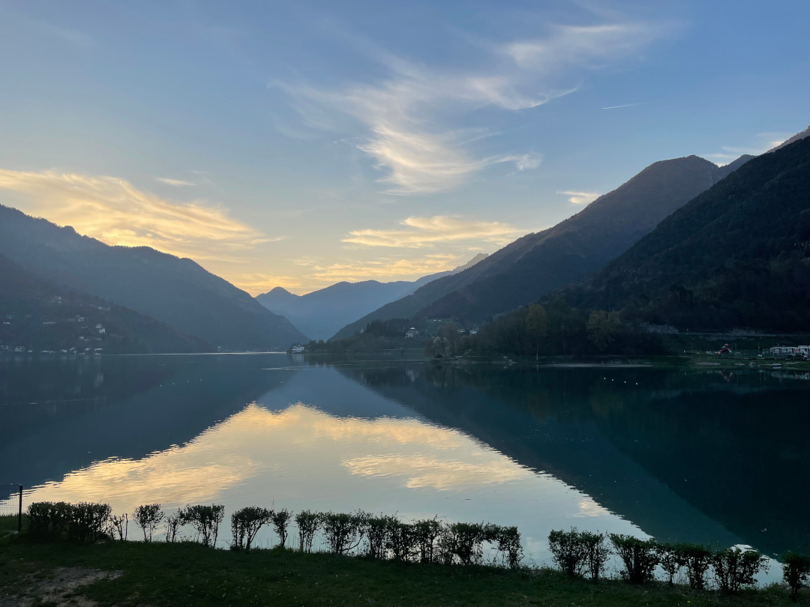

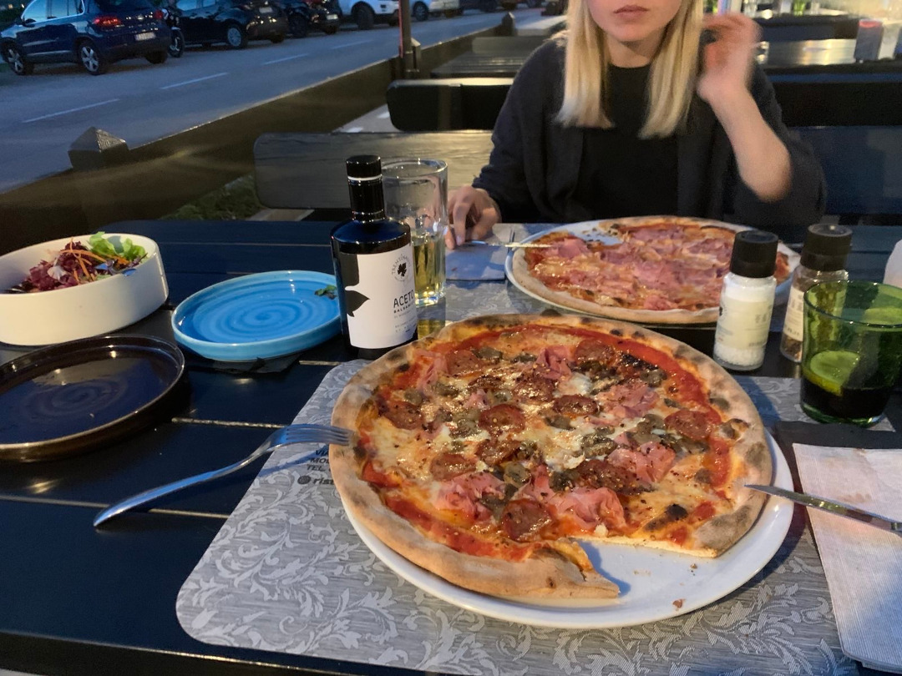

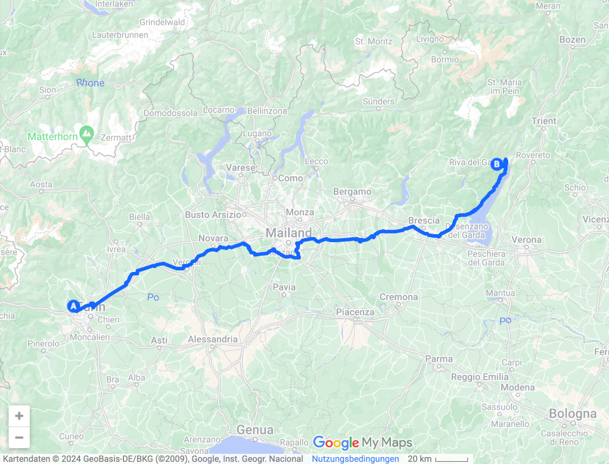

🗓️ 15. April: Seit langem startet ein Tag mal wieder, ohne direkt alles einzupacken und weiterfahren zu müssen. Weil es uns hier so gut gefällt, entscheiden wir nämlich eine zweite Nacht zu bleiben. Wir lassen den Tag entspannt starten und frühstücken mal nicht im Auto, sondern im Grünen. Wir suchen uns eine kleine Wanderung raus und starten. Wir wollen etwas am See entlang wandern und dann auf einen Berg mit Ausblick auf den See. In Summe circa 10 km und etwas über 300 Höhenmeter. Der Ledrosee ist schon auf knapp 650 Metern Höhe, so dass wir auf circa 1.000 Meter hochwollen. Leider ist die westliche Umfahrung des Sees gesperrt und der ganze Verkehr muss östlich umgeleitet werden. Da wollten wir leider auch langlaufen, müssen dann aber eine Wanderumleitung nehmen, weil Autos und Wanderer getrennt werden sollen. Also direkt auf hundert Meter hoch und dann oberhalb der Straße weiter bis wir unseren eigentlichen Wanderweg kreuzen. Oben am „Gipfel“ ist leider der letzte Anstieg gesperrt. Wir machen hier Pause und liegen im Gras. Von oben sieht der See noch größer aus und die Berge im Hintergrund nicht mehr ganz so imposant. Der Blick von unten am See die Berge hoch, teilweise noch Schnee bedeckt finden wir etwas schöner. Schnee treffen wir dieses Mal zum Glück nicht direkt, dafür sind wir nicht hoch genug. Den Abstieg schaffen wir in einer Stunde. Insgesamt eine sehr entspannte Runde und man ist im Nachgang nicht so K.O. wie in der Sierra Nevada. Das Wetter heute ist etwas kälter und nicht so sonnig, daher reicht der Mut für die Abkühlung nur für den behiezten Campingplatz-Pool und nicht für den See. Nach unserem Triathlon ohne Fahrradfahren essen wir noch ein Eis am See. Die Pizzeria von gestern hat heute leider Ruhetag, also müssen wir eine Alternative raussuchen. Das gelingt uns auch und es gibt die zweite echte und leckere italienische Pizza. An dieser Front haben wir also alles aus den paar Tagen Italien rausgeholt.

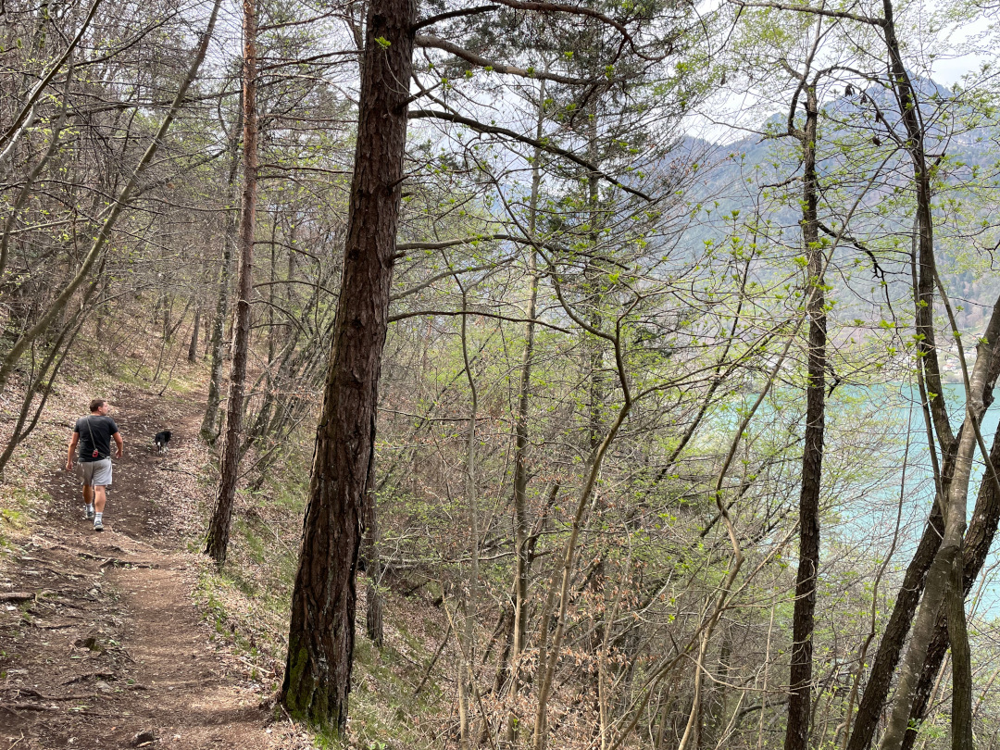

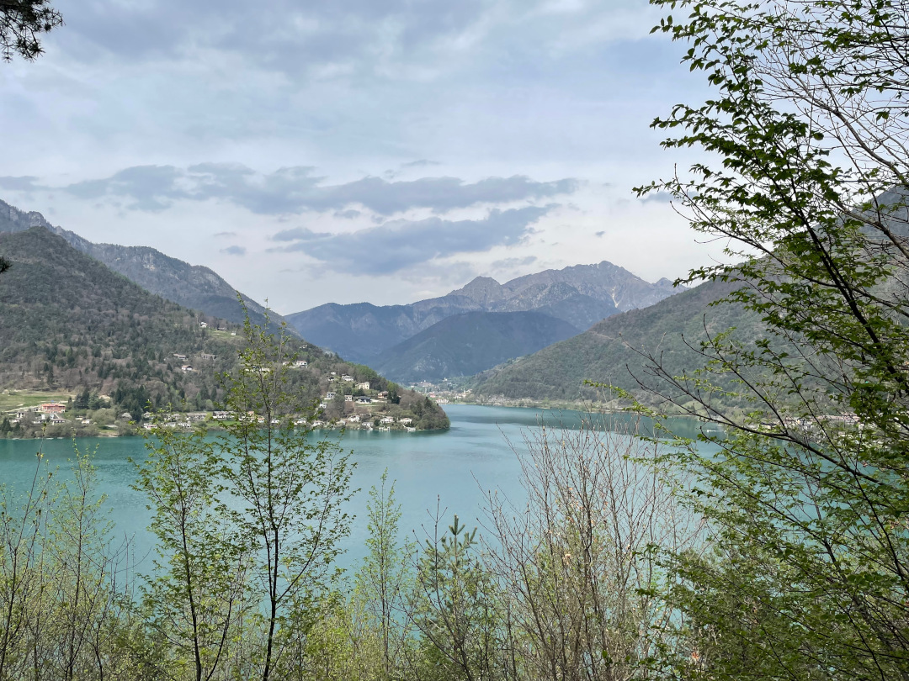

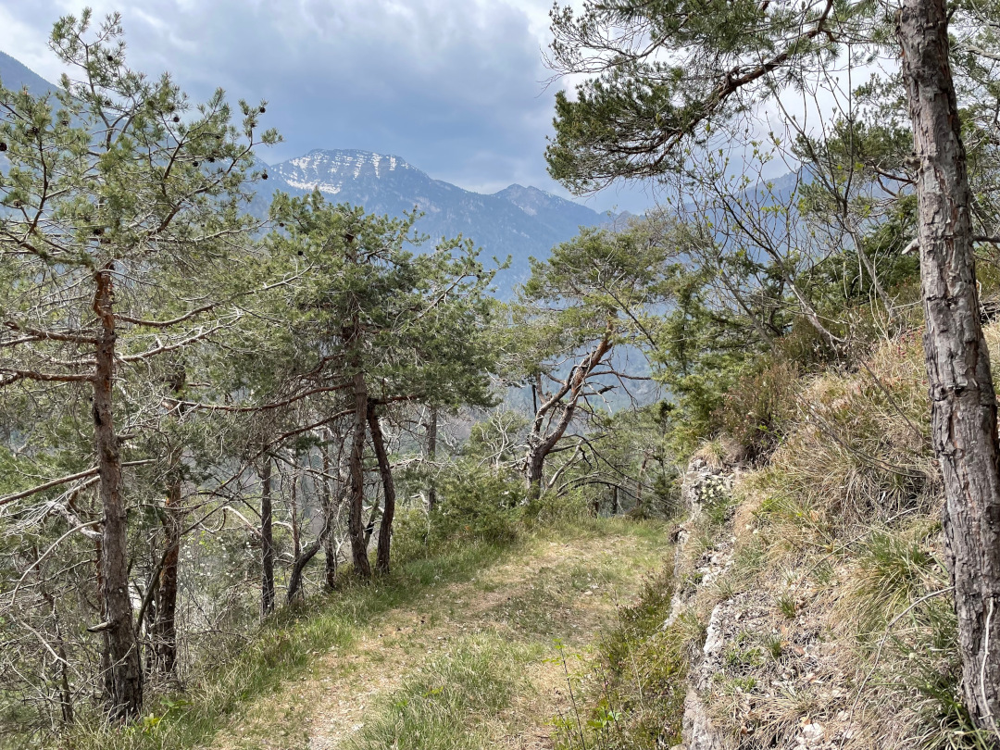

