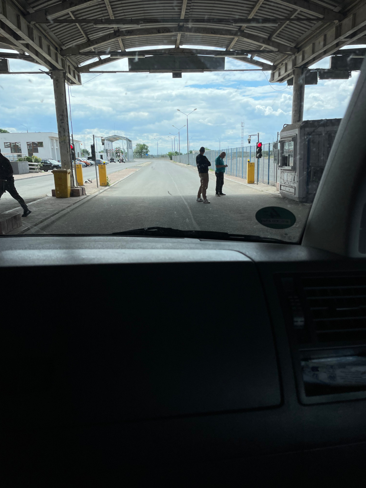
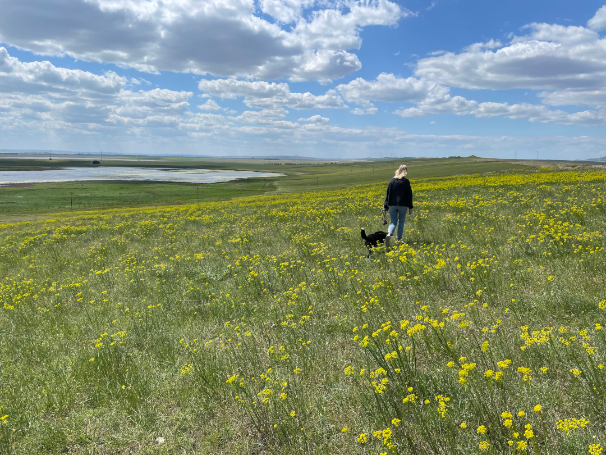
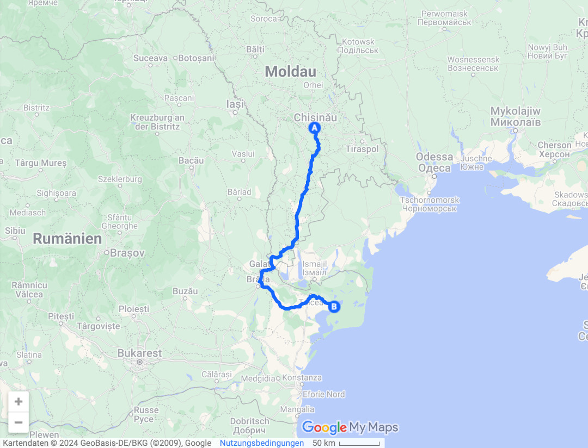
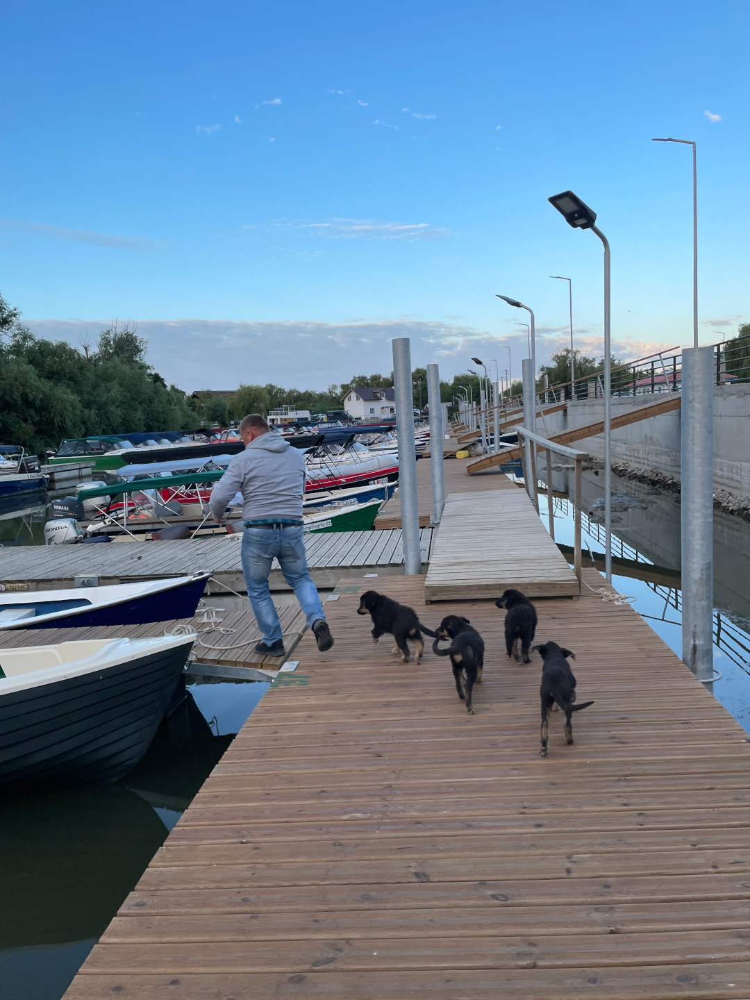
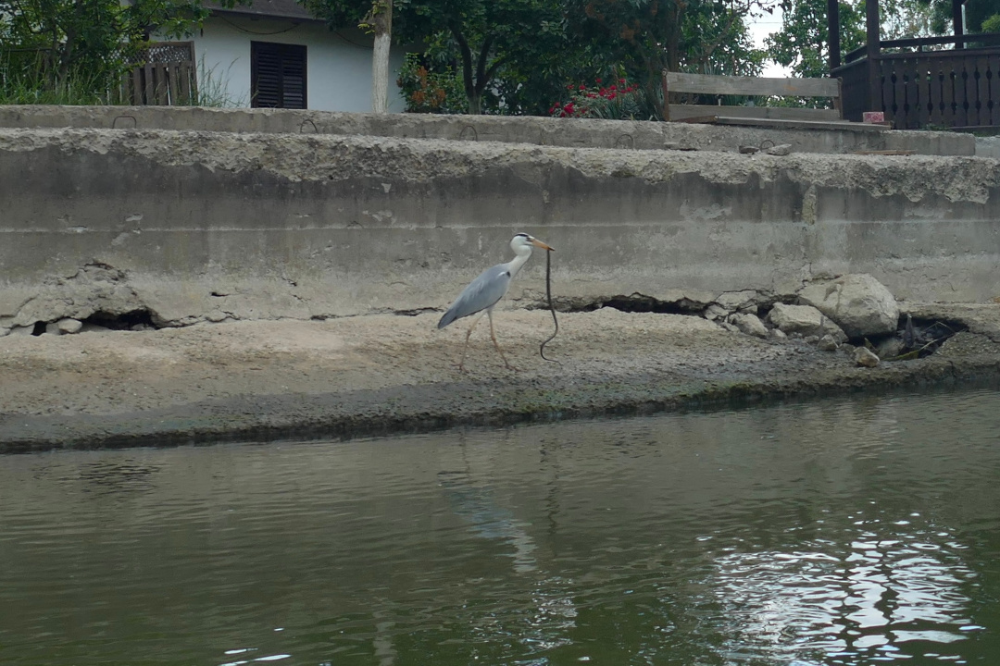
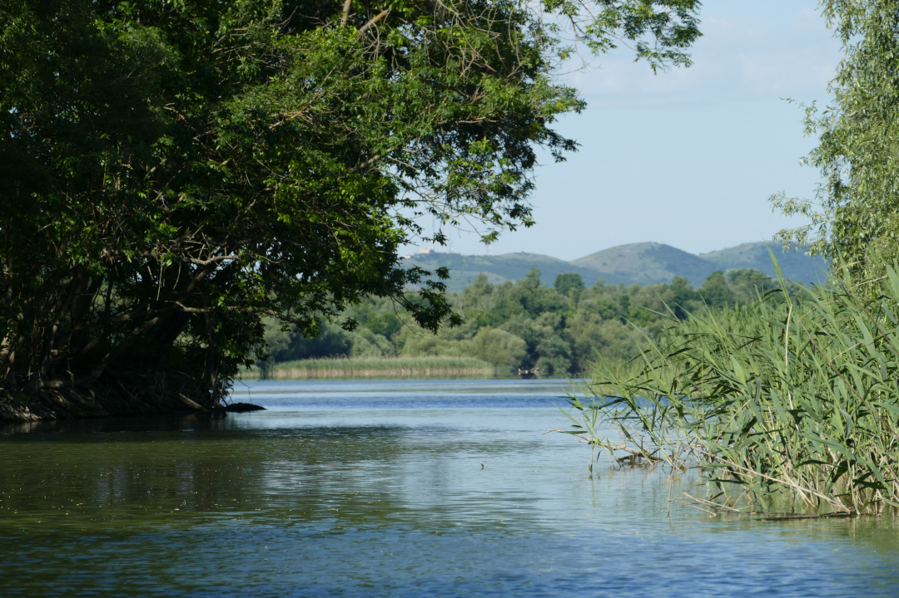
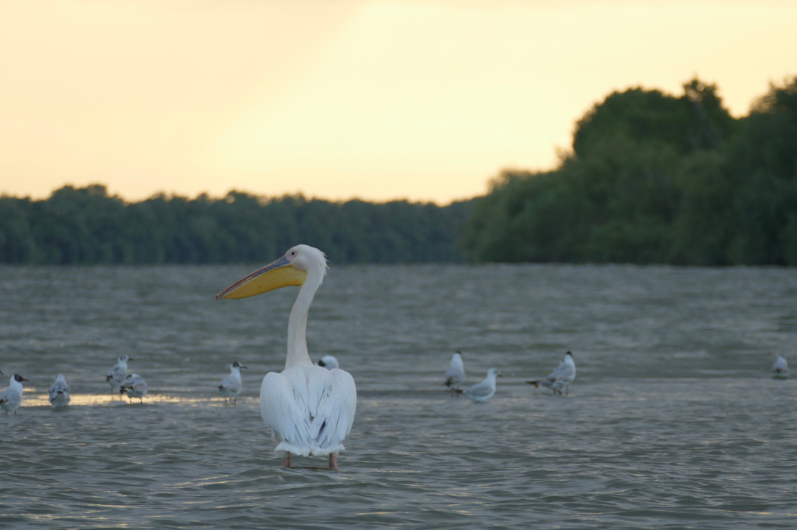
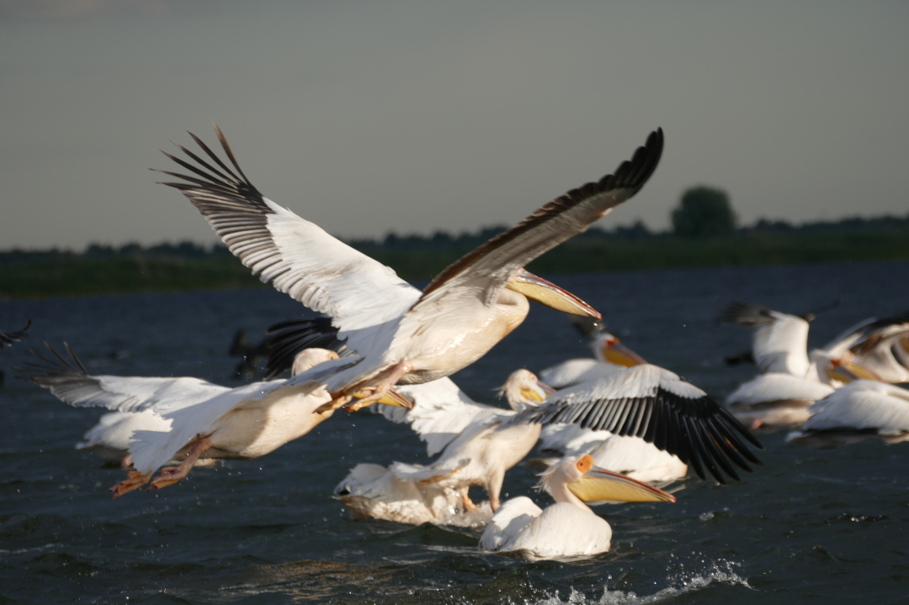
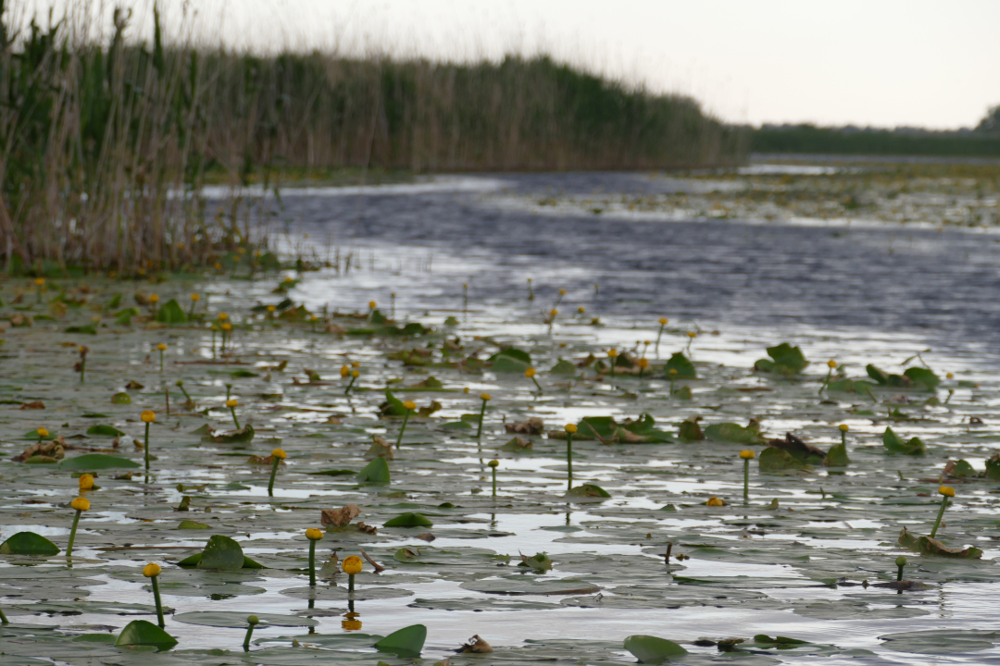
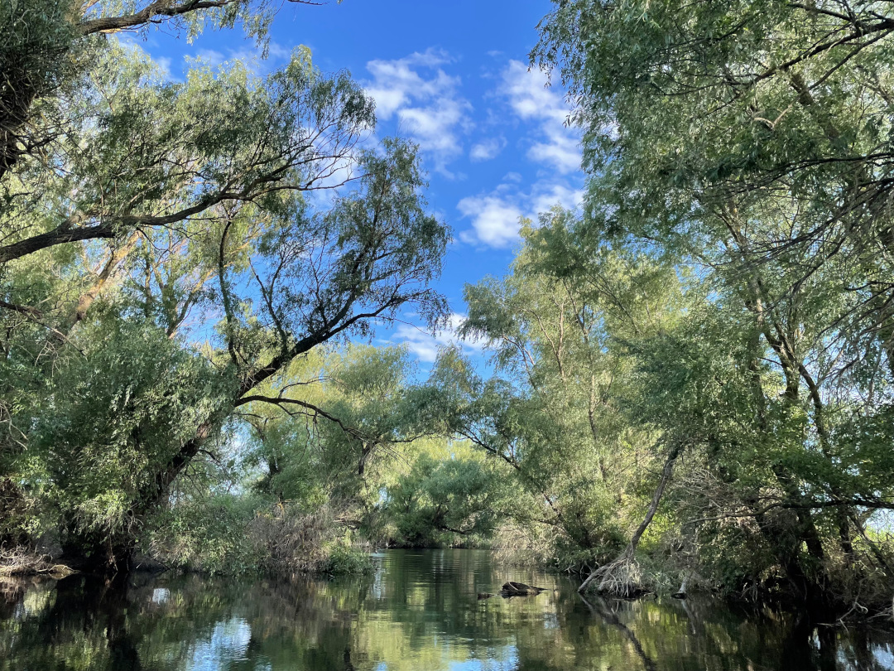

Nach unserem kleinen Abstecher nach Moldau kehren wir nach Rumänien zurück, um das drittgrößte Fluss Delta Europas zu besuchen.

<!--more-->

🗓️ 13. Mai: Im großen Park, in dem unser Hotel in Chișinău liegt, drehen wir noch eine letzte Runde mit Henry und suchen danach noch vergeblich eine Postfiliale. Obwohl sie geöffnet haben müssten, sind alle zu. Dann checken wir aus und verabschieden uns vor allem von dem netten Mann, der die ganze Zeit auf unser Auto aufgepasst hat und sich immer sehr über Henry gefreut hat. Einmal kam er sogar, um ihm Futter von seinen Katzen zu geben, aber Henry hat das Trockenfutter ausgeschlagen. Mithilfe einer Scheibe Käse haben die beiden dann aber doch noch Freundschaft geschlossen. Am Abend vorher hat er seiner Frau uns und Henry erstmal beim Videoanruf gezeigt. Nachdem wir uns jetzt noch unbedingt Fotos von seinem Hund und seinen Katzen angucken sollen, geben wir ihm etwas Trinkgeld und verabschieden uns. Nach zwei Tagen und zwei Nächten hat er jetzt auch gerade endlich Feierabend. Wir wollen heute viel Strecke machen und haben eine Grenze vor uns. Deshalb sind wir vergleichsweise früh auf der Straße. Wenn wir eins nicht vermissen werden, dann wirklich die moldawischen Straßen. Mal ist es die beste Straße und ein paar Kilometer weiter tiefe Krater überall. Oft geht es deshalb nur langsam voran, aber wir gedulden uns und kommen schließlich an der Grenze zu Rumänien an. Hier haben wir mehr Glück als beim letzten Mal und kaum Autos vor uns. Alle sind dieses Mal freundlich und alles geht sehr schnell. Wir müssen nur die üblichen Fragen beantworten: Wo waren wir? Warum? Wo wollen wir hin? Warum? Haben wir Familie oder Freunde in Moldau? Ok, die letzte Frage verwirrt uns auch erst etwas, zeigt aber auch wie wenige Touristen ohne Bezug zum Land herkommen. Wie immer müssen wir alle Türen zweimal zur Kontrolle öffnen, es wird sich über Henry gefreut und dann heißt es warten am Häuschen, bis man alle Papiere wieder zurückbekommt. Wir freuen uns über die reibungslose Rückkehr in die EU und düsen weiter. Nach einem Einkauf für die nächsten Tage kommen wir an einem Campingplatz am Donaudelta an. Mal wieder sind wir die Einzigen, aber es ist ein sehr freundlicher Empfang. Wir fragen direkt schon, ob morgen eine Bootstour ins Delta möglich wäre, denn das ist eigentlich die einzige Möglichkeit sich die besondere Landschaft hier anzuschauen. Das klappt glücklicherweise direkt morgen früh. Wir gehen noch mit Henry durch die riesigen Blumenwiesen spazieren und fallen dann ins Bett.

🗓️ 14. Mai: Um 6 Uhr morgens holt der Campingplatzbesitzer uns mit seinem Auto ab und wir fahren ungefähr 10 Minuten zu dem kleinen Hafen, an dem wir in sein Bötchen umsteigen, um in das Flussdelta zu gelangen. Die Donau mündet hier ins Schwarze Meer. Das Wasser war also auch schon in Deutschland, bevor es hier ankommt bzw. entspringt ja sogar im Schwarzwald. Das Donaudelta ist mit über 7000 Arten das Biosphärenreservat mit der drittgrößten Artenvielfalt, direkt nach dem Great Barrier Reef und den Galapagos Inseln. Diese Vielfalt kriegt man eigentlich nur mit dem Boot mit und am besten ganz früh morgens. So sitzen wir, nachdem wir am Hafen von einer Welpen Gang verabschiedet wurden, mit unseren Rettungswesten noch sehr verschlafen in dem kleinen Motorboot. Wir sitzen vorne für den guten Blick und er steuert hinten. Als erstes sehen wir schon bei der Hafenausfahrt einen Fischreiher, der allerdings gerade eine Schlange anstatt Fisch aus dem Wasser gefischt hat. Dann kommen wir im Fluss an. Es gibt drei Flussarme im Delta und wir sind (angeblich) auf dem schönsten unterwegs, dem Sfântu-Gheorghe-Arm. Und allein der ist schon sehr breit, obwohl es nicht mal der ist, auf dem die großen Schiffe fahren. Nach einer Weile biegen wir ab in kleinere Kanäle und Durchgänge und kommen zu mehreren großen Seen. Wie er zwischen Bäumen, Schilf, Seerosen und dem ganzen Wasser dabei die Orientierung behält, bewundern wir genauso wie damals auf unserer Wüstentour. Wir haben Glück und sehen richtig viele Pelikane, die im Delta die größten Vögel sind. Das frühe Aufstehen hat sich also gelohnt und auch das Frieren. Auf dem Boot ist es nämlich super kalt und windig und man sitzt ja einfach nur rum. Deshalb sind wir froh, als die Sonne weiter aufgeht, sich gegen die Wolken durchsetzt und immer mehr Kraft bekommt. Wir kommen auch am ehemaligen Feriendomizil von Nicolae Ceaușescu, dem Ex-Diktator Rumäniens vorbei. Für die Menschen hier hat seine Anwesenheit nichts Gutes gebracht, weil es viele Sperrungen und große Umwege für die Fischer gab, wenn er da war. Das einzige „Gute“ war wohl, dass es zu den Zeiten so gut wie keine Moskitos im Delta gegeben hat, weil Insektizide per Helikopter versprüht wurden. Auf unserer Fahrt bleiben wir aber auch so vor ihnen verschont. Ansonsten ist hier alles grün. Die Bäume hängen tief über dem Wasser und ragen weit über den Fluss, so dass sich das Grün auch dort spiegelt. Wir fahren durch ein Meer aus gelben und weißen Seerosen und überall sind verschiedene Vogelstimmen und Frösche zu hören. Wir sehen vor allem viele Fischreiher, Pelikane, Kormorane, Wildgänse, Schwäne, Möwen, Haubentaucher, Enten und die farbenfrohen Bienenfresser (auch wenn bee eater irgendwie viel netter klingt und besser zu den kleinen Vögeln zu passen scheint). Das Delta ist wirklich eine ganz eigene und besondere Welt für uns. Nach 4 Stunden kommen wir dann wieder am Hafen an. Den restlichen Tag verbringen wir am Bulli. Das Wichtigste nach der Kälte ist die warme Dusche. Ansonsten sind wir vor allem mit Reiseplanung und Vorbereitungen für unser nächstes Reiseland beschäftigt und machen uns unter anderem schon mal etwas mit dem kyrillischen Alphabet vertraut.

