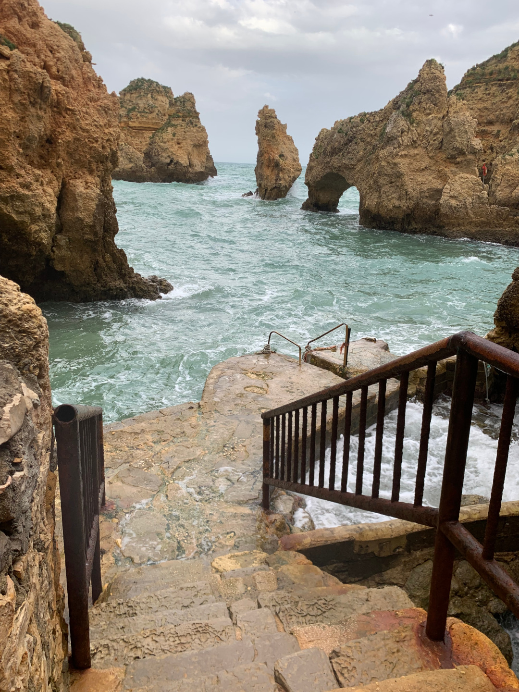
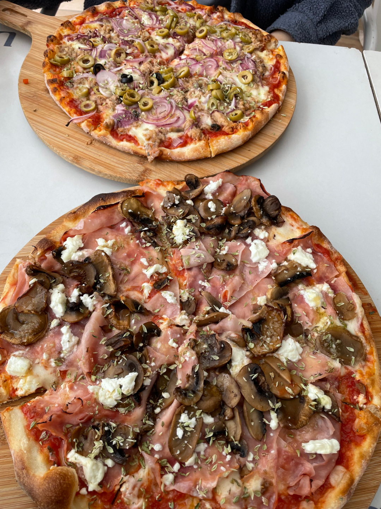
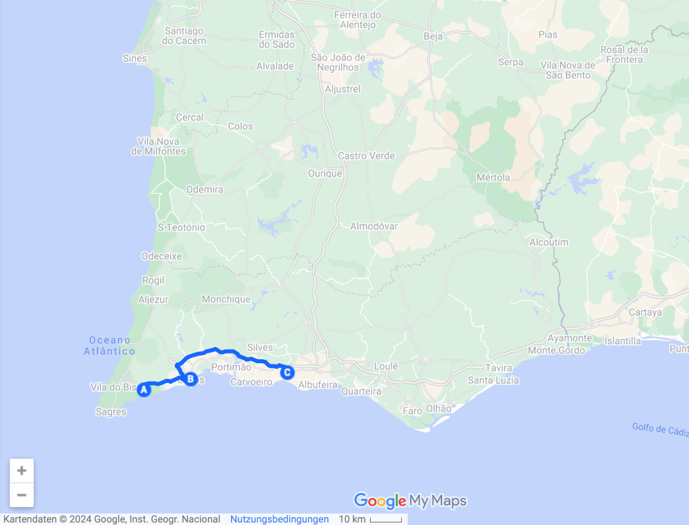
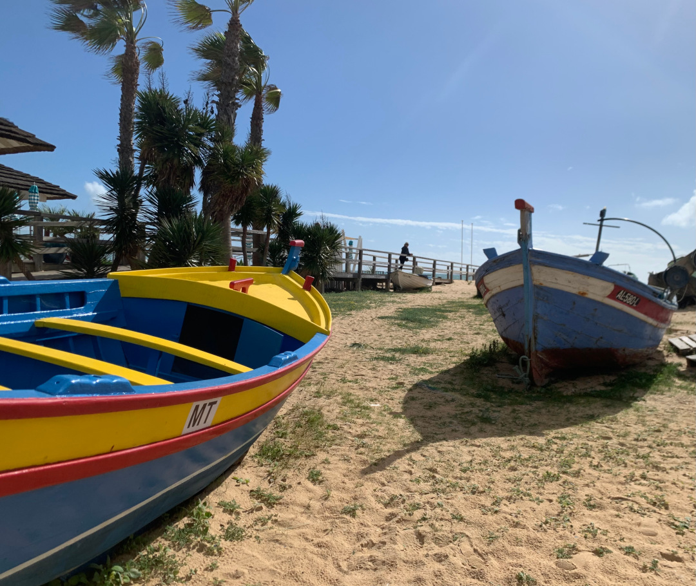
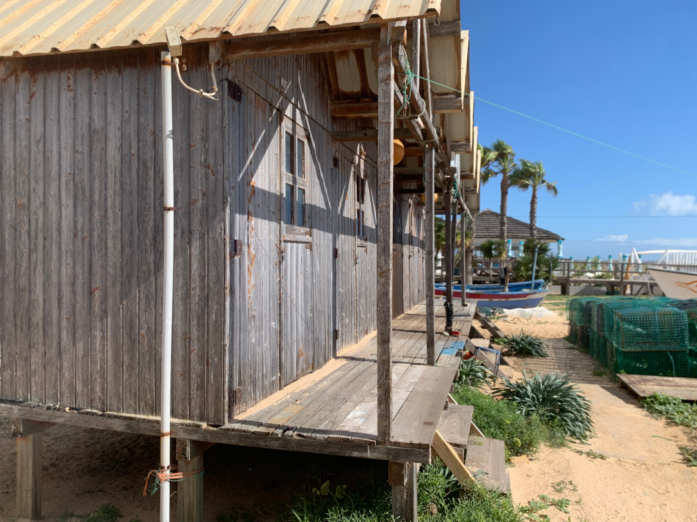
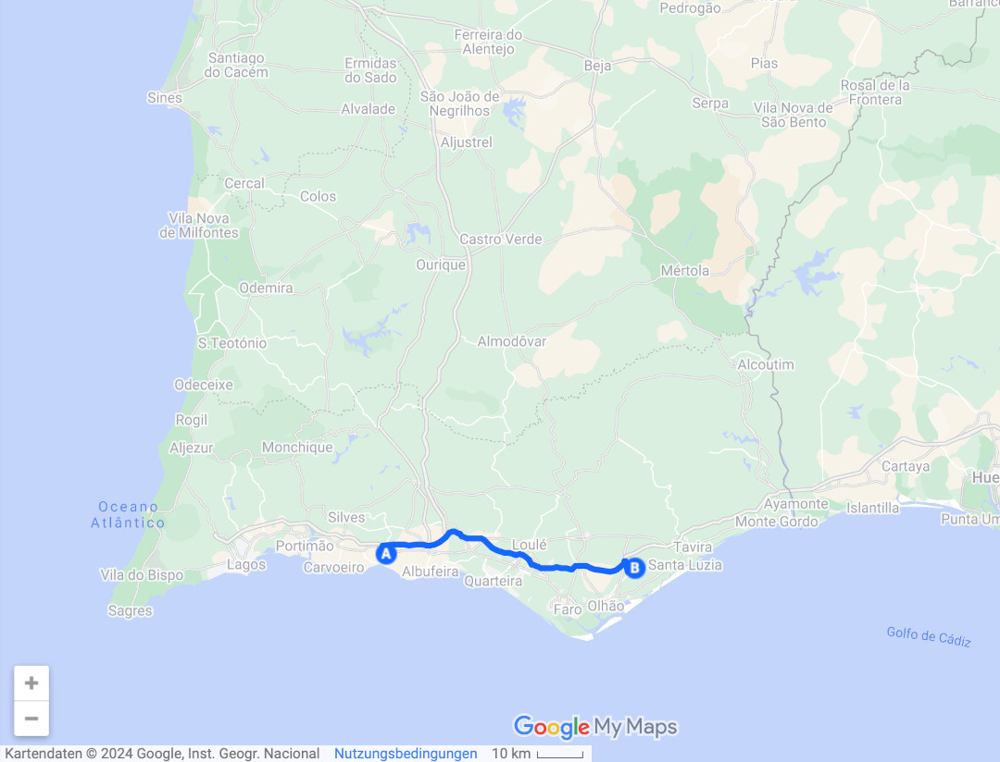
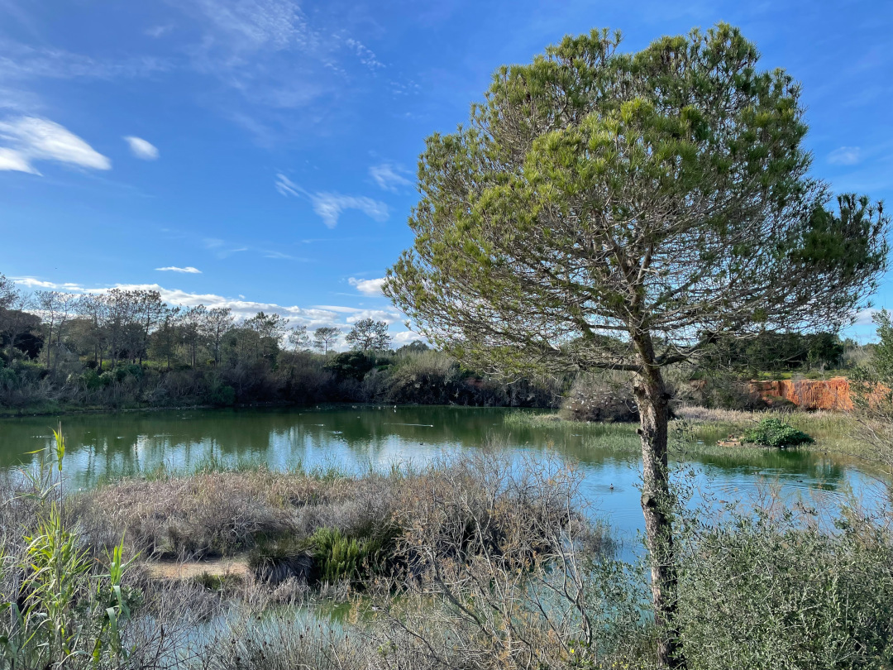
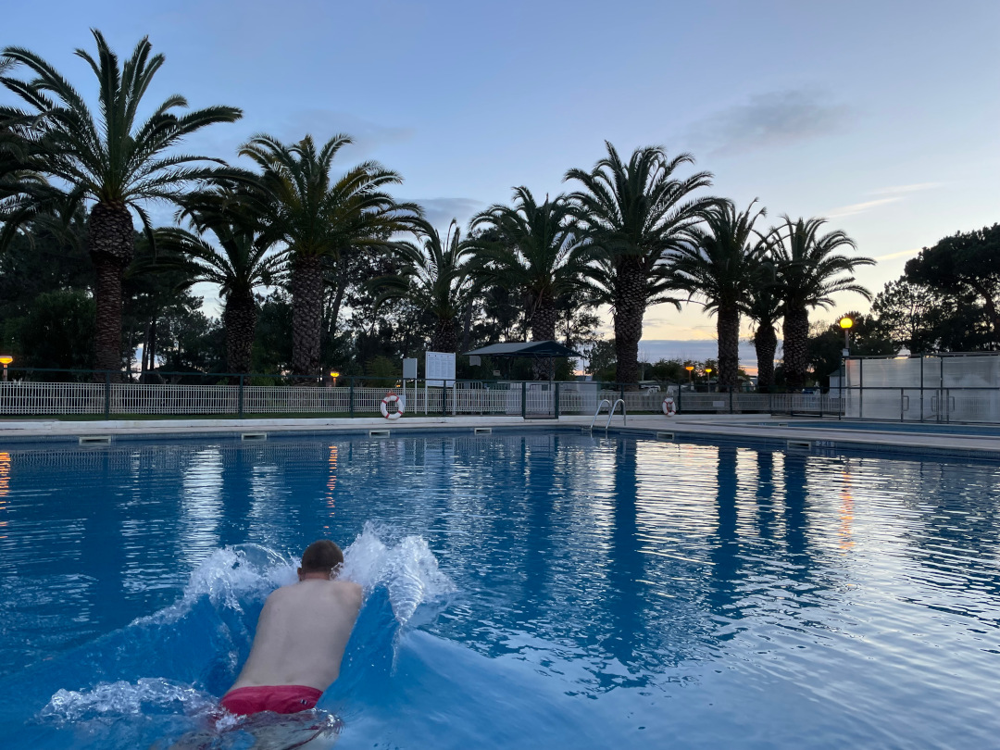
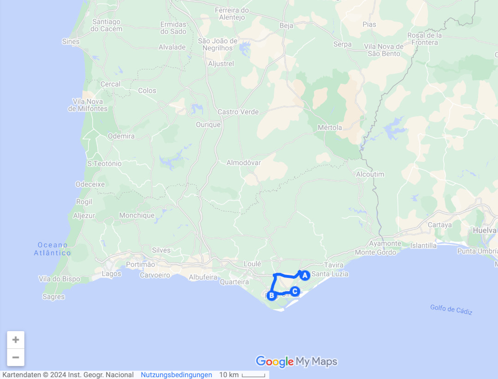

Die Zeit am Atlantik der Westküste mit seinen hohen Wellen ist vorbei. Im Süden Portugals zeigt er sich ab jetzt eher von seiner ruhigeren Seite.

<!--more-->

🗓️ 14. Februar: Wir machen uns schnell wieder auf den Weg und wollen heute die Stadt Lagos erkunden, die für uns nur eine halbe Stunde entfernt liegt. Einige Straßen sind gesperrt und als wir ankommen, merken wir auch wieso: Heute ist hier die Zieleinfahrt der ersten Etappe des Radrennens Algarve-Rundfahrt, allerdings erst am späten Nachmittag, so dass wir außer Absperrungen und Aufbauarbeiten nichts davon mitkriegen. Wir bummeln also entspannt durch die Gassen, versenden gleich zwei Mal Geheimpost, weil wir mal rechtzeitig vor der Siesta an einer deshalb noch geöffneten Postfiliale sind, und verbringen noch einige Zeit am stadtnahen Strand Praia de São Roque. Als der Hunger mal wieder kommt, beschließen wir die gute Pizza von gestern Abend direkt noch ein zweites Mal auszunutzen und nehmen dafür in Kauf nochmal 20 Minuten in die eigentlich falsche Richtung zu fahren. Es lohnt sich aber auch wieder und anschließend parken wir dann etwas abseits der Ponta de Piedade. Für die Felsformation ist Lagos bekannt und wir machen noch einen Spaziergang auf den Holzstegen, die weit an den Klippen entlangführen. Bei den Felsen kann man auch über eine steile Treppe ganz hinunter zum Wasser laufen. Man muss nur auch wieder hoch, aber wir sind ja gut im Training. Laut Apple sind wir in den letzten 5 Wochen nämlich 30 statt der sonst durchschnittlichen 8 Stockwerke gestiegen. Am späten Nachmittag fahren wir dann weiter zum Campingplatz. Auch hier ist für die Jahreszeit erstaunlich viel los und unter deutschen und holländischen Rentnern scheint der Trip in die Algarve ein richtiger Trend zu sein, wobei es hier vor allem richtige Überwinterer zu sein scheinen. Die Preise sind hier aber mit 12€ für eine Nacht bisher auch unschlagbar günstig. 

🗓️ 15. Februar: Für die 12€ kann man auch noch bis 16 Uhr bleiben und das nutzen wir heute auch aus und lassen es entspannt angehen. Am späten Vormittag gibt es dann aber Aufregung unter den deutschen Rentnern: Der Strom auf dem ganzen Platz ist ausgefallen. Uns kann das eigentlich egal sein, weil wir nur selten überhaupt mit Elektrizität buchen… Wenn nicht gerade unsere noch klitschnasse Wäsche in der Maschine liegen würde. Dumm gelaufen, also sammeln wir wieder unser ganzes Kleingeld für eine zweite Runde zusammen und nach einiger Zeit läuft dann auch alles wieder. Tobi läuft noch runter in den kleinen Ort Armaçao de Pêra, der schon fast etwas karibisch angehaucht ist und macht einen Strandspaziergang mit Henry. Später essen wir noch Eis und machen uns dann mal auf den Weg zum nächsten Platz. An unserem eigentlichen Ziel sagt man uns leider wieder, dass schon alles voll ist, nennt aber netterweise auch eine Alternative. Die finden wir in dem Moment nicht ganz und fahren deshalb zu unserer eigenen Alternative. Dort angekommen begrüßt uns ein älterer Herr etwas grummelig, aber dennoch auch freundlich. Sein Problem: Der Platz ist auch schon proppenvoll, aber weil wir keinen Strom brauchen und klein sind, sucht er uns noch ein kleines Plätzchen auf einer Wiese am Rande des Grundstücks. Die letzten Tage haben wir uns schon immer gefragt, wie es an der Algarve dann wohl in der Hauptsaison zugehen muss. Er erklärt uns aber, dass wir jetzt zu einer schlechten Zeit kommen, weil alle der Sonne entgegen fahren. Im Sommer sei bei ihm alles leer, weil alle direkt an den Strand wollen. Sagt er zumindest. Für eine Nacht ist unser Plätzchen hier aber ganz gut und wir machen uns noch Gnocchi, allerdings gibt es einen etwas übereifrigen Hahn direkt neben uns, der eigentlich die ganze Nacht durch kräht und erst Ruhe gibt, als es hell wird. Irgendwie ist der wohl falsch rum gepolt. 

🗓️ 16. Februar: Wir sind heute wieder früh unterwegs und fahren nach Faro, um uns die nächste Stadt anzusehen. Als wir ankommen wundern wir uns schon, dass es nirgendwo freie Parkplätze zu geben scheint. Als wir dann doch noch einen Platz ergattert haben, sehen wir in der Fußgängerzone auch wieso: Ein riesiger Kinder-Karnevalsumzug der Kindergärten und Schulen zieht durch die Stadt. Gefühlt sind alle Kinder aus Portugal hier, mindestens aber alle Kinder der Algarve. Jede Schule hat ein eigenes Motto für die Kostüme und alle sind bestens gelaunt. Eine Weile stehen wir am Rand und schauen zu, aber als der Zug einfach nicht aufhört, weil er so lang ist, quetschen wir uns dann an den Seiten doch vorbei weiter durch die Stadt. Am Hafen essen wir in einem Café etwas und lernen dank des Kellners auf unseren letzten Metern in Portugal noch, dass Pastel de Nata mit etwas Zimt bestreut sogar noch viel besser schmecken. Zum Übernachten fahren wir etwas weiter nach Olhão. Der Campingplatz hier ist riesig und auch wieder gut besucht, aber wir finden dieses Mal ein schönes Plätzchen für uns. Tobi passt sich den Rentnern an und liest in seiner deutschen Tageszeitung, die er in Faro dank des 18. Bundeslands ergattert hat. Nach der Pause ziehen wir nochmal zu Fuß los, um durch den Naturpark Ria Formosa zu spazieren. Wegen der Sumpfgebiete und Sandbanken gibt es hier viele Vögel und viel Grün. Zu den zugehörigen vorgelagerten Inseln fahren wir aber nicht mehr. Stattdessen gehen wir noch schnell einkaufen und Tobi eröffnet die Poolsaison 2024. 

