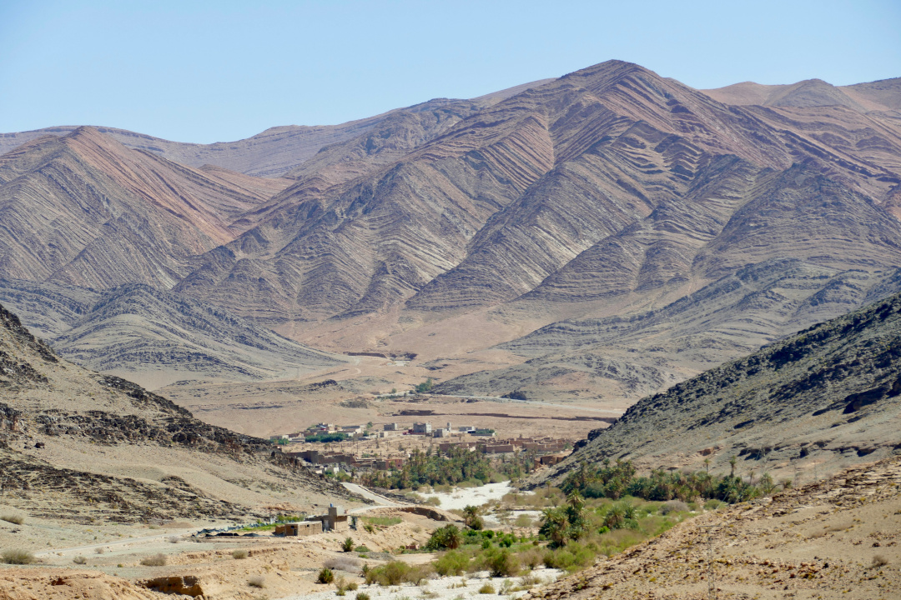
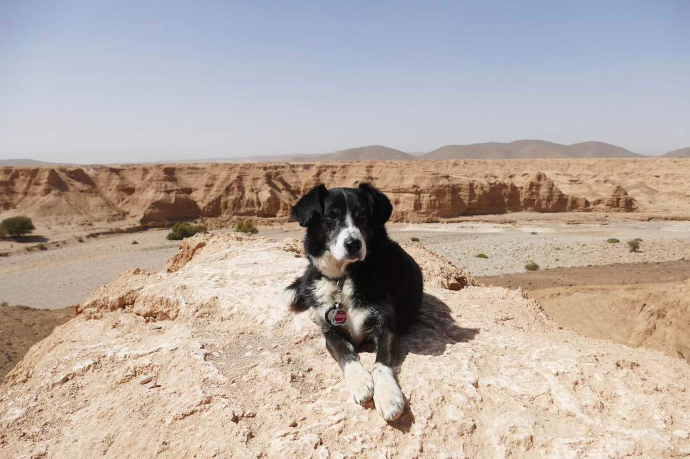
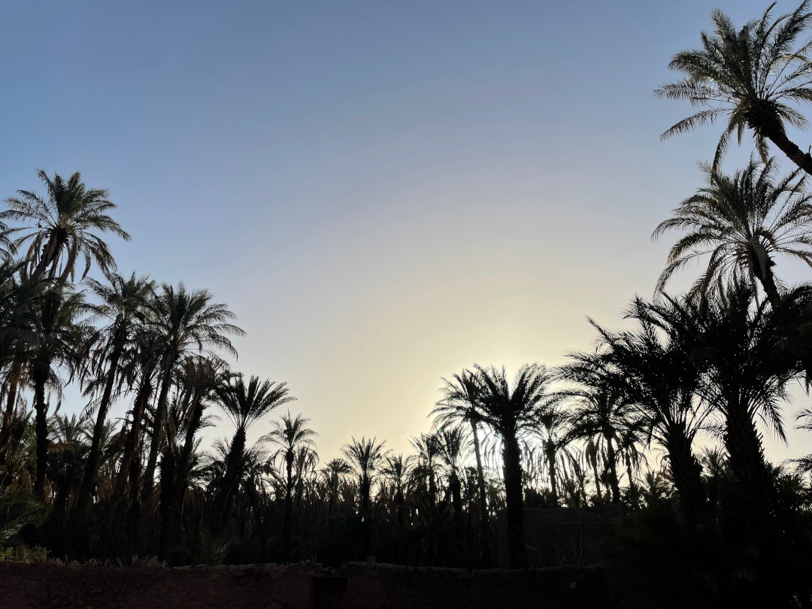
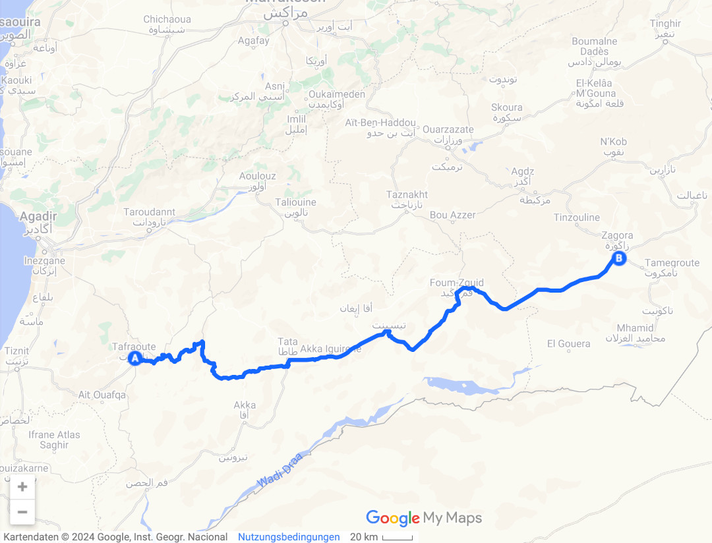
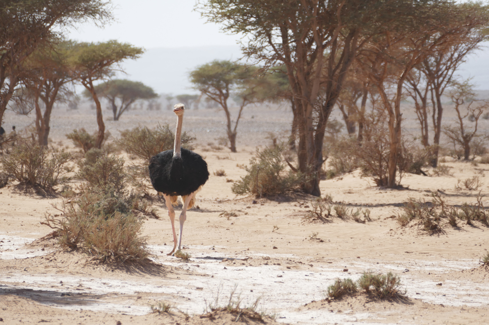
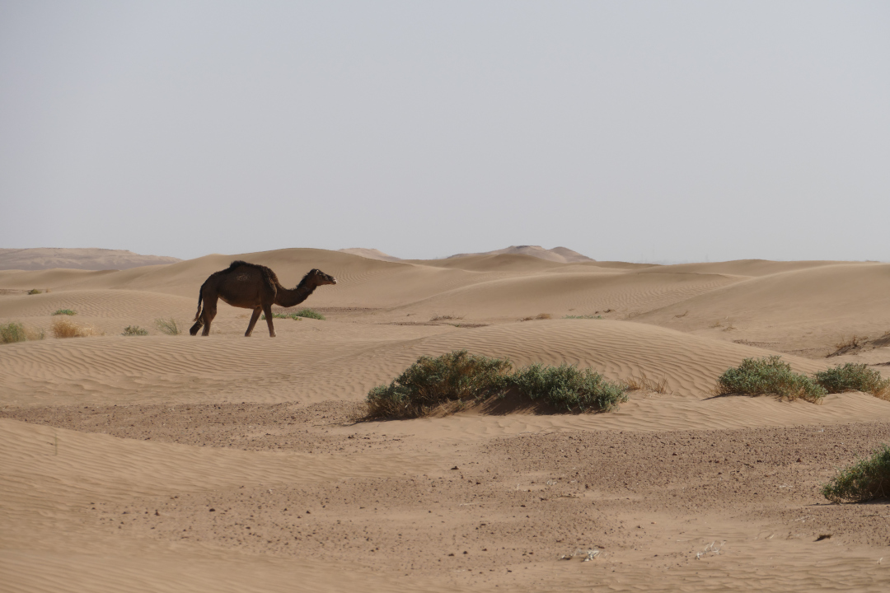
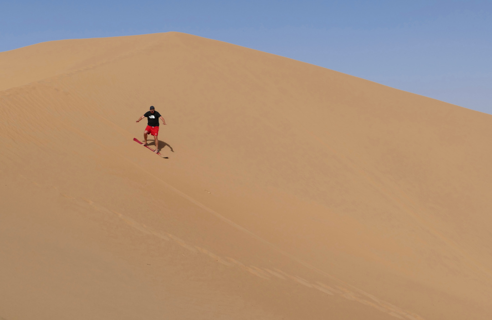
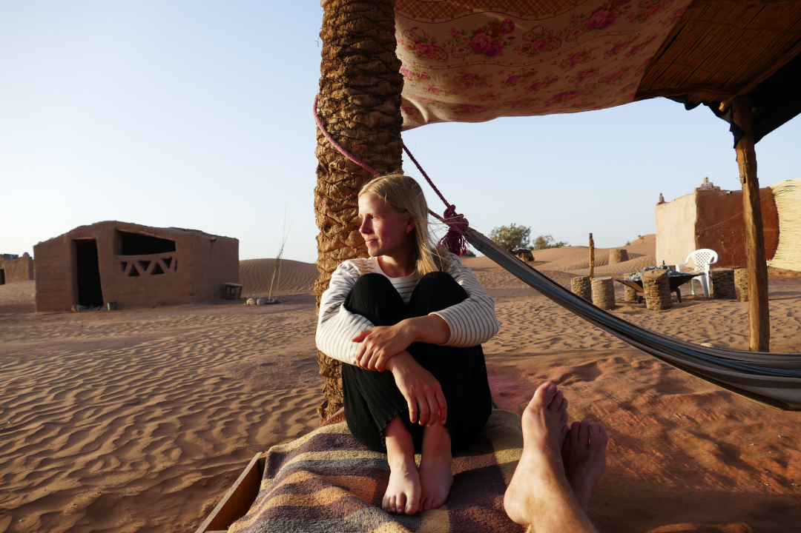
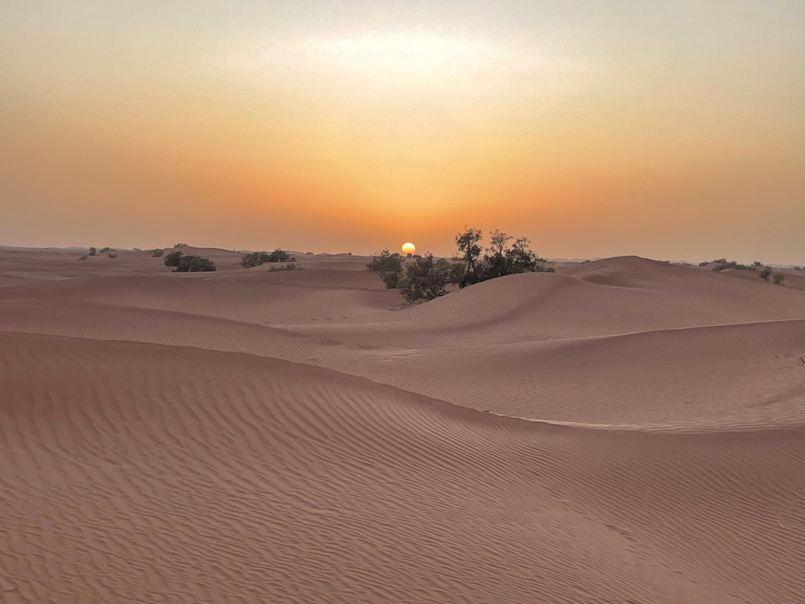
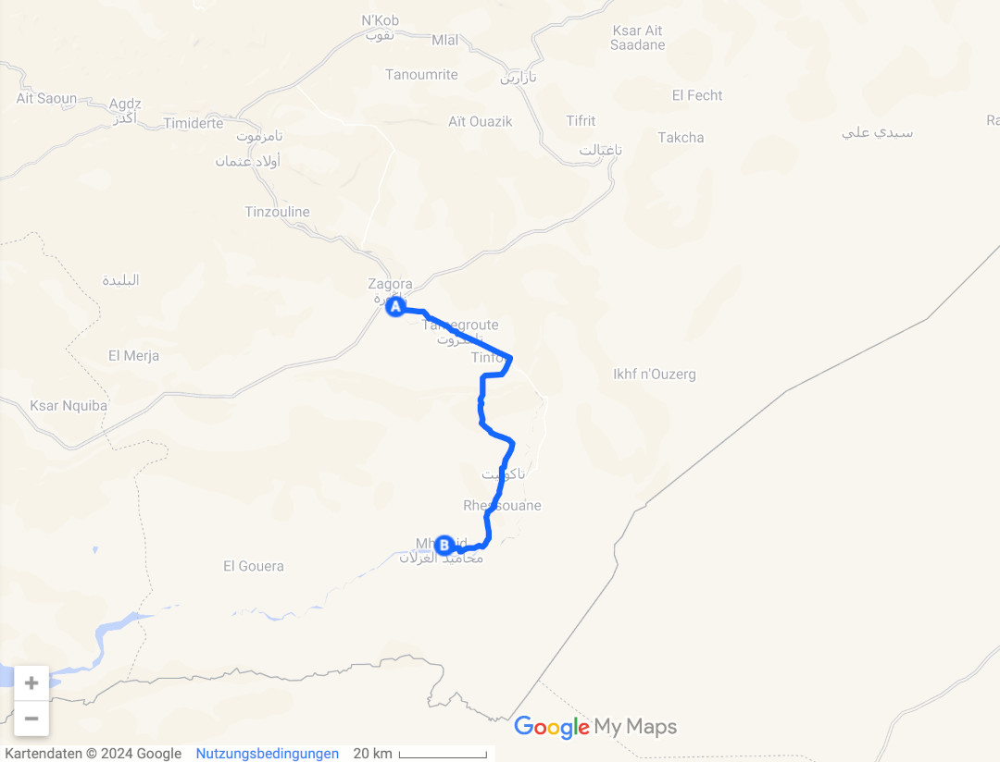

Von den Bergen im Anti-Atlas geht es für uns in die Wüstenstädte Zagora und Mhamid.

<!--more-->

🗓️ 14. März: Wir wachen früh auf und das ist auch von Vorteil ist, da es hier nur eine Toilette und eine Dusche gibt. So sind wir schon vor den meisten anderen schon mit allem fertig. Außerdem wollen wir heute viele Kilometer fahren. Zuerst geht es aber mit Henry in die Schlucht und auf den Wanderweg von gestern. Danach bezahlen wir, nehmen noch etwas Brot und Cola mit und machen uns auf den Weg nach Zagora als letzte größere Stadt vor der Wüste, die über 400 km östlich von Tafraoute liegt. Die Fahrtzeit wird mit über sechs Stunden angezeigt. Diese sechs Stunden sind für uns aber sehr kurzweilig. Wir fahren von den Bergen im Anti-Atlas in die Vorläufer der Sahara. Fast hinter jeder Kurve gibt es einen neuen Grund anzuhalten, die Aussicht zu genießen und Fotos zu machen. Auf den Straßen sind wir oft alleine, selten gibt es mal Gegenverkehr. Und wenn es Gegenverkehr gibt, dann sind es meistens einzelne oder Herden von Dromedaren, die die Straße kreuzen. Die sind aber wohl Autos gewöhnt und bleiben die ganze Zeit entspannt. Langsam ändert sich die Landschaft von Bergen zur Steppe. In alten Flussläufen wachsen dann meistens Palmen. Wasser ist aber selten in den Flussläufen. An einer Schlucht halten wir an und wandern etwas über die Aussichtspunkte. Henry gefällt es auf jeden Fall. An einem Straßenladen halten wir kurz für einen Mittagssnack an und freuen uns noch mit dem Ladenbesitzer über den Einzug ins Champions League Viertelfinale des BVB. Am frühen Abend erreichen wir Zagora. Auch das Stadtbild ist anders als in Tafraoute. Wir sehen viele Lehmhäuser und Palmen, was beim Sonnenuntergang sehr cool aussieht. Hier sind wir mal wieder auf einem größeren Campingplatz gelandet, der sehr voll ist. Wir suchen uns ein Restaurant aus und laufen die drei Kilometer ins Stadtzentrum. Vom Eingang der Stadt aus sind es mit dem Kamel noch 52 Tage bis Timbuktu. Das Schild stammt noch aus Zeiten als hier die Handelsroute vom Mittelmeer nach Zentralafrika verlief, dient heute aber wohl eher nur noch den Touristen. Mittlerweile ist auch schon die Sonne untergegangen, so dass es eigentlich kein Problem sein sollte ein offenes Restaurant zu finden. Trotz Fastenbrechen ist aber nicht viel los. Wir setzen uns in ein Restaurant, bei dem wir schon ran gewunken werden. Dann stellt sich aber heraus, dass wir hier nur Kaffee und Tee trinken können. Als wir der Besitzerin klarmachen, dass wir auch gerne essen würden, nimmt sie uns mit und bringt uns gegenüber in ein unscheinbares Café, wo man dann aber etwas essen kann. Sie schreit dem Besitzer schon von weitem zu, dass er uns wohl was zu essen machen soll. Sie ist erst glücklich, als wir unser Abendessen bekommen. Wir bestellen, dass er uns das machen soll, das er da hat. So gibt es eine traditionelle Berber-Suppe, gegrilltes Fleisch, Fladenbrot, Tomaten, Zwiebeln und Datteln - alles in allem sehr lecker. Dabei gucken wir marokkanische Telenovela. Mit dem Taxi geht es dann günstig zurück zum Campingplatz, wo wir den Abend damit verbringen die Fotos vom Tag anzugucken und alles sacken zu lassen.

🗓️ 15. März: Trotz des vollen Campingplatzes geht es hier morgens entspannt zu. Wir gehen eine letzte Runde mit Henry durch Zagora und machen uns dann auf den Weg nach Mhamid, ebenfalls eine Oasenstadt ca. 100 km südlich von Zagora. Der erste Stopp ist aber wie so oft morgens der lokale Markt. Wir kaufen eine Menge Obst und Gemüse, fast 2 Kilo und zahlen dafür ca. 1,90 €. Danach geht es noch zu einem „Supermarkt“, wo wir Wasser und Brot kaufen. Beim Trinkwasser sind wir nämlich vorsichtiger und kaufen es deshalb nur in größeren Läden, in denen die Flaschen oder Sixpacks noch verschweißt sind. Obwohl es sogar ein halbwegs offizieller Supermarkt ist und das Trinkwasser super, sind die Preise flexibel. Der Tipp ist fast immer zu sagen, dass der Preis zu hoch ist und nicht stimmen kann. Danach wird nochmal nachgerechnet und der Preis ist günstiger. Nach dem Einkauf geht es endlich nach Mhamid. Die Straße bis dahin ist noch sehr gut ausgebaut und wir sind bereits gegen 12 Uhr dort. Kurz vor dem Ort sehen wir vermehrt Militärstationen, was wohl an der Nähe zur algerischen Grenze liegt. Ab Mhamid wechseln die Straßen zu schwierig zu fahrenden Pisten. Mit unserem Bulli kommen wir aber gerade noch zu unserem Stellplatz für die Nacht in den Vorläufern der Sahara. Neben uns steht hier nur noch eine französische Familie. Wir werden von Hassan und seinem Welpen Miloud begrüßt. Wie so oft gibt es Tee und Nüsse zur Begrüßung. Hassan selbst verzichtet natürlich wegen Ramadan und bringt uns stattdessen noch einen Teppich, den wir vor unseren Bulli legen. Ansonsten wäre das mitten im Sand auch schwierig geworden. Wir sprechen etwas mit Hassan und sagen, dass wir gerne etwas weiter in die Wüste wollen, aber unser Bulli (zwar Allrad) dafür wohl nicht ausgelegt ist. Hassan bietet an, dass wir und sogar Henry mit seinem Jeep in die Wüste fahren können. Das Angebot nehmen wir gerne an. Eigentlich war der Besuch der Wüste erst für morgen geplant, weil wir aber heute schon so früh hier sind, verabreden wir mit ihm, dass wir gleich losfahren werden. Schon beim Losfahren wird klar, dass der Jeep besser als der Bulli für die Tour geeignet ist. Anschnallen ist in Marokko übrigens eine Beleidigung gegenüber dem Fahrer, sowohl im Taxi als auch bei Hassan im Jeep. Am Anfang fahren wir noch etwas durch die Mischung von Steppe und Wüste. Hassan bringt uns zu einem Ort, an dem man oft wilde Tiere sehen kann. Hier leben Gazellen, Wüstenfüchse und Sträuße. Einen Strauß bekommen wir sogar zu Gesicht, der sehr interessiert ist. Der nächste Stopp führt uns zu einem Brunnen, der von den Nomaden genutzt wird. Auch hier wird mit der Zeit gegangen. Der Brunnen bzw. die Pumpe ist solarangetrieben, so dass man nicht mehr den Eimer zehn Meter in die Tiefe befördern muss und dann wieder hochziehen muss. Danach geht es zu den hohen Sanddünen, die das typische Wüstenbild abgeben. Unterwegs sehen wir noch viele Dromedare und halten immer mal wieder an, um die Landschaft zu genießen. Wir kennen die Wüste nur von Fotos und sind das erste Mal in der Sahara. Danach geht es zu einem Freund von Hassan, der neben seinem Haus in Mhamid noch in der Wüste eine kleine Hütte hat. Wir trinken noch etwas Tee und erkunden die Wüste ohne Hassen. Der hat seinen Freund wohl ewig nicht mehr gesehen, beide nutzen die Zeit und unterhalten sich ausgiebig. Sein Freund gibt uns noch ein Sandboard mit, womit wir mehr oder weniger erfolgreich versuchen, die Dünen runterzusurfen. Als wir wieder zurück an der Hütte ankommen, ist Hassan zum Glück noch da und wir machen uns auf den Rückweg. Wie er umgeben von Sand die Orientierung behalten kann, bleibt auf der ganzen Tour sein Geheimnis. Man kann sich sehr schnell verlaufen oder verfahren und für uns sieht alles gleich aus. Bisher sind wir mit dem Jeep aber wirklich gut vorangekommen, wenn auch sehr holperig. Aber dann muss es ja passieren und wir fahren uns fest. Hassan versucht alles, damit wir wieder weiterfahren können. Nach dem zweiten erfolglosen Versuch steigen auch wir aus uns versuchen die Reifen frei zu buddeln, aber auch das hilft nicht. Also müssen Hanna und ich von hinten anschieben. Die ersten zwei Versuche funktionieren leider trotzdem nicht. So langsam sind wir auch alle nicht mehr so entspannt wie noch am Anfang. Dann aber können wir den Jeep beim dritten Versuch von hinten aus dem Sandloch schieben. Als Hassan dann anhält, um uns wieder ins Auto zu lassen, haben wir kurz noch die Befürchtung, dass wir uns erneut festfahren, aber glücklicherweise passt alles und Hassan erzählt lässig, wie letztens jemand 6 Stunden lang feststeckte. Zurück am Campingplatz können wir noch den Sonnenuntergang in der Wüste beobachten, bevor wir dann mit Hassan, seiner Frau und der französischen Familie zu Abend essen. Es gibt wie gestern die traditionelle Berber-Suppe, Brot, Datteln, Tomaten, Eier und zum Nachtisch noch ein Glas Erdbeermilch. Das Essen war perfekt, aber für ein Fastenbrechen wäre mir das zu wenig. Selbst ich hatte danach noch etwas Hunger. Wie muss Hassan sich fühlen, der den ganzen Tag nichts gegessen hat. Am Abend ist noch das internationale Nomadenfestival in Mhamid. Hier vor Ort ist das wirklich ein großes Ding und es kommen internationale Gäste und Musiker. Die französische Familie ist extra dafür angereist und war schon letztes Jahr vor Ort. Auch Hassan und seine Frau gehen dorthin. Leider beginnt das Festival erst nach dem letzten Gebet um 22:30 Uhr. Obwohl Hassan uns sogar hin- und zurückgebracht hätte, wann wir möchten, sagen wir ab. Wir sind einfach schachmatt vom Tag. Stattdessen gucken wir uns den Sternenhimmel an. Einen besseren Blick auf die Sterne gibt es fast nicht als mitten in der Wüste ohne künstliches Licht.

