Wegen der Hitzewelle verlagern wir das Schlafen nach drinnen und bleiben ein paar Tage an der Küste rund um Antalya.

<!--more-->

🗓️ 14. Juni: Dank der Klimaanlage war es seit langem mal wieder eine relativ kühle Nacht. Wenn man das Zimmer allerdings verlässt, dann merkt man wie warm es wirklich ist. Wir gehen mit Henry eine Runde an der Promenade entlang. Allzu lange Runden sind aktuell mit ihm aber nicht machbar. Das Frühstück im Hotel ist eher semi gut und deshalb wissen wir jetzt, dass wir dafür die nächsten Tage nicht unbedingt eher aufstehen müssen. Danach geht es zum Strand, der leider nicht mehr ganz so leer ist, aber in einer schönen Bucht liegt. Hier ist es voller und das Bild prägen vor allem die ganzen Hotelanlagen. Trotzdem ist das Wasser immer noch sehr klar und kühlt gut ab. Den restlichen Tag nutzen wir das WLAN und das Hotelzimmer, um zu arbeiten und die Route weiter zu planen. Weil das Frühstück schon nicht so überzeugen konnte, geht es abends lieber zum türkischen Restaurant nebenan. Es gibt Kebab und Köfte. Zurück am Hotel können wir der Livemusik noch vom Ehrenplatz aus unserem Zimmer direkt darüber bis 23:30 Uhr lauschen.

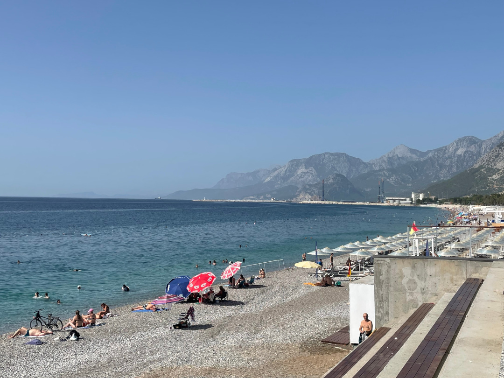

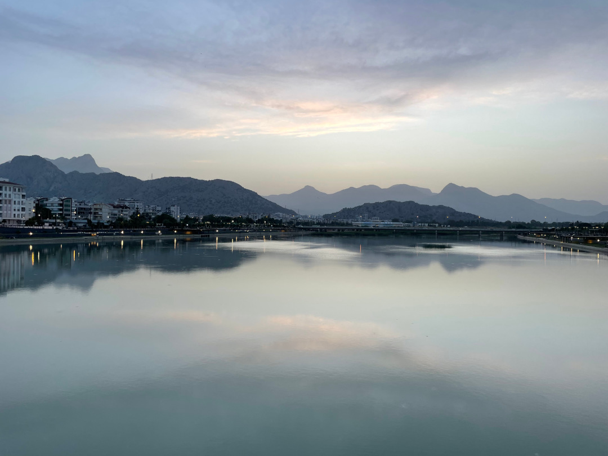

🗓️ 15. Juni: Auch die zweite Nacht im Hotel ist sehr entspannt. Wir gehen mit Henry wieder die Runde entlang der Promenade. Da wir das Frühstück ruhig verpassen können, nutzen wir die gewonnene Zeit und machen uns anschließend schon früh auf den Weg nach Antalya. Solche Ausflüge konnten wir in letzter Zeit eher selten machen, weil es für Henry sonst zu warm ist. Im Hotel mit Klimaanlage kann er aber entspannen, während wir durch die Stadt laufen. Wir besorgen uns Busfahrkarten und fahren 30 Minuten mit dem Bus in die Stadt. Wir steigen direkt am Hadrianstor aus und laufen durch die Altstadt zur Yivli Minare Moschee. Es erinnert etwas an Marokko mit dem Unterschied, dass die Märkte und Basare weniger für Einheimische sind, um Lebensmittel, Kleidung und manchmal auch Tiere zu kaufen, sondern vor allem für Touristen. Im Endeffekt gibt es hier nur gefälschte Markenkleidung. Daher ändern wir unseren Kurs schnell Richtung Hafen. Dazu müssen wir erst etwas runter gehen, was kein Problem ist. Der Rückweg bergauf ist bei den Temperaturen aber schon echt anstrengend. Oben müssen wir erstmal eine Pause machen. Wir schwitzen ja sowieso schon immer, egal was wir machen, aber heute ist es noch mal extremer. An einigen Stellen kann Antalya aber echt schick sein und wir schlendern noch durch einen Park direkt oberhalb des Meeres. Danach geht’s zurück zur Bushaltestelle, wo wir zurück in unseren Stadtteil fahren. Zum Glück sind die Busse modern und haben Klimaanlagen. Eine Busfahrt kostet übrigens knapp 60 Cent. Weil das Frühstück ausgefallen ist, wird es Zeit für ein (Nach-)Mittagessen. Auch heute nutzen wir danach noch die Zeit für Arbeit und weitere Planungen. Nach Sonnenuntergang gehen wir dann immer die größte Runde mit Henry, dabei ist er dann auch wieder quasi der alte. Die Straßenhunde hier in der Stadt sind auch deutlich ruhiger als auf dem Land. Einige Kämpfe musste Henry auf der Reise schon über sich ergehen lassen (allerdings eher mit Wachhunden als mit echten Streunern), aber hier haben eher alle Respekt vor Henry als andersrum. Wir besorgen uns noch Abendessen und lauschen wieder den schiefen Gesängen zur Livemusik. Wenigstens ist immer um Punkt halb zwölf Feierabend.

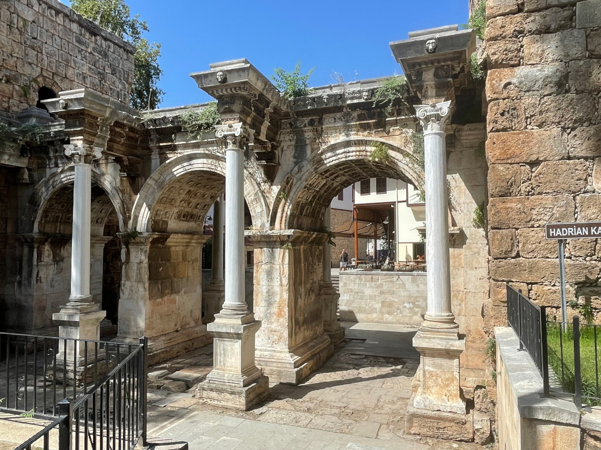

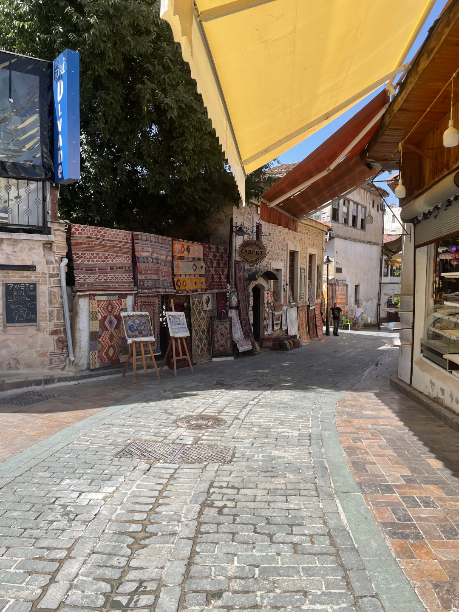

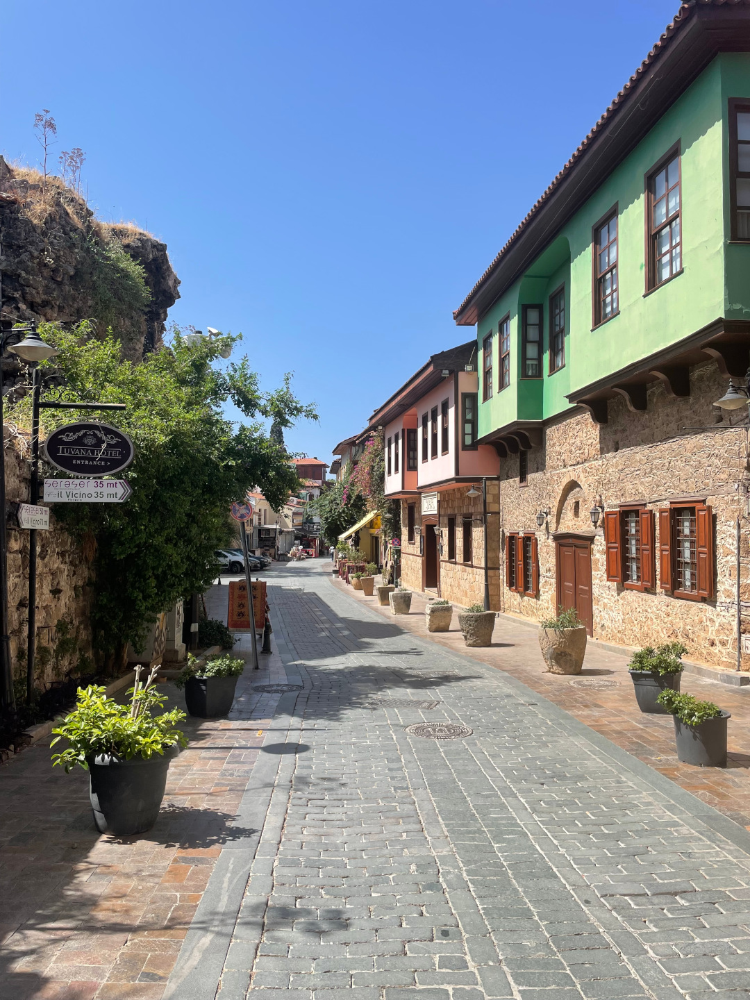

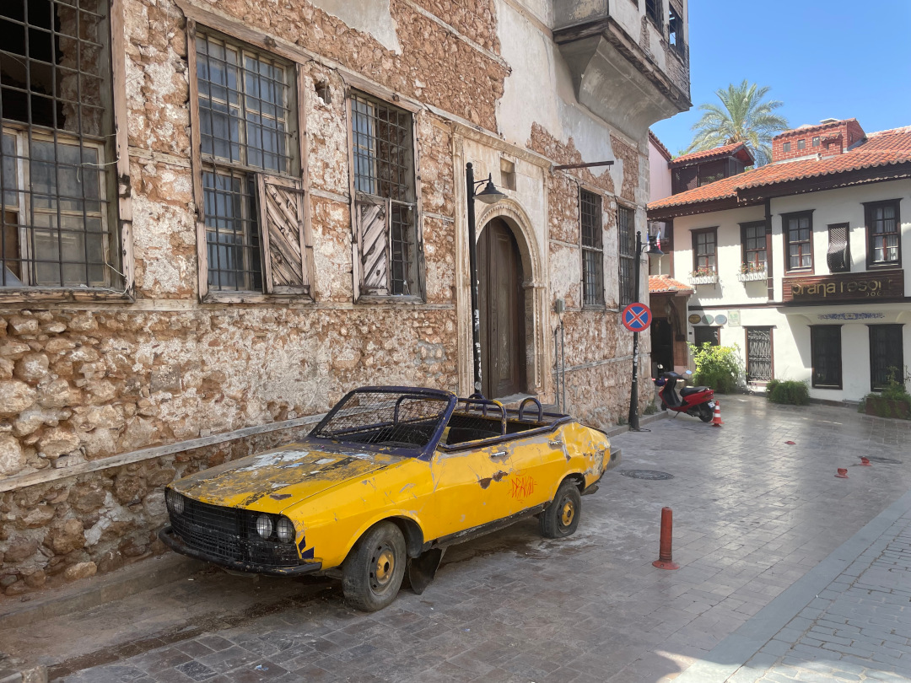

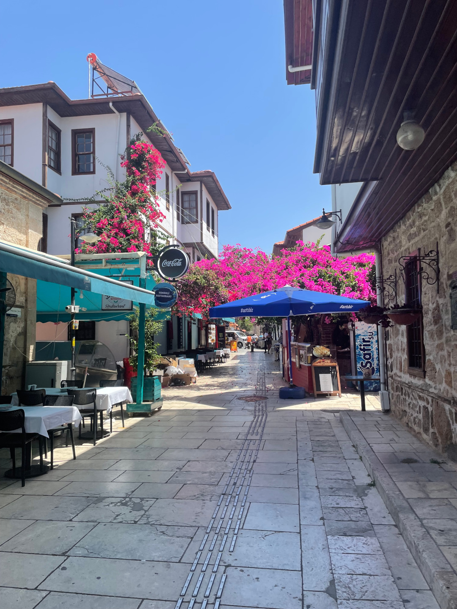

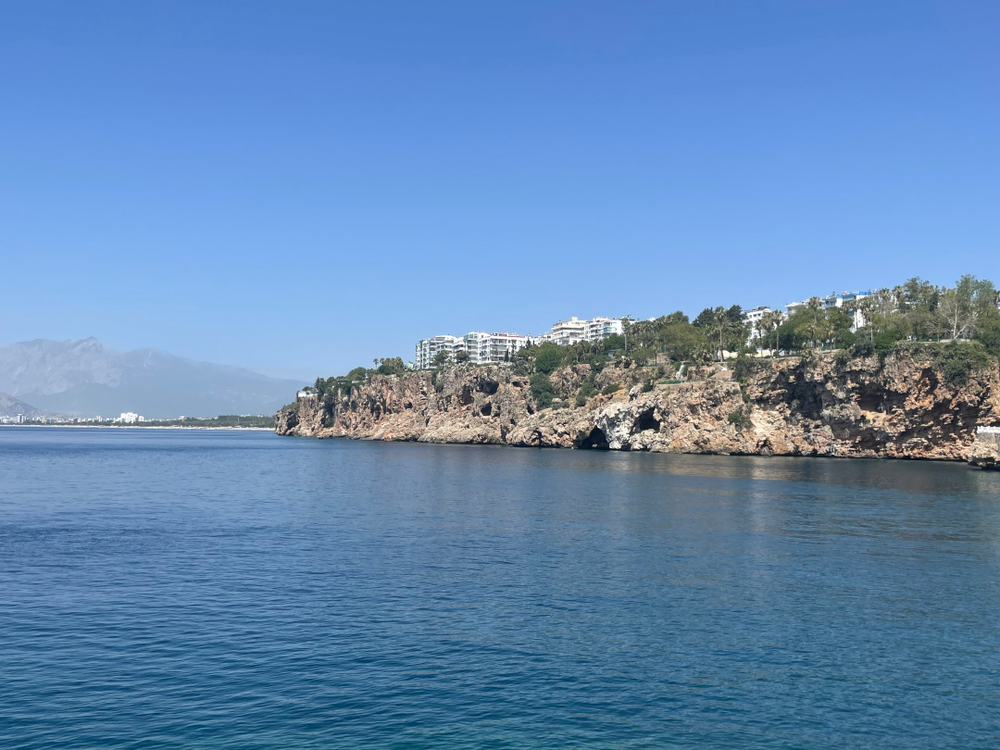

🗓️ 16. Juni: Wir gewöhnen uns schon an die Klimaanlage, was problematisch werden könnte, weil heute Nacht die letzte im Hotel war. Wir gehen die übliche Runde mit Henry und geben dem Frühstück noch eine letzte Chance. Danach packen wir alles zusammen und entern wieder den Bulli. Die Klimaanlage war bei den Temperaturen wirklich nötig und hat uns wieder etwas mehr Schlaf geschenkt, ansonsten muss man hier und in dem Hotel aber keine Minute zu viel verbringen. Wir sind froh wieder frei im Bulli zu sein. Auch heute wollen wir noch an der Küste bleiben, aber etwas weiter östlich. Unsere erste Fahrt führt uns von Antalya nach Side. Hier gibt es noch viele antike Sehenswürdigkeiten der alten Stadt, Den Ort kennt man auch von einigen Urlaubern, entsprechend war die Vorstellung, dass es hier so voll wird wie um Antalya, aber das hielt sich in Grenzen. Der Gang durch die antike Stadt lohnt sich wirklich. Highlight ist das antike Theater. Eins der besterhaltenen Theater weltweit, mit damals 17.000 Plätzen. Solche antiken Stätten gibt es hier in der Türkei sehr viele und teilweise sind sie noch echt gut erhalten. Wieder was gelernt. Danach kaufen wir noch etwas ein und fahren ein paar Kilometer weiter südlich. Hier ist unser Campingplatz für heute. Übrigens direkt neben uns befindet sich „Dortmund Camping“. Wir entscheiden uns aber für den Nachbarn wegen der besseren Bewertungen. Der „Campingplatz“ befindet sich eher im Garten der Pension und hat Platz für vier Bullis und einige Zelte. Die Plätze sind mit uns dann auch alle belegt. In dieser Woche beginnt das islamische Opferfest, also eine Woche schulfrei, was viele Einheimische für einen Kurzurlaub nutzen. Die Türken sind aber meistens mit einem Zelt unterwegs, daher findet sich immer ein Platz. Wir stehen direkt ein paar Meter über dem Meer mit einem top Ausblick. Wir entspannen noch etwas und gehen im Meer schwimmen. Zum Abend werden wir vom Besitzer bekocht. Es gibt Brot, Suppe, Salat, Köfte und Melone und alles ist super lecker. Zum Sonnenuntergang geht es nochmal mit Henry raus und danach ins Meer zum Schwimmen im Mondlicht. Alles in allem zwar wärmer, aber entspannter als in den großen Hotels.

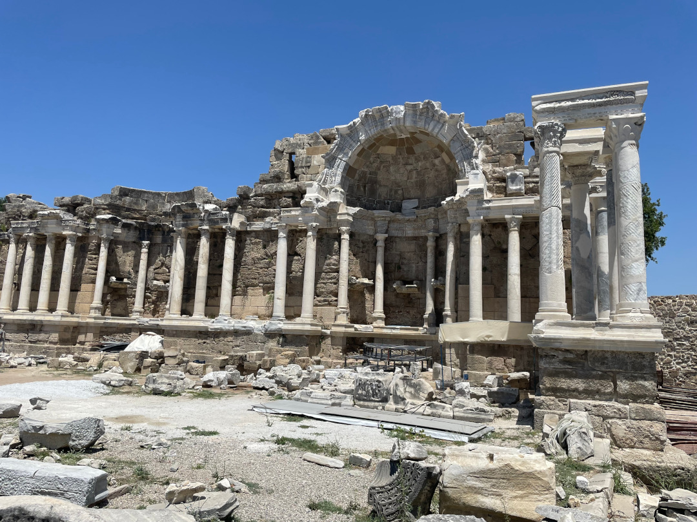

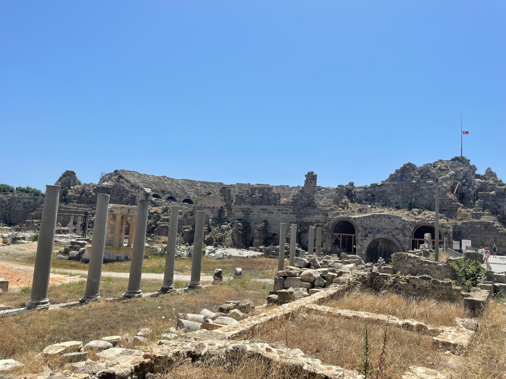

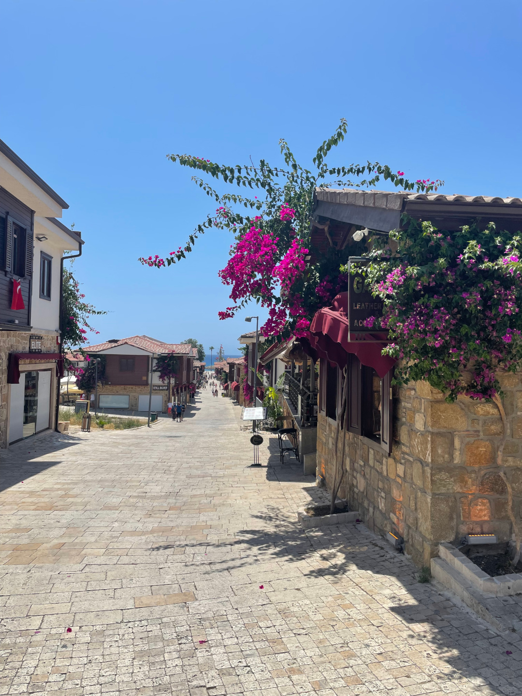

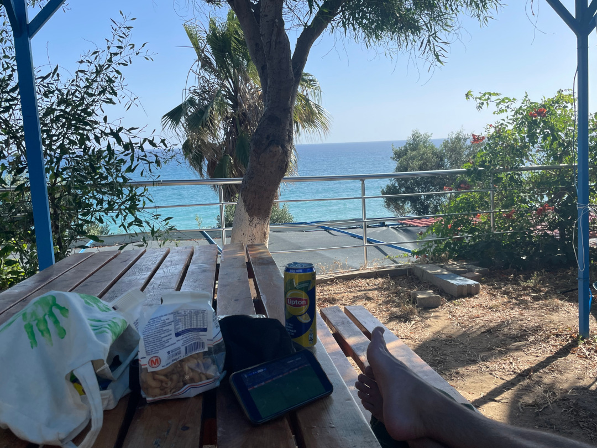

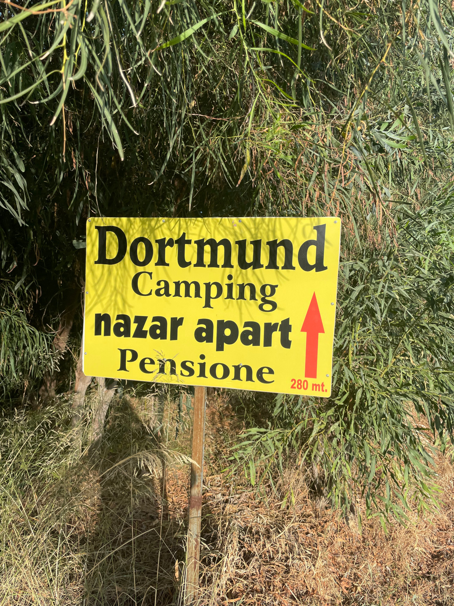

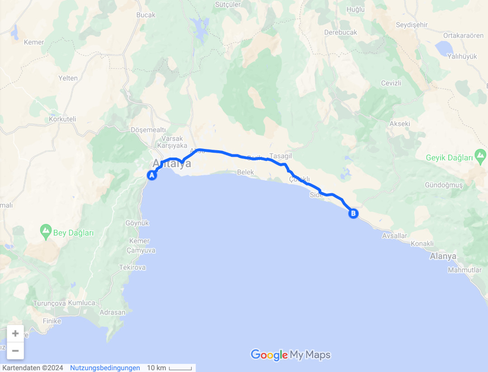

