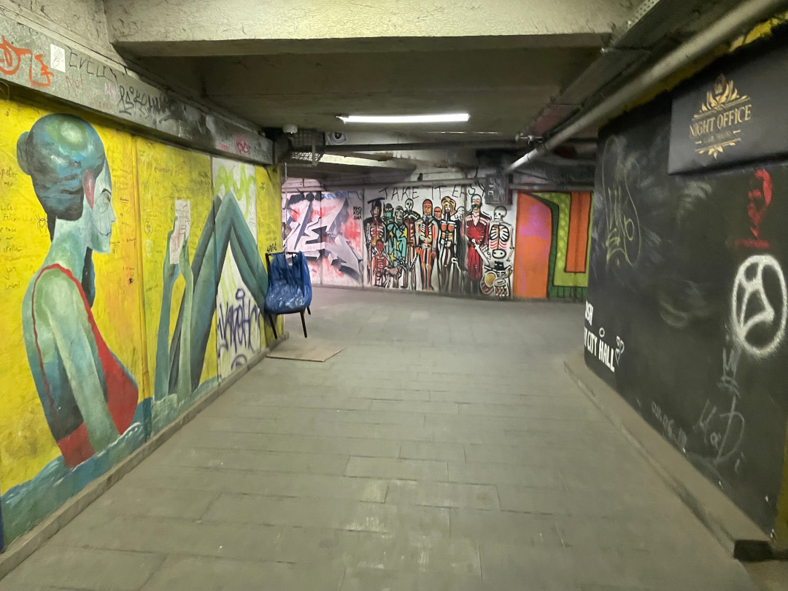

Wir holen hohen Besuch in Tiflis am Flughafen ab und verbringen ein paar Tage in der Hauptstadt Georgiens.

<!--more-->

🗓️ 14. Juli: Wir wachen nochmal am See auf und um uns herum grasen gerade wieder überall Kühe, die langsam auf ihrem Weg zum See sind. Ein letztes Mal gibt es eine gute Henry-Runde am See entlang und dann fahren wir los nach Süden. Weil in Tiflis letztes Mal so viel Verkehr war, nehmen wir heute die Umgehungsstraße und nehmen ein paar Kilometer mehr in Kauf. Unterwegs tanken wir nochmal günstig und kaufen ein. Dann fahren wir zum Flughafen. Als wir ankommen, wird für den Flieger eh noch etwas Verspätung angezeigt und vor der Sicherheitskontrolle gibt es einfach nichts Gutes zu essen für uns. Deshalb setzen wir uns doch nochmal ins Auto und fahren zum nächsten Imbiss zurück. Dann düsen wir schnell wieder zum Flughafen und ahnen noch nicht, wie lange es noch dauern wird. Selbst nach der Landung und ohne großes Gepäck dauert es nämlich noch ziemlich lange, bis unser Besuch dann endlich durch die Tür kommt. Zusammen machen einen Bogen um die wartenden Taxifahrer und fahren dann in die Altstadt. Hier haben wir für ein paar Tage eine Unterkunft gemietet, damit wir in Ruhe die Hauptstadt angucken können. Dort angekommen empfängt uns der Besitzer sehr freundlich und gibt uns erstmal zu Fuß eine Führung durch die Umgebung. Die Lage ist perfekt und wir können eigentlich alles zu Fuß regeln. Wir kommen erstmal in Ruhe an, gehen mit Henry noch eine Runde. Dann geht’s ab in den Waschsalon und weil der wirklich nur zwei Minuten von uns entfernt ist, können wir nebenbei zwei Maschinen waschen und trocknen. Danach gehen wir georgisch essen und es gibt ganz klassisch Kachapuri, Khinkali und Ostri. Dann sind wir alle ziemlich kaputt vom Tag und deshalb früh im Bett.

🗓️ 15. Juli: Heute Morgen geht es mit Henry direkt über die bekannte Friedensbrücke und in den Park auf der anderen Flussseite und anschließend durch die Altstadt und die vielen kleinen Gassen zurück. Morgens ist es hier noch richtig schön leer, nachmittags und abends sieht das dann ganz anders aus. Danach starten wir das Sightseeing-Programm. Als Erstes laufen wir hoch zur Statue der Mutter Georgiens. Dafür geht es einige Stufen hoch und es ist jetzt schon ziemlich warm. Es gibt zwar auch eine Seilbahn, aber die haben wir nicht nötig, weil es auch nicht so ganz hoch ist. Die angrenzende Festung ist leider wegen Bauarbeiten gesperrt. Deshalb geht es für uns erstmal den gleichen Weg wieder runter. Dieses Mal legen wir aber einen kleinen Frühstücksstopp in einem kleinen Café neben der Treppe ein. Anschließend geht es in den Dedaena Park, in dem es viele kleine Flohmarktstände gibt. Wir schlendern so durch die Gegend und gehen dann in eine Mall. Wir nehmen uns noch einen Mittagssnack mit und sitzen dann im Hof unserer Unterkunft im Schatten und lassen es uns schmecken. Ein bisschen beschäftigen wir uns noch mit der weiteren Route, was gar nicht so leicht ist wegen der wenigen echten Campingplätze in Georgien. Deshalb gehen wir dann lieber in ein Restaurant um die Ecke essen. Wir sitzen schön auf der Dachterrasse, aber das Essen ist eher solala. Danach spielen wir noch Karten und der Tag ist auch schon wieder vorbei.

🗓️ 16. Juli: Heute Nacht hatten wir erstmal einen Schreck, weil jemand sich vertan hat und von außen versucht hat, unser Apartment aufzuschließen. Um uns zu erholen, gibt es die gleiche Henry-Runde wie gestern. Dieses Mal allerdings leider doch mit einem Rudel Straßenhunde, das es auf ihn abgesehen hat, aber mittlerweile sind wir ja Profis im Verteidigen. Dann erledigen wir ein paar Sachen und wollen gegen 11 frühstücken gehen. Bis wir das Café gefunden haben, das wir ins Auge gefasst hatten, ist es leider schon zu spät, aber ein paar Ecken weiter werden wir fündig und frühstücken richtig lecker. Gestärkt machen wir uns dann auf den Weg zur Metro. Es geht einmal zum Bahnhof und zum Stadion. Und zwar genau wie in Jerewan mit Turbo-Rolltreppen und einer schnellen, ruckeligen Fahrt. Als wir aussteigen, landen wir direkt in der Unterführung schon mitten auf einem Basar. Es ist sehr wuselig und eng und fühlt sich an wie eine andere Welt als in der touristischen Altstadt, aber auch hier ist Tiflis sehr lebendig. Wir drehen eine Runde zu Fuß und fahren dann wieder zurück zum Liberty Square. Nach kurzem Abstecher in der Mall laufen wir zurück zum Apartment. Wir drehen nochmal eine Henry-Runde zusammen und Tobi packt seine Sachen, denn der geht für eine Woche auf Heimaturlaub. Am Nachmittag begleiten wir ihn zum Flughafen. Beide Wege fahren wir mit dem Taxi, denn der Bulli ist im Hof eingeparkt und es ist auch entspannter, sich in der Stadt fahren zu lassen. Wir verabschieden uns von Tobi, und als wir zurück sind, machen wir uns auf den Weg zur Sameba Kathedrale. Die liegt auch auf einer Anhöhe über der Stadt. Die Abendsonne bringt die Kathedrale richtig zum Leuchten. So ist der Koloss beeindruckend und von innen auch prunkvoller als manch andere Kirche/Kloster auf unserer Reise. Es gibt wieder Tücher zum Umbinden, falls man kurze Sachen trägt. Dieses Mal in schickem Rot. Wir laufen wieder runter, kaufen nochmal für die nächsten Tage im großen Supermarkt ein und gehen zurück zum Apartment. Nach kurzer Pause geht’s dann ein letztes Mal ins Restaurant, und zwar einfach in das, in dem wir auch gefrühstückt hatten. Gestern Abend gab es Musik von einem Klavierspieler, aber heute Abend schon bessere Musik von einem Paar.

