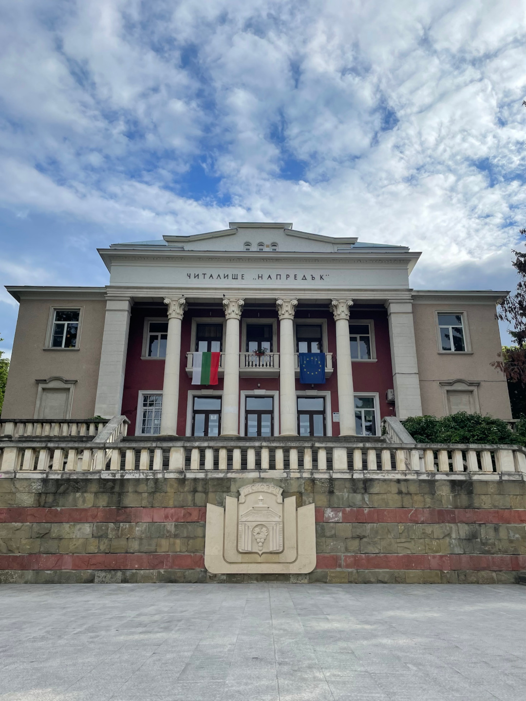
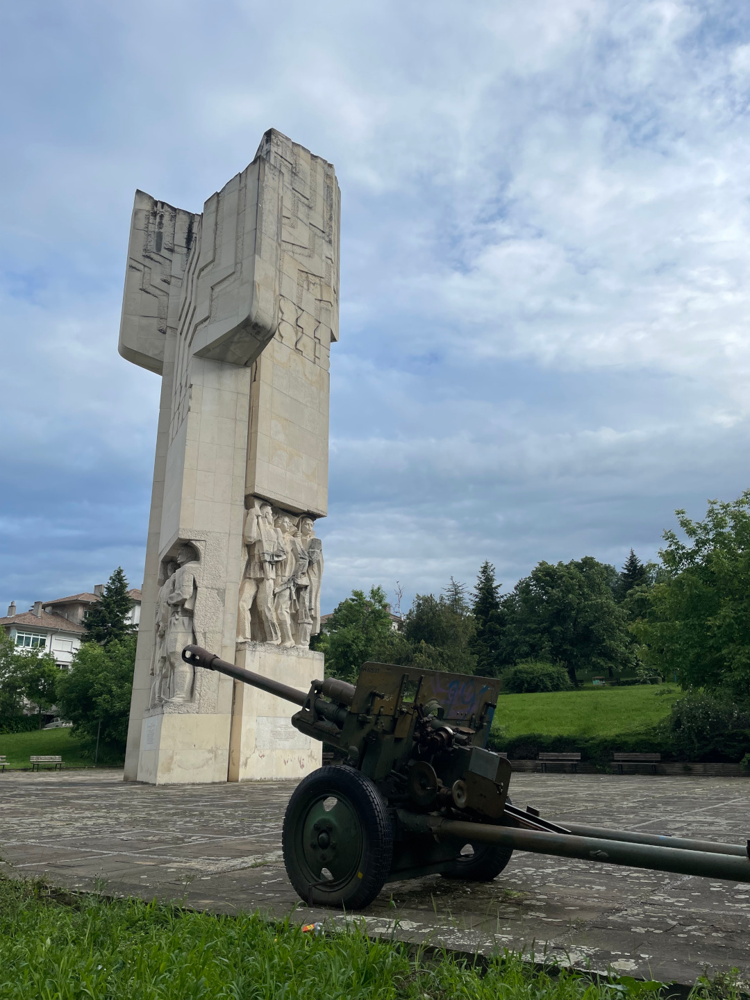
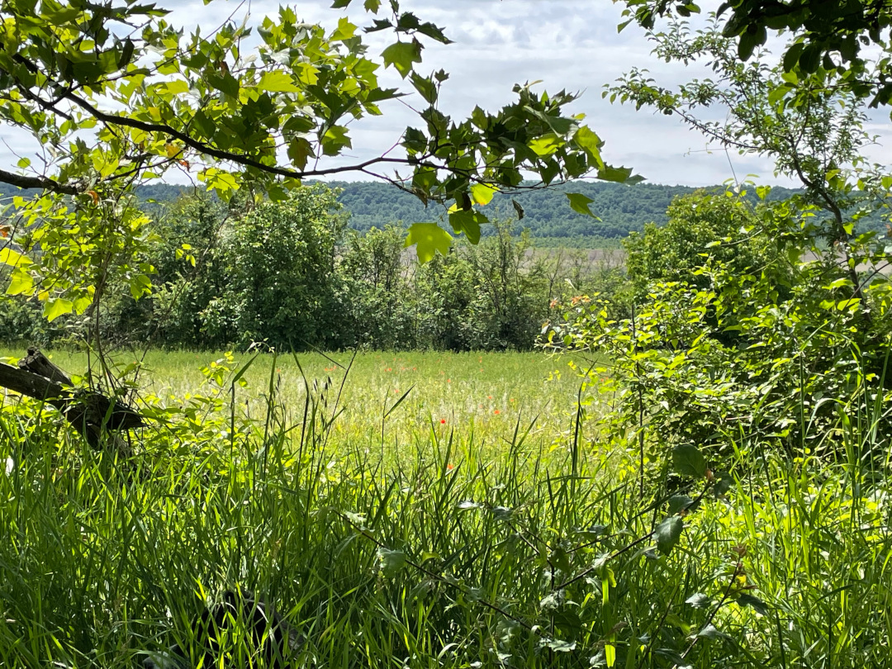
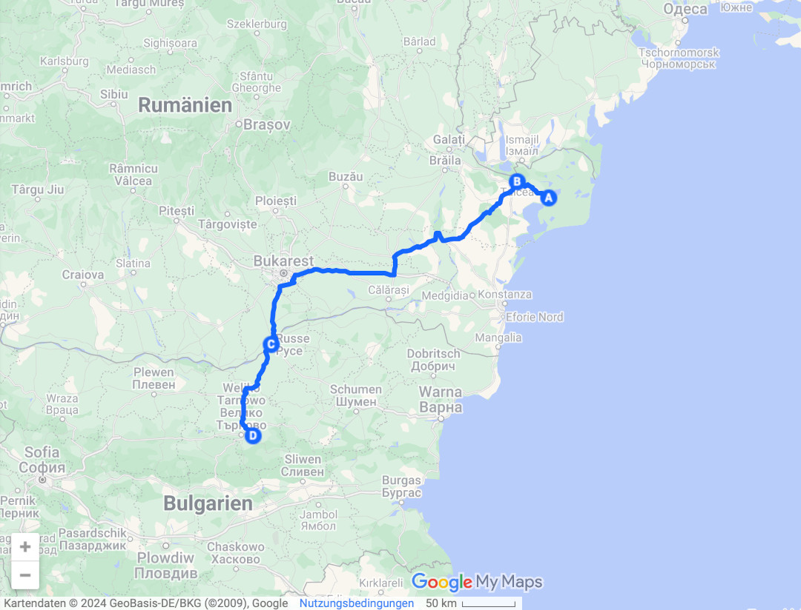
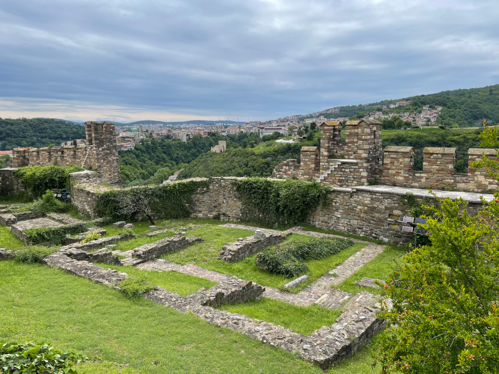
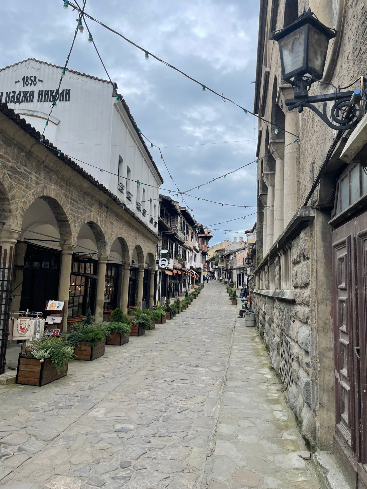
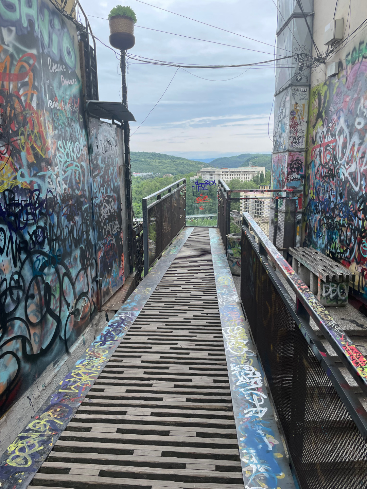
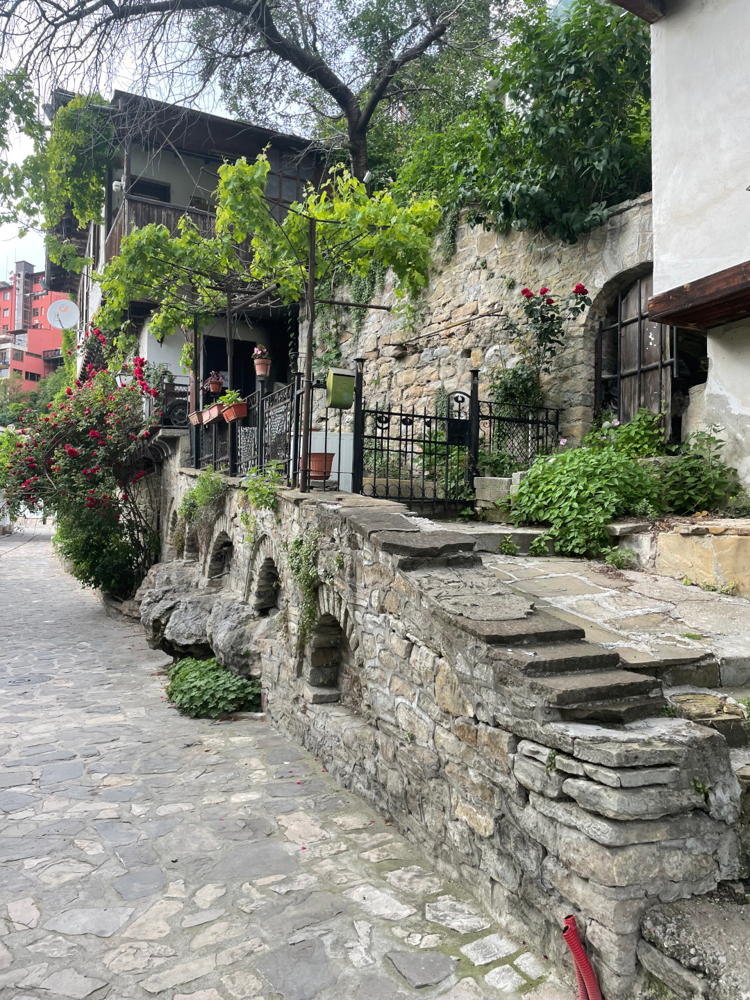
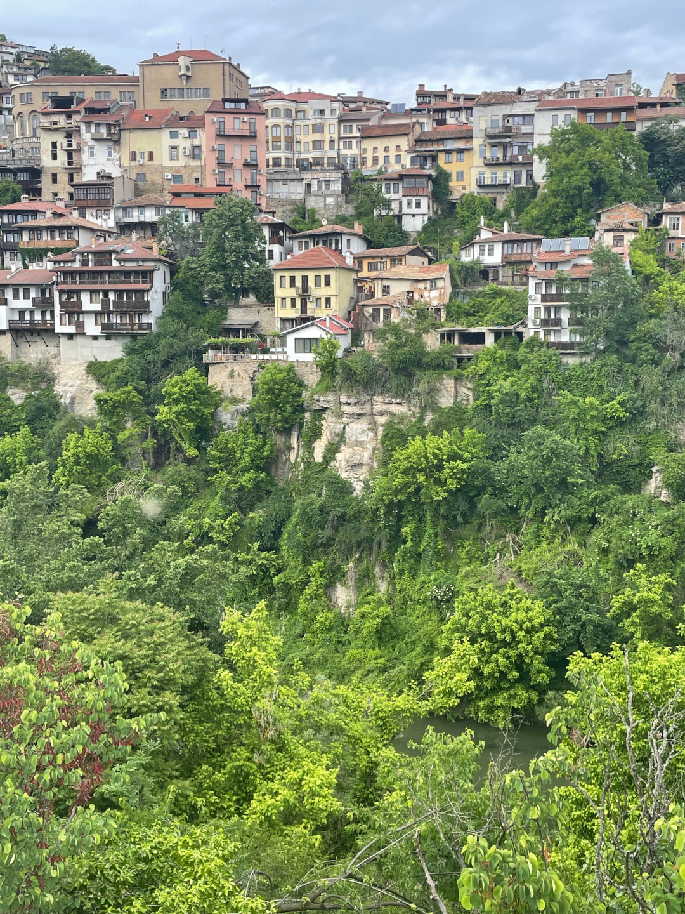
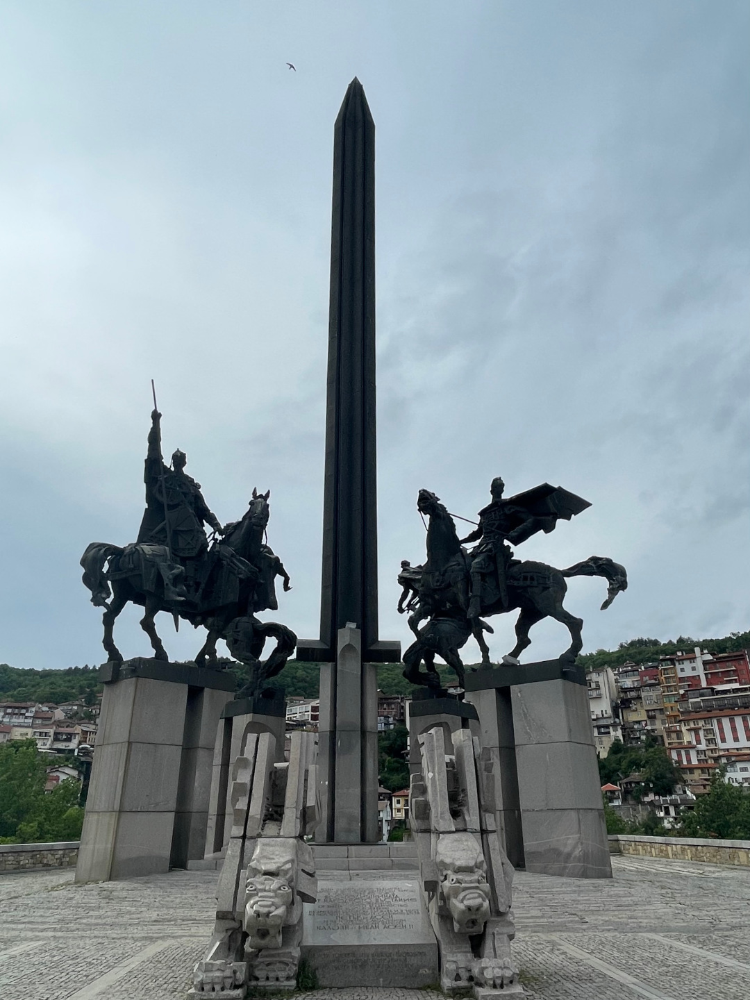

Es geht direkt weiter ins nächste Land, so dass wir uns ab jetzt auf der Balkanhalbinsel befinden.

<!--more-->

🗓️ 15. Mai: Wieder stehen wir mit Wecker auf, aber heute zum Glück wieder etwas später. Wir wollen heute nämlich vergleichsweise viel Strecke machen und haben schon wieder eine Landesgrenze vor uns. Als erstes kaufen wir online die Maut-Vignette für Bulgarien und drehen noch eine Henry-Runde durch die Blumenwiesen. Dann bezahlen wir für die beiden Nächte und die Bootstour und düsen los. Unser erstes Ziel ist Tulcea, wo wir noch eine Chance auf eine Post wittern und einkaufen können. Letztendlich haben wir dann vergessen überhaupt zur Post zu gehen, aber die nächste Chance kommt bestimmt. Wir sitzen heute also vor allem im Auto und machen eigentlich nur kleine Pausen. Schon Kilometer vor der rumänisch-bulgarischen Grenze gibt es auf der rechten Spur einen LKW-Stau. Wir machen uns schon auf längere Wartezeiten und strenge Kontrollen gefasst, auch weil Bulgarien auf der wichtigsten Transitroute von Deutschland in die Türkei liegt. Wir bezahlen noch die zusätzliche Streckenmaut für die Überquerung der Donau zwischen dem rumänischen Giurgiu und dem bulgarischen Russe und dann sind wir schon an der Grenzstation und sind sehr überrascht. Es gibt einfach gar keine Kontrolle. Wir geben unsere Papiere ab, haben alles innerhalb von Sekunden schon wieder zurück und dürfen direkt durchfahren, obwohl der Beitritt zum Schengenraum genau wie in Rumänien eigentlich erstmal nur für Luft- und Schiffsverkehr gilt. Uns kommt es aber entgegen und so fahren wir einfach weiter. Die Straßen werden direkt wieder etwas schlechter als in Rumänien, sind aber immer noch ganz in Ordnung. Die Ostblocks erinnern teils eher an Moldau als an Rumänien und das kyrillische Alphabet sitzt natürlich noch nicht so perfekt, dass wir alle Schilder lesen könnten. Wir müssen uns also erst noch eingewöhnen und holen mal wieder eine neue Währung ab. Der Umrechnungsfaktor von Euro zu Lew ist zum Glück nur 2 und deshalb ist es selbst für mich leicht umzurechnen. Wie immer nach so langen Fahrten lassen wir lieber jemanden für uns kochen und die Speisekarte hat zum Glück sogar englische Übersetzungen direkt dabei. Eigentlich wollten wir heute zu einem kleinen Hof, entscheiden uns dann spontan aber doch für einen richtigen Campingplatz und kommen am frühen Abend dort an. Etwas ungewohnt ist es, denn es sind andere Leute hier, und zwar nicht nur Einheimische, sondern auch Schweizer, Franzosen und Briten. Irgendwie tut das auch mal wieder gut, vor allem weil der Platz so groß und grün ist, dass man trotzdem für sich stehen kann mit Blick auf die Wiesen und Felder und viel Platz für Henry. Der Platz hat mit 31€ aber auch einen sehr stolzen Preis. Wir sind auf jeden Fall k.o. und freuen uns aufs Bett.

🗓️ 16. Mai: Wir schlafen uns erstmal richtig aus und lassen es vormittags ruhig angehen. Dann gehen wir mit Henry eine große Runde durch die Felder und frühstücken ausgiebig. Auch die Möglichkeit zum Wäschewaschen nutzen wir gerne mal wieder. Als alles erledigt und wieder aufgeräumt ist, machen wir uns mit einem Taxi auf den Weg in die nächstgrößere Stadt Veliko Tarnovo (Велико Търново), die einst die Hauptstadt des Zweiten Bulgarischen Reichs war. Unser erster Weg führt uns hoch zu den Resten der Festung Tsarevets, die aus dem 12. Jahrhundert stammt. Von hier aus hat man auch einen guten Blick über die heutige Stadt. Danach geht es für uns ins Museum of Illusions, in dem einige optische Illusionen zu bestaunen sind. Von dort aus schlendern wir durch die Handwerkergasse Samovodska Tscharshia mit ihren kleinen Läden, bevor wir über Treppen runter zur Ulitsa General Gurko kommen. Von dieser kleinen Kopfsteinpflasterstraße haben wir wieder super Aussichten auf die Häuser am Hang und den Fluss. Nachdem wir noch auf die andere Flussseite gelaufen sind, um das Denkmal zum Zweiten Bulgarischen Reich bzw. zu Ehren der Assen Dynastie anzugucken, nehmen wir wieder ein Taxi zurück zum Campingplatz. Die Besitzerin hatte uns netterweise einen kleinen Zettel mitgegeben, auf dem auch in kyrillischen Buchstaben stand, wo wir hinmöchten. So werden wir am richtigen Ort abgesetzt. Hier haben wir einen sehr entspannten Abend mit Besuch von einem Storch und den ersten Glühwürmchen auf dieser Reise.

