Langsam verabschieden wir uns von Griechenland, halten aber noch im Nordwesten im Nationalpark Vikos-Aoos.

<!--more-->

🗓️ 15. August: Wir wachen erst etwas turbulent auf, als Steffen schon auf dem Weg nach draußen ist. Den Wecker hatten wir uns wohl etwas spät gestellt, aber eine vernünftige Verabschiedung ist so immerhin noch drin. Weil 5 Uhr noch nicht ganz unsere Zeit ist, legen wir uns danach erstmal wieder hin. Als wir wieder wach sind, drehen wir eine Runde mit Henry durch die Siedlung. Weil es hier überall ziemlich steil bergauf und bergab geht, wird es aber keine riesige Runde. Dann packen wir alles zusammen und kehren zurück in unser Camping-Leben. Leider müssen wir heute noch einen unplanmäßigen Abstecher zurück nach Peleponnes machen, weil auf dem letzten Campingplatz bei den Zitronenplantagen mein Personalausweis aus Versehen liegen geblieben ist als wir abgereist sind. In Athen hatte ich es gemerkt und schnell angerufen. Deshalb wissen wir wenigstens, dass sie gut drauf aufgepasst haben. Als sie mich sehen, wissen sie also gleich Bescheid und sind sehr freundlich. Nach der Stippvisite und einer kleinen Pause für Henry geht es über die Autobahn weiter nach Patras und dort wieder über die Brücke aufs Festland. Die Maut dafür hätten wir uns natürlich lieber gespart, aber was sein muss muss sein. Heute wollen wir vor allem Kilometer machen, denn wir sind ja jetzt ganz offiziell auf dem Rückweg und wollen schon in gut zwei Wochen wieder in Deutschland sein. Unser Ziel für heute ist aber erstmal der Nordwesten Griechenlands, genauer die Region Zagori mit dem Nationalpark Vikos-Aoos. Die Gemeinde wurde 2023 zum Weltkulturerbe erklärt und zwar vor allem für ihre in die Berglandschaft eingefügten traditionellen Dörfer. Aber das Angucken heben wir uns für morgen auf. Heute geht’s für uns nur noch auf einen Campingplatz am Fuße der Berge. Wir haben Glück und finden ein Plätzchen unter dem einzigen großen Baum auf dem ganzen Gelände. Dann geht’s ab in den Pool. Abends müssen wir notgedrungen ein paar Sachen im Minimarkt des Platzes holen und erinnern uns nach fast 20€ für ein Brot und etwas Aufschnitt auch schnell wieder, wieso wir das sonst nicht machen. Heute ist in Griechenland aber Feiertag und so gut wie alles hat zu. Natürlich haben wir beide vorher nicht dran gedacht, dass Maria heute in den Himmel aufgenommen wurde. Naja, immerhin kühlt es sich abends ein bisschen besser ab als in den letzten Tagen, weil wir hier schon etwas höher sind als vorher. Mit allen Schotten auf geht es also mal wieder ins Bullibett.

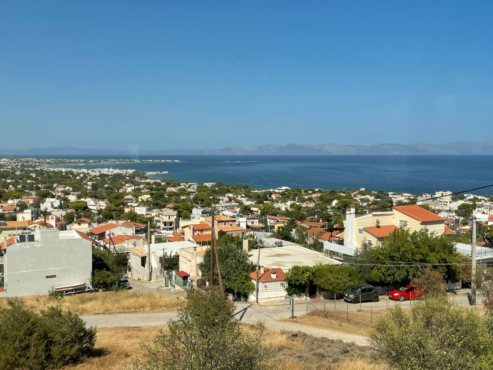

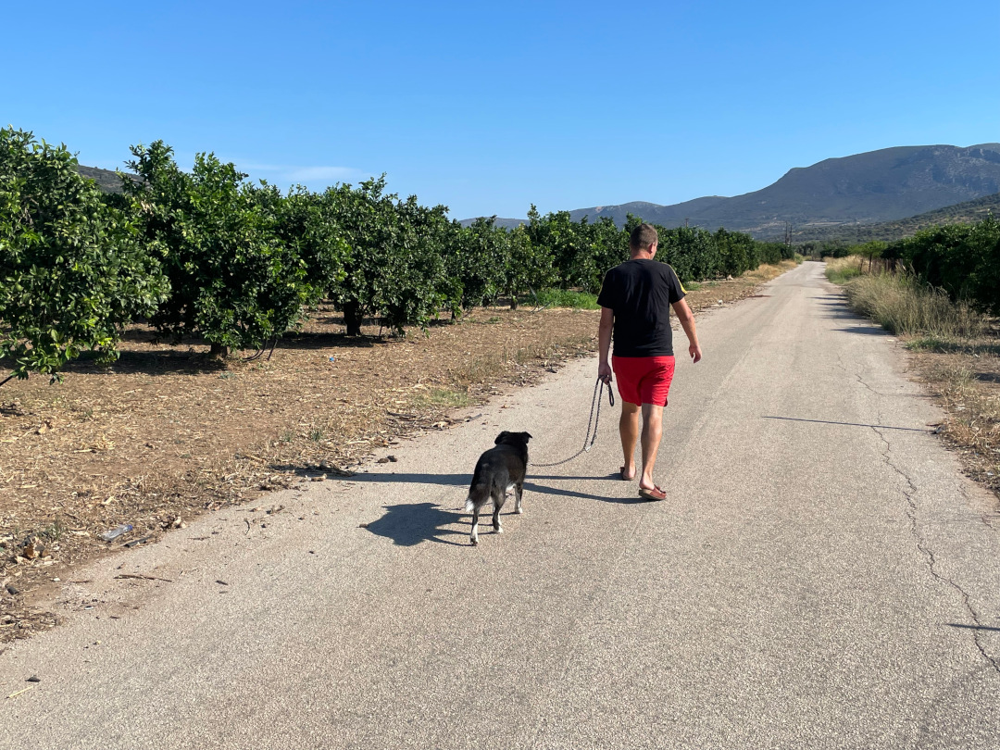

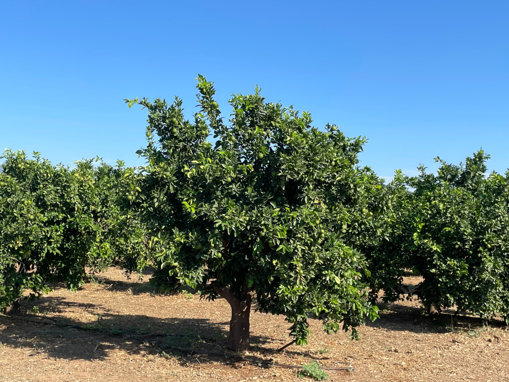

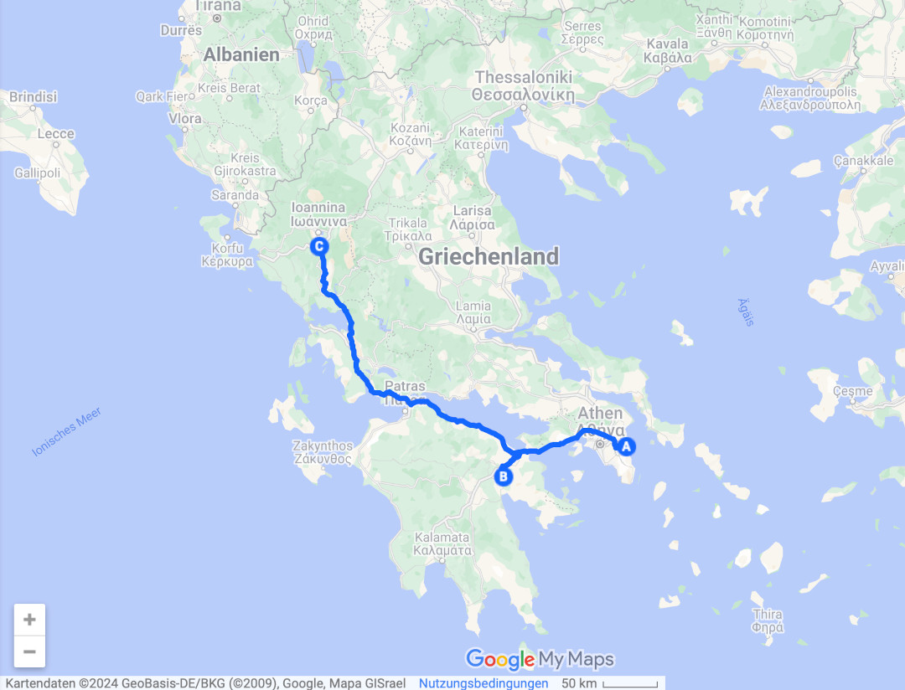

🗓️ 16. August: Weil die Sonne schon wieder knallt und der Pool eh noch zu hat, machen wir uns nach unserer Henry-Runde relativ schnell wieder auf den Weg und düsen in den Nationalpark. Neben Bergen und traditionellen Dörfern gibt es hier auch viele antike Steinbrücken. Unter anderem laufen wir zur Plakidas Brücke, die sogar drei Bögen hat. Das Einzige was hier fehlt, ist Wasser. Nach der anhaltenden Dürre in Griechenland sind hier viele Flüsse ausgetrocknet. Der Grund für den Bau der Brücke ist deshalb nicht so ersichtlich, aber mit etwas Fantasie macht es Sinn. Anschließend schlängeln wir uns die Straßen weiter hoch bis nach Beloi. Von hier aus startet eine einfache und kurze Wanderung zu einem Aussichtspunkt über die Vikosschlucht. Die Schlucht im Pindosgebirge ist als tiefste Schlucht der Welt im Guinnessbuch der Rekorde aufgeführt. Das basiert allerdings auf dem Verhältnis von Tiefe und Breite. Beeindruckend sehen die steilen Felswände auf jeden Fall aus und wir haben eine gute Aussicht. Als wir durchgeschwitzt wie immer wieder am Bulli sind, geht es wieder runter. Wir halten noch an einer Stelle, von der man gute Sicht auf die Vadreto Steps hat, die einfach bis in die 1970er Jahre den einzigen Zugang zu dem gleichnamigen Bergdorf boten. In Serpentinen schlängelt sich die Treppe die Steinwand hinauf und fügt sich perfekt in die Berglandschaft ein. Auf das Hochlaufen über die 1200 Stufen verzichten wir bei der Hitze aber lieber und sind froh, dass es hier mittlerweile Straßen gibt. Stattdessen geht es für uns weiter runter bis zu einem Campingplatz an einem Fluss. Dort angekommen stellen wir aber schnell fest, dass der nichts für uns ist. Weil sie auch Rafting anbieten, herrscht viel zu viel Trubel auf dem Platz und auch hier gibt es keinen einzigen Baum oder sonst irgendwas Schattenspendendes. Leider gibt es in der Gegend kaum Alternativen und so steht sogar kurz im Raum, ob wir doch schon heute weiter nach Albanien fahren. Allerdings ist es schon relativ spät, wir entsprechend müde und der nächste Platz hinter der Grenze auch noch relativ weit entfernt. Stattdessen steuern wir ein Waldhotel an, das auf seinem Parkplatz Plätze für Camper bereitstellt und auf dem Weg zu einem ganz kleinen griechisch-albanischen Grenzübergang liegt. Hier werden wir total nett empfangen, es gibt Schatten, Strom und Wasser am Platz, Toiletten im Hotel und Pool und Duschen dürfen wir auch mitbenutzen und das alles für nur 15€. Wir haben uns also richtig entschieden und verbringen hier einen ruhigen und entspannten Abend. Nachts ist der Sternenhimmel dann noch super gut zu sehen und wir können zufrieden schlafen gehen.  

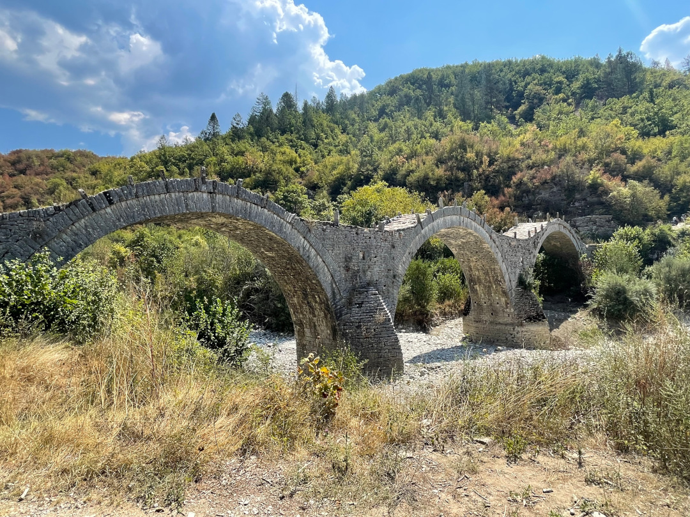

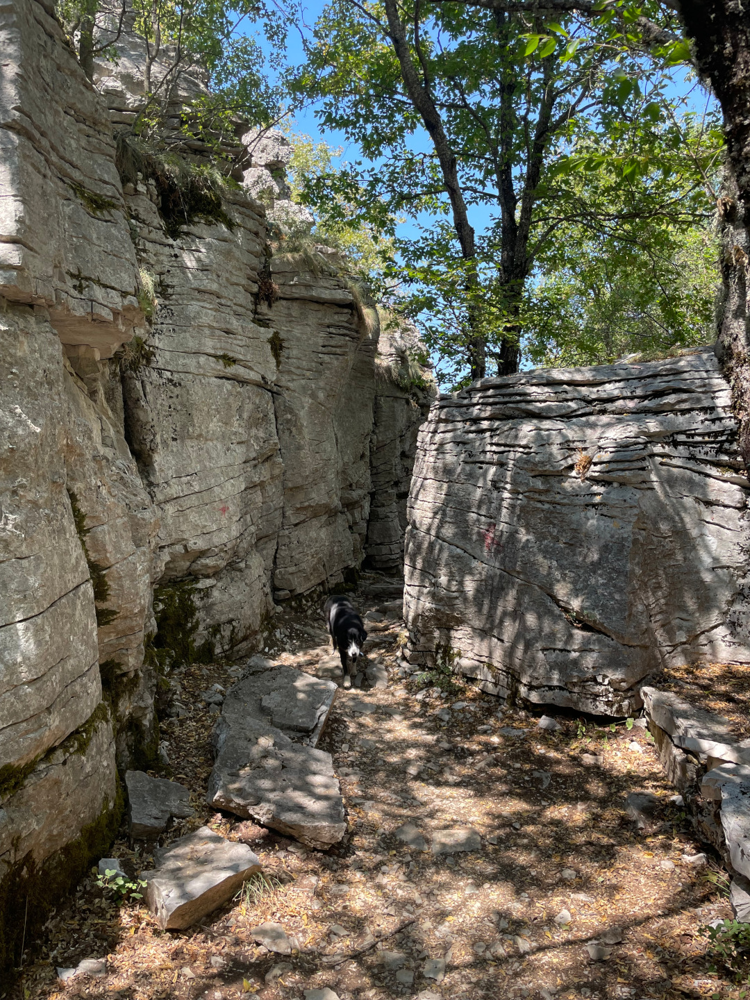

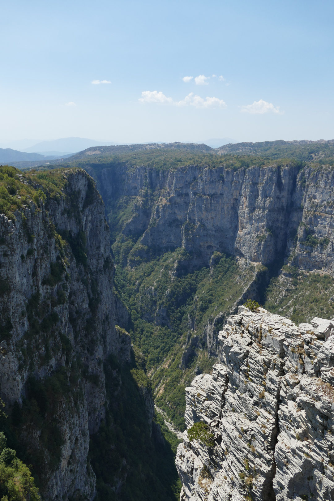

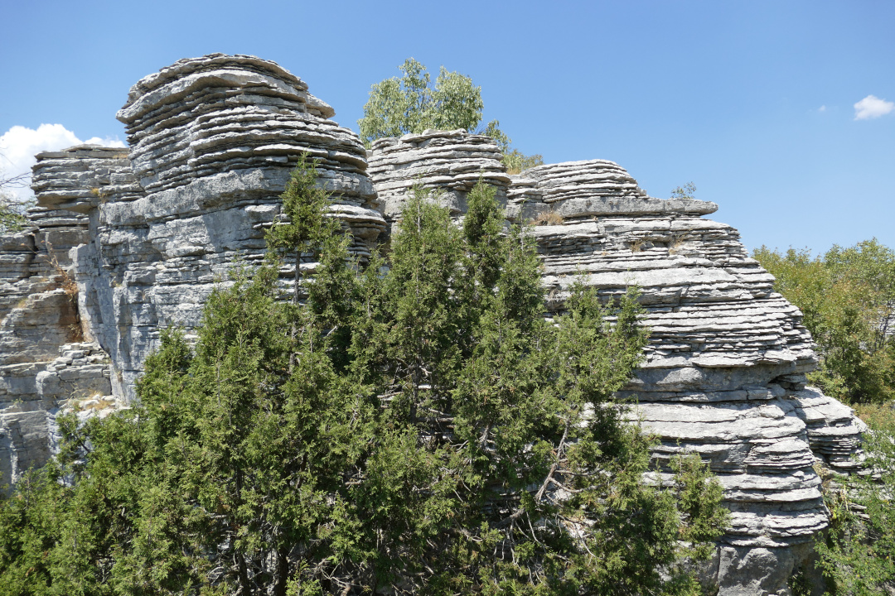

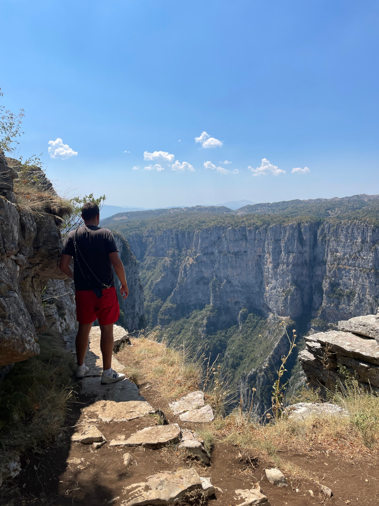

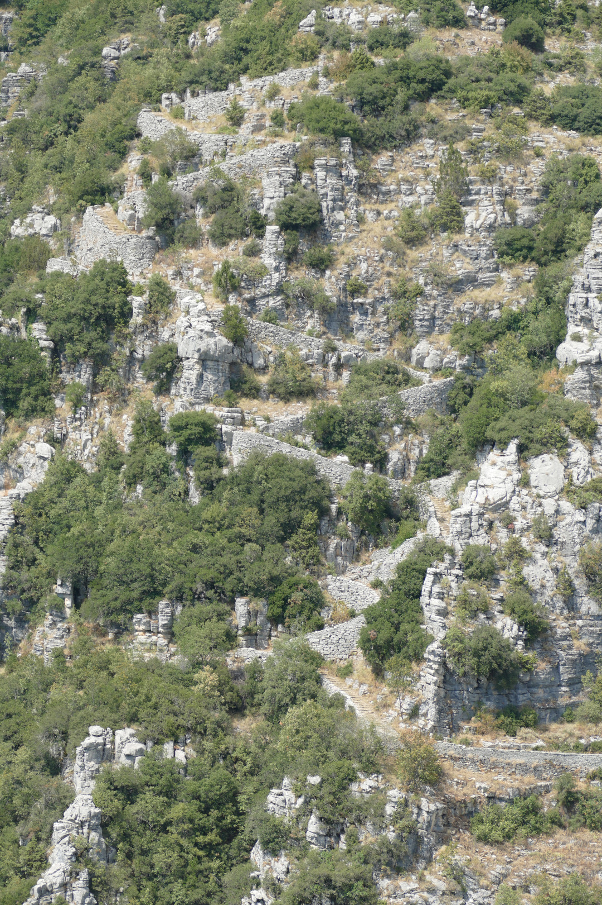

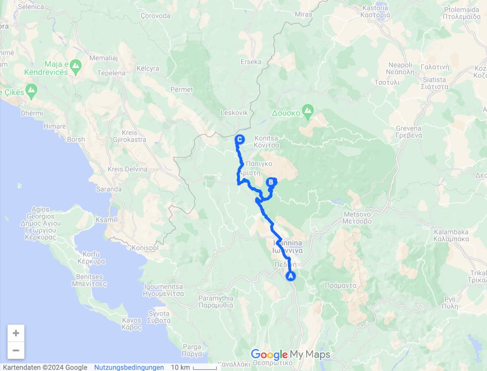