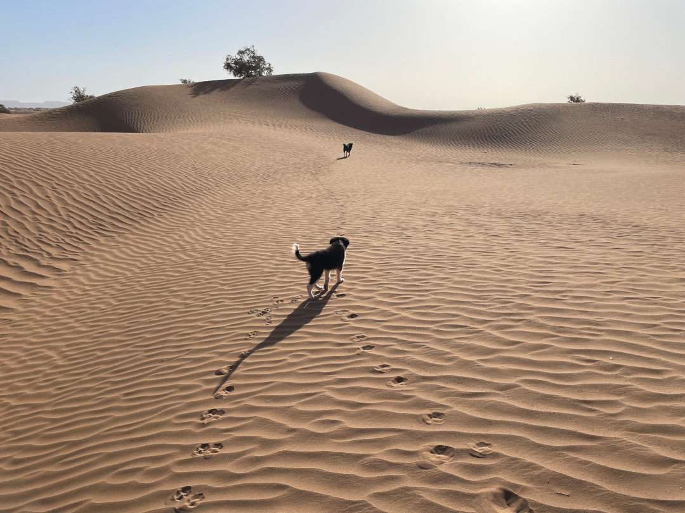
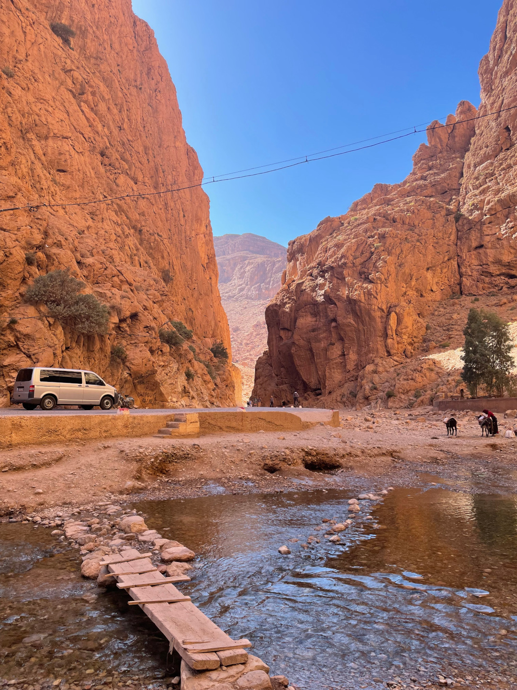
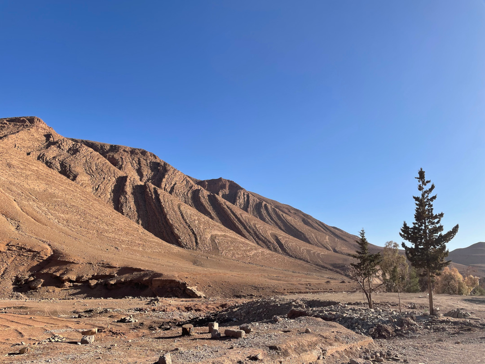
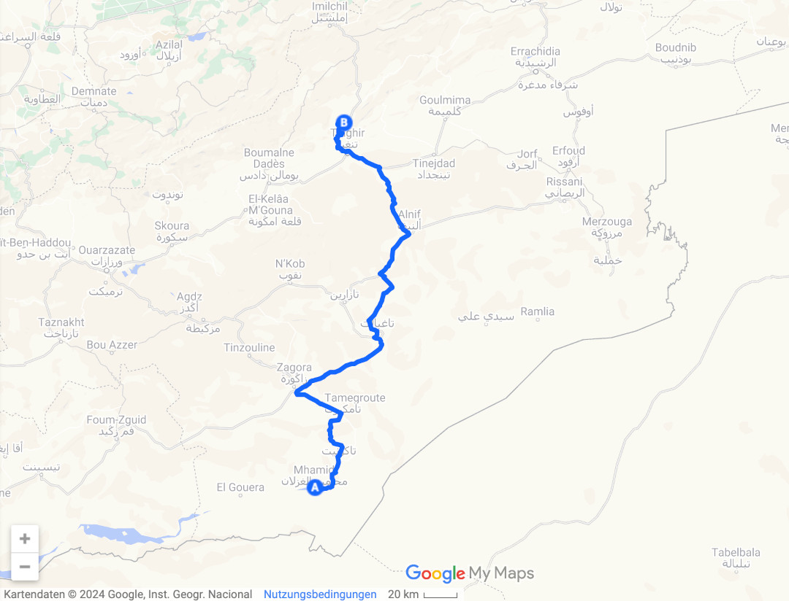
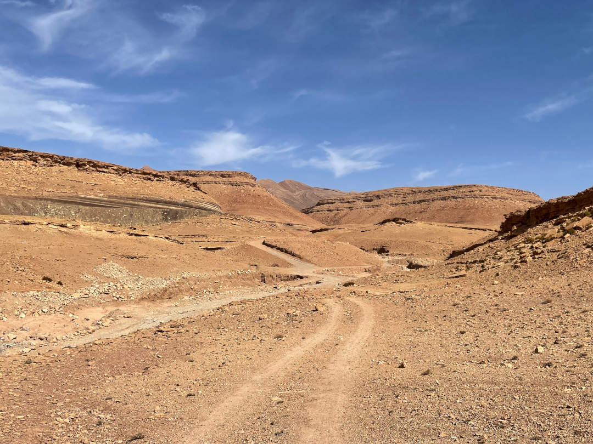
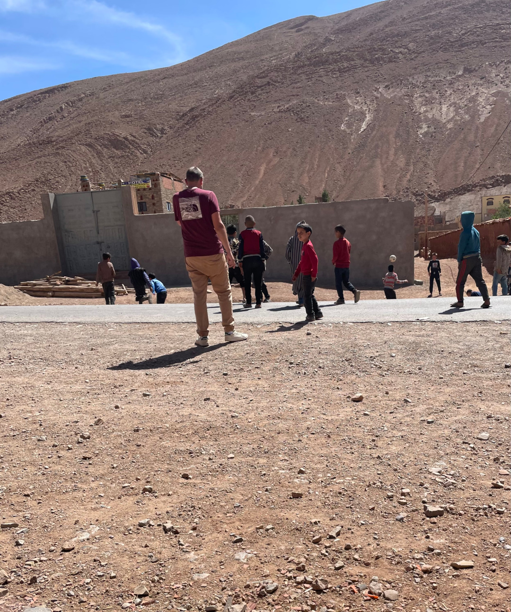
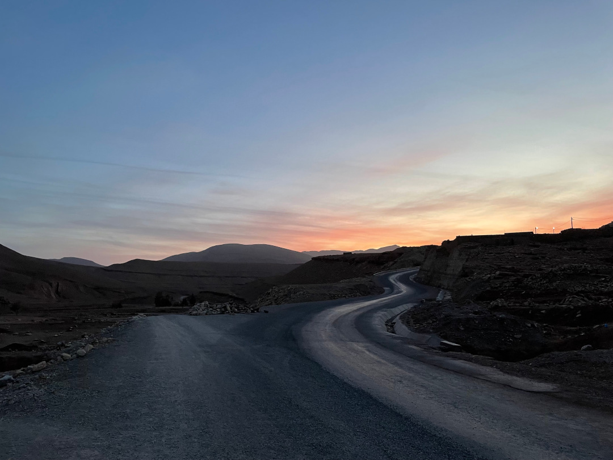

Wir lassen die Wüste und die Hitze wieder hinter uns und fahren ins Atlasgebirge.

<!--more-->

🗓️ 16. März: Wir wachen sehr früh davon auf, dass sich ein Auto neben uns im Sand festfährt –
wie könnte es anders sein. Die Jungs kriegen das aber sehr schnell alleine wieder hin und für uns hat es den Vorteil, dass wir den Sonnenaufgang mitkriegen, der hier genauso magisch ist wie der Sonnenuntergang, nur halt in der anderen Richtung. Unsere morgendliche Runde führt uns natürlich durch die Sanddünen und dieses Mal begleitet uns nicht nur Henry, sondern auch Miloud, der kleine Welpe des Camps. Gestern Abend hat er im Dunkeln noch unsere Schlappen geklaut, heute im Hellen sind wir seine besten Freunde. Anschließend befreien wir uns vom vielen Sand und fahren als Erstes wieder nach Mhamid, um Brot und Wasser zu kaufen. Heute stehen für uns nochmal einige Kilometer Fahrt auf dem Programm, damit wir aus der Wüstenregion ins Atlasgebirge kommen. So beeindruckend die Sahara auch für uns war, so gerne verlassen wir sie auch wieder. Nachdem wir wieder lange immer geradeaus durch die Steppe gefahren sind, sehen wir die ersten Ausläufer der Berge. Dann führt unser Weg direkt durch die Todraschlucht, in der die kleine Straße teils von 300 Meter hohen Felswänden umrahmt wird. Am Ausgang der Schlucht und dem Eingang zum kleinen Ort Tamtetoucht liegt unser Ziel für heute. Der Campingplatz, auf dem wir wieder sehr freundlich mit Tee empfangen werden, und die Umgebung sind sehr schön, vor allem jetzt bei untergehender Sonne. Hier liegt auch deutlich weniger Staub in der Luft als in den letzten Tagen und der Himmel ist deshalb wieder richtig blau. Leider betteln inzwischen aber auch immer wieder Gruppen von Kindern um Geld und sind dabei nicht gerade zurückhaltend. So auch auf unserer letzten Henry-Runde durch die Berge. Man denkt man wäre allein, aber plötzlich kommt von irgendwo in der Ferne ein Bonjour und im nächsten Moment ist man umringt von Kindern, die einen dann auch lange begleiten. Es scheint eine Mischung aus purer Langeweile und der Hoffnung auf ein paar Dirham zu sein, die sie antreibt. Als wir zurück sind, freuen wir uns nach zwei Tagen Berber-Suppe heute mal wieder selbst zu kochen und sind dann auch schnell platt von diesem Tag.

🗓️ 17. März: Geld geben wir den Kindern nicht, aber heute können wir wenigstens ein kleines bisschen was gegen die Langeweile tun, weil wir noch eine zweite Nacht hierbleiben und deshalb viel Zeit haben. Schon auf unserer ersten Henry-Runde spielen wir mit ihnen Fußball. Auch die anderen, denen wir begegnen, ob zu Fuß, auf dem Esel oder im Auto, freuen sich uns zu sehen und fragen immer, wie es uns geht. Die Umgebung hier im Hohen Atlas auf fast 1800m Höhe ist beeindruckend, natürlich ganz anders als in der Wüste, aber trotzdem noch von großer Trockenheit geprägt. Später laufen wir dann noch weiter ins Dorf hinein und wollen eigentlich ein Brot kaufen. Der Laden hat keins da, schickt uns aber mit drei kleinen Jungs weiter. Wir denken sie zeigen uns, wo wir Brot bekommen können. Stattdessen landen wir bei einem der Jungs zuhause und an ihrer Schule. In einem kleinen Shop kaufen wir noch ein paar Schokoriegel für sie und anschließend gibt es ein Fußballmatch mit ihren Freunden. Gegen Mittag sagen wir aber au revoir und ziehen uns wieder auf den Campingplatz zurück. Hier bekommen wir dann doch noch ein frisch gebackenes Brot, können unsere Wäsche mal wieder waschen und uns einfach ausruhen. Den ganzen Tag über sind wir hier die einzigen Gäste. Gegen Abend kommt dann noch ein Bulli aus Österreich, dessen Fahrer ursprünglich aber aus Iserlohn kommt. Nach Vorbestellung können wir alle zusammen abends auch im Restaurant essen. Heute müssen wir uns also wirklich nicht um viel kümmern und können uns noch über unsere Reisepläne und Erlebnisse austauschen.

