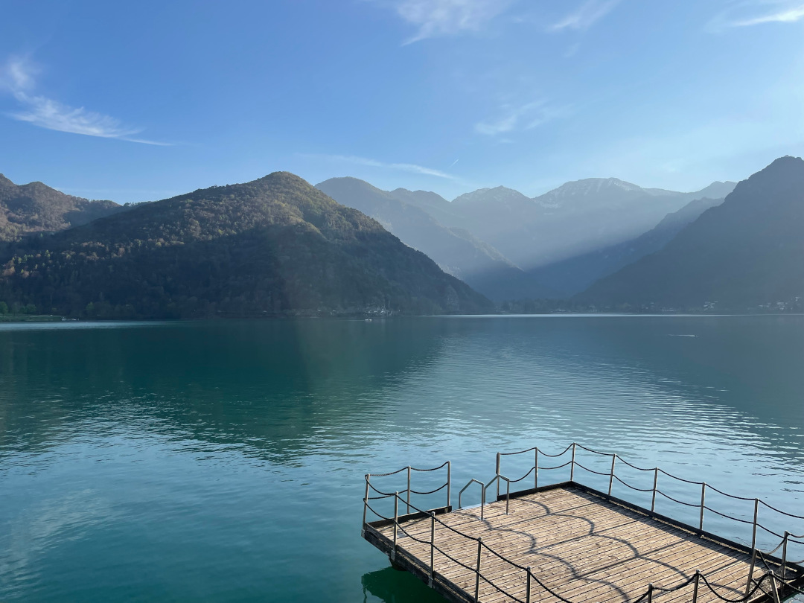
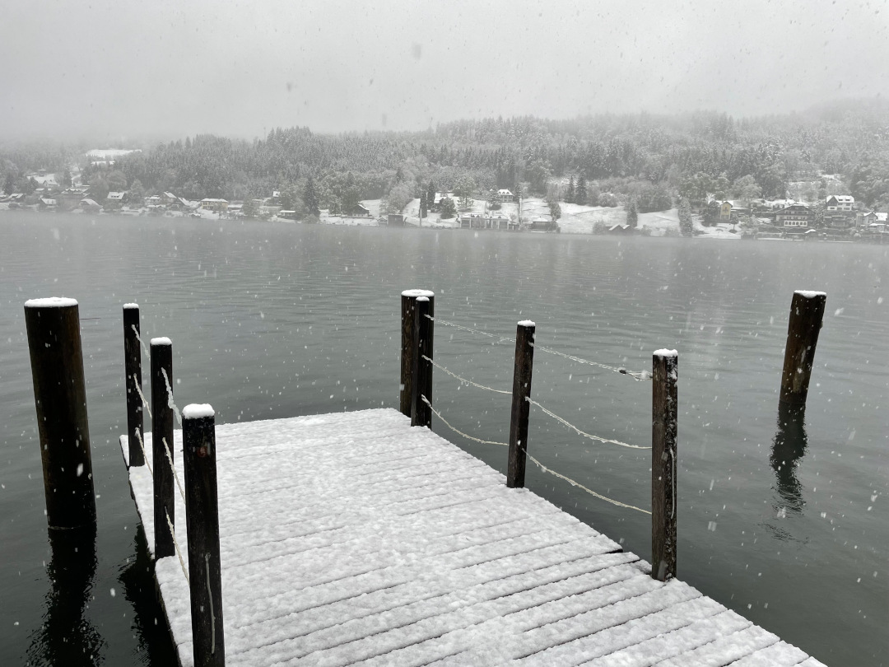
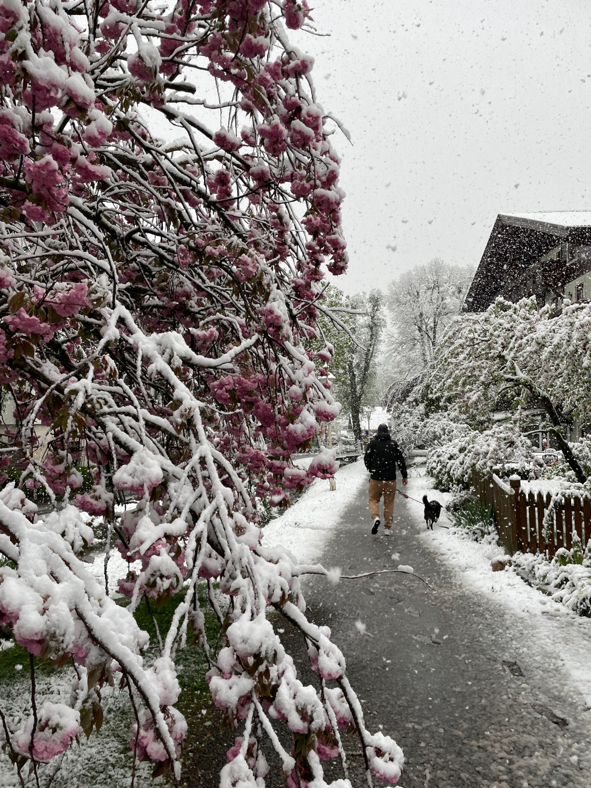
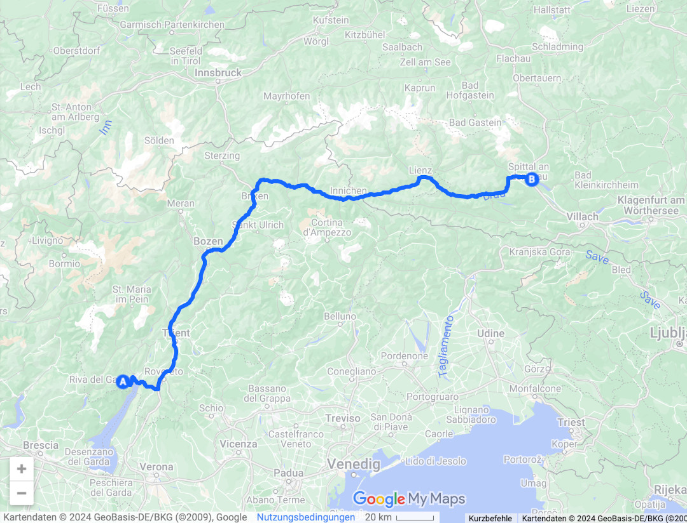
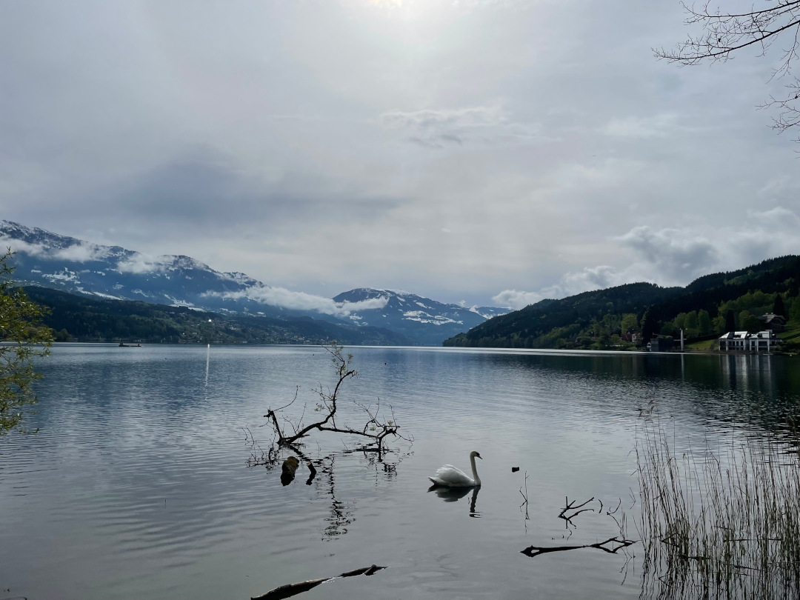
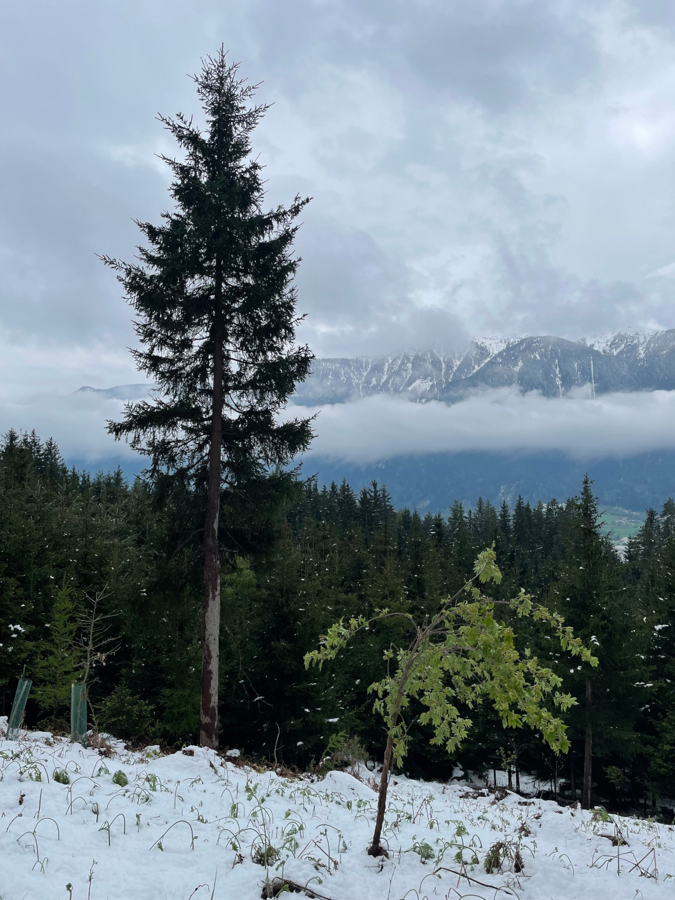
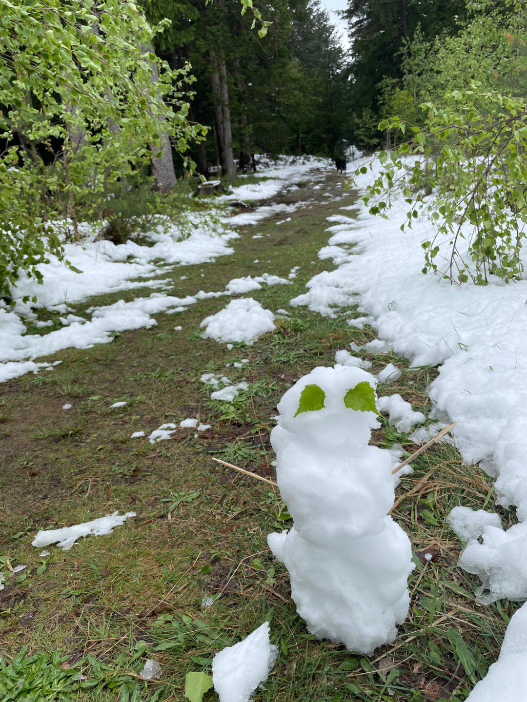
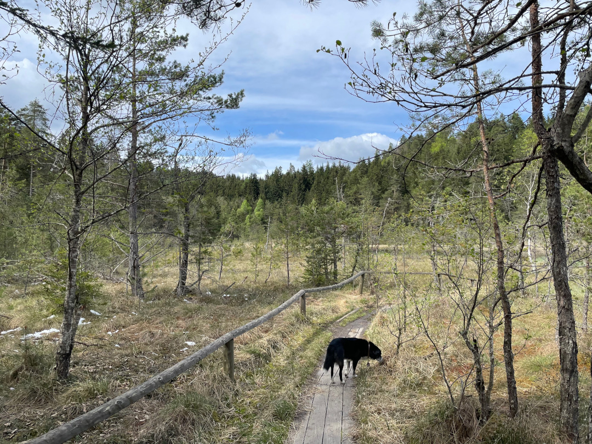
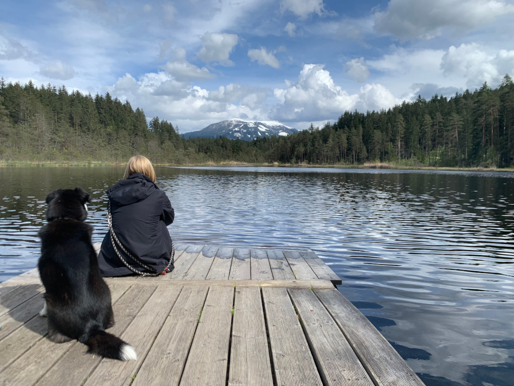
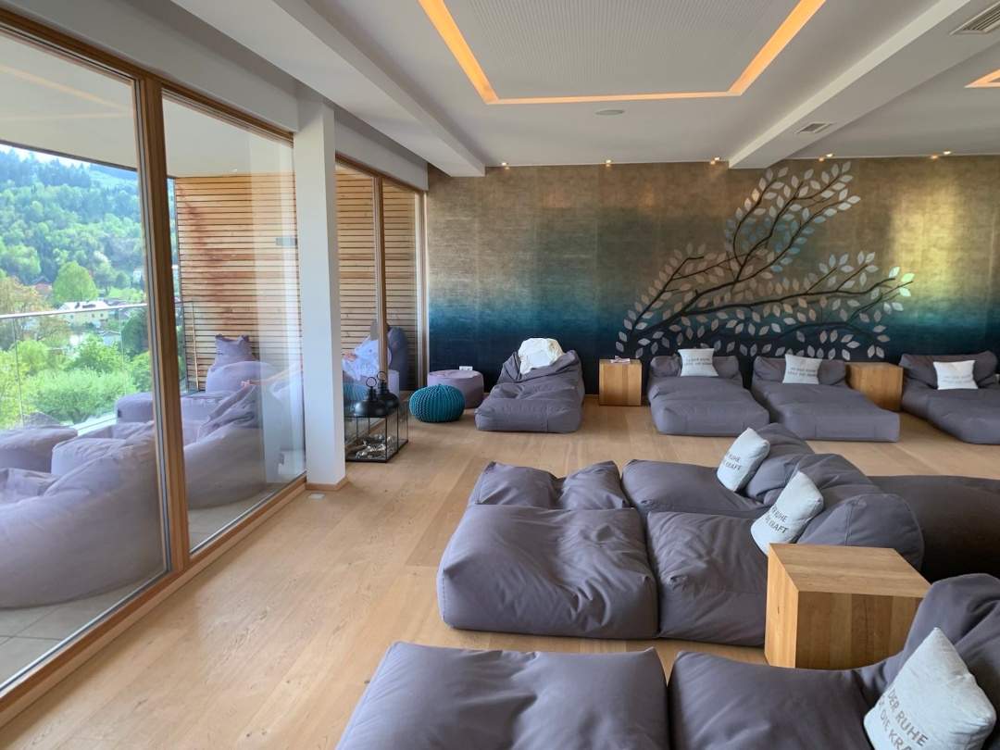

Seit 12 Wochen sind wir jetzt unterwegs und gönnen uns in Österreich eine kurze Pause von unserem Bulli-Leben.

<!--more-->

🗓️ 16. April: Die Kurzfassung des heutigen Tages: Von Sommerurlaub zu Winterurlaub und 14 Grad weniger in nur fünfeinhalb Stunden Fahrt. Das müssen wir erstmal verdauen. Aufwachen tun wir bei Sonnenschein und 14 Grad am Ledrosee und spazieren noch eine gemütliche Runde am See entlang. Dann legen wir einen neuen Rekord hin und sind schon vor 9 Uhr wieder auf der Straße und düsen nach wie vor auf mautfreien Strecken weiter. Einen typischen Italien-Abreise-Einkauf mit Nudeln, Pesto und Keksen lassen wir uns natürlich nicht nehmen. Mittags halten wir in Südtirol noch in einem kleinen Ort für einen Waldspaziergang, bevor es an den Dolomiten vorbei über die österreichische Grenze geht. Auf einem Wetterumschwung von Sonne zu Wolken, leichtem Regen und ein paar Grad weniger haben wir uns eingestellt, aber was uns dann erwartet gleicht einem kleinen Kulturschock. Es schneit richtig dicke Flocken, Räumfahrzeuge fahren direkt vor uns und überall wird es immer weißer. Als wir im Hotel ankommen, läuft John Lennons ‚War is over‘. Wir fühlen uns, als wären wir nicht nur in einem anderen Land, sondern gleich in einer anderen Jahreszeit gelandet. Es ist noch etwas ungewohnt, dass alles wieder auf Deutsch geht und jeder uns versteht, auch wenn es auf dem Weg durch die Zweisprachigkeit in Südtirol ja schon langsam immer mehr wurde. Auf dem Weg waren wir sogar im Obi, um noch ein paar Kleinigkeiten zu besorgen. Irgendwie verrückt. Wir schnappen uns Henry und drehen direkt eine erste Runde am Millstätter See. In einer Mischung aus Schneefall und Tauwetter stapfen wir durch die Gegend und merken mal wieder, was es bedeutet zu frieren und kalte Füße zu kriegen. Umso besser, dass es danach für uns in die Sauna geht, mit Blick auf die weißen Baumspitzen und den See. Bei dem Wetter tut das besonders gut und danach können wir auf der Terrasse perfekt abkühlen. Später geht unser kleiner Kulturschock dann weiter. Natürlich wollen wir uns die deftige österreichische Küche nicht entgehen lassen. Die Karte in unserem Hotel überzeugt uns dafür nicht so. Wir denken, dass wir eh Auswahl haben, aber viele Restaurants um uns herum haben die Küche schon nicht mehr auf und wir werden mehrmals ohne Essen wieder weggeschickt. Sie schließen einfach um 18 oder 20 Uhr. So bleibt am Ende für uns mal wieder nur ein Dönermann im nächsten Ort und der gute Vorsatz morgen früher dran zu sein. Abends gucken wir noch das BVB-Spiel, das zum Glück spannender und sehenswerter ist als das in Madrid.

🗓️ 17. April: Der Tag startet mal wieder mit einer Spazierrunde am See. Heute ist es schon wieder deutlich weniger winterlich, der Schnee ist von den Blüten an den Bäumen wieder runter und nur die Reste sind noch auf dem Boden zu sehen. Scheint so, als hätten wir gestern einfach gutes Timing gehabt. Als wir zurück sind, schläft sich Henry (der glaube ich denkt das Hotel ist unsere neue Wohnung und sich sehr zuhause fühlt) erstmal aus, während wir zum Frühstücksbuffet gehen. Am meisten freuen wir uns wohl über Frühstückseier. Die gab es für uns länger nicht. Genau genommen nicht mehr seit dem der Eiermacher von Moulay Bousselham uns wieder verlassen hat. Anschließend machen wir eine kleine Wanderung durch den Wald zum nächsten Ort St. Wolfgang und sind dann wieder bereit für die Sauna. Heute ist mehr Zeit für Entspannung und Lesen als gestern und wir sind trotzdem noch rechtzeitig, um endlich in einem österreichischen Wirtshaus zu essen. Tobi freut sich wohl am meisten über seine erste Spezi der Reise.

🗓️ 18. April: Wir können es kurzhalten, weil wir den gestrigen Tag eigentlich einfach nochmal wiederholen. Nach der Henry-Runde gibt es heute beim Frühstück auch Waffeln mit Sirup, Sahne und Obst, kleine Donuts und Kuchen. Wir schlemmen uns also so durch. Danach fahren wir nach Spittal, weil wir beide beim Friseur ausnutzen wollen, dass wir ganz leicht sagen können, wie der Schnitt werden soll. Auch die Gelegenheit bei DM ein paar Vorräte aufzufüllen, lassen wir uns nicht nehmen. Dann geht es für eine kleine Wanderung zum Egelsee, der in einer Moorlandschaft liegt. Trotzdem gibt es einige Badestellen, die über Holzbohlen zu erreichen sind. Es ist richtig schön hier und wir sind ganz allein. Das Ganze weckt auf jeden Fall Schweden-Erinnerungen. Leider ist es definitiv zu kalt und es gibt etwas zu viele Kaulquappen in dieser Jahreszeit, um reinzuspringen. Wir genießen die Ruhe noch eine Weile und machen uns dann auf den Rückweg zum Hotel. Sauna und Terrasse warten schließlich schon auf uns. Ein Schnitzel noch und dann ist unsere Österreich-Zeit auch fast schon wieder vorbei. Unsere Akkus sind auf jeden Fall wieder aufgeladen. Die kleine Bulli-Pause hat sich also gelohnt.

