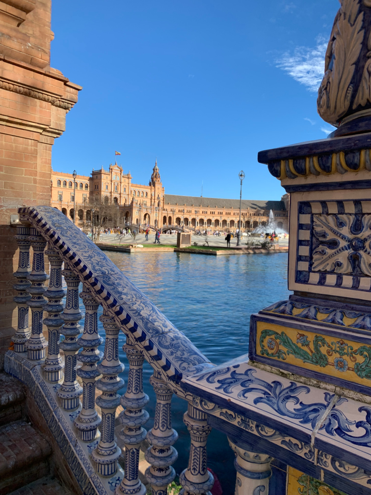
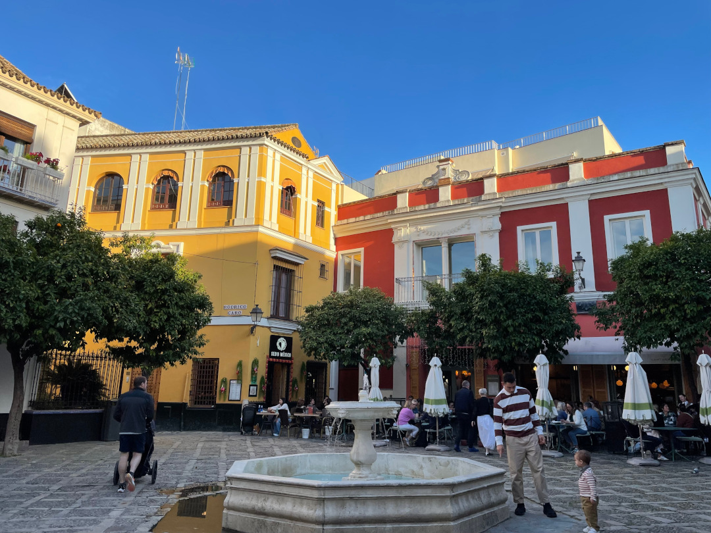
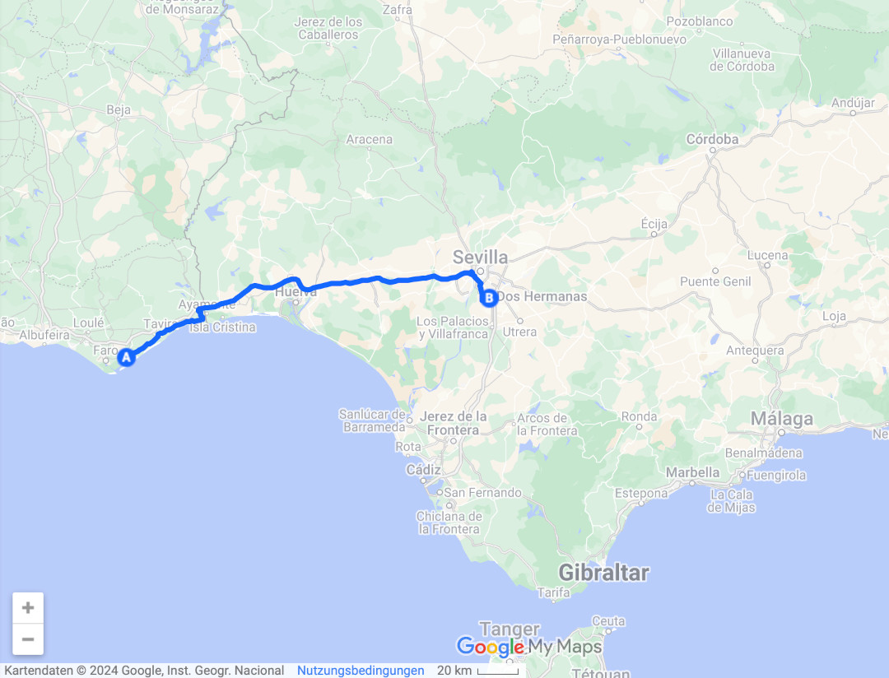
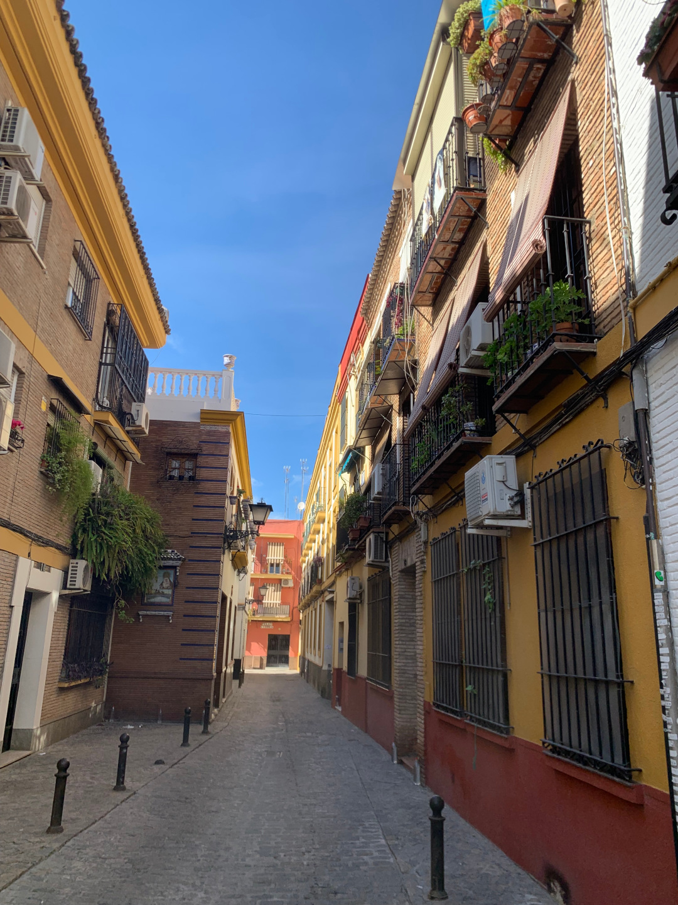
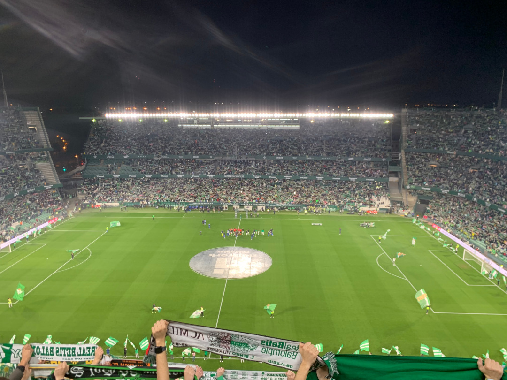

Nach knapp drei Wochen verlassen wir Portugal und fahren nach Südspanien. Der erste Stopp ist Sevilla.

<!--more-->

🗓️ 17. Februar: Die Zeit in Portugal ist vorbei. Als Highlights bleiben wohl der Nationalpark Peneda-Gerês, Nazaré und im Allgemeinen die Westküste in Erinnerung. Uns war noch nicht ganz klar, wohin uns die Reise dann in Südspanien noch führen soll, aber ein paar Tage vorher haben wir uns für Sevilla entschieden. Auf den Bildern sieht Sevilla auf jeden Fall sehenswert aus. So fahren wir dann morgens von Olhâo nach Sevilla. Den portugiesischen Teil der Strecke fahren wir noch unten an der Küste entlang und in Spanien dann auf die mautfreie Autobahn. Das Tanken verlegen wir mit letzter Reserve nach Spanien, was sich auf jeden Fall lohnt, so sparen wir 30 Cent pro Liter. Beim Tanken wollen wir auch etwas Luft auf unsere Reifen machen. Dabei merken wir, dass das Ventil des linken Hinterrads kaputt ist. Wenn der Verschluss drauf ist, geht es aber. Wir entscheiden am Montagmorgen in die Werkstatt zu fahren. Unser Campingplatz liegt ca. 15 km südlich von Sevilla und ist für einen Stadtcampingplatz wirklich gut und auch nicht überfüllt. Leider kommt der Bus ins Zentrum nur alle anderthalbstunden, so dass wir uns beeilen den nächsten Bus zu bekommen. Wir fahren direkt zum Plaza de España, dem größten Touristenziel in Sevilla. Das Wetter ist top und es ist samstags, also sind wieder genug andere Leute unterwegs. Der Platz und die Gebäude wurden größtenteils für die 1929 stattgefundene iberoamerikanische Ausstellung errichtet. Trotz der vielen Menschen lohnt sich der Besuch auf jeden Fall. Wieso aber man auf diesem Platz noch mit einer Kutsche durch die Massen fährt, oder auf dem ca. 100 qm großen Wassergraben mit dem Ruderboot fahren muss, weiß ich nicht. Immerhin kurbelt es das spanische BIP an. Danach geht es über den Königspalast zur Kathedrale von Sevilla, in der Christopher Kolumbus begraben liegt. Danach schlendern wir noch etwas durch die Altstadt und genießen das Wetter. Es sind viele Menschen unterwegs und man merkt, dass Sevilla eine Universitätsstadt ist. Mit etwas Rennen schaffen wir es den pünktlich zur Bushaltestelle, bevor wir ansonsten 1,5 Stunden hätten warten müssen. Wir nutzen die Lage des Stadtcampingplatzes und steuern als letzte Tat des Tages einen Burger-Laden an.  

🗓️ 18. Februar: Wir lassen den Tag entspannt starten und entscheiden uns noch einen zweiten Tag Sevilla anzugucken. Wir haben die sonntäglichen Öffnungszeiten der Supermärkte aus Portugal auch einfach auf Spanien übertragen. Wie wir feststellen müssen, ist das aber leider nicht so. Der Großteil der Supermärkte in Spanien hat sonntags geschlossen. Wir finden aber eine sehr gute Bäckerei in der Nähe des Campingplatzes. Nach dem Frühstück geht es erneut mit dem Bus ins Zentrum. Wenigstens fährt er auch sonntags alle anderthalbstunden. Heute aber leider nicht bis zum Plaza de España, weil an diesem Sonntag der Sevilla-Marathon ist. Daher müssen alle Fahrgäste ca. 3 km vor dem Zentrum aussteigen und den Rest laufen. Zum Glück führt uns dieser Weg direkt am Estadio Benito Villamarin vorbei. Heimat von Betis Sevilla, die heute Abend ihr Ligaspiel absolvieren. Dazu gibt es im Online-Ticketshop leider nur Tickets ab 90 Euro. Wir wollen unser Glück direkt am Stadion versuchen. Zum Glück gibt es wie fast überall willige Helfer, die einem ein günstiges Ticket andrehen können. Ich leihe mir den Mitgliedsausweis eines Portugiesen und kaufe mir ein deutlich günstigeres Ticket. Danach zieht es uns auf die andere Seite des Flusses Guadalquivir, der Sevilla teilt. Hier ist es weniger touristisch, aber nicht unschöner. Auch heute sind wieder super viele Menschen unterwegs. Überall sitzen die Menschen und essen bzw. trinken. Eine sehr entspannte Atmosphäre. Wir laufen durch die engen Gassen und genießen den Sonntag. Bis zum Fußballspiel heute Abend sind es noch ein paar Stunden, deshalb entscheiden wir noch zurück zum Campingplatz zu fahren. Zumal Hanna die hohen Ticketpreise boykottiert und kein Ticket gekauft hat. Leider verpassen wir dieses Mal den Bus so unglücklich, dass wir noch mehre Kilometer vorlaufen können, ehe wir in den Bus einsteigen. Wegen der geschlossenen Supermärkte können wir heute nicht selbst kochen, daher suchen wir noch etwas die Umgebung ab. Da die spanischen Restaurants allerdings erst sehr spät öffnen, nur mit mäßigem Erfolg. Wir entscheiden uns doch zusammen zum Stadion zu fahren, um dort noch etwas zu essen. Das Drumherum eines Fußballspiels in Spanien (und generell in Südeuropa) gleicht eher einer Kirmes. Überall stehen Verkaufsbuden und rollende Imbissstände, die Kneipen bleiben quasi leer. Das hilft uns zumindest bei der Essenssuche. Ich glänze mit meinen spanischen Kenntnissen: Una Cerveza por favor. Danach macht Hanna sich wieder auf den Weg zum Bulli und ich auf den Weg ins Stadion. Unterwegs will man quasi alles verkaufen, was es gibt. Ich kann Bilder von den Betis-Spielern kaufen und wenn ich die kaufe, dann schießen die heute ein Tor. Das Stadion ist riesig, auch wenn es „nur“ 60.000 Plätze fasst, davon sind heute ca. 50.000 belegt. Die Auswärtsfahrer sind knapp zweistellig. Auf einem Sonntagabend um 21 Uhr auch nicht verwunderlich. Das Spiel ist kein Leckerbissen und endet 0:0. War im Endeffekt auch klar, weil ich ja kein Bild gekauft habe. Somit konnte auch niemand ein Tor schießen. Mit dem Bus und 40 Minuten Verspätung geht es für mich zurück zum Bulli.

