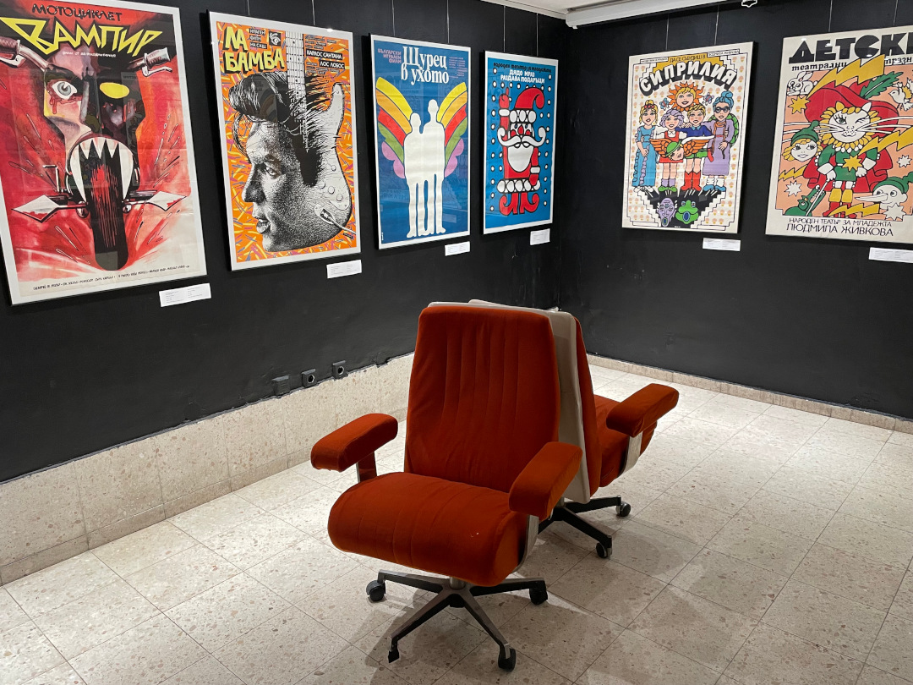

Nach den ersten Nächten im bulgarischen Balkangebirge zieht es uns in die Hauptstadt.

<!--more-->

🗓️ 17. Mai: In der Nacht regnet es etwas und hört aber passend zum Sonnenaufgang auf, so dass wir zum Glück trocken aufstehen können. Wir packen alles zusammen, gehen nochmal mit Henry und verabschieden uns von den englischen Besitzern. Auf dem Weg nach Sofia gehen wir das erste Mal in Bulgarien einkaufen. Auch hier sind größtenteils die deutschen Supermarktketten vertreten. Wie in Rumänien und Moldau also hauptsächlich Lidl und Kaufland. Und noch eins ist hier überall gleich: die Läden sind immer super voll. Egal ob dienstagmittags oder samstagmorgens, es ist immer voll. Trotz der kyrillischen Schriftzeichen findet man aber alles wieder. Wir besorgen uns Frühstück und fahren noch weitere drei Stunden nach Sofia. Nach etlichen Kilometern können wir sogar rund um Sofia wieder etwas Autobahn fahren. Die restlichen Straßen sind aber nur mäßig gut ausgebaut. Das verleitet natürlich zu riskanten Überholmanövern, weil es in jeder Richtung nur eine Spur gibt. Man muss jederzeit mit Gegenverkehr auf der eigenen Spur rechnen und teilweise bremsen und ausweichen, weil jemand von der anderen Spur überholen möchte. An vielen Stellen auf den Straßen sieht man Kreuze und Blumen. Wir kommen aber sicher und heile in Sofia an. Unsere Unterkunft liegt im Studentenviertel und im Grünen, also perfekte Voraussetzungen. Nach einer ersten Erkundungstour machen wir uns mit dem Bus auf zum Lokomotiv-Stadion im Norden der Stadt. Busfahren funktioniert hier genauso wie in Bukarest mit der Kreditkarte. Eine Fahrt kostet 80 Cent, man kann aber am Tag nicht mehr als 4 Euro verfahren. Am Stadion angekommen deutet nichts darauf hin, dass hier gleich Lokomotive Sofia gegen Botev Vratsa spielt. Es geht hier um die Relegation der ersten Liga in Bulgarien in einem echt schicken Stadion. Wir laufen einmal komplett ums Stadion und sehen nur ein paar Gästefans. Wir kaufen uns zwei Tickets für die Haupttribüne und lassen uns überraschen. Zeitgleich bekommen wir mit, dass die Heimfans von Lokomotive aktuell nicht das Stadion besuchen dürfen. Es wird also ein trostloser Kick: In einem Stadion, in das 20.000 Menschen reinpassen, sind nicht mal 1.000 Personen da. Die besten Zeiten des Stadions sind wohl eh vorbei und es ist nur noch eine Frage der Zeit, bis es nicht mehr bespielt werden darf. 2001 fand hier noch das bulgarische Pokalfinale statt, auch Elton John hat hier schon gespielt. Das Spiel endet 1:1 und damit ist der Gast aus Vratsa abgestiegen. Die ca. 50 Gästefans hatten trotzdem Spaß. Auch als sich in der Halbzeit ein ca. 30 Mann-Mob von Lokomotive dem Stadion näherte, aber von der Polizei abgeschirmt wurde. Man merkt vom gesamten Drumherum, dass hier nur einer der kleineren Vereine aus Sofia spielt. Dennoch wurde Länderpunkt Nummer 30 bzw. 13 gefeiert. Nach dem Spiel nehmen wir wieder den Bus zurück und testen uns durch die gastronomische Vielfalt im Studentenviertel.

🗓️ 18. Mai: Wir starten entspannt in den Tag und gehen mit Henry durch die umliegenden Parks. Sofia ist an einigen Stellen sehr grün. Im Hintergrund der Betonblöcke sieht man die Gipfel des Rila Gebirges, teilweise sogar noch schneebedeckt. Das passt nicht zu dem Bild, das wir von Sofia hatten. Natürlich gibt es auch riesige Betonblöcke, schlechte Straßen und Autos, die fast auseinanderfallen. Aber wir merken schon, dass wir die ehemalige Sowjet-Zone verlassen haben und nun eher im Balkan sind. Am meisten merkt man das beim Essen. Viel gegrilltes Fleisch, viele Spieße, Zaziki oder Kebap. Gibt schlimmeres. Ich nutze die Gelegenheit und suche mir einen Friseur. Mit Englisch kommt man hier eigentlich sehr weit. Auch mein Friseur spricht gutes Englisch, aber trotzdem ruft er einen Freund an, der deutsch spricht, damit ich mich mit ihm unterhalten kann. Dabei geht es nur nebensächlich um die Frisur. Jeder freut sich einen kennenzulernen und fast jeder hat einen Bezug zu Deutschland. Viele sagen auch, dass sie gerne dort leben würden, schon gelebt haben oder Verwandte dort haben. Nach dem Friseur inkl. Bart und Augenbraun geht es erneut zum Fußball. Heute spielt CSKA Sofia und ist das komplette Gegenteil zum gestrigen Spiel. Deutlich mehr Zuschauer und CSKA hätte sogar noch die Chance auf die Meisterschaft. Wir fahren wieder mit dem Bus, diesmal zum Nationalstadion. Auch hier ist das Stadion deutlich zu groß, aber immerhin kommen fast 5.000 Menschen. CSKA spielt 2:2 gegen Krumovgrad und kann nun doch kein Meister mehr werden. In der Heimkurve standen knapp 1.000 Fans, der Rest auf der Haupttribüne. Gästefans waren erlaubt, aber es kam niemand. Wie immer nehmen wir auch den Bus zurück und tun dasselbe wie gestern: Wir suchen uns eins der unzähligen Restaurants.

🗓️ 19. Mai: Gestern waren es noch 25 Grad und Sonne und heute werden wir mit 15 Grad und Regen geweckt. Und das ausgerechnet an dem Sightseeing-Tag. Wir gehen mit Henry durch den heute matschigen Park und machen uns dann auf den Weg in die Innenstadt. Wir fahren mit dem Bus zum Vitosha Boulevard. Es gibt zwar eine Metro in Sofia, aber der Bus ist meistens flexibler. Der Vitosha Boulevard ist zwar die Fußgängerzone, aber besteht fast nur aus Restaurants. Die Geschäfte sind in großen Malls am Rande der Stadt. Wir finden noch einen kleinen Laden der Street Art aus Sofia verkauft und unten noch eine kleine Galerie hat. Es sieht zwar cool aus, für uns ist aber nichts dabei. Am Ende des Boulevards steht die Kathedrale Sweta Nedelja, direkt gegenüber der Banja-Baschi-Moschee und der Sofioter Synagoge. Alle drei Religionen im Umkreis von 300 Metern. Wir beschließen die Synagoge zu besichtigen, was zwar generell möglich ist, aber deutlich schwieriger als erwartet. Wir müssen von außen klingeln, werden über die Kamera angesprochen, was wir wollen. Dann geht das Tor auf und wir stehen vor einem weiteren Zaun. Wir werden gefragt, wo wir herkommen, und die Ausweise werden kontrolliert. Danach folgt die Kontrolle wie am Flughafen. Dann dürfen wir den Bereich der Synagoge betreten. Wir bezahlen ca. 5 € Eintritt für uns beide und können uns das erste Mal in unserem Leben eine Synagoge von innen angucken. Es hat sich auf jeden Fall gelohnt und es sind sogar Fotos erlaubt. Danach machen wir einen Abstecher zum bulgarischen Parlament, bevor wir zur Alexander Newski Kathedrale gehen, der größten Kathedrale und der berühmtesten Sehenswürdigkeit der Stadt. Der Zugang hier ist deutlich einfacher möglich. Wir laufen noch etwas durch alternative Viertel rund um die Tsar Shishman Straße. Hier finden wir noch einen coolen Buchladen, in dem wir allerdings aufgrund der Sprachbarriere auch nicht fündig werden. Danach laufen wir zurück ins Studentenviertel und essen wie immer sehr gut. Nach sehr vielen Schritten endet der Besuch in Sofia.

