Von der Mittelmeerküste geht es weit ins Landesinnere nach Göreme in Kappadokien, was schon im Vorfeld unser Top-Ziel für die Türkei war.

<!--more-->

🗓️ 17. Juni: So wie wir den Tag gestern beendet haben, so beginnen wir ihn heute und verabschieden uns dann für längere Zeit vom Mittelmeer und fahren in die Zentraltürkei nach Kappadokien. Für die knapp 600 km benötigen wir etwas über sechs Stunden. Auf dem Weg werden wir das erste Mal von einer der vielen Polizeikontrollen herausgewunken. Es wird allerdings nur ganz kurz der Führerschein kontrolliert und nach ein paar Sekunden können wir weiterfahren. Je weiter wir ins Landesinnere fahren und je mehr Meter wir hochfahren, desto kälter wird es auch. Zeitweise fällt das Thermometer sogar unter 30 Grad. An einem Rastplatz machen wir eine Mittagspause und essen Gözleme. Die Frau, die es verkauft sitzt direkt am Ofen und backt das Brot frisch. Belegt wird es dann mit Spinat, Petersilie und Käse und ist super lecker. Wir gehen noch eine Runde mit Henry mit Blick auf die umliegenden Berge. Am frühen Abend kommen wir dann in Göreme an. Hier haben wir uns für einen Campingplatz entschieden, der eine Top-Aussicht auf die Felsformationen im Tal bietet. Wir verzichten allerdings auf einen Premiumplatz direkt mit Blick aufs Tal, sondern ziehen den Schatten vor. Wir gehen im Ort noch fix einkaufen, weil wir heute mal wieder selbst den Kochlöffel schwingen wollen. Nach der Abkühlung im Pool essen wir und gucken uns dann den Sonnenuntergang über dem Tal an. Nach Sonnenuntergang lohnt sich der Blick auch auf die beleuchteten Häuser. Danach geht es aber auch schnell zurück zum Bulli, weil wir morgen früh aufstehen wollen.

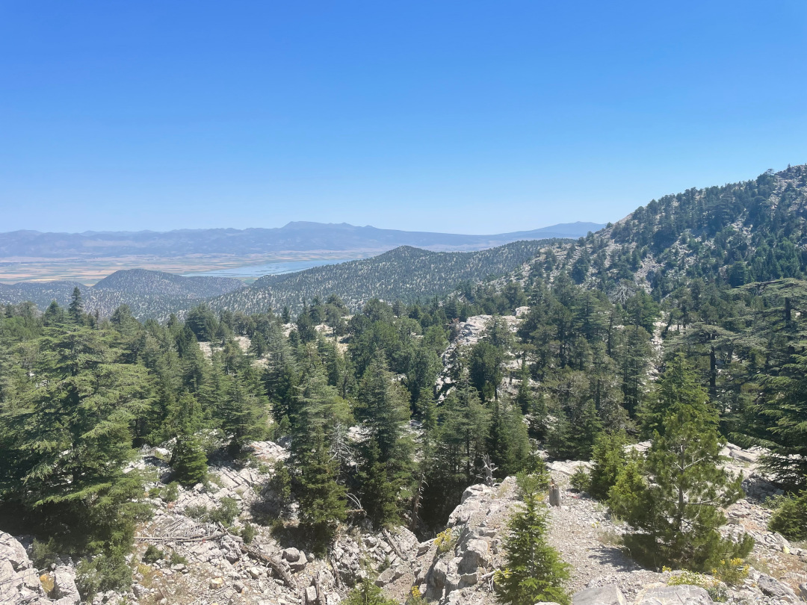

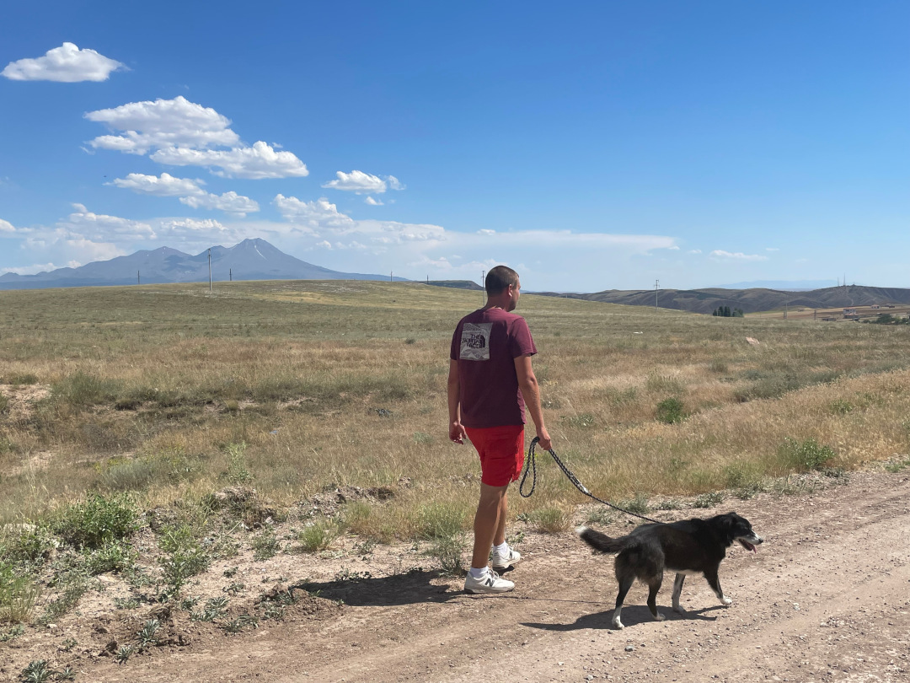

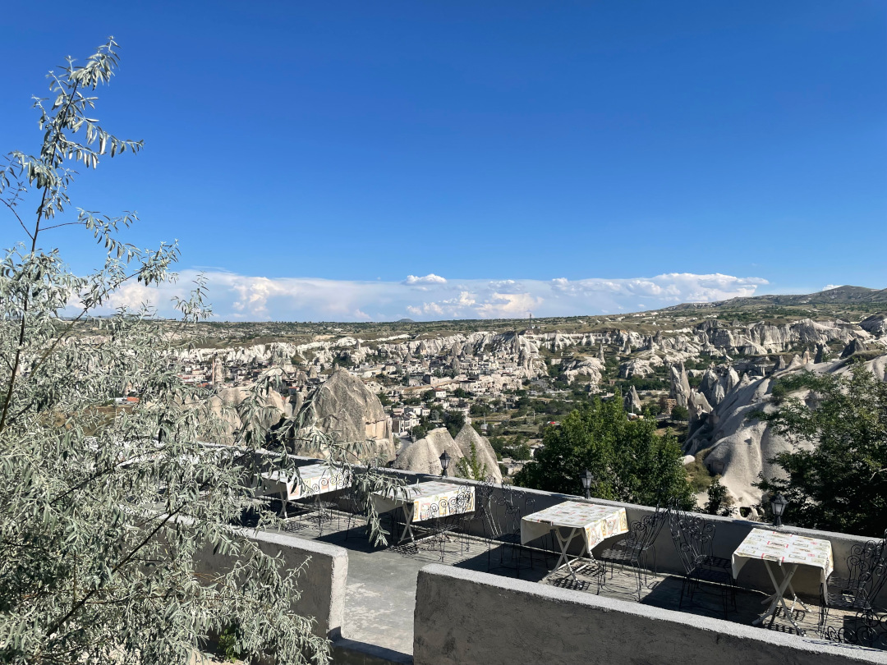

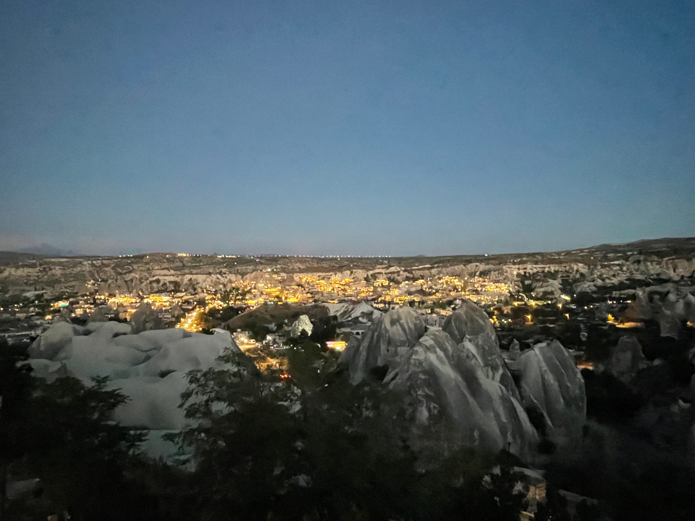

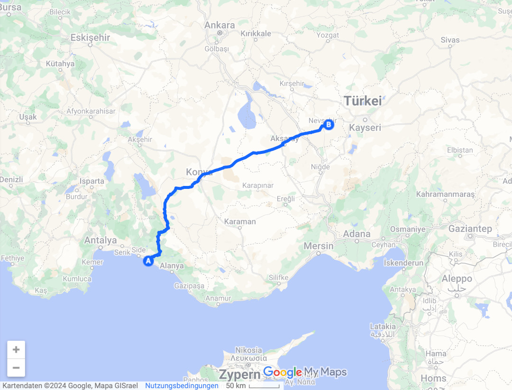

🗓️ 18. Juni: Der Wecker klingelt schon um 04:45 Uhr. Jeden Morgen bei gutem Wetter fliegen hier die Heißluftballons. Fast wie in Pamukkale, nur viel mehr und deutlich bekannter. Die ersten Ballons starten schon vor Sonnenaufgang, daher sind wir so früh unterwegs. Wir laufen vom Campingplatz etwas weiter die Schlucht entlang, um einen ungestörten Blick auf das Tal und die Ballons zu haben. Wir sind wirklich zur perfekten Zeit aufgestanden und zählen exakt 96 Luftballons. Zum Sonnenaufgang mit den Felsformationen und den Bergen im Hintergrund ist das eine der besten Aussichten der Reise. Allein dafür lohnt sich schon die Reise in die Türkei, egal wie voll es am Mittelmeer ist. Nach dem sehr frühen Ausflug versuchen wir noch etwas zu schlafen, was auch halbwegs funktioniert, weil wir ja zum Glück im Schatten stehen. Auf dem Weg zu unserer morgendlichen Henry-Runde wird Henry noch auf dem Campingplatz dann erneut Opfer der aggressiven türkischen Wachhunde. Bisher hielten sich die Bisse in Grenzen und man konnte immer noch einschreiten, was aber jetzt nicht mehr richtig möglich ist. Nur der Besitzer, übrigens auch ein Gast auf dem Campingplatz, kann seinen Hund wortwörtlich von Henry runterziehen und so Schlimmes verhindern. Die Wachhunde sind deutlich schlimmer als die Straßenhunde, die man noch ganz gut vertreiben kann. Ein guter Schock am Morgen also. Alles in allem scheint es aber so, als wäre Henry mit einem Schreck davongekommen. Wir gehen mit ihm die Schlucht entlang und beruhigen ihn so gut es geht. Danach geht’s zu Marias Breakfast, die wohl das beste Frühstück in der Umgebung macht und das zu einem top Preis. Auch wenn es schon eher mittags ist, wollen wir auf jeden Fall hin.  Dazu gibt es noch den tollen Ausblick. Beim Bezahlen kündigen wir uns schon für morgen an. Danach geht es zurück zum Bulli, wo wir nach einer Pause noch mal etwas weiter in die Felsenschlucht wandern, was bei nur noch knapp 30 Grad wieder besser machbar ist. Danach folgt die Abkühlung im Pool. Am Abend wollen wir noch das erste EM-Spiel der Türkei gucken und denken, dass das in dem Ort schon irgendwo gezeigt wird. Der große Hype, um zusammen Fußball zu gucken ist hier aber wohl nicht so verbreitet. Wir finden ein Restaurant, wo es eher nebenbei noch gezeigt wird. Auch Autokorsos und große Party nach dem Sieg gibt es nicht, so wie man es eigentlich von den Türken in Deutschland gewohnt ist. Vielleicht ist der Ort aber auch einfach nur zu klein. Zurück zum Bulli müssen wir wieder aus dem Tal bergauf und können seit Ewigkeiten mal wieder mit vielen Schritten im Gepäck ins Bett gehen.

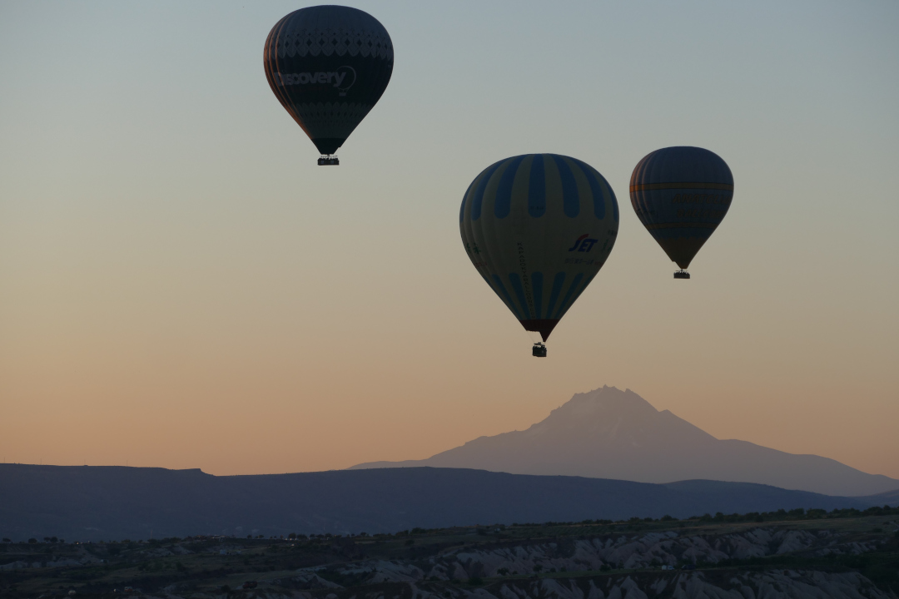

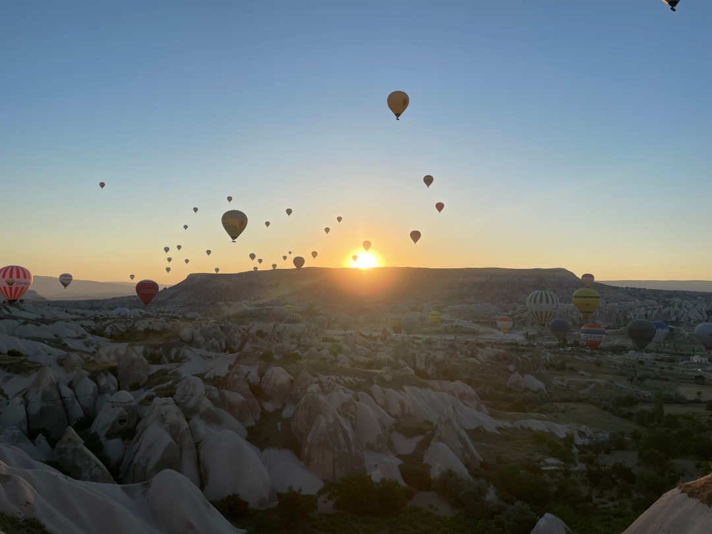

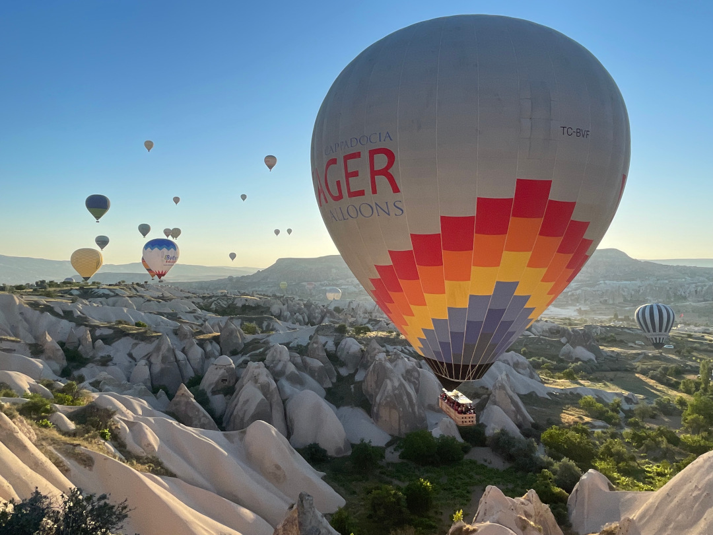

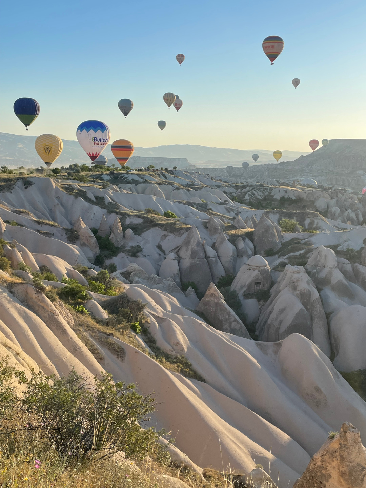

🗓️ 19. Juni: Heute klingelt der Wecker ebenfalls wieder früh, sogar noch eher als gestern (04:15 Uhr!) Wir wollen noch im Dunkeln das Leuchten der Luftballons sehen. Um diese Uhrzeit ist auch wirklich noch keiner wach. Wir haben die beste Aussicht auf die leuchtenden Ballons im Tal. Das restliche Bild kennen wir ja schon von gestern, gucken es uns aber trotzdem an, weil es einfach sehr besonders ist. Gegen sechs, spätestens sieben Uhr ist das Spektakulärste dann aber auch vorbei. Wer hier hinkommt muss also zwangsweise früh aufstehen, was auch der gesamte Campingplatz tut. Danach nutzen wir das frühe Aufstehen und versuchen gar nicht erst wieder weiter zu schlafen und gehen mit Henry. Dieses Mal zum Glück ohne Zwischenfälle. Wir laufen mit Henry und der Drohne direkt an der Schlucht entlang. Nicht nur mit den Ballons sieht es hier einzigartig aus. Als es dann langsam zu warm wird, geht es zurück zum Bulli und in den Pool. Weil wir uns ja gestern schon bei dem Frühstück für heute angekündigt haben, müssen wir Maria noch einen Besuch abstatten, was uns natürlich sehr gefällt. Auch heute wird wieder gut aufgetischt und wir genießen die Aussicht. Es ist auch heute wieder eher ein Mittagessen, aber so streng wollen wir mal nicht sein. Ansonsten verläuft der Tag wie gestern. Wir machen eine kleine Mittagspause am Bulli und planen etwas die weitere Route, insbesondere durch Armenien. Dazu mussten wir auf die Auslosung der Champions League bzw. Conference League warten, um auch in Armenien Fußball gucken zu können. In der Türkei wurde das bisher leider nichts. Die Sommerpause und die EM machen es bisher leider unmöglich. Aber wir fahren ja auf dem Rückweg noch mal durch die Türkei. Zum Abend geht es wieder runter in den Ort, wo wir ja gestern schon gut essen und Fußball gucken konnten. Wenn schon nicht im Stadion, dann am Fernsehen. Heute spielt Deutschland und wir werden mit Handschlag vom Kellner begrüßt, der sich wohl mehr über Henry freut als über uns. Nach dem Spiel heißt es wieder bergauf zum Bulli und ab ins Bett. Morgen starten ja wieder die Ballons.

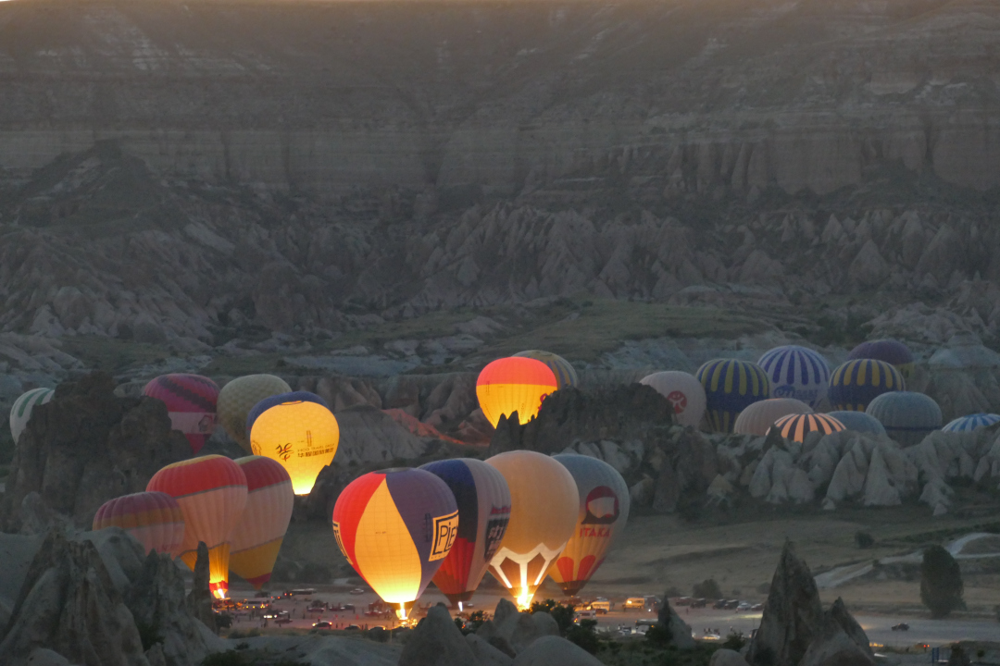

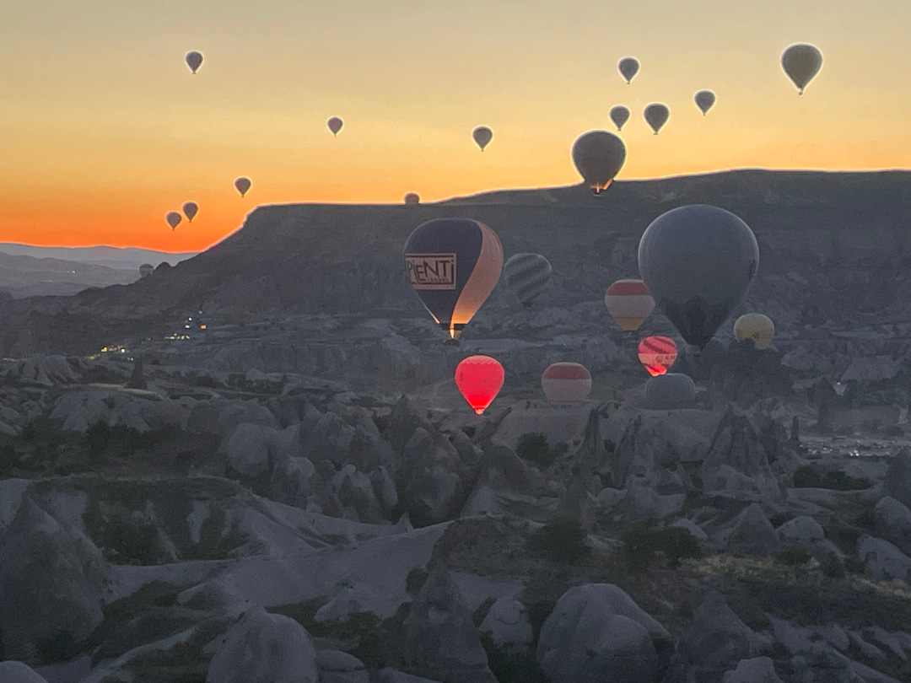

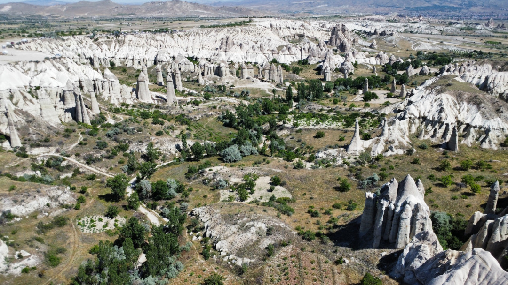

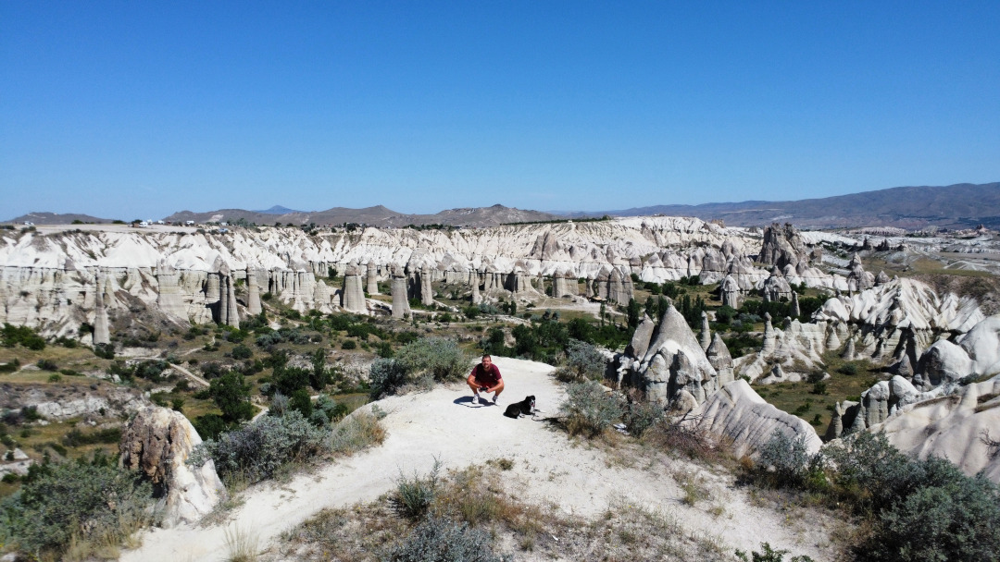

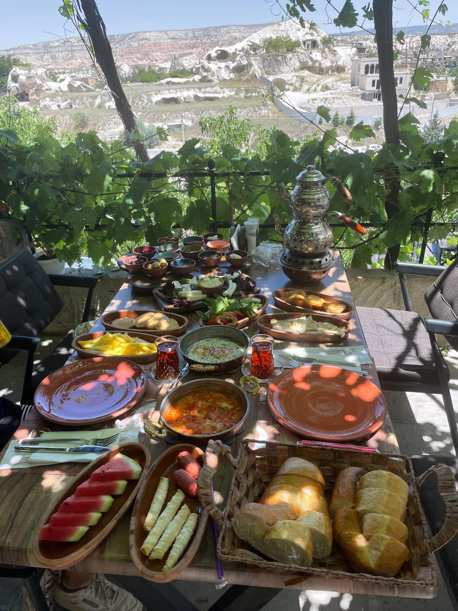

