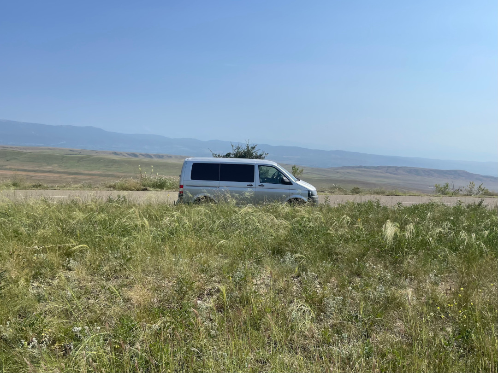
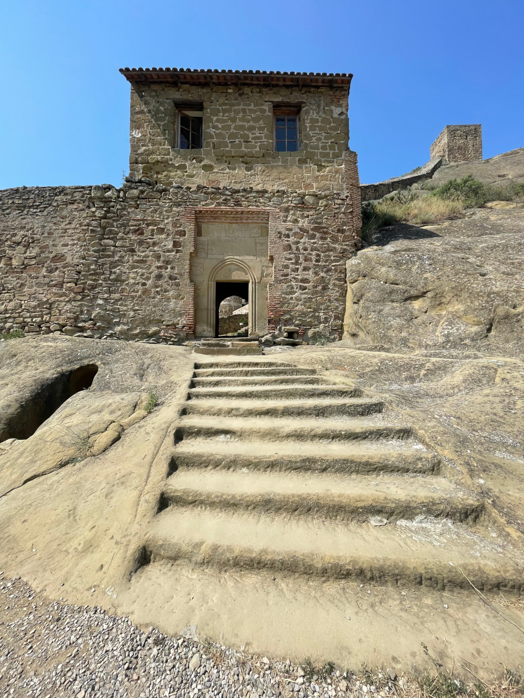
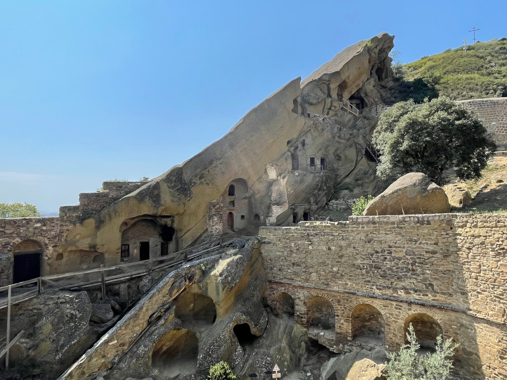
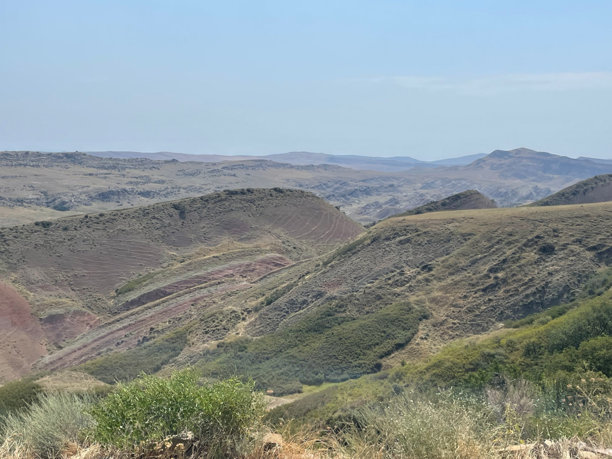
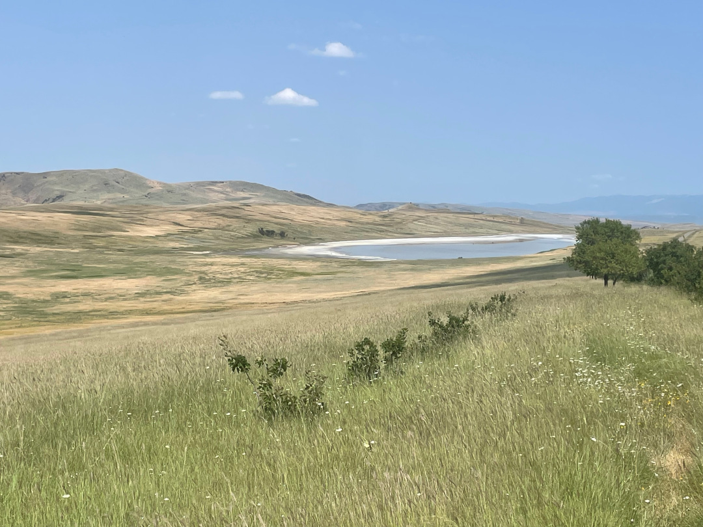
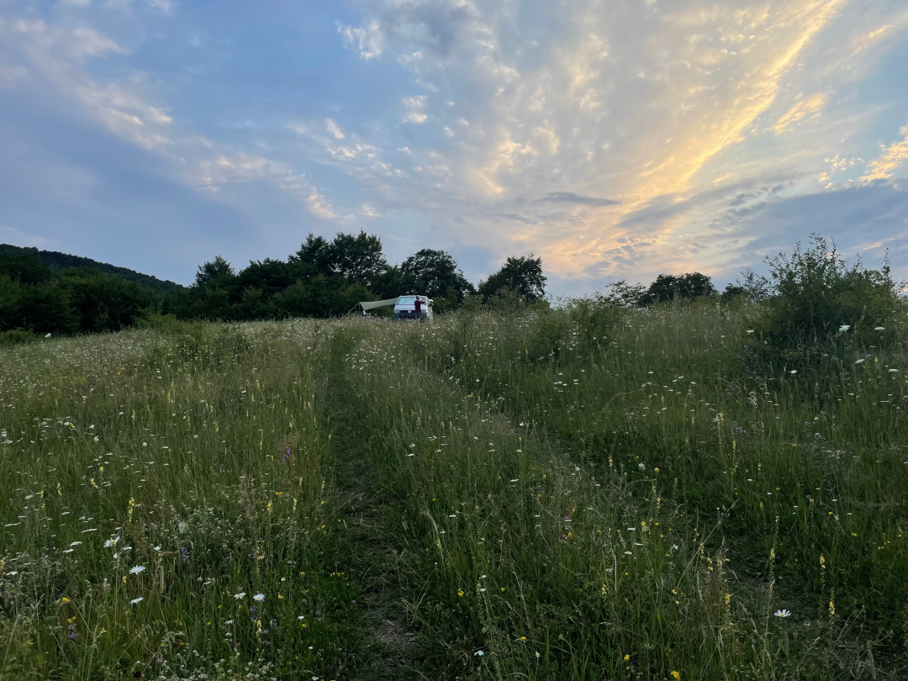
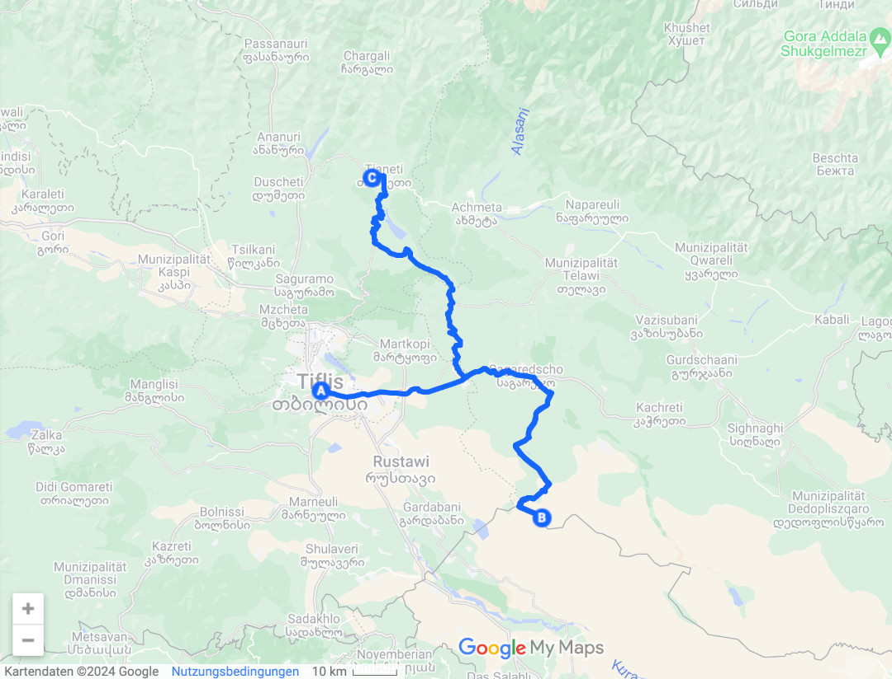
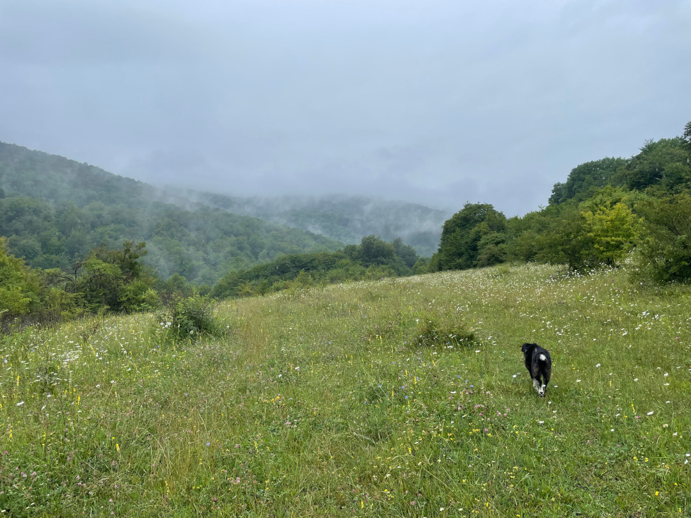
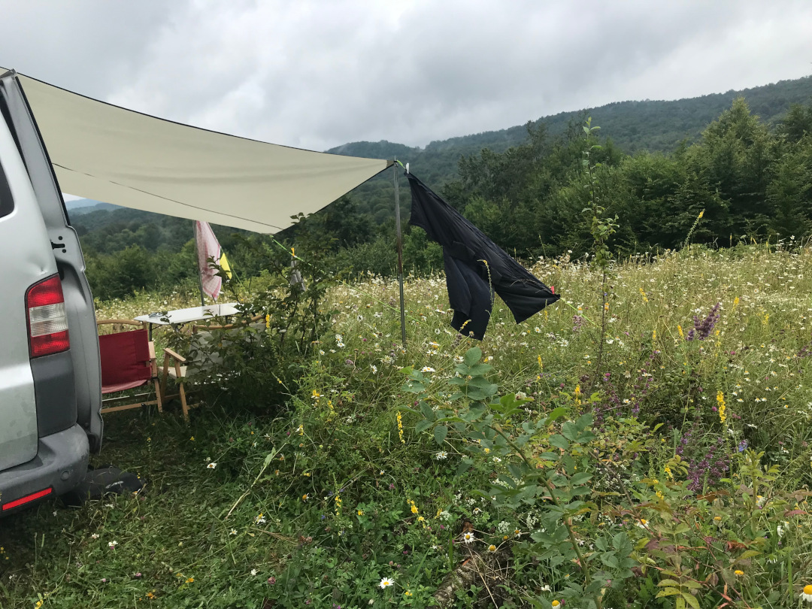

Von der Hauptstadt machen wir einen kleinen Abstecher zur georgisch-aserbaidschanischen Grenze, bevor wir weiter nach Tianeti fahren.

<!--more-->

🗓️ 17. Juli: Wir sind schon früh wach, denn heute geht’s für uns (zurück) ins Campingleben. Eine letzte Runde drehen wir noch mit Henry durch den Park. Dann parken wir das Auto aus dem Hof auf die Straße um, weil der Nachbar, von dem wir zugeparkt waren, gerade unterwegs ist. Wir packen drinnen noch alles zusammen und fahren los. Die Abfahrt aus der Hauptstadt ist wegen der Uhrzeit noch sehr gut machbar. Als Erstes geht es in Richtung Süden, wo ganz nah an der Grenze zu Aserbaidschan das Höhlenkloster David Gareja in einer sehr besonderen, kargen Landschaft liegt. Wir starten auch direkt mit unserem ersten kleinen Abenteuer, weil eine Brücke, auf die wir abbiegen müssten, gesperrt ist. Auf der Karte sehen wir keinen alternativen Weg. Deshalb wenden wir und gucken nochmal. In dem Moment fahren ein paar Einheimische gerade über einen kleinen Feldweg und dann über die Baustellen-Brücke. Wir fahren schnell hinterher, vorbei an einem großen Loch und über einen großen Huckel, aber der Bulli schafft es gut und wir sind schnell auf dem richtigen Weg. Auf dem weiteren Weg ist es schön zu sehen, wie sich die Landschaft so schnell ändert. Die verschiedenen Erdschichten leuchten in unterschiedlichen Farben und auch an einem kleinen See kommen wir vorbei. Das Kloster selbst wird noch genutzt und dementsprechend still ist es hier. Wir schlendern einmal über das Gelände, aber auf eine Wanderung zu einem weiteren Kloster verzichten wir. Schon jetzt ist es hier nämlich total heiß. Auf unserem Rückweg merken wir dann, dass es an der Brücke eine Umleitung gab und wir verbotenerweise mit den Einheimischen zusammen abgekürzt hatten. Zurück nehmen wir also lieber den offiziellen Weg. Dann geht es wieder an Tiflis vorbei. Zwei Mal haben wir noch etwas Probleme den besten Weg zu finden. Wir sind nämlich auf der Suche nach Koordinaten, von denen aus der kleine Hof ausgeschildert sein soll, bei dem wir schlafen wollen. Wir schaffen es und finden die Beschilderung. Der Weg führt noch lange über immer abenteuerlichere Feldwege mit tiefen Rillen und Furchen und wir brauchen starke Nerven, aber dann kommen wir an. Alles ist sehr einfach und provisorisch hier (zum Beispiel duschen wir in einer Plastikwanne), aber dafür können wir mitten in der Blumenwiese stehen. Weil es noch so warm ist und keinen Schatten gibt, müssen wir noch die Markise für Schatten rausholen und aufbauen. Am Abend ist das Licht noch schön, aber dann wird es so dunkel um uns herum hier im nirgendwo, dass wir früh müde sind.

🗓️ 18. Juli: Über Nacht kam ein richtiger Wetterwechsel. Auf unserer Blumenwiese ist jetzt plötzlich alles grau in grau und es regnet sich so richtig ein. Zum Glück haben wir gestern die Markise aufgebaut, denn so wird man wenigstens nicht direkt nass. Überall ist jetzt Matsch, und zwar so richtig hartnäckiger, der überall klebt. Die Entscheidung, ob wir noch eine Nacht hierbleiben, wurde uns also abgenommen. Den Weg würden wir mit dem Bulli jetzt nicht schaffen. Deshalb haben wir heute viel Zeit zu lesen, ein paar Sachen zu erledigen und die Proviantkiste zu plündern. Ab nachmittags wird es dann wieder etwas trockener. Wir wagen einen Spaziergang durch den Wald und die Blumenwiesen, die gar nicht aufhören. Aber auch dabei bilden sich um die Schuhe herum zweite Schuhe aus Matsch. Wieder am Bulli angekommen sind wir also vor allem mit Saubermachen beschäftigt.

