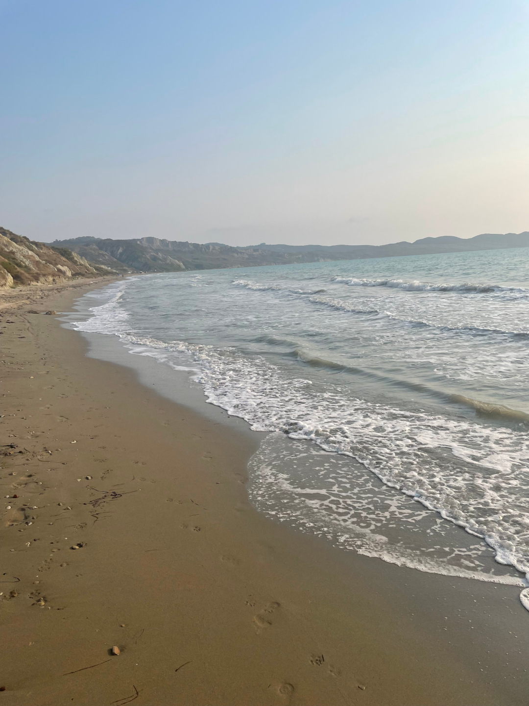
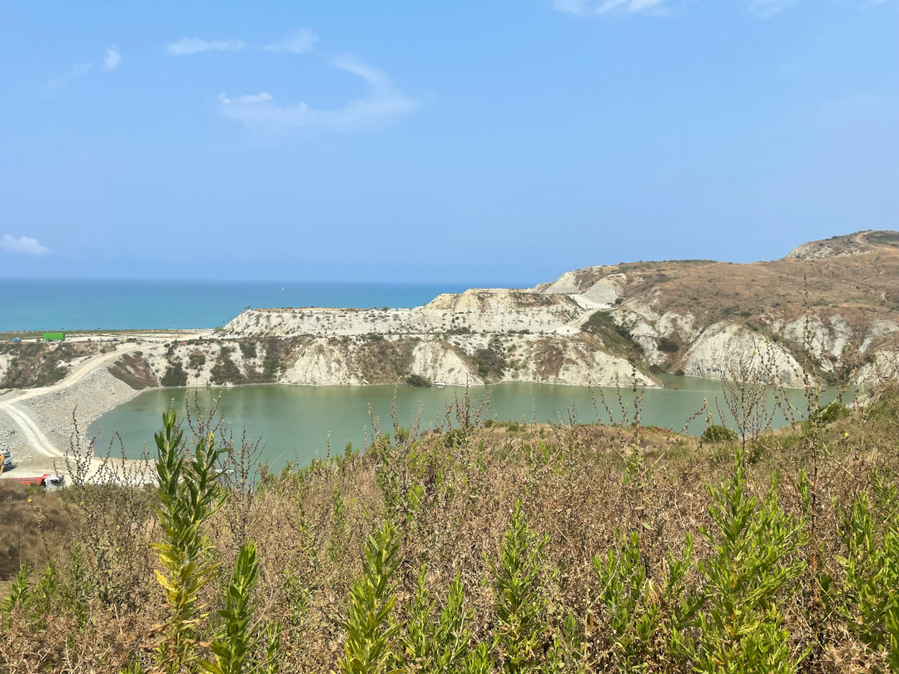

Wir verlassen Griechenland und fahren auf unserem Weg nach Norden durch Albanien.

<!--more-->

🗓️ 17. August: Die Nacht auf dem Hotelparkplatz war ruhig und sogar mit allen Türen zu einigermaßen ertragbar. Die Nachtwache hat unser neuer Freund der Straßenhunde gehalten, mit den größten Tatzen der Welt. Wir haben ihn dafür auch standesgemäß gefüttert. Die Runde mit Henry führt uns dann zum Fluss Aoos, wo man eigentlich schwimmen könnte. Wir finden aber keinen guten Platz und gehen nur mit Henry spazieren. Auf dem Hotelparkplatz ist eine provisorische Outdoor-Dusche, die auch ihren Zweck erfüllt. Danach machen wir uns abfahrbereit und fahren in Richtung der albanischen Grenze, die wir schon nach fünf Minuten erreichen. Es ist eine sehr kleine Grenze. Der griechische Beamte ist sowohl für Ein- als auch für Ausreise zuständig. Weil gerade ein Auto nach Griechenland einreisen möchte, müssen wir mit der Ausreise warten. Dann geht aber alles sehr schnell, sowohl bei den Griechen als auch bei den Albanern. Durch die eine Stunde Zeitverschiebung sind wir früher als gedacht in Albanien. Mit Grenzübertritt sind wir quasi in wieder in der anderen Welt, die wir kurz in Griechenland verlassen durften. Die Straßen werden deutlich schlechter, alle möglichen Tiere laufen über die Straßen und das Autofahren wird rücksichtsloser. Dafür haben wir einen perfekten Blick auf die albanischen Berge und machen eine kurze Pause mit Henry. Wir waren vor zwei Jahren schon mal in Albanien, aber nicht so weit im Süden. Wir fahren noch drei Stunden über die Straßen Albaniens bis wir unseren Campingplatz direkt am Meer erreichen. Kurz vorher besorgen wir uns in einem Supermarkt noch Abendessen. Auch ohne albanische Lek kommen wir mit dem Euro sehr weit. Fast alle Preise sind in Euro angegeben. Am Campingplatz angekommen stehen wir direkt am Strand und nur ein paar Meter vom Wasser entfernt. Weil der Platz noch relativ neu ist, ist es noch nicht so überlaufen. Als wir angekommen sind, stellen wir fest, dass wir vor zwei Jahren nur zweieinhalb Kilometer von hier entfernt geschlafen haben. Heute aber auf einem besseren Platz. Wir gehen eine Runde schwimmen und schwingen danach den Kochlöffel. Zum Sonnenuntergang gehen wir noch mit Henry am Strand entlang.

🗓️ 18. August: Die Nacht war von den Temperaturen noch in Ordnung. Morgens als wir aufwachen, wird es allerdings eklig. Zu den hohen Temperaturen kommt jetzt auch noch hohe Luftfeuchtigkeit. In den nächsten Tagen soll es endlich mal regnen und das kündigt sich jetzt schon an. Wir schwitzen also durchgehend. Ich finde das ist ein guter Zeitpunkt, um joggen zu gehen und laufe ein paar Kilometer am Strand entlang. Hanna geht währenddessen mit Henry durch die Dünen, die fast schon Berge sind, spazieren. Danach sind wir beide wirklich komplett nass. Wir „kühlen“ uns im Meer ab und gehen duschen. Das ist jetzt gerade wirklich die einzige Zeit am Tag, zu der man nicht schwitzt. Da vermisst man schon etwas die kühleren Räume im Haus oder in einer Wohnung, aber wir haben es uns ja selbst ausgesucht, auch wenn das mit der Luftfeuchtigkeit niemand ahnen konnte. Wir machen uns nichtsdestotrotz abfahrbereit und fahren nach Durres. Auf dem Weg halten wir bei dem selben Supermarkt wie gestern. Bis Durres sind es nur 30 Minuten, so dass wir schon mittags am Campingplatz ankommen. Viel Schatten gibt es leider nicht. Wir gehen noch eine Runde mit Henry um den See direkt nebenan und machen danach das beste bei dem Wetter: Nichts. Gegen Abend wird es kühler und wir fahren mit einem Taxi in die Innenstadt von Durres. Auch hier waren wir schon vor zwei Jahren und haben die Fähre nach Italien genommen. Heute wollen wir aber den Länderpunkt Albanien machen. Es spielt KF Teuta Durres gegen KF Byls Ballsh. Der erste Spieltag der neuen albanischen Saison. Der Taxifahrer möchte uns gerne an allen Ordnern und Schranken vorbei direkt ins Stadion bringen, seine Begründung gegenüber allen anderen ist, dass er Deutsche im Auto sitzen hat. Wir wollen aber lieber vor dem Stadion aussteigen, noch etwas essen und danach regulär ein Ticket kaufen. Essenstechnisch ist Albanien wie der Rest des Balkans, also viel gegrilltes Fleisch oder Schawarma, aber weil viele Italiener in Albanien sind oder hier ihre Wurzeln haben, gibt es überall auch richtig gute Pizza. Zwei große Pizzen und zwei Getränke gibt’s für neun Euro. Albanien ist wirklich der Pizza-Geheimtipp, noch besser als Italien. Danach geht’s ebenfalls günstig ins Stadion. Ungefähr 1.000 andere Leute haben ebenfalls den Weg dahin gefunden. Es gibt auf beiden Seiten sogar ein paar Fans mit Trommel, Banner und blauen Rauchbomben. Ansonsten ist es eher eine trostlose Veranstaltung. Fußballtechnisch ist die albanische Liga kein Leckerbissen, dafür aber spannend. Der Favorit und Meister von 2021 aus Durres liegt erst 0:1 hinten, gewinnt aber durch ein Tor in der Nachspielzeit noch 2:1. Die wenigen, die es mit Durres halten, geben auf jeden Fall ihr Bestes und rasten gut aus. Nach dem Spiel suchen wir fix ein Taxi und fahren zurück zum Campingplatz. 

